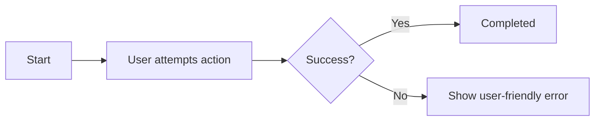

# Feature: <Feature Name>

> **Purpose:**
> This document defines a single feature's intent, scope, user experience, and completion criteria.
> It is the **single source of truth** for planning, review, automation, and execution.

---

## 0. Metadata

All metadata is defined in the frontmatter above (between the `---` markers).

**Important:** The frontmatter is used by automation scripts to:

- Create GitHub issues
- Link features to parent epics
- Generate feature flags
- Track status and ownership

---

## 1. Overview

**Briefly describe the feature and its purpose.**

- What this feature enables
- Why it exists
- What meaningful change it introduces

This section must be understandable without prior context.

## Flow Diagram

Include a focused Mermaid diagram when helpful to show the primary user journey or state transitions. Keep diagrams small and link them to related scenarios (e.g., "See Scenario 1.1").



Caption: "High-level flow for the primary user journey."

---

## 2. User Problem

**Describe the real problem experienced by users.**

Focus on lived experience rather than system limitations.

- Who experiences the problem
- When and in what situations it occurs
- What friction, confusion, or inefficiency exists today
- Why existing behavior or solutions are insufficient

---

## 3. Goals

### User Experience Goals

- How this feature improves the user’s day-to-day experience
- What becomes easier, clearer, faster, safer, or more reliable
- How the experience improves across the user lifecycle

### Business / System Goals

- Desired business outcomes
- System or platform-level improvements

---

## 4. Non-Goals

**Explicitly state what this feature does not attempt to solve.**

- Out-of-scope behaviors
- Related problems intentionally deferred
- Boundaries that protect focus

---

## 5. Functional Scope

**Describe what the feature enables at a conceptual level.**

- Core capabilities
- Expected behaviors
- System responsibilities

Avoid:

- UI design
- API definitions
- Implementation or technology choices

---

## 6. Dependencies & Assumptions

**List conditions required for this feature to function as intended.**

- Dependencies on other features or capabilities
- Assumptions about user behavior or environment
- External or organizational constraints

---

## 7. User Stories & Experience Scenarios

> This section defines **how users live with the feature**.
> Scenarios must focus on **quality of life and lifecycle experience**, not just technical failures.

---

### User Story 1 — `<clear, user-centric title>`

**As a** `<specific user type>`
**I want** `<capability>`
**So that** `<practical, meaningful benefit>`

---

#### Scenarios

##### Scenario 1.1 — First-Time / Initial Experience

**Given** a first-time user with no prior state
**When** the user attempts to <action>
**Then** the system should <behavior>
**And** the next steps should be clearly visible

---

##### Scenario 1.2 — Returning / Repeated Use

**Given** a user familiar with the feature
**And** existing state <state>
**When** the user performs <action>
**Then** the interaction should be efficient
**And** prior context (e.g., history, preferences) is respected

---

##### Scenario 1.3 — Interruption or Partial Completion

**Given** a user has partially completed the flow
**When** they return to the feature later
**Then** the progress should be preserved
**And** they can resume from where they left off without penalty

---

##### Scenario 1.4 — Unexpected Outcome (User-Facing)

**Given** a situation where expectations cannot be met
**When** the user encounters <issue or invalid input>
**Then** the system explains the issue in humane language
**And** provides clear instructions on what to do next to maintain trust

---

##### Scenario 1.5 — Performance or Scale Perception

**Given** high load or large data conditions
**When** the user triggers the feature
**Then** the system provides immediate visual feedback for progress
**And** remains responsive to other critical interactions

---

##### Scenario 1.6 — Localization or Context Sensitivity (If Applicable)

**Given** users in a specific region, language, or device context <context>
**When** they use the feature
**Then** the experience feels natural and lacks additional cognitive burden

---

### User Story 2 — `<title>`

Repeat the same structure for each additional user story.

---

## 8. Edge Cases & Constraints (Experience-Relevant)

**Include only cases that materially affect user experience.**

- Hard limits users may encounter
- Irreversible actions or consequences
- Compliance, safety, or policy constraints that shape behavior

---

## 9. Implementation Tasks (Execution Agent Checklist)

> This section provides the specific work items for the **Execution Agent**.
> Every task must map back to a specific scenario defined in Section 7.

```markdown
- [ ] T01 — <detailed technical task for Scenario 1.1>
  - [ ] Unit Test: <specific logic or component to be tested>
  - [ ] E2E Test: <specific user journey to be validated>
- [ ] T02 — <detailed technical task for Scenario 1.2>
  - [ ] Unit Test: <specific optimization or edge case to be tested>
- [ ] T03 — <detailed technical task for Scenario 1.3>
  - [ ] Integration Test: <specific state recovery or component interaction to be tested>
- [ ] T04 — <detailed technical task for Scenario 1.4>
  - [ ] E2E Test: <specific error journey or recovery feedback to be validated>
- [ ] T05 — [Rollout] <technical task for feature flag gating>
  - [ ] Integration Test: <verification of flag state and gating logic>
```

---

## 10. Acceptance Criteria (Verifiable Outcomes)

> These criteria are used by the **Execution Agent** and **Reviewers** to verify completion.
> Each criterion must be observable and testable.

```markdown
- [ ] AC1 — <verifiable outcome for Scenario 1.1>
  - [ ] Unit test passed: <specific assertion>
  - [ ] E2E test passed: <specific observation>
- [ ] AC2 — <verifiable outcome for Scenario 1.2>
  - [ ] Unit test passed: <specific performance or state assertion>
- [ ] AC3 — <verifiable outcome for Scenario 1.3>
  - [ ] Integration test passed: <specific data integrity assertion>
- [ ] AC4 — <verifiable outcome for Scenario 1.4>
  - [ ] E2E test passed: <specific human-readable error assertion>
- [ ] AC5 — [Gating] Feature flag correctly controls visibility and access
  - [ ] Integration test passed: <flag state verification>
```

---

## 11. Rollout & Risk (If Applicable)

- Rollout strategy
- Risk mitigation approach
- Exit or cleanup criteria if temporary behavior exists

### Remote Config Flags

<!-- REMOTE_CONFIG_FLAG_START -->
| Context | Type | Namespace | Default (Dev) | Default (Stg) | Default (Prod) | Key |
|---------|------|-----------|---------------|---------------|----------------|-----|
| <flag_context> | BOOLEAN | client | true | false | false | _auto-generated_ |
<!-- REMOTE_CONFIG_FLAG_END -->

---

## 12. History & Status

- **Status:** Draft / Approved / Implemented
- **Related Epics:** `<linked after automation>`
- **Related Issues:** `<created post-merge>`

---

## Final Note

> This document defines **intent and experience**.
> Execution details are derived from it — never the other way around.
