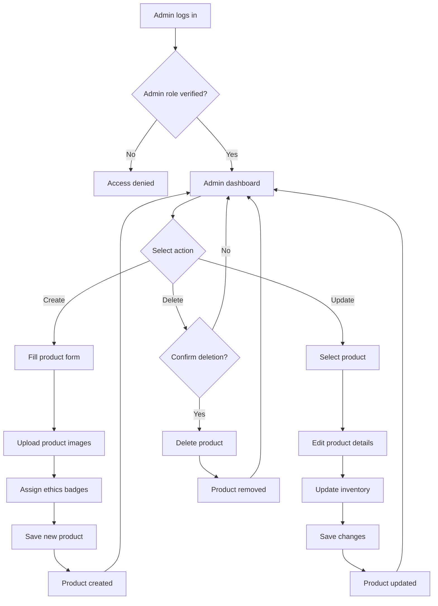

# Feature: Admin Product Management

> **Purpose:**
> This document defines a single feature's intent, scope, user experience, and completion criteria.
> It is the **single source of truth** for planning, review, automation, and execution.

---

## 0. Metadata

All metadata is defined in the frontmatter above (between the `---` markers).

**Important:** The frontmatter is used by automation scripts to:

- Create GitHub issues
- Link features to parent epics
- Generate feature flags
- Track status and ownership

---

## 1. Overview

Admin Product Management enables authorized administrators to manage the product catalog through a secure, dedicated interface. Administrators can create new products, update existing product details, adjust inventory levels, assign ethics badges, and remove discontinued products. This feature ensures that the catalog remains accurate, up-to-date, and reflects the platform's commitment to transparency and ethical sourcing.

- **What this feature enables**: Complete product lifecycle management (CRUD operations) with inventory control and ethics certification management
- **Why it exists**: To provide administrators with tools to maintain catalog accuracy, respond to supplier changes, and manage inventory without requiring developer intervention
- **What meaningful change it introduces**: Empowers non-technical administrators to autonomously manage the product catalog, reducing time-to-market for new products and enabling rapid response to inventory changes

This feature operates within two bounded contexts: **Admin** (authentication and authorization) and **Catalog** (product data management).

## Flow Diagram



Caption: "Admin product management workflow showing authentication, CRUD operations, and inventory management."

---

## 2. User Problem

**Administrators and merchandisers struggle to maintain an accurate product catalog when changes require developer intervention, leading to delays in launching new products, updating inventory, and responding to supplier certification updates.**

- **Who experiences the problem**: Platform administrators, merchandising teams, and operations staff responsible for catalog accuracy
- **When it occurs**: When new products arrive from suppliers, when inventory levels change, when supplier certifications are updated, when products are discontinued, or when product details (pricing, descriptions, ingredients) need correction
- **Friction points**:
  - Manual code changes or database scripts required to add products
  - No self-service tools for non-technical staff
  - Delays between supplier deliveries and catalog availability
  - Inventory discrepancies when stock levels change faster than manual updates
  - Ethics badge assignments require re-verification of supplier certifications manually
- **Why existing solutions are insufficient**: Without a dedicated admin interface, catalog updates require developer time, creating bottlenecks and delaying time-to-market. Manual database edits are error-prone and lack audit trails.

---

## 3. Goals

### User Experience Goals

- **Autonomous catalog management**: Administrators can create, update, and delete products without developer assistance
- **Rapid product launches**: New supplier products can be added to the catalog within minutes of receiving shipment
- **Accurate inventory representation**: Stock levels reflect warehouse reality, reducing overselling and customer disappointment
- **Transparent ethics certification**: Badge assignments are based on verifiable supplier certifications, building customer trust
- **Error prevention**: Form validation prevents incomplete or invalid product data from entering the catalog
- **Audit trail**: All product changes are logged with timestamp and admin identity for compliance and troubleshooting

### Business / System Goals

- **Reduce developer dependency**: Free engineering resources from routine catalog maintenance tasks
- **Improve time-to-market**: Enable same-day product launches from supplier receipt to catalog availability
- **Maintain data integrity**: Firestore security rules enforce admin-only write access, preventing unauthorized changes
- **Scale catalog operations**: Support growing product SKU count without proportional increase in operational overhead
- **Compliance readiness**: Audit logs support regulatory requirements and supplier contract verification

---

## 4. Non-Goals

**Explicitly state what this feature does not attempt to solve.**

- **Bulk product import**: This feature focuses on single-product CRUD operations. Bulk CSV/Excel upload is deferred to a future enhancement
- **Multi-role permissions**: Only a single admin role with full access is supported. Granular permissions (e.g., read-only, inventory-only) are out of scope
- **Product review/approval workflow**: Products are immediately live upon creation. Multi-stage approval workflows are not included
- **Automated inventory sync**: Integration with warehouse management systems (WMS) for automatic inventory updates is deferred
- **Supplier management**: Managing supplier relationships, certifications, and contracts is out of scope
- **Product performance analytics**: Sales metrics, conversion rates, and inventory turnover analysis belong to a separate analytics feature
- **Product variants/SKU relationships**: Complex variant management (e.g., color/size combinations) is not supported; each variant is a separate product
- **Internationalization**: Product descriptions are English-only; multi-language support is deferred

---

## 5. Functional Scope

**Core capabilities enabled by this feature:**

### Product Creation
- Administrators fill a multi-section form (basic info, pricing, ingredients, categories, ethics)
- Upload 1-5 product images to Firebase Storage with automatic resizing and optimization
- Assign products to one or more categories from a predefined hierarchy (Skin Care, Hair Care, Cosmetics)
- Select applicable ethics badges (cruelty-free, paraben-free, vegan) based on supplier certifications
- Enter ingredient lists as structured text fields
- Set initial inventory levels (stock quantity)
- Publish products with a single save action

### Product Updates
- Search and select existing products from a paginated list
- Edit any product field (name, description, price, ingredients, category, badges)
- Update inventory levels with quantity adjustments (absolute set or relative increment/decrement)
- Replace product images
- Save changes atomically (all-or-nothing update)

### Product Deletion
- Soft delete products (mark as inactive rather than physical deletion)
- Confirmation dialog prevents accidental deletions
- Deleted products remain in order history but are hidden from customer-facing catalog

### Inventory Management
- Dedicated inventory update interface separate from full product edit
- View current stock level before adjustment
- Set new absolute quantity or apply relative changes (+10, -5)
- Inventory changes immediately reflected in customer-facing catalog availability

### Ethics Badge Management
- Badge assignment based on supplier certification documents (manual verification)
- Visual badge indicators in product list and detail views
- Badge definitions: Cruelty-Free (not tested on animals), Paraben-Free (no paraben preservatives), Vegan (no animal-derived ingredients)
- Administrators can add or remove badges as certifications change

### Admin Authentication & Authorization
- Firebase Authentication with custom admin claim
- Single admin role with full catalog write access
- Non-admin users cannot access admin UI (route guards)
- GraphQL mutations validate admin claim before executing

---

## 6. Dependencies & Assumptions

**Conditions required for this feature to function as intended:**

### Dependencies
- **F-001 (Platform Foundation)**: Firebase project initialized with Firestore, Authentication, Functions, and Storage
- **F-004 (Product Catalog Management)**: Product aggregate, GraphQL schema, and Firestore collections defined
- **F-002 (Mobile-First Responsive UI Foundation)**: Lit component library and CSS framework available for admin UI

### Assumptions
- **Single admin role suffices**: Initial launch supports one admin role with unrestricted access; more granular permissions are not required
- **Trusted administrators**: Admin users are internal staff; malicious behavior is not a primary threat model
- **Supplier certifications are verified externally**: Administrators manually verify supplier certifications before assigning badges; no automated certification validation
- **Low concurrency for admin operations**: Product edits are infrequent enough that optimistic locking or conflict resolution is not required
- **English-only interface**: Admin UI is English-only; internationalization is deferred

### External Constraints
- **Firestore write limits**: 10,000 writes/second per database (not a practical constraint for admin operations)
- **Firebase Storage limits**: 5TB total storage, 360,000 uploads/day (sufficient for product images)
- **GraphQL Mesh**: Admin mutations must integrate with existing federated schema

---

## 7. User Stories & Experience Scenarios

> This section defines **how users live with the feature**.
> Scenarios focus on **quality of life and lifecycle experience**, not just technical failures.

---

### User Story 1 — Adding a New Product from Supplier Shipment

**As a** merchandising administrator  
**I want** to create a new product entry immediately upon receiving supplier stock  
**So that** customers can discover and purchase new arrivals without delay

---

#### Scenarios

##### Scenario 1.1 — First-Time Product Creation (Initial Experience)

**Given** an administrator with verified admin credentials  
**And** a new product shipment received from a supplier with certification documents  
**When** the administrator navigates to the admin dashboard and selects "Create Product"  
**Then** the system displays a blank product creation form with clearly labeled sections (Basic Info, Pricing, Ingredients, Categories, Ethics Badges, Images, Inventory)  
**And** helpful placeholders and tooltips guide data entry (e.g., "Enter retail price in USD, excluding tax")  
**And** required fields are visually indicated with asterisks  
**And** the form validates inputs in real-time (e.g., price must be positive, SKU must be unique)

---

##### Scenario 1.2 — Uploading Product Images

**Given** an administrator is creating a new product  
**And** has prepared 3 product images (front, ingredients label, packaging)  
**When** the administrator drags images into the upload zone or clicks to browse files  
**Then** the system displays upload progress for each image  
**And** generates thumbnail previews immediately after upload  
**And** allows reordering images via drag-and-drop to set the primary image  
**And** displays image file size and compression recommendations if images exceed 2MB  
**And** enforces a maximum of 5 images per product

---

##### Scenario 1.3 — Assigning Ethics Badges Based on Certifications

**Given** an administrator is creating a new product  
**And** the supplier has provided cruelty-free and vegan certifications  
**When** the administrator navigates to the "Ethics Badges" section  
**Then** the system displays checkboxes for each badge type (Cruelty-Free, Paraben-Free, Vegan)  
**And** each badge shows a brief definition and certification requirement  
**When** the administrator selects "Cruelty-Free" and "Vegan" based on certification documents  
**Then** the system visually confirms the selections with badge icons  
**And** the product listing preview shows the assigned badges

---

##### Scenario 1.4 — Handling Incomplete Product Data (Validation)

**Given** an administrator is creating a new product  
**When** the administrator attempts to save the product with missing required fields (e.g., SKU, price, category)  
**Then** the system prevents submission and highlights missing fields in red  
**And** displays an error summary at the top of the form: "Please complete all required fields before saving"  
**And** scrolls to the first invalid field to guide correction  
**And** retains all entered data so the administrator can correct without re-entry

---

##### Scenario 1.5 — Successful Product Creation and Catalog Visibility

**Given** an administrator has completed all required product fields and uploaded images  
**When** the administrator clicks "Save Product"  
**Then** the system executes the `createProduct` GraphQL mutation  
**And** displays a success message: "Product [Product Name] created successfully"  
**And** redirects to the product detail view showing the newly created product  
**And** the product immediately appears in the customer-facing catalog (filtered by category and ethics badges)  
**And** inventory is set to the specified stock level (e.g., 50 units)

---

### User Story 2 — Updating Product Inventory Levels

**As a** warehouse operations administrator  
**I want** to quickly update product inventory levels as stock arrives or sells  
**So that** the customer-facing catalog reflects accurate availability and prevents overselling

---

#### Scenarios

##### Scenario 2.1 — Searching for a Product to Update Inventory

**Given** an administrator logged into the admin dashboard  
**And** a warehouse shipment has arrived with 100 additional units of SKU "FACE-SERUM-001"  
**When** the administrator navigates to "Inventory Management" and searches for "FACE-SERUM-001"  
**Then** the system displays matching products with current stock levels  
**And** the administrator selects the product to view detailed inventory information

---

##### Scenario 2.2 — Updating Inventory with Relative Adjustments

**Given** an administrator viewing the inventory detail for a product with current stock level of 25 units  
**When** the administrator selects "Adjust Inventory" and enters "+100" to add newly received stock  
**Then** the system displays the new calculated stock level (125 units) before saving  
**And** prompts for confirmation: "Update stock level from 25 to 125 units?"  
**When** the administrator confirms  
**Then** the system executes the `updateInventory` GraphQL mutation  
**And** displays "Inventory updated successfully. Current stock: 125 units"  
**And** the updated stock level is immediately visible to customers (product shows as "In Stock")

---

##### Scenario 2.3 — Handling Negative Inventory Adjustments

**Given** an administrator viewing inventory for a product with 10 units in stock  
**When** the administrator enters "-15" to adjust for warehouse damage  
**Then** the system prevents negative inventory and displays an error: "Inventory cannot be negative. Current stock: 10 units. Maximum reduction: -10"  
**And** allows the administrator to correct the adjustment to "-10" or another valid value

---

##### Scenario 2.4 — Bulk Inventory Update (Deferred Gracefully)

**Given** an administrator needs to update inventory for 50 products after a warehouse count  
**When** the administrator realizes single-product updates are inefficient  
**Then** the system displays a note: "Need to update multiple products? Bulk inventory import is coming soon. Contact support for assistance with large updates."  
**And** the administrator proceeds with single-product updates or requests developer support

---

### User Story 3 — Editing Product Details and Ethics Badges

**As a** catalog administrator  
**I want** to update product descriptions, ingredients, and ethics badges when supplier certifications change  
**So that** customers see accurate, up-to-date product information that maintains trust

---

#### Scenarios

##### Scenario 3.1 — Updating Product Description and Ingredients

**Given** an administrator viewing the product detail for "Hydrating Face Cream"  
**And** the supplier has provided an updated ingredient list with improved formulation  
**When** the administrator clicks "Edit Product"  
**Then** the system displays the product edit form pre-populated with current values  
**When** the administrator updates the description and replaces the ingredient list  
**And** clicks "Save Changes"  
**Then** the system validates the updated data  
**And** executes the `updateProduct` GraphQL mutation  
**And** displays "Product updated successfully"  
**And** the updated product details are immediately visible to customers

---

##### Scenario 3.2 — Removing an Ethics Badge (Certification Expired)

**Given** a product currently marked as "Vegan" based on a supplier certification  
**And** the supplier has changed the formulation to include beeswax (no longer vegan)  
**When** the administrator edits the product and unchecks the "Vegan" badge  
**And** saves the changes  
**Then** the system removes the badge from the product  
**And** the product no longer appears in "Vegan" filtered searches  
**And** customers viewing the product detail see updated badge status

---

##### Scenario 3.3 — Concurrent Edit Detection (Future Enhancement Gracefully Deferred)

**Given** two administrators editing the same product simultaneously  
**When** Administrator A saves changes first  
**And** Administrator B attempts to save changes 30 seconds later  
**Then** the system accepts Administrator B's changes without conflict detection (last-write-wins)  
**And** displays a note: "This product was recently updated. Review your changes carefully."  
**And** the administrator can refresh to see the latest version if needed

---

### User Story 4 — Deleting Discontinued Products

**As a** catalog administrator  
**I want** to remove discontinued products from the customer-facing catalog  
**So that** customers only see currently available products while preserving order history

---

#### Scenarios

##### Scenario 4.1 — Soft Deleting a Discontinued Product

**Given** an administrator viewing a product marked for discontinuation  
**When** the administrator clicks "Delete Product"  
**Then** the system displays a confirmation dialog: "Are you sure you want to delete [Product Name]? This product will be hidden from the catalog but preserved in order history."  
**When** the administrator confirms deletion  
**Then** the system executes the `deleteProduct` GraphQL mutation  
**And** marks the product as inactive (soft delete)  
**And** displays "Product deleted successfully"  
**And** the product is immediately hidden from customer-facing catalog and search results

---

##### Scenario 4.2 — Preserving Deleted Products in Order History

**Given** a product has been soft deleted from the catalog  
**And** customers have previously purchased this product  
**When** a customer views their past order containing the deleted product  
**Then** the system displays the product name and details as they were at time of purchase  
**And** indicates "(No longer available)" if the customer attempts to reorder  
**And** the administrator can still view the deleted product in the admin interface by filtering "Show Deleted Products"

---

##### Scenario 4.3 — Accidental Deletion Prevention

**Given** an administrator accidentally clicks "Delete Product" instead of "Edit Product"  
**When** the confirmation dialog appears  
**And** the administrator realizes the mistake  
**Then** the administrator clicks "Cancel"  
**And** the system closes the dialog without deleting the product  
**And** the administrator can proceed to edit the product safely

---

### User Story 5 — Admin Access Control and Security

**As a** platform security administrator  
**I want** strict access control on product management operations  
**So that** unauthorized users cannot corrupt the catalog or create fraudulent products

---

#### Scenarios

##### Scenario 5.1 — Non-Admin User Attempts to Access Admin UI

**Given** a regular customer user logged in with Firebase Authentication  
**When** the user manually navigates to `/admin/products` by typing the URL  
**Then** the system checks the user's Firebase custom claims for the `admin` role  
**And** detects the user lacks admin privileges  
**And** displays an error page: "Access Denied. You do not have permission to view this page."  
**And** logs the unauthorized access attempt for security monitoring

---

##### Scenario 5.2 — Admin GraphQL Mutation Validation

**Given** an authenticated user without admin custom claims  
**When** the user attempts to call the `createProduct` GraphQL mutation directly via API  
**Then** the GraphQL resolver validates the Firebase Auth token  
**And** checks for the `admin` custom claim  
**And** rejects the request with error: "Unauthorized. Admin access required."  
**And** logs the attempted mutation for audit purposes

---

##### Scenario 5.3 — Firestore Security Rules Enforcement

**Given** an attacker attempts to write directly to the Firestore `products` collection  
**When** the write request is evaluated by Firestore security rules  
**Then** the rules verify the request user has the `admin` custom claim  
**And** deny the write with error: "Permission denied"  
**And** the product catalog remains unmodified

---

## 8. Edge Cases & Constraints (Experience-Relevant)

**Cases that materially affect user experience:**

### Hard Limits
- **Maximum 5 images per product**: Enforced to maintain page load performance. Administrators attempting to upload a 6th image see: "Maximum 5 images allowed. Remove an existing image to add a new one."
- **Maximum product name length: 100 characters**: Prevents layout overflow in mobile product grids. Form truncates at 100 characters with counter display.
- **SKU uniqueness**: Duplicate SKUs are rejected with error: "SKU already exists. Please enter a unique SKU."
- **Minimum price: $0.01**: Prevents accidental zero-price products. Form validation displays: "Price must be at least $0.01"

### Irreversible Actions
- **Product deletion is soft (reversible)**: Deleted products can be restored by administrators via "Show Deleted Products" filter and "Restore" action
- **Inventory adjustments are irreversible**: Once saved, inventory changes are immediately reflected and cannot be undone automatically. Administrators must enter a corrective adjustment.

### Compliance & Policy Constraints
- **Ethics badge assignment requires manual verification**: No automated certification validation. Administrators are responsible for verifying supplier certifications before assigning badges. Audit logs record badge changes.
- **Product data accuracy**: Administrators are contractually responsible for accurate ingredient lists and pricing per supplier agreements

### Performance Constraints
- **Image upload size limit: 10MB per image**: Larger files are rejected with: "Image file size exceeds 10MB. Please compress or choose a smaller image."
- **Form auto-save not supported**: Changes are only saved on explicit "Save" action. Administrators leaving the page without saving see a browser confirmation: "You have unsaved changes. Leave page?"

---

## 9. Implementation Tasks (Execution Agent Checklist)

> This section provides the specific work items for the **Execution Agent**.
> Every task maps to a specific scenario defined in Section 7.

```markdown
- [ ] T01 — Implement admin authentication check with Firebase custom claims (Scenario 5.1, 5.2)
  - [ ] Unit Test: Verify admin claim validation logic in authentication middleware
  - [ ] Integration Test: Verify non-admin users receive 403 errors on admin routes
  - [ ] E2E Test: Validate admin login flow redirects to dashboard, non-admin login redirects to homepage

- [ ] T02 — Create GraphQL `createProduct` mutation (Scenario 1.5)
  - [ ] Unit Test: Verify Product aggregate creation with valid inputs
  - [ ] Unit Test: Verify SKU uniqueness constraint enforcement
  - [ ] Integration Test: Verify Firestore product document creation with correct schema
  - [ ] E2E Test: Validate end-to-end product creation from form submission to catalog visibility

- [ ] T03 — Create GraphQL `updateProduct` mutation (Scenario 3.1)
  - [ ] Unit Test: Verify product update logic with partial field updates
  - [ ] Integration Test: Verify Firestore document update preserves unchanged fields
  - [ ] E2E Test: Validate product edit workflow from form load to saved changes

- [ ] T04 — Create GraphQL `deleteProduct` mutation (Scenario 4.1, 4.2)
  - [ ] Unit Test: Verify soft delete sets `isActive: false` field
  - [ ] Integration Test: Verify deleted products hidden from customer queries but visible in order history
  - [ ] E2E Test: Validate product deletion workflow with confirmation dialog

- [ ] T05 — Create GraphQL `updateInventory` mutation (Scenario 2.2, 2.3)
  - [ ] Unit Test: Verify inventory adjustment calculations (relative and absolute)
  - [ ] Unit Test: Verify negative inventory prevention logic
  - [ ] Integration Test: Verify inventory updates immediately reflected in product availability
  - [ ] E2E Test: Validate inventory update workflow from search to confirmation

- [ ] T06 — Implement product image upload to Firebase Storage (Scenario 1.2)
  - [ ] Unit Test: Verify image upload service generates correct Storage paths
  - [ ] Unit Test: Verify image file type and size validation
  - [ ] Integration Test: Verify uploaded images accessible via public URLs
  - [ ] E2E Test: Validate image upload UI with drag-and-drop and file browsing

- [ ] T07 — Build admin product creation form UI with Lit components (Scenario 1.1, 1.4)
  - [ ] Unit Test: Verify form validation logic (required fields, format checks)
  - [ ] Component Test: Verify form state management with Preact Signals
  - [ ] E2E Test: Validate form error handling and inline validation feedback

- [ ] T08 — Build admin product edit form UI (Scenario 3.1, 3.2)
  - [ ] Component Test: Verify form pre-population with existing product data
  - [ ] E2E Test: Validate edit workflow with field updates and save confirmation

- [ ] T09 — Build admin inventory management UI (Scenario 2.1, 2.2)
  - [ ] Component Test: Verify inventory adjustment calculator (current + delta = new)
  - [ ] E2E Test: Validate inventory search and update workflow

- [ ] T10 — Implement ethics badge assignment UI and logic (Scenario 1.3, 3.2)
  - [ ] Unit Test: Verify badge selection state management
  - [ ] Integration Test: Verify badge assignments stored in Firestore product documents
  - [ ] E2E Test: Validate badge assignment workflow and customer-facing display

- [ ] T11 — Configure Firestore security rules for admin-only write access (Scenario 5.3)
  - [ ] Unit Test: Verify security rule logic with simulated requests
  - [ ] Integration Test: Verify non-admin write attempts rejected by Firestore

- [ ] T12 — Implement admin dashboard with product list and search (Scenario 2.1, 4.2)
  - [ ] Component Test: Verify product list pagination and search filtering
  - [ ] E2E Test: Validate dashboard navigation and product selection workflows

- [ ] T13 — [Rollout] Implement feature flag gating for admin UI (Scenario: gradual rollout)
  - [ ] Integration Test: Verify flag state controls admin UI visibility
  - [ ] E2E Test: Validate flag-based access control (enabled for admins, disabled for customers)
```

---

## 10. Acceptance Criteria (Verifiable Outcomes)

> These criteria are used by the **Execution Agent** and **Reviewers** to verify completion.
> Each criterion is observable and testable.

```markdown
- [ ] AC1 — Admin users can create new products with all required fields (Scenario 1.5)
  - [ ] Unit test passed: Product aggregate created with valid data
  - [ ] Integration test passed: Firestore product document created with correct schema
  - [ ] E2E test passed: Product creation workflow completes successfully and product visible in catalog

- [ ] AC2 — Admin users can upload 1-5 product images to Firebase Storage (Scenario 1.2)
  - [ ] Unit test passed: Image upload service validates file types (JPEG, PNG, WebP)
  - [ ] Integration test passed: Uploaded images accessible via public URLs
  - [ ] E2E test passed: Image upload UI supports drag-and-drop and displays thumbnails

- [ ] AC3 — Admin users can assign ethics badges based on supplier certifications (Scenario 1.3)
  - [ ] Unit test passed: Badge selection logic correctly stores badge assignments
  - [ ] Integration test passed: Products with badges appear in filtered searches
  - [ ] E2E test passed: Badge assignment workflow updates product and customer sees badges

- [ ] AC4 — Admin users can update product details and inventory levels (Scenario 3.1, 2.2)
  - [ ] Unit test passed: Product update logic preserves unchanged fields
  - [ ] Unit test passed: Inventory adjustment calculations correct for relative and absolute changes
  - [ ] Integration test passed: Updated products immediately reflected in catalog
  - [ ] E2E test passed: Edit and inventory workflows complete successfully

- [ ] AC5 — Admin users can soft delete products while preserving order history (Scenario 4.1, 4.2)
  - [ ] Unit test passed: Soft delete sets isActive: false without removing document
  - [ ] Integration test passed: Deleted products hidden from customer queries, visible in admin "Deleted" filter
  - [ ] E2E test passed: Deletion workflow with confirmation prevents accidental deletion

- [ ] AC6 — Non-admin users cannot access admin UI or execute admin mutations (Scenario 5.1, 5.2)
  - [ ] Unit test passed: Authentication middleware rejects non-admin requests
  - [ ] Integration test passed: GraphQL resolvers validate admin claims and reject unauthorized mutations
  - [ ] E2E test passed: Non-admin users see "Access Denied" on admin routes

- [ ] AC7 — Firestore security rules enforce admin-only write access to products collection (Scenario 5.3)
  - [ ] Unit test passed: Security rule simulation rejects non-admin writes
  - [ ] Integration test passed: Direct Firestore write attempts from non-admin users fail

- [ ] AC8 — Form validation prevents invalid product data submission (Scenario 1.4, 2.3)
  - [ ] Unit test passed: Validation logic rejects missing required fields, negative prices, duplicate SKUs
  - [ ] E2E test passed: Form displays inline errors and prevents submission until corrected

- [ ] AC9 — Product images respect size and count limits (Edge Cases)
  - [ ] Unit test passed: Image upload rejects files >10MB and >5 images per product
  - [ ] E2E test passed: UI displays error messages for oversized files and max image count

- [ ] AC10 — [Gating] Feature flag correctly controls admin UI visibility and mutation access (Scenario: rollout)
  - [ ] Integration test passed: Admin UI hidden when flag disabled, visible when enabled
  - [ ] E2E test passed: Flag state toggling verified in dev and staging environments
```

---

## 11. Rollout & Risk

### Rollout Strategy

**Gradual rollout with internal admin user testing before production access:**

1. **Development (0%)**: Feature flag `feature_fe_013_fl_admin_product_mgmt_ui_enabled` set to `false` by default. Developers test locally with flag manually enabled.

2. **Internal Testing (10%)**: Enable flag for 2-3 internal admin users in staging environment. Validate all CRUD operations, image uploads, and inventory management. Monitor for errors and usability issues. **Duration: 3 days**

3. **Expanded Internal Testing (50%)**: Enable flag for all internal admin users (merchandising team, operations staff). Collect feedback on workflow efficiency and missing features. **Duration: 7 days**

4. **Production Launch (100%)**: Enable flag for all admin users in production. Monitor error rates, mutation latencies, and Firestore write volumes. **Criteria: <0.5% error rate, <500ms p95 mutation latency**

5. **Flag Cleanup**: Remove feature flag after 7 days of stable 100% rollout. Refactor code to remove conditional gating logic.

### Risk Mitigation

**Identified risks and mitigation strategies:**

- **Risk: Accidental product deletion**
  - *Mitigation*: Soft delete (isActive flag) with confirmation dialog. Deleted products can be restored via admin UI.
  
- **Risk: Unauthorized admin access**
  - *Mitigation*: Multi-layer security (route guards, GraphQL resolver validation, Firestore security rules). Audit logging for all admin mutations.

- **Risk: Concurrent edits causing data loss**
  - *Mitigation*: Last-write-wins policy with warning message if product recently updated. Future enhancement: optimistic locking with conflict resolution.

- **Risk: Large image uploads degrading performance**
  - *Mitigation*: 10MB per-image limit enforced client-side. Recommend image compression tools in error messages.

- **Risk: Inventory overselling due to manual updates**
  - *Mitigation*: Real-time inventory updates immediately reflected in catalog. Future enhancement: automated WMS integration.

### Automatic Rollback Triggers

- **Error rate >0.5% for admin mutations**: Automatic flag rollback to previous percentage
- **GraphQL mutation p95 latency >2000ms**: Investigate and consider rollback
- **Firestore write quota exceeded**: Rate limiting and rollback to prevent quota exhaustion

### Exit / Cleanup Criteria

- **Flag removal**: After 7 days of 100% rollout with <0.1% error rate
- **Code cleanup**: Remove feature flag conditionals and test coverage for flag states
- **Documentation**: Update admin user guide and training materials

### Remote Config Flags

<!-- REMOTE_CONFIG_FLAG_START -->
| Context | Type | Namespace | Default (Dev) | Default (Stg) | Default (Prod) | Key |
|---------|------|-----------|---------------|---------------|----------------|-----|
| admin_product_mgmt_ui | BOOLEAN | client | true | false | false | feature_fe_013_fl_admin_product_mgmt_ui_enabled |
| admin_product_mutations | BOOLEAN | server | true | false | false | feature_fe_013_fl_admin_product_mutations_enabled |
<!-- REMOTE_CONFIG_FLAG_END -->

---

## 12. History & Status

- **Status:** Draft
- **Related Epics:** Admin Operations (to be linked after automation)
- **Related Issues:** F-013 (to be created post-merge)
- **Dependencies:** F-001 (Platform Foundation), F-004 (Product Catalog Management), F-002 (Mobile-First Responsive UI Foundation)
- **Author:** Product Team
- **Last Updated:** 2026-01-24

---

## Final Note

> This document defines **intent and experience**.
> Execution details are derived from it — never the other way around.
