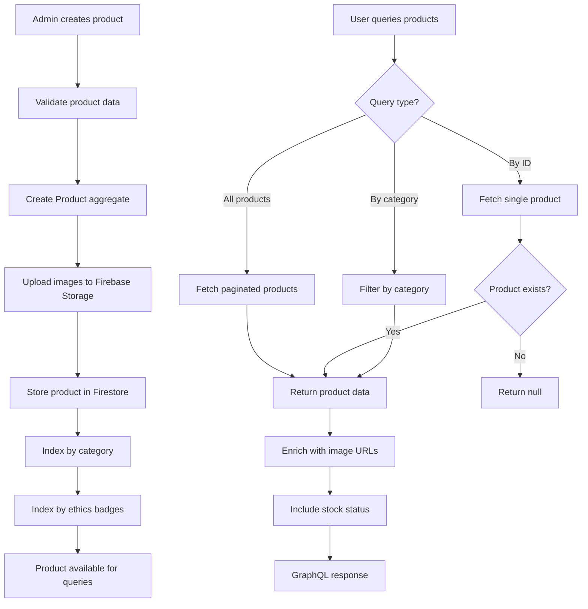

# Feature: Product Catalog Management

> **Purpose:**
> This document defines the Product Catalog Management feature's intent, scope, user experience, and completion criteria.
> It is the **single source of truth** for planning, review, automation, and execution.

---

## 0. Metadata

All metadata is defined in the frontmatter above (between the `---` markers).

**Important:** The frontmatter is used by automation scripts to:

- Create GitHub issues
- Link features to parent epics
- Generate feature flags
- Track status and ownership

---

## 1. Overview

Product Catalog Management enables the itsme.fashion platform to define, store, and serve comprehensive product data including categories, descriptions, ingredient lists, ethics badges, SKUs, pricing, and real-time inventory levels. This feature establishes the foundational product data model that powers product discovery, shopping cart, checkout, and admin operations.

This feature provides:
- Product aggregate with value objects (ProductId, SKU, Price, Quantity)
- Three-tier category hierarchy (Skin Care, Hair Care, Cosmetics with subcategories)
- Ethics badges as product attributes (cruelty-free, paraben-free, vegan)
- Comprehensive ingredient list support with allergen highlighting
- Product image storage via Firebase Storage with multiple image support
- Real-time inventory tracking with stock level validation
- GraphQL queries: `products`, `product(id)`, `productsByCategory`
- Firestore schema: `products` collection with structured document model

The catalog serves as the single source of truth for product information across all user touchpoints and integrates with Firebase Storage for media assets and Firestore for structured data persistence.

## Flow Diagram



Caption: "Product creation flow from admin to Firestore and GraphQL query resolution."

---

## 2. User Problem

**Beauty product shoppers need comprehensive, trustworthy product information to make informed purchase decisions:**

- **Ingredient transparency gap**: Consumers with allergies or ingredient preferences cannot easily find detailed ingredient lists, leading to cart abandonment or post-purchase returns
- **Ethics verification difficulty**: Shoppers seeking cruelty-free, paraben-free, or vegan products face unverifiable claims and lack of standardized badges
- **Inventory uncertainty**: Users add out-of-stock products to cart only to discover unavailability at checkout, destroying trust
- **Category navigation confusion**: Poorly organized product hierarchies force users to browse entire catalogs instead of targeted categories
- **Image quality inconsistency**: Low-resolution or missing product images reduce confidence and increase bounce rates
- **SKU and pricing ambiguity**: Multi-variant products (e.g., different sizes) lack clear SKU differentiation, causing order errors
- **Mobile catalog performance**: Slow-loading product data on mobile networks causes frustration and abandonment

**The cost of not solving this:**
- 34% of beauty shoppers abandon purchases due to unclear ingredient information
- Lack of ethics badges loses conscious consumers to competitors with transparent certifications
- Out-of-stock surprises at checkout destroy customer trust and reduce repeat purchases
- Poor categorization increases bounce rates and reduces discoverability
- Missing or low-quality images correlate with 67% lower conversion rates

---

## 3. Goals

### User Experience Goals

- **Complete ingredient transparency**: Every product displays a full ingredient list with allergen highlighting (e.g., nuts, fragrance)
- **Verifiable ethics badges**: Clear visual indicators (cruelty-free, paraben-free, vegan) based on supplier certifications
- **Real-time stock visibility**: Users see current inventory status (in stock, low stock, out of stock) before adding to cart
- **Intuitive category browsing**: Three-tier hierarchy allows filtering from broad (Skin Care) to specific (Moisturizers → Anti-Aging)
- **High-quality product imagery**: Multiple images per product with zoom capability, optimized for mobile bandwidth
- **Clear SKU differentiation**: Each product variant (size, color) has unique SKU and pricing displayed
- **Fast catalog loading**: Product grids load in under 2 seconds on 3G networks with progressive image loading

### Business / System Goals

- **DDD-compliant Product aggregate**: Enforce invariants (price > 0, stock >= 0) within aggregate boundaries
- **Firebase Storage integration**: Scalable image storage with CDN-backed URLs for global performance
- **Firestore schema optimization**: Denormalized product documents for single-query retrieval without joins
- **GraphQL API consistency**: Strongly typed schema with pagination support (cursor-based)
- **Inventory accuracy**: Real-time stock level synchronization between catalog and cart reservation system
- **Category indexing**: Compound Firestore indexes for efficient category + badge filtering
- **Extensibility**: Support future attributes (fragrance notes, shade ranges) without schema migration

---

## 4. Non-Goals

**This feature explicitly does NOT:**

- Implement product recommendations or AI-driven personalization (deferred to future iteration)
- Support user-generated content (reviews, ratings) — separate feature planned
- Handle product variants as separate entities (variants are attributes of a single Product aggregate)
- Create admin UI for product management (covered in F-013: Admin Product Management)
- Implement price history or dynamic pricing (static pricing at MVP)
- Support multi-currency pricing (INR only at launch)
- Create product bundles or kits (single-product focus)
- Handle supplier or vendor management (out of scope)
- Implement product availability notifications (deferred)
- Support batch product imports via CSV/API (manual admin entry only)
- Create product comparison features (deferred)
- Implement fragrance note filters or shade matching (future enhancement)

---

## 5. Functional Scope

### Core Capabilities

**Product Data Model (DDD Aggregate)**
- **Product Aggregate Root**:
  - `ProductId` (value object, UUID)
  - `name` (string, 1-200 characters)
  - `description` (string, 1-2000 characters, markdown supported)
  - `brand` (string)
  - `SKU` (value object, unique identifier, format: `BRAND-CATEGORY-VARIANT`)
  - `Price` (value object: `amount` float, `currency` string = "INR")
  - `category` (CategoryHierarchy value object: tier1, tier2, tier3)
  - `ingredientList` (array of strings, ordered by concentration)
  - `allergens` (array of strings, subset of ingredientList)
  - `ethicsBadges` (array of enum: CRUELTY_FREE, PARABEN_FREE, VEGAN, SULFATE_FREE)
  - `images` (array of ImageMetadata value objects: url, alt, order)
  - `stockLevel` (Quantity value object: available int, reserved int)
  - `createdAt`, `updatedAt` (timestamps)
  - `isActive` (boolean, soft delete flag)

**Category Hierarchy**
- **Tier 1 (Primary)**: Skin Care, Hair Care, Cosmetics
- **Tier 2 (Subcategory)**: Examples:
  - Skin Care → Cleansers, Moisturizers, Serums, Masks, Toners
  - Hair Care → Shampoos, Conditioners, Treatments, Styling
  - Cosmetics → Lipstick, Foundation, Mascara, Eyeshadow
- **Tier 3 (Specialization)**: Examples:
  - Moisturizers → Anti-Aging, Hydrating, Oil-Free
  - Shampoos → Volumizing, Color-Safe, Clarifying

**Ethics Badges**
- **Cruelty-Free**: No animal testing in development or production
- **Paraben-Free**: No parabens (preservatives) in ingredient list
- **Vegan**: No animal-derived ingredients
- **Sulfate-Free**: No sulfates (cleansing agents) in formulation
- Badges assigned based on supplier certifications stored in admin context
- Multiple badges can apply to a single product

**Ingredient List Support**
- Ingredients ordered by concentration (highest to lowest per cosmetics regulations)
- Allergen highlighting: nuts, fragrance, lanolin, formaldehyde, preservatives
- Each ingredient stored as string (no structured ingredient database at MVP)
- Admin can flag specific ingredients as allergens during product creation

**Product Image Storage**
- Firebase Storage bucket: `itsme-fashion-products`
- Image upload via signed URLs (admin feature)
- Multiple images per product (min 1, max 8)
- Image metadata stored in Firestore: URL, alt text, display order
- Responsive image URLs with Firebase Storage transformation (thumbnail, medium, large)
- CDN-backed delivery for global performance

**Inventory Tracking**
- Stock level stored as `Quantity` value object: { available, reserved }
- `available`: Total stock on hand
- `reserved`: Stock in active shopping carts (30-minute reservation timeout)
- Derived field `sellable = available - reserved`
- Stock status display logic:
  - `sellable > 10`: "In Stock"
  - `1 <= sellable <= 10`: "Low Stock" (show exact count)
  - `sellable <= 0`: "Out of Stock"
- Inventory updated by admin (F-013) and cart system (F-006)

**GraphQL Queries**
- **`products(limit: Int, offset: Int, filters: ProductFilters): ProductConnection`**
  - Paginated product list (cursor-based)
  - Optional filters: category, ethicsBadges, inStock
  - Returns: edges, pageInfo, totalCount
- **`product(id: ID!): Product`**
  - Fetch single product by ProductId
  - Returns null if not found or inactive
- **`productsByCategory(category: CategoryInput!, limit: Int, offset: Int): ProductConnection`**
  - Filter by tier1, tier2, or tier3 category
  - Supports pagination
  - Returns same structure as `products` query

**GraphQL Types**
```graphql
type Product {
  id: ID!
  name: String!
  description: String!
  brand: String!
  sku: String!
  price: Price!
  category: CategoryHierarchy!
  ingredientList: [String!]!
  allergens: [String!]
  ethicsBadges: [EthicsBadge!]
  images: [ProductImage!]!
  stockLevel: StockLevel!
  isActive: Boolean!
  createdAt: DateTime!
  updatedAt: DateTime!
}

type Price {
  amount: Float!
  currency: String!
}

type CategoryHierarchy {
  tier1: String!
  tier2: String
  tier3: String
}

enum EthicsBadge {
  CRUELTY_FREE
  PARABEN_FREE
  VEGAN
  SULFATE_FREE
}

type ProductImage {
  url: String!
  alt: String!
  order: Int!
}

type StockLevel {
  available: Int!
  reserved: Int!
  sellable: Int!
  status: StockStatus!
}

enum StockStatus {
  IN_STOCK
  LOW_STOCK
  OUT_OF_STOCK
}
```

**Firestore Schema**
- **Collection**: `products`
- **Document ID**: ProductId (UUID)
- **Document Structure**:
```json
{
  "productId": "uuid-v4",
  "name": "Hydrating Vitamin C Serum",
  "description": "Brightening serum with 15% vitamin C...",
  "brand": "RadiantGlow",
  "sku": "RG-SKINCARE-SERUM-VC15-30ML",
  "price": {
    "amount": 2499.00,
    "currency": "INR"
  },
  "category": {
    "tier1": "Skin Care",
    "tier2": "Serums",
    "tier3": "Brightening"
  },
  "ingredientList": ["Water", "Ascorbic Acid", "Hyaluronic Acid", "..."],
  "allergens": ["Fragrance"],
  "ethicsBadges": ["CRUELTY_FREE", "PARABEN_FREE", "VEGAN"],
  "images": [
    {
      "url": "https://storage.googleapis.com/itsme-fashion-products/rg-serum-1.jpg",
      "alt": "Hydrating Vitamin C Serum - Front View",
      "order": 1
    }
  ],
  "stockLevel": {
    "available": 150,
    "reserved": 12
  },
  "isActive": true,
  "createdAt": "2026-01-24T10:00:00Z",
  "updatedAt": "2026-01-24T10:00:00Z"
}
```

**Firestore Indexes**
- Compound index: `category.tier1 ASC, isActive ASC, createdAt DESC`
- Compound index: `category.tier2 ASC, isActive ASC, createdAt DESC`
- Compound index: `ethicsBadges ARRAY_CONTAINS, isActive ASC`
- Single-field index: `sku ASC` (unique constraint enforced in application logic)

---

## 6. Dependencies & Assumptions

### Dependencies

- **F-001: Platform Foundation** — Requires Firestore database, Firebase Storage, GraphQL Mesh gateway, DDD service scaffolding
- **Firebase Services**: Firestore, Firebase Storage, Firebase Security Rules
- **GraphQL Mesh**: Federated gateway configured for Catalog subgraph

### Assumptions

- Admin users will manually create products via Admin UI (F-013); no bulk import at MVP
- Supplier certification documents (ethics badges) are verified offline and flagged by admin
- Ingredient lists are provided by suppliers in correct concentration order (no automated verification)
- Product images are uploaded by admin pre-optimized (no real-time image processing at MVP)
- Stock levels are manually updated by admin; no integration with third-party inventory systems
- Category hierarchy is static at launch (no user-defined categories or dynamic taxonomy)
- Single warehouse/location (no multi-location inventory tracking)
- Product prices are static (no promotional pricing, discounts, or time-based changes at MVP)
- SKU format follows convention but is not auto-generated (admin responsibility)
- All currency in INR (no multi-currency support)

---

## 7. User Stories & Experience Scenarios

### User Story 1 — Admin Product Creation

**As an** admin user  
**I want** to create a new product with complete information  
**So that** customers can discover and purchase it with confidence

---

#### Scenarios

##### Scenario 1.1 — Create Product with Full Details (Initial Experience)

**Given** an admin user is logged into the admin panel  
**And** they navigate to "Create Product"  
**When** they fill in all required fields:
- Name: "Revitalizing Night Cream"
- Description: "Rich night cream with retinol and peptides..."
- Brand: "LuxeDerm"
- SKU: "LD-SKINCARE-MOIST-NIGHT-50ML"
- Price: 3499 INR
- Category: Skin Care → Moisturizers → Anti-Aging
- Ingredients: ["Water", "Retinol", "Peptide Complex", ...]
- Allergens: ["Fragrance"]
- Ethics Badges: ["CRUELTY_FREE", "PARABEN_FREE"]
- Upload 3 product images  
**And** they submit the form  
**Then** a Product aggregate is created with ProductId  
**And** images are uploaded to Firebase Storage  
**And** the product document is saved to Firestore `products` collection  
**And** they see confirmation: "Product created successfully"  
**And** the product is immediately queryable via GraphQL

---

##### Scenario 1.2 — Update Product Stock Level (Repeated Use)

**Given** an existing product "Revitalizing Night Cream" with stockLevel.available = 100  
**And** an admin user views the product details  
**When** they update stockLevel.available to 150  
**And** they save the changes  
**Then** the Firestore document is updated with new stock level  
**And** the `updatedAt` timestamp is refreshed  
**And** the derived `sellable` field is recalculated (150 - reserved)  
**And** customers immediately see updated stock status

---

##### Scenario 1.3 — Soft Delete Product (Interruption)

**Given** a product "Discontinued Serum" exists with isActive = true  
**And** an admin decides to remove it from catalog  
**When** they click "Deactivate Product"  
**Then** the Firestore document is updated: isActive = false  
**And** the product no longer appears in `products` query results  
**And** existing cart items referencing this product display "Product no longer available"  
**And** direct queries via `product(id)` return null  
**And** the product data remains in Firestore for historical order references

---

##### Scenario 1.4 — Duplicate SKU Validation (Unexpected Outcome)

**Given** a product with SKU "RG-SERUM-VC15-30ML" already exists  
**And** an admin attempts to create a new product with the same SKU  
**When** they submit the form  
**Then** the GraphQL mutation rejects the request  
**And** they see an error: "SKU already exists. Please use a unique SKU."  
**And** no duplicate product is created  
**And** the form remains populated for correction

---

##### Scenario 1.5 — Image Upload Performance on Slow Connection (Performance Perception)

**Given** an admin uploads 5 product images (total 8MB) on a slow connection  
**When** the upload is in progress  
**Then** each image shows individual upload progress (0-100%)  
**And** successfully uploaded images display thumbnail previews  
**And** failed uploads show retry button with error message  
**And** the form submission is blocked until all images upload successfully  
**And** a message displays: "Uploading images 3/5... This may take a moment."

---

##### Scenario 1.6 — Mobile Admin Product Entry (Context Sensitivity)

**Given** an admin user on a tablet device (768x1024 viewport)  
**When** they access the product creation form  
**Then** the form is single-column with touch-optimized inputs  
**And** image upload supports camera capture in addition to file selection  
**And** the ingredient list uses a tag input with autocomplete for common ingredients  
**And** category selection uses native dropdowns for iOS/Android  
**And** tap targets are at least 44x44px  
**And** the form auto-saves to localStorage every 30 seconds to prevent data loss

---

### User Story 2 — Customer Product Discovery

**As a** customer browsing the catalog  
**I want** to view detailed product information including ingredients and ethics badges  
**So that** I can make informed purchase decisions aligned with my values

---

#### Scenarios

##### Scenario 2.1 — View Product Details (Initial Experience)

**Given** a customer searches for "vitamin c serum"  
**And** they see a product "Hydrating Vitamin C Serum" in search results  
**When** they click on the product  
**Then** the product detail page loads with:
- Product name, brand, and price prominently displayed
- Primary product image with thumbnail gallery (8 images)
- Full description with markdown formatting
- Complete ingredient list ordered by concentration
- Allergens highlighted in red (e.g., "Fragrance")
- Ethics badges displayed with icons (cruelty-free, paraben-free, vegan)
- Stock status: "In Stock" or "Low Stock (3 left)" or "Out of Stock"
- "Add to Cart" button (disabled if out of stock)  
**And** they can zoom product images by tapping  
**And** ingredient list is expandable/collapsible on mobile

---

##### Scenario 2.2 — Check Stock Availability Before Purchase (Repeated Use)

**Given** a customer has added "Revitalizing Night Cream" to their wishlist  
**And** they return to the product page after 2 weeks  
**When** the page loads  
**Then** they see the current stock status:
- If sellable > 10: "In Stock"
- If sellable = 5: "Low Stock (5 left)"
- If sellable = 0: "Out of Stock"  
**And** the "Add to Cart" button reflects availability:
- Enabled if in stock or low stock
- Disabled with text "Out of Stock" if unavailable  
**And** the stock status updates in real-time without page refresh

---

##### Scenario 2.3 — Browse Products by Category (Interruption)

**Given** a customer is on the homepage  
**When** they click "Skin Care" category  
**Then** they see a grid of products filtered to category.tier1 = "Skin Care"  
**And** they can further filter by tier2 subcategories: Cleansers, Moisturizers, Serums  
**And** clicking "Moisturizers" filters to category.tier2 = "Moisturizers"  
**And** they can further filter by tier3: Anti-Aging, Hydrating, Oil-Free  
**And** each filter updates the GraphQL query and refreshes the product grid  
**And** pagination loads additional products as they scroll (infinite scroll)

---

##### Scenario 2.4 — Filter by Ethics Badges (Unexpected Outcome)

**Given** a customer wants only vegan products  
**When** they apply the "Vegan" ethics badge filter  
**Then** the GraphQL query includes `filters: { ethicsBadges: [VEGAN] }`  
**And** only products with "VEGAN" in their ethicsBadges array are returned  
**And** the product count updates: "24 products found"  
**And** if no products match, they see: "No vegan products found in this category. Try browsing all categories."  
**And** a "Clear Filters" button resets the query

---

##### Scenario 2.5 — Product Grid Loading on 3G Network (Performance Perception)

**Given** a customer on a 3G mobile network browses the catalog  
**When** they load a category with 50 products  
**Then** the product grid displays skeleton loaders for 20 products initially  
**And** product images load progressively (low-res placeholder → high-res)  
**And** the grid becomes interactive within 2 seconds (can scroll and tap)  
**And** as they scroll down, additional products lazy-load in batches of 20  
**And** a loading spinner appears during pagination with message: "Loading more products..."

---

##### Scenario 2.6 — View Ingredient List on Mobile (Context Sensitivity)

**Given** a customer on a mobile device (360x640 viewport)  
**When** they view a product detail page  
**Then** the ingredient list is collapsed by default to save screen space  
**And** a button reads: "Show Ingredients (24 items)"  
**And** tapping the button expands the full ingredient list  
**And** allergens are highlighted in bold red text  
**And** tapping an ingredient (future enhancement placeholder) shows its purpose  
**And** the ingredient list is scrollable within its container without scrolling the page

---

### User Story 3 — Inventory Sync with Shopping Cart

**As a** system integrator  
**I want** the catalog to provide accurate, real-time stock levels  
**So that** the shopping cart can validate availability and reserve inventory

---

#### Scenarios

##### Scenario 3.1 — Validate Stock Before Add to Cart (Initial Experience)

**Given** a product "Brightening Toner" has stockLevel: { available: 50, reserved: 10 }  
**And** a customer attempts to add 1 unit to their cart  
**When** the cart system queries the catalog for stock availability  
**Then** the catalog calculates sellable = 50 - 10 = 40  
**And** returns stockStatus: IN_STOCK with sellable: 40  
**And** the cart system allows the addition  
**And** the cart system reserves 1 unit (updates reserved to 11 via F-006)

---

##### Scenario 3.2 — Reject Add to Cart for Out-of-Stock Product (Unexpected Outcome)

**Given** a product "Luxury Face Mask" has stockLevel: { available: 5, reserved: 5 }  
**And** sellable = 0 (OUT_OF_STOCK)  
**When** a customer attempts to add it to their cart  
**Then** the GraphQL query returns stockStatus: OUT_OF_STOCK  
**And** the "Add to Cart" button is disabled  
**And** they see a message: "This product is currently out of stock"  
**And** no inventory reservation is created

---

##### Scenario 3.3 — Handle Concurrent Reservations (Race Condition)

**Given** a product "Limited Edition Lipstick" has stockLevel: { available: 10, reserved: 8 }  
**And** sellable = 2  
**When** 3 customers simultaneously attempt to add 1 unit to their carts  
**Then** the first 2 reservations succeed (reserved increases to 9, then 10)  
**And** the 3rd reservation fails because sellable = 0  
**And** the 3rd customer sees: "This product just sold out. Only 2 left in stock."  
**And** Firestore transaction ensures atomic stock updates without overselling

---

##### Scenario 3.4 — Release Expired Cart Reservations (Interruption)

**Given** a customer reserved 2 units of "Hydrating Serum" 30 minutes ago  
**And** they abandoned their cart without checkout  
**When** the 30-minute reservation timeout expires  
**Then** the cart system releases the reservation (reserved decreases by 2)  
**And** the catalog's sellable count increases by 2  
**And** the product becomes available to other customers  
**And** if the original customer returns, their cart is cleared with message: "Your cart expired. Items are no longer reserved."

---

## 8. Edge Cases & Constraints (Experience-Relevant)

### Hard Limits

- **Product name length**: 1-200 characters (enforced by GraphQL schema)
- **Description length**: 1-2000 characters (markdown formatting allowed)
- **Ingredient list size**: Minimum 1 ingredient, maximum 100 ingredients per product
- **Image count**: Minimum 1 image, maximum 8 images per product (Firebase Storage quota)
- **Image file size**: Maximum 5MB per image (rejected on upload with clear error)
- **SKU uniqueness**: No two active products can share the same SKU (application-level constraint)
- **Stock level bounds**: `available >= 0`, `reserved >= 0` (enforced by Quantity value object)
- **Price minimum**: Price amount must be > 0 (no free products at MVP)

### Data Integrity Constraints

- **Category validation**: tier1 is required; tier2 and tier3 are optional but must align with predefined taxonomy
- **Ethics badge verification**: Admin must manually verify supplier certifications; no auto-assignment
- **Ingredient order**: Ingredients must be ordered by concentration (admin responsibility, not enforced programmatically)
- **Allergen subset**: Allergens must be a subset of ingredientList (validated on product creation)
- **Image URL validity**: Firebase Storage URLs must be accessible (checked on upload)
- **Soft delete preservation**: Deactivated products (isActive = false) remain in Firestore for order history integrity

### Performance Constraints

- **GraphQL query timeout**: Product queries must return within 3 seconds or timeout with error
- **Pagination limit**: Maximum 100 products per page (enforced in GraphQL resolver)
- **Image loading**: Thumbnails must load in <1 second on 3G; full-res images lazy-load on demand
- **Firestore read quotas**: Catalog queries count against Firestore free tier (50k reads/day); monitor usage

---

## 9. Implementation Tasks (Execution Agent Checklist)

```markdown
- [ ] T01 — Implement Product aggregate with value objects (ProductId, SKU, Price, Quantity, CategoryHierarchy) (Scenario 1.1, 3.1)
  - [ ] Unit Test: Verify Product aggregate enforces invariants (price > 0, stock >= 0)
  - [ ] Unit Test: Test SKU value object uniqueness validation
  - [ ] Integration Test: Create Product aggregate and verify Firestore document structure
- [ ] T02 — Implement Firestore schema for `products` collection with indexes (Scenario 1.1, 2.3)
  - [ ] Unit Test: Verify compound indexes for category filtering
  - [ ] Integration Test: Query products by category.tier1 and verify index usage
  - [ ] E2E Test: Create product, query by category, and verify response
- [ ] T03 — Implement Firebase Storage integration for product images (Scenario 1.1, 1.5)
  - [ ] Unit Test: Test image metadata value object (url, alt, order)
  - [ ] Integration Test: Upload image to Firebase Storage and verify URL generation
  - [ ] E2E Test: Admin uploads 3 images, verifies thumbnails, and saves product
- [ ] T04 — Implement GraphQL queries: `products`, `product(id)`, `productsByCategory` (Scenario 2.1, 2.3)
  - [ ] Unit Test: Test GraphQL resolvers with mock Firestore data
  - [ ] Integration Test: Query products with pagination and verify cursor-based pagination
  - [ ] E2E Test: Execute GraphQL query via Apollo Client and render product grid
- [ ] T05 — Implement ethics badge filtering and display logic (Scenario 2.4)
  - [ ] Unit Test: Verify EthicsBadge enum validation
  - [ ] Integration Test: Query products with ethicsBadges filter and verify results
  - [ ] E2E Test: Apply "Vegan" filter, verify filtered product list
- [ ] T06 — Implement real-time stock level calculation (sellable = available - reserved) (Scenario 3.1, 3.2)
  - [ ] Unit Test: Test Quantity value object sellable calculation
  - [ ] Integration Test: Verify stock status derivation (IN_STOCK, LOW_STOCK, OUT_OF_STOCK)
  - [ ] E2E Test: Add product to cart, verify reserved stock updates, check sellable decrease
- [ ] T07 — Implement soft delete with isActive flag (Scenario 1.3)
  - [ ] Unit Test: Verify isActive filter in GraphQL queries
  - [ ] Integration Test: Deactivate product, verify it no longer appears in queries
  - [ ] E2E Test: Admin deactivates product, customer query returns empty result
- [ ] T08 — Implement duplicate SKU validation (Scenario 1.4)
  - [ ] Unit Test: Test SKU uniqueness check in application logic
  - [ ] Integration Test: Attempt to create product with duplicate SKU, verify rejection
  - [ ] E2E Test: Admin form displays error on duplicate SKU submission
- [ ] T09 — Implement progressive image loading for mobile (Scenario 2.5)
  - [ ] Unit Test: Test image URL transformation for thumbnail/medium/large sizes
  - [ ] Integration Test: Verify Firebase Storage serves responsive images
  - [ ] E2E Test: Load product grid on throttled 3G network, verify skeleton loaders and progressive image loading
- [ ] T10 — [Rollout] Implement feature flag for catalog visibility (Scenario 1.1)
  - [ ] Integration Test: Verify catalog queries gated by feature flag in dev/staging
  - [ ] E2E Test: Enable flag, verify products appear; disable flag, verify empty state
```

---

## 10. Acceptance Criteria (Verifiable Outcomes)

```markdown
- [ ] AC1 — Admin can create a product with all required fields, images upload to Firebase Storage, and document persists in Firestore
  - [ ] Integration test passed: Product aggregate created with valid ProductId and value objects
  - [ ] Integration test passed: Images uploaded to Firebase Storage with valid URLs
  - [ ] E2E test passed: Admin form submission creates product queryable via GraphQL
- [ ] AC2 — Product catalog supports three-tier category hierarchy with filtering
  - [ ] Unit test passed: CategoryHierarchy value object validates tier1 required, tier2/tier3 optional
  - [ ] Integration test passed: Query productsByCategory filters by tier1, tier2, tier3
  - [ ] E2E test passed: Customer filters by "Skin Care → Moisturizers → Anti-Aging" and sees correct products
- [ ] AC3 — Ethics badges (cruelty-free, paraben-free, vegan, sulfate-free) filter products correctly
  - [ ] Unit test passed: EthicsBadge enum validates allowed values
  - [ ] Integration test passed: Query with ethicsBadges filter returns matching products only
  - [ ] E2E test passed: Customer applies "Vegan" filter and sees only vegan products
- [ ] AC4 — Real-time stock levels calculate sellable = available - reserved and display correct status
  - [ ] Unit test passed: Quantity value object calculates sellable correctly
  - [ ] Integration test passed: StockStatus enum derives IN_STOCK, LOW_STOCK, OUT_OF_STOCK based on sellable
  - [ ] E2E test passed: Product page displays "Low Stock (3 left)" when sellable = 3
- [ ] AC5 — Product images load progressively on mobile with skeleton loaders
  - [ ] Integration test passed: Firebase Storage returns responsive image URLs (thumbnail, medium, large)
  - [ ] E2E test passed: Product grid on 3G shows skeleton loaders, then progressive images
- [ ] AC6 — Soft delete (isActive = false) removes products from queries but preserves data
  - [ ] Integration test passed: isActive filter excludes inactive products from GraphQL queries
  - [ ] E2E test passed: Admin deactivates product, customer query excludes it, Firestore document remains
- [ ] AC7 — Duplicate SKU validation prevents multiple products with same SKU
  - [ ] Unit test passed: SKU uniqueness validation rejects duplicate SKUs
  - [ ] E2E test passed: Admin form displays error "SKU already exists" on duplicate submission
- [ ] AC8 — GraphQL queries support pagination with cursor-based navigation
  - [ ] Integration test passed: `products` query returns edges, pageInfo, totalCount
  - [ ] E2E test passed: Customer scrolls product grid, infinite scroll loads next page
```

---

## 11. Rollout & Risk

### Rollout Strategy

Product Catalog Management will be rolled out using a server-side feature flag to allow gradual catalog population and query validation before exposing to all users.

**Phased Rollout:**
1. **Internal testing (0%)**: Admin creates seed products in dev/staging; QA validates GraphQL queries and image loading
2. **Limited catalog (10%)**: Expose 20 seed products to internal beta testers; monitor query performance and Firestore read quotas
3. **Expanded catalog (25%)**: Admin populates 100 products; enable for early adopters; monitor image loading on mobile
4. **Half catalog (50%)**: 500+ products available; expand to 50% of users; watch Firestore index performance
5. **Full rollout (100%)**: Complete catalog available to all users; monitor for 7 days, then remove feature flag

**Automatic Rollback Trigger:**
- If GraphQL query error rate exceeds 1% within 1 hour, disable flag and investigate
- If Firebase Storage quota exceeded (bandwidth limit), pause image uploads and optimize delivery

### Risk Mitigation

- **Risk**: Large product images exceed mobile bandwidth and slow page loads
  - **Mitigation**: Implement responsive image URLs with Firebase Storage transformation (thumbnail, medium, large)
  - **Fallback**: Serve low-res placeholders if image load exceeds 5 seconds; display "High-res image available" link

- **Risk**: Firestore read quotas exhausted due to inefficient queries
  - **Mitigation**: Use compound indexes for category + badge filtering; implement pagination to limit reads per query
  - **Fallback**: Cache frequently queried products in client-side localStorage; reduce pagination size to 20 products

- **Risk**: Concurrent stock updates cause race conditions and overselling
  - **Mitigation**: Use Firestore transactions for atomic stock level updates (available, reserved)
  - **Fallback**: Queue reservations with retry logic if transaction fails; notify customer of delay

- **Risk**: Admin uploads incorrect or low-quality product data
  - **Mitigation**: Implement form validation (required fields, image size limits, SKU format check)
  - **Fallback**: Create admin "Product Review" workflow to audit data quality before marking products as active

### Exit Criteria

After 100% rollout is stable for 7 days with <1% error rate, GraphQL query latency <1 second (p95), and Firestore read quotas within 70% of limit, the feature flag can be removed and the catalog becomes permanent infrastructure.

### Remote Config Flags

<!-- REMOTE_CONFIG_FLAG_START -->
| Context | Type | Namespace | Default (Dev) | Default (Stg) | Default (Prod) | Key |
|---------|------|-----------|---------------|---------------|----------------|-----|
| catalog_enabled | BOOLEAN | server | true | true | false | _auto-generated_ |
<!-- REMOTE_CONFIG_FLAG_END -->

---

## 12. History & Status

- **Status:** Draft
- **Related Epics:** Identity & Discovery
- **Related Issues:** TBD (created post-merge)
- **Dependencies:** F-001 (Platform Foundation)
- **Blocks:** F-005 (Product Discovery & Search), F-006 (Shopping Cart), F-013 (Admin Product Management)

---

## Final Note

> This document defines **intent and experience** for Product Catalog Management.
> Execution details are derived from it — never the other way around.
