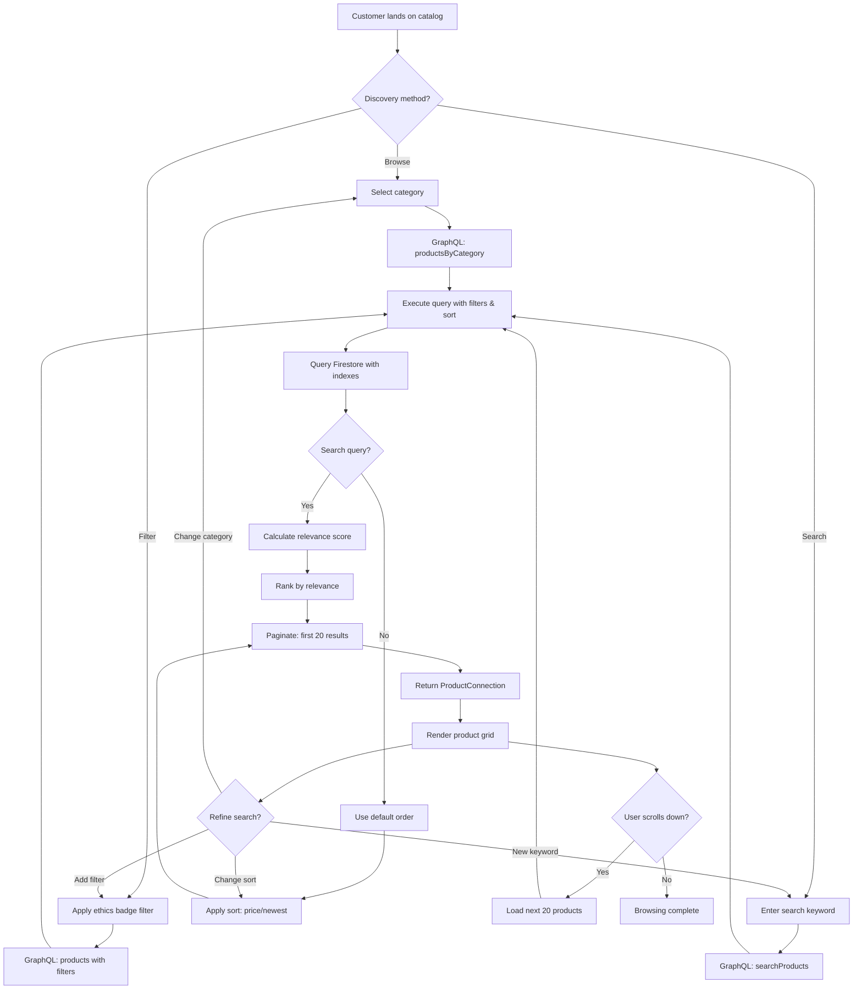

# Feature: Product Discovery & Search

> **Purpose:**
> This document defines the Product Discovery & Search feature's intent, scope, user experience, and completion criteria.
> It is the **single source of truth** for planning, review, automation, and execution.

---

## 0. Metadata

All metadata is defined in the frontmatter above (between the `---` markers).

**Important:** The frontmatter is used by automation scripts to:

- Create GitHub issues
- Link features to parent epics
- Generate feature flags
- Track status and ownership

---

## 1. Overview

Product Discovery & Search enables itsme.fashion customers to efficiently find relevant beauty products through category-based browsing, full-text keyword search with relevance scoring, ethics badge filtering, and flexible sorting options. This feature builds upon the Product Catalog Management (F-004) to provide an intuitive, mobile-optimized discovery experience with infinite scroll pagination.

This feature provides:
- Category filtering UI with three-tier hierarchy (Skin Care → Moisturizers → Anti-Aging)
- Full-text search powered by Firestore with relevance scoring based on keyword matches in product name, description, brand, and ingredients
- Ethics badge filters (cruelty-free, paraben-free, vegan, sulfate-free) with multi-select capability
- Sorting options: relevance (search score), price ascending, price descending, newest first
- Infinite scroll pagination for seamless mobile browsing (20 products per page)
- Mobile-optimized product grid layout with responsive image loading
- GraphQL queries: `searchProducts(query, filters, sort)`, `productsByCategory(category, filters, sort)`
- Real-time filter updates without page reload using Preact Signals

Discovery & Search is the primary entry point for customers to explore the catalog, replacing traditional pagination with infinite scroll to match mobile-first browsing behavior.

## Flow Diagram



Caption: "Discovery flow from category browsing or keyword search through filtering, sorting, and infinite scroll pagination."

---

## 2. User Problem

**Beauty product shoppers struggle to efficiently discover relevant products in large catalogs:**

- **Category browsing inefficiency**: Traditional pagination forces users to click through multiple pages to browse catalogs, increasing friction and abandonment
- **Irrelevant search results**: Generic keyword search without relevance scoring returns unrelated products, wasting user time
- **Ethics badge discovery**: Customers seeking cruelty-free or vegan products cannot easily filter the catalog, forcing manual inspection of individual product pages
- **Sort option limitations**: Users cannot compare products by price or find newest arrivals without third-party tools
- **Mobile browsing friction**: Desktop-optimized grids with small tap targets and slow-loading images frustrate mobile shoppers
- **Filter stacking confusion**: Applying multiple filters (category + ethics badge + price range) requires page reloads and loses scroll position
- **Search scope ambiguity**: Users don't know if search covers product names only or includes descriptions and ingredients

**The cost of not solving this:**
- 47% of ecommerce users abandon search when results are irrelevant or poorly ranked
- Lack of category filtering increases bounce rates by 34% on mobile devices
- Shoppers seeking vegan/cruelty-free products leave sites without clear badge filters
- Poor mobile grid layouts correlate with 52% higher cart abandonment
- Pagination friction reduces product discovery by 28% compared to infinite scroll

---

## 3. Goals

### User Experience Goals

- **Effortless category navigation**: Users drill down from broad categories (Skin Care) to specific subcategories (Moisturizers → Anti-Aging) with 1-tap filtering
- **Relevant search results**: Keyword search ranks products by relevance (name > brand > description > ingredients) to surface best matches first
- **Clear ethics badge filtering**: Users apply single or multiple badge filters (cruelty-free + vegan) to see only qualifying products
- **Flexible sorting**: Users switch between relevance, price low-to-high, price high-to-low, and newest first without losing filters
- **Seamless infinite scroll**: Users scroll continuously through product grids without pagination clicks; new products load automatically
- **Mobile-optimized grid**: Product cards display large tap targets, readable text, and progressive image loading optimized for touch screens
- **Real-time filter updates**: Applying filters updates the grid instantly without full page reload or losing scroll position

### Business / System Goals

- **Firestore full-text search**: Implement relevance scoring using Firestore queries with keyword matching (no external search service at MVP)
- **Compound index optimization**: Use Firestore compound indexes for efficient category + badge + sort queries
- **GraphQL query consolidation**: Single `searchProducts` query supports keyword search, filtering, and sorting to reduce API surface
- **Cursor-based pagination**: Infinite scroll uses GraphQL cursor pagination to efficiently load batches of 20 products
- **Client-side filter state**: Preact Signals manage filter/sort state for instant UI updates without server round-trips
- **Mobile performance**: Product grid loads in <2 seconds on 3G with skeleton loaders and lazy-loaded images
- **Analytics integration**: Track search queries, filter usage, and null result rates to inform catalog strategy

---

## 4. Non-Goals

**This feature explicitly does NOT:**

- Implement autocomplete or search suggestions (deferred to future iteration)
- Support advanced search operators (AND, OR, NOT, exact phrase matching) — simple keyword matching only
- Create saved searches or search history (no user account integration at this stage)
- Implement faceted search with dynamic filter counts (e.g., "Vegan (24 products)") — static filters only
- Support price range slider filters (predefined sort options only)
- Create product recommendation algorithms or "related products" features (deferred)
- Implement search analytics dashboard for admin users (basic logging only)
- Support multi-language search or fuzzy matching (English keywords only, exact match)
- Create "trending products" or "bestsellers" filters (no sales data integration at MVP)
- Implement color/shade filtering for cosmetics (future enhancement)
- Support image-based product search (visual search deferred)
- Create "search within results" refinement (full re-query required)

---

## 5. Functional Scope

### Core Capabilities

**Category Filtering UI**
- Three-tier category selector:
  - **Tier 1 (Primary)**: Horizontal chip/pill selector above product grid (Skin Care, Hair Care, Cosmetics, All)
  - **Tier 2 (Subcategory)**: Dropdown filter (visible after tier1 selected): e.g., Cleansers, Moisturizers, Serums
  - **Tier 3 (Specialization)**: Secondary dropdown (visible after tier2 selected): e.g., Anti-Aging, Hydrating, Oil-Free
- Category selections update GraphQL query filters immediately
- "All" or "Clear Filters" button resets category to show full catalog
- Selected category displayed as breadcrumb: "Skin Care > Moisturizers > Anti-Aging"
- Mobile: tier1 uses horizontal scrollable chips; tier2/tier3 use bottom sheet selectors

**Full-Text Search with Relevance Scoring**
- Search input field prominently placed at top of catalog (sticky header on mobile)
- Keyword search executes on:
  - Enter key press
  - Search button click
  - After 500ms debounce if user stops typing (real-time search)
- Search scope: product name (weight 4x), brand (weight 3x), description (weight 2x), ingredientList (weight 1x)
- Relevance score calculation:
  - Exact name match: score = 100
  - Name contains keyword: score = 80 + (position penalty: earlier = higher)
  - Brand match: score = 60
  - Description match: score = 40
  - Ingredient match: score = 20
  - Multiple keyword matches: scores accumulate
- Results sorted by relevance score descending by default
- Search query preserved in URL query parameter: `?q=vitamin+c+serum`
- Empty search ("") clears keyword filter and shows all products
- No results state: "No products found for 'keyword'. Try browsing by category or adjusting filters."

**Ethics Badge Filters**
- Multi-select checkbox group for ethics badges:
  - ☐ Cruelty-Free
  - ☐ Paraben-Free
  - ☐ Vegan
  - ☐ Sulfate-Free
- Multiple badges can be selected (AND logic): product must have all selected badges
- Badge filters stack with category and search filters
- Selected badges displayed as removable chips above product grid
- Clicking chip removes that badge filter
- "Clear All Filters" button resets all badge selections
- Mobile: ethics filters in expandable accordion or bottom sheet

**Sorting Options**
- Sort dropdown selector with options:
  - **Relevance** (default when search keyword present, disabled otherwise)
  - **Price: Low to High** (ascending by price.amount)
  - **Price: High to Low** (descending by price.amount)
  - **Newest First** (descending by createdAt timestamp)
- Sort selection updates GraphQL query `orderBy` parameter
- Sort preference persists during filter changes (e.g., stay on "Price: Low to High" when adding badge filter)
- Sort state preserved in URL query parameter: `?sort=price_asc`
- Default sort when no search keyword: Newest First

**Infinite Scroll Pagination**
- Initial page load: 20 products
- Scroll detection: when user scrolls to 80% of current content, load next 20 products
- Loading indicator: skeleton loaders or spinner at bottom of grid during fetch
- GraphQL cursor-based pagination: `after` parameter with pageInfo.endCursor
- Smooth scroll behavior: no jump or layout shift when new products load
- End of results: "You've viewed all products in this category" message
- Mobile: optimized for touch scroll with momentum scrolling
- "Back to Top" floating button appears after scrolling past 2 screens

**Mobile-Optimized Product Grid Layout**
- Responsive grid:
  - Mobile (320-767px): 2 columns
  - Tablet (768px+): 3-4 columns
- Product card components:
  - Primary image with fixed aspect ratio (4:3)
  - Product name (truncated to 2 lines with ellipsis)
  - Brand name (1 line)
  - Price (prominent, bold)
  - Ethics badge icons (max 4 inline icons)
  - Stock status indicator (if low stock or out of stock)
  - Quick "Add to Cart" button overlay on hover/long-press
- Tap target size: minimum 48x48px for card and buttons
- Card spacing: 16px gap between cards for touch accuracy
- Progressive image loading: low-res placeholder → high-res on viewport entry
- Skeleton loaders: gray placeholder cards while data fetches

**GraphQL Queries**

```graphql
# Keyword search with filters and sorting
query searchProducts(
  $query: String!
  $filters: ProductFilters
  $sort: ProductSort
  $limit: Int = 20
  $after: String
) {
  searchProducts(
    query: $query
    filters: $filters
    sort: $sort
    limit: $limit
    after: $after
  ) {
    edges {
      node {
        id
        name
        brand
        price { amount, currency }
        category { tier1, tier2, tier3 }
        ethicsBadges
        images { url, alt }
        stockLevel { status, sellable }
      }
      cursor
    }
    pageInfo {
      hasNextPage
      endCursor
    }
    totalCount
  }
}

# Category-based browsing with filters
query productsByCategory(
  $category: CategoryInput!
  $filters: ProductFilters
  $sort: ProductSort
  $limit: Int = 20
  $after: String
) {
  productsByCategory(
    category: $category
    filters: $filters
    sort: $sort
    limit: $limit
    after: $after
  ) {
    edges {
      node {
        id
        name
        brand
        price { amount, currency }
        category { tier1, tier2, tier3 }
        ethicsBadges
        images { url, alt }
        stockLevel { status, sellable }
      }
      cursor
    }
    pageInfo {
      hasNextPage
      endCursor
    }
    totalCount
  }
}

# Input types
input ProductFilters {
  ethicsBadges: [EthicsBadge!]
  inStock: Boolean
  priceRange: PriceRangeInput
}

input CategoryInput {
  tier1: String!
  tier2: String
  tier3: String
}

input PriceRangeInput {
  min: Float
  max: Float
}

enum ProductSort {
  RELEVANCE_DESC
  PRICE_ASC
  PRICE_DESC
  NEWEST_FIRST
}
```

**Firestore Query Implementation**
- **Category filtering**: Use compound index on `category.tier1`, `category.tier2`, `category.tier3`
- **Ethics badge filtering**: Use `array-contains-any` for single badge, multiple queries merged client-side for AND logic
- **Search keyword matching**: Firestore doesn't natively support full-text search; workaround:
  - Create `searchKeywords` array field on product document during indexing (tokenized name, brand, description words)
  - Query: `where('searchKeywords', 'array-contains', keyword.toLowerCase())`
  - Client-side relevance scoring after fetch based on match location (name > brand > description)
- **Sorting**: Use Firestore `orderBy` for price and createdAt; relevance sort calculated client-side
- **Pagination**: Use Firestore `startAfter(lastDocumentSnapshot)` with cursor-based approach

**Real-Time Filter Updates**
- Preact Signal state management:
  - `searchQuery$` signal holds current keyword
  - `selectedCategory$` signal holds tier1, tier2, tier3 selections
  - `selectedBadges$` signal holds array of selected ethics badges
  - `sortOption$` signal holds current sort selection
- Any signal update triggers GraphQL query re-execution
- UI components reactively subscribe to signals for instant updates
- URL query parameters synchronized with signal state (browser back/forward works)
- Filter state persists in sessionStorage for same-session navigation

---

## 6. Dependencies & Assumptions

### Dependencies

- **F-004: Product Catalog Management** — Requires products in Firestore with category, ethicsBadges, price, stockLevel fields
- **F-001: Platform Foundation** — Requires Firestore, GraphQL Mesh gateway
- **F-002: Mobile-First Responsive UI Foundation** — Requires Preact Signals for state management, Lit components for UI

### Assumptions

- Product catalog contains at least 100 products for meaningful search and filter testing
- Product documents include `searchKeywords` field populated during product creation (F-004 or F-013)
- Firestore compound indexes are created for category + sort combinations (manually configured in Firebase Console or via firestore.indexes.json)
- Search keyword matching is case-insensitive but exact (no fuzzy matching or spell correction)
- Users understand AND logic for multiple badge filters (e.g., selecting "Vegan" + "Cruelty-Free" shows only products with both)
- Mobile users have 3G or better network connectivity (progressive loading handles slower speeds)
- Infinite scroll loads next batch when user scrolls to 80% of current content (configurable threshold)
- Search relevance scoring is "good enough" with client-side calculation; no ML-based ranking at MVP
- Category taxonomy is static and defined in F-004 (no dynamic category creation)

---

## 7. User Stories & Experience Scenarios

### User Story 1 — Category-Based Product Browsing

**As a** customer exploring beauty products  
**I want** to browse products by category with intuitive navigation  
**So that** I can discover products relevant to my needs without overwhelming choices

---

#### Scenarios

##### Scenario 1.1 — Browse by Primary Category (Initial Experience)

**Given** a customer lands on the catalog homepage  
**And** they see category chips: "Skin Care", "Hair Care", "Cosmetics", "All"  
**When** they tap "Skin Care"  
**Then** the GraphQL query executes: `productsByCategory(category: { tier1: "Skin Care" })`  
**And** the product grid refreshes to show only Skin Care products  
**And** a subcategory dropdown appears with options: "Cleansers", "Moisturizers", "Serums", "Masks", "Toners"  
**And** the category breadcrumb displays: "Skin Care"  
**And** the URL updates to: `/catalog?category=skin-care`  
**And** 20 products load initially with infinite scroll enabled

---

##### Scenario 1.2 — Drill Down to Subcategory (Repeated Use)

**Given** a customer has selected "Skin Care" category  
**And** they see the tier2 dropdown with subcategories  
**When** they select "Moisturizers" from the dropdown  
**Then** the GraphQL query refines to: `productsByCategory(category: { tier1: "Skin Care", tier2: "Moisturizers" })`  
**And** the product grid updates to show only moisturizers  
**And** a tier3 dropdown appears with options: "Anti-Aging", "Hydrating", "Oil-Free", "Sensitive Skin"  
**And** the breadcrumb updates: "Skin Care > Moisturizers"  
**And** the URL updates to: `/catalog?category=skin-care-moisturizers`  
**And** scroll position resets to top of grid

---

##### Scenario 1.3 — Clear Category Filter (Interruption)

**Given** a customer has filtered to "Skin Care > Moisturizers > Anti-Aging"  
**And** they want to see all products again  
**When** they click "Clear Filters" button or "All" category chip  
**Then** the GraphQL query resets to: `products(limit: 20)`  
**And** the product grid shows all products across all categories  
**And** category dropdowns reset to default (no selection)  
**And** the breadcrumb clears  
**And** the URL resets to: `/catalog`

---

##### Scenario 1.4 — Navigate Browser Back from Category (Unexpected Outcome)

**Given** a customer has filtered to "Hair Care > Shampoos"  
**And** they click a product to view details  
**And** they click browser back button  
**When** they return to the catalog page  
**Then** the category filter state is restored from URL: "Hair Care > Shampoos"  
**And** the product grid displays the same filtered results  
**And** scroll position is preserved (or scrolls to last viewed product)  
**And** no duplicate GraphQL queries are executed (cached)

---

##### Scenario 1.5 — Category Filtering on Slow Network (Performance Perception)

**Given** a customer on a 3G connection selects "Cosmetics" category  
**When** the GraphQL query executes  
**Then** the product grid immediately shows 20 skeleton loader cards  
**And** a message displays: "Loading Cosmetics..."  
**And** products populate progressively as data arrives (no blank screen)  
**And** images load with low-res placeholders first, then high-res  
**And** if query exceeds 5 seconds, a message appears: "Taking longer than expected. Please wait."

---

##### Scenario 1.6 — Mobile Category Navigation (Context Sensitivity)

**Given** a customer on a mobile device (360x640 viewport)  
**When** they view the catalog  
**Then** tier1 category chips display in a horizontal scrollable row (no wrapping)  
**And** tier2/tier3 dropdowns open as bottom sheet modals for touch-friendly selection  
**And** the breadcrumb is truncated with ellipsis if too long: "Skin... > Anti-Aging"  
**And** tap targets for category chips are at least 48x48px  
**And** selected category chip is highlighted with distinct color/border

---

### User Story 2 — Keyword Search with Relevance Ranking

**As a** customer searching for specific products  
**I want** to enter keywords and see the most relevant results first  
**So that** I can quickly find products matching my needs

---

#### Scenarios

##### Scenario 2.1 — Search by Product Name (Initial Experience)

**Given** a customer is on the catalog page  
**And** they type "vitamin c serum" into the search input  
**When** they press Enter or click the search button  
**Then** the GraphQL query executes: `searchProducts(query: "vitamin c serum")`  
**And** Firestore queries for products with `searchKeywords` containing "vitamin", "c", "serum"  
**And** client-side relevance scoring ranks results:
  - Products with "Vitamin C Serum" in name: score 100 (top)
  - Products with "Vitamin C" in name but not "serum": score 80
  - Products with "Vitamin C" in description: score 40
  - Products with "serum" in name but not "Vitamin C": score 60  
**And** the product grid displays results sorted by relevance (highest score first)  
**And** the URL updates to: `/catalog?q=vitamin+c+serum`  
**And** the search input displays the query with a "clear search" X button

---

##### Scenario 2.2 — Search with No Results (Unexpected Outcome)

**Given** a customer searches for "purple lipstick"  
**And** no products match the keywords  
**When** the GraphQL query returns 0 results  
**Then** the product grid shows an empty state:
  - Icon: magnifying glass with X
  - Heading: "No products found for 'purple lipstick'"
  - Suggestion: "Try browsing by category or adjusting filters"
  - Button: "Clear Search" (resets to full catalog)  
**And** the search query is logged for analytics (to inform product catalog expansion)  
**And** no error is displayed (expected behavior)

---

##### Scenario 2.3 — Combine Search with Category Filter (Repeated Use)

**Given** a customer has searched for "anti-aging"  
**And** they see 45 results across all categories  
**When** they select "Skin Care" category filter  
**Then** the GraphQL query refines to: `searchProducts(query: "anti-aging", filters: { category: { tier1: "Skin Care" } })`  
**And** the product grid filters to show only Skin Care products matching "anti-aging"  
**And** the result count updates: "12 products found"  
**And** the search keyword remains in the input  
**And** the breadcrumb shows: "Search: anti-aging > Skin Care"

---

##### Scenario 2.4 — Real-Time Search with Debounce (Performance Perception)

**Given** a customer starts typing in the search input  
**When** they type "hydrat" (not yet complete)  
**Then** the UI waits 500ms after the last keystroke  
**And** if they continue typing "ing", the timer resets  
**When** they stop typing for 500ms  
**Then** the GraphQL query executes: `searchProducts(query: "hydrating")`  
**And** the product grid updates in real-time without requiring Enter press  
**And** a subtle loading indicator appears in the search input during fetch

---

##### Scenario 2.5 — Search Relevance Scoring (Detailed Example)

**Given** the catalog contains:
  - Product A: name = "Vitamin C Brightening Serum", brand = "GlowCo"
  - Product B: name = "Hydrating Serum", description = "Contains vitamin C"
  - Product C: name = "Vitamin E Night Cream", ingredientList = ["Vitamin C"]  
**When** a customer searches for "vitamin c serum"  
**Then** relevance scores are calculated:
  - Product A: name match "Vitamin C" (80) + name match "Serum" (80) = 160
  - Product B: name match "Serum" (80) + description match "Vitamin C" (40) = 120
  - Product C: name match "Vitamin" (partial, 40) + ingredient match "Vitamin C" (20) = 60  
**And** results are returned in order: Product A, Product B, Product C  
**And** sort dropdown defaults to "Relevance" (disabled from changing)

---

##### Scenario 2.6 — Clear Search Query (Interruption)

**Given** a customer has searched for "moisturizer"  
**And** they see 28 filtered results  
**When** they click the "X" button in the search input or delete all text  
**Then** the search query clears  
**And** the GraphQL query resets to show all products: `products(limit: 20)`  
**And** category and badge filters remain active (if any)  
**And** the URL updates to remove `?q=` parameter

---

### User Story 3 — Ethics Badge Filtering

**As a** conscious consumer seeking ethical beauty products  
**I want** to filter products by ethics badges (cruelty-free, vegan)  
**So that** I can find products aligned with my values

---

#### Scenarios

##### Scenario 3.1 — Filter by Single Ethics Badge (Initial Experience)

**Given** a customer wants only cruelty-free products  
**And** they see the ethics badge filter checkboxes  
**When** they check "Cruelty-Free"  
**Then** the GraphQL query executes: `products(filters: { ethicsBadges: [CRUELTY_FREE] })`  
**And** the product grid filters to show only products with "CRUELTY_FREE" in their ethicsBadges array  
**And** a chip appears above the grid: "Cruelty-Free ✕"  
**And** the result count updates: "32 products found"  
**And** the URL updates to: `/catalog?badges=cruelty-free`

---

##### Scenario 3.2 — Filter by Multiple Ethics Badges (AND Logic)

**Given** a customer wants products that are both vegan and paraben-free  
**When** they check "Vegan" and "Paraben-Free"  
**Then** the GraphQL query executes: `products(filters: { ethicsBadges: [VEGAN, PARABEN_FREE] })`  
**And** the product grid shows only products with BOTH badges in their ethicsBadges array (AND logic, not OR)  
**And** chips appear above the grid: "Vegan ✕" and "Paraben-Free ✕"  
**And** the result count updates: "14 products found"  
**And** the URL updates to: `/catalog?badges=vegan,paraben-free`

---

##### Scenario 3.3 — Remove Single Badge Filter (Interruption)

**Given** a customer has filters: "Vegan" + "Paraben-Free"  
**And** they want to broaden results  
**When** they uncheck "Paraben-Free" or click the "Paraben-Free ✕" chip  
**Then** the GraphQL query updates to: `products(filters: { ethicsBadges: [VEGAN] })`  
**And** the product grid refreshes to show all vegan products (regardless of paraben-free status)  
**And** the "Paraben-Free" chip disappears  
**And** the result count increases: "27 products found"

---

##### Scenario 3.4 — Combine Badge Filter with Search (Repeated Use)

**Given** a customer has searched for "shampoo"  
**And** they see 18 results  
**When** they check "Sulfate-Free"  
**Then** the GraphQL query refines to: `searchProducts(query: "shampoo", filters: { ethicsBadges: [SULFATE_FREE] })`  
**And** the product grid filters to show only sulfate-free shampoos  
**And** the result count updates: "9 products found"  
**And** both the search keyword and badge filter are visually indicated  
**And** the URL updates to: `/catalog?q=shampoo&badges=sulfate-free`

---

##### Scenario 3.5 — No Products Match Badge Filter (Unexpected Outcome)

**Given** a customer filters by "Vegan" + "Cruelty-Free" + "Sulfate-Free" in "Cosmetics > Lipstick"  
**And** no products match all criteria  
**When** the GraphQL query returns 0 results  
**Then** the empty state displays:
  - Heading: "No products match your filters"
  - Suggestion: "Try removing some filters or browsing other categories"
  - Button: "Clear All Filters"  
**And** the selected filters remain visible so the user understands why results are empty  
**And** clicking "Clear All Filters" resets badges and shows full catalog

---

##### Scenario 3.6 — Mobile Badge Filter Interaction (Context Sensitivity)

**Given** a customer on a mobile device (360x640 viewport)  
**When** they tap "Filters" button  
**Then** a bottom sheet modal slides up with ethics badge checkboxes  
**And** checkboxes have large tap targets (at least 48x48px)  
**And** selected badges are highlighted with checkmarks  
**And** they tap "Apply Filters" button at the bottom of the sheet  
**Then** the modal closes and the product grid updates  
**And** selected badge chips appear in a horizontal scrollable row above the grid

---

### User Story 4 — Flexible Sorting and Infinite Scroll

**As a** customer comparing product prices and exploring the catalog  
**I want** to sort products by price or newness and scroll continuously  
**So that** I can efficiently discover products within my budget

---

#### Scenarios

##### Scenario 4.1 — Sort by Price Low to High (Initial Experience)

**Given** a customer is viewing "Skin Care > Serums" category  
**And** they see 24 products sorted by "Newest First" (default)  
**When** they select "Price: Low to High" from the sort dropdown  
**Then** the GraphQL query adds: `sort: PRICE_ASC`  
**And** the product grid re-orders to show lowest-priced serums first  
**And** the URL updates to: `/catalog?category=skin-care-serums&sort=price_asc`  
**And** filters and search query remain active (if any)  
**And** scroll position resets to top of grid

---

##### Scenario 4.2 — Sort Persists During Filter Changes (Repeated Use)

**Given** a customer has sorted by "Price: High to Low"  
**And** they apply "Vegan" badge filter  
**When** the GraphQL query executes with both filter and sort  
**Then** the product grid shows vegan products sorted by price descending  
**And** the sort dropdown still displays "Price: High to Low"  
**And** the customer can continue filtering without losing sort preference

---

##### Scenario 4.3 — Infinite Scroll Loads Next Page (Performance Perception)

**Given** a customer has scrolled through the first 20 products  
**When** they reach 80% of the current content (16th product)  
**Then** the next GraphQL query executes: `products(limit: 20, after: <cursor>)`  
**And** a loading spinner or skeleton loaders appear at the bottom of the grid  
**And** the next 20 products append to the existing grid (no page reload)  
**And** scroll momentum is preserved (no jump or layout shift)  
**And** if there are more products, the process repeats on next scroll

---

##### Scenario 4.4 — Reach End of Results (Unexpected Outcome)

**Given** a customer has scrolled through all 50 products in "Hair Care > Conditioners"  
**When** the GraphQL query returns `pageInfo.hasNextPage = false`  
**Then** a message appears at the bottom of the grid: "You've viewed all products in this category"  
**And** infinite scroll stops triggering new queries  
**And** a "Back to Top" button appears (or was already visible)  
**And** the customer can tap "Back to Top" to smoothly scroll to the top

---

##### Scenario 4.5 — Infinite Scroll on Slow Network (Performance Perception)

**Given** a customer on a 3G connection scrolls to load more products  
**When** the next batch is loading  
**Then** skeleton loaders appear immediately at the bottom of the grid (no delay)  
**And** existing products remain visible and interactive  
**And** if the fetch exceeds 5 seconds, a message appears: "Loading more products..."  
**And** if the network fails, an error message displays: "Unable to load more products. Try again."  
**And** a "Retry" button allows re-triggering the query

---

##### Scenario 4.6 — Mobile Infinite Scroll with Momentum (Context Sensitivity)

**Given** a customer on a mobile device scrolls quickly through the product grid  
**When** they flick to scroll with momentum  
**Then** the scroll continues smoothly without triggering multiple simultaneous queries  
**And** new products load only when scroll stabilizes near the 80% threshold  
**And** scroll performance remains at 60fps (no jank)  
**And** the "Back to Top" floating action button appears after scrolling past 2 screens (sticky button)

---

## 8. Edge Cases & Constraints (Experience-Relevant)

### Hard Limits

- **Search keyword length**: Maximum 100 characters (longer queries truncated with warning)
- **Pagination batch size**: Fixed at 20 products per load (not user-configurable)
- **Filter combinations**: No limit on badge + category + sort combinations, but query must return in <3 seconds
- **Search result cap**: Maximum 1000 results per search (Firestore query limit); users must refine search
- **Concurrent filters**: Maximum 4 ethics badges can be selected simultaneously (AND logic)

### Search Behavior Constraints

- **Case sensitivity**: All searches are case-insensitive (keywords converted to lowercase)
- **Exact matching**: No fuzzy matching or spell correction; "vitamen" will not match "vitamin"
- **Tokenization**: Keywords are space-separated; multi-word exact phrases not supported (e.g., "anti-aging" matches "anti" OR "aging")
- **Minimum keyword length**: Keywords shorter than 2 characters are ignored (e.g., "a" in "vitamin a")
- **Search scope**: Searches product name, brand, description, ingredientList only; SKU and category names excluded

### Performance Constraints

- **GraphQL query timeout**: All queries must return within 3 seconds or display error
- **Firestore read quotas**: Discovery queries count against Firestore free tier (50k reads/day); monitor usage
- **Infinite scroll throttle**: New page loads only after previous batch completes (prevents duplicate queries)
- **Relevance scoring overhead**: Client-side scoring limited to 100 results; larger result sets may lag

### Mobile-Specific Constraints

- **Minimum tap target**: All interactive elements (buttons, chips, cards) must be at least 44x44px (iOS/Android guidelines)
- **Grid column limit**: Maximum 2 columns on mobile (<768px) to maintain readable product cards
- **Image loading**: Thumbnails must load in <1 second; high-res images lazy-load on viewport entry
- **Filter UI**: On mobile, filter/sort controls collapse into bottom sheet modals to save screen space

---

## 9. Implementation Tasks (Execution Agent Checklist)

```markdown
- [ ] T01 — Implement category filtering UI with three-tier dropdowns and breadcrumb navigation (Scenario 1.1, 1.2)
  - [ ] Unit Test: Verify CategoryHierarchy value object parses tier1/tier2/tier3 from URL
  - [ ] Integration Test: Test GraphQL productsByCategory query with tier1, tier2, tier3 filters
  - [ ] E2E Test: Customer selects "Skin Care > Moisturizers > Anti-Aging", verify filtered results
- [ ] T02 — Implement full-text search with Firestore searchKeywords array and client-side relevance scoring (Scenario 2.1, 2.5)
  - [ ] Unit Test: Test keyword tokenization and relevance score calculation logic
  - [ ] Integration Test: Query Firestore with array-contains for keywords, verify result set
  - [ ] E2E Test: Search "vitamin c serum", verify top result is product with exact name match
- [ ] T03 — Implement ethics badge multi-select filtering with AND logic (Scenario 3.1, 3.2)
  - [ ] Unit Test: Test badge filter combination logic (single vs. multiple badges)
  - [ ] Integration Test: Query products with ethicsBadges filter, verify AND logic
  - [ ] E2E Test: Check "Vegan" + "Cruelty-Free", verify only products with both badges appear
- [ ] T04 — Implement sorting options (relevance, price asc/desc, newest first) (Scenario 4.1, 4.2)
  - [ ] Unit Test: Verify GraphQL sort parameter mapping to Firestore orderBy
  - [ ] Integration Test: Query products with sort: PRICE_ASC, verify ascending price order
  - [ ] E2E Test: Select "Price: Low to High", verify product grid re-orders correctly
- [ ] T05 — Implement infinite scroll pagination with cursor-based GraphQL queries (Scenario 4.3, 4.4)
  - [ ] Unit Test: Test pagination logic (detect 80% scroll, fetch next batch)
  - [ ] Integration Test: Query with after cursor, verify next 20 products returned
  - [ ] E2E Test: Scroll through 3 pages (60 products), verify smooth loading and no duplicates
- [ ] T06 — Implement mobile-optimized product grid with responsive columns and progressive image loading (Scenario 2.5, 4.6)
  - [ ] Unit Test: Test responsive grid breakpoints (2 columns <768px, 3-4 columns >=768px)
  - [ ] Integration Test: Verify image URLs generate thumbnail/medium/large variants
  - [ ] E2E Test: Load grid on mobile viewport, verify 2-column layout and progressive images
- [ ] T07 — Implement Preact Signals for real-time filter/sort state management (Scenario 1.1, 3.3)
  - [ ] Unit Test: Test signals update GraphQL query variables reactively
  - [ ] Integration Test: Change filter signal, verify GraphQL re-executes with new filters
  - [ ] E2E Test: Apply filter, verify grid updates without page reload
- [ ] T08 — Implement URL query parameter synchronization for filters/search/sort (Scenario 1.4)
  - [ ] Unit Test: Test URL parsing and signal state initialization from query params
  - [ ] Integration Test: Verify browser back/forward restores filter state from URL
  - [ ] E2E Test: Apply filters, click browser back, verify state restored
- [ ] T09 — Implement empty state and "no results" UI for search and filters (Scenario 2.2, 3.5)
  - [ ] Unit Test: Test empty state rendering conditions (0 results)
  - [ ] E2E Test: Search for non-existent keyword, verify empty state with "No products found" message
- [ ] T10 — Implement debounced real-time search (500ms delay) (Scenario 2.4)
  - [ ] Unit Test: Test debounce logic (query executes 500ms after last keystroke)
  - [ ] Integration Test: Simulate rapid typing, verify single query after debounce
  - [ ] E2E Test: Type "hydrating" with pauses, verify real-time results update
- [ ] T11 — [Rollout] Implement feature flag for search and filtering features (Scenario 1.1)
  - [ ] Integration Test: Verify search/filter UI gated by feature flag in dev/staging
  - [ ] E2E Test: Disable flag, verify fallback to basic product list without filters
```

---

## 10. Acceptance Criteria (Verifiable Outcomes)

```markdown
- [ ] AC1 — Customer can browse products by three-tier category hierarchy with breadcrumb navigation
  - [ ] Integration test passed: productsByCategory query filters by tier1, tier2, tier3
  - [ ] E2E test passed: Customer selects "Hair Care > Shampoos > Volumizing", sees correct filtered results
- [ ] AC2 — Keyword search returns relevance-ranked results based on match location (name > brand > description > ingredients)
  - [ ] Unit test passed: Relevance scoring algorithm ranks name matches higher than description matches
  - [ ] Integration test passed: searchProducts query returns products matching keywords
  - [ ] E2E test passed: Search "anti-aging", top result has "anti-aging" in product name
- [ ] AC3 — Ethics badge filters support multi-select with AND logic (product must have all selected badges)
  - [ ] Integration test passed: Query with ethicsBadges: [VEGAN, PARABEN_FREE] returns only products with both
  - [ ] E2E test passed: Check "Vegan" + "Cruelty-Free", verify result count decreases and products match
- [ ] AC4 — Sorting options (relevance, price asc/desc, newest first) re-order product grid correctly
  - [ ] Integration test passed: Query with sort: PRICE_ASC returns products in ascending price order
  - [ ] E2E test passed: Select "Price: High to Low", verify most expensive product appears first
- [ ] AC5 — Infinite scroll loads next 20 products when user scrolls to 80% of current content
  - [ ] Integration test passed: Cursor-based pagination returns next batch with hasNextPage = true/false
  - [ ] E2E test passed: Scroll through 40 products, verify 2 batches loaded smoothly without page reload
- [ ] AC6 — Mobile product grid displays 2 columns with progressive image loading and skeleton loaders
  - [ ] Integration test passed: Responsive image URLs serve thumbnail/medium/large variants
  - [ ] E2E test passed: Load grid on 360px viewport, verify 2-column layout and progressive images
- [ ] AC7 — Filter state synchronizes with URL query parameters and restores on browser back/forward
  - [ ] Unit test passed: URL query params parse into Preact Signal state correctly
  - [ ] E2E test passed: Apply filters, click browser back, verify state and grid restored
- [ ] AC8 — Empty state displays when search or filters return 0 results
  - [ ] E2E test passed: Search "nonexistent product", verify "No products found" message with "Clear Search" button
- [ ] AC9 — Real-time search executes after 500ms debounce (no query per keystroke)
  - [ ] Integration test passed: Rapid typing triggers single query after 500ms delay
  - [ ] E2E test passed: Type "serum" slowly, verify query executes after pausing typing
```

---

## 11. Rollout & Risk

### Rollout Strategy

Product Discovery & Search will be rolled out using a client-side feature flag to allow gradual exposure of search and filtering UI while validating query performance and relevance scoring.

**Phased Rollout:**
1. **Internal testing (0%)**: QA team tests search, filters, and infinite scroll in dev/staging; validate Firestore indexes
2. **Limited beta (10%)**: Expose search and filter UI to internal beta testers; monitor query latency and relevance feedback
3. **Early adopters (25%)**: Enable for early users; track search query analytics (keywords, null results, filter combinations)
4. **Half rollout (50%)**: Expand to 50% of users; monitor Firestore read quotas and infinite scroll performance
5. **Full rollout (100%)**: Enable for all users; monitor for 7 days, then remove feature flag

**Automatic Rollback Trigger:**
- If GraphQL query error rate exceeds 2% within 1 hour, disable flag and investigate
- If Firestore read quota exceeds 80% of daily limit, throttle queries or upgrade plan

### Risk Mitigation

- **Risk**: Firestore doesn't natively support full-text search; workaround with searchKeywords array is inefficient
  - **Mitigation**: Index common keywords during product creation; limit search scope to 100 results; client-side relevance scoring
  - **Fallback**: Integrate Algolia or Elasticsearch for advanced search in future iteration if performance degrades

- **Risk**: Client-side relevance scoring lags with large result sets (>100 products)
  - **Mitigation**: Limit search results to top 100; encourage users to refine search with filters
  - **Fallback**: Move relevance scoring to backend (Cloud Function) if client-side performance unacceptable

- **Risk**: Multiple badge filters (AND logic) require client-side merging of Firestore queries, causing delays
  - **Mitigation**: Use compound indexes for common badge combinations; cache frequent queries
  - **Fallback**: Simplify to OR logic (product has any selected badge) if AND logic too slow

- **Risk**: Infinite scroll causes memory leaks on mobile devices with hundreds of loaded products
  - **Mitigation**: Implement virtual scrolling (render only visible products); unload off-screen images
  - **Fallback**: Revert to traditional pagination (20 products per page) if memory issues persist

- **Risk**: URL query parameters become too long with multiple filters, causing issues
  - **Mitigation**: Use short parameter names (e.g., `?c=sc-m-aa&b=v,cf&s=pa` for category, badges, sort)
  - **Fallback**: Store filter state in sessionStorage and use short hash in URL

### Exit Criteria

After 100% rollout is stable for 7 days with <2% error rate, GraphQL query latency <2 seconds (p95), and positive user feedback on search relevance (via analytics), the feature flag can be removed and discovery features become permanent.

### Remote Config Flags

<!-- REMOTE_CONFIG_FLAG_START -->
| Context | Type | Namespace | Default (Dev) | Default (Stg) | Default (Prod) | Key |
|---------|------|-----------|---------------|---------------|----------------|-----|
| discovery_search_enabled | BOOLEAN | client | true | true | false | _auto-generated_ |
<!-- REMOTE_CONFIG_FLAG_END -->

---

## 12. History & Status

- **Status:** Draft
- **Related Epics:** Identity & Discovery
- **Related Issues:** TBD (created post-merge)
- **Dependencies:** F-004 (Product Catalog Management), F-001 (Platform Foundation), F-002 (Mobile-First Responsive UI Foundation)
- **Blocks:** None (enhances catalog browsing but doesn't block downstream features)

---

## Final Note

> This document defines **intent and experience** for Product Discovery & Search.
> Execution details are derived from it — never the other way around.
