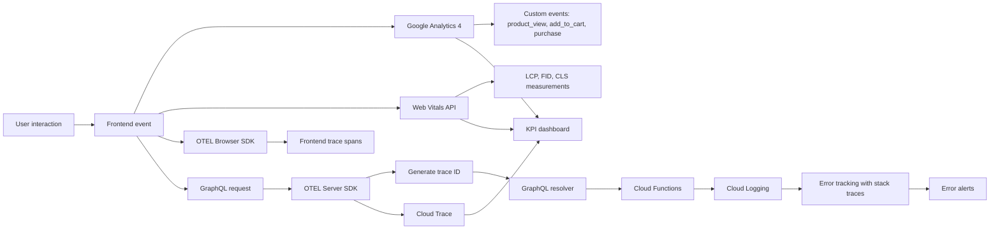

# Feature: Analytics & Monitoring

> **Purpose:**
> This document defines a single feature's intent, scope, user experience, and completion criteria.
> It is the **single source of truth** for planning, review, automation, and execution.

---

## 0. Metadata

All metadata is defined in the frontmatter above (between the `---` markers).

**Important:** The frontmatter is used by automation scripts to:

- Create GitHub issues
- Link features to parent epics
- Generate feature flags
- Track status and ownership

---

## 1. Overview

Analytics & Monitoring establishes comprehensive observability for the itsme.fashion platform, enabling data-driven decision making and proactive issue detection. This feature integrates Google Analytics 4 for user behavior tracking, OpenTelemetry for distributed tracing, and Real User Monitoring for Core Web Vitals measurement. It empowers product teams to understand user journeys, engineering teams to diagnose performance bottlenecks, and business stakeholders to track KPIs in real-time.

- **What this feature enables**: End-to-end visibility into user behavior, system performance, and business metrics across frontend and backend systems
- **Why it exists**: To replace blind deployment with observable, measurable, and improvable operations; to detect issues before they impact revenue; to validate product hypotheses with data
- **What meaningful change it introduces**: Transforms platform operations from reactive troubleshooting to proactive optimization; enables data-driven product decisions; provides early warning systems for performance degradation and errors

This is a **cross-cutting** feature affecting all bounded contexts through shared instrumentation libraries and monitoring infrastructure.

## Flow Diagram



Caption: "Analytics and monitoring data flow from user interactions through instrumentation to dashboards and alerts."

---

## 2. User Problem

**Engineering teams lack visibility into how the platform performs in production, making it difficult to detect issues before they impact users, diagnose root causes of failures, or measure the effectiveness of performance optimizations. Product teams cannot validate feature adoption or business impact without manual data extraction and analysis.**

- **Who experiences the problem**: 
  - Engineering teams struggling to diagnose production issues without logs or traces
  - Product managers unable to measure feature adoption rates, conversion funnels, or cart abandonment
  - Business stakeholders lacking real-time visibility into revenue metrics and platform health
  - Operations teams reacting to user complaints rather than proactively preventing issues

- **When and in what situations it occurs**:
  - Performance regressions are discovered only after customer complaints accumulate
  - Error spikes go unnoticed until they cause revenue-impacting outages
  - Feature launches succeed or fail without clear measurement of impact
  - Slow GraphQL queries cannot be traced to specific resolvers or database queries
  - Mobile performance issues are invisible until aggregate metrics degrade
  - Cart abandonment causes are unknown (UI bugs vs. payment failures vs. UX friction)

- **What friction exists today**:
  - No structured logging means errors lack context (user ID, order ID, trace ID)
  - Lack of distributed tracing makes it impossible to trace a slow checkout flow through Auth → Cart → Payment → Order services
  - No real user monitoring means Core Web Vitals regressions are discovered weeks after deployment
  - Product decisions rely on intuition rather than data-driven insights
  - Manual log analysis consumes engineering time that could be spent on features

- **Why existing solutions are insufficient**:
  - Console.log statements are not queryable or aggregated
  - Server logs without trace IDs cannot correlate frontend and backend failures
  - Google Analytics Universal (GA3) lacks event-driven user journey tracking
  - No automated performance monitoring means regressions are discovered reactively

---

## 3. Goals

### User Experience Goals

- **Transparent platform health**: Product teams can view real-time dashboards showing conversion rates, cart abandonment, and feature adoption without requesting data from engineering
- **Proactive issue detection**: Engineering teams receive alerts for error rate spikes or performance regressions before users report issues
- **Fast root cause diagnosis**: Distributed traces allow engineers to identify the exact resolver or function causing a slow checkout flow within minutes
- **Data-driven product decisions**: Product managers validate feature hypotheses by measuring before/after metrics (e.g., "Did the new product detail layout increase add-to-cart rate?")
- **Performance accountability**: Every feature launch is measured against Core Web Vitals targets (LCP <2.5s, FID <100ms, CLS <0.1)

### Business / System Goals

- **Increase mobile conversion rate** (KPI-01): Identify and fix performance bottlenecks causing mobile cart abandonment
- **Reduce cart abandonment rate** (KPI-02): Measure funnel drop-off points and prioritize UX improvements
- **Improve page load time** (KPI-05): Track p95 page load times and ensure <1500ms target is maintained
- **Enable rapid experimentation**: Feature flags combined with analytics allow A/B testing and gradual rollouts with measurable impact
- **Compliance and audit readiness**: Structured logs and error tracking provide audit trails for payment processing and order management
- **Cost optimization**: Track infrastructure costs per order (KPI-06) and identify expensive operations

---

## 4. Non-Goals

**Explicitly state what this feature does not attempt to solve.**

- **Session replay or user recordings**: Video recordings of user sessions are not included; focus is on event and metric tracking
- **Custom dashboarding UI**: This feature integrates with Google Analytics, Cloud Trace, and Cloud Logging native dashboards; custom dashboard development is deferred
- **Real-time alerting infrastructure**: Integration with PagerDuty, Slack, or custom alerting systems is deferred; initial alerts use Cloud Logging notifications
- **Business intelligence (BI) tools**: Integration with Looker, Tableau, or similar BI platforms is out of scope; focus is on operational metrics
- **A/B testing framework**: While analytics supports measuring A/B test outcomes, the test assignment and variant selection logic belongs to feature flag feature (F-015)
- **User-facing analytics**: Customers do not see analytics dashboards; this is an internal observability feature
- **Advanced ML-based anomaly detection**: Automated anomaly detection using machine learning is deferred; initial implementation uses threshold-based alerts
- **Third-party service monitoring**: Monitoring Cashfree, Shiprocket, or other external APIs is limited to client-side success/failure tracking; deep third-party integration monitoring is out of scope

---

## 5. Functional Scope

**Core capabilities enabled by this feature:**

### Google Analytics 4 Integration

- **GA4 SDK initialization**: Configure GA4 measurement ID in Firebase config, initialize gtag.js on page load
- **Custom event tracking**: Instrument key user actions with standardized event names
  - `product_view`: Fired when user views a product detail page (parameters: product_id, product_name, category, price)
  - `add_to_cart`: Fired when user adds a product to cart (parameters: product_id, quantity, cart_total)
  - `begin_checkout`: Fired when user initiates checkout flow (parameters: cart_total, item_count)
  - `add_payment_info`: Fired when user enters payment details (parameters: payment_method)
  - `purchase`: Fired on successful order placement (parameters: transaction_id, value, currency, items)
  - `remove_from_cart`: Fired when user removes item from cart (parameters: product_id)
  - `view_search_results`: Fired when user searches products (parameters: search_term, result_count)
- **Enhanced measurement**: Automatically track page views, scrolls, outbound clicks, site search, video engagement, file downloads (GA4 built-in)
- **User properties**: Set custom user properties (is_authenticated, user_lifetime_value, preferred_category)
- **Conversion tracking**: Mark `purchase` event as a conversion in GA4 for funnel analysis

### OpenTelemetry Distributed Tracing

- **OTEL SDK initialization**: Configure OpenTelemetry SDK in Cloud Functions and GraphQL Mesh gateway
- **Automatic trace instrumentation**: Use OTEL auto-instrumentation libraries for HTTP, GraphQL, Firestore, and Firebase Functions
- **Manual span creation**: Create custom spans for critical operations (e.g., inventory reservation, payment processing, shipment creation)
- **Trace context propagation**: Inject trace IDs into HTTP headers to correlate frontend and backend requests
- **Cloud Trace integration**: Export OTEL traces to Google Cloud Trace for visualization
- **Span attributes**: Attach metadata to spans (user_id, order_id, product_id, resolver_name, function_name)
- **Trace sampling**: Sample 100% of traces in dev/staging, 10% in production to manage costs
- **Error span marking**: Mark spans as failed with error messages and stack traces

### Real User Monitoring (RUM) for Core Web Vitals

- **Web Vitals API integration**: Use `web-vitals` library to measure LCP, FID, CLS, FCP, TTFB
- **Performance Observer**: Collect real user measurements (not synthetic Lighthouse scores)
- **Metric aggregation**: Send Web Vitals metrics to GA4 as custom events (e.g., `web_vitals_lcp` with value in milliseconds)
- **Device and network segmentation**: Tag metrics with device type (mobile/desktop) and effective connection type (4G/3G)
- **P75 and P95 tracking**: Calculate and monitor percentile distributions to catch outliers
- **CLS attribution**: Identify specific page elements causing layout shifts
- **Lighthouse CI integration**: Run Lighthouse in GitHub Actions on every PR to catch regressions before merge

### Cloud Logging Structured Logs

- **Structured log format**: Use JSON-formatted logs with consistent schema (timestamp, severity, message, context)
- **Log levels**: Support DEBUG, INFO, WARN, ERROR, CRITICAL severity levels
- **Contextual metadata**: Include trace_id, user_id, request_id, function_name in every log entry
- **Error stack traces**: Capture and log full stack traces for ERROR and CRITICAL logs
- **Log correlation**: Correlate logs with traces using shared trace_id
- **Log retention**: Configure 30-day retention for all logs, 90-day retention for ERROR/CRITICAL
- **Log-based metrics**: Create Cloud Logging metrics for error rate, warning rate, and custom business metrics

### Error Tracking and Alerting

- **Error aggregation**: Group errors by message, stack trace, and affected user count
- **Error rate monitoring**: Track errors per minute and alert on spikes (>0.5% of requests)
- **Unhandled exception capture**: Catch and log unhandled Promise rejections and global errors in frontend
- **GraphQL error tracking**: Log resolver errors with query, variables, and user context
- **Payment failure tracking**: Separate tracking for payment processing errors with PCI-compliant logging (no card data)
- **Alert policies**: Cloud Logging alert policies for error rate >0.5%, p95 latency >2000ms, 5xx HTTP status codes

### KPI Dashboard

- **Real-time metrics**: Display live KPIs on a dashboard accessible to product and engineering teams
- **KPI coverage**:
  - KPI-01: Mobile Conversion Rate (GA4 custom report)
  - KPI-02: Cart Abandonment Rate (calculated from `begin_checkout` and `purchase` events)
  - KPI-03: Product Page Engagement (average time on product pages)
  - KPI-04: Ethics Badge Visibility (percentage of users clicking badge info)
  - KPI-05: Page Load Time P95 (Web Vitals LCP)
  - KPI-06: Infrastructure Cost per Order (manual integration with GCP Billing API)
  - KPI-07: Repeat Purchase Rate (Firestore analytics query)
  - KPI-08: Order Fulfillment Time (calculated from order placement to shipment webhook)
- **Dashboard hosting**: Use Google Analytics 4 Explorations, Cloud Trace, and Cloud Logging dashboards (no custom UI development)
- **Scheduled reports**: Email weekly KPI summaries to stakeholders

---

## 6. Dependencies & Assumptions

**Conditions required for this feature to function as intended:**

### Dependencies

- **F-001 (Platform Foundation)**: Firebase project initialized with Cloud Functions, Firestore, and GCP project linked
- **F-002 (Mobile-First Responsive UI Foundation)**: Lit components and frontend build pipeline for instrumentation code injection
- **F-015 (Feature Flags & Progressive Rollout)**: Analytics integration should be gated by feature flags for gradual rollout
- **Google Analytics 4 property**: Created and configured with measurement ID
- **Google Cloud Trace API**: Enabled in GCP project
- **Google Cloud Logging API**: Enabled in GCP project

### Assumptions

- **User consent for analytics**: Analytics tracking assumes users have consented per GDPR/privacy policy; cookie consent banner is handled separately
- **Reasonable data volume**: GA4 free tier supports 10M events/month; platform traffic will not exceed this limit during initial launch
- **Cloud Trace quotas**: GCP free tier provides 2M trace spans/month; 10% sampling in production keeps volume within limits
- **Network availability for beacons**: Analytics events are sent via HTTPS beacons; network failures will result in data loss (no offline queue)
- **Trace sampling is acceptable**: 10% trace sampling in production provides sufficient data for performance analysis while managing costs
- **Cloud Logging retention**: 30-day retention is sufficient for operational needs; long-term log archival is not required

### External Constraints

- **GA4 event limits**: Maximum 500 distinct event names, 25 parameters per event
- **Cloud Trace span limits**: Maximum 128 span attributes per span, 32KB total attribute size
- **Cloud Logging quotas**: 50GB/day ingestion in free tier; exceeding requires paid tier
- **GDPR compliance**: PII (email, names) must not be logged in analytics events or traces
- **PCI compliance**: Payment card data must never be logged

---

## 7. User Stories & Experience Scenarios

> This section defines **how users live with the feature**.
> Scenarios focus on **quality of life and lifecycle experience**, not just technical failures.

---

### User Story 1 — Product Manager Measures Feature Adoption

**As a** product manager  
**I want** to view real-time metrics on feature usage and conversion rates  
**So that** I can validate product hypotheses and prioritize roadmap items based on data

---

#### Scenarios

##### Scenario 1.1 — First-Time Dashboard Access (Initial Experience)

**Given** a product manager new to Google Analytics 4  
**And** the GA4 property has been collecting data for 7 days  
**When** the product manager logs into GA4 and navigates to "Reports > Life Cycle > Engagement"  
**Then** the dashboard displays key metrics (users, sessions, engagement rate) with visualizations  
**And** custom events (`product_view`, `add_to_cart`, `purchase`) appear in the events report  
**And** the product manager can filter by date range, device category, and user properties  
**And** tooltips explain each metric definition and calculation method

---

##### Scenario 1.2 — Analyzing Conversion Funnel (Repeated Use)

**Given** a product manager familiar with GA4  
**And** wants to understand cart abandonment causes  
**When** the product manager creates a funnel exploration from `add_to_cart` → `begin_checkout` → `purchase`  
**Then** GA4 displays the funnel with drop-off percentages at each step  
**And** the product manager can segment by device type (mobile vs. desktop) to identify mobile-specific issues  
**And** discovers that 60% of mobile users drop off between `begin_checkout` and `add_payment_info`  
**And** shares the funnel report with engineering via shareable link

---

##### Scenario 1.3 — Measuring Feature Impact After Launch (Lifecycle Experience)

**Given** a new product detail page layout was launched 14 days ago  
**And** the feature was rolled out gradually (0% → 50% → 100%) using feature flags  
**When** the product manager compares `add_to_cart` rate before and after the launch  
**Then** GA4 shows a 15% increase in add-to-cart rate for users who saw the new layout  
**And** the product manager validates the feature's positive impact and marks it as "successful" in the roadmap  
**And** the engineering team removes the feature flag permanently

---

##### Scenario 1.4 — Unexpected Metric Drop (Alert Response)

**Given** the product manager receives a Slack notification that `purchase` event count dropped 40% hour-over-hour  
**When** the product manager opens GA4 real-time reports  
**Then** the dashboard shows near-zero `purchase` events in the last 30 minutes despite normal `add_to_cart` activity  
**And** the product manager immediately alerts engineering to investigate payment processing  
**And** engineering uses Cloud Trace to identify a Cashfree API timeout causing payment failures

---

##### Scenario 1.5 — Ethics Badge Engagement Measurement (KPI Tracking)

**Given** the platform emphasizes ethics badges (cruelty-free, vegan) as a differentiator  
**When** the product manager views the custom event `ethics_badge_click`  
**Then** GA4 shows that 62% of users viewing product pages interact with ethics badge tooltips (exceeding 60% target for KPI-04)  
**And** the product manager concludes that ethics transparency is resonating with customers  
**And** prioritizes expanding badge types in the roadmap

---

### User Story 2 — Engineer Diagnoses Performance Regression

**As a** backend engineer  
**I want** distributed traces showing end-to-end request flows through GraphQL resolvers and Cloud Functions  
**So that** I can quickly identify the source of latency spikes and optimize slow queries

---

#### Scenarios

##### Scenario 2.1 — First-Time Trace Exploration (Initial Experience)

**Given** an engineer new to Cloud Trace  
**And** a user reported that checkout is slow  
**When** the engineer opens Cloud Trace and filters traces containing "checkout"  
**Then** the trace list shows all checkout-related requests with total latency  
**And** the engineer selects a trace with 4.2s latency (exceeding the 2s threshold)  
**And** the trace waterfall diagram shows spans for: GraphQL gateway (50ms), `checkoutResolver` (100ms), `createPayment` function (3.8s), Cashfree API call (3.5s)  
**And** the engineer identifies Cashfree API latency as the bottleneck

---

##### Scenario 2.2 — Correlating Frontend and Backend Traces (Advanced Use)

**Given** an engineer investigating a slow product page load  
**When** the engineer finds a frontend trace with trace_id `abc123` showing 3.2s total load time  
**And** searches Cloud Trace for backend traces with the same trace_id  
**Then** Cloud Trace displays the correlated backend trace showing GraphQL `product` query took 2.8s  
**And** drilling into the `product` resolver span shows a Firestore query took 2.7s  
**And** the engineer identifies a missing Firestore index causing a full collection scan  
**And** creates the index, reducing product query latency to <200ms

---

##### Scenario 2.3 — Trace Sampling Misses a Rare Error (Limitation Acceptance)

**Given** a rare bug occurs in 0.1% of requests  
**And** production trace sampling is set to 10%  
**When** a customer reports a checkout failure  
**And** the engineer searches for traces matching the customer's order_id  
**Then** no trace is found because the request was not sampled  
**And** the engineer falls back to structured logs filtered by order_id to diagnose the issue  
**And** the engineer accepts that 10% sampling balances cost and observability for most issues

---

##### Scenario 2.4 — Setting Up Custom Spans for Critical Operations (Instrumentation)

**Given** an engineer wants better visibility into inventory reservation logic  
**When** the engineer wraps the `reserveInventory` function with a custom OTEL span  
**Then** the span appears in Cloud Trace with attributes: `product_id`, `quantity_requested`, `quantity_available`  
**And** future traces show inventory reservation latency separately from cart mutation latency  
**And** the engineer can monitor inventory reservation performance over time

---

### User Story 3 — Frontend Engineer Monitors Core Web Vitals

**As a** frontend engineer  
**I want** real user monitoring (RUM) data for Core Web Vitals metrics  
**So that** I can detect performance regressions and ensure the platform meets Google's "Good" thresholds

---

#### Scenarios

##### Scenario 3.1 — Viewing RUM Metrics in GA4 (Initial Experience)

**Given** a frontend engineer tasked with improving LCP (Largest Contentful Paint)  
**When** the engineer opens GA4 and navigates to custom "Web Vitals" report  
**Then** the report displays p75 values for LCP, FID, CLS segmented by page type (homepage, product, checkout)  
**And** the engineer sees that product pages have p75 LCP of 3.1s (exceeding the 2.5s "Good" threshold)  
**And** the engineer filters by device category and sees mobile LCP is 4.2s (significantly worse than desktop 2.3s)  
**And** the engineer prioritizes mobile product page optimization

---

##### Scenario 3.2 — Diagnosing CLS (Cumulative Layout Shift) Issues

**Given** CLS metric shows p75 value of 0.15 (above the 0.1 "Good" threshold)  
**When** the engineer uses the Web Vitals library's `getCLS` debug mode to identify shifting elements  
**Then** the library reports that the main product image causes layout shift on mobile when it loads  
**And** the engineer adds explicit width/height attributes to the image element  
**And** redeploys, reducing CLS p75 to 0.08

---

##### Scenario 3.3 — Lighthouse CI Catches Regression in PR (Automated Testing)

**Given** a frontend engineer submits a PR adding a new hero carousel to the homepage  
**When** GitHub Actions runs Lighthouse CI on the PR preview  
**Then** Lighthouse CI reports LCP regressed from 2.1s to 3.5s  
**And** posts a comment on the PR: "⚠️ Performance regression detected: LCP increased by 67%"  
**And** the engineer investigates and discovers the carousel loads unoptimized images  
**And** adds responsive image srcset and lazy loading, reducing LCP to 2.3s  
**And** Lighthouse CI approves the PR

---

##### Scenario 3.4 — Monitoring Web Vitals Over Time (Trend Analysis)

**Given** 30 days of RUM data collected  
**When** the engineering manager views a time-series chart of LCP p75  
**Then** the chart shows LCP improved from 3.2s to 1.8s after image optimization sprint  
**And** the manager validates that the sprint achieved its KPI-05 target (<1500ms)  
**And** presents the data to stakeholders as evidence of engineering impact

---

### User Story 4 — SRE Responds to Error Alerts

**As a** site reliability engineer (SRE)  
**I want** structured error logs with stack traces and automatic alerts on error spikes  
**So that** I can respond to incidents before they cause revenue loss

---

#### Scenarios

##### Scenario 4.1 — Receiving an Error Spike Alert (Alert Response)

**Given** an SRE on call  
**When** a Cloud Logging alert policy triggers: "GraphQL error rate exceeded 0.5% (current: 2.3%)"  
**Then** the SRE receives an email and Slack notification with alert details  
**And** the alert links directly to Cloud Logging filtered by error severity and time range  
**And** the SRE opens the logs and sees 47 occurrences of `TypeError: Cannot read property 'price' of undefined` in the `product` resolver  
**And** the SRE identifies that a recent deployment introduced a bug accessing null product data

---

##### Scenario 4.2 — Correlating Errors with Traces (Root Cause Analysis)

**Given** an error log entry with trace_id `xyz789`  
**When** the SRE clicks the trace_id link in Cloud Logging  
**Then** Cloud Trace opens the corresponding trace showing the full request flow  
**And** the trace shows the error occurred in the `checkoutResolver` after a failed Firestore write  
**And** the SRE identifies that Firestore security rules were recently updated and now reject the write  
**And** the SRE rolls back the security rule change

---

##### Scenario 4.3 — Analyzing Error Distribution by User Segment (Impact Assessment)

**Given** an error occurring intermittently  
**When** the SRE filters error logs by user_id and device type  
**Then** Cloud Logging shows errors only affect mobile Safari users (not Chrome or Firefox)  
**And** the SRE identifies a browser-specific JavaScript compatibility issue  
**And** the SRE prioritizes fixing the Safari bug over other tasks due to high mobile traffic

---

##### Scenario 4.4 — Payment Errors with PCI-Compliant Logging (Security Constraint)

**Given** a payment processing error occurs  
**When** the SRE views the error log  
**Then** the log includes order_id, user_id, payment_amount, and error message  
**And** the log explicitly does NOT include card number, CVV, or cardholder name (PCI compliance)  
**And** the SRE can still diagnose the issue using sanitized metadata

---

### User Story 5 — Business Stakeholder Reviews KPI Dashboard

**As a** business stakeholder  
**I want** a consolidated dashboard showing KPIs (conversion rate, cart abandonment, revenue)  
**So that** I can assess platform health and make strategic decisions without requesting data from engineering

---

#### Scenarios

##### Scenario 5.1 — Weekly KPI Review (Routine Monitoring)

**Given** a business stakeholder in a weekly KPI review meeting  
**When** the stakeholder opens the shared GA4 dashboard  
**Then** the dashboard displays current values and trends for all KPIs:
  - KPI-01: Mobile Conversion Rate: 42% (target: 50%, trend: +5% week-over-week)
  - KPI-02: Cart Abandonment Rate: 58% (target: <50%, trend: -3% week-over-week)
  - KPI-05: Page Load Time P95: 1.4s (target: <1.5s, trend: stable)
**And** the stakeholder identifies that mobile conversion is improving but still below target  
**And** allocates budget for additional mobile UX improvements

---

##### Scenario 5.2 — Detecting Revenue Impact from Downtime (Incident Correlation)

**Given** a payment processing outage occurred yesterday from 2pm-3pm  
**When** the stakeholder views the revenue time-series chart in GA4  
**Then** the chart shows a sharp revenue drop during the outage window  
**And** calculates estimated revenue loss at $5,200 for the 1-hour period  
**And** the stakeholder requests a post-mortem and mitigation plan from engineering

---

##### Scenario 5.3 — Validating Marketing Campaign Effectiveness (ROI Measurement)

**Given** a paid social media campaign launched last week  
**When** the stakeholder filters GA4 by traffic source (Facebook Ads)  
**Then** GA4 shows conversion rate for Facebook traffic is 38% vs. 42% for organic traffic  
**And** the stakeholder calculates ROI and determines the campaign is profitable but underperforming  
**And** the stakeholder adjusts ad targeting and creative

---

## 8. Edge Cases & Constraints (Experience-Relevant)

**Cases that materially affect user experience:**

### Hard Limits

- **GA4 event limit: 500 distinct event names**: Exceeding this limit causes events to be dropped. Engineers must consolidate similar events or request quota increase.
- **GA4 event parameter limit: 25 parameters per event**: Events with >25 parameters are truncated. Use nested objects sparingly.
- **Cloud Trace span attribute limit: 128 attributes, 32KB total size**: Spans exceeding limits are truncated. Prioritize essential metadata.
- **Cloud Logging ingestion limit: 50GB/day (free tier)**: Exceeding requires upgrading to paid tier. Implement log sampling for high-volume DEBUG logs.

### Performance Constraints

- **Analytics beacon latency**: GA4 beacons are sent asynchronously and may fail on flaky networks. Critical events (e.g., `purchase`) use `sendBeacon` API to ensure delivery even on page unload.
- **OTEL trace overhead**: Each span adds ~1-2ms of latency. Limit custom span creation to critical operations (e.g., avoid span-per-loop in high-frequency code).
- **RUM data collection impact**: Web Vitals library adds ~5KB to bundle size and <1ms runtime overhead. Lazy-load library on non-critical pages.

### Compliance & Policy Constraints

- **GDPR consent**: Analytics tracking requires user consent. Do not send events until consent is granted. Implement consent check before GA4 initialization.
- **PII prohibition**: Never log email, phone, full name, or IP addresses in GA4 events or Cloud Logging. Use hashed user_id for correlation.
- **PCI compliance**: Payment card data (card number, CVV, expiration) must NEVER appear in logs or traces.
- **Data retention**: GA4 retains data for 14 months by default. Cloud Logging retention is 30 days. Longer retention requires configuration.

### Sampling and Data Loss

- **Trace sampling at 10%**: 90% of production requests are not traced. Rare errors may not have corresponding traces. Structured logs provide fallback.
- **Network beacon failures**: Analytics events sent during network outages are lost. No offline queue or retry logic. Acceptable for non-critical events.
- **Real-time reporting delay**: GA4 real-time reports have 5-10 minute delay. Use real-time reports for immediate issue detection, not precise analytics.

---

## 9. Implementation Tasks (Execution Agent Checklist)

> This section provides the specific work items for the **Execution Agent**.
> Every task maps to a specific scenario defined in Section 7.

```markdown
- [ ] T01 — Initialize Google Analytics 4 SDK in frontend (Scenario 1.1)
  - [ ] Unit Test: Verify GA4 measurement ID is loaded from Firebase config
  - [ ] Integration Test: Verify gtag.js script loads and initializes without errors
  - [ ] E2E Test: Validate page_view event is sent on homepage load

- [ ] T02 — Implement custom event tracking for user journey (Scenario 1.2, 1.5)
  - [ ] Unit Test: Verify event payload structure matches GA4 schema
  - [ ] Integration Test: Verify events are sent with correct parameters (product_id, price, etc.)
  - [ ] E2E Test: Validate full checkout funnel events (add_to_cart → begin_checkout → purchase)

- [ ] T03 — Configure GA4 Explorations and custom reports (Scenario 1.2, 5.1)
  - [ ] Manual Test: Create funnel exploration for checkout flow
  - [ ] Manual Test: Create conversion rate report segmented by device type
  - [ ] Documentation: Document how to access and interpret each report

- [ ] T04 — Initialize OpenTelemetry SDK in Cloud Functions and GraphQL Mesh (Scenario 2.1)
  - [ ] Unit Test: Verify OTEL SDK initializes with Cloud Trace exporter
  - [ ] Integration Test: Verify trace context is propagated across service boundaries
  - [ ] E2E Test: Validate trace appears in Cloud Trace UI after GraphQL query

- [ ] T05 — Implement auto-instrumentation for HTTP and Firestore (Scenario 2.2)
  - [ ] Integration Test: Verify HTTP requests generate spans with status codes
  - [ ] Integration Test: Verify Firestore queries generate spans with collection names
  - [ ] E2E Test: Validate end-to-end trace shows frontend → GraphQL → Firestore spans

- [ ] T06 — Add custom spans for critical operations (Scenario 2.4)
  - [ ] Unit Test: Verify custom span creation with attributes (order_id, product_id)
  - [ ] Integration Test: Verify custom spans appear in Cloud Trace with metadata
  - [ ] E2E Test: Validate payment processing span includes payment_method attribute

- [ ] T07 — Integrate Web Vitals library for RUM (Scenario 3.1)
  - [ ] Unit Test: Verify Web Vitals library loaded and getCLS, getLCP, getFID called
  - [ ] Integration Test: Verify Web Vitals metrics sent to GA4 as custom events
  - [ ] E2E Test: Validate LCP metric sent with correct value and device category

- [ ] T08 — Configure Lighthouse CI in GitHub Actions (Scenario 3.3)
  - [ ] Integration Test: Verify Lighthouse CI runs on PR preview URLs
  - [ ] E2E Test: Validate Lighthouse CI posts comment on PR with performance scores
  - [ ] Manual Test: Trigger intentional LCP regression and verify CI fails

- [ ] T09 — Implement structured logging with Cloud Logging SDK (Scenario 4.1)
  - [ ] Unit Test: Verify log entries include trace_id, user_id, severity, message
  - [ ] Integration Test: Verify logs appear in Cloud Logging with correct structure
  - [ ] E2E Test: Validate error log includes stack trace

- [ ] T10 — Configure error tracking and alerting policies (Scenario 4.1, 4.2)
  - [ ] Integration Test: Verify Cloud Logging alert policy triggers on error rate >0.5%
  - [ ] E2E Test: Simulate error spike and validate alert email is sent
  - [ ] Manual Test: Confirm alert notification includes link to filtered logs

- [ ] T11 — Implement trace_id correlation between logs and traces (Scenario 4.2)
  - [ ] Unit Test: Verify trace_id extracted from OTEL context and added to logs
  - [ ] Integration Test: Verify logs and traces share the same trace_id
  - [ ] E2E Test: Validate clicking trace_id in log opens corresponding trace

- [ ] T12 — Create KPI dashboard for business stakeholders (Scenario 5.1)
  - [ ] Manual Test: Build GA4 custom dashboard with KPI-01 through KPI-09
  - [ ] Documentation: Document how to access dashboard and interpret each KPI
  - [ ] Integration Test: Verify dashboard data refreshes within 5 minutes

- [ ] T13 — Implement PCI-compliant payment error logging (Scenario 4.4)
  - [ ] Unit Test: Verify payment logs exclude card_number, cvv, cardholder_name
  - [ ] Integration Test: Verify payment error logs include order_id, amount, error_message
  - [ ] Security Review: Validate no PCI data appears in logs or traces

- [ ] T14 — Configure trace sampling (10% in production, 100% in dev/staging) (Scenario 2.3)
  - [ ] Unit Test: Verify sampling rate configured via environment variable
  - [ ] Integration Test: Verify 10% sampling in production (check Cloud Trace quota usage)
  - [ ] Manual Test: Confirm 100% sampling in dev environment

- [ ] T15 — [Rollout] Implement feature flag gating for analytics initialization (Scenario: gradual rollout)
  - [ ] Integration Test: Verify GA4 and OTEL initialization gated by feature flag
  - [ ] E2E Test: Validate analytics disabled when flag is false, enabled when true
```

---

## 10. Acceptance Criteria (Verifiable Outcomes)

> These criteria are used by the **Execution Agent** and **Reviewers** to verify completion.
> Each criterion is observable and testable.

```markdown
- [ ] AC1 — Google Analytics 4 tracks custom events for user journey (Scenario 1.2, 2.1)
  - [ ] E2E test passed: product_view event sent with correct product_id parameter
  - [ ] E2E test passed: add_to_cart event sent with quantity and cart_total
  - [ ] E2E test passed: purchase event sent with transaction_id and revenue
  - [ ] Manual verification: Events appear in GA4 real-time reports within 5 minutes

- [ ] AC2 — OpenTelemetry traces show end-to-end request flows (Scenario 2.1, 2.2)
  - [ ] Integration test passed: Traces exported to Cloud Trace with trace_id
  - [ ] E2E test passed: GraphQL query generates trace with resolver spans
  - [ ] Manual verification: Trace waterfall shows frontend → GraphQL → Firestore → Cloud Functions

- [ ] AC3 — Web Vitals RUM data is collected and reported (Scenario 3.1, 3.2)
  - [ ] Unit test passed: Web Vitals library measures LCP, FID, CLS
  - [ ] Integration test passed: Web Vitals metrics sent to GA4 as custom events
  - [ ] E2E test passed: LCP metric appears in GA4 with device category and page type

- [ ] AC4 — Lighthouse CI runs on PRs and detects regressions (Scenario 3.3)
  - [ ] Integration test passed: Lighthouse CI executes on PR preview URL
  - [ ] E2E test passed: Lighthouse CI comments on PR with performance scores
  - [ ] Manual test passed: Intentional LCP regression causes CI to fail

- [ ] AC5 — Structured logs include trace_id and contextual metadata (Scenario 4.1, 4.2)
  - [ ] Unit test passed: Log entries contain trace_id, user_id, severity, message
  - [ ] Integration test passed: Error logs include full stack traces
  - [ ] E2E test passed: Logs appear in Cloud Logging with correct JSON structure

- [ ] AC6 — Error alerts trigger on spikes >0.5% error rate (Scenario 4.1)
  - [ ] Integration test passed: Cloud Logging alert policy configured with 0.5% threshold
  - [ ] E2E test passed: Simulated error spike triggers alert email
  - [ ] Manual verification: Alert email contains link to filtered error logs

- [ ] AC7 — Logs and traces are correlated by trace_id (Scenario 4.2)
  - [ ] Integration test passed: Logs and traces share the same trace_id
  - [ ] E2E test passed: Clicking trace_id in log navigates to Cloud Trace
  - [ ] Manual verification: Trace and log show the same request context

- [ ] AC8 — KPI dashboard displays all business metrics (Scenario 5.1, 5.2)
  - [ ] Manual test passed: GA4 dashboard shows KPI-01 through KPI-09
  - [ ] Integration test passed: Dashboard data refreshes within 5 minutes
  - [ ] Documentation complete: Dashboard access and interpretation guide published

- [ ] AC9 — Payment errors logged without PCI data (Scenario 4.4)
  - [ ] Unit test passed: Payment logs exclude card_number, cvv, cardholder_name
  - [ ] Security review passed: No PCI data found in logs or traces
  - [ ] E2E test passed: Payment error log includes order_id, amount, error_message

- [ ] AC10 — Trace sampling configured (10% production, 100% dev/staging) (Scenario 2.3)
  - [ ] Integration test passed: Sampling rate set via environment variable
  - [ ] Manual verification: Cloud Trace quota usage reflects 10% sampling in production
  - [ ] Manual verification: All traces visible in dev environment (100% sampling)

- [ ] AC11 — [Gating] Feature flag controls analytics and tracing initialization (Scenario: rollout)
  - [ ] Integration test passed: GA4 and OTEL disabled when flag is false
  - [ ] E2E test passed: Analytics events sent when flag is true, not sent when false
```

---

## 11. Rollout & Risk

### Rollout Strategy

**Gradual rollout with analytics validation at each stage:**

1. **Development (0%)**: Feature flag `feature_fe_014_fl_analytics_monitoring_enabled` set to `false` by default. Developers test locally with flag manually enabled. Validate GA4 events, traces, and logs in dev environment. **Duration: 5 days**

2. **Internal Testing (10%)**: Enable analytics for 10% of internal staff and staging traffic. Validate event schema, trace coverage, and dashboard accuracy. Monitor for performance impact (bundle size, runtime overhead). **Duration: 7 days**

3. **Staged Rollout (25% → 50% → 75%)**: Gradually increase analytics coverage in production. Monitor GA4 quota usage, Cloud Trace costs, and Cloud Logging ingestion. Validate KPI dashboard accuracy against manual calculations. **Duration: 14 days (7 days per stage)**

4. **Full Rollout (100%)**: Enable analytics for all users. Monitor error rates, performance metrics, and dashboard reliability. **Criteria: <0.1% error rate, <5KB bundle size increase, <10ms p95 latency impact**

5. **Flag Cleanup**: Remove feature flag after 7 days of stable 100% rollout. Refactor code to remove conditional gating logic.

### Risk Mitigation

**Identified risks and mitigation strategies:**

- **Risk: Analytics overhead degrades page load time**
  - *Mitigation*: Lazy-load Web Vitals library. Use asynchronous GA4 script loading. Monitor LCP regression with Lighthouse CI.

- **Risk: GA4 quota exceeded (10M events/month)**
  - *Mitigation*: Implement event sampling for low-value events (e.g., scroll depth). Monitor quota usage daily. Upgrade to GA4 360 if needed.

- **Risk: Cloud Trace costs exceed budget**
  - *Mitigation*: Set trace sampling to 10% in production. Monitor GCP billing alerts. Reduce sampling further if costs spike.

- **Risk: PII or PCI data accidentally logged**
  - *Mitigation*: Implement data sanitization middleware. Security review all logging code. Automated tests verify no sensitive data in logs.

- **Risk: Error alerts cause notification fatigue**
  - *Mitigation*: Set alert threshold to >0.5% error rate (not per-error). Group errors by message to reduce noise. Implement alert suppression during deployments.

- **Risk: Dashboard data inaccuracy due to sampling or delays**
  - *Mitigation*: Document GA4 real-time report delays (5-10 minutes). Use 100% trace sampling in dev/staging for accuracy. Validate KPIs against Firestore ground truth.

### Automatic Rollback Triggers

- **Bundle size increase >10KB**: Roll back analytics library integration and investigate optimization
- **LCP regression >500ms**: Disable synchronous analytics initialization and switch to deferred loading
- **Error rate >0.5% attributed to analytics code**: Disable analytics SDK and investigate
- **GA4 quota exceeded**: Implement emergency event sampling to stay within limits

### Exit / Cleanup Criteria

- **Flag removal**: After 7 days of 100% rollout with <0.1% error rate and <10ms latency impact
- **Code cleanup**: Remove feature flag conditionals and test coverage for flag states
- **Documentation**: Publish runbooks for alert response, dashboard interpretation, and trace analysis

### Remote Config Flags

<!-- REMOTE_CONFIG_FLAG_START -->
| Context | Type | Namespace | Default (Dev) | Default (Stg) | Default (Prod) | Key |
|---------|------|-----------|---------------|---------------|----------------|-----|
| analytics_ga4 | BOOLEAN | client | true | false | false | feature_fe_014_fl_analytics_ga4_enabled |
| tracing_otel | BOOLEAN | server | true | false | false | feature_fe_014_fl_tracing_otel_enabled |
| rum_web_vitals | BOOLEAN | client | true | false | false | feature_fe_014_fl_rum_web_vitals_enabled |
| error_alerting | BOOLEAN | server | true | false | false | feature_fe_014_fl_error_alerting_enabled |
<!-- REMOTE_CONFIG_FLAG_END -->

---

## 12. History & Status

- **Status:** Draft
- **Related Epics:** Quality & Observability (to be linked after automation)
- **Related Issues:** F-014 (to be created post-merge)
- **Dependencies:** F-001 (Platform Foundation), F-002 (Mobile-First Responsive UI Foundation), F-015 (Feature Flags & Progressive Rollout)
- **Author:** Product Team
- **Last Updated:** 2026-01-24

---

## Final Note

> This document defines **intent and experience**.
> Execution details are derived from it — never the other way around.
