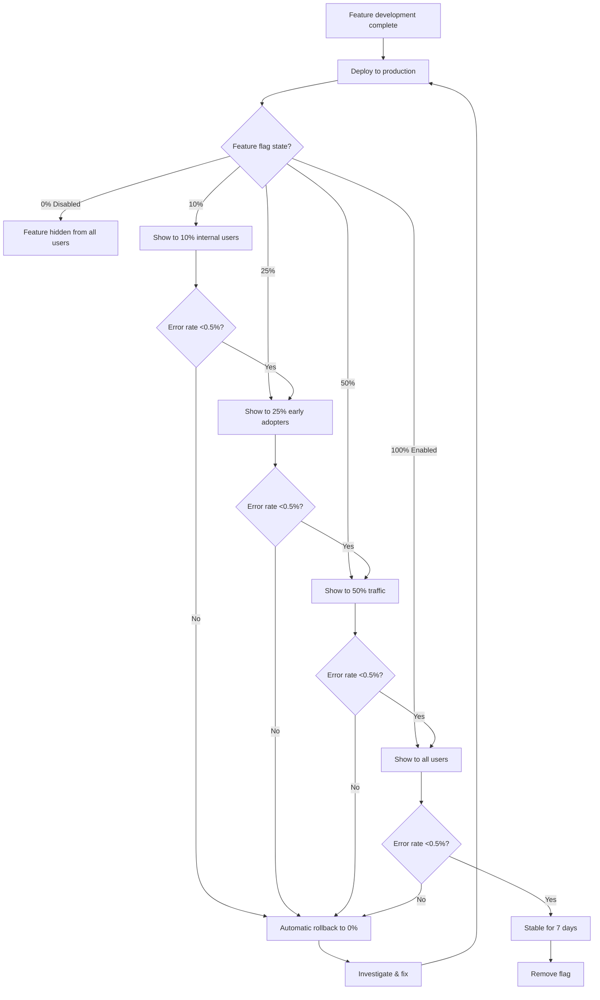

# Feature: Feature Flags & Progressive Rollout

> **Purpose:**
> This document defines a single feature's intent, scope, user experience, and completion criteria.
> It is the **single source of truth** for planning, review, automation, and execution.

---

## 0. Metadata

All metadata is defined in the frontmatter above (between the `---` markers).

**Important:** The frontmatter is used by automation scripts to:

- Create GitHub issues
- Link features to parent epics
- Generate feature flags
- Track status and ownership

---

## 1. Overview

Feature Flags & Progressive Rollout implements a systematic approach to launching features safely using Firebase Remote Config. This feature enables percentage-based gradual rollouts (0% → 10% → 25% → 50% → 100%), automatic rollback on error spikes, and per-environment flag configuration. By gating new functionality behind remotely configurable flags, teams can deploy code to production without immediately exposing features to all users, reducing risk and enabling data-driven launch decisions.

- **What this feature enables**: Safe, incremental feature launches with remote control, automatic rollback, and environment-specific configuration
- **Why it exists**: To eliminate "big bang" deployments, reduce blast radius of bugs, enable A/B testing, and provide emergency kill switches for problematic features
- **What meaningful change it introduces**: Transforms deployments from high-risk events to low-risk, iterative releases; enables product teams to control feature visibility without engineering intervention; provides automatic safety mechanisms to protect user experience and revenue

This is a **cross-cutting** feature used by all other features to gate new functionality during rollout.

## Flow Diagram



Caption: "Progressive rollout flow with automatic rollback on error rate threshold exceeded."

---

## 2. User Problem

**Engineering teams face high risk when deploying new features because traditional deployments are "all or nothing"—a single bug can immediately impact all users, causing revenue loss, customer frustration, and emergency rollbacks. Product teams cannot control feature visibility without redeploying code, making it impossible to conduct gradual launches or A/B tests.**

- **Who experiences the problem**:
  - Engineering teams deploying features and fearing production bugs will impact all users simultaneously
  - Product managers unable to test features with small user segments before full launch
  - Operations teams responding to incidents caused by untested features in production
  - Business stakeholders experiencing revenue loss from buggy feature launches

- **When and in what situations it occurs**:
  - New feature deployed to production immediately exposes all users to potential bugs
  - Product manager wants to test feature with 10% of users but deployment is binary (on/off)
  - Bug discovered in production requires emergency code revert and redeployment (30+ minutes)
  - A/B test requires deploying two separate versions of the application
  - Feature works in staging but breaks in production due to environment differences
  - Holiday shopping season approaches and team fears deploying due to rollback risk

- **What friction exists today**:
  - No remote kill switch: Disabling a broken feature requires code change, build, and deployment
  - No gradual rollout: Features are either visible to everyone or no one
  - No automatic safety nets: Error spikes go unnoticed until user complaints accumulate
  - No environment isolation: Testing in staging doesn't guarantee production safety
  - Code branches proliferate: Each feature variant requires a separate branch and deployment

- **Why existing solutions are insufficient**:
  - Environment variables require redeployment to change
  - Database flags require manual schema changes and application restarts
  - Third-party feature flag services add cost and external dependencies
  - Lack of integration with error monitoring means rollbacks are manual and slow

---

## 3. Goals

### User Experience Goals

- **Safe feature launches**: Engineering teams deploy new features with confidence, knowing they can be disabled remotely if issues arise
- **Gradual exposure**: Product teams test features with 10% of users, measure impact, and incrementally increase rollout based on data
- **Instant rollback**: Operations teams disable problematic features in <1 minute via Firebase Console without redeploying code
- **Environment parity**: Features can be enabled in dev/staging for testing while remaining disabled in production until ready
- **Audit trail**: Product and engineering teams can view flag change history to understand who enabled/disabled features and when
- **Lifecycle management**: Flags are automatically tracked and cleaned up after features reach 100% rollout for 7 days, preventing technical debt

### Business / System Goals

- **Reduce deployment risk**: Limit blast radius of bugs to <10% of users during initial rollout
- **Enable A/B testing**: Support product experimentation by serving different flag values to different user cohorts
- **Improve mean time to recovery (MTTR)**: Reduce incident response from 30+ minutes (code revert + redeploy) to <1 minute (flag toggle)
- **Increase deployment frequency**: Remove fear of deployment by providing safety mechanisms, enabling more frequent releases
- **Support compliance**: Maintain flag audit logs for regulatory requirements (who changed what, when)
- **Prevent flag sprawl**: Enforce flag cleanup after 7 days of stable 100% rollout to avoid accumulating dead code

---

## 4. Non-Goals

**Explicitly state what this feature does not attempt to solve.**

- **User targeting by demographics**: This feature supports percentage-based rollout and environment-based configuration but does not target specific users by attributes (e.g., location, age, subscription tier). Advanced targeting is deferred.
- **A/B test variant assignment**: While flags enable A/B testing, the test framework (variant assignment, statistical significance calculation) is out of scope.
- **Multi-variate flags**: Flags are boolean only. String, number, or JSON flags are not supported initially.
- **Flag dependency management**: Flags do not enforce dependencies (e.g., "Flag B requires Flag A to be enabled"). Dependencies are managed via documentation.
- **Client-side flag evaluation SDKs**: Initial implementation uses Firebase Remote Config SDK directly. A dedicated flag evaluation library is deferred.
- **Real-time flag updates**: Remote Config has up to 12-hour cache. Real-time updates (<1 minute) require manual cache refresh and are not guaranteed.
- **Flag performance optimization**: No client-side caching beyond Firebase SDK default behavior. Edge caching or CDN integration is deferred.
- **Third-party integrations**: Integration with LaunchDarkly, Split.io, or other feature flag services is not supported.

---

## 5. Functional Scope

**Core capabilities enabled by this feature:**

### Firebase Remote Config Integration

- **Remote Config SDK initialization**: Configure Firebase Remote Config in frontend (browser) and backend (Cloud Functions)
- **Default flag values**: Define in-code default values (all flags default to `false` for safety)
- **Environment-specific config**: Maintain separate flag configurations for dev, staging, and production environments
- **Fetch and activate**: Fetch remote flag values on application startup and activate immediately
- **Cache refresh**: Use 12-hour default cache TTL; support manual `fetchAndActivate()` for urgent updates
- **Flag types**: Support boolean flags only (`true`/`false`)

### Flag Naming Convention

Enforce standardized naming to ensure discoverability and automated tooling compatibility:

```
feature_fe_[feature_issue]_fl_[flag_issue]_[context]_enabled
```

**Components:**
- `feature_fe_`: Prefix indicating feature flag (differentiates from config values)
- `[feature_issue]`: Feature identifier (e.g., `013` for F-013)
- `fl_[flag_issue]`: Sub-flag identifier if feature has multiple flags (e.g., `fl_ui`, `fl_api`)
- `[context]`: Scope of the flag (e.g., `admin_ui`, `checkout`, `product_catalog`)
- `_enabled`: Suffix indicating boolean flag

**Examples:**
- `feature_fe_013_fl_admin_product_mgmt_ui_enabled`
- `feature_fe_014_fl_analytics_ga4_enabled`
- `feature_fe_006_fl_cart_inventory_reservation_enabled`

### Per-Environment Flag Configuration

- **Development**: All flags default to `true` for local testing
- **Staging**: Flags default to `false`; enable selectively for QA validation
- **Production**: Flags default to `false`; enable via progressive rollout

### Frontend Component Rendering Gating

- **Conditional rendering**: Lit components check flag state before rendering new UI elements
- **Graceful degradation**: If flag is disabled, component renders legacy/stable version
- **Flag evaluation timing**: Evaluate flags after Remote Config activation, before component rendering
- **Example pattern**:
  ```typescript
  if (getFlag('feature_fe_013_fl_admin_product_mgmt_ui_enabled')) {
    render(html`<new-admin-ui></new-admin-ui>`);
  } else {
    render(html`<legacy-admin-ui></legacy-admin-ui>`);
  }
  ```

### Backend Feature Availability Gating

- **GraphQL resolver gating**: Check flag state before executing new resolver logic
- **Cloud Function gating**: Wrap new Cloud Function code with flag checks
- **Firestore trigger gating**: Gate new event handlers behind flags
- **Error handling**: Return user-friendly error if flag is disabled and user attempts to access gated feature
- **Example pattern**:
  ```typescript
  if (!getFlag('feature_fe_013_fl_admin_product_mutations_enabled')) {
    throw new Error('This feature is not available yet. Please try again later.');
  }
  ```

### Gradual Rollout Support (Percentage-Based Targeting)

- **Percentage conditions**: Configure Remote Config to serve `true` to X% of users based on Firebase Installation ID hash
- **Rollout stages**: Standard progression: 0% → 10% → 25% → 50% → 100%
- **Sticky behavior**: Same user always receives same flag value (based on installation ID hash)
- **Stage duration**: Recommended 3-7 days per stage, depending on traffic volume and feature risk
- **Manual progression**: Product teams manually increase percentage in Firebase Console after validating metrics

### Automatic Rollback Trigger

- **Error rate monitoring**: Integrate with Cloud Logging to monitor error rate for gated features
- **Rollback threshold**: Error rate >0.5% of requests triggers automatic rollback
- **Rollback mechanism**: Cloud Function monitors error logs, detects spike, and calls Remote Config API to set flag to `false`
- **Notification**: Send Slack/email alert to on-call engineer with rollback details
- **Manual override**: Engineering team can re-enable flag after investigating and fixing root cause

### Flag Cleanup Workflow

- **Stability criteria**: Flag reaches 100% rollout and remains stable (error rate <0.1%) for 7 consecutive days
- **Cleanup trigger**: Automated script or manual review identifies flags eligible for removal
- **Code refactoring**: Remove flag conditionals, leaving only the new code path
- **Flag deprecation**: Mark flag as deprecated in Remote Config (do not delete immediately to avoid errors during transition)
- **Documentation update**: Update traceability matrix to mark flag as "Removed"

### Flag Status Tracking in Traceability Matrix

- **Traceability matrix integration**: Each feature specification includes flag table (see Section 11)
- **Status values**: `Active`, `Staged Rollout (X%)`, `100% Enabled`, `Removed`
- **Update frequency**: Sync flag status weekly or on rollout stage changes
- **Automated sync**: Script queries Remote Config API and updates markdown tables in feature specs

---

## 6. Dependencies & Assumptions

**Conditions required for this feature to function as intended:**

### Dependencies

- **F-001 (Platform Foundation)**: Firebase project initialized with Remote Config enabled
- **F-014 (Analytics & Monitoring)**: Error rate monitoring via Cloud Logging for automatic rollback
- **Firebase Remote Config API**: Enabled and configured in Firebase Console
- **Cloud Functions**: Deployed and accessible for backend flag evaluation

### Assumptions

- **Reasonable cache latency is acceptable**: 12-hour default cache TTL means flag changes take up to 12 hours to propagate to all clients (acceptable for gradual rollouts, not for emergency rollbacks)
- **Manual cache refresh for urgent rollbacks**: Emergency rollbacks require app reload or manual `fetchAndActivate()` call
- **Installation ID stability**: Firebase Installation ID remains stable across app sessions (used for sticky percentage-based targeting)
- **Flag count remains manageable**: <50 active flags at any time; cleanup workflow prevents flag sprawl
- **Single flag per feature suffices initially**: Most features can be gated by a single boolean flag; complex features may use 2-3 flags (e.g., UI + API)

### External Constraints

- **Remote Config quota**: 2,000 parameter keys per project, 1,000,000 fetches per day (sufficient for initial launch)
- **Remote Config update latency**: Changes in Firebase Console propagate to SDK within minutes but are cached for up to 12 hours client-side
- **Remote Config API rate limits**: 5 updates per minute per parameter (sufficient for manual flag changes)

---

## 7. User Stories & Experience Scenarios

> This section defines **how users live with the feature**.
> Scenarios focus on **quality of life and lifecycle experience**, not just technical failures.

---

### User Story 1 — Engineer Deploys New Feature Behind Flag

**As a** backend engineer  
**I want** to deploy new code to production with feature flag disabled  
**So that** I can validate the deployment without exposing users to untested functionality

---

#### Scenarios

##### Scenario 1.1 — Initial Feature Flag Setup (First-Time Experience)

**Given** an engineer implementing F-013 (Admin Product Management)  
**And** the feature is not yet ready for production users  
**When** the engineer initializes Remote Config in the codebase  
**Then** the engineer defines default flag values in code: `feature_fe_013_fl_admin_product_mgmt_ui_enabled: false`  
**And** creates Remote Config parameters in Firebase Console for dev, staging, production  
**And** sets dev environment flag to `true` for local testing  
**And** sets staging and production flags to `false`  
**And** wraps new admin UI component rendering with flag check:
```typescript
if (getFlag('feature_fe_013_fl_admin_product_mgmt_ui_enabled')) {
  render(html`<admin-product-form></admin-product-form>`);
}
```
**And** deploys code to production with flag disabled  
**And** validates deployment succeeded without exposing admin UI to users

---

##### Scenario 1.2 — Testing Feature in Staging (Pre-Production Validation)

**Given** admin product management feature deployed to staging with flag disabled  
**When** QA engineer wants to validate the feature in staging  
**Then** engineer navigates to Firebase Console → Remote Config  
**And** updates staging environment parameter `feature_fe_013_fl_admin_product_mgmt_ui_enabled` to `true`  
**And** publishes the change  
**Within** 12 hours (or immediate with app reload), staging environment shows admin UI  
**And** QA engineer validates all CRUD operations work correctly  
**And** engineer can disable flag in staging to revert to legacy behavior without redeployment

---

##### Scenario 1.3 — Gradual Production Rollout (10% Internal Users)

**Given** feature validated in staging and ready for production testing  
**When** product manager approves 10% rollout to internal users  
**Then** engineer updates production Remote Config parameter to enable for 10% of users  
**And** configures percentage condition in Firebase Console: "Random percentile <= 10"  
**And** publishes the change  
**And** monitors error logs, latency metrics, and user feedback for 3 days  
**And** 10% of users (sticky based on Installation ID) see admin UI, 90% see legacy or no UI  
**And** error rate remains <0.1%, validating feature stability

---

##### Scenario 1.4 — Incrementing Rollout to 50% (Confidence Building)

**Given** 10% rollout stable for 3 days with no issues  
**When** product manager approves increase to 50%  
**Then** engineer updates Remote Config percentage condition to "Random percentile <= 50"  
**And** publishes the change  
**And** monitors metrics for 7 days (longer due to larger user base)  
**And** 50% of users now see admin UI (including the original 10% due to sticky hashing)  
**And** conversion metrics (e.g., products created per admin) remain stable or improve

---

##### Scenario 1.5 — Full Rollout to 100% (Launch Complete)

**Given** 50% rollout stable for 7 days with positive metrics  
**When** product manager approves 100% rollout  
**Then** engineer removes percentage condition and sets flag to `true` for all users  
**And** publishes the change  
**And** monitors for 7 days to ensure stability across all users  
**And** flag remains enabled but is now marked as "Cleanup Candidate" in traceability matrix

---

### User Story 2 — Automatic Rollback on Error Spike

**As a** site reliability engineer (SRE)  
**I want** features to automatically roll back when error rates spike  
**So that** user experience is protected without requiring manual intervention

---

#### Scenarios

##### Scenario 2.1 — Error Rate Spike Triggers Rollback (Automated Protection)

**Given** admin product management feature rolled out to 50% of users  
**And** automatic rollback monitoring is active  
**When** a bug causes GraphQL `createProduct` mutation to fail for 1.2% of requests  
**Then** Cloud Logging detects error rate exceeded 0.5% threshold  
**And** rollback Cloud Function executes automatically  
**And** calls Remote Config API to set `feature_fe_013_fl_admin_product_mgmt_ui_enabled` to `false`  
**And** sends Slack alert to #incidents channel: "🚨 Auto-rollback triggered for F-013 due to error rate spike (1.2%)"  
**And** within 12 hours (or immediate with cache refresh), all users revert to legacy behavior  
**And** engineering team investigates root cause and fixes bug before re-enabling flag

---

##### Scenario 2.2 — False Positive Rollback (Manual Override)

**Given** automatic rollback triggered due to temporary Firestore quota spike (not feature bug)  
**When** SRE investigates and confirms error was infrastructure-related, not feature-related  
**Then** SRE manually re-enables flag in Firebase Console  
**And** documents false positive in incident log  
**And** adjusts rollback threshold or error filtering to prevent future false positives

---

##### Scenario 2.3 — Rollback Notification and Communication (Incident Response)

**Given** automatic rollback occurred at 2:15 AM  
**When** on-call engineer receives Slack alert  
**Then** alert includes:
  - Feature flag name and affected feature
  - Error rate that triggered rollback (1.2%)
  - Link to filtered error logs in Cloud Logging
  - Link to Cloud Trace for affected requests
  - Timestamp of rollback
**And** engineer acknowledges alert and begins investigation  
**And** product manager is notified via email that rollout was paused due to errors

---

### User Story 3 — Product Manager Controls Feature Visibility

**As a** product manager  
**I want** to enable/disable features remotely without engineering assistance  
**So that** I can respond to user feedback or business requirements quickly

---

#### Scenarios

##### Scenario 3.1 — Emergency Feature Disable (Kill Switch)

**Given** a feature is live at 100% rollout  
**And** user feedback indicates unexpected behavior (e.g., admin UI confusing for new admins)  
**When** product manager decides to temporarily disable feature to reassess design  
**Then** product manager (with Firebase Console access) navigates to Remote Config  
**And** sets `feature_fe_013_fl_admin_product_mgmt_ui_enabled` to `false`  
**And** publishes the change  
**And** within 12 hours (or asks users to refresh), feature is hidden from all users  
**And** no code deployment required  
**And** product team iterates on design and re-enables flag when ready

---

##### Scenario 3.2 — Scheduled Feature Launch (Marketing Coordination)

**Given** a new checkout flow feature is deployed but hidden behind flag  
**And** marketing team plans a launch announcement for Monday 9am PST  
**When** product manager schedules flag enable for Monday 8:45am PST  
**Then** product manager sets a calendar reminder (Remote Config does not support scheduled changes)  
**And** at 8:45am, manually enables flag in Firebase Console  
**And** monitors real-time analytics to validate feature is live  
**And** marketing sends launch email at 9am with feature visible to all users

---

##### Scenario 3.3 — A/B Test Setup (Product Experimentation)

**Given** product manager wants to test two checkout button colors (green vs. blue)  
**When** engineering team creates flag `feature_fe_008_fl_checkout_button_blue_enabled`  
**And** product manager enables flag for 50% of users  
**Then** 50% of users see blue button (flag enabled), 50% see green button (flag disabled)  
**And** product manager tracks conversion rates via GA4 for each cohort  
**After** 14 days, product manager determines blue button converts 3% better  
**And** sets flag to `true` for 100% of users to adopt blue button permanently

---

### User Story 4 — Flag Cleanup After Stable Rollout

**As a** engineering lead  
**I want** to remove feature flags after features are stable at 100% rollout  
**So that** codebase remains clean and free of technical debt

---

#### Scenarios

##### Scenario 4.1 — Identifying Flags Eligible for Cleanup (Lifecycle Management)

**Given** admin product management feature has been at 100% rollout for 10 days  
**And** error rate has been <0.1% throughout  
**When** engineering lead reviews traceability matrix  
**Then** matrix shows `feature_fe_013_fl_admin_product_mgmt_ui_enabled` status as "100% Enabled (10 days stable)"  
**And** flag is marked as "Cleanup Candidate"  
**And** engineering lead creates a ticket to remove flag and refactor code

---

##### Scenario 4.2 — Removing Flag from Codebase (Code Refactoring)

**Given** flag `feature_fe_013_fl_admin_product_mgmt_ui_enabled` marked for cleanup  
**When** engineer refactors code  
**Then** engineer removes all `if (getFlag(...))` conditionals  
**And** leaves only the new code path (removes legacy fallback)  
**And** removes flag definition from Remote Config in Firebase Console  
**And** updates traceability matrix to mark flag status as "Removed"  
**And** deploys refactored code  
**And** validates application functions correctly without flag

---

##### Scenario 4.3 — Flag Cleanup Before Stability Window (Premature Cleanup Risk)

**Given** a flag has been at 100% for only 3 days  
**When** engineer considers removing flag to reduce technical debt  
**Then** engineering lead reviews policy: flags must be stable for 7 days before removal  
**And** engineer waits additional 4 days  
**And** flag is removed only after 7-day stability window to avoid re-introducing if rollback needed

---

### User Story 5 — Flag Audit and Compliance

**As a** compliance officer  
**I want** to audit who changed feature flags and when  
**So that** I can ensure changes followed approval processes and investigate incidents

---

#### Scenarios

##### Scenario 5.1 — Viewing Flag Change History (Audit Trail)

**Given** a compliance audit requires reviewing who enabled admin product management feature  
**When** compliance officer requests flag change history  
**Then** engineering team exports Firebase Console activity logs  
**And** logs show:
  - 2026-01-15 10:23am: Engineer A enabled flag in dev environment
  - 2026-01-18 2:15pm: Engineer B enabled flag in staging at 100%
  - 2026-01-20 9:05am: Product Manager C enabled flag in production at 10%
  - 2026-01-23 11:30am: Product Manager C increased flag to 50%
  - 2026-01-30 8:45am: Product Manager C increased flag to 100%
**And** compliance officer validates all changes followed approval process

---

##### Scenario 5.2 — Unauthorized Flag Change Detection (Security)

**Given** only product managers should modify production flags  
**When** an unauthorized engineer attempts to enable a production flag  
**Then** Firebase IAM permissions deny the change  
**And** audit log records the failed attempt  
**And** security team receives alert for unauthorized access attempt

---

## 8. Edge Cases & Constraints (Experience-Relevant)

**Cases that materially affect user experience:**

### Hard Limits

- **Remote Config cache TTL: 12 hours default**: Flag changes propagate slowly. Emergency rollbacks require manual cache refresh (app reload or `fetchAndActivate()` call).
- **Remote Config quota: 2,000 parameter keys**: Exceeding requires quota increase or flag consolidation.
- **Firebase Console access required**: Non-technical stakeholders need Firebase Console permissions to change flags (requires IAM setup).

### Timing and Latency

- **Flag propagation delay**: Changes in Firebase Console take 1-5 minutes to reach SDK but are cached for 12 hours client-side. Users may see old flag values until cache expires or app reloads.
- **Automatic rollback latency**: Error detection to rollback execution takes 2-5 minutes. During this window, errors continue affecting users.

### Rollout Stickiness

- **User always in same cohort**: Percentage-based targeting uses Firebase Installation ID hash, so a user in 10% rollout will also be in 25%, 50%, 100% rollouts (sticky behavior). Cannot rebalance cohorts mid-rollout.

### Compliance & Policy Constraints

- **Flag audit logs**: Firebase Console audit logs retained for 90 days. Long-term compliance requires exporting logs to Cloud Logging or BigQuery.
- **PII prohibition**: Flags must not contain PII (user emails, names). Use anonymous installation IDs only.

### Flag Sprawl Risk

- **Technical debt accumulation**: Flags left in code after 100% rollout become dead code and increase maintenance burden. Cleanup workflow is mandatory, not optional.

---

## 9. Implementation Tasks (Execution Agent Checklist)

> This section provides the specific work items for the **Execution Agent**.
> Every task maps to a specific scenario defined in Section 7.

```markdown
- [ ] T01 — Initialize Firebase Remote Config SDK in frontend and backend (Scenario 1.1)
  - [ ] Unit Test: Verify Remote Config SDK initializes with default values
  - [ ] Integration Test: Verify SDK fetches config from Firebase on startup
  - [ ] E2E Test: Validate flag values loaded correctly in dev, staging, production

- [ ] T02 — Define flag naming convention and documentation (Scenario 1.1)
  - [ ] Documentation: Publish flag naming convention standard
  - [ ] Manual Review: Validate all existing flags follow naming convention
  - [ ] Automation: Create script to validate flag names in CI

- [ ] T03 — Implement frontend component rendering gating (Scenario 1.1, 1.2)
  - [ ] Unit Test: Verify component renders new UI when flag is true, legacy UI when false
  - [ ] Integration Test: Verify flag state evaluated before component mount
  - [ ] E2E Test: Validate UI switches from legacy to new when flag toggled

- [ ] T04 — Implement backend GraphQL resolver and Cloud Function gating (Scenario 1.1, 1.2)
  - [ ] Unit Test: Verify resolver throws error when flag is false
  - [ ] Integration Test: Verify flag state checked before executing business logic
  - [ ] E2E Test: Validate GraphQL mutation rejected when flag disabled

- [ ] T05 — Configure per-environment flag values in Firebase Console (Scenario 1.2)
  - [ ] Manual Test: Create Remote Config parameters for dev, staging, production
  - [ ] Integration Test: Verify dev defaults to true, staging/production default to false
  - [ ] Documentation: Document how to update flag values in Firebase Console

- [ ] T06 — Implement percentage-based targeting for gradual rollout (Scenario 1.3, 1.4, 1.5)
  - [ ] Unit Test: Verify percentage condition correctly hashes Installation ID
  - [ ] Integration Test: Verify 10% rollout serves flag to ~10% of users (within ±2% margin)
  - [ ] E2E Test: Validate same user receives same flag value across sessions (sticky)

- [ ] T07 — Build automatic rollback monitoring with error rate threshold (Scenario 2.1)
  - [ ] Unit Test: Verify rollback logic triggers when error rate >0.5%
  - [ ] Integration Test: Verify Cloud Function calls Remote Config API to disable flag
  - [ ] E2E Test: Simulate error spike and validate flag automatically set to false

- [ ] T08 — Implement rollback notification to Slack/email (Scenario 2.3)
  - [ ] Integration Test: Verify Slack message sent on rollback with error details
  - [ ] E2E Test: Validate email notification includes flag name, error rate, log links

- [ ] T09 — Create flag status tracking in traceability matrix (Scenario 4.1)
  - [ ] Automation: Script to query Remote Config API and update markdown tables
  - [ ] Manual Test: Verify traceability matrix reflects current flag states
  - [ ] Documentation: Document flag lifecycle stages (Active, Staged, 100%, Removed)

- [ ] T10 — Implement flag cleanup workflow (Scenario 4.2)
  - [ ] Documentation: Document flag cleanup policy (7 days stable at 100%)
  - [ ] Manual Checklist: Create cleanup checklist (remove code conditionals, deprecate flag)
  - [ ] E2E Test: Validate app functions without flag after cleanup

- [ ] T11 — Configure Firebase IAM permissions for flag management (Scenario 5.2)
  - [ ] Manual Test: Verify only authorized roles can modify production flags
  - [ ] Security Review: Validate IAM policies enforce least privilege
  - [ ] Documentation: Document who has permission to change flags in each environment

- [ ] T12 — Enable Firebase Console audit logging (Scenario 5.1)
  - [ ] Integration Test: Verify flag changes recorded in audit logs
  - [ ] Manual Test: Export audit logs and validate completeness
  - [ ] Documentation: Document how to access and export audit logs

- [ ] T13 — Create flag value cache refresh mechanism for emergency rollbacks (Scenario 2.1)
  - [ ] Unit Test: Verify manual `fetchAndActivate()` refreshes flag values
  - [ ] Integration Test: Verify cache refresh reduces propagation delay to <1 minute
  - [ ] E2E Test: Validate emergency rollback visible to users within 1 minute of flag change

- [ ] T14 — [Self-Reference] Implement feature flag gating for this feature (Scenario: bootstrap)
  - [ ] Integration Test: Verify feature flag system itself is gated by a meta-flag
  - [ ] E2E Test: Validate Remote Config disabled when meta-flag is false
```

---

## 10. Acceptance Criteria (Verifiable Outcomes)

> These criteria are used by the **Execution Agent** and **Reviewers** to verify completion.
> Each criterion is observable and testable.

```markdown
- [ ] AC1 — Firebase Remote Config SDK initialized in frontend and backend (Scenario 1.1)
  - [ ] Unit test passed: SDK initializes with default flag values
  - [ ] Integration test passed: SDK fetches remote config from Firebase
  - [ ] E2E test passed: Flag values correctly loaded in all environments

- [ ] AC2 — Flag naming convention enforced and documented (Scenario 1.1)
  - [ ] Documentation published: Flag naming standard documented in README
  - [ ] Automation passed: CI script validates all flags follow naming convention
  - [ ] Manual review passed: All existing flags renamed to follow convention

- [ ] AC3 — Frontend components gated by feature flags (Scenario 1.1, 1.2)
  - [ ] Unit test passed: Component renders new UI when flag true, legacy when false
  - [ ] E2E test passed: UI switches from legacy to new when flag toggled
  - [ ] Manual test passed: Admin UI hidden in production when flag disabled

- [ ] AC4 — Backend GraphQL resolvers and Cloud Functions gated by flags (Scenario 1.1, 1.2)
  - [ ] Unit test passed: Resolver throws error when flag disabled
  - [ ] Integration test passed: Business logic skipped when flag false
  - [ ] E2E test passed: GraphQL mutation rejected when flag disabled

- [ ] AC5 — Per-environment flag configuration working (Scenario 1.2)
  - [ ] Manual test passed: Dev flags default to true, staging/prod default to false
  - [ ] Integration test passed: Environment-specific values loaded correctly
  - [ ] Documentation complete: How to update flags in Firebase Console documented

- [ ] AC6 — Percentage-based gradual rollout functional (Scenario 1.3, 1.4, 1.5)
  - [ ] Unit test passed: Installation ID hash correctly distributes users
  - [ ] Integration test passed: 10% rollout serves flag to ~10% of users (±2% margin)
  - [ ] E2E test passed: Same user receives same flag value (sticky behavior)

- [ ] AC7 — Automatic rollback triggers on error rate >0.5% (Scenario 2.1)
  - [ ] Integration test passed: Rollback Cloud Function disables flag when threshold exceeded
  - [ ] E2E test passed: Simulated error spike triggers automatic rollback
  - [ ] Manual test passed: Rollback completes within 5 minutes of error spike

- [ ] AC8 — Rollback notifications sent to Slack and email (Scenario 2.3)
  - [ ] Integration test passed: Slack message includes flag name, error rate, log links
  - [ ] E2E test passed: Email notification delivered to on-call engineer
  - [ ] Manual test passed: Notification contains actionable information for debugging

- [ ] AC9 — Flag status tracked in traceability matrix (Scenario 4.1)
  - [ ] Automation passed: Script queries Remote Config and updates markdown
  - [ ] Manual test passed: Traceability matrix reflects current flag states
  - [ ] Documentation complete: Flag lifecycle stages documented

- [ ] AC10 — Flag cleanup workflow documented and tested (Scenario 4.2)
  - [ ] Documentation complete: Cleanup policy (7 days stable) documented
  - [ ] E2E test passed: App functions correctly after flag removal
  - [ ] Manual checklist: Cleanup checklist tested with sample flag

- [ ] AC11 — Firebase IAM permissions configured (Scenario 5.2)
  - [ ] Security review passed: Only authorized roles can modify production flags
  - [ ] Manual test passed: Unauthorized user cannot change production flags
  - [ ] Documentation complete: Permission matrix documented

- [ ] AC12 — Audit logging enabled for flag changes (Scenario 5.1)
  - [ ] Integration test passed: Flag changes recorded in Firebase audit logs
  - [ ] Manual test passed: Audit log export contains complete change history
  - [ ] Documentation complete: How to access audit logs documented

- [ ] AC13 — [Self-Reference] Feature flag system is itself gated by meta-flag (Scenario: bootstrap)
  - [ ] Integration test passed: Remote Config disabled when meta-flag false
  - [ ] E2E test passed: System defaults to all-flags-disabled when meta-flag off
```

---

## 11. Rollout & Risk

### Rollout Strategy

**Self-referential rollout: Feature flag system itself is gated by a meta-flag**

1. **Development (0%)**: Meta-flag `feature_fe_015_fl_remote_config_enabled` set to `false`. Developers test locally with environment variable override. **Duration: 5 days**

2. **Internal Testing (100% in dev/staging, 0% in production)**: Enable Remote Config in dev and staging environments. Validate flag fetching, caching, and gating logic. Test automatic rollback simulation. **Duration: 7 days**

3. **Production Bootstrap (10%)**: Enable Remote Config for 10% of production users. Validate flag propagation, cache behavior, and error monitoring. Create first production flag for a low-risk feature. **Duration: 7 days**

4. **Expanded Rollout (50% → 100%)**: Increase Remote Config to 50%, then 100% of users. Validate all features using flags work correctly. Monitor quota usage and cache hit rates. **Duration: 14 days**

5. **Meta-Flag Cleanup**: After 100% rollout stable for 7 days, remove meta-flag and make Remote Config permanently enabled.

### Risk Mitigation

**Identified risks and mitigation strategies:**

- **Risk: Remote Config service outage breaks entire application**
  - *Mitigation*: Use in-code default values as fallback. If Remote Config fetch fails, app uses defaults (all flags `false` for safety).

- **Risk: Flag change propagates to production accidentally**
  - *Mitigation*: Require Firebase Console access approval via IAM. Implement confirmation dialog for production flag changes. Audit all changes.

- **Risk: 12-hour cache delay causes emergency rollback to be ineffective**
  - *Mitigation*: Implement manual cache refresh mechanism. Document emergency procedure: call `fetchAndActivate()` or instruct users to reload app.

- **Risk: Automatic rollback false positives disable healthy features**
  - *Mitigation*: Set conservative error rate threshold (0.5%). Filter transient errors (e.g., network timeouts). Allow manual re-enable with override.

- **Risk: Flag sprawl creates technical debt**
  - *Mitigation*: Enforce mandatory 7-day cleanup policy. Automate flag lifecycle tracking in traceability matrix. Code review checks for abandoned flags.

- **Risk: Percentage-based targeting creates unbalanced cohorts**
  - *Mitigation*: Accept sticky behavior as intended (user always in same cohort). Document that rebalancing requires new flag and migration.

### Automatic Rollback Triggers

- **Error rate >0.5% for gated feature**: Automatic flag disable and Slack alert
- **Remote Config quota exceeded**: Alert and pause flag creation until quota restored
- **Flag fetch failure rate >1%**: Alert SRE to investigate Remote Config service health

### Exit / Cleanup Criteria

- **Meta-flag removal**: After Remote Config stable at 100% for 7 days
- **Per-feature flag removal**: After feature stable at 100% rollout for 7 days with <0.1% error rate
- **Code cleanup**: Remove all flag conditionals, leaving only new code path
- **Documentation**: Archive flag in traceability matrix with "Removed" status and removal date

### Remote Config Flags

<!-- REMOTE_CONFIG_FLAG_START -->
| Context | Type | Namespace | Default (Dev) | Default (Stg) | Default (Prod) | Key |
|---------|------|-----------|---------------|---------------|----------------|-----|
| remote_config_system | BOOLEAN | client | true | true | false | feature_fe_015_fl_remote_config_enabled |
| automatic_rollback | BOOLEAN | server | true | true | false | feature_fe_015_fl_auto_rollback_enabled |
| flag_cleanup_automation | BOOLEAN | server | true | false | false | feature_fe_015_fl_cleanup_automation_enabled |
<!-- REMOTE_CONFIG_FLAG_END -->

---

## 12. History & Status

- **Status:** Draft
- **Related Epics:** Quality & Observability (to be linked after automation)
- **Related Issues:** F-015 (to be created post-merge)
- **Dependencies:** F-001 (Platform Foundation), F-014 (Analytics & Monitoring for rollback error detection)
- **Author:** Product Team
- **Last Updated:** 2026-01-24

---

## Final Note

> This document defines **intent and experience**.
> Execution details are derived from it — never the other way around.
