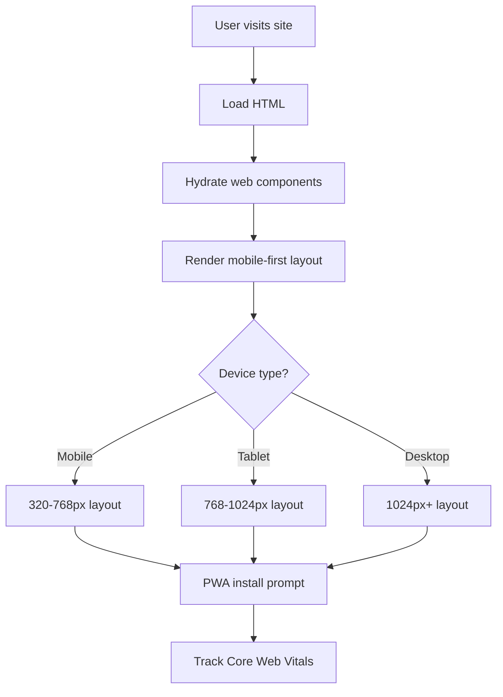

# Feature: Mobile-First Responsive UI Foundation

> **Purpose:**
> This document defines the UI foundation feature's intent, scope, user experience, and completion criteria.
> It is the **single source of truth** for planning, review, automation, and execution.

---

## 0. Metadata

All metadata is defined in the frontmatter above (between the `---` markers).

---

## 1. Overview

The Mobile-First Responsive UI Foundation establishes the design system, component library, state management, and accessibility baseline for the itsme.fashion web application. This feature enables frontend engineers to build consistent, performant, and accessible user interfaces optimized for mobile devices (320px-768px) that scale gracefully to desktop viewports.

This feature provides:
- Lit web component library with Declarative Shadow DOM
- Preact Signals for reactive state management
- Mobile-first responsive CSS utilities
- WCAG 2.1 AA accessibility compliance
- PWA configuration (service worker, manifest)
- Core Web Vitals monitoring integration

The UI foundation ensures every user-facing feature delivers a fast, accessible, and delightful experience regardless of device or network conditions.

## Flow Diagram



Caption: "User experience flow from load to interactive state."

---

## 2. User Problem

**Mobile users shopping for beauty products face frustrating web experiences:**

- **Slow loading times**: Heavy JavaScript bundles and unoptimized images make sites unusable on 3G/4G networks
- **Tiny tap targets**: Desktop-first designs force users to zoom and pinch to interact with buttons and links
- **Inaccessible interfaces**: Screen reader users cannot navigate product catalogs or complete checkout flows
- **Inconsistent UI**: Components lack cohesive styling, creating confusion about branding and trust
- **Poor offline experience**: Network interruptions break the shopping session entirely

**The cost of not solving this:**
- 53% of mobile users abandon sites that take longer than 3 seconds to load
- Inaccessible sites exclude 15% of potential customers with disabilities
- Inconsistent UI erodes brand trust and reduces conversion rates
- Lack of PWA support means no install prompts or offline capabilities

---

## 3. Goals

### User Experience Goals

- **Fast first paint**: Users see meaningful content within 1 second on 3G networks
- **Touch-optimized interactions**: Buttons and links are at least 44x44px for easy tapping
- **Accessible navigation**: Screen reader users can browse products and checkout independently
- **Consistent branding**: All UI components follow cohesive design language
- **Offline resilience**: Users can browse cached products when network drops
- **Install-able app**: Android/iOS users can add itsme.fashion to home screen

### Business / System Goals

- **Core Web Vitals targets**: LCP < 2.5s, FID < 100ms, CLS < 0.1
- **Bundle size limit**: Initial JavaScript payload < 100KB gzipped
- **Accessibility compliance**: WCAG 2.1 Level AA conformance
- **Reusable components**: Reduce frontend development time by 40% with component library
- **Progressive enhancement**: Site functions with JavaScript disabled (basic browsing)

---

## 4. Non-Goals

**This feature explicitly does NOT:**

- Implement specific business features (cart, checkout, etc.) — those are separate features
- Define product photography or visual brand identity
- Create marketing pages or blog content
- Build native mobile apps (web-only PWA)
- Support Internet Explorer or legacy browsers (modern browsers only: Chrome, Firefox, Safari, Edge)
- Implement advanced animations or micro-interactions beyond baseline usability

---

## 5. Functional Scope

### Core Capabilities

**Lit Web Component Library**
- Base components: Button, Input, Card, Modal, Drawer, Toast, Spinner
- Layout components: Container, Grid, Stack, Spacer
- Typography components: Heading, Text, Link
- Form components: Form, Fieldset, Label, Error
- Declarative Shadow DOM for SSR support
- Scoped CSS per component to prevent style conflicts

**Preact Signals State Management**
- Global state signals for user session, cart, wishlist
- Reactive updates across components without prop drilling
- Minimal re-renders for performance
- Simple mental model for state management

**Responsive CSS Framework**
- Mobile-first breakpoints: 320px, 480px, 768px, 1024px, 1440px
- Fluid typography with clamp() for scalable text
- Flexbox and Grid utilities for layouts
- Spacing scale: 4px base (4, 8, 12, 16, 24, 32, 48, 64px)
- Color system: Primary, Secondary, Neutral, Error, Success, Warning

**Accessibility Baseline**
- Semantic HTML elements (nav, main, article, aside)
- ARIA labels and roles where needed
- Keyboard navigation support for all interactive elements
- Focus indicators with 3:1 contrast ratio
- Skip links for keyboard-only users
- Color contrast ratios: 4.5:1 for normal text, 3:1 for large text

**PWA Configuration**
- Web app manifest with icons (192px, 512px)
- Service worker for offline caching strategy
- Install prompt for mobile users
- App shell architecture for instant loading

**Core Web Vitals Monitoring**
- Web Vitals API integration
- Real User Monitoring (RUM) data collection
- OpenTelemetry spans for performance tracking
- Lighthouse CI in GitHub Actions

---

## 6. Dependencies & Assumptions

### Dependencies

- **F-001: Platform Foundation** — Requires build tooling and Firebase Hosting deployment
- **External Libraries**: Lit 3.x, Preact Signals 1.x, Web Vitals library
- **Browser APIs**: Service Worker, Cache Storage, Web App Manifest

### Assumptions

- Target audience uses modern browsers (Chrome 100+, Firefox 100+, Safari 15+, Edge 100+)
- Majority of traffic comes from mobile devices (60% mobile, 30% desktop, 10% tablet)
- Users tolerate app install prompts on second visit (not first)
- Design tokens are finalized before component development begins

---

## 7. User Stories & Experience Scenarios

### User Story 1 — Fast Mobile Shopping Experience

**As a** mobile user browsing on a 4G connection  
**I want** the site to load and become interactive quickly  
**So that** I can start shopping without waiting or frustration

---

#### Scenarios

##### Scenario 1.1 — First Visit on Mobile Device

**Given** a new user visits itsme.fashion on a mobile device (360x640 viewport)  
**And** they are on a 4G network with 10 Mbps download speed  
**When** the homepage loads  
**Then** the Largest Contentful Paint (LCP) occurs within 2.5 seconds  
**And** the First Input Delay (FID) is under 100ms when they tap a product  
**And** the Cumulative Layout Shift (CLS) is less than 0.1  
**And** the layout is optimized for mobile (single column, full-width cards)  
**And** all text is readable without zooming (minimum 16px font size)

---

##### Scenario 1.2 — Returning User on Slow Connection

**Given** a returning user on a 3G network (1.5 Mbps download speed)  
**When** they visit the product catalog page  
**Then** the service worker serves cached app shell instantly  
**And** placeholder images display while product photos load  
**And** the user can scroll and interact with cached products immediately  
**And** a subtle indicator shows when new content is loading in background

---

##### Scenario 1.3 — Network Interruption During Session

**Given** a user is browsing products  
**And** they add an item to their cart  
**When** their network connection drops  
**Then** the service worker serves cached pages  
**And** a toast notification appears: "You're offline. Some features may be limited."  
**And** the cart state persists in browser storage  
**And** when network returns, cart syncs automatically without data loss

---

##### Scenario 1.4 — JavaScript Load Failure

**Given** a user's browser fails to load JavaScript (ad blocker, CDN failure)  
**When** they visit the site  
**Then** the HTML renders with semantic structure  
**And** product images and descriptions are visible  
**And** basic navigation links work via standard hyperlinks  
**And** a message prompts: "Enable JavaScript for the full shopping experience"

---

##### Scenario 1.5 — High Traffic Conditions

**Given** the site experiences 10x normal traffic during a sale  
**When** users load pages  
**Then** the serverless Firebase Hosting scales automatically  
**And** users experience no degradation in load time  
**And** Core Web Vitals remain within target thresholds  
**And** monitoring alerts trigger if P95 latency exceeds 3 seconds

---

##### Scenario 1.6 — Different Device Sizes

**Given** users visit the site on various devices  
**When** they load the homepage  
**Then** layouts adapt responsively:
  - **320px (small mobile)**: Single column, stacked cards
  - **768px (tablet portrait)**: Two-column grid
  - **1024px+ (desktop)**: Three-column grid with sidebar
**And** touch targets remain at least 44x44px on all devices  
**And** no horizontal scrolling occurs at any breakpoint

---

### User Story 2 — Accessible Shopping for All Users

**As a** screen reader user with visual impairment  
**I want** to navigate the site using only my keyboard and assistive technology  
**So that** I can shop independently without sighted assistance

---

#### Scenarios

##### Scenario 2.1 — Keyboard Navigation

**Given** a keyboard-only user visits the product catalog  
**When** they press Tab to navigate  
**Then** focus moves logically through: skip link, logo, navigation, product cards, footer  
**And** focus indicators are clearly visible with 3px outline  
**And** they can activate links and buttons with Enter or Space  
**And** modal dialogs trap focus and can be closed with Escape

---

##### Scenario 2.2 — Screen Reader Announcements

**Given** a screen reader user (NVDA, JAWS, VoiceOver)  
**When** they navigate product cards  
**Then** each card announces: "Product: [Name], Price: [Price], Ethics: [Badges], Add to cart button"  
**And** navigation landmarks are identified: "Main navigation", "Product grid", "Footer"  
**And** dynamic updates (cart count) are announced via ARIA live regions

---

##### Scenario 2.3 — Color Contrast Compliance

**Given** a user with low vision or color blindness  
**When** they view any page  
**Then** all text meets WCAG 2.1 AA contrast ratios:
  - **Normal text**: 4.5:1 minimum
  - **Large text (18px+)**: 3:1 minimum
  - **Interactive elements**: 3:1 minimum against background
**And** information is not conveyed by color alone (icons + text labels)

---

##### Scenario 2.4 — Form Accessibility

**Given** a screen reader user completing a form (e.g., address entry)  
**When** they interact with form fields  
**Then** each input has an associated label announced by screen reader  
**And** error messages are announced immediately when validation fails  
**And** required fields are identified with "required" in label  
**And** field instructions are read before user input

---

## 8. Edge Cases & Constraints

### Hard Limits

- **Component bundle size**: Each component must be < 5KB gzipped to maintain fast loading
- **Supported viewports**: 320px minimum width; no support for narrower screens
- **Browser compatibility**: Chrome 100+, Firefox 100+, Safari 15+, Edge 100+ only
- **Service worker storage**: Capped at 50MB cache; oldest assets evicted first

### Accessibility Requirements

- **WCAG 2.1 Level AA**: Mandatory compliance; failure blocks release
- **Keyboard navigation**: All features must be operable without mouse
- **Screen reader testing**: QA must verify with NVDA, JAWS, and VoiceOver

### Performance Budgets

- **Initial bundle**: < 100KB JavaScript gzipped
- **LCP**: < 2.5 seconds on simulated 3G
- **FID**: < 100ms for first interaction
- **CLS**: < 0.1 for viewport stability

---

## 9. Implementation Tasks (Execution Agent Checklist)

```markdown
- [ ] T01 — Create Lit web component library with base components (Button, Input, Card, etc.)
  - [ ] Unit Test: Render each component in isolation and verify Shadow DOM structure
  - [ ] Integration Test: Verify components accept props and emit events correctly
- [ ] T02 — Implement Preact Signals for global state management (user, cart, wishlist signals)
  - [ ] Unit Test: Update signal and verify reactive components re-render
  - [ ] Integration Test: Test signal persistence to localStorage on page refresh
- [ ] T03 — Build responsive CSS framework with mobile-first breakpoints and utilities
  - [ ] Unit Test: Verify CSS custom properties compile correctly
  - [ ] E2E Test: Test layouts at 320px, 768px, 1024px viewports
- [ ] T04 — Implement WCAG 2.1 AA accessibility baseline (semantic HTML, ARIA, keyboard nav)
  - [ ] Integration Test: Run axe-core automated accessibility tests
  - [ ] E2E Test: Manual screen reader testing with NVDA/JAWS/VoiceOver
- [ ] T05 — Configure PWA with service worker, manifest, and offline caching strategy
  - [ ] Integration Test: Verify service worker installs and caches assets
  - [ ] E2E Test: Test offline mode by disabling network in DevTools
- [ ] T06 — Integrate Web Vitals API and send RUM data to OpenTelemetry
  - [ ] Integration Test: Verify LCP, FID, CLS metrics are captured
  - [ ] E2E Test: Lighthouse CI runs in GitHub Actions and enforces budgets
```

---

## 10. Acceptance Criteria (Verifiable Outcomes)

```markdown
- [ ] AC1 — Homepage achieves Core Web Vitals targets on mobile (LCP < 2.5s, FID < 100ms, CLS < 0.1)
  - [ ] E2E test passed: Lighthouse CI score > 90 for Performance
- [ ] AC2 — All components render correctly at 320px, 768px, and 1024px viewports
  - [ ] E2E test passed: Visual regression tests detect no layout breaks
- [ ] AC3 — Site meets WCAG 2.1 Level AA compliance
  - [ ] Integration test passed: axe-core reports 0 critical/serious violations
  - [ ] E2E test passed: Manual screen reader testing checklist completed
- [ ] AC4 — PWA install prompt appears on second mobile visit
  - [ ] E2E test passed: Manifest validation passes, install banner triggers
- [ ] AC5 — Service worker caches app shell and serves offline pages
  - [ ] Integration test passed: Network disabled, cached pages load successfully
- [ ] AC6 — Initial JavaScript bundle is under 100KB gzipped
  - [ ] Unit test passed: Webpack bundle analyzer confirms size target
```

---

## 11. Rollout & Risk

### Rollout Strategy

**No feature flag required** — The UI foundation is non-negotiable infrastructure required for all user-facing features. There is no scenario where we would disable responsive design or accessibility.

### Risk Mitigation

- **Risk**: Browser compatibility issues on older devices
  - **Mitigation**: Use feature detection and polyfills for critical APIs; degrade gracefully
  - **Fallback**: Provide static HTML fallback for users with JavaScript disabled

- **Risk**: Core Web Vitals degrade as features are added
  - **Mitigation**: Enforce performance budgets in Lighthouse CI; block PRs that exceed limits
  - **Monitoring**: Track RUM data in production; alert if P95 LCP exceeds 3 seconds

- **Risk**: Accessibility regressions during rapid feature development
  - **Mitigation**: Automated axe-core tests in CI; mandatory screen reader QA before release

### Performance Monitoring

- OpenTelemetry spans track component render times
- Real User Monitoring captures field data for Core Web Vitals
- Lighthouse CI runs on every PR to enforce budgets

---

## 12. History & Status

- **Status:** Draft
- **Related Epics:** Foundation & Infrastructure
- **Related Issues:** TBD (created post-merge)
- **Dependencies:** F-001 (Platform Foundation)
- **Blocks:** All user-facing features (F-003 through F-013)

---

## Final Note

> This document defines **intent and experience** for the UI foundation.
> Execution details are derived from it — never the other way around.
