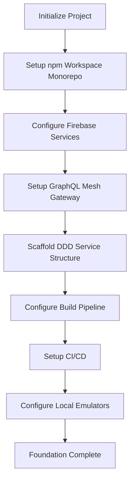

# Feature: Platform Foundation

> **Purpose:**
> This document defines the foundational infrastructure required to enable all subsequent features across the itsme.fashion platform.
> It is the **single source of truth** for planning, review, automation, and execution of the core platform setup.

---

## 0. Metadata

All metadata is defined in the frontmatter above (between the `---` markers).

**Important:** The frontmatter is used by automation scripts to:

- Create GitHub issues
- Link features to parent epics
- Generate feature flags
- Track status and ownership

---

## 1. Overview

Platform Foundation establishes the monorepo structure, Firebase services configuration, GraphQL API gateway, Domain-Driven Design (DDD) service scaffolding, and build tooling required for the entire itsme.fashion ecommerce platform.

This feature enables:
- Centralized workspace management for all frontend and backend services
- Firebase Authentication, Firestore, Cloud Functions, Storage, and Remote Config integration
- GraphQL Mesh gateway for federated API architecture
- TypeScript build pipeline optimized with esbuild
- DDD-aligned folder structure across all bounded contexts
- CI/CD automation via GitHub Actions
- Local development environment with Firebase emulators

## Flow Diagram



Caption: "High-level setup flow for platform foundation."

---

## 2. User Problem

**Who:** Engineering team and future developers

**Problem:** Starting a new ecommerce platform from scratch requires coordinating multiple Google Cloud/Firebase services, establishing architectural patterns, and setting up build tooling. Without a solid foundation, teams encounter:

- Fragmented codebases with inconsistent structure across services
- Manual configuration drift between development and production environments
- Unclear service boundaries leading to tight coupling
- Slow build times and poor developer experience
- Missing local development capabilities requiring constant cloud deployments

**Why existing solutions are insufficient:**
- Manual Firebase setup is error-prone and not version-controlled
- Ad-hoc folder structures lead to architectural inconsistency
- Lack of monorepo tooling creates dependency management challenges

---

## 3. Goals

### User Experience Goals

- **Engineers** can clone the repository and run the full stack locally within 5 minutes
- **Developers** have clear, DDD-aligned folders guiding where to place new code
- **Teams** experience fast builds (<30s for incremental changes) enabling rapid iteration
- **Contributors** receive immediate CI feedback on code quality and tests

### Business / System Goals

- Establish scalable serverless architecture on Firebase/GCP
- Enable independent deployment of bounded contexts via subgraph federation
- Ensure consistent TypeScript standards across all services
- Provide production-ready CI/CD pipeline from day one
- Support parallel feature development without merge conflicts

---

## 4. Non-Goals

- **UI/UX implementation** — Handled by F-002 (Mobile-First Responsive UI Foundation)
- **Specific business feature implementation** — Handled by domain-specific features (F-003+)
- **Production monitoring and alerting** — Handled by F-014 (Analytics & Monitoring)
- **Feature flag implementation** — Handled by F-015 (Feature Flags & Progressive Rollout)
- **Database schema migration tools** — Firestore is schemaless; structure defined per feature
- **Multi-region deployment** — Single region (GCP asia-south1) per PRD constraints

---

## 5. Functional Scope

**Core Capabilities:**

1. **Monorepo Management**
   - npm workspaces configured for frontend, functions, and shared packages
   - Dependency hoisting and shared TypeScript configuration
   - Package interdependencies properly declared

2. **Firebase Integration**
   - Firebase project provisioned and linked to GCP
   - Authentication, Firestore, Cloud Functions, Storage, Remote Config enabled
   - Service account credentials securely managed
   - Environment-specific configurations (dev, staging, production)

3. **GraphQL Gateway**
   - GraphQL Mesh configured to federate multiple subgraphs
   - Type-safe schema stitching
   - Authentication middleware integration
   - Request/response logging

4. **DDD Service Scaffolding**
   - Folder structure for all bounded contexts: Identity, Catalog, Shopping, Ordering, Fulfillment, Notifications, Admin
   - Aggregate, Entity, Value Object, Repository, Service layers defined
   - Domain event infrastructure placeholder

5. **Build & Development Tools**
   - esbuild configuration for fast TypeScript compilation
   - Hot reload for local development
   - Firebase emulator suite (Auth, Firestore, Functions, Storage)
   - Environment variable management

6. **CI/CD Pipeline**
   - GitHub Actions workflows for lint, test, build
   - Automated deployment to staging on merge to main
   - PR preview environments (optional)

---

## 6. Dependencies & Assumptions

**Dependencies:**
- None (this is the foundational feature)

**Assumptions:**
- Google Cloud Platform account exists with billing enabled
- Firebase project can be created in asia-south1 region
- GitHub repository has Actions enabled
- Engineers have Node.js 24 LTS installed locally
- npm 10+ is available

**External Constraints:**
- Firebase free tier limits during development
- GCP quota limits for Cloud Functions and Firestore
- GitHub Actions minute limits for CI/CD

---

## 7. User Stories & Experience Scenarios

---

### User Story 1 — Initial Repository Setup

**As a** platform engineer
**I want** to initialize the monorepo with all required services and tooling
**So that** developers can immediately start building features without infrastructure concerns

---

#### Scenarios

##### Scenario 1.1 — First-Time Repository Clone

**Given** a developer has cloned the repository for the first time
**When** they run `npm install` in the root directory
**Then** all workspace dependencies are installed successfully
**And** Firebase emulators are automatically configured
**And** the project is ready for local development

---

##### Scenario 1.2 — Running Local Development Environment

**Given** the repository is properly installed
**When** the developer runs `npm run dev`
**Then** Firebase emulators start for Auth, Firestore, Functions, and Storage
**And** GraphQL Mesh gateway starts and connects to emulated services
**And** the developer can access the GraphQL playground at http://localhost:4000
**And** hot reload is enabled for code changes

---

##### Scenario 1.3 — Building for Production

**Given** code changes are ready for deployment
**When** the developer runs `npm run build`
**Then** all TypeScript packages compile without errors
**And** build artifacts are generated in dist/ folders
**And** the build completes in under 60 seconds for clean builds
**And** Cloud Functions are bundled with all dependencies

---

##### Scenario 1.4 — Build Failure with Clear Error

**Given** a developer introduces TypeScript errors
**When** they run `npm run build`
**Then** the build fails with specific error messages showing file and line numbers
**And** the error output clearly indicates which package failed
**And** the developer can quickly identify and fix the issue without searching logs

---

##### Scenario 1.5 — CI Pipeline Execution

**Given** a pull request is created
**When** GitHub Actions CI runs
**Then** linting checks pass within 30 seconds
**And** TypeScript compilation succeeds across all workspaces
**And** unit tests run and results are reported
**And** the PR shows green checks or specific failure details

---

##### Scenario 1.6 — Multi-Developer Parallel Work

**Given** multiple developers working on different bounded contexts
**When** they create separate feature branches
**Then** npm workspace isolation prevents dependency conflicts
**And** each developer can install context-specific dependencies
**And** builds remain fast regardless of which packages changed
**And** merge conflicts are minimized through clear folder separation

---

### User Story 2 — Firebase Service Configuration

**As a** backend engineer
**I want** Firebase services pre-configured and accessible via emulators
**So that** I can develop and test cloud functions locally without deploying to production

---

#### Scenarios

##### Scenario 2.1 — Firestore Database Access

**Given** the Firebase emulators are running
**When** a Cloud Function writes data to Firestore
**Then** the data is stored in the local emulator instance
**And** the Firestore UI is accessible at http://localhost:4000/firestore
**And** data persists across emulator restarts (via export/import)

---

##### Scenario 2.2 — Authentication Flow Testing

**Given** Firebase Auth emulator is running
**When** a user registers via the authentication API
**Then** the user is created in the local Auth emulator
**And** JWT tokens are generated and validated locally
**And** no production authentication services are called

---

##### Scenario 2.3 — Cloud Functions Deployment

**Given** a new Cloud Function is created in functions/ workspace
**When** the function is deployed using `npm run deploy:functions`
**Then** the function is uploaded to Firebase
**And** environment variables are correctly set from .env files
**And** the function endpoint is accessible via HTTPS

---

##### Scenario 2.4 — Environment Configuration Error

**Given** required environment variables are missing
**When** a developer attempts to deploy or run emulators
**Then** the system displays a clear error listing missing variables
**And** provides an example .env file format
**And** prevents deployment or startup until configuration is complete

---

##### Scenario 2.5 — Concurrent Emulator Sessions

**Given** multiple developers on the team running emulators locally
**When** each developer starts their emulator suite
**Then** port conflicts are automatically resolved or clearly reported
**And** each developer's emulator data is isolated
**And** no shared state causes test interference

---

##### Scenario 2.6 — Service Account Permissions

**Given** Firebase services require specific IAM permissions
**When** deploying to production
**Then** service accounts have minimum required permissions
**And** security rules are enforced for Firestore and Storage
**And** deployment fails gracefully if permissions are insufficient with clear guidance

---

## 8. Edge Cases & Constraints (Experience-Relevant)

**Hard Limits:**
- Firestore emulator limited to ~10K documents for reasonable performance
- Firebase Functions (free tier) limited to 125K invocations/month
- GitHub Actions free tier: 2,000 minutes/month for private repos

**Compliance Constraints:**
- Firebase project must be in asia-south1 region (PRD requirement)
- All sensitive credentials must be stored in GitHub Secrets, never committed
- Firestore security rules must deny public write access by default

**Irreversible Actions:**
- Deleting a Firebase project cannot be undone (30-day recovery window)
- Production Firestore data deletion is permanent without backups

---

## 9. Implementation Tasks (Execution Agent Checklist)

```markdown
- [ ] T01 — Initialize npm workspace monorepo with root package.json and workspace configuration
  - [ ] Unit Test: Verify workspace dependency resolution
  - [ ] Integration Test: Confirm all packages can import shared dependencies

- [ ] T02 — Configure Firebase project and services (Auth, Firestore, Functions, Storage, Remote Config)
  - [ ] Integration Test: Emulator suite starts without errors
  - [ ] E2E Test: Sample function can write to Firestore emulator

- [ ] T03 — Setup GraphQL Mesh gateway with authentication middleware
  - [ ] Unit Test: Schema stitching combines subgraphs correctly
  - [ ] Integration Test: GraphQL playground accessible and processes test queries

- [ ] T04 — Scaffold DDD folder structure for all bounded contexts with README files
  - [ ] Unit Test: Verify folder structure matches DDD patterns
  - [ ] Integration Test: Import paths resolve correctly across contexts

- [ ] T05 — Configure esbuild pipeline and GitHub Actions CI/CD workflow
  - [ ] Integration Test: Build succeeds for all packages
  - [ ] E2E Test: CI workflow runs on PR creation and reports status

- [ ] T06 — [Rollout] Setup environment-specific configurations (dev/staging/prod)
  - [ ] Integration Test: Environment variables load correctly per environment
  - [ ] E2E Test: Deployment to staging succeeds with correct config
```

---

## 10. Acceptance Criteria (Verifiable Outcomes)

```markdown
- [ ] AC1 — Developer can clone repo and run `npm install && npm run dev` successfully
  - [ ] E2E test passed: Fresh clone to running emulators in <5 minutes
  - [ ] Manual verification: GraphQL playground accessible

- [ ] AC2 — All Firebase emulators start and are accessible via UI
  - [ ] Integration test passed: Emulator suite health check returns 200
  - [ ] Manual verification: Firestore UI shows collections

- [ ] AC3 — TypeScript build completes for all workspaces without errors
  - [ ] Unit test passed: tsc --noEmit succeeds
  - [ ] Integration test passed: Build artifacts generated in dist/

- [ ] AC4 — GitHub Actions CI runs on pull requests and reports status
  - [ ] E2E test passed: Test PR triggers workflow
  - [ ] Manual verification: PR shows green check or specific failure

- [ ] AC5 — DDD folder structure exists with clear README guidance
  - [ ] Unit test passed: Expected folders present at paths
  - [ ] Manual verification: README files explain each bounded context
```

---

## 11. Rollout & Risk

**Rollout Strategy:**
- This is a foundational feature enabling all others
- No gradual rollout required; must be complete before other features begin
- Once merged, becomes the baseline for all development

**Risk Mitigation:**
- Local emulator testing prevents production deployment errors
- CI/CD pipeline catches build failures before merge
- Infrastructure-as-code approach (Firebase config files) enables version control

### Remote Config Flags

**No feature flags required** for this foundational infrastructure. The platform must be fully operational once established.

---

## 12. History & Status

- **Status:** Draft
- **Related Epics:** Foundation & Infrastructure (Phase 1)
- **Related Issues:** `<created post-merge>`
- **Dependencies:** None
- **Dependent Features:** All features (F-002 through F-015)

---

## Final Note

> This document defines **intent and experience** for the platform foundation.
> Execution details are derived from it — never the other way around.
