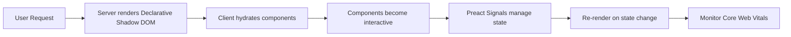

# Feature: Mobile-First Responsive UI Foundation

> **Purpose:**
> This document defines the design system, web component library, state management, and responsive framework that powers all user-facing interfaces across the itsme.fashion platform.
> It is the **single source of truth** for UI/UX implementation standards and frontend architecture.

---

## 0. Metadata

All metadata is defined in the frontmatter above (between the `---` markers).

---

## 1. Overview

Mobile-First Responsive UI Foundation establishes the design system using Lit web components, Preact Signals for reactive state management, and a mobile-optimized CSS framework targeting 320px-768px viewports as the primary experience.

This feature enables:
- Reusable, accessible web components following WCAG 2.1 AA standards
- Declarative Shadow DOM for server-side rendering and progressive enhancement
- Global reactive state management with Preact Signals
- Responsive CSS utilities optimized for mobile-first development
- Progressive Web App (PWA) capabilities with service workers
- Core Web Vitals monitoring integrated with OpenTelemetry and Lighthouse CI

## Flow Diagram



Caption: "High-level flow for component rendering and state management."

---

## 2. User Problem

**Who:** End users (mobile beauty shoppers) and frontend developers

**Problem:**
- **Users** experience slow, unresponsive ecommerce sites on mobile devices, especially on 3G/4G connections
- Mobile layouts often feel like desktop shrunk down, not designed for small screens
- Touch targets are too small, text is hard to read, and navigation is confusing
- Accessibility features like screen readers are poorly supported

**For Developers:**
- Inconsistent component libraries lead to duplicated UI code
- State management becomes tangled without a clear pattern
- Desktop-first CSS frameworks require overrides for mobile optimization
- No baseline for accessibility testing

**Why existing solutions are insufficient:**
- Heavy React/Vue frameworks add unnecessary bundle size for simple components
- Traditional CSS frameworks optimize for desktop, then adapt down to mobile
- Lack of server-side rendering hurts initial load performance

---

## 3. Goals

### User Experience Goals

- **Mobile users** see first contentful paint within 1 second on 4G connections
- **Touch interactions** feel responsive with targets ≥44px for critical actions
- **Screen reader users** navigate the site with proper ARIA labels and semantic HTML
- **Users on slow networks** can interact with above-the-fold content before full page load
- **All users** experience smooth animations (60fps) and instant visual feedback

### Business / System Goals

- Achieve Lighthouse Performance score >90 on mobile
- Maintain Lighthouse Accessibility score of 100
- Reduce frontend bundle size to <100KB gzipped for initial load
- Enable developers to create new UI components in <30 minutes
- Establish consistent design tokens (colors, spacing, typography) across platform

---

## 4. Non-Goals

- **Backend API implementation** — Handled by domain features (F-003+)
- **Business logic** — Components are presentational; logic lives in domain services
- **Desktop-specific optimizations** — Mobile-first means mobile is optimized; desktop adapts up
- **Complex animations** — Focus on performance; avoid heavy animation libraries
- **Cross-browser support for older browsers** — Modern evergreen browsers only (Chrome, Safari, Firefox, Edge)

---

## 5. Functional Scope

**Core Capabilities:**

1. **Lit Web Component Library**
   - Button, Input, Card, Modal, Navigation, Product Grid, etc.
   - Shadow DOM encapsulation for style isolation
   - Declarative templates with lit-html
   - TypeScript-first component development

2. **Preact Signals State Management**
   - Global state for cart, auth, UI flags
   - Reactive signals for efficient re-renders
   - Minimal boilerplate compared to Redux/MobX

3. **Responsive CSS Framework**
   - Mobile-first breakpoints (320px, 375px, 428px, 768px)
   - Utility classes for spacing, typography, flexbox, grid
   - Dark mode support via CSS custom properties
   - Consistent design tokens (8px spacing scale, type scale)

4. **WCAG 2.1 AA Accessibility**
   - Semantic HTML5 elements
   - ARIA labels and roles
   - Keyboard navigation support (tab, enter, escape)
   - Focus management for modals and overlays
   - Color contrast ratios ≥4.5:1

5. **PWA Configuration**
   - Web app manifest for install prompts
   - Service worker for offline fallback and caching
   - Cache-first strategy for static assets
   - Network-first for dynamic data

6. **Core Web Vitals Monitoring**
   - LCP (Largest Contentful Paint) tracking
   - FID (First Input Delay) measurement
   - CLS (Cumulative Layout Shift) monitoring
   - Integration with OpenTelemetry for real-user monitoring
   - Lighthouse CI in GitHub Actions for PR checks

---

## 6. Dependencies & Assumptions

**Dependencies:**
- F-001 (Platform Foundation) — Build tooling and monorepo structure required

**Assumptions:**
- Users primarily access on mobile devices (60% mobile traffic expected)
- Modern browser support (last 2 versions of Chrome, Safari, Firefox, Edge)
- Developers familiar with TypeScript and web component standards
- 4G network speeds (5 Mbps) as baseline performance target

**External Constraints:**
- Lighthouse CI requires GitHub Actions quota
- Service workers require HTTPS in production

---

## 7. User Stories & Experience Scenarios

---

### User Story 1 — Responsive Product Browsing on Mobile

**As a** mobile beauty shopper
**I want** to browse products on my phone with a fast, touch-friendly interface
**So that** I can quickly find products without frustration on a small screen

---

#### Scenarios

##### Scenario 1.1 — First Page Load on Mobile

**Given** a user visits itsme.fashion on a mobile device for the first time
**When** the homepage loads
**Then** the first contentful paint appears within 1 second
**And** the above-the-fold product grid is visible and interactive
**And** images load progressively with low-quality placeholders first

---

##### Scenario 1.2 — Scrolling Product Grid

**Given** the user is viewing the product catalog
**When** they scroll down the page
**Then** the scroll animation is smooth at 60fps
**And** additional products load via infinite scroll without layout shift
**And** the user can quickly scan products without jank

---

##### Scenario 1.3 — Returning Visitor with Cached Assets

**Given** a user has visited the site before
**When** they return to the homepage
**Then** the service worker serves cached static assets
**And** the page loads within 500ms (from cache)
**And** fresh data is fetched in the background and updates reactively

---

##### Scenario 1.4 — Slow Network Connection

**Given** a user on a slow 3G connection (1.6 Mbps)
**When** they load a product page
**Then** the UI skeleton appears immediately
**And** text content loads within 2 seconds
**And** images load progressively (low-res → high-res)
**And** the user sees a loading indicator for images, not blank space

---

##### Scenario 1.5 — High Traffic Load

**Given** the site experiences high concurrent traffic (10K users)
**When** a user loads the homepage
**Then** static assets are served from CDN without origin requests
**And** the page remains responsive
**And** Core Web Vitals remain within acceptable ranges (LCP <2.5s)

---

##### Scenario 1.6 — Touch Interaction Responsiveness

**Given** a user is interacting with UI components via touch
**When** they tap a button or link
**Then** visual feedback (ripple effect or color change) appears within 100ms
**And** the action completes without delay
**And** touch targets are ≥44px for easy tapping

---

### User Story 2 — Accessible Navigation with Screen Reader

**As a** visually impaired user using a screen reader
**I want** to navigate the site with proper ARIA labels and semantic HTML
**So that** I can shop independently without assistance

---

#### Scenarios

##### Scenario 2.1 — Screen Reader Announces Page Structure

**Given** a user with a screen reader enabled
**When** they land on the homepage
**Then** the screen reader announces the page title and main landmarks
**And** navigation links are clearly labeled
**And** the product grid is announced as a list with item count

---

##### Scenario 2.2 — Keyboard Navigation Through Products

**Given** the user is on the product catalog page
**When** they use the Tab key to navigate
**Then** focus moves sequentially through interactive elements
**And** the current focus is visually indicated with a clear outline
**And** they can activate buttons with Enter or Space

---

##### Scenario 2.3 — Modal Focus Management

**Given** a user opens a product quick-view modal
**When** the modal appears
**Then** focus automatically moves to the modal content
**And** tabbing cycles only within the modal (focus trap)
**And** pressing Escape closes the modal and returns focus to the trigger

---

##### Scenario 2.4 — Form Validation Errors

**Given** a user submits a form with invalid input
**When** validation errors occur
**Then** error messages are announced by the screen reader
**And** the first invalid field receives focus
**And** error messages are associated with inputs via aria-describedby

---

##### Scenario 2.5 — Color Contrast for Low Vision

**Given** a user with low vision
**When** they view text and UI elements
**Then** all text has a contrast ratio ≥4.5:1 against backgrounds
**And** interactive elements are distinguishable by more than color alone (icons, underlines)
**And** the user can enable a high-contrast mode if needed

---

##### Scenario 2.6 — Screen Reader Announces Dynamic Updates

**Given** a user adds a product to their cart
**When** the cart count updates
**Then** the screen reader announces the change via aria-live region
**And** the user is informed without losing context

---

## 8. Edge Cases & Constraints (Experience-Relevant)

**Hard Limits:**
- Component bundle size should not exceed 10KB per component (uncompressed)
- Shadow DOM has browser support limitations (IE11 not supported)
- Service workers require HTTPS (localhost exempt for dev)

**Accessibility Requirements:**
- WCAG 2.1 AA compliance mandatory for all components
- Keyboard navigation must work for all interactive elements
- Color alone cannot convey information (must have text/icon alternative)

**Performance Constraints:**
- LCP must be <2.5s on mobile (4G)
- FID must be <100ms
- CLS must be <0.1
- Total bundle size <100KB gzipped for initial load

---

## 9. Implementation Tasks (Execution Agent Checklist)

```markdown
- [ ] T01 — Initialize Lit component library with base components (Button, Input, Card, Modal)
  - [ ] Unit Test: Each component renders correctly with props
  - [ ] E2E Test: Components display in Storybook or component playground

- [ ] T02 — Setup Preact Signals for global state (cart, auth, UI flags)
  - [ ] Unit Test: Signals update and trigger re-renders
  - [ ] Integration Test: Multiple components react to same signal changes

- [ ] T03 — Create responsive CSS framework with mobile-first breakpoints and utility classes
  - [ ] Unit Test: CSS utilities generate expected styles
  - [ ] E2E Test: Responsive layout adapts correctly on 320px, 768px, 1024px viewports

- [ ] T04 — Implement WCAG 2.1 AA accessibility features (ARIA, keyboard nav, focus management)
  - [ ] Unit Test: ARIA attributes present on components
  - [ ] E2E Test: Keyboard navigation works for all interactive flows
  - [ ] E2E Test: Axe accessibility scanner passes with zero violations

- [ ] T05 — Configure PWA with service worker and web app manifest
  - [ ] Integration Test: Service worker installs and caches assets
  - [ ] E2E Test: Offline fallback page displays when network unavailable

- [ ] T06 — Integrate Core Web Vitals monitoring with OpenTelemetry
  - [ ] Integration Test: LCP, FID, CLS metrics are captured
  - [ ] E2E Test: Lighthouse CI runs on PRs and enforces score thresholds

- [ ] T07 — [Rollout] Setup feature flag for progressive enhancement features
  - [ ] Integration Test: Components degrade gracefully when flags disabled
  - [ ] E2E Test: Feature flag controls PWA install prompt visibility
```

---

## 10. Acceptance Criteria (Verifiable Outcomes)

```markdown
- [ ] AC1 — Lit component library includes 10+ base components with TypeScript types
  - [ ] Unit test passed: All components render without errors
  - [ ] E2E test passed: Storybook displays component gallery

- [ ] AC2 — Lighthouse Performance score >90 on mobile homepage
  - [ ] E2E test passed: Lighthouse CI passes in GitHub Actions
  - [ ] Manual verification: Real device testing confirms <1.5s load time

- [ ] AC3 — Lighthouse Accessibility score = 100
  - [ ] E2E test passed: Axe scanner reports zero violations
  - [ ] Manual verification: Screen reader (VoiceOver/NVDA) navigates site correctly

- [ ] AC4 — PWA is installable on mobile devices
  - [ ] Integration test passed: Manifest validates correctly
  - [ ] Manual verification: Install prompt appears on mobile browsers

- [ ] AC5 — Core Web Vitals meet Google thresholds
  - [ ] E2E test passed: LCP <2.5s, FID <100ms, CLS <0.1 on mobile
  - [ ] Integration test passed: Metrics reported to OpenTelemetry

- [ ] AC6 — Frontend bundle size <100KB gzipped
  - [ ] Integration test passed: Build analysis confirms bundle size
  - [ ] Manual verification: Network tab shows <100KB transferred
```

---

## 11. Rollout & Risk

**Rollout Strategy:**
- This is a foundational UI layer required by all user-facing features
- No gradual rollout; must be complete before feature development begins
- Individual progressive enhancement features (e.g., offline mode) can be flagged

**Risk Mitigation:**
- Lighthouse CI prevents performance regressions in PRs
- Accessibility audits run automatically on every build
- Real device testing on iPhone SE, Pixel 5, Samsung Galaxy A52

### Remote Config Flags

<!-- REMOTE_CONFIG_FLAG_START -->
| Context | Type | Namespace | Default (Dev) | Default (Stg) | Default (Prod) | Key |
|---------|------|-----------|---------------|---------------|----------------|-----|
| pwa_install_prompt | BOOLEAN | client | true | true | false | _auto-generated_ |
| offline_mode | BOOLEAN | client | true | false | false | _auto-generated_ |
<!-- REMOTE_CONFIG_FLAG_END -->

**Flag Purpose:**
- `pwa_install_prompt`: Control visibility of PWA install banner (gradual rollout to avoid annoying users)
- `offline_mode`: Enable service worker offline capabilities (test in staging before production)

**Removal Criteria:** After 30 days at 100% rollout with <0.1% error rate, remove flags

---

## 12. History & Status

- **Status:** Draft
- **Related Epics:** Foundation & Infrastructure (Phase 1)
- **Related Issues:** `<created post-merge>`
- **Dependencies:** F-001 (Platform Foundation)
- **Dependent Features:** F-003, F-004, F-005, F-006, F-014

---

## Final Note

> This document defines **intent and experience** for the UI foundation.
> Execution details are derived from it — never the other way around.
