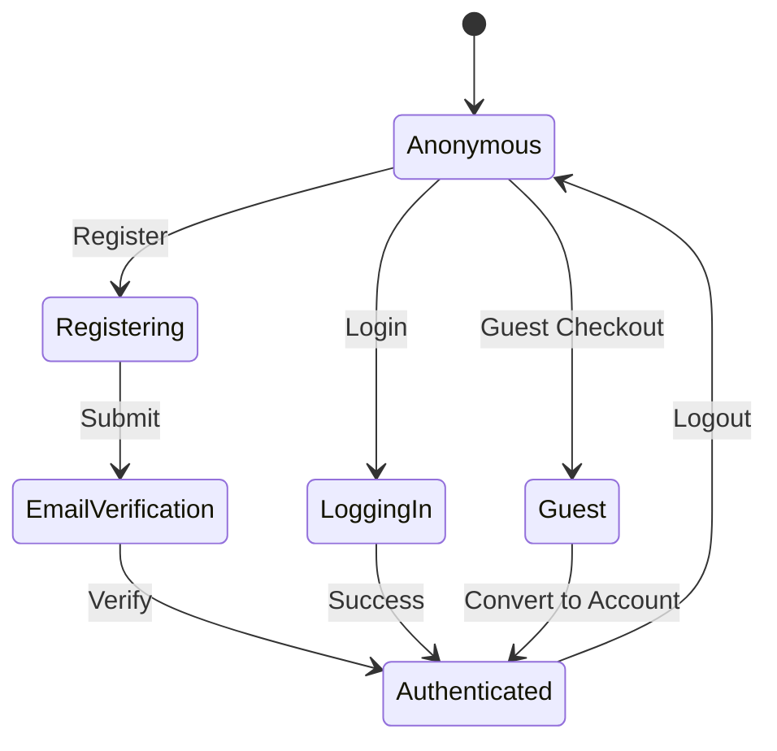

# Feature: User Authentication

> **Purpose:**
> This document defines email/password authentication, session management, and guest checkout capabilities for the itsme.fashion platform.
> It is the **single source of truth** for identity management and user access control.

---

## 0. Metadata

All metadata is defined in the frontmatter above (between the `---` markers).

---

## 1. Overview

User Authentication enables secure registration, login, and session management via Firebase Authentication with support for both authenticated and guest users.

This feature enables:
- Email/password registration with email verification
- Secure login with JWT token-based session management
- Guest checkout flow requiring only email collection
- Session persistence (24h default, 30d with "remember me")
- User profile creation on registration
- GraphQL mutations for register, login, logout
- GraphQL queries for current user state

## Flow Diagram



Caption: "User authentication state transitions."

---

## 2. User Problem

**Who:** Beauty shoppers (new and returning visitors)

**Problem:**
- **New users** want to save preferences, wishlist, and order history but don't want friction during first purchase
- **Returning users** want quick login without re-entering credentials every session
- **Privacy-conscious users** want to browse and buy without creating an account
- **Users who abandon registration** due to complex multi-step forms

**Why existing solutions are insufficient:**
- Many ecommerce sites force account creation before checkout, losing conversions
- Long registration forms with too many required fields create friction
- Password requirements are unclear, leading to frustration
- No clear benefit communicated for creating an account vs. guest checkout

---

## 3. Goals

### User Experience Goals

- **New users** can complete guest checkout in under 2 minutes
- **Registered users** stay logged in for 24 hours without re-authentication
- **Users with "remember me"** stay logged in for 30 days
- **All users** receive clear feedback on authentication errors (e.g., wrong password)
- **Email verification** is simple with one-click confirmation

### Business / System Goals

- Increase registered user conversion rate by 20% with low-friction registration
- Enable personalized experiences (wishlist, order history) for authenticated users
- Secure user data with industry-standard JWT tokens
- Support guest-to-registered user conversion post-purchase

---

## 4. Non-Goals

- **Social login (Google, Facebook)** — Deferred to future phase
- **Multi-factor authentication (MFA)** — Not required for MVP
- **Password reset flow** — Handled by Firebase Auth UI (delegated)
- **Email change functionality** — Deferred
- **User profile editing** — Minimal profile; editing deferred
- **Role-based access control (RBAC) beyond admin** — Single admin role only

---

## 5. Functional Scope

**Core Capabilities:**

1. **Registration**
   - Email/password with minimum 8 character password requirement
   - Email verification sent automatically via Firebase Auth
   - User profile created in Firestore (`users` collection) with userId, email, createdAt
   - JWT token returned on successful registration

2. **Login**
   - Email/password authentication via Firebase Auth
   - Session token (JWT) with 24h default expiration
   - "Remember me" option extends session to 30 days
   - Login attempts limited to prevent brute force (Firebase built-in)

3. **Guest Checkout**
   - Email collection only (no password required)
   - Order associated with email for lookup
   - Option to convert to registered account post-purchase

4. **Session Management**
   - JWT token validation on GraphQL requests
   - Auto-refresh token before expiration
   - Logout clears session token and redirects to homepage

5. **GraphQL API**
   - Mutations: `register`, `login`, `logout`
   - Queries: `currentUser` (returns user profile if authenticated)

---

## 6. Dependencies & Assumptions

**Dependencies:**
- F-001 (Platform Foundation) — Firebase Authentication service enabled

**Assumptions:**
- Users have valid email addresses
- Email delivery is reliable (Firebase Auth handles email sending)
- HTTPS required for secure token transmission
- Browser supports cookies/localStorage for session storage

**External Constraints:**
- Firebase Auth free tier: 50K authentications/month
- GDPR compliance requires email verification before marketing emails

---

## 7. User Stories & Experience Scenarios

---

### User Story 1 — New User Registration

**As a** new visitor
**I want** to create an account with my email and password
**So that** I can save my wishlist and order history

---

#### Scenarios

##### Scenario 1.1 — First-Time Registration Success

**Given** I am a new visitor on the registration page
**And** I am not authenticated
**When** I enter email "user@example.com"
**And** I enter password "SecurePass123" (meets 8 char minimum)
**And** I submit the registration form
**Then** I receive a success message "Please check your email to verify your account"
**And** an email verification link is sent to my email
**And** my user profile is created in Firestore with userId, email, and createdAt
**And** I am redirected to the email verification prompt page

---

##### Scenario 1.2 — Returning User Clicks Verification Link

**Given** I have registered and received a verification email
**When** I click the verification link in the email
**Then** my email is marked as verified in Firebase Auth
**And** I am redirected to the login page with a message "Email verified! You can now log in."
**And** I can log in with my credentials

---

##### Scenario 1.3 — User Abandons Registration Mid-Flow

**Given** I am on the registration page
**When** I enter my email but navigate away before submitting
**Then** no user account is created
**And** I can return later and re-enter my email without conflicts

---

##### Scenario 1.4 — Registration with Existing Email

**Given** a user already exists with email "existing@example.com"
**When** I attempt to register with email "existing@example.com"
**Then** I see an error message "This email is already registered. Please log in."
**And** no new user account is created
**And** I am provided a link to the login page

---

##### Scenario 1.5 — Weak Password Error

**Given** I am on the registration page
**When** I enter password "123" (less than 8 characters)
**And** I submit the form
**Then** I see an error message "Password must be at least 8 characters"
**And** the form does not submit
**And** the password field remains focused for correction

---

##### Scenario 1.6 — Registration on Mobile Device

**Given** I am registering on a mobile device (320px viewport)
**When** I access the registration form
**Then** the form is responsive and easy to fill on a small screen
**And** touch targets (buttons, inputs) are ≥44px
**And** the keyboard auto-focuses on the email input

---

### User Story 2 — Returning User Login

**As a** registered user
**I want** to log in with my email and password
**So that** I can access my wishlist and checkout

---

#### Scenarios

##### Scenario 2.1 — Successful Login

**Given** I am a registered user with verified email
**When** I enter my correct email and password on the login page
**And** I submit the login form
**Then** I am authenticated and receive a JWT session token
**And** I am redirected to the homepage or the page I was viewing before login
**And** my user profile is loaded (name, email visible in header)

---

##### Scenario 2.2 — Login with "Remember Me"

**Given** I am on the login page
**When** I check the "Remember me" checkbox
**And** I submit valid credentials
**Then** my session token is set to expire in 30 days (instead of 24 hours)
**And** I remain logged in across browser sessions
**And** I only need to re-authenticate after 30 days

---

##### Scenario 2.3 — Session Expiration After 24 Hours

**Given** I logged in without "remember me" 25 hours ago
**When** I visit the site
**Then** my session is expired
**And** I see a message "Your session has expired. Please log in again."
**And** I am redirected to the login page
**And** after login, I am returned to the page I attempted to access

---

##### Scenario 2.4 — Incorrect Password Error

**Given** I am a registered user
**When** I enter my correct email but an incorrect password
**And** I submit the login form
**Then** I see an error message "Incorrect email or password. Please try again."
**And** I remain on the login page
**And** I can attempt to log in again

---

##### Scenario 2.5 — Account Not Found

**Given** I attempt to log in with email "nonexistent@example.com"
**When** I submit the login form
**Then** I see an error message "No account found with this email. Please register."
**And** I am provided a link to the registration page

---

##### Scenario 2.6 — Unverified Email Login Attempt

**Given** I registered but have not verified my email
**When** I attempt to log in
**Then** I see a message "Please verify your email before logging in."
**And** I am provided an option to "Resend verification email"

---

### User Story 3 — Guest Checkout

**As a** privacy-conscious shopper
**I want** to checkout without creating an account
**So that** I can complete my purchase quickly without sharing unnecessary data

---

#### Scenarios

##### Scenario 3.1 — Guest Proceeds to Checkout

**Given** I have items in my cart
**And** I am not authenticated
**When** I click "Checkout"
**Then** I am prompted to either "Log in" or "Continue as guest"
**And** when I select "Continue as guest"
**And** I enter my email for order confirmation
**Then** I proceed to the checkout flow without account creation

---

##### Scenario 3.2 — Guest Converts to Registered User Post-Purchase

**Given** I completed a guest checkout with email "guest@example.com"
**When** I receive the order confirmation email
**And** I click "Create an account to track your order"
**Then** I am redirected to a registration page with my email pre-filled
**And** I only need to set a password to complete account creation
**And** my past guest order is now associated with my registered account

---

##### Scenario 3.3 — Guest Duplicate Email Detection

**Given** I am a guest user entering my email at checkout
**And** an account already exists with that email
**When** I submit the checkout form
**Then** I see a message "An account exists with this email. Please log in to continue."
**And** I am redirected to the login page with a link back to my cart

---

##### Scenario 3.4 — Guest Invalid Email Format

**Given** I am proceeding as a guest
**When** I enter an invalid email format (e.g., "notanemail")
**And** I submit the form
**Then** I see an error message "Please enter a valid email address"
**And** the form does not submit until corrected

---

##### Scenario 3.5 — Guest Checkout Session Persistence

**Given** I started guest checkout and navigated away
**When** I return within 30 minutes
**Then** my cart and guest email are still preserved
**And** I can resume checkout without re-entering data

---

##### Scenario 3.6 — Guest Accessibility on Mobile

**Given** I am a guest user on a mobile device
**When** I enter my email for guest checkout
**Then** the email input has proper autocomplete attributes
**And** the mobile keyboard shows the email layout (@, .com)
**And** the submit button is easily tappable (≥44px)

---

## 8. Edge Cases & Constraints (Experience-Relevant)

**Hard Limits:**
- Password must be ≥8 characters (Firebase Auth minimum)
- Email verification link expires after 24 hours
- Session tokens expire after 24 hours (or 30 days with "remember me")

**Security Constraints:**
- All authentication requests must occur over HTTPS
- JWT tokens must be validated on every GraphQL request
- Firestore user profiles readable only by the user (security rules enforced)

**Irreversible Actions:**
- Account deletion is permanent (not implemented in MVP; user must contact support)

---

## 9. Implementation Tasks (Execution Agent Checklist)

```markdown
- [ ] T01 — Implement registration mutation with Firebase Auth integration and Firestore user profile creation
  - [ ] Unit Test: User profile created with correct fields
  - [ ] E2E Test: Full registration flow from form to email verification prompt

- [ ] T02 — Implement login mutation with JWT token generation and session management
  - [ ] Unit Test: JWT token contains correct user claims
  - [ ] E2E Test: Login flow redirects to intended page after authentication

- [ ] T03 — Implement guest checkout email collection with order association
  - [ ] Integration Test: Guest order saved with email reference
  - [ ] E2E Test: Guest checkout flow completes without account creation

- [ ] T04 — Implement currentUser GraphQL query with JWT validation middleware
  - [ ] Unit Test: Query returns user profile for authenticated requests
  - [ ] Integration Test: Unauthorized requests return null or error

- [ ] T05 — Implement email verification flow with Firebase Auth UI
  - [ ] E2E Test: Clicking verification link marks email as verified
  - [ ] Integration Test: Unverified users cannot log in

- [ ] T06 — Implement logout mutation clearing session token
  - [ ] Unit Test: Session token invalidated after logout
  - [ ] E2E Test: User redirected to homepage and cannot access authenticated pages

- [ ] T07 — [Rollout] Setup feature flag for authentication methods (enable/disable guest checkout)
  - [ ] Integration Test: Feature flag controls guest checkout visibility
  - [ ] E2E Test: When flag disabled, only authenticated checkout is available
```

---

## 10. Acceptance Criteria (Verifiable Outcomes)

```markdown
- [ ] AC1 — User can register with email/password and receive verification email
  - [ ] E2E test passed: Registration form submission creates user in Firebase Auth
  - [ ] Manual verification: Email received in inbox with verification link

- [ ] AC2 — User can log in and access authenticated pages
  - [ ] E2E test passed: Login redirects to homepage with user profile visible
  - [ ] Integration test passed: JWT token validated on GraphQL requests

- [ ] AC3 — Guest user can checkout without account creation
  - [ ] E2E test passed: Guest checkout flow completes with email only
  - [ ] Integration test passed: Order saved with guest email reference

- [ ] AC4 — Session expires after 24 hours (or 30 days with "remember me")
  - [ ] Integration test passed: Token expiration checked on requests
  - [ ] Manual verification: Session persists across browser restart with "remember me"

- [ ] AC5 — Authentication errors display clear, user-friendly messages
  - [ ] E2E test passed: Incorrect password shows specific error
  - [ ] E2E test passed: Unverified email prompts resend option

- [ ] AC6 — Mobile authentication experience is optimized
  - [ ] E2E test passed: Forms responsive on 320px viewport
  - [ ] Manual verification: Touch targets meet 44px minimum
```

---

## 11. Rollout & Risk

**Rollout Strategy:**
- Deploy authentication infrastructure to production with flag disabled
- Enable for internal testing (10% of traffic)
- Gradual rollout: 25% → 50% → 100% over 2 weeks
- Monitor registration conversion rates and error rates

**Risk Mitigation:**
- Firebase Auth handles rate limiting and security automatically
- Email verification prevents spam account creation
- Guest checkout reduces conversion drop-off risk

### Remote Config Flags

<!-- REMOTE_CONFIG_FLAG_START -->
| Context | Type | Namespace | Default (Dev) | Default (Stg) | Default (Prod) | Key |
|---------|------|-----------|---------------|---------------|----------------|-----|
| auth_enabled | BOOLEAN | server | true | true | false | _auto-generated_ |
| guest_checkout | BOOLEAN | client | true | true | false | _auto-generated_ |
| remember_me_option | BOOLEAN | client | true | true | false | _auto-generated_ |
<!-- REMOTE_CONFIG_FLAG_END -->

**Flag Purpose:**
- `auth_enabled`: Master toggle for authentication system (server-enforced)
- `guest_checkout`: Enable/disable guest checkout option (A/B test impact on conversion)
- `remember_me_option`: Control visibility of "remember me" checkbox (test session length preferences)

**Removal Criteria:** After 30 days at 100% rollout with <0.5% error rate, remove temporary flags

---

## 12. History & Status

- **Status:** Draft
- **Related Epics:** Identity & Discovery (Phase 2)
- **Related Issues:** `<created post-merge>`
- **Dependencies:** F-001 (Platform Foundation)
- **Dependent Features:** F-006 (Shopping Cart), F-007 (Wishlist), F-008 (Checkout)

---

## Final Note

> This document defines **intent and experience** for user authentication.
> Execution details are derived from it — never the other way around.
