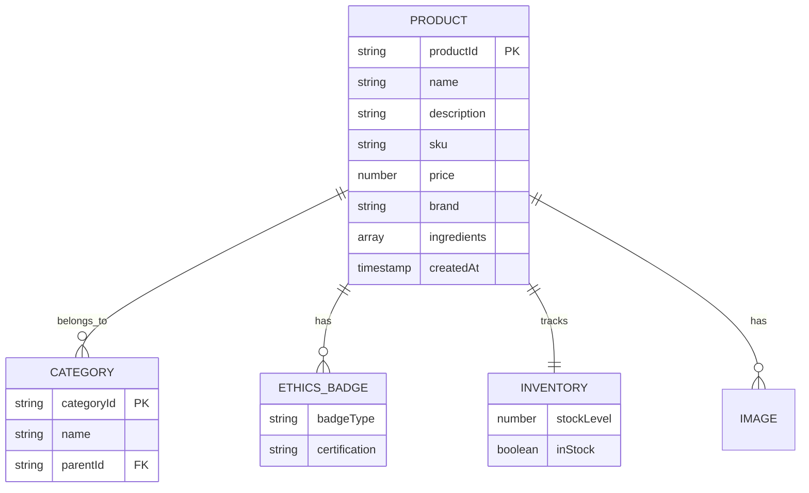

# Feature: Product Catalog Management

> **Purpose:**
> This document defines the product data model, storage, and retrieval capabilities for the itsme.fashion beauty product catalog.
> It is the **single source of truth** for how products are structured, stored, and queried.

---

## 0. Metadata

All metadata is defined in the frontmatter above (between the `---` markers).

---

## 1. Overview

Product Catalog Management defines and stores beauty product data including categories, descriptions, ingredient lists, ethics badges, SKUs, pricing, and inventory levels in Firestore.

This feature enables:
- Structured product aggregates with value objects (ProductId, SKU, Price)
- Category hierarchy for organization (Skin Care, Hair Care, Cosmetics)
- Ethics badges (cruelty-free, paraben-free, vegan) as product attributes
- Ingredient lists for transparency
- Product image storage via Firebase Storage
- Inventory tracking with stock levels
- GraphQL queries for products, single product, and products by category

## Flow Diagram



Caption: "Product catalog data model showing relationships."

---

## 2. User Problem

**Who:** Shoppers seeking ethical beauty products and admin managing product catalog

**Problem:**
- **Shoppers** cannot easily verify product claims (cruelty-free, vegan, etc.) without detailed ingredient lists
- **Conscious consumers** waste time researching brands' ethical practices
- **Users with allergies** struggle to find complete ingredient information on product pages
- **Admins** lack a structured way to add new products with consistent data

**Why existing solutions are insufficient:**
- Many beauty sites hide or abbreviate ingredient lists
- Ethics claims (e.g., "natural") are often unsubstantiated
- Product data is inconsistent across different retailers
- No centralized source of truth for product information

---

## 3. Goals

### User Experience Goals

- **Shoppers** can quickly identify products matching their ethical values via visible badges
- **Users** can read complete ingredient lists before purchasing
- **Conscious consumers** trust the platform's ethics claims backed by certifications
- **All users** see accurate pricing and stock availability

### Business / System Goals

- Enable 500+ product SKUs at launch with scalable architecture
- Support dynamic pricing updates without code deployments
- Maintain accurate inventory levels to prevent overselling
- Provide fast product queries (<100ms P95) for catalog browsing

---

## 4. Non-Goals

- **User reviews and ratings** — Deferred per PRD exclusions
- **Product recommendations** — Deferred
- **Dynamic pricing (sales, discounts)** — Deferred; flat pricing only
- **Product variants (sizes, colors)** — Single SKU per product at MVP
- **Product comparison** — Deferred
- **Supplier management** — Products manually added by admin

---

## 5. Functional Scope

**Core Capabilities:**

1. **Product Data Model**
   - ProductId (UUID), SKU (unique), Name, Description
   - Brand, Price (in INR)
   - Category assignment (single category per product)
   - Ingredient list (array of strings)
   - Ethics badges (array): cruelty-free, paraben-free, vegan
   - Images (array of Firebase Storage URLs)
   - CreatedAt, UpdatedAt timestamps

2. **Category Hierarchy**
   - Top-level categories: Skin Care, Hair Care, Cosmetics
   - Sub-categories: Moisturizers, Cleansers, Shampoos, Lipsticks, etc.
   - Products belong to one leaf category

3. **Inventory Tracking**
   - Stock level (integer count)
   - In-stock boolean (true if stockLevel > 0)
   - Low stock threshold (alert admin when stock < 10)

4. **Image Storage**
   - Product images stored in Firebase Storage
   - Multiple images per product (min 1, max 5)
   - Images optimized for web (WebP format, <200KB)

5. **GraphQL API**
   - Queries: `products`, `product(id)`, `productsByCategory(categoryId)`
   - Admin mutations (deferred to F-013)

---

## 6. Dependencies & Assumptions

**Dependencies:**
- F-001 (Platform Foundation) — Firestore and Storage configured

**Assumptions:**
- Product data manually seeded initially (CSV import or admin UI from F-013)
- Product images provided by suppliers in standard formats (JPEG, PNG)
- Prices in INR only (no multi-currency)
- Ethics badges verified by admin based on supplier certifications

**External Constraints:**
- Firestore read/write quota limits
- Firebase Storage bandwidth limits for images

---

## 7. User Stories & Experience Scenarios

---

### User Story 1 — Browse Product Catalog

**As a** beauty shopper
**I want** to view all products with their details (name, price, image, ethics badges)
**So that** I can discover products that match my values

---

#### Scenarios

##### Scenario 1.1 — First-Time Catalog View

**Given** I am a new visitor on the homepage
**When** I navigate to "All Products" or a category page
**Then** I see a grid of product cards with images, names, prices, and ethics badges
**And** products load within 500ms
**And** images display with low-quality placeholders until full resolution loads

---

##### Scenario 1.2 — View Product Details

**Given** I am viewing the product catalog
**When** I click on a product card
**Then** I am taken to the product detail page
**And** I see the full product description, ingredient list, ethics badges, and stock status
**And** I can view multiple product images in a gallery

---

##### Scenario 1.3 — Filter by Category

**Given** I am on the product catalog page
**When** I select "Skin Care" category filter
**Then** only products in the Skin Care category are displayed
**And** the URL updates to reflect the category selection
**And** I can navigate back to "All Products" easily

---

##### Scenario 1.4 — Out of Stock Product

**Given** I am viewing a product detail page
**And** the product has 0 stock level
**When** the page loads
**Then** I see a clear "Out of Stock" indicator
**And** the "Add to Cart" button is disabled
**And** I am offered an option to "Notify me when available" (deferred to future)

---

##### Scenario 1.5 — High Traffic Product Listing

**Given** the site has 10,000 concurrent users browsing products
**When** I load the product catalog
**Then** the page loads within 1.5 seconds
**And** images are served from CDN cache
**And** Firestore queries are optimized with indexing

---

##### Scenario 1.6 — Mobile Product Browsing

**Given** I am on a mobile device (375px viewport)
**When** I view the product catalog
**Then** products display in a responsive 2-column grid
**And** product images are sized appropriately for mobile
**And** touch targets for product cards are ≥44px

---

### User Story 2 — View Ingredient List

**As a** conscious consumer
**I want** to see the full ingredient list for each product
**So that** I can avoid allergens and verify product claims

---

#### Scenarios

##### Scenario 2.1 — Ingredient List Display

**Given** I am on a product detail page
**When** the page loads
**Then** I see a section labeled "Ingredients" with a complete list
**And** ingredients are displayed in a readable format (comma-separated or list)
**And** the ingredient list is not truncated or hidden behind "Read more"

---

##### Scenario 2.2 — Ethics Badge Verification

**Given** I am viewing a product with a "Cruelty-Free" badge
**When** I hover or tap on the badge
**Then** I see a tooltip explaining "Certified cruelty-free by [Certification Body]"
**And** I can trust the badge is backed by a verifiable certification

---

##### Scenario 2.3 — Missing Ingredient Data

**Given** a product lacks an ingredient list (admin error)
**When** I view the product detail page
**Then** I see a message "Ingredient list not available. Please contact support."
**And** the product is flagged for admin review

---

##### Scenario 2.4 — Search for Specific Ingredient

**Given** I want to avoid products with parabens
**When** I use the product search feature (F-005)
**And** I search for "paraben-free"
**Then** products tagged with "paraben-free" badge are prioritized
**And** I can filter results to show only paraben-free products

---

##### Scenario 2.5 — Long Ingredient List Performance

**Given** a product has 50+ ingredients
**When** I load the product detail page
**Then** the ingredient list renders without layout shift
**And** the page remains responsive
**And** I can scroll through the list smoothly

---

##### Scenario 2.6 — Accessibility for Ingredient List

**Given** I am using a screen reader
**When** I navigate to the ingredient list section
**Then** the screen reader announces "Ingredients" heading
**And** reads each ingredient clearly
**And** I can navigate through the list with keyboard (tab/arrow keys)

---

## 8. Edge Cases & Constraints (Experience-Relevant)

**Hard Limits:**
- Maximum 5 images per product
- Ingredient list max 200 characters per ingredient
- SKU must be unique across all products
- Stock level cannot be negative

**Data Quality Constraints:**
- Products must have at least 1 image
- Price must be > 0
- Product name max 100 characters
- Description max 500 characters

**Compliance:**
- Ingredient lists must be accurate per legal requirements
- Ethics badges must be substantiated by certifications
- Product images must not violate copyright

---

## 9. Implementation Tasks (Execution Agent Checklist)

```markdown
- [ ] T01 — Define Firestore schema for products collection with product aggregate structure
  - [ ] Unit Test: Product document structure validates correctly
  - [ ] Integration Test: Products can be written and read from Firestore

- [ ] T02 — Implement GraphQL query for products list with pagination support
  - [ ] Unit Test: Query resolver returns product array
  - [ ] E2E Test: GraphQL playground returns products list

- [ ] T03 — Implement GraphQL query for single product by productId
  - [ ] Unit Test: Query resolver returns single product or null
  - [ ] E2E Test: Product detail query returns correct data

- [ ] T04 — Implement GraphQL query for productsByCategory with category filter
  - [ ] Unit Test: Category filter correctly filters products
  - [ ] E2E Test: Category page displays filtered products

- [ ] T05 — Setup Firebase Storage for product images with upload utility
  - [ ] Integration Test: Image upload and retrieval works
  - [ ] E2E Test: Product images display on frontend

- [ ] T06 — Implement inventory tracking with stock level management
  - [ ] Unit Test: Stock level decrements on cart addition (F-006 integration)
  - [ ] Integration Test: Out of stock products cannot be added to cart

- [ ] T07 — [Rollout] Create feature flag for catalog visibility
  - [ ] Integration Test: Flag controls product query availability
  - [ ] E2E Test: Catalog hidden when flag disabled
```

---

## 10. Acceptance Criteria (Verifiable Outcomes)

```markdown
- [ ] AC1 — Products collection exists in Firestore with 20+ seed products
  - [ ] Integration test passed: Products readable via Firestore SDK
  - [ ] Manual verification: Firestore UI shows products collection

- [ ] AC2 — GraphQL products query returns product list with all fields
  - [ ] E2E test passed: Query returns productId, name, price, image URLs, badges
  - [ ] Manual verification: GraphQL playground executes query successfully

- [ ] AC3 — Product detail query returns complete product data including ingredients
  - [ ] E2E test passed: Query includes ingredient array and ethics badges
  - [ ] Manual verification: Product page displays all data correctly

- [ ] AC4 — Products can be filtered by category
  - [ ] E2E test passed: productsByCategory query filters correctly
  - [ ] Manual verification: Category page shows only relevant products

- [ ] AC5 — Product images are stored in Firebase Storage and accessible
  - [ ] Integration test passed: Image URLs return 200 status
  - [ ] Manual verification: Images load on product pages

- [ ] AC6 — Inventory levels accurately reflect stock
  - [ ] Unit test passed: Stock level updates on cart operations
  - [ ] Manual verification: Out of stock badge displays when stock = 0
```

---

## 11. Rollout & Risk

**Rollout Strategy:**
- Seed initial product catalog with 20-50 products before launch
- Deploy catalog queries to production with flag disabled
- Enable for internal testing first (admin preview)
- Public rollout after product data quality review

**Risk Mitigation:**
- Product data validation prevents incomplete entries
- Image optimization reduces bandwidth costs
- Firestore indexes prevent slow queries at scale

### Remote Config Flags

<!-- REMOTE_CONFIG_FLAG_START -->
| Context | Type | Namespace | Default (Dev) | Default (Stg) | Default (Prod) | Key |
|---------|------|-----------|---------------|---------------|----------------|-----|
| catalog_enabled | BOOLEAN | client | true | true | false | _auto-generated_ |
| show_ingredient_lists | BOOLEAN | client | true | true | true | _auto-generated_ |
<!-- REMOTE_CONFIG_FLAG_END -->

**Flag Purpose:**
- `catalog_enabled`: Master toggle for product catalog visibility
- `show_ingredient_lists`: Permanent flag to control ingredient display (compliance requirement in some regions)

**Removal Criteria:** `catalog_enabled` removed after stable rollout; `show_ingredient_lists` is permanent for compliance

---

## 12. History & Status

- **Status:** Draft
- **Related Epics:** Identity & Discovery (Phase 2)
- **Related Issues:** `<created post-merge>`
- **Dependencies:** F-001 (Platform Foundation)
- **Dependent Features:** F-005 (Product Discovery), F-006 (Shopping Cart), F-013 (Admin Product Management)

---

## Final Note

> This document defines **intent and experience** for the product catalog.
> Execution details are derived from it — never the other way around.
