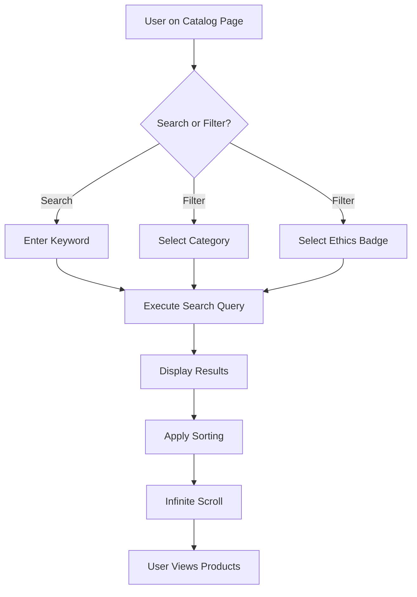

# Feature: Product Discovery & Search

> **Purpose:**
> This document defines product search, filtering, and discovery capabilities enabling users to find beauty products by keyword, category, and ethics badges.
> It is the **single source of truth** for product findability and search UX.

---

## 0. Metadata

All metadata is defined in the frontmatter above (between the `---` markers).

---

## 1. Overview

Product Discovery & Search enables users to browse products by category, search by keyword with relevance scoring, and filter by ethics badges for conscious shopping.

This feature enables:
- Full-text search with Firestore relevance scoring
- Category filtering UI and GraphQL resolvers
- Ethics badge filters (cruelty-free, paraben-free, vegan)
- Sorting options (relevance, price ascending/descending)
- Infinite scroll pagination for mobile optimization
- Mobile-optimized product grid layout

## Flow Diagram



Caption: "Product discovery and search user flow."

---

## 2. User Problem

**Who:** Beauty shoppers looking for specific products or browsing by values

**Problem:**
- **Shoppers** waste time scrolling through irrelevant products
- **Users searching for specific brands or products** cannot find them quickly
- **Conscious consumers** struggle to filter by ethical criteria
- **Mobile users** face slow, frustrating search experiences

**Why existing solutions are insufficient:**
- Generic search returns irrelevant results without relevance scoring
- Filters are hidden or require multiple clicks to apply
- Search is slow, requiring full page reloads
- No ability to combine search with filters (e.g., "vegan lipstick")

---

## 3. Goals

### User Experience Goals

- **Users** find relevant products within 3 search results
- **Mobile users** experience instant search results (<300ms)
- **Ethical shoppers** can filter by multiple badges simultaneously
- **All users** can sort by price to find budget-friendly options
- **Returning users** see search suggestions based on popular queries

### Business / System Goals

- Increase product discoverability, reducing "no results" searches to <5%
- Support 1,000 products with fast search (<100ms P95 query time)
- Enable A/B testing of search relevance algorithms
- Track search analytics (top queries, zero-result queries)

---

## 4. Non-Goals

- **AI-powered recommendations** — Deferred
- **Personalized search results** — Deferred
- **Voice search** — Deferred
- **Advanced faceted search (price ranges, ratings)** — Deferred; simple filters only
- **Auto-complete suggestions** — Deferred to post-MVP
- **Search analytics dashboard** — Analytics tracked but no admin UI in MVP

---

## 5. Functional Scope

**Core Capabilities:**

1. **Full-Text Search**
   - Keyword search across product name, description, brand
   - Relevance scoring prioritizing exact matches
   - Case-insensitive search

2. **Category Filtering**
   - Filter by top-level categories (Skin Care, Hair Care, Cosmetics)
   - Filter by sub-categories (Moisturizers, Shampoos, Lipsticks)
   - Clear active filters

3. **Ethics Badge Filtering**
   - Filter by cruelty-free, paraben-free, vegan
   - Multi-select filters (AND logic: show products with all selected badges)

4. **Sorting**
   - Relevance (default for search results)
   - Price ascending (low to high)
   - Price descending (high to low)

5. **Pagination**
   - Infinite scroll on mobile
   - "Load More" button as fallback
   - 20 products per page

6. **GraphQL API**
   - Query: `searchProducts(query: String!, filters: ProductFilters, sort: SortOption, page: Int)`

---

## 6. Dependencies & Assumptions

**Dependencies:**
- F-004 (Product Catalog Management) — Product data must exist

**Assumptions:**
- Firestore supports full-text search (limited; may use array-contains for keyword matching)
- Users primarily search for brand names, product types (e.g., "lipstick"), or ethics terms
- Mobile users prefer infinite scroll over pagination controls

**External Constraints:**
- Firestore queries limited to 100 results per request (pagination required)
- Complex full-text search may require external service (Algolia) in future; MVP uses basic Firestore queries

---

## 7. User Stories & Experience Scenarios

---

### User Story 1 — Search for Specific Product

**As a** shopper looking for a specific product
**I want** to search by keyword and see relevant results quickly
**So that** I can find the product without browsing the entire catalog

---

#### Scenarios

##### Scenario 1.1 — Successful Keyword Search

**Given** I am on the product catalog page
**When** I enter "moisturizer" in the search bar
**And** I submit the search
**Then** I see a list of products with "moisturizer" in the name or description
**And** results are sorted by relevance (exact matches first)
**And** the search completes within 300ms

---

##### Scenario 1.2 — Search with No Results

**Given** I am searching for a product
**When** I enter "xyz123" (a term with no matches)
**And** I submit the search
**Then** I see a message "No products found for 'xyz123'"
**And** I am suggested to "Clear filters" or "Browse all products"

---

##### Scenario 1.3 — Search with Filters Combined

**Given** I have searched for "lipstick"
**When** I also apply the "vegan" ethics badge filter
**Then** I see only vegan lipsticks
**And** the results update without a full page reload
**And** the URL reflects the search query and filters

---

##### Scenario 1.4 — Clear Search and Filters

**Given** I have active search and filters applied
**When** I click "Clear all"
**Then** the search query is cleared
**And** all filters are removed
**And** I see the full product catalog again

---

##### Scenario 1.5 — High-Traffic Search Performance

**Given** 10,000 concurrent users are searching
**When** I perform a search
**Then** my search query completes within 500ms
**And** results are returned from Firestore with proper indexing
**And** the UI remains responsive

---

##### Scenario 1.6 — Mobile Search with Infinite Scroll

**Given** I am on a mobile device
**When** I search for "shampoo" and scroll through results
**Then** additional results load automatically as I reach the bottom
**And** the scroll animation is smooth (60fps)
**And** a loading indicator appears during fetch

---

### User Story 2 — Filter by Ethics Badges

**As a** conscious consumer
**I want** to filter products by ethics badges (cruelty-free, vegan, paraben-free)
**So that** I only see products that align with my values

---

#### Scenarios

##### Scenario 2.1 — Apply Single Ethics Filter

**Given** I am viewing the product catalog
**When** I select the "Cruelty-Free" filter
**Then** only products with the cruelty-free badge are displayed
**And** the product count updates to show filtered results
**And** I can see which filter is active

---

##### Scenario 2.2 — Apply Multiple Ethics Filters

**Given** I am viewing the product catalog
**When** I select both "Vegan" and "Paraben-Free" filters
**Then** only products with BOTH badges are displayed (AND logic)
**And** the filtered results update reactively

---

##### Scenario 2.3 — Remove Individual Filter

**Given** I have multiple filters applied
**When** I deselect one filter (e.g., "Vegan")
**Then** the filter is removed
**And** results expand to show products matching remaining filters

---

##### Scenario 2.4 — No Products Match Filter Combination

**Given** I apply a combination of filters
**When** no products match all criteria
**Then** I see "No products match your filters"
**And** I am suggested to "Try fewer filters" or browse categories

---

##### Scenario 2.5 — Filter Accessibility on Mobile

**Given** I am on a mobile device
**When** I access the filter panel
**Then** filters are displayed in a mobile-friendly drawer or expandable section
**And** touch targets for filter checkboxes are ≥44px
**And** I can apply filters without pinching or zooming

---

##### Scenario 2.6 — Screen Reader Announces Filter Changes

**Given** I am using a screen reader
**When** I apply a filter
**Then** the screen reader announces "Filter applied: Cruelty-Free"
**And** the updated product count is announced
**And** I can navigate through filtered results with keyboard

---

## 8. Edge Cases & Constraints (Experience-Relevant)

**Hard Limits:**
- Search queries max 100 characters
- Firestore returns max 100 products per query (paginated)
- Filters can be combined up to 3 simultaneously (performance limit)

**Performance Constraints:**
- Search must complete within 500ms (P95)
- Infinite scroll must load within 1 second

**Data Quality:**
- Products without keywords in name/description may not appear in search
- Ethics badges must be accurately tagged by admin

---

## 9. Implementation Tasks (Execution Agent Checklist)

```markdown
- [ ] T01 — Implement searchProducts GraphQL query with keyword search logic
  - [ ] Unit Test: Search query filters by keyword correctly
  - [ ] E2E Test: Search bar returns relevant results

- [ ] T02 — Implement category filter resolver and UI component
  - [ ] Unit Test: Category filter correctly filters products
  - [ ] E2E Test: Category dropdown filters product grid

- [ ] T03 — Implement ethics badge multi-select filter with AND logic
  - [ ] Unit Test: Multiple filters apply AND logic
  - [ ] E2E Test: Filter checkboxes update results reactively

- [ ] T04 — Implement sorting options (relevance, price asc/desc)
  - [ ] Unit Test: Sort functions order products correctly
  - [ ] E2E Test: Sort dropdown updates product order

- [ ] T05 — Implement infinite scroll pagination with "Load More" fallback
  - [ ] Integration Test: Pagination loads next 20 products
  - [ ] E2E Test: Infinite scroll triggers on scroll to bottom

- [ ] T06 — Optimize Firestore queries with composite indexes for search + filters
  - [ ] Integration Test: Queries complete within 500ms with 1,000 products
  - [ ] Manual verification: Firestore indexes created for common filter combinations

- [ ] T07 — [Rollout] Create feature flag for advanced search features
  - [ ] Integration Test: Flag controls search availability
  - [ ] E2E Test: Search hidden when flag disabled
```

---

## 10. Acceptance Criteria (Verifiable Outcomes)

```markdown
- [ ] AC1 — Search returns relevant results within 300ms
  - [ ] E2E test passed: Search query completes and displays results
  - [ ] Manual verification: Search tested on production data

- [ ] AC2 — Category and ethics filters work independently and together
  - [ ] E2E test passed: Filters update product grid correctly
  - [ ] Manual verification: All filter combinations tested

- [ ] AC3 — Sorting changes product order as expected
  - [ ] E2E test passed: Sort dropdown correctly reorders products
  - [ ] Manual verification: Price sorting verified

- [ ] AC4 — Infinite scroll loads additional products smoothly
  - [ ] E2E test passed: Scroll to bottom triggers pagination
  - [ ] Manual verification: No layout shift during load

- [ ] AC5 — Mobile search and filter UX is optimized
  - [ ] E2E test passed: Mobile viewport (375px) tested
  - [ ] Manual verification: Real device testing confirms usability

- [ ] AC6 — "No results" state provides helpful guidance
  - [ ] E2E test passed: Zero-result searches show message and CTA
  - [ ] Manual verification: User tested for clarity
```

---

## 11. Rollout & Risk

**Rollout Strategy:**
- Deploy search with basic keyword matching first
- Enable filters incrementally: categories → ethics badges → sorting
- Monitor search performance and zero-result queries
- Gradual rollout: 25% → 50% → 100%

**Risk Mitigation:**
- Firestore indexes prevent slow queries
- Fallback to "Browse All" if search fails
- Track zero-result queries for catalog improvements

### Remote Config Flags

<!-- REMOTE_CONFIG_FLAG_START -->
| Context | Type | Namespace | Default (Dev) | Default (Stg) | Default (Prod) | Key |
|---------|------|-----------|---------------|---------------|----------------|-----|
| search_enabled | BOOLEAN | client | true | true | false | _auto-generated_ |
| ethics_filters | BOOLEAN | client | true | true | false | _auto-generated_ |
<!-- REMOTE_CONFIG_FLAG_END -->

**Flag Purpose:**
- `search_enabled`: Master toggle for search functionality
- `ethics_filters`: Enable/disable ethics badge filtering (test impact on conversions)

**Removal Criteria:** After 30 days at 100% with <0.5% error rate

---

## 12. History & Status

- **Status:** Draft
- **Related Epics:** Identity & Discovery (Phase 2)
- **Related Issues:** `<created post-merge>`
- **Dependencies:** F-004 (Product Catalog Management)
- **Dependent Features:** None

---

## Final Note

> This document defines **intent and experience** for product discovery and search.
> Execution details are derived from it — never the other way around.
