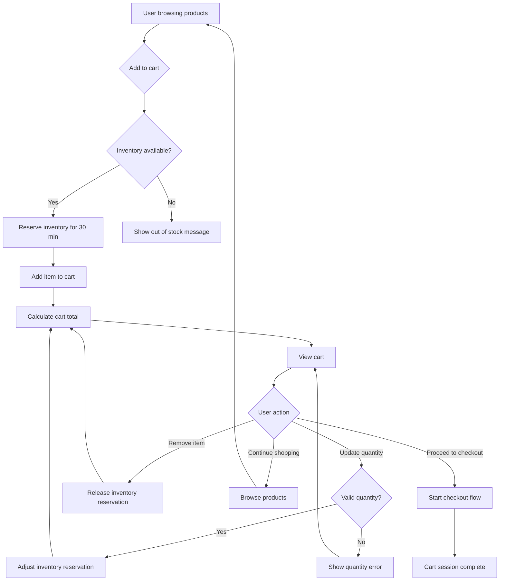

# Feature: Shopping Cart

> **Purpose:**
> This document defines a single feature's intent, scope, user experience, and completion criteria.
> It is the **single source of truth** for planning, review, automation, and execution.

---

## 0. Metadata

All metadata is defined in the frontmatter above (between the `---` markers).

**Important:** The frontmatter is used by automation scripts to:

- Create GitHub issues
- Link features to parent epics
- Generate feature flags
- Track status and ownership

---

## 1. Overview

**The Shopping Cart feature enables users to collect products for purchase in a temporary, session-based container.**

- Allows users to add products from the catalog to a cart, adjust quantities, and remove items
- Provides a centralized view of selected items with real-time pricing and total calculation
- Reserves inventory for 30 minutes to prevent overselling during the shopping session
- Supports both authenticated users and guest shoppers with session-based persistence
- Serves as the bridge between product discovery and checkout initiation

This feature introduces meaningful change by giving users a flexible, low-commitment space to explore purchase options before committing to checkout.

## Flow Diagram



Caption: "High-level user journey showing cart operations from product addition through checkout initiation."

---

## 2. User Problem

**Users shopping for beauty products need a way to collect items before making a final purchase decision.**

### Who experiences the problem

- **First-time visitors** exploring unfamiliar premium beauty products who need time to compare options
- **Returning customers** who shop across multiple browsing sessions and need to maintain context
- **Gift shoppers** juggling multiple products to meet budget constraints
- **Deal hunters** waiting to add more items to qualify for free shipping or promotions

### When and in what situations it occurs

- Users discover a product they like but aren't ready to commit to purchase immediately
- Shoppers want to see the cumulative cost of multiple products before proceeding
- Users are interrupted mid-session (phone call, distraction) and lose track of selected items
- Customers need to verify inventory availability before investing time in the checkout process

### Current friction

Without a cart:
- Users have no memory of which products they've selected, forcing them to backtrack through search results
- There's no way to see the total cost of multiple items without manual calculation
- Inventory isn't reserved, leading to frustration when items become unavailable during checkout
- Users can't maintain shopping context across interruptions, resulting in abandoned sessions

### Why existing behavior is insufficient

- Browser bookmarks don't capture quantity or provide pricing visibility
- Manual note-taking creates friction and breaks the shopping flow
- Proceeding directly to checkout without a staging area feels high-pressure and reduces exploration
- Without inventory reservation, users experience checkout failures that erode trust

---

## 3. Goals

### User Experience Goals

- **Reduce cognitive load**: Users can add items without committing to purchase, creating a low-pressure exploration environment
- **Maintain context across interruptions**: Session-based persistence allows users to resume shopping after brief interruptions without losing selections
- **Provide pricing transparency**: Real-time total calculation helps users stay within budget before checkout
- **Build confidence in availability**: Inventory reservation ensures that items in the cart remain available for a reasonable window
- **Enable flexible decision-making**: Easy quantity adjustments and item removal support iterative refinement of purchase intent
- **Minimize abandonment friction**: Guest cart support eliminates authentication barriers during initial exploration

### Business / System Goals

- **Prevent overselling**: Inventory reservation ensures stock levels remain accurate across concurrent sessions
- **Increase conversion rate**: Cart persistence reduces abandonment by preserving shopping context
- **Reduce checkout failures**: Pre-checkout inventory validation eliminates disappointment at payment stage
- **Enable cart abandonment tracking**: Session-based carts provide data for future re-engagement strategies (out of scope for this feature)
- **Support guest checkout flow**: Non-authenticated users can proceed to purchase without registration barriers

---

## 4. Non-Goals

**This feature explicitly does not attempt to solve:**

- **Persistent cart across devices**: Cart is session-based only; it does not sync across browsers, tabs, or devices
- **Cart recovery after session expiration**: When the browser tab/window closes, the cart is permanently lost (no email reminders, no save-for-later)
- **Saved carts for authenticated users**: Even logged-in users lose cart contents on session end (future enhancement)
- **Multi-cart or wishlist hybrid**: Cart is singular per session; users cannot maintain multiple carts or compare cart scenarios
- **Promotional code application**: Discount codes are applied during checkout, not at the cart stage
- **Product recommendations in cart**: Upsell or cross-sell suggestions are deferred to future features
- **Cart sharing**: Users cannot share their cart with others or transfer cart contents
- **Partial checkout**: Users cannot check out a subset of cart items; it's all-or-nothing
- **Automatic re-reservation**: Once the 30-minute reservation expires, users must manually re-add items (no auto-extension)

---

## 5. Functional Scope

**This feature enables users to perform the following cart operations within a browser session:**

### Core Capabilities

1. **Add to Cart**: Users can add a product from the catalog to their cart with a specified quantity (default: 1)
2. **View Cart**: Users can see all items in their cart with product details, quantity, unit price, line total, and grand total
3. **Update Quantity**: Users can increase or decrease item quantity up to available inventory limits
4. **Remove Item**: Users can delete a specific line item from the cart entirely
5. **Clear Cart**: Users can empty the entire cart in a single action
6. **Inventory Reservation**: System automatically reserves inventory for cart items for 30 minutes upon addition
7. **Reservation Timeout**: System automatically releases reserved inventory after 30 minutes of inactivity or when items are removed
8. **Session Persistence**: Cart contents persist in browser session storage (cleared on tab/browser close)

### Expected Behaviors

- **Real-time total calculation**: Cart subtotal and line totals update immediately on quantity changes
- **Inventory validation**: System prevents adding more items than available stock
- **Graceful degradation**: If a reserved item becomes unavailable (rare race condition), user receives clear notification during checkout transition
- **Guest and authenticated parity**: Cart behavior is identical for logged-in and guest users
- **No duplicate line items**: Adding the same product increases quantity rather than creating a new line
- **Quantity constraints**: Minimum quantity is 1; maximum is constrained by available inventory

### System Responsibilities

- Maintain accurate inventory reservation state across concurrent user sessions
- Release reservations on timeout, cart abandonment, or explicit item removal
- Persist cart state in browser session storage (not server-side)
- Validate inventory availability on all cart mutations (add, update)
- Calculate totals using current catalog pricing (prices may fluctuate between sessions)
- Provide GraphQL API for cart operations (queries: `cart`; mutations: `addToCart`, `updateCartItem`, `removeFromCart`, `clearCart`)

---

## 6. Dependencies & Assumptions

### Dependencies on Other Features

- **F-003: User Authentication**: Required for authenticated user cart sessions; guest users bypass authentication but still interact with cart
- **F-004: Product Catalog Management**: Cart line items reference products, SKUs, and pricing from the catalog; inventory reservation requires real-time stock levels

### Assumptions About User Behavior

- Users typically complete a purchase within 30 minutes of adding the first item to their cart
- Users are shopping within a single browser tab/window for the duration of their session
- Users understand that closing the browser tab will lose their cart (no explicit persistence warning in MVP)

### Assumptions About Environment

- Browser session storage is available and reliable
- Network connectivity is stable enough for real-time inventory validation
- Product pricing and availability are managed by F-004 and remain accessible via GraphQL

### External or Organizational Constraints

- No backend cart persistence in MVP (session-based only to reduce infrastructure complexity)
- Inventory reservation timeout is fixed at 30 minutes (not configurable per-product or per-user)
- Cart does not enforce minimum or maximum order values (deferred to checkout)

---

## 7. User Stories & Experience Scenarios

> This section defines **how users live with the feature**.
> Scenarios must focus on **quality of life and lifecycle experience**, not just technical failures.

---

### User Story 1 — Guest Shopper Building Initial Cart

**As a** first-time guest visitor exploring premium beauty products  
**I want** to add products to a temporary cart without creating an account  
**So that** I can explore my purchase options flexibly before committing to checkout

---

#### Scenarios

##### Scenario 1.1 — First-Time Add to Cart

**Given** a guest user browsing the product catalog with no items in their cart  
**When** they click "Add to Cart" on a product with available inventory  
**Then** the product is added to the cart with quantity 1  
**And** inventory is reserved for 30 minutes  
**And** a success notification appears (e.g., "Added [Product Name] to cart")  
**And** a cart icon badge displays the total item count (e.g., "1")  
**And** the user remains on the product listing page

---

##### Scenario 1.2 — Returning to Cart After Adding Multiple Items

**Given** a guest user has added 3 products to their cart over the past 10 minutes  
**And** the user navigates to different pages within the site  
**When** they click the cart icon to view their cart  
**Then** all 3 products are displayed with accurate quantities, unit prices, and line totals  
**And** the cart subtotal reflects the sum of all line totals  
**And** the user can see the time remaining before reservation expiration (optional UI enhancement)

---

##### Scenario 1.3 — Browser Refresh Mid-Session

**Given** a guest user has 2 items in their cart with 15 minutes remaining on reservations  
**When** they accidentally refresh the browser page  
**Then** the cart contents persist from session storage  
**And** the same 2 items are still visible in the cart  
**And** inventory reservations remain active (countdown continues from current state)  
**And** the user can continue shopping without data loss

---

##### Scenario 1.4 — Adding Product with Insufficient Inventory

**Given** a guest user viewing a product with only 2 units in stock  
**And** another user has reserved 1 unit in their cart  
**When** the guest user attempts to add 3 units to their cart  
**Then** the system prevents the addition  
**And** displays a message: "Only 1 unit available. We've added the maximum available quantity to your cart."  
**And** the cart updates with 1 unit instead of 3  
**And** inventory is reserved for the 1 available unit

---

##### Scenario 1.5 — Cart Load Performance with 10+ Items

**Given** a guest user has added 12 different products to their cart  
**When** they navigate to the cart view  
**Then** all 12 items load within 1 second  
**And** the cart subtotal calculation completes immediately  
**And** the UI remains responsive to scroll and interaction  
**And** no loading spinners are required for total calculation

---

##### Scenario 1.6 — Mobile Cart Experience on 375px Viewport

**Given** a guest user shopping on a mobile device (375px width)  
**When** they view their cart with 3 items  
**Then** each line item displays product image, name, quantity controls, price, and remove button in a readable layout  
**And** touch targets for quantity +/- buttons are at least 44x44px  
**And** the cart scrolls smoothly without horizontal overflow  
**And** the "Proceed to Checkout" button remains fixed at the bottom or clearly visible

---

### User Story 2 — Shopper Adjusting Cart Contents

**As a** user with items in my cart  
**I want** to update quantities or remove products  
**So that** I can refine my purchase before proceeding to checkout

---

#### Scenarios

##### Scenario 2.1 — Increasing Quantity of Existing Item

**Given** a user has 1 unit of "Hydrating Serum" in their cart  
**And** 5 units are available in inventory  
**When** the user increases the quantity to 3 using the +/- controls  
**Then** the line item quantity updates to 3  
**And** the line total recalculates (3 × unit price)  
**And** the cart subtotal updates to reflect the change  
**And** inventory reservation increases from 1 to 3 units  
**And** the change persists in session storage

---

##### Scenario 2.2 — Removing Item from Cart

**Given** a user has 4 products in their cart  
**When** they click the "Remove" button on one line item  
**Then** the item is immediately removed from the cart  
**And** the cart now displays 3 products  
**And** the inventory reservation for the removed product is released  
**And** the cart subtotal updates to exclude the removed item  
**And** a confirmation message appears: "[Product Name] removed from cart"

---

##### Scenario 2.3 — Clearing Entire Cart

**Given** a user has 5 items in their cart  
**When** they click "Clear Cart" or "Remove All"  
**Then** a confirmation prompt appears: "Remove all items from your cart?"  
**And** if the user confirms, all 5 items are removed  
**And** all inventory reservations are released  
**And** the cart view displays an empty state: "Your cart is empty"  
**And** a "Continue Shopping" button is prominently displayed

---

##### Scenario 2.4 — Attempting to Exceed Inventory Limit

**Given** a user has 2 units of "Vitamin C Cream" in their cart  
**And** only 3 units are available in total inventory  
**When** the user attempts to increase quantity to 5  
**Then** the system prevents the update  
**And** the quantity remains at 2  
**And** a message displays: "Only 3 units available. Maximum quantity is 3."  
**And** the user can still update to 3 if desired

---

##### Scenario 2.5 — Concurrent Cart Updates

**Given** a user has their cart open in the cart view  
**And** they update the quantity of Item A from 1 to 2  
**When** they immediately update the quantity of Item B from 3 to 1 before the first mutation completes  
**Then** both updates are processed sequentially without data loss  
**And** the final cart state reflects both changes  
**And** the cart subtotal is accurate  
**And** inventory reservations adjust correctly for both items

---

##### Scenario 2.6 — Accessible Quantity Controls

**Given** a keyboard-only user navigating the cart with Tab key  
**When** they focus on a quantity input field  
**Then** they can use arrow keys or type a number to adjust quantity  
**And** pressing Enter triggers the update mutation  
**And** a screen reader announces: "Quantity updated to [N]"  
**And** the +/- buttons are also keyboard accessible via Tab and Enter

---

### User Story 3 — Shopper Experiencing Reservation Timeout

**As a** user who added items to my cart but got distracted  
**I want** to understand what happened to my reserved inventory  
**So that** I can decide whether to re-add items or abandon my purchase

---

#### Scenarios

##### Scenario 3.1 — Reservation Expiration During Active Session

**Given** a user added 3 items to their cart 30 minutes ago  
**And** the user is still browsing the site (session active)  
**When** the 30-minute reservation window expires  
**Then** the cart items remain visible in the UI  
**And** a notification appears: "Some items in your cart are no longer reserved. Please review availability."  
**And** when the user attempts to proceed to checkout, inventory is re-validated  
**And** if inventory is still available, new reservations are created  
**And** if inventory is unavailable, the user is notified which items cannot be purchased

---

##### Scenario 3.2 — Returning to Site After Prolonged Absence

**Given** a user added 2 items to their cart 45 minutes ago  
**And** the user left the browser tab open but switched to other tasks  
**When** they return to the cart view after 45 minutes  
**Then** the cart items are still displayed (session storage persists)  
**And** a warning message appears: "Your reservations have expired. Availability is not guaranteed."  
**And** the user can attempt to proceed to checkout  
**And** checkout initiation triggers fresh inventory validation and re-reservation

---

##### Scenario 3.3 — Partial Inventory Loss After Timeout

**Given** a user added Item A (2 units) and Item B (1 unit) to their cart  
**And** 35 minutes have passed (reservations expired)  
**When** the user proceeds to checkout  
**Then** the system re-validates inventory  
**And** if Item A is still available but Item B sold out, the user sees: "Item B is no longer available and has been removed from your cart."  
**And** Item A proceeds to checkout with a new reservation  
**And** the user can complete purchase for Item A only

---

##### Scenario 3.4 — Grace Period for Immediate Re-Addition

**Given** a user's reservation expired 2 minutes ago  
**And** the items are still in the cart view (not removed from UI)  
**When** the user clicks "Refresh Cart" or "Proceed to Checkout"  
**Then** the system attempts to re-reserve inventory  
**And** if successful, displays: "Items re-reserved. You have 30 minutes to complete checkout."  
**And** if unsuccessful, displays: "Some items are no longer available" with specific product names

---

##### Scenario 3.5 — System Load During Reservation Timeout

**Given** the system is under high load with 500+ concurrent cart sessions  
**When** a user's 30-minute reservation expires  
**Then** the reservation release operation completes within 5 seconds  
**And** inventory becomes available for other users without delay  
**And** the user's cart view is unaffected (no UI disruption)

---

##### Scenario 3.6 — Timeout Notification Language (Mobile Context)

**Given** a mobile user with limited screen space  
**When** a reservation timeout notification appears  
**Then** the message is concise: "Reservations expired. Availability not guaranteed."  
**And** the notification does not obscure cart contents or CTA buttons  
**And** the user can dismiss the notification with a tap  
**And** the message includes an icon (⏱️) for visual reinforcement

---

### User Story 4 — Authenticated User Transitioning to Checkout

**As a** logged-in user with items in my cart  
**I want** to seamlessly move from cart to checkout  
**So that** I can complete my purchase without re-entering cart contents

---

#### Scenarios

##### Scenario 4.1 — Successful Checkout Initiation

**Given** an authenticated user has 3 items in their cart with active reservations  
**When** they click "Proceed to Checkout" from the cart view  
**Then** the system creates a checkout session from the current cart state  
**And** the user is redirected to the checkout address entry page  
**And** cart contents are passed to the checkout context  
**And** inventory reservations remain active (transferred to checkout session)  
**And** the cart session is marked as "in-checkout" (not abandoned)

---

##### Scenario 4.2 — Cart-to-Checkout with Expired Reservations

**Given** an authenticated user has 2 items in their cart with expired reservations  
**When** they click "Proceed to Checkout"  
**Then** the system re-validates inventory  
**And** if items are available, new reservations are created and checkout proceeds  
**And** if items are unavailable, an error displays: "Cart contents have changed. Please review."  
**And** unavailable items are removed from the cart  
**And** the user remains on the cart page to review changes before retrying checkout

---

##### Scenario 4.3 — Empty Cart Checkout Prevention

**Given** a user viewing an empty cart  
**When** they attempt to click "Proceed to Checkout"  
**Then** the checkout button is disabled (grayed out)  
**And** a message displays: "Your cart is empty. Add products to get started."  
**And** a "Continue Shopping" button is highlighted as the primary action

---

##### Scenario 4.4 — Network Failure During Checkout Transition

**Given** a user clicks "Proceed to Checkout" with 2 items in their cart  
**When** the network request to create a checkout session fails  
**Then** the user remains on the cart page  
**And** an error message displays: "Unable to proceed to checkout. Please try again."  
**And** cart contents remain intact in session storage  
**And** a "Retry" button is provided for the user to re-attempt checkout initiation  
**And** inventory reservations are not released

---

##### Scenario 4.5 — Checkout Load Time with Large Cart

**Given** a user has 20 items in their cart (edge case)  
**When** they click "Proceed to Checkout"  
**Then** the checkout session is created within 2 seconds  
**And** a loading indicator displays during the transition  
**And** the user is redirected to checkout only after session creation completes  
**And** no cart items are lost during the transition

---

##### Scenario 4.6 — Guest User Prompted for Authentication (Optional)

**Given** a guest user has 2 items in their cart  
**When** they click "Proceed to Checkout"  
**Then** they are offered the option to "Continue as Guest" or "Sign In"  
**And** selecting "Continue as Guest" proceeds directly to address entry  
**And** selecting "Sign In" redirects to login, then returns to checkout after authentication  
**And** cart contents persist through the authentication flow

---

## 8. Edge Cases & Constraints (Experience-Relevant)

### Hard Limits Users May Encounter

- **Maximum cart quantity per item**: Limited by available inventory (no artificial cap in MVP)
- **Maximum unique items in cart**: No enforced limit, but UI is optimized for 1-20 items; performance may degrade beyond 50 items
- **Reservation duration**: Fixed at 30 minutes; no extension mechanism available
- **Session lifetime**: Cart persists only while the browser tab/window remains open; closing the tab permanently loses the cart

### Irreversible Actions or Consequences

- **Clear Cart**: Permanently removes all items and releases all reservations; no undo mechanism
- **Session termination**: Closing the browser tab deletes the cart from session storage with no recovery option
- **Reservation expiration**: After 30 minutes, reserved inventory is released and may be purchased by others; user must re-add items

### Compliance, Safety, or Policy Constraints

- **No personally identifiable information (PII) in session storage**: Cart stores only product IDs, quantities, and reservation timestamps; no user data
- **Inventory reservation fairness**: First-come, first-served for reservations; no priority access for authenticated vs. guest users
- **Price consistency**: Cart displays current catalog pricing; if prices change during a session, the updated price applies at checkout (no price lock)

### System Behavior Under Constraint

- **Concurrent inventory contention**: If two users attempt to reserve the last unit simultaneously, the first request wins; the second receives an "out of stock" message
- **Session storage quota exceeded**: Unlikely with cart data, but if browser storage is full, cart operations fail with a user-facing error: "Unable to save cart. Please clear browser storage."

---

## 9. Implementation Tasks (Execution Agent Checklist)

> This section provides the specific work items for the **Execution Agent**.
> Every task must map back to a specific scenario defined in Section 7.

```markdown
- [ ] T01 — Implement `Cart` aggregate with `LineItem` entities and session storage persistence (Scenario 1.1, 1.3)
  - [ ] Unit Test: Cart.addItem() creates LineItem with correct productId, quantity, and price
  - [ ] Unit Test: Cart.toSessionStorage() serializes cart state to JSON
  - [ ] Unit Test: Cart.fromSessionStorage() deserializes and restores cart state
  - [ ] E2E Test: Adding product to cart persists in session storage and survives page refresh

- [ ] T02 — Implement `addToCart` GraphQL mutation with inventory validation and reservation (Scenario 1.1, 1.4)
  - [ ] Unit Test: addToCart validates inventory availability before reservation
  - [ ] Unit Test: addToCart creates 30-minute reservation in Firestore `reservations` collection
  - [ ] Integration Test: addToCart rejects request when inventory insufficient
  - [ ] E2E Test: User adds product to cart, inventory decreases, reservation timeout is set

- [ ] T03 — Implement `updateCartItem` and `removeFromCart` mutations with reservation adjustment (Scenario 2.1, 2.2, 2.4)
  - [ ] Unit Test: updateCartItem adjusts reservation quantity when quantity increases
  - [ ] Unit Test: removeFromCart releases inventory reservation immediately
  - [ ] Integration Test: updateCartItem rejects quantity exceeding available inventory
  - [ ] E2E Test: User increases quantity, reservation updates; user removes item, inventory released

- [ ] T04 — Implement cart total calculation and real-time UI updates (Scenario 1.2, 2.1, 2.5)
  - [ ] Unit Test: Cart.calculateTotal() sums all LineItem totals correctly
  - [ ] Unit Test: LineItem.calculateLineTotal() multiplies quantity × unit price
  - [ ] E2E Test: Cart subtotal updates immediately when quantity changes

- [ ] T05 — Implement inventory reservation timeout background job (Scenario 3.1, 3.2, 3.5)
  - [ ] Unit Test: Reservation timeout job identifies reservations older than 30 minutes
  - [ ] Unit Test: Timeout job releases expired reservations and updates inventory
  - [ ] Integration Test: Timeout job runs every 5 minutes and processes all expired reservations
  - [ ] E2E Test: Reservation expires after 30 minutes, inventory becomes available to other users

- [ ] T06 — Implement `clearCart` mutation and empty cart UI state (Scenario 2.3)
  - [ ] Unit Test: clearCart removes all LineItems and releases all reservations
  - [ ] E2E Test: User clears cart, all items removed, "Your cart is empty" message displays

- [ ] T07 — Implement checkout initiation with inventory re-validation (Scenario 4.1, 4.2)
  - [ ] Unit Test: initiateCheckout re-validates inventory for all cart items
  - [ ] Integration Test: initiateCheckout creates checkout session from cart state
  - [ ] E2E Test: User proceeds to checkout, checkout session created, cart items transferred

- [ ] T08 — Implement cart UI with mobile-responsive layout (Scenario 1.6, 2.6)
  - [ ] E2E Test: Cart renders correctly on 375px viewport with readable text and accessible touch targets
  - [ ] E2E Test: Quantity controls are keyboard accessible and announce changes to screen readers

- [ ] T09 — Implement reservation expiration warnings and re-reservation logic (Scenario 3.1, 3.4)
  - [ ] Unit Test: Cart detects expired reservations and flags items for re-validation
  - [ ] E2E Test: Expired reservation triggers warning notification in UI

- [ ] T10 — [Rollout] Add Remote Config flag gating for cart feature (Scenario 1.1)
  - [ ] Integration Test: Cart UI hidden when `cart_enabled` flag is false
  - [ ] Integration Test: Cart mutations return error when flag disabled on server
```

---

## 10. Acceptance Criteria (Verifiable Outcomes)

> These criteria are used by the **Execution Agent** and **Reviewers** to verify completion.
> Each criterion must be observable and testable.

```markdown
- [ ] AC1 — Guest users can add products to cart with inventory reservation
  - [ ] Unit test passed: Cart aggregate adds LineItem with productId, quantity, price
  - [ ] E2E test passed: Adding product to cart creates 30-minute inventory reservation
  - [ ] E2E test passed: Cart icon badge displays correct item count

- [ ] AC2 — Users can update quantities and remove items with real-time total recalculation
  - [ ] Unit test passed: Cart.calculateTotal() returns correct sum of line totals
  - [ ] E2E test passed: Quantity increase updates line total and cart subtotal immediately
  - [ ] E2E test passed: Removing item releases reservation and updates subtotal

- [ ] AC3 — Cart contents persist in session storage through page refreshes
  - [ ] Unit test passed: Cart.toSessionStorage() serializes state to valid JSON
  - [ ] E2E test passed: Cart contents survive browser refresh without data loss

- [ ] AC4 — Inventory validation prevents overselling and displays humane error messages
  - [ ] Integration test passed: addToCart rejects request when inventory insufficient
  - [ ] E2E test passed: User attempting to add 5 units when only 2 available sees: "Only 2 units available. We've added the maximum available quantity."

- [ ] AC5 — Reservation timeout releases inventory after 30 minutes
  - [ ] Unit test passed: Timeout job identifies reservations older than 30 minutes
  - [ ] Integration test passed: Timeout job releases expired reservations and updates inventory count
  - [ ] E2E test passed: Expired reservation warning appears in cart UI after 30 minutes

- [ ] AC6 — Checkout initiation validates inventory and creates checkout session
  - [ ] Integration test passed: initiateCheckout re-validates all cart items
  - [ ] E2E test passed: User proceeds to checkout, checkout session created with cart contents

- [ ] AC7 — Cart UI is mobile-responsive and accessible
  - [ ] E2E test passed: Cart renders correctly on 375px viewport with touch targets ≥44px
  - [ ] E2E test passed: Quantity controls are keyboard accessible and screen-reader friendly

- [ ] AC8 — [Gating] Feature flag correctly controls cart visibility and mutations
  - [ ] Integration test passed: Cart UI hidden when `cart_enabled` = false
  - [ ] Integration test passed: GraphQL mutations return disabled error when flag = false
```

---

## 11. Rollout & Risk

### Rollout Strategy

**Phased rollout with gradual inventory reservation activation:**

1. **Phase 1 (0% production)**: Deploy to staging with `cart_enabled = true` for internal QA testing
   - Validate session storage persistence across all supported browsers
   - Stress test inventory reservation timeout with 100 concurrent sessions
   - Verify GraphQL mutation performance under load

2. **Phase 2 (10% production)**: Enable for 10% of production users via Remote Config
   - Monitor cart abandonment rate and reservation timeout frequency
   - Track inventory reservation accuracy (expected vs. actual stock levels)
   - Collect user feedback on quantity controls and error messaging

3. **Phase 3 (50% production)**: Increase to 50% if no critical issues observed after 7 days
   - Monitor checkout initiation success rate (cart → checkout transition)
   - Analyze session storage failure rate and browser compatibility
   - Validate reservation timeout job performance at scale

4. **Phase 4 (100% production)**: Full rollout after 14 days of stable 50% deployment
   - Maintain flag for emergency kill-switch capability
   - Plan flag removal after 30 days of 100% rollout with <0.1% error rate

### Risk Mitigation

- **Inventory overselling**: Firestore transaction isolation ensures atomic reservation updates; reservation timeout job runs every 5 minutes to prevent stale locks
- **Session storage quota**: Cart data is minimal (<50KB for typical 10-item cart); edge case error handling prevents data loss
- **Performance degradation**: Cart mutations complete in <200ms (p95); timeout job processes 10,000 expired reservations per minute
- **Reservation abuse**: 30-minute timeout prevents indefinite inventory locking; no per-user reservation limit required in MVP

### Exit Criteria

- **Temporary flag removal**: After 30 days at 100% with cart abandonment rate <40% and checkout success rate >95%
- **Rollback trigger**: Automatic disable if reservation failure rate >5% or checkout transition failures >10%

### Remote Config Flags

<!-- REMOTE_CONFIG_FLAG_START -->
| Context | Type | Namespace | Default (Dev) | Default (Stg) | Default (Prod) | Key |
|---------|------|-----------|---------------|---------------|----------------|-----|
| cart_enabled | BOOLEAN | client | true | true | false | _auto-generated_ |
| max_cart_items | NUMBER | server | 100 | 50 | 50 | _auto-generated_ |
| reservation_timeout_minutes | NUMBER | server | 30 | 30 | 30 | _auto-generated_ |
<!-- REMOTE_CONFIG_FLAG_END -->

**Flag Justification:**

- **cart_enabled**: Temporary flag for gradual rollout and emergency kill-switch; removal planned after 30-day stable deployment
- **max_cart_items**: Permanent configuration flag to prevent abuse and manage UI performance; allows tuning without code deployment
- **reservation_timeout_minutes**: Permanent configuration flag to adjust business rule based on user behavior analysis; enables A/B testing of timeout duration

---

## 12. History & Status

- **Status:** Draft
- **Related Epics:** Shopping Experience (linked after automation)
- **Related Issues:** Created post-merge via GitHub automation
- **Dependencies:** F-003 (User Authentication), F-004 (Product Catalog Management)

---

## Final Note

> This document defines **intent and experience**.
> Execution details are derived from it — never the other way around.
