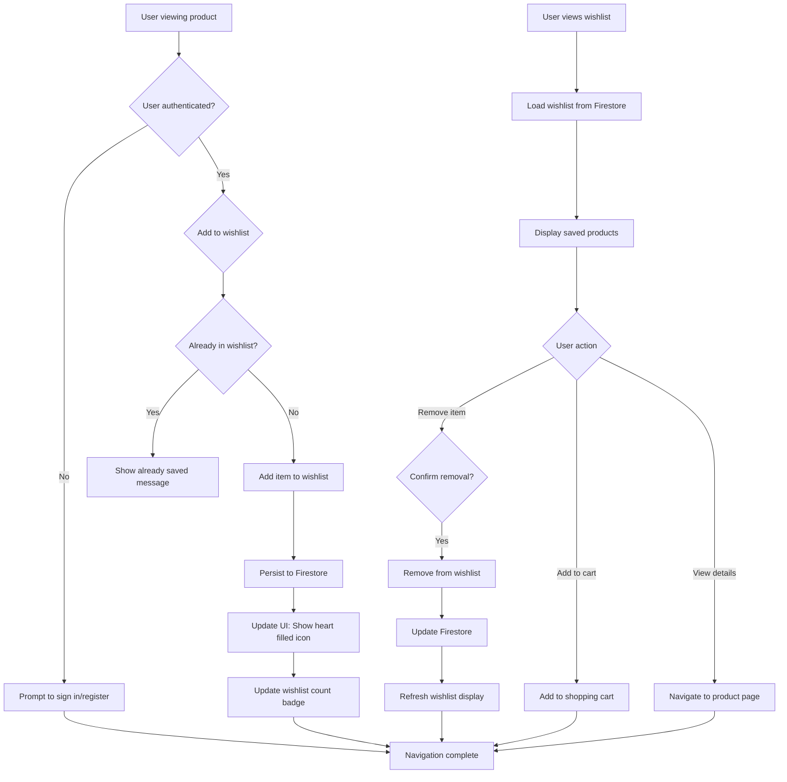

# Feature: Wishlist Management

> **Purpose:**
> This document defines a single feature's intent, scope, user experience, and completion criteria.
> It is the **single source of truth** for planning, review, automation, and execution.

---

## 0. Metadata

All metadata is defined in the frontmatter above (between the `---` markers).

**Important:** The frontmatter is used by automation scripts to:

- Create GitHub issues
- Link features to parent epics
- Generate feature flags
- Track status and ownership

---

## 1. Overview

**The Wishlist Management feature enables authenticated users to save products for future consideration in a persistent, personalized collection.**

- Allows users to save products they're interested in but not ready to purchase immediately
- Provides persistent storage of wishlist items across sessions and devices
- Supports add/remove operations with real-time UI updates
- Serves as a long-term collection separate from the temporary shopping cart
- Requires user authentication to ensure data persistence and personalization

This feature introduces meaningful change by giving users a dedicated space to curate their product interests over time, supporting research-driven purchase decisions common in premium beauty shopping.

## Flow Diagram



Caption: "User journey showing wishlist add/remove operations with authentication gating and persistent storage."

---

## 2. User Problem

**Premium beauty shoppers need a way to save interesting products for later research and comparison without committing to immediate purchase.**

### Who experiences the problem

- **Research-driven shoppers** who discover products over multiple browsing sessions and need to maintain a personal shortlist
- **Budget-conscious buyers** who want to save high-ticket items for future payday purchases
- **Gift planners** creating wishlists to share with friends/family (even without explicit sharing features)
- **Multi-device users** who discover products on mobile but prefer to complete purchases on desktop

### When and in what situations it occurs

- Users discover an interesting product but want to research ingredients or reviews before purchasing
- Shoppers encounter products they can't afford right now but want to remember for later
- Users are browsing casually without purchase intent but want to bookmark items for future consideration
- Customers want to compare multiple products side-by-side over several days before deciding

### Current friction

Without a wishlist:
- Users have no persistent memory of interesting products across sessions, forcing them to re-search or screenshot product pages
- There's no way to maintain a personal curated collection of aspirational or future-purchase items
- Users lose track of products they wanted to research further, resulting in missed sales opportunities
- No mechanism exists to revisit previously considered products without browser history diving

### Why existing behavior is insufficient

Browser bookmarks and screenshots are manual, non-integrated workarounds that don't sync across devices or provide product availability updates. The shopping cart serves a different purpose (immediate purchase intent with 30-minute inventory reservation) and isn't suitable for long-term product saving.

---

## 3. Goals

### User Experience Goals

- **Effortless product saving**: Users can add products to wishlist with a single tap/click from any product context
- **Cross-session persistence**: Wishlist items remain available across browser sessions, devices, and time periods
- **Low-friction discovery**: Users can easily rediscover saved items without manual bookmarking or screenshots
- **Clear authentication value**: Users understand that signing in unlocks persistent wishlist functionality
- **Quick conversion to cart**: Saved items can be moved to cart instantly when purchase readiness occurs

### Business / System Goals

- Increase user registration conversion by providing clear value for authenticated sessions
- Capture long-term purchase intent signals for inventory and marketing planning
- Reduce cart abandonment by separating research-phase saving from purchase-intent cart usage
- Enable future personalization and recommendation features based on wishlist data

---

## 4. Non-Goals

**Explicitly state what this feature does not attempt to solve.**

- **Wishlist sharing**: Users cannot share wishlist links with others (deferred per PRD Section 22)
- **Price drop notifications**: No automatic alerts when wishlist item prices decrease (out of scope)
- **Stock availability alerts**: No notifications when out-of-stock wishlist items return to inventory (deferred)
- **Wishlist organization**: No folders, tags, or custom categorization of wishlist items (deferred)
- **Guest wishlists**: Unauthenticated users cannot maintain wishlists (requires authentication)
- **Wishlist notes**: Users cannot add personal notes or reminders to wishlist items (out of scope)
- **Automatic cart transfer**: Wishlist items are not automatically moved to cart (manual action required)

---

## 5. Functional Scope

**Describe what the feature enables at a conceptual level.**

### Core capabilities

- **Add to wishlist**: Users can save any catalog product to their personal wishlist from product detail pages or listing views
- **Remove from wishlist**: Users can remove items from their wishlist with confirmation
- **View wishlist**: Users can access a dedicated wishlist page showing all saved products with current images, names, and prices
- **Authentication gating**: Unauthenticated users see a prompt to sign in/register when attempting to use wishlist features
- **Persistent storage**: Wishlist data is stored in Firestore and linked to the user's account
- **Visual indicators**: Products already in the wishlist show filled heart icons; count badge displays total wishlist items
- **Move to cart**: Users can add wishlist items to the shopping cart with a single action

### Expected behaviors

- Wishlist operations succeed immediately with optimistic UI updates
- Maximum wishlist size is 100 items (soft limit with warning at 90 items)
- Wishlist items persist indefinitely (no automatic expiration)
- Product information displayed in wishlist reflects current catalog data (prices/availability may change)
- Duplicate additions show friendly "already saved" feedback instead of creating duplicate entries
- Users can add the same product to both wishlist and cart simultaneously

### System responsibilities

- Validate user authentication before any wishlist mutation operations
- Maintain referential integrity between wishlist items and product catalog
- Synchronize wishlist count badge across all UI components
- Handle gracefully when wishlist items reference deleted or out-of-stock products
- Provide GraphQL API for wishlist operations accessible to frontend components

---

## 6. Dependencies & Assumptions

**List conditions required for this feature to function as intended.**

### Dependencies on other features

- **F-003 (User Authentication)**: Required for user identity verification and session management
- **F-004 (Product Catalog Management)**: Wishlist items reference product catalog data (implicit dependency)
- **F-001 (Platform Foundation)**: Requires Firestore database and GraphQL Mesh gateway

### Assumptions about user behavior

- Users understand that wishlists require account creation (this is standard ecommerce behavior)
- Users will primarily access wishlist from dedicated wishlist page or account menu
- Most users maintain wishlists of 10-30 items (informs pagination strategy)
- Users expect wishlist items to reflect current pricing, not saved-at-time prices

### Technical constraints

- Firestore security rules enforce user-only read/write access to personal wishlists
- GraphQL resolvers verify JWT authentication token before executing mutations
- Frontend components check authentication state before rendering wishlist UI elements

### External constraints

- No external API dependencies (wishlist is fully internal)
- Firestore document size limits (1 MB) support up to ~2000 wishlist items per user (well above 100-item soft limit)

---

## 7. User Stories & Experience Scenarios

> This section defines **how users live with the feature**.
> Scenarios must focus on **quality of life and lifecycle experience**, not just technical failures.

---

### User Story 1 — Saving Products for Future Consideration

**As a** premium beauty shopper researching new skincare products  
**I want** to save interesting products to a persistent wishlist  
**So that** I can revisit and compare them across multiple browsing sessions without losing track

---

#### Scenarios

##### Scenario 1.1 — First-Time Wishlist Use

**Given** an authenticated user has never used the wishlist feature before  
**When** the user taps the heart icon on a product detail page  
**Then** the product is added to their wishlist  
**And** the heart icon fills with color to indicate saved state  
**And** a success toast message appears: "Added to your wishlist"  
**And** the wishlist count badge appears in the header showing "1"  
**And** the next time they visit the site (even on a different device), the saved product appears in their wishlist

---

##### Scenario 1.2 — Returning User Adding More Items

**Given** an authenticated user with 5 existing wishlist items  
**And** the user is browsing the product listing page  
**When** the user taps the heart icon on a product card  
**Then** the product is added to their wishlist immediately  
**And** the wishlist count badge updates from "5" to "6" without page reload  
**And** the heart icon on that product card fills to indicate saved state  
**And** if the user navigates to the wishlist page, the newly added item appears at the top of the list

---

##### Scenario 1.3 — Interrupted Research Session

**Given** a user has added 3 products to their wishlist during a mobile browsing session  
**And** the user closes the browser/app mid-session due to an interruption  
**When** the user returns 2 days later on their desktop computer and signs in  
**Then** all 3 previously saved wishlist items are immediately visible on the wishlist page  
**And** the wishlist count badge shows "3" upon page load  
**And** the user can continue their research from where they left off without data loss

---

##### Scenario 1.4 — Attempting to Add Duplicate Product

**Given** an authenticated user with Product X already in their wishlist  
**When** the user taps the heart icon on Product X again (from search results or product page)  
**Then** the system does not create a duplicate wishlist entry  
**And** a friendly message appears: "This item is already in your wishlist"  
**And** the heart icon remains filled, maintaining visual consistency  
**And** the wishlist count badge does not increment

---

##### Scenario 1.5 — Wishlist Performance with Many Items

**Given** an authenticated user with 50 items in their wishlist  
**When** the user navigates to the wishlist page  
**Then** the page loads within 2 seconds with a loading skeleton UI  
**And** wishlist items render progressively (first 20 items appear within 500ms)  
**And** the user can scroll smoothly to view all items with infinite scroll pagination  
**And** the "Add to cart" and "Remove" actions respond within 300ms with optimistic UI updates

---

##### Scenario 1.6 — Mobile-Optimized Wishlist Experience

**Given** a user on a 375px mobile viewport (iPhone SE size)  
**When** the user views their wishlist page  
**Then** wishlist items display in a single-column grid with touch-friendly tap targets (minimum 44px)  
**And** product images load in mobile-optimized sizes (320px width max)  
**And** the "Remove" and "Add to cart" buttons are clearly accessible without horizontal scrolling  
**And** the wishlist count badge is visible in the mobile header navigation

---

### User Story 2 — Unauthenticated User Wishlist Prompt

**As a** casual browser exploring products without an account  
**I want** to be prompted to sign in when attempting to use wishlist features  
**So that** I understand the value of creating an account and can save items if desired

---

#### Scenarios

##### Scenario 2.1 — First-Time Unauthenticated Wishlist Attempt

**Given** an unauthenticated user viewing a product detail page  
**When** the user taps the heart icon to add to wishlist  
**Then** a modal dialog appears with the message: "Sign in to save items to your wishlist"  
**And** the modal offers two clear action buttons: "Sign In" and "Create Account"  
**And** a "Not now" option allows the user to dismiss the modal  
**And** the product is not added to any temporary wishlist (authentication is required)

---

##### Scenario 2.2 — Post-Login Wishlist Sync

**Given** an unauthenticated user has dismissed the wishlist sign-in prompt  
**And** the user later decides to create an account and completes registration  
**When** the user returns to the previously viewed product page  
**Then** the heart icon is in its default unfilled state (no pre-auth wishlist data exists)  
**And** the user can now successfully add the product to their new persistent wishlist  
**And** the wishlist count badge appears showing "1" after the first addition

---

##### Scenario 2.3 — Repeated Unauthenticated Wishlist Attempts

**Given** an unauthenticated user has dismissed the sign-in prompt once  
**When** the user attempts to add another product to wishlist (second attempt)  
**Then** the same sign-in prompt appears consistently (no dismissal memory)  
**And** the prompt messaging remains respectful and non-intrusive  
**And** the user can still browse and use cart features (guest checkout) without authentication

---

##### Scenario 2.4 — Accessible Authentication Prompt

**Given** an unauthenticated user on any device  
**When** the wishlist sign-in prompt modal appears  
**Then** the modal is WCAG 2.1 AA compliant with proper focus management  
**And** keyboard users can navigate and dismiss the modal using Tab and Escape keys  
**And** screen readers announce the modal content and action buttons clearly  
**And** the modal does not block access to other site functionality permanently

---

##### Scenario 2.5 — Mobile Prompt Experience

**Given** an unauthenticated user on a mobile device (320px-768px viewport)  
**When** the wishlist sign-in prompt appears  
**Then** the modal scales appropriately for the screen size without horizontal scrolling  
**And** the "Sign In" and "Create Account" buttons are touch-friendly (minimum 44px height)  
**And** the modal can be dismissed by tapping outside the dialog or using the close button  
**And** the prompt does not interfere with product browsing or cart functionality

---

##### Scenario 2.6 — Post-Authentication Flow Continuity

**Given** an unauthenticated user viewing Product X  
**And** the user taps the heart icon and sees the sign-in prompt  
**When** the user clicks "Create Account", completes registration, and is redirected back  
**Then** the user lands on Product X detail page (context preserved)  
**And** the user can now tap the heart icon again to successfully save Product X  
**And** the wishlist feature activation feels seamless and rewarding

---

### User Story 3 — Managing Wishlist Items

**As a** returning customer with an active wishlist  
**I want** to remove items I'm no longer interested in or move items to cart when ready to purchase  
**So that** my wishlist remains relevant and actionable as my preferences change

---

#### Scenarios

##### Scenario 3.1 — First-Time Removal from Wishlist

**Given** an authenticated user viewing their wishlist page with 8 saved items  
**When** the user taps the "Remove" button on a wishlist item  
**Then** a confirmation dialog appears: "Remove [Product Name] from wishlist?"  
**And** the dialog offers "Remove" and "Cancel" buttons  
**When** the user confirms "Remove"  
**Then** the item disappears from the wishlist immediately with a smooth animation  
**And** the wishlist count badge updates from "8" to "7"  
**And** a success message appears: "Removed from wishlist"

---

##### Scenario 3.2 — Bulk Removal Efficiency

**Given** an authenticated user with 15 wishlist items accumulated over months  
**And** the user wants to clean up outdated items  
**When** the user removes 5 items in succession  
**Then** each removal completes within 300ms with optimistic UI updates  
**And** the wishlist count badge decrements smoothly with each removal (15→14→13→12→11→10)  
**And** the confirmation dialog remembers the user's preference to "Skip confirmation for this session" if enabled  
**And** the remaining 10 items re-flow smoothly without layout jumps

---

##### Scenario 3.3 — Moving Wishlist Item to Cart

**Given** an authenticated user viewing their wishlist page  
**When** the user taps the "Add to cart" button on a wishlist item  
**Then** the product is added to the shopping cart with quantity 1  
**And** the item remains in the wishlist (wishlist and cart are independent)  
**And** a success toast appears: "Added to cart" with a "View cart" link  
**And** the cart count badge increments  
**And** if the product is out of stock, an error message appears: "Sorry, this item is currently unavailable"

---

##### Scenario 3.4 — Handling Deleted or Unavailable Products

**Given** an authenticated user with a wishlist containing Product Y  
**And** Product Y is deleted from the catalog by an admin  
**When** the user views their wishlist page  
**Then** Product Y appears with a grayed-out image and "No longer available" label  
**And** the "Add to cart" button is disabled for Product Y  
**And** the "Remove" button remains active, allowing cleanup  
**And** the user receives a gentle notification: "1 item in your wishlist is no longer available"

---

##### Scenario 3.5 — Price Change Awareness

**Given** an authenticated user with Product Z saved in their wishlist at ₹1200  
**And** the product price changes to ₹999 (sale price)  
**When** the user views their wishlist page  
**Then** Product Z displays the current price ₹999 (not the saved-at-time price ₹1200)  
**And** no historical price comparison is shown (price tracking is out of scope)  
**And** the user can add the product to cart at the current price ₹999

---

##### Scenario 3.6 — Empty Wishlist State

**Given** an authenticated user who has removed all items from their wishlist  
**When** the user navigates to the wishlist page  
**Then** an empty state illustration appears with the message: "Your wishlist is empty"  
**And** a clear call-to-action button reads: "Discover products"  
**And** the wishlist count badge disappears from the header (or shows "0")  
**And** the user can click "Discover products" to navigate to the product catalog

---

## 8. Edge Cases & Constraints (Experience-Relevant)

**Include only cases that materially affect user experience.**

### Hard limits users may encounter

- **Maximum 100 items per wishlist**: Users receive a warning at 90 items ("You're approaching the wishlist limit of 100 items") and a blocking error at 100 items ("Your wishlist is full. Please remove items before adding more")
- **Product deletion impact**: Wishlist items referencing deleted products remain visible as "No longer available" but cannot be added to cart
- **Session timeout**: Unauthenticated attempts to use wishlist features always require login (no temporary guest wishlists)

### Irreversible actions or consequences

- **Wishlist removal is permanent**: Removed items cannot be undone (no "undo" or trash bin feature)
- **Account deletion removes wishlist**: If a user deletes their account, their wishlist data is permanently deleted per data privacy compliance

### Compliance, safety, or policy constraints

- **GDPR/Privacy compliance**: Wishlist data is user-owned and included in data export/deletion requests
- **Firestore security rules**: Only the authenticated user can read/write their own wishlist data (strict user isolation)
- **No sharing or public wishlists**: Wishlist data is private-only to prevent unauthorized access

---

## 9. Implementation Tasks (Execution Agent Checklist)

> This section provides the specific work items for the **Execution Agent**.
> Every task must map back to a specific scenario defined in Section 7.

```markdown
- [ ] T01 — Implement Wishlist aggregate in `shopping` bounded context (Scenario 1.1)
  - [ ] Create Wishlist entity with userId, items[], createdAt, updatedAt
  - [ ] Create WishlistItem value object with productId, addedAt
  - [ ] Implement addItem(), removeItem(), getItems() methods
  - [ ] Unit Test: Wishlist aggregate operations (add, remove, duplicate handling)

- [ ] T02 — Create Firestore `wishlists` collection schema and security rules (Scenario 1.1, 1.3)
  - [ ] Define Firestore schema: `/wishlists/{userId}/items/{productId}`
  - [ ] Implement security rules: users can only access own wishlist data
  - [ ] Unit Test: Firestore security rules validation

- [ ] T03 — Implement GraphQL mutations for wishlist operations (Scenario 1.1, 1.2, 3.1)
  - [ ] Mutation: `addToWishlist(productId: ID!): Wishlist`
  - [ ] Mutation: `removeFromWishlist(productId: ID!): Wishlist`
  - [ ] Authentication gate: verify JWT token before executing mutations
  - [ ] Integration Test: GraphQL mutation authentication enforcement
  - [ ] E2E Test: Add/remove wishlist items via GraphQL API

- [ ] T04 — Implement GraphQL queries for wishlist data (Scenario 1.2, 1.5, 3.6)
  - [ ] Query: `wishlist: Wishlist` (returns current user's wishlist)
  - [ ] Implement pagination support (limit: 20 items per page)
  - [ ] Handle deleted/unavailable products gracefully (Scenario 3.4)
  - [ ] Integration Test: Wishlist query pagination and null product handling
  - [ ] E2E Test: Fetch wishlist with 50+ items and verify performance

- [ ] T05 — Create wishlist UI components with Lit web components (Scenario 1.1, 1.2, 1.6)
  - [ ] Component: `<wishlist-button>` with heart icon (filled/unfilled states)
  - [ ] Component: `<wishlist-badge>` for count display in header
  - [ ] Component: `<wishlist-page>` for full wishlist view
  - [ ] Implement optimistic UI updates for add/remove actions
  - [ ] Implement responsive design (320px-768px viewports)
  - [ ] Unit Test: Component state management with Preact Signals
  - [ ] E2E Test: Wishlist button toggle and badge count update

- [ ] T06 — Implement authentication gate and sign-in prompt modal (Scenario 2.1, 2.3, 2.4, 2.6)
  - [ ] Modal: `<auth-prompt-modal>` triggered on unauthenticated wishlist action
  - [ ] Display "Sign in to save items" message with Sign In/Create Account buttons
  - [ ] Implement WCAG 2.1 AA compliant modal (focus trap, keyboard navigation)
  - [ ] Preserve product context for post-auth redirect
  - [ ] Integration Test: Unauthenticated mutation rejection
  - [ ] E2E Test: Full guest-to-authenticated wishlist flow with context preservation

- [ ] T07 — Implement duplicate detection and friendly error handling (Scenario 1.4)
  - [ ] Check for existing productId in wishlist before adding
  - [ ] Return "already saved" message instead of error on duplicate
  - [ ] Unit Test: Duplicate product addition handling
  - [ ] E2E Test: Attempt to add same product twice and verify messaging

- [ ] T08 — Implement wishlist removal confirmation dialog (Scenario 3.1, 3.2)
  - [ ] Modal: `<confirm-removal-modal>` with product name and Remove/Cancel buttons
  - [ ] Optional: "Skip confirmation for this session" checkbox
  - [ ] Unit Test: Confirmation dialog state management
  - [ ] E2E Test: Remove item with and without confirmation

- [ ] T09 — Implement "Add to cart" from wishlist (Scenario 3.3)
  - [ ] Button action: call `addToCart` mutation with productId from wishlist
  - [ ] Display success toast with "View cart" link
  - [ ] Handle out-of-stock products gracefully
  - [ ] Integration Test: Wishlist-to-cart flow with inventory validation
  - [ ] E2E Test: Add wishlist item to cart and verify cart count update

- [ ] T10 — Handle deleted/unavailable products in wishlist (Scenario 3.4, 3.5)
  - [ ] GraphQL resolver: return product data or null for deleted products
  - [ ] UI: Display "No longer available" label for null products
  - [ ] UI: Disable "Add to cart" button for unavailable products
  - [ ] Display current product pricing (no historical price tracking)
  - [ ] Integration Test: Wishlist query with deleted product reference
  - [ ] E2E Test: View wishlist containing unavailable product

- [ ] T11 — Implement empty wishlist state (Scenario 3.6)
  - [ ] Component: `<empty-wishlist-state>` with illustration and CTA
  - [ ] Display when wishlist.items.length === 0
  - [ ] "Discover products" button navigates to product catalog
  - [ ] E2E Test: Remove last wishlist item and verify empty state

- [ ] T12 — Implement 100-item wishlist limit (Edge Case: Hard Limits)
  - [ ] Backend validation: reject addToWishlist if items.length >= 100
  - [ ] Display warning at 90 items ("Approaching wishlist limit")
  - [ ] Display blocking error at 100 items ("Wishlist is full")
  - [ ] Unit Test: Wishlist limit validation
  - [ ] E2E Test: Add 100 items and attempt 101st addition

- [ ] T13 — Implement cross-session persistence (Scenario 1.3)
  - [ ] Firestore integration: persist wishlist on every add/remove
  - [ ] Load wishlist on user authentication/page load
  - [ ] Integration Test: Add item, logout, login, verify persistence
  - [ ] E2E Test: Add items on mobile, login on desktop, verify sync

- [ ] T14 — Optimize wishlist performance for large lists (Scenario 1.5)
  - [ ] Implement infinite scroll pagination (20 items per page)
  - [ ] Implement loading skeleton UI for initial load
  - [ ] Optimize Firestore queries with indexing
  - [ ] Performance Test: Load wishlist with 100 items <2 seconds

- [ ] T15 — [Rollout] Implement feature flag gating for wishlist (All scenarios)
  - [ ] Feature flag: `feature_fe_007_fl_001_wishlist_enabled`
  - [ ] Gate wishlist button visibility based on flag
  - [ ] Gate GraphQL mutations/queries based on flag
  - [ ] Integration Test: Verify flag state controls feature access
  - [ ] E2E Test: Toggle flag and verify wishlist feature enable/disable
```

---

## 10. Acceptance Criteria (Verifiable Outcomes)

> These criteria are used by the **Execution Agent** and **Reviewers** to verify completion.
> Each criterion must be observable and testable.

```markdown
- [ ] AC1 — Authenticated users can add products to wishlist (Scenario 1.1, 1.2)
  - [ ] Unit test passed: Wishlist.addItem() correctly adds product and prevents duplicates
  - [ ] E2E test passed: User adds product, sees filled heart icon, wishlist count increments

- [ ] AC2 — Wishlist persists across sessions and devices (Scenario 1.3)
  - [ ] Integration test passed: Wishlist data saved to Firestore on add/remove
  - [ ] E2E test passed: User adds items on mobile, logs in on desktop, sees same wishlist

- [ ] AC3 — Unauthenticated users see sign-in prompt when attempting wishlist actions (Scenario 2.1, 2.3)
  - [ ] Integration test passed: GraphQL mutations reject unauthenticated requests
  - [ ] E2E test passed: Guest user taps heart icon, sees "Sign in to save" modal

- [ ] AC4 — Users can remove items from wishlist with confirmation (Scenario 3.1, 3.2)
  - [ ] Unit test passed: Wishlist.removeItem() correctly removes product
  - [ ] E2E test passed: User removes item, sees confirmation dialog, item disappears, count decrements

- [ ] AC5 — Users can add wishlist items to shopping cart (Scenario 3.3)
  - [ ] Integration test passed: addToCart mutation succeeds for wishlist products
  - [ ] E2E test passed: User clicks "Add to cart" on wishlist item, cart count increments

- [ ] AC6 — Deleted products are handled gracefully in wishlist (Scenario 3.4)
  - [ ] Integration test passed: Wishlist query returns null for deleted products without error
  - [ ] E2E test passed: Wishlist displays "No longer available" for deleted products

- [ ] AC7 — Wishlist displays current product pricing (Scenario 3.5)
  - [ ] Unit test passed: Wishlist resolver fetches live product data, not cached pricing
  - [ ] E2E test passed: Product price change reflects immediately in wishlist view

- [ ] AC8 — Empty wishlist shows helpful state (Scenario 3.6)
  - [ ] Unit test passed: Empty state component renders when items.length === 0
  - [ ] E2E test passed: User removes last item, sees empty state with "Discover products" CTA

- [ ] AC9 — Wishlist enforces 100-item limit (Edge Case: Hard Limits)
  - [ ] Unit test passed: addToWishlist rejects when items.length >= 100
  - [ ] E2E test passed: User with 100 items sees error when attempting to add 101st item

- [ ] AC10 — Mobile wishlist experience is optimized (Scenario 1.6, 2.5)
  - [ ] E2E test passed: Wishlist page renders correctly on 375px viewport
  - [ ] E2E test passed: All buttons have minimum 44px touch target height

- [ ] AC11 — Authentication prompt is accessible (Scenario 2.4)
  - [ ] Accessibility test passed: Modal is WCAG 2.1 AA compliant (keyboard navigation, focus trap, screen reader)
  - [ ] E2E test passed: User can dismiss modal with Escape key

- [ ] AC12 — Post-authentication flow preserves context (Scenario 2.6)
  - [ ] Integration test passed: Post-login redirect includes product context
  - [ ] E2E test passed: User signs in from wishlist prompt, returns to same product page

- [ ] AC13 — [Gating] Feature flag correctly controls wishlist visibility and access
  - [ ] Integration test passed: Wishlist mutations/queries rejected when flag is disabled
  - [ ] E2E test passed: Wishlist UI elements hidden when flag is disabled
```

---

## 11. Rollout & Risk (If Applicable)

### Rollout Strategy

- **Phase 1 (0% → 10%)**: Enable for internal team and beta testers (1 week monitoring)
- **Phase 2 (10% → 25%)**: Expand to 25% of authenticated users (monitor Firestore read/write costs)
- **Phase 3 (25% → 50%)**: Expand to 50% of users (monitor engagement metrics: wishlist usage rate)
- **Phase 4 (50% → 100%)**: Full rollout after 1 week stable operation at 50%

### Risk Mitigation

- **Firestore cost overrun**: Monitor Firestore read/write operations; optimize queries if costs exceed ₹5000/month
- **Low adoption**: If <10% of authenticated users engage with wishlist after 2 weeks, review UX friction points
- **Authentication barrier**: Track percentage of users who dismiss sign-in prompt vs. create accounts (target >15% conversion)

### Exit Criteria

- No critical bugs reported for 7 days at 100% rollout
- Wishlist usage rate >20% of authenticated users
- Firestore costs within budget (<₹5000/month for wishlist operations)

### Remote Config Flags

<!-- REMOTE_CONFIG_FLAG_START -->
| Context | Type | Namespace | Default (Dev) | Default (Stg) | Default (Prod) | Key |
|---------|------|-----------|---------------|---------------|----------------|-----|
| wishlist_feature | BOOLEAN | client | true | false | false | feature_fe_007_fl_001_wishlist_enabled |
| wishlist_backend | BOOLEAN | server | true | false | false | feature_be_007_fl_001_wishlist_mutations_enabled |
| wishlist_max_items | NUMBER | server | 100 | 100 | 100 | feature_be_007_fl_002_wishlist_max_items |
<!-- REMOTE_CONFIG_FLAG_END -->

---

## 12. History & Status

- **Status:** Draft
- **Related Epics:** `Shopping Experience`
- **Related Issues:** `<created post-merge>`
- **Dependencies:** F-003 (User Authentication), F-004 (Product Catalog Management - implicit)

---

## Final Note

> This document defines **intent and experience**.
> Execution details are derived from it — never the other way around.
