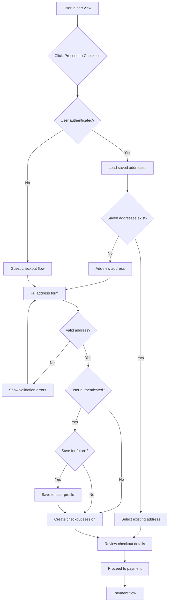

# Feature: Checkout & Address Management

> **Purpose:**
> This document defines a single feature's intent, scope, user experience, and completion criteria.
> It is the **single source of truth** for planning, review, automation, and execution.

---

## 0. Metadata

All metadata is defined in the frontmatter above (between the `---` markers).

**Important:** The frontmatter is used by automation scripts to:

- Create GitHub issues
- Link features to parent epics
- Generate feature flags
- Track status and ownership

---

## 1. Overview

**The Checkout & Address Management feature enables users to transition from cart to payment by collecting and managing shipping addresses.**

- Allows users to save multiple shipping addresses to their account for future reuse
- Supports guest checkout with one-time address collection (no account required)
- Enforces single address per order (no split shipments per PRD scope)
- Creates a checkout session that bridges cart state to payment processing
- Validates address data for shipping carrier compatibility (Shiprocket requirements)

This feature introduces meaningful change by removing friction from repeat purchases (saved addresses) while maintaining accessibility for guest shoppers, serving as the critical transition point between browsing and payment.

## Flow Diagram



Caption: "User journey showing address collection and checkout session creation for authenticated and guest users."

---

## 2. User Problem

**Users need a fast, friction-free way to provide shipping information while maintaining flexibility for both one-time and repeat purchases.**

### Who experiences the problem

- **Repeat customers** who order regularly and re-enter the same address every time (high friction)
- **First-time buyers** who want to complete a purchase without creating an account (no forced registration)
- **Multi-address users** who ship to home, office, or gift recipients and need address management
- **Mobile shoppers** who find manual address entry particularly tedious on small screens

### When and in what situations it occurs

- Users complete cart curation and attempt to check out but face lengthy address forms
- Returning customers must re-type addresses despite previous orders (no memory of past data)
- Gift shoppers need to enter a recipient's address but have no way to save it separately from their default
- Users abandon checkout due to form complexity or required account creation

### Current friction

Without address management:
- Every purchase requires full manual address entry, even for repeat customers (high friction)
- No validation occurs until payment fails due to unshippable address formats
- Users can't compare or switch between saved addresses (e.g., home vs. office)
- Guest checkout either doesn't exist (forcing registration) or provides no path to save data for future purchases

### Why existing behavior is insufficient

Manual address entry on every checkout creates unnecessary friction for loyal customers. Forcing account creation before address entry alienates first-time or low-commitment buyers. Without validation, shipping errors surface late in the fulfillment process, causing delivery failures and support burden.

---

## 3. Goals

### User Experience Goals

- **One-tap address selection**: Returning customers can select from saved addresses with a single click
- **Guest-friendly checkout**: First-time buyers can complete purchases without forced account creation
- **Mobile-optimized forms**: Address entry is streamlined for small screens with autofill and validation
- **Clear value for saving addresses**: Users understand the benefit of saving addresses (faster future checkouts)
- **Error prevention**: Invalid addresses are caught during checkout, not after payment/shipment

### Business / System Goals

- Reduce checkout abandonment by minimizing form friction and eliminating forced registration
- Increase repeat purchase velocity by enabling saved address reuse
- Decrease fulfillment errors by validating addresses against Shiprocket format requirements
- Capture guest email addresses for order tracking and future marketing
- Create clean handoff from cart to payment with structured checkout session

---

## 4. Non-Goals

**Explicitly state what this feature does not attempt to solve.**

- **Split shipments**: Orders cannot be shipped to multiple addresses (single address per order)
- **Address book management UI**: No dedicated address CRUD page (addresses managed inline during checkout)
- **Address autocomplete/geocoding**: No integration with Google Places API or address validation services (manual entry only)
- **International address formats**: Only India addresses supported initially (INR currency, Shiprocket domestic shipping)
- **Address sharing**: Users cannot share addresses with other users or accounts
- **Default address tagging**: No concept of "primary" or "default" address (user selects each time)
- **Billing address separate from shipping**: Single address serves both purposes (payment gateway doesn't require separate billing)

---

## 5. Functional Scope

**Describe what the feature enables at a conceptual level.**

### Core capabilities

- **Checkout initiation**: Users can click "Proceed to Checkout" from cart to enter the checkout flow
- **Address collection**: System collects street, city, state, ZIP, and country (India only) via a form
- **Address validation**: Real-time validation ensures required fields, valid ZIP format (6 digits), and state selection
- **Saved address selection**: Authenticated users can choose from previously saved addresses via radio button selection
- **New address addition**: Authenticated users can add new addresses to their saved list during checkout
- **Guest address entry**: Unauthenticated users can enter a one-time address and email without creating an account
- **Checkout session creation**: System creates a `CheckoutSession` entity linking cart, address, and user context
- **Address persistence**: Authenticated users' addresses are saved to Firestore for future reuse
- **Email collection for guests**: Guest checkout requires email for order tracking and notifications

### Expected behaviors

- Checkout button is disabled if cart is empty
- Maximum 5 saved addresses per authenticated user (soft limit)
- Address form pre-fills with most recently used address (for authenticated users)
- Validation errors appear inline next to invalid fields (real-time feedback)
- Checkout session expires after 30 minutes of inactivity (same as cart reservation)
- Guest email is validated for format (standard email regex)
- "Save address for future" checkbox is visible only to authenticated users

### System responsibilities

- Validate address data against Shiprocket-compatible format (no PO boxes, character limits)
- Maintain referential integrity between checkout session and cart/user
- Ensure checkout session contains all data needed for payment processing (address, cart items, totals)
- Provide GraphQL API for address CRUD and checkout session management
- Enforce single address per order (no multi-address selection in UI)

---

## 6. Dependencies & Assumptions

**List conditions required for this feature to function as intended.**

### Dependencies on other features

- **F-006 (Shopping Cart)**: Checkout requires non-empty cart with reserved inventory
- **F-003 (User Authentication)**: Required for saved address functionality (optional for guest checkout)
- **F-001 (Platform Foundation)**: Requires Firestore, GraphQL Mesh gateway

### Assumptions about user behavior

- Users expect address autofill from browser (HTML autocomplete attributes are sufficient)
- Most users have 1-2 saved addresses; few exceed 5 addresses
- Users understand that guest checkout does not save addresses (standard ecommerce behavior)
- Indian users are familiar with standard address format (street, city, state, ZIP)

### Technical constraints

- Firestore security rules enforce user-only access to saved addresses
- Checkout sessions are ephemeral (stored in Firestore with 30-minute TTL)
- GraphQL resolvers verify cart has items before allowing checkout initiation
- Address value object is immutable (changes require creating new address)

### External constraints

- Shiprocket API requires specific address format: 100-character street limit, valid state codes, 6-digit ZIP
- Payment gateway (Cashfree) requires email for all orders (guest or authenticated)

---

## 7. User Stories & Experience Scenarios

> This section defines **how users live with the feature**.
> Scenarios must focus on **quality of life and lifecycle experience**, not just technical failures.

---

### User Story 1 — Fast Checkout with Saved Addresses

**As a** returning customer with a saved address  
**I want** to select my address with one click and proceed to payment  
**So that** I can complete repeat purchases quickly without re-entering information

---

#### Scenarios

##### Scenario 1.1 — First-Time Checkout with Address Save

**Given** an authenticated user with items in their cart  
**And** the user has no saved addresses (first purchase)  
**When** the user clicks "Proceed to Checkout" from the cart page  
**Then** the checkout page loads with a new address form  
**And** the form includes fields: Full Name, Phone, Street Address, City, State (dropdown), ZIP Code, Country (pre-filled: India, disabled)  
**And** a checkbox appears: "Save this address for future orders" (checked by default)  
**When** the user fills the form with valid data and clicks "Continue to Payment"  
**Then** the address is saved to their Firestore user profile  
**And** a checkout session is created linking the cart, address, and user  
**And** the user is navigated to the payment page

---

##### Scenario 1.2 — Returning User Selects Saved Address

**Given** an authenticated user with 2 saved addresses (Home, Office)  
**And** the user has items in their cart  
**When** the user clicks "Proceed to Checkout"  
**Then** the checkout page displays both saved addresses as radio button options  
**And** each address shows: Name, Street (truncated), City, State, ZIP  
**And** the most recently used address is pre-selected  
**And** an option to "Add new address" is visible below saved addresses  
**When** the user selects "Office" address and clicks "Continue to Payment"  
**Then** a checkout session is created with the Office address  
**And** no new address is saved (using existing address)  
**And** the user proceeds to payment within 3 seconds

---

##### Scenario 1.3 — Returning User Adds Third Address During Checkout

**Given** an authenticated user with 2 existing saved addresses  
**And** the user wants to ship to a new address (gift recipient)  
**When** the user clicks "Add new address" on the checkout page  
**Then** a new address form appears  
**And** the "Save this address for future orders" checkbox is checked by default  
**When** the user completes the form and clicks "Continue to Payment"  
**Then** the new address is saved as the third address in their profile  
**And** the checkout session uses the new address  
**And** the next time the user checks out, all 3 addresses are available for selection

---

##### Scenario 1.4 — Address Form Validation Errors

**Given** an authenticated user filling out a new address form  
**When** the user leaves "Street Address" blank and enters an invalid ZIP "12345" (5 digits instead of 6)  
**And** the user clicks "Continue to Payment"  
**Then** the form does not submit  
**And** inline error messages appear:  
  - Street Address: "This field is required"  
  - ZIP Code: "Please enter a valid 6-digit PIN code"  
**And** the fields with errors are highlighted in red  
**And** the user's cursor is focused on the first invalid field  
**When** the user corrects the errors and resubmits  
**Then** the form validation passes and checkout proceeds

---

##### Scenario 1.5 — Mobile-Optimized Address Form

**Given** a user on a mobile device (375px viewport)  
**When** the user navigates to the checkout address form  
**Then** form fields are vertically stacked with full-width inputs  
**And** the "State" dropdown is touch-friendly with large tap targets  
**And** the ZIP code field triggers numeric keyboard on mobile  
**And** the phone field triggers phone keyboard on mobile  
**And** browser autofill is enabled via HTML autocomplete attributes (name="shipping-street-address", etc.)  
**And** the "Continue to Payment" button is sticky at the bottom of the screen (always accessible)

---

##### Scenario 1.6 — Handling 5-Address Limit

**Given** an authenticated user with 5 saved addresses (maximum limit)  
**When** the user clicks "Add new address" during checkout  
**Then** a message appears: "You've reached the maximum of 5 saved addresses. Please remove one to add a new address."  
**And** the user can select "Remove" on any existing address to free up space  
**Or** the user can proceed without saving by unchecking "Save this address for future orders"  
**When** the user unchecks the save option and completes the form  
**Then** the address is used for this order only (not persisted)  
**And** the checkout session is created successfully

---

### User Story 2 — Guest Checkout Without Account

**As a** first-time buyer who wants to try a single product  
**I want** to complete checkout by entering my address once without creating an account  
**So that** I can make a low-commitment purchase and receive my order

---

#### Scenarios

##### Scenario 2.1 — First-Time Guest Checkout

**Given** an unauthenticated user (guest) with items in their cart  
**When** the user clicks "Proceed to Checkout"  
**Then** the checkout page displays a single address form  
**And** the form includes an "Email" field at the top (for order tracking)  
**And** no "Save this address" checkbox appears (guest has no account to save to)  
**And** a note appears: "Want faster checkout next time? Create an account after placing your order."  
**When** the user fills the form with valid address and email  
**And** clicks "Continue to Payment"  
**Then** a checkout session is created with guest context (no userId)  
**And** the email is stored in the checkout session for order notifications  
**And** the user proceeds to payment

---

##### Scenario 2.2 — Guest Email Validation

**Given** a guest user filling out the checkout form  
**When** the user enters an invalid email "notanemail" in the Email field  
**And** clicks "Continue to Payment"  
**Then** an inline error appears: "Please enter a valid email address"  
**And** the form does not submit until a valid email is entered (e.g., "user@example.com")  
**When** the user corrects the email and resubmits  
**Then** validation passes and the checkout session is created

---

##### Scenario 2.3 — Post-Purchase Account Creation Prompt

**Given** a guest user has successfully completed a purchase (payment succeeded)  
**When** the user lands on the order confirmation page  
**Then** a prominent message appears: "Create an account to track your order and save your address for next time"  
**And** a "Create Account" button is visible (pre-fills email from checkout)  
**When** the user clicks "Create Account"  
**Then** the registration form opens with email pre-filled  
**And** upon account creation, the user is shown their order history with the just-completed order

---

##### Scenario 2.4 — Guest Returning as Authenticated User

**Given** a guest user completed a purchase with email "guest@example.com"  
**And** the user later creates an account with the same email  
**When** the user places their second order (now authenticated)  
**Then** the checkout page shows the saved address form (new user experience, no previous addresses)  
**And** the "Save this address for future orders" checkbox is available  
**And** the user is not automatically shown the address from their guest order (guest data is not migrated to account)

---

##### Scenario 2.5 — Guest Checkout on Mobile

**Given** a guest user on a mobile device  
**When** the user proceeds to checkout  
**Then** the email field appears first with email keyboard type  
**And** the address form is identical to the authenticated mobile experience (full-width, autofill, sticky button)  
**And** no "Sign in" prompt blocks the checkout flow (guest checkout is fully supported)

---

##### Scenario 2.6 — Guest Checkout Session Expiry

**Given** a guest user has filled the address form but not clicked "Continue to Payment"  
**And** 30 minutes pass without user activity  
**When** the user clicks "Continue to Payment"  
**Then** an error message appears: "Your checkout session has expired. Please review your cart and try again."  
**And** the user is redirected to the cart page  
**And** cart items are still reserved if within the 30-minute cart reservation window  
**And** the user can re-initiate checkout with their cart intact

---

### User Story 3 — Checkout Session Management

**As a** system component (GraphQL resolver)  
**I want** to create a structured checkout session linking cart, address, and user context  
**So that** the payment processor has all required data to complete the transaction

---

#### Scenarios

##### Scenario 3.1 — Checkout Session Creation for Authenticated User

**Given** an authenticated user has selected a saved address  
**And** the user's cart contains 3 items with total ₹2500  
**When** the system creates a checkout session  
**Then** the session includes:  
  - sessionId (UUID)  
  - userId  
  - cartId  
  - shippingAddress (full Address value object)  
  - cartTotal (₹2500)  
  - createdAt (timestamp)  
  - expiresAt (createdAt + 30 minutes)  
**And** the session is persisted to Firestore `checkoutSessions` collection  
**And** the sessionId is returned to the frontend for payment initiation

---

##### Scenario 3.2 — Checkout Session Creation for Guest User

**Given** a guest user has filled the address form with email "guest@example.com"  
**And** the guest's cart contains 1 item with total ₹800  
**When** the system creates a checkout session  
**Then** the session includes:  
  - sessionId (UUID)  
  - userId (null - guest)  
  - guestEmail ("guest@example.com")  
  - cartId (session cart ID)  
  - shippingAddress (full Address value object)  
  - cartTotal (₹800)  
  - createdAt, expiresAt  
**And** the session is persisted with a 30-minute TTL  
**And** the sessionId is passed to the payment flow

---

##### Scenario 3.3 — Checkout Session Prevents Empty Cart Progression

**Given** a user attempts to proceed to checkout  
**But** the user's cart is empty (0 items)  
**When** the user clicks "Proceed to Checkout"  
**Then** the checkout button is disabled (grayed out)  
**And** a tooltip appears: "Add items to your cart to proceed"  
**And** no checkout session is created  
**And** the user cannot navigate to the checkout page

---

##### Scenario 3.4 — Checkout Session Validation Before Payment

**Given** a checkout session was created 35 minutes ago  
**And** the user attempts to proceed to payment  
**When** the payment initiation request is made  
**Then** the system validates the checkout session expiry  
**And** returns an error: "Checkout session expired"  
**And** the user is redirected to the cart page  
**And** a message appears: "Your session has expired. Please check out again."

---

##### Scenario 3.5 — Checkout Session Includes All Required Data

**Given** a checkout session is created successfully  
**When** the payment processor queries the session  
**Then** the session provides:  
  - Shipping address (for order fulfillment)  
  - Cart items and totals (for payment amount)  
  - User or guest email (for notifications)  
  - Cart item inventory reservations are still valid  
**And** all data is sufficient to proceed to payment without additional user input

---

##### Scenario 3.6 — Multiple Checkout Sessions Per User

**Given** an authenticated user creates a checkout session on mobile  
**And** the user abandons the session and later tries again on desktop  
**When** the user proceeds to checkout on desktop  
**Then** a new checkout session is created  
**And** the old session remains in Firestore until expiry (no conflict)  
**And** the payment flow uses the most recent session ID

---

## 8. Edge Cases & Constraints (Experience-Relevant)

**Include only cases that materially affect user experience.**

### Hard limits users may encounter

- **Maximum 5 saved addresses**: Authenticated users cannot save more than 5 addresses (must remove one to add new)
- **100-character street address limit**: Addresses exceeding Shiprocket's 100-character limit are truncated with warning
- **India-only shipping**: Country field is locked to "India" (international shipping not supported)
- **30-minute session expiry**: Checkout sessions expire after 30 minutes of inactivity, requiring re-initiation

### Irreversible actions or consequences

- **Address used in orders is snapshotted**: Editing a saved address does not affect historical order records (orders store address snapshots)
- **Guest checkout addresses are not saved**: One-time addresses for guest orders cannot be retrieved for future use

### Compliance, safety, or policy constraints

- **GDPR/Privacy compliance**: Address data is user-owned and included in data export/deletion requests
- **Firestore security rules**: Only the authenticated user can read/write their own addresses
- **Email collection for guests**: Required for order tracking and notifications (cannot opt out)
- **No PO boxes**: Shiprocket does not support PO box addresses (validation rejects addresses containing "P.O. Box")

---

## 9. Implementation Tasks (Execution Agent Checklist)

> This section provides the specific work items for the **Execution Agent**.
> Every task must map back to a specific scenario defined in Section 7.

```markdown
- [ ] T01 — Implement Address value object in `ordering` bounded context (Scenario 1.1, 2.1)
  - [ ] Create Address value object: fullName, phone, street, city, state, zip, country
  - [ ] Implement validation: required fields, 6-digit ZIP, no PO boxes, 100-char street limit
  - [ ] Unit Test: Address validation logic

- [ ] T02 — Implement CheckoutSession aggregate (Scenario 3.1, 3.2, 3.5)
  - [ ] Create CheckoutSession entity: sessionId, userId, guestEmail, cartId, shippingAddress, cartTotal, createdAt, expiresAt
  - [ ] Implement session creation, validation, and expiry logic
  - [ ] Unit Test: CheckoutSession creation and expiry validation

- [ ] T03 — Create Firestore schema for `userAddresses` and `checkoutSessions` (Scenario 1.1, 1.2, 3.1)
  - [ ] Define schema: `/users/{userId}/addresses/{addressId}` for saved addresses
  - [ ] Define schema: `/checkoutSessions/{sessionId}` with 30-minute TTL
  - [ ] Implement Firestore security rules: user-only access to addresses
  - [ ] Unit Test: Firestore security rules validation

- [ ] T04 — Implement GraphQL mutations for address management (Scenario 1.1, 1.3, 1.6)
  - [ ] Mutation: `saveAddress(input: AddressInput!): Address`
  - [ ] Mutation: `removeAddress(addressId: ID!): Boolean`
  - [ ] Mutation: `initiateCheckout(cartId: ID!, addressId: ID): CheckoutSession` (addressId optional for new address)
  - [ ] Authentication gate: verify JWT token for address mutations
  - [ ] Enforce 5-address limit in saveAddress mutation
  - [ ] Integration Test: Address CRUD and limit enforcement
  - [ ] E2E Test: Save address, remove address, create checkout session

- [ ] T05 — Implement GraphQL queries for address and checkout session (Scenario 1.2, 3.1)
  - [ ] Query: `userAddresses: [Address]` (returns user's saved addresses)
  - [ ] Query: `checkoutSession(sessionId: ID!): CheckoutSession`
  - [ ] Integration Test: Query user addresses and validate data structure
  - [ ] E2E Test: Fetch user addresses and display in UI

- [ ] T06 — Create checkout UI components with Lit web components (Scenario 1.1, 1.2, 1.5, 2.1)
  - [ ] Component: `<checkout-page>` (main container)
  - [ ] Component: `<address-selector>` (radio buttons for saved addresses)
  - [ ] Component: `<address-form>` (new address input with validation)
  - [ ] Component: `<checkout-summary>` (cart items and total)
  - [ ] Implement responsive design (320px-768px viewports)
  - [ ] Implement sticky "Continue to Payment" button on mobile
  - [ ] Unit Test: Component state management with Preact Signals
  - [ ] E2E Test: Select saved address and proceed to checkout

- [ ] T07 — Implement address form validation (Scenario 1.4, 2.2)
  - [ ] Client-side validation: required fields, 6-digit ZIP regex, email format
  - [ ] Real-time inline error display (on blur and submit)
  - [ ] PO box detection in street address field
  - [ ] Focus management: auto-focus first invalid field on submit
  - [ ] Unit Test: Form validation logic
  - [ ] E2E Test: Submit invalid form and verify error messages

- [ ] T08 — Implement guest checkout flow (Scenario 2.1, 2.2, 2.5)
  - [ ] Display email field first for unauthenticated users
  - [ ] Hide "Save address" checkbox for guests
  - [ ] Create checkout session with guestEmail and null userId
  - [ ] Integration Test: Guest checkout session creation
  - [ ] E2E Test: Complete guest checkout flow from cart to payment

- [ ] T09 — Implement "Save address for future" logic (Scenario 1.1, 1.3, 1.6)
  - [ ] Checkbox: "Save this address for future orders" (default checked for authenticated users)
  - [ ] Persist address to Firestore only if checkbox is checked
  - [ ] Handle 5-address limit: show error and allow unsaved one-time use
  - [ ] Integration Test: Save address with checkbox checked/unchecked
  - [ ] E2E Test: Add new address with save option and verify persistence

- [ ] T10 — Implement saved address selection (Scenario 1.2, 1.3)
  - [ ] Display saved addresses as radio button list
  - [ ] Pre-select most recently used address (based on last order)
  - [ ] Show "Add new address" option below saved addresses
  - [ ] Toggle between address selector and new address form
  - [ ] Unit Test: Address selection state management
  - [ ] E2E Test: Select saved address and create checkout session

- [ ] T11 — Implement address removal (Scenario 1.6)
  - [ ] "Remove" button on each saved address in address selector
  - [ ] Confirmation dialog: "Remove this address?"
  - [ ] Remove from Firestore on confirmation
  - [ ] Update UI to reflect removal
  - [ ] Integration Test: Address removal mutation
  - [ ] E2E Test: Remove address and verify it no longer appears

- [ ] T12 — Implement checkout session expiry handling (Scenario 2.6, 3.4)
  - [ ] Firestore TTL: auto-delete sessions after 30 minutes
  - [ ] Validation: reject payment initiation if session expired
  - [ ] Redirect to cart with expiry message
  - [ ] Integration Test: Session expiry validation
  - [ ] E2E Test: Wait 30+ minutes (simulated), attempt payment, verify redirect

- [ ] T13 — Implement empty cart checkout prevention (Scenario 3.3)
  - [ ] Disable "Proceed to Checkout" button if cart.items.length === 0
  - [ ] Show tooltip: "Add items to your cart to proceed"
  - [ ] GraphQL resolver: reject initiateCheckout if cart is empty
  - [ ] Integration Test: Reject checkout session creation for empty cart
  - [ ] E2E Test: Verify checkout button disabled with empty cart

- [ ] T14 — Implement browser autofill support (Scenario 1.5)
  - [ ] Add HTML autocomplete attributes to address form fields
  - [ ] Test autofill with Chrome/Safari autofill data
  - [ ] E2E Test: Verify autofill populates fields correctly

- [ ] T15 — Implement post-purchase account creation prompt (Scenario 2.3)
  - [ ] Display "Create account" CTA on order confirmation page for guest orders
  - [ ] Pre-fill registration form with guest email
  - [ ] Integration Test: Guest email passed to registration form
  - [ ] E2E Test: Complete guest order, click "Create Account", verify email pre-fill

- [ ] T16 — Optimize mobile checkout experience (Scenario 1.5, 2.5)
  - [ ] Trigger numeric keyboard for ZIP and phone fields (inputmode="numeric", type="tel")
  - [ ] Trigger email keyboard for email field (type="email")
  - [ ] Implement full-width form fields on mobile
  - [ ] Sticky "Continue to Payment" button on mobile viewports
  - [ ] E2E Test: Verify mobile keyboard types and sticky button

- [ ] T17 — [Rollout] Implement feature flag gating for checkout (All scenarios)
  - [ ] Feature flag: `feature_fe_008_fl_001_checkout_enabled`
  - [ ] Gate checkout button visibility based on flag
  - [ ] Gate GraphQL mutations/queries based on flag
  - [ ] Integration Test: Verify flag state controls feature access
  - [ ] E2E Test: Toggle flag and verify checkout feature enable/disable
```

---

## 10. Acceptance Criteria (Verifiable Outcomes)

> These criteria are used by the **Execution Agent** and **Reviewers** to verify completion.
> Each criterion must be observable and testable.

```markdown
- [ ] AC1 — Authenticated users can save and select addresses (Scenario 1.1, 1.2, 1.3)
  - [ ] Unit test passed: Address value object validates required fields and format
  - [ ] E2E test passed: User saves address, sees it in address selector on next checkout

- [ ] AC2 — Address form validates input with inline errors (Scenario 1.4, 2.2)
  - [ ] Unit test passed: Form validation rejects invalid ZIP, missing fields, PO boxes
  - [ ] E2E test passed: Submit invalid form, see inline errors, correct and submit successfully

- [ ] AC3 — Guest users can complete checkout without account (Scenario 2.1, 2.2)
  - [ ] Integration test passed: CheckoutSession created with guestEmail and null userId
  - [ ] E2E test passed: Guest enters email and address, proceeds to payment

- [ ] AC4 — Checkout session is created with all required data (Scenario 3.1, 3.2, 3.5)
  - [ ] Unit test passed: CheckoutSession includes sessionId, address, cartId, totals, email
  - [ ] Integration test passed: Session persisted to Firestore with 30-minute TTL

- [ ] AC5 — Checkout session expires after 30 minutes (Scenario 2.6, 3.4)
  - [ ] Integration test passed: Session validation rejects expired sessions
  - [ ] E2E test passed: Attempt payment with expired session, see expiry message and redirect

- [ ] AC6 — Empty cart prevents checkout initiation (Scenario 3.3)
  - [ ] Integration test passed: initiateCheckout mutation rejects empty cart
  - [ ] E2E test passed: Checkout button disabled when cart has 0 items

- [ ] AC7 — Users can remove saved addresses (Scenario 1.6)
  - [ ] Integration test passed: removeAddress mutation deletes from Firestore
  - [ ] E2E test passed: Remove address, verify it no longer appears in selector

- [ ] AC8 — 5-address limit is enforced (Scenario 1.6)
  - [ ] Unit test passed: saveAddress rejects when user has 5 addresses
  - [ ] E2E test passed: User with 5 addresses sees limit message when adding 6th

- [ ] AC9 — Mobile checkout form is optimized (Scenario 1.5, 2.5, 2.T16)
  - [ ] E2E test passed: ZIP/phone fields trigger numeric keyboard on mobile
  - [ ] E2E test passed: "Continue to Payment" button is sticky on mobile viewport

- [ ] AC10 — Browser autofill works correctly (Scenario 1.5, T14)
  - [ ] E2E test passed: Address form fields populate via browser autofill

- [ ] AC11 — Post-purchase account creation prompt shown to guests (Scenario 2.3)
  - [ ] E2E test passed: Guest completes order, sees "Create Account" CTA with email pre-filled

- [ ] AC12 — Saved address selection works correctly (Scenario 1.2)
  - [ ] Unit test passed: Address selector pre-selects most recently used address
  - [ ] E2E test passed: User selects saved address, session created with correct address

- [ ] AC13 — New address can be added during checkout (Scenario 1.3)
  - [ ] Integration test passed: New address saved to Firestore on checkbox checked
  - [ ] E2E test passed: User adds new address with save option, sees it in next checkout

- [ ] AC14 — [Gating] Feature flag correctly controls checkout visibility and access
  - [ ] Integration test passed: Checkout mutations/queries rejected when flag is disabled
  - [ ] E2E test passed: Checkout UI hidden when flag is disabled
```

---

## 11. Rollout & Risk (If Applicable)

### Rollout Strategy

- **Phase 1 (0% → 10%)**: Enable for internal team and beta testers (1 week monitoring)
- **Phase 2 (10% → 25%)**: Expand to 25% of users (monitor checkout abandonment rate)
- **Phase 3 (25% → 50%)**: Expand to 50% of users (monitor session expiry errors)
- **Phase 4 (50% → 100%)**: Full rollout after 1 week stable operation at 50%

### Risk Mitigation

- **Checkout abandonment**: Monitor drop-off rate at address step; target <30% abandonment (baseline: ~40% industry average)
- **Session expiry frustration**: Track percentage of users hitting session expiry; optimize if >5% of sessions expire
- **Guest checkout confusion**: Monitor guest-to-account conversion rate; target >10% post-purchase account creation
- **Address validation errors**: Track Shiprocket shipment creation failures due to invalid addresses; target <1% failure rate

### Exit Criteria

- No critical bugs for 7 days at 100% rollout
- Checkout abandonment rate <30%
- Session expiry rate <5%
- Address validation failure rate <1%

### Remote Config Flags

<!-- REMOTE_CONFIG_FLAG_START -->
| Context | Type | Namespace | Default (Dev) | Default (Stg) | Default (Prod) | Key |
|---------|------|-----------|---------------|---------------|----------------|-----|
| checkout_feature | BOOLEAN | client | true | false | false | feature_fe_008_fl_001_checkout_enabled |
| checkout_backend | BOOLEAN | server | true | false | false | feature_be_008_fl_001_checkout_mutations_enabled |
| address_max_limit | NUMBER | server | 5 | 5 | 5 | feature_be_008_fl_002_address_max_limit |
| session_expiry_minutes | NUMBER | server | 30 | 30 | 30 | feature_be_008_fl_003_session_expiry_minutes |
<!-- REMOTE_CONFIG_FLAG_END -->

---

## 12. History & Status

- **Status:** Draft
- **Related Epics:** `Checkout & Payment`
- **Related Issues:** `<created post-merge>`
- **Dependencies:** F-006 (Shopping Cart), F-003 (User Authentication - optional)

---

## Final Note

> This document defines **intent and experience**.
> Execution details are derived from it — never the other way around.
