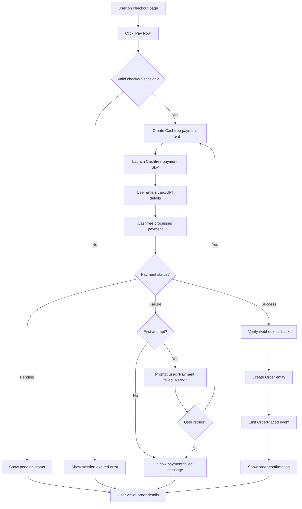

# Feature: Payment Processing

> **Purpose:**
> This document defines a single feature's intent, scope, user experience, and completion criteria.
> It is the **single source of truth** for planning, review, automation, and execution.

---

## 0. Metadata

All metadata is defined in the frontmatter above (between the `---` markers).

**Important:** The frontmatter is used by automation scripts to:

- Create GitHub issues
- Link features to parent epics
- Generate feature flags
- Track status and ownership

---

## 1. Overview

**The Payment Processing feature enables secure payment collection via Cashfree gateway with automatic retry logic and order creation on success.**

- Integrates Cashfree SDK for PCI-compliant payment processing (no card data touches our servers)
- Initiates payment from checkout session with amount, address, and email pre-populated
- Implements automatic retry logic (1 retry attempt on initial failure)
- Creates Order entity on successful payment confirmation
- Handles payment success/failure states with clear user feedback and navigation
- Emits domain events for downstream systems (order management, notifications)

This feature introduces meaningful change by providing a secure, resilient payment experience that converts checkout sessions into confirmed orders while protecting sensitive financial data.

## Flow Diagram



Caption: "Payment flow from checkout to order creation with automatic retry and event emission."

---

## 2. User Problem

**Users need a trustworthy, frictionless payment experience that handles failures gracefully and confirms order placement immediately.**

### Who experiences the problem

- **First-time buyers** who are cautious about entering payment details on unfamiliar sites
- **Mobile shoppers** experiencing intermittent network issues during payment processing
- **UPI users** who may face temporary bank server downtime
- **All customers** who need immediate confirmation that their payment succeeded and order is placed

### When and in what situations it occurs

- Users complete checkout but hesitate at payment due to trust concerns about data security
- Payment fails due to network issues, insufficient funds, or bank server errors (common in India)
- Users don't know if payment succeeded (no clear confirmation or order number)
- Failed payments require manual re-entry of card details (high friction)
- Users are unsure if they've been charged after a failed attempt (leading to duplicate orders or support tickets)

### Current friction

Without robust payment processing:
- Users must manually retry failed payments by re-entering all card/UPI details (high abandonment)
- No visibility into payment status during processing (users close browser prematurely)
- Payment failures don't create audit trails, making support resolution difficult
- No automatic order creation means payments succeed but orders aren't recorded (fulfillment failure)
- Users receive no immediate confirmation of order placement (uncertainty and anxiety)

### Why existing behavior is insufficient

Manual payment retry creates friction that drives checkout abandonment. Lack of payment status visibility causes user anxiety and premature page exits. Missing order creation automation leads to fulfillment gaps where payments succeed but orders aren't recorded.

---

## 3. Goals

### User Experience Goals

- **Secure payment confidence**: Users trust that card data is handled by PCI-compliant systems (Cashfree)
- **Automatic retry convenience**: Failed payments offer instant retry without re-entering card details
- **Clear status visibility**: Users see real-time payment processing status (processing, success, failure)
- **Immediate order confirmation**: Successful payments show order number and details instantly
- **Mobile-optimized payment**: Cashfree SDK works seamlessly on mobile browsers and UPI apps

### Business / System Goals

- Maximize payment conversion by reducing retry friction
- Minimize payment-to-order creation gaps (every successful payment creates an order)
- Create auditable payment trail for reconciliation and dispute resolution
- Enable downstream order fulfillment via OrderPlaced domain events
- Comply with PCI DSS by never storing or handling raw card data

---

## 4. Non-Goals

**Explicitly state what this feature does not attempt to solve.**

- **Multiple payment methods in one order**: Users cannot split payment across multiple cards/methods (single payment only)
- **Payment plan/installments**: No EMI or buy-now-pay-later options (deferred per PRD)
- **Refund processing**: Payment refunds are handled separately in F-010 (Order Management cancellation)
- **Saved payment methods**: No card-on-file or tokenization (users enter payment details each time)
- **International payments**: Only INR payments via Cashfree (no multi-currency)
- **Manual payment verification**: All payments are processed via Cashfree; no offline/manual payment options
- **Payment status polling**: System relies on Cashfree webhooks; no fallback polling implemented

---

## 5. Functional Scope

**Describe what the feature enables at a conceptual level.**

### Core capabilities

- **Payment initiation**: Users click "Pay Now" to launch Cashfree payment SDK with pre-filled amount and order details
- **Cashfree SDK integration**: System creates Cashfree payment intent (session) and launches hosted payment interface
- **Payment method support**: Users can pay via Credit/Debit Card, UPI, Net Banking, Wallets (all Cashfree-supported methods)
- **Automatic retry**: If first payment attempt fails, users are prompted to retry with one additional attempt (total 2 attempts)
- **Payment verification**: System verifies Cashfree webhook callback to confirm payment status
- **Order creation**: On successful payment verification, system creates Order entity with order number
- **Domain event emission**: System emits `PaymentCompleted` and `OrderPlaced` events for notifications and fulfillment
- **Payment failure handling**: Failed payments show clear error messages with option to retry or return to checkout
- **Payment status display**: Users see real-time feedback (processing, success, failure) during payment flow

### Expected behaviors

- Payment amount matches checkout session cart total (no tampering allowed)
- Payment session expires after 15 minutes of inactivity
- Maximum 2 payment attempts per checkout session (1 initial + 1 retry)
- Order number is generated immediately on payment success (format: `ORD-{timestamp}-{random}`)
- Payment failure reasons are displayed in user-friendly language (e.g., "Insufficient funds" instead of error codes)
- Successful payments redirect to order confirmation page with order number
- Failed payments return to checkout page with cart intact

### System responsibilities

- Create Cashfree payment intent with checkout session data
- Validate webhook signature to prevent fraud
- Create Order entity atomically with payment confirmation (no orphaned payments)
- Emit domain events for downstream processing (notifications, fulfillment)
- Store payment records for audit trail (paymentId, amount, status, timestamp)
- Handle Cashfree API errors gracefully (timeout, server errors)
- Provide GraphQL API for payment initiation and status queries

---

## 6. Dependencies & Assumptions

**List conditions required for this feature to function as intended.**

### Dependencies on other features

- **F-008 (Checkout & Address Management)**: Payment requires valid checkout session with address and cart data
- **F-006 (Shopping Cart)**: Payment amount derived from cart total
- **F-001 (Platform Foundation)**: Requires Firestore, Cloud Functions, GraphQL Mesh gateway

### Assumptions about user behavior

- Users are familiar with Cashfree payment interface (common in India ecommerce)
- Most payment failures are recoverable with immediate retry (network issues, temporary bank errors)
- Users expect immediate order confirmation after payment success
- Users understand that payment details are entered via third-party gateway (Cashfree), not our site

### Technical constraints

- Cashfree webhooks must reach Cloud Functions (requires public endpoint)
- Payment verification relies on webhook callback (no polling fallback)
- Order creation must be idempotent (handle duplicate webhook callbacks)
- Payment records stored in Firestore `payments` collection with paymentId as primary key

### External constraints

- Cashfree API rate limits: 100 requests/second (sufficient for MVP scale)
- Cashfree webhook delivery SLA: <30 seconds (typical)
- PCI DSS compliance: No card data stored or logged in our systems
- Cashfree fees: ~2% per transaction (built into pricing model)

---

## 7. User Stories & Experience Scenarios

> This section defines **how users live with the feature**.
> Scenarios must focus on **quality of life and lifecycle experience**, not just technical failures.

---

### User Story 1 — Successful Payment and Order Creation

**As a** customer ready to purchase  
**I want** to pay securely and receive immediate order confirmation  
**So that** I have confidence my purchase is recorded and will be fulfilled

---

#### Scenarios

##### Scenario 1.1 — First-Time Payment Success

**Given** a user has completed checkout with a valid checkout session  
**And** the cart total is ₹1500  
**When** the user clicks "Pay Now" on the checkout page  
**Then** the Cashfree payment SDK launches in a modal/overlay  
**And** the payment amount shows ₹1500 (pre-filled)  
**When** the user enters card details and completes payment  
**And** Cashfree confirms payment success  
**Then** the system receives the webhook callback  
**And** creates an Order entity with order number (e.g., ORD-20260124-A3B2)  
**And** emits `PaymentCompleted` and `OrderPlaced` domain events  
**And** the user is redirected to the order confirmation page  
**And** the page displays: "Order placed successfully! Order #ORD-20260124-A3B2"  
**And** the user receives an order confirmation email within 1 minute

---

##### Scenario 1.2 — UPI Payment Success on Mobile

**Given** a mobile user (Android/iOS) on the checkout page  
**When** the user selects UPI as payment method in Cashfree SDK  
**And** enters UPI ID or selects Google Pay/PhonePe  
**Then** the user is redirected to the UPI app  
**When** the user authorizes payment in the UPI app  
**And** returns to the browser  
**Then** the payment status is automatically updated (via Cashfree webhook)  
**And** the order confirmation page appears with order details  
**And** the cart is cleared (items no longer reserved)

---

##### Scenario 1.3 — Payment Pending Status

**Given** a user completes a Net Banking payment  
**And** the bank shows "payment processing" status  
**When** Cashfree sends a "pending" webhook callback  
**Then** the user sees a "Payment pending" message with spinner  
**And** the message reads: "Your payment is being processed. This may take a few minutes."  
**When** Cashfree sends the final "success" webhook after 2 minutes  
**Then** the order is created  
**And** the user is automatically redirected to the order confirmation page (if still on pending page)  
**Or** the user can navigate to "My Orders" to see the confirmed order

---

##### Scenario 1.4 — Order Confirmation Page Experience

**Given** a user has successfully completed payment  
**When** the order confirmation page loads  
**Then** the page displays:  
  - Order number (large, prominent)  
  - Order total (₹1500)  
  - Shipping address (from checkout session)  
  - Estimated delivery date (calculated from Shiprocket integration, or default 5-7 days)  
  - "Track your order" button (links to order tracking page)  
  - "Continue shopping" button (returns to product catalog)  
**And** the page is mobile-optimized (readable on 320px viewport)

---

##### Scenario 1.5 — Duplicate Webhook Handling

**Given** Cashfree sends duplicate "payment success" webhooks (network retry)  
**When** the system receives the second webhook for the same paymentId  
**Then** the system detects the duplicate (paymentId already exists in Firestore)  
**And** does not create a duplicate order  
**And** responds with HTTP 200 to acknowledge webhook (prevent Cashfree retries)  
**And** logs the duplicate webhook for audit purposes

---

##### Scenario 1.6 — Payment Success with High Load

**Given** 50 users complete payments simultaneously (peak traffic)  
**When** Cashfree sends 50 webhook callbacks concurrently  
**Then** all 50 orders are created without failure  
**And** each webhook is processed within 2 seconds  
**And** no payment-to-order creation gaps occur  
**And** users see order confirmation pages without delay

---

### User Story 2 — Payment Failure and Automatic Retry

**As a** customer whose payment fails due to network issues or insufficient funds  
**I want** to retry payment immediately without re-entering details  
**So that** I can complete my purchase without frustration

---

#### Scenarios

##### Scenario 2.1 — First Payment Attempt Fails

**Given** a user attempts to pay ₹1200 via credit card  
**And** the payment fails due to "insufficient funds"  
**When** Cashfree sends a "failure" webhook with reason "insufficient_funds"  
**Then** the user sees an error message: "Payment failed: Insufficient funds. Please try a different payment method."  
**And** a "Retry Payment" button appears  
**And** a "Change Payment Method" button appears  
**When** the user clicks "Retry Payment"  
**Then** the Cashfree SDK launches again (retry attempt #1)  
**And** the user can select a different card or UPI without re-entering checkout details

---

##### Scenario 2.2 — Retry Succeeds After First Failure

**Given** a user's first payment attempt failed  
**And** the user clicks "Retry Payment"  
**When** the user completes payment with a different card  
**And** Cashfree confirms success  
**Then** an order is created (first failure is logged but ignored)  
**And** the user is redirected to order confirmation page  
**And** both payment attempts are stored in Firestore `payments` collection (audit trail)

---

##### Scenario 2.3 — Both Payment Attempts Fail

**Given** a user's first payment attempt failed  
**And** the retry attempt also fails (e.g., card declined twice)  
**When** Cashfree sends the second "failure" webhook  
**Then** the user sees: "Payment failed. Please check your payment details or try a different method."  
**And** the "Retry Payment" button is disabled/hidden (maximum 2 attempts reached)  
**And** a "Return to Checkout" button is visible  
**When** the user clicks "Return to Checkout"  
**Then** the user is navigated to the checkout page with cart intact  
**And** the checkout session is still valid (user can try again with new session if desired)

---

##### Scenario 2.4 — Network Timeout During Payment

**Given** a user initiates payment on a slow mobile network  
**And** the Cashfree SDK times out after 30 seconds without response  
**When** the timeout occurs  
**Then** the user sees: "Payment status unclear. Please wait a moment while we confirm with your bank."  
**And** the system waits for Cashfree webhook (up to 2 minutes)  
**If** webhook confirms success → create order and show confirmation  
**If** webhook confirms failure → show failure message with retry option  
**If** no webhook after 2 minutes → show: "Payment status pending. Check your email for confirmation or contact support."

---

##### Scenario 2.5 — User-Friendly Error Messages

**Given** a payment fails with various Cashfree error codes  
**When** the system maps error codes to user-friendly messages  
**Then** the user sees:  
  - `insufficient_funds` → "Insufficient funds. Please use a different payment method."  
  - `card_declined` → "Your card was declined. Please try a different card."  
  - `authentication_failed` → "Payment authentication failed. Please verify your OTP or try again."  
  - `network_error` → "Network error. Please check your connection and retry."  
  - `bank_server_error` → "Bank server is temporarily unavailable. Please retry in a few minutes."  
**And** no raw error codes or technical jargon is displayed

---

##### Scenario 2.6 — Retry Preserves Cart Context

**Given** a user's payment fails  
**And** 10 minutes pass while the user attempts to resolve payment issues  
**When** the user clicks "Retry Payment"  
**Then** the cart items are still reserved (30-minute reservation)  
**And** the checkout session is still valid (30-minute expiry)  
**And** the payment amount is recalculated (in case prices changed, though unlikely)  
**And** if the checkout session expired, the user sees: "Session expired. Please return to cart and checkout again."

---

### User Story 3 — Payment Audit and Domain Events

**As a** backend system component  
**I want** to record all payment attempts and emit events on success  
**So that** the system can reconcile payments, trigger notifications, and initiate fulfillment

---

#### Scenarios

##### Scenario 3.1 — Payment Record Created

**Given** a user initiates payment  
**When** Cashfree creates a payment intent  
**Then** a Payment entity is created in Firestore with:  
  - paymentId (Cashfree payment session ID)  
  - checkoutSessionId  
  - amount (₹1500)  
  - status (pending)  
  - createdAt (timestamp)  
  - userId (or guestEmail for guest orders)  
**When** Cashfree sends a webhook (success or failure)  
**Then** the Payment entity is updated:  
  - status (success/failure)  
  - completedAt (timestamp)  
  - failureReason (if failed)  
**And** all payment attempts are retained for audit purposes

---

##### Scenario 3.2 — PaymentCompleted Event Emitted

**Given** a payment succeeds  
**When** the webhook is verified and order is created  
**Then** a `PaymentCompleted` event is emitted with payload:  
  - orderId  
  - paymentId  
  - amount  
  - userId (or guestEmail)  
  - completedAt  
**And** the event is published to Firestore `events` collection  
**And** downstream listeners (e.g., analytics, notifications) can subscribe to the event

---

##### Scenario 3.3 — OrderPlaced Event Emitted

**Given** a payment succeeds and order is created  
**When** the Order entity is persisted to Firestore  
**Then** an `OrderPlaced` event is emitted with payload:  
  - orderId  
  - userId (or guestEmail)  
  - items (product IDs and quantities)  
  - total  
  - shippingAddress  
  - placedAt  
**And** the event triggers:  
  - Order confirmation email (via F-012 notifications)  
  - Shipment creation (via F-011 fulfillment)

---

##### Scenario 3.4 — Payment Failure Does Not Emit OrderPlaced

**Given** a payment fails (both attempts)  
**When** the failure is recorded  
**Then** no `OrderPlaced` event is emitted  
**And** no order is created  
**And** cart items remain reserved (until cart expiry)  
**And** the user can retry by re-initiating checkout

---

##### Scenario 3.5 — Payment Reconciliation Report

**Given** an admin needs to reconcile daily payments  
**When** querying Firestore `payments` collection  
**Then** all payment attempts are retrievable with:  
  - paymentId, checkoutSessionId, orderId (if successful)  
  - amount, status, createdAt, completedAt  
  - failureReason (if failed)  
**And** total successful payment amount matches total order value  
**And** failed payments can be correlated with support tickets

---

##### Scenario 3.6 — Webhook Signature Verification

**Given** Cashfree sends a webhook callback  
**When** the Cloud Function receives the webhook  
**Then** the function verifies the Cashfree signature (HMAC-SHA256)  
**If** signature is valid → process webhook (create/update order)  
**If** signature is invalid → reject webhook (HTTP 401) and log security alert  
**And** no order is created from invalid webhooks (fraud prevention)

---

## 8. Edge Cases & Constraints (Experience-Relevant)

**Include only cases that materially affect user experience.**

### Hard limits users may encounter

- **Maximum 2 payment attempts per checkout session**: After 2 failures, user must return to checkout and create new session
- **15-minute payment session expiry**: User must complete payment within 15 minutes of clicking "Pay Now" (Cashfree limit)
- **Minimum payment amount ₹10**: Orders below ₹10 cannot be processed (Cashfree constraint, unlikely for beauty products)

### Irreversible actions or consequences

- **Payment completion is final**: Once payment succeeds, order is created immediately (cancellation requires separate flow in F-010)
- **Failed payment attempts are logged permanently**: All payment attempts are retained for audit (cannot be deleted)

### Compliance, safety, or policy constraints

- **PCI DSS compliance**: Card data never touches our servers (handled entirely by Cashfree SDK)
- **Webhook signature verification mandatory**: All webhooks must have valid HMAC signature (prevents order injection fraud)
- **Payment-to-order atomicity**: Order creation and payment confirmation are atomic (prevents orphaned payments or orders)
- **GDPR/Privacy compliance**: Payment records include user email/address for order fulfillment (included in data export/deletion requests)

---

## 9. Implementation Tasks (Execution Agent Checklist)

```markdown
- [ ] T01 — Implement Payment aggregate in `ordering` bounded context (Scenario 3.1)
  - [ ] Create Payment entity: paymentId, checkoutSessionId, amount, status, userId/guestEmail, createdAt, completedAt, failureReason
  - [ ] Implement payment state transitions: pending → success/failure
  - [ ] Unit Test: Payment entity creation and state management

- [ ] T02 — Integrate Cashfree SDK for payment initiation (Scenario 1.1, 1.2)
  - [ ] Install Cashfree Node.js SDK
  - [ ] Implement payment intent creation: Cashfree.createPaymentSession(amount, orderId, customerDetails)
  - [ ] Cloud Function: `initiatePayment(checkoutSessionId)` → returns Cashfree session token
  - [ ] Frontend: Launch Cashfree SDK with session token
  - [ ] Integration Test: Cashfree API payment session creation
  - [ ] E2E Test: User clicks "Pay Now", Cashfree SDK launches

- [ ] T03 — Implement webhook endpoint for Cashfree callbacks (Scenario 1.1, 3.6)
  - [ ] Cloud Function: `handleCashfreeWebhook` (HTTP endpoint)
  - [ ] Webhook signature verification (HMAC-SHA256)
  - [ ] Parse webhook payload: paymentId, status (success/failure/pending), failureReason
  - [ ] Integration Test: Webhook signature validation
  - [ ] E2E Test: Simulate webhook callback and verify order creation

- [ ] T04 — Implement order creation on payment success (Scenario 1.1, 1.5)
  - [ ] Create Order entity on payment success (atomically with payment update)
  - [ ] Generate order number: `ORD-{timestamp}-{random}`
  - [ ] Store order in Firestore `orders` collection
  - [ ] Implement idempotent order creation (handle duplicate webhooks)
  - [ ] Unit Test: Order creation logic and duplicate prevention
  - [ ] Integration Test: Webhook triggers order creation exactly once

- [ ] T05 — Emit domain events for payment and order (Scenario 3.2, 3.3)
  - [ ] Event: `PaymentCompleted` with paymentId, orderId, amount, userId, completedAt
  - [ ] Event: `OrderPlaced` with orderId, userId, items, total, shippingAddress, placedAt
  - [ ] Publish events to Firestore `events` collection
  - [ ] Integration Test: Verify events emitted on payment success

- [ ] T06 — Implement automatic retry logic (Scenario 2.1, 2.2, 2.3)
  - [ ] Track payment attempt count in Payment entity (max 2)
  - [ ] On first failure: show "Retry Payment" button
  - [ ] On second failure: disable retry, show "Return to Checkout"
  - [ ] Frontend: Handle retry button click → re-initiate payment
  - [ ] Unit Test: Retry attempt counter logic
  - [ ] E2E Test: Fail first payment, retry, verify second attempt

- [ ] T07 — Implement user-friendly error messages (Scenario 2.5)
  - [ ] Map Cashfree error codes to human-readable messages
  - [ ] Error mapping: insufficient_funds, card_declined, authentication_failed, network_error, bank_server_error
  - [ ] Frontend: Display mapped error messages
  - [ ] Unit Test: Error message mapping logic
  - [ ] E2E Test: Simulate various payment failures, verify messages

- [ ] T08 — Implement payment status handling (Scenario 1.3, 2.4)
  - [ ] Handle "pending" status: show spinner and wait for final webhook
  - [ ] Handle "success" status: create order and redirect to confirmation
  - [ ] Handle "failure" status: show error and retry option
  - [ ] Handle timeout: show "status unclear" message and wait for webhook
  - [ ] Integration Test: Pending payment status update to success
  - [ ] E2E Test: Verify pending status UI and auto-redirect on success

- [ ] T09 — Create order confirmation page component (Scenario 1.4)
  - [ ] Component: `<order-confirmation-page>` with order number, total, address, delivery estimate
  - [ ] Display "Track your order" and "Continue shopping" buttons
  - [ ] Mobile-optimized layout (320px viewport)
  - [ ] E2E Test: Payment success redirects to confirmation page with correct order data

- [ ] T10 — Implement GraphQL mutations for payment (Scenario 1.1)
  - [ ] Mutation: `initiatePayment(checkoutSessionId: ID!): PaymentSession` (returns Cashfree session token)
  - [ ] Authentication gate: verify JWT token (or guest email for guest checkout)
  - [ ] Validate checkout session exists and not expired
  - [ ] Integration Test: GraphQL mutation authentication and validation
  - [ ] E2E Test: Call initiatePayment mutation and verify Cashfree session returned

- [ ] T11 — Implement GraphQL queries for payment status (Scenario 1.3)
  - [ ] Query: `payment(paymentId: ID!): Payment` (returns payment status)
  - [ ] Integration Test: Query payment status after webhook update
  - [ ] E2E Test: Poll payment status and verify status changes

- [ ] T12 — Handle checkout session expiry during payment (Scenario 2.6)
  - [ ] Validate checkout session not expired before initiating payment
  - [ ] If expired: show error and redirect to cart
  - [ ] Integration Test: Reject payment initiation for expired session
  - [ ] E2E Test: Wait 30+ minutes (simulated), attempt payment, verify rejection

- [ ] T13 — Implement cart clearing on order creation (Scenario 1.2)
  - [ ] On order creation: clear cart items and release inventory reservations
  - [ ] Integration Test: Verify cart cleared after successful payment
  - [ ] E2E Test: Complete payment, navigate to cart, verify empty

- [ ] T14 — Implement payment audit trail (Scenario 3.1, 3.5)
  - [ ] Store all payment attempts in Firestore `payments` collection
  - [ ] Include: paymentId, amount, status, attempts, timestamps, failureReasons
  - [ ] Enable querying for reconciliation reports
  - [ ] Integration Test: Verify all payment attempts are persisted

- [ ] T15 — Optimize webhook processing performance (Scenario 1.6)
  - [ ] Implement async webhook processing (return HTTP 200 immediately, process in background)
  - [ ] Add webhook processing timeout (max 10 seconds per webhook)
  - [ ] Performance Test: Process 50 concurrent webhooks <2 seconds each

- [ ] T16 — [Rollout] Implement feature flag gating for payment (All scenarios)
  - [ ] Feature flag: `feature_fe_009_fl_001_payment_enabled`
  - [ ] Gate "Pay Now" button visibility based on flag
  - [ ] Gate GraphQL payment mutations based on flag
  - [ ] Integration Test: Verify flag state controls feature access
  - [ ] E2E Test: Toggle flag and verify payment feature enable/disable
```

---

## 10. Acceptance Criteria (Verifiable Outcomes)

```markdown
- [ ] AC1 — Users can initiate payment via Cashfree SDK (Scenario 1.1, 1.2)
  - [ ] Integration test passed: Cashfree payment session created successfully
  - [ ] E2E test passed: User clicks "Pay Now", Cashfree SDK launches with correct amount

- [ ] AC2 — Successful payments create orders (Scenario 1.1, 1.2)
  - [ ] Integration test passed: Webhook callback creates Order entity atomically
  - [ ] E2E test passed: Complete payment, verify order confirmation page displays

- [ ] AC3 — Payment failures trigger automatic retry (Scenario 2.1, 2.2)
  - [ ] Unit test passed: Retry logic allows max 2 attempts
  - [ ] E2E test passed: First payment fails, retry button appears, retry succeeds

- [ ] AC4 — User-friendly error messages displayed (Scenario 2.5)
  - [ ] Unit test passed: Error codes mapped to readable messages
  - [ ] E2E test passed: Payment fails, user sees friendly error (no error codes)

- [ ] AC5 — Duplicate webhooks handled idempotently (Scenario 1.5)
  - [ ] Integration test passed: Duplicate paymentId does not create duplicate order
  - [ ] E2E test passed: Simulate duplicate webhook, verify single order created

- [ ] AC6 — Domain events emitted on payment success (Scenario 3.2, 3.3)
  - [ ] Integration test passed: PaymentCompleted and OrderPlaced events published
  - [ ] E2E test passed: Verify events appear in Firestore `events` collection

- [ ] AC7 — Payment pending status handled correctly (Scenario 1.3)
  - [ ] Integration test passed: Pending payment updated to success on final webhook
  - [ ] E2E test passed: Pending UI displays, auto-redirects on success

- [ ] AC8 — Checkout session expiry prevents payment (Scenario 2.6, T12)
  - [ ] Integration test passed: Expired session rejects payment initiation
  - [ ] E2E test passed: Expired session shows error and redirects to cart

- [ ] AC9 — Cart cleared on successful payment (Scenario 1.2, T13)
  - [ ] Integration test passed: Cart items removed after order creation
  - [ ] E2E test passed: Payment succeeds, cart page shows empty state

- [ ] AC10 — Webhook signature verification enforced (Scenario 3.6)
  - [ ] Integration test passed: Invalid signature rejects webhook (HTTP 401)
  - [ ] Security test passed: Forged webhook does not create order

- [ ] AC11 — Payment audit trail complete (Scenario 3.1, 3.5)
  - [ ] Integration test passed: All payment attempts stored in Firestore
  - [ ] E2E test passed: Query payments collection, verify audit data

- [ ] AC12 — [Gating] Feature flag correctly controls payment access
  - [ ] Integration test passed: Payment mutations rejected when flag disabled
  - [ ] E2E test passed: "Pay Now" button hidden when flag disabled
```

---

## 11. Rollout & Risk (If Applicable)

### Rollout Strategy

- **Phase 1 (0% → 10%)**: Enable for internal team with Cashfree test mode (1 week)
- **Phase 2 (10% → 25%)**: Switch to Cashfree production mode, enable for 25% users (monitor payment success rate)
- **Phase 3 (25% → 50%)**: Expand to 50% (monitor webhook latency and duplicate handling)
- **Phase 4 (50% → 100%)**: Full rollout after 1 week stable at 50%

### Risk Mitigation

- **Payment failure rate**: Monitor percentage of failed payments; target <10% (industry baseline)
- **Webhook delivery failures**: Implement webhook retry logic if Cashfree delivery SLA degrades
- **Duplicate order creation**: Strict idempotency checks prevent duplicate orders from duplicate webhooks
- **Cashfree API downtime**: Display "Payment system temporarily unavailable" if Cashfree API errors exceed 5% of requests

### Exit Criteria

- No critical bugs for 7 days at 100% rollout
- Payment success rate >90%
- Webhook processing latency <2 seconds (p95)
- Zero duplicate orders created

### Remote Config Flags

<!-- REMOTE_CONFIG_FLAG_START -->
| Context | Type | Namespace | Default (Dev) | Default (Stg) | Default (Prod) | Key |
|---------|------|-----------|---------------|---------------|----------------|-----|
| payment_feature | BOOLEAN | client | true | false | false | feature_fe_009_fl_001_payment_enabled |
| payment_backend | BOOLEAN | server | true | false | false | feature_be_009_fl_001_payment_mutations_enabled |
| payment_max_retries | NUMBER | server | 1 | 1 | 1 | feature_be_009_fl_002_payment_max_retries |
| cashfree_test_mode | BOOLEAN | server | true | true | false | feature_be_009_fl_003_cashfree_test_mode |
<!-- REMOTE_CONFIG_FLAG_END -->

---

## 12. History & Status

- **Status:** Draft
- **Related Epics:** `Checkout & Payment`
- **Related Issues:** `<created post-merge>`
- **Dependencies:** F-008 (Checkout & Address Management), F-006 (Shopping Cart)

---

## Final Note

> This document defines **intent and experience**.
> Execution details are derived from it — never the other way around.
