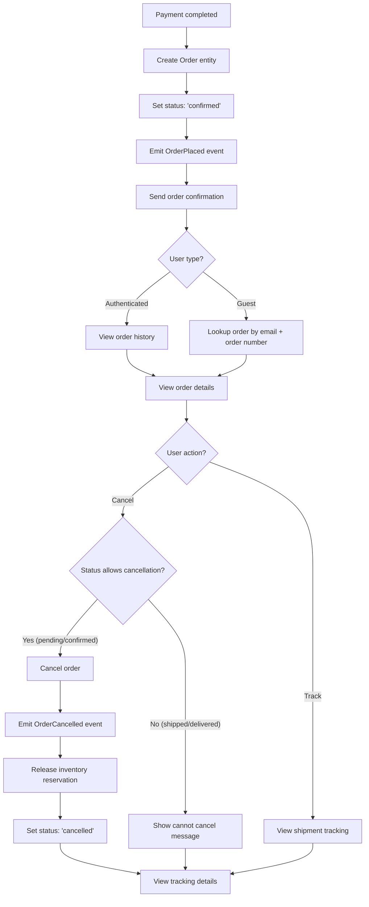

# Feature: Order Management

> **Purpose:**
> This document defines a single feature's intent, scope, user experience, and completion criteria.
> It is the **single source of truth** for planning, review, automation, and execution.

---

## 0. Metadata

All metadata is defined in the frontmatter above (between the `---` markers).

**Important:** The frontmatter is used by automation scripts to:

- Create GitHub issues
- Link features to parent epics
- Generate feature flags
- Track status and ownership

---

## 1. Overview

**The Order Management feature enables order creation from successful payments, order history viewing, and user-initiated cancellation before shipment.**

- Creates Order aggregate on payment completion with unique OrderId and status tracking
- Displays order history for authenticated users with full order details
- Enables guest order lookup via email and order number for non-authenticated users
- Allows user-initiated cancellation before shipment (pending or confirmed status only)
- Provides GraphQL mutations and queries for order operations
- Emits domain events for downstream systems (fulfillment, notifications)

This feature introduces meaningful change by giving users transparency and control over their purchases from confirmation through pre-shipment stages.

## Flow Diagram



Caption: "Order lifecycle from creation through cancellation with status-based gating."

---

## 2. User Problem

**Users need visibility into their purchase history and the ability to cancel orders before they ship if plans change.**

### Who experiences the problem

- **First-time buyers** who want immediate confirmation that their order was received after payment
- **Returning customers** who need to reference past purchases for reordering or support inquiries
- **Guest shoppers** who don't have accounts but need to track order status and details
- **All users** who change their mind shortly after purchase and want to cancel before shipment

### When and in what situations it occurs

- Users complete payment but don't receive clear confirmation of what was ordered (item details, price, delivery address)
- Customers want to check order status days later but don't remember if they created an account
- Users need to find a previous order for warranty, returns, or reordering purposes
- Shoppers realize they ordered the wrong product or quantity immediately after checkout and want to cancel before it ships
- Users accidentally place duplicate orders due to payment retries and need to cancel one

### Current friction

Without order management:
- Users have no post-purchase visibility into what they ordered or when it will arrive
- Guest shoppers can't access order details without creating an account retroactively
- There's no self-service cancellation, requiring users to contact customer support (high friction)
- Users don't know if cancellation is even possible once payment is complete
- No historical record makes it difficult to track spending or reorder favorite products

### Why existing behavior is insufficient

- Email confirmation alone is easily lost or buried in inboxes
- Lack of cancellation options erodes trust and increases support burden
- Without order history, users are forced to search through email archives or contact support for basic information
- Guest users are treated as second-class citizens with no order access post-purchase

---

## 3. Goals

### User Experience Goals

- **Immediate post-purchase clarity**: Users receive clear confirmation of what was ordered, where it's going, and when to expect it
- **Self-service order tracking**: Both authenticated and guest users can independently access full order details
- **Cancellation autonomy**: Users can cancel orders themselves before shipment without contacting support
- **Historical context**: Authenticated users build a purchase history for easy reordering and reference

### Business / System Goals

- **Reduce support burden**: Self-service order lookup and cancellation minimize customer service inquiries
- **Increase trust**: Transparent order management and cancellation rights improve customer confidence
- **Inventory accuracy**: Prompt cancellation releases inventory back to available stock
- **Event-driven integration**: Domain events enable decoupled fulfillment and notification workflows

---

## 4. Non-Goals

**Explicitly state what this feature does not attempt to solve.**

- **Post-shipment cancellation or returns**: Users cannot cancel orders once shipped; return flow is out of scope
- **Order modification (change items/address)**: Users cannot edit order contents or shipping address after placement; cancellation and re-ordering required
- **Split shipments initiated by user**: System-driven partial shipments are supported (F-011), but users cannot request item-level shipping splits
- **Order history for guest users**: Guests can lookup individual orders but do not accumulate persistent order history without creating an account
- **Refund processing**: Cancellation triggers refund eligibility, but actual refund flow is deferred to future work
- **Detailed order status timeline**: Order history shows current status, not granular status change history with timestamps

---

## 5. Functional Scope

**Describe what the feature enables at a conceptual level.**

### Core Capabilities

- **Order Creation**: Automatically create Order entity when payment is successfully completed
- **Order Status Management**: Track order lifecycle through states: pending, confirmed, shipped, delivered, cancelled
- **Order Lookup**: Authenticated users can view all their orders; guest users can lookup individual orders via email + order number
- **Pre-Shipment Cancellation**: Users can cancel orders with status 'pending' or 'confirmed' (before 'shipped' status)
- **Order History Display**: Show order details including products (current catalog data), total price, shipping address, order date, and status
- **Domain Event Emission**: Publish OrderPlaced and OrderCancelled events for fulfillment and notification systems

### Expected Behaviors

- Orders are immutable after creation (no updates to items or address)
- Product details displayed in order history reflect current catalog data (not snapshotted at order time)
- Cancellation releases inventory reservation immediately
- Guest order lookup requires exact match of email and order number (case-insensitive email)
- Order numbers are unique, sequential, and human-readable (e.g., "ORD-2026-00001")

### System Responsibilities

- Validate order status before allowing cancellation
- Ensure order creation is atomic with payment confirmation
- Maintain referential integrity between orders and products
- Emit events reliably for downstream consumption
- Provide secure access control (users can only view/cancel their own orders)

---

## 6. Dependencies & Assumptions

**List conditions required for this feature to function as intended.**

### Dependencies

- **F-009 (Payment Processing)**: Order creation is triggered by successful payment completion; Payment aggregate must exist
- **F-004 (Product Catalog Management)**: Order history displays product details from current catalog via product IDs
- **F-003 (User Authentication)**: Authenticated users link orders to User aggregate; guest orders stored with email only

### Assumptions

- **Payment is final confirmation**: Orders are created only after payment succeeds (no manual order creation)
- **Single shipment default**: Each order is fulfilled as a single shipment unless inventory requires partial fulfillment (handled by F-011)
- **Email as guest identifier**: Guest users can access orders using email as the primary lookup key
- **Cancellation window exists**: Orders remain in 'pending' or 'confirmed' status for a meaningful duration before automatic shipment creation
- **Inventory is already reserved**: Cart reservation (F-006) transitions to order reservation on payment; cancellation releases this reservation

### External Constraints

- **Firestore consistency**: Order reads must reflect immediately after creation (strong consistency required)
- **Event delivery**: OrderPlaced and OrderCancelled events must be delivered at-least-once to fulfillment system
- **Regulatory compliance**: Order data retention must comply with Indian e-commerce regulations (minimum 3 years)

---

## 7. User Stories & Experience Scenarios

> This section defines **how users live with the feature**.
> Scenarios must focus on **quality of life and lifecycle experience**, not just technical failures.

---

### User Story 1 — First-Time Buyer Confirming Order After Payment

**As a** first-time buyer who just completed payment  
**I want** to immediately see confirmation of my order with full details  
**So that** I have confidence my purchase was successful and know what to expect next

---

#### Scenarios

##### Scenario 1.1 — First-Time Order Confirmation

**Given** a first-time user who has just completed payment successfully  
**When** the payment confirmation page loads  
**Then** the system displays order confirmation with order number (e.g., "ORD-2026-00001")  
**And** the page shows all ordered products with images, names, quantities, and prices  
**And** the total amount paid is displayed clearly  
**And** the shipping address is shown for verification  
**And** estimated delivery timeframe is communicated (e.g., "Delivery in 5-7 business days")  
**And** next steps are clearly stated (e.g., "You'll receive a tracking link via email once shipped")

---

##### Scenario 1.2 — Returning to View Order Details

**Given** a user who placed an order earlier and wants to check its status  
**When** they navigate to "My Orders" page (authenticated) or use guest order lookup  
**Then** they can find their order in the list (authenticated) or via email + order number (guest)  
**And** clicking on the order displays full details matching the confirmation page  
**And** the current order status is prominently displayed (e.g., "Confirmed - Awaiting Shipment")  
**And** the order date and time are shown

---

##### Scenario 1.3 — Interrupted Post-Purchase Flow

**Given** a user completed payment but closed the browser immediately after  
**When** they return hours later and want to verify the order was placed  
**Then** they receive an email confirmation with order number and order details link  
**And** clicking the link (authenticated user) takes them directly to the order details page  
**And** guest users can use the order number and email from the confirmation email to look up the order  
**And** all order details are preserved and accessible

---

##### Scenario 1.4 — Unexpected Order Lookup Failure

**Given** a guest user attempting to look up their order  
**When** they enter an incorrect order number or email address  
**Then** the system displays a clear, empathetic error message: "We couldn't find an order matching this email and order number. Please check for typos and try again."  
**And** the form fields are preserved with the entered values  
**And** a help link is provided: "Still having trouble? Contact support with your payment confirmation email."  
**And** the user can retry without losing context

---

##### Scenario 1.5 — High-Volume Order History Performance

**Given** a returning customer with 50+ orders in their history  
**When** they load the "My Orders" page  
**Then** the page displays orders with lazy loading or pagination (20 orders per page)  
**And** the initial page load completes within 2 seconds  
**And** filters (date range, status) are available to narrow results  
**And** scrolling or pagination to load more orders is smooth and responsive

---

##### Scenario 1.6 — Localization of Order Details (India-Specific)

**Given** a user in India viewing their order details  
**When** they access the order page  
**Then** the currency is displayed as INR with the ₹ symbol  
**And** the date format follows DD/MM/YYYY (Indian standard)  
**And** the shipping address shows state and PIN code in expected Indian format  
**And** estimated delivery timeframe accounts for Indian logistics norms

---

### User Story 2 — User Cancelling Order Before Shipment

**As a** user who placed an order but changed my mind  
**I want** to cancel the order myself before it ships  
**So that** I avoid unwanted delivery and can repurpose my budget without contacting support

---

#### Scenarios

##### Scenario 2.1 — First-Time Cancellation Attempt

**Given** a user viewing their order details with status "Confirmed - Awaiting Shipment"  
**When** they click the "Cancel Order" button  
**Then** a confirmation dialog appears: "Are you sure you want to cancel this order? This action cannot be undone."  
**And** the dialog clearly states that refunds will be processed within 5-7 business days  
**And** cancel/confirm buttons are clearly labeled

---

##### Scenario 2.2 — Repeated Cancellation Check

**Given** a user who previously cancelled an order successfully  
**When** they return to view the cancelled order details  
**Then** the order status displays "Cancelled" prominently  
**And** the cancellation date is shown  
**And** the "Cancel Order" button is no longer available  
**And** a message states: "This order was cancelled on [date]. Refund processed within 5-7 business days."

---

##### Scenario 2.3 — Interrupted Cancellation Flow

**Given** a user clicked "Cancel Order" and saw the confirmation dialog  
**When** they close the dialog or navigate away without confirming  
**Then** the order status remains unchanged (still "Confirmed")  
**And** no cancellation is processed  
**And** the "Cancel Order" button remains available for future attempts

---

##### Scenario 2.4 — Attempting to Cancel After Shipment

**Given** a user viewing their order details with status "Shipped"  
**When** they attempt to cancel the order  
**Then** the "Cancel Order" button is disabled or hidden  
**And** a clear message is displayed: "This order has already been shipped and cannot be cancelled. You can initiate a return once you receive the package."  
**And** a link to the returns policy or support contact is provided

---

##### Scenario 2.5 — Cancellation Under High Concurrency

**Given** an order in "Confirmed" status being viewed by the user  
**And** the fulfillment system is simultaneously processing shipment creation  
**When** the user clicks "Cancel Order" at the exact moment shipment is created  
**Then** the system enforces optimistic locking or status validation  
**And** if the order transitioned to "Shipped" before cancellation committed, the cancellation fails gracefully  
**And** the user sees: "This order has just been shipped and can no longer be cancelled. You should receive tracking details shortly."  
**And** the order details refresh to show "Shipped" status

---

##### Scenario 2.6 — Cancellation Confirmation Language (India-Specific)

**Given** a user in India cancelling an order  
**When** the cancellation confirmation dialog appears  
**Then** the refund timeline is stated in calendar days (not business days) if applicable to Indian banking norms  
**And** the refund method matches the payment method (e.g., "Refund to UPI" or "Refund to card ending 4567")  
**And** language is clear and concise, avoiding legal jargon

---

### User Story 3 — Guest User Looking Up Order Without Account

**As a** guest user who checked out without creating an account  
**I want** to look up my order using my email and order number  
**So that** I can track my purchase without being forced to register

---

#### Scenarios

##### Scenario 3.1 — First-Time Guest Order Lookup

**Given** a guest user who received an order confirmation email  
**When** they navigate to the "Track Order" or "Guest Order Lookup" page  
**Then** they see a simple form with two fields: "Email" and "Order Number"  
**And** placeholder text guides them: "Enter the email used at checkout" and "Enter your order number (e.g., ORD-2026-00001)"  
**And** a "Find Order" button is prominently displayed

---

##### Scenario 3.2 — Returning to Track Familiar Order

**Given** a guest user who has looked up their order before  
**When** they return to the guest order lookup page  
**Then** their browser may autofill the email field (standard browser behavior)  
**And** they only need to enter the order number again  
**And** the lookup process is identical to first-time use (no saved state expected)

---

##### Scenario 3.3 — Interrupted Lookup Session

**Given** a guest user who started looking up an order but navigated away mid-process  
**When** they return to the guest order lookup page  
**Then** the form is reset (no persisted state)  
**And** they can re-enter email and order number without penalty  
**And** the experience is identical to a fresh lookup

---

##### Scenario 3.4 — Invalid Lookup Input

**Given** a guest user entering an email that doesn't match any order with the given order number  
**When** they submit the lookup form  
**Then** the system displays: "We couldn't find an order matching this email and order number. Please double-check both fields and try again."  
**And** the email and order number fields retain the entered values  
**And** a link to support is provided: "Need help? Contact us with your payment confirmation."  
**And** the form remains interactive for immediate retry

---

##### Scenario 3.5 — Lookup Performance with Large Order Database

**Given** a guest user looking up an order in a system with 100,000+ total orders  
**When** they submit a valid email and order number combination  
**Then** the lookup query uses indexed fields (email + orderNumber) for fast retrieval  
**And** the order details page loads within 1.5 seconds  
**And** the user experience is indistinguishable from low-volume scenarios

---

##### Scenario 3.6 — Localization of Guest Lookup (India-Specific)

**Given** a guest user in India accessing the order lookup page  
**When** they view the form  
**Then** instructional text is in clear, simple English (no regional language support in MVP)  
**And** email validation accepts Indian email providers (Gmail, Yahoo, Rediffmail, etc.)  
**And** order number format is explained if non-standard (e.g., "ORD-2026-00001")

---

## 8. Edge Cases & Constraints (Experience-Relevant)

**Include only cases that materially affect user experience.**

### Hard Limits

- **Order history limit (authenticated users)**: Display capped at 100 most recent orders in UI; older orders accessible via search or pagination
- **Guest order lookup expiry**: Guest orders remain lookup-able indefinitely (no expiry) as long as data retention policy allows (minimum 3 years)
- **Cancellation window**: No hard time limit, but cancellation is status-gated (pending/confirmed only); shipment creation timing determines effective window

### Irreversible Actions

- **Order creation**: Once created, order cannot be modified (items, quantities, address); user must cancel and re-order
- **Cancellation**: Once confirmed, cancellation cannot be undone; user must place a new order

### Compliance Constraints

- **Data retention**: Order data must be retained for minimum 3 years per Indian e-commerce regulations
- **Order number format**: Must be unique and traceable for legal and tax reporting purposes
- **Guest order privacy**: Guest users can only access orders via exact email + order number match (no partial lookups to protect privacy)

---

## 9. Implementation Tasks (Execution Agent Checklist)

> This section provides the specific work items for the **Execution Agent**.
> Every task must map back to a specific scenario defined in Section 7.

```markdown
- [ ] T01 — Implement Order aggregate with OrderId, OrderStatus, and creation logic (Scenario 1.1)
  - [ ] Unit Test: Order creation from payment confirmation with valid data
  - [ ] Unit Test: Order ID generation is unique and sequential
  - [ ] E2E Test: Payment success triggers order creation and redirects to confirmation page
- [ ] T02 — Create GraphQL mutation `createOrder` and query `order(id)` (Scenario 1.1, 1.2)
  - [ ] Unit Test: Mutation returns created order with all fields populated
  - [ ] Unit Test: Query retrieves order by ID with authorization check
  - [ ] Integration Test: Authenticated user can query their own orders only
- [ ] T03 — Implement authenticated user order history with pagination (Scenario 1.5)
  - [ ] Unit Test: Query `orders` returns user's orders sorted by date descending
  - [ ] Unit Test: Pagination returns correct page size and cursor
  - [ ] E2E Test: "My Orders" page displays 20 orders per page with lazy load
- [ ] T04 — Implement guest order lookup via email + order number (Scenario 3.1, 3.4)
  - [ ] Unit Test: Query `guestOrder(email, orderNumber)` returns matching order
  - [ ] Unit Test: Case-insensitive email matching
  - [ ] Unit Test: Returns error for non-matching email/order number pair
  - [ ] E2E Test: Guest user can look up order with valid credentials
- [ ] T05 — Implement order cancellation with status validation (Scenario 2.1, 2.4, 2.5)
  - [ ] Unit Test: Mutation `cancelOrder` succeeds for 'pending' and 'confirmed' statuses
  - [ ] Unit Test: Mutation fails with clear error for 'shipped', 'delivered', 'cancelled' statuses
  - [ ] Unit Test: Cancellation emits OrderCancelled event with order ID
  - [ ] Integration Test: Inventory reservation is released on cancellation
  - [ ] E2E Test: User can cancel order from order details page with confirmation dialog
- [ ] T06 — Implement domain events: OrderPlaced, OrderCancelled (Scenario 1.3, 2.2)
  - [ ] Unit Test: OrderPlaced event emitted on order creation with correct payload
  - [ ] Unit Test: OrderCancelled event emitted on cancellation with order ID and timestamp
  - [ ] Integration Test: Events are published to Firestore collection for consumption
- [ ] T07 — Create Firestore schema and indexes for orders collection (Scenario 1.5, 3.5)
  - [ ] Unit Test: Firestore security rules allow users to read only their own orders
  - [ ] Unit Test: Composite index on (email + orderNumber) for guest lookup
  - [ ] Unit Test: Index on (userId + createdAt) for authenticated order history
- [ ] T08 — Build order confirmation UI component (Scenario 1.1)
  - [ ] E2E Test: Confirmation page displays order number, items, total, address, and estimated delivery
- [ ] T09 — Build order history UI component for authenticated users (Scenario 1.2)
  - [ ] E2E Test: "My Orders" page lists orders with status, date, and total
  - [ ] E2E Test: Clicking an order navigates to order details page
- [ ] T10 — Build guest order lookup UI component (Scenario 3.1)
  - [ ] E2E Test: Guest lookup form validates email format and order number format
  - [ ] E2E Test: Successful lookup displays order details page identical to authenticated view
- [ ] T11 — Build order details page with cancellation button (Scenario 2.1, 2.4)
  - [ ] E2E Test: "Cancel Order" button visible for pending/confirmed orders
  - [ ] E2E Test: Button disabled/hidden for shipped/delivered/cancelled orders
  - [ ] E2E Test: Confirmation dialog appears with refund timeline and action buttons
- [ ] T12 — [Rollout] Implement feature flag `order_management_enabled` gating (Scenario 1.1)
  - [ ] Integration Test: Order creation respects feature flag (disabled = graceful degradation)
  - [ ] Integration Test: Order history page shows placeholder when flag disabled
```

---

## 10. Acceptance Criteria (Verifiable Outcomes)

> These criteria are used by the **Execution Agent** and **Reviewers** to verify completion.
> Each criterion must be observable and testable.

```markdown
- [ ] AC1 — Order is created automatically on payment success with unique order ID
  - [ ] Unit test passed: Order aggregate constructor validates required fields
  - [ ] E2E test passed: Payment success page displays order confirmation with order number
- [ ] AC2 — Authenticated users can view order history with pagination
  - [ ] Unit test passed: GraphQL query `orders` returns user's orders sorted by date
  - [ ] E2E test passed: "My Orders" page loads with 20 orders, scrolling loads more
- [ ] AC3 — Guest users can lookup orders via email + order number
  - [ ] Unit test passed: GraphQL query `guestOrder` matches email case-insensitively
  - [ ] E2E test passed: Guest lookup form returns order details on valid input
- [ ] AC4 — Users can cancel orders with status 'pending' or 'confirmed' only
  - [ ] Unit test passed: Mutation `cancelOrder` validates status before cancellation
  - [ ] E2E test passed: "Cancel Order" button hidden for shipped orders, shows error message
- [ ] AC5 — Order cancellation releases inventory reservation
  - [ ] Integration test passed: Cancelled order's products return to available inventory
- [ ] AC6 — Domain events OrderPlaced and OrderCancelled are emitted correctly
  - [ ] Integration test passed: Events published to Firestore with correct payload structure
- [ ] AC7 — Order details display current product catalog data (not snapshotted)
  - [ ] Integration test passed: Order page fetches product names/images from catalog by product ID
- [ ] AC8 — Firestore security rules enforce order access control
  - [ ] Unit test passed: Authenticated users can read only their own orders
  - [ ] Unit test passed: Guest lookup requires exact email + orderNumber match
- [ ] AC9 — Order lookup performance meets SLA (<1.5s for guest, <2s for history)
  - [ ] E2E test passed: Guest order lookup completes in <1.5s median
  - [ ] E2E test passed: Authenticated order history page loads in <2s median
- [ ] AC10 — [Gating] Feature flag `order_management_enabled` controls order creation and UI
  - [ ] Integration test passed: Flag disabled prevents order creation, shows maintenance message
  - [ ] Integration test passed: Flag enabled allows full order management workflow
```

---

## 11. Rollout & Risk (If Applicable)

### Rollout Strategy

- **Phase 1 (0% rollout)**: Deploy to staging with flag `order_management_enabled = false` in production; validate with internal QA
- **Phase 2 (10% rollout)**: Enable for 10% of users (randomly selected) in production; monitor error rates and order creation success
- **Phase 3 (50% rollout)**: Increase to 50% after 3 days of stable 10% rollout (error rate <0.1%)
- **Phase 4 (100% rollout)**: Full rollout after 5 days of stable 50% rollout
- **Rollback trigger**: Error rate >0.5% or order creation failures >1% trigger automatic rollback to 0%

### Risk Mitigation

- **Risk**: Order creation fails silently after successful payment, leaving users without confirmation
  - **Mitigation**: Implement idempotency key on order creation; retry logic on payment webhook; manual reconciliation script for orphaned payments
- **Risk**: Guest order lookup exposes orders to unauthorized users via email enumeration
  - **Mitigation**: Require exact order number + email match; rate limit lookup endpoint (10 attempts per IP per hour)
- **Risk**: Concurrent cancellation and shipment creation leads to inconsistent state
  - **Mitigation**: Use Firestore transaction with optimistic locking; validate status within transaction before cancellation

### Exit Criteria

- **Flag cleanup**: Remove `order_management_enabled` flag after 30 days of stable 100% rollout (error rate <0.05% sustained)
- **Monitoring**: Establish baseline metrics for order creation latency, cancellation success rate, and lookup performance before removal

### Remote Config Flags

<!-- REMOTE_CONFIG_FLAG_START -->
| Context | Type | Namespace | Default (Dev) | Default (Stg) | Default (Prod) | Key |
|---------|------|-----------|---------------|---------------|----------------|-----|
| order_management_enabled | BOOLEAN | client | true | true | false | _auto-generated_ |
| max_order_history_items | NUMBER | server | 100 | 100 | 100 | _auto-generated_ |
| guest_lookup_rate_limit | NUMBER | server | 20 | 10 | 10 | _auto-generated_ |
| cancellation_allowed_statuses | STRING | server | pending,confirmed | pending,confirmed | pending,confirmed | _auto-generated_ |
<!-- REMOTE_CONFIG_FLAG_END -->

**Flag Justification:**

- **order_management_enabled**: Temporary flag for gradual rollout and emergency kill-switch; removal planned after 30-day stable deployment
- **max_order_history_items**: Permanent configuration flag to cap UI rendering performance; allows tuning based on user behavior
- **guest_lookup_rate_limit**: Permanent configuration flag to prevent abuse and enumeration attacks; adjustable based on traffic patterns
- **cancellation_allowed_statuses**: Permanent configuration flag to enable business rule changes (e.g., allowing cancellation for 'shipped' status in future)

---

## 12. History & Status

- **Status:** Draft
- **Related Epics:** Order & Fulfillment (linked after automation)
- **Related Issues:** Created post-merge via GitHub automation
- **Dependencies:** F-009 (Payment Processing), F-004 (Product Catalog Management), F-003 (User Authentication)

---

## Final Note

> This document defines **intent and experience**.
> Execution details are derived from it — never the other way around.
