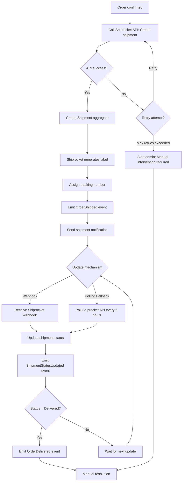

# Feature: Shipment Tracking & Fulfillment

> **Purpose:**
> This document defines a single feature's intent, scope, user experience, and completion criteria.
> It is the **single source of truth** for planning, review, automation, and execution.

---

## 0. Metadata

All metadata is defined in the frontmatter above (between the `---` markers).

**Important:** The frontmatter is used by automation scripts to:

- Create GitHub issues
- Link features to parent epics
- Generate feature flags
- Track status and ownership

---

## 1. Overview

**The Shipment Tracking & Fulfillment feature integrates Shiprocket API for automatic shipment creation, tracking updates, and delivery confirmation.**

- Automatically creates shipments via Shiprocket API when orders are confirmed
- Generates shipping labels and tracking numbers for logistics partners
- Receives tracking updates via webhooks with polling fallback for reliability
- Supports partial shipments when inventory is split across locations
- Provides users with real-time tracking links and status updates
- Emits domain events for downstream systems (notifications, order status updates)

This feature introduces meaningful change by automating fulfillment logistics and giving users transparent visibility into shipment progress from dispatch to delivery.

## Flow Diagram



Caption: "Shipment lifecycle from automatic creation through delivery with webhook + polling hybrid tracking."

---

## 2. User Problem

**Users need reliable visibility into when their order will arrive and where it currently is in the delivery process.**

### Who experiences the problem

- **All customers** waiting for product delivery after payment confirmation
- **Mobile shoppers** who expect real-time updates on their phone while away from home
- **Working professionals** who need to plan around delivery timing for secure receipt
- **Gift buyers** tracking packages being sent to recipients at different addresses

### When and in what situations it occurs

- Users complete checkout but don't know when shipment will be dispatched (no dispatch notification)
- Customers want to check delivery status mid-transit but have no tracking information
- Orders are delayed by logistics partners without proactive user notification
- Users need to contact support to find out basic shipment status (high friction)
- Packages are marked "out for delivery" but users aren't home to receive them (missed delivery)

### Current friction

Without shipment tracking:
- Users have no idea when their order will ship after payment (leads to support inquiries: "Where is my order?")
- There's no self-service way to check shipment progress, forcing reliance on customer support
- Logistics delays or issues are invisible to users until delivery is significantly overdue
- Users can't plan to be available for delivery, leading to missed deliveries and redelivery delays
- Lack of tracking transparency erodes trust in the purchase process

### Why existing behavior is insufficient

- Email confirmation alone doesn't provide real-time tracking or dispatch timing
- Without tracking links, users have no agency to monitor their own shipments
- Manual tracking via customer support is high-friction and doesn't scale
- Absence of proactive updates (shipped, out for delivery) leaves users guessing

---

## 3. Goals

### User Experience Goals

- **Automatic shipment transparency**: Users receive tracking information automatically when orders ship without needing to ask
- **Self-service tracking**: Users can check shipment status anytime via tracking link or order details page
- **Proactive updates**: Users receive notifications for key milestones (shipped, out for delivery, delivered)
- **Delivery planning**: Users know estimated delivery dates to plan availability for package receipt

### Business / System Goals

- **Automated fulfillment**: Shipment creation happens automatically without manual admin intervention
- **Reduced support burden**: Self-service tracking minimizes "where is my order?" support tickets
- **Logistics partner integration**: Seamless integration with Shiprocket for multi-carrier logistics management
- **Operational resilience**: Webhook + polling hybrid ensures tracking updates are never missed due to network issues

---

## 4. Non-Goals

**Explicitly state what this feature does not attempt to solve.**

- **Multi-carrier selection by user**: System selects logistics partner via Shiprocket's routing; users cannot choose specific carriers (e.g., BlueDart vs. Delhivery)
- **International shipping**: Only domestic Indian shipments supported; international logistics out of scope
- **Return shipment creation**: This feature handles outbound shipments only; return logistics deferred to future work
- **Real-time GPS tracking**: Tracking granularity limited to Shiprocket API data (status updates, not live GPS coordinates)
- **Delivery scheduling by user**: Users cannot request specific delivery time windows; controlled by logistics partner
- **Shipment cost optimization**: Shiprocket handles carrier selection and pricing; no dynamic cost comparison exposed to users
- **Manual shipment creation**: All shipments are auto-created from orders; admin cannot manually create ad-hoc shipments in MVP

---

## 5. Functional Scope

**Describe what the feature enables at a conceptual level.**

### Core Capabilities

- **Automatic Shipment Creation**: Create Shiprocket shipment automatically when order status changes to 'confirmed'
- **Tracking Number Assignment**: Receive tracking number and logistics partner details from Shiprocket API
- **Partial Shipment Support**: Handle orders where inventory is split (ship available items immediately, backorder remainder)
- **Webhook-Based Tracking Updates**: Receive real-time status updates from Shiprocket (in-transit, out for delivery, delivered, returned)
- **Polling Fallback**: Poll Shiprocket API every 6 hours if webhooks fail or are delayed
- **Tracking Link Provision**: Provide users with tracking URL to logistics partner's tracking page
- **Domain Event Emission**: Publish OrderShipped, ShipmentStatusUpdated, OrderDelivered events

### Expected Behaviors

- Shipment creation is idempotent (retries don't create duplicate shipments)
- Tracking updates are processed in chronological order (status can only progress, not regress)
- Partial shipments link to the same order but have unique shipment IDs and tracking numbers
- Users can view all shipments associated with an order (in case of partial shipments)
- Shipment status updates are persisted to Firestore for historical tracking

### System Responsibilities

- Validate order is in 'confirmed' status before creating shipment
- Retry shipment creation up to 3 times on Shiprocket API failure
- Verify webhook authenticity (signature validation)
- Deduplicate webhook events (process each status update exactly once)
- Update order status to 'shipped' when first shipment is created
- Update order status to 'delivered' when all shipments are delivered

---

## 6. Dependencies & Assumptions

**List conditions required for this feature to function as intended.**

### Dependencies

- **F-010 (Order Management)**: Shipments are created from confirmed orders; Order aggregate must exist
- **Shiprocket API**: External dependency for shipment creation, label generation, and tracking updates
- **F-008 (Checkout & Address Management)**: Shipping address is required for Shiprocket shipment creation

### Assumptions

- **Shiprocket account is active**: Platform has active Shiprocket account with API credentials configured
- **Webhook endpoint is publicly accessible**: Shiprocket can reach our webhook endpoint (not behind firewall)
- **Inventory is tracked**: Product availability is known at shipment creation time to support partial shipments
- **Single shipping address per order**: Each order ships to one address (no split address shipments)
- **Logistics partner availability**: Shiprocket successfully routes shipments to available carriers (BlueDart, Delhivery, etc.)

### External Constraints

- **Shiprocket API rate limits**: Max 100 requests per minute; batch shipment creation if order volume exceeds limit
- **Webhook reliability**: Shiprocket webhooks may be delayed or lost due to network issues (hence polling fallback)
- **Tracking granularity**: Status updates limited to what logistics partners provide to Shiprocket (varies by carrier)
- **Delivery timeframes**: Estimated delivery dates are Shiprocket/carrier estimates, not guarantees

---

## 7. User Stories & Experience Scenarios

> This section defines **how users live with the feature**.
> Scenarios must focus on **quality of life and lifecycle experience**, not just technical failures.

---

### User Story 1 — Customer Awaiting Shipment Dispatch

**As a** customer who just placed an order  
**I want** to receive confirmation when my order ships with a tracking link  
**So that** I know my purchase is on its way and can monitor its progress

---

#### Scenarios

##### Scenario 1.1 — First-Time Shipment Notification

**Given** a user whose order status just changed to 'confirmed'  
**When** the shipment is automatically created in Shiprocket and assigned a tracking number  
**Then** the user receives an email notification: "Your order [Order Number] has shipped!"  
**And** the email includes the tracking number, carrier name (e.g., "BlueDart"), and tracking link  
**And** estimated delivery date is displayed (e.g., "Estimated delivery: Feb 5-7, 2026")  
**And** the order details page updates to show 'Shipped' status with tracking link

---

##### Scenario 1.2 — Returning to Check Tracking Status

**Given** a user who received a shipment notification earlier  
**When** they navigate to their order details page  
**Then** the page displays the current shipment status (e.g., "In Transit")  
**And** a clickable tracking link takes them to the logistics partner's tracking page  
**And** the last status update timestamp is shown (e.g., "Last updated: Feb 3, 2026 10:45 AM")  
**And** estimated delivery date is visible if provided by Shiprocket

---

##### Scenario 1.3 — Interrupted Tracking Check

**Given** a user clicked the tracking link from the order details page  
**When** they are redirected to the logistics partner's site but close it immediately  
**Then** they can return to the order details page anytime  
**And** the tracking link remains available for future clicks  
**And** no state is lost (tracking link is permanent for that shipment)

---

##### Scenario 1.4 — Unexpected Tracking Delay

**Given** a user whose order shows 'Shipped' status but tracking link shows "No tracking information available yet"  
**When** they check the tracking link within 24 hours of shipment creation  
**Then** the order details page displays a helpful message: "Tracking information will be available within 24 hours as the carrier processes the shipment."  
**And** the tracking link remains clickable (will populate once carrier updates)  
**And** the user is not left wondering if something went wrong

---

##### Scenario 1.5 — Tracking Multiple Shipments (Partial Shipment)

**Given** a user whose order contains 3 products, but only 2 are in stock  
**When** the first shipment is created for the available products  
**Then** the order details page shows "Partially Shipped" status  
**And** both shipments are listed separately: "Shipment 1 of 2 - Tracking: [Number]" and "Shipment 2 of 2 - Backordered (Estimated ship date: [Date])"  
**And** each shipment has its own tracking link when available  
**And** the user understands they will receive multiple deliveries

---

##### Scenario 1.6 — Localization of Delivery Estimates (India-Specific)

**Given** a user in India checking their shipment tracking  
**When** they view the order details or tracking page  
**Then** estimated delivery date is shown in DD/MM/YYYY format (Indian standard)  
**And** delivery timeframes are expressed in calendar days (e.g., "5-7 days") not business days  
**And** carrier name is familiar (BlueDart, Delhivery, India Post, etc.)  
**And** tracking link language matches logistics partner's localization (typically English or Hindi)

---

### User Story 2 — Customer Monitoring Shipment Progress

**As a** customer whose order is in transit  
**I want** to receive updates when shipment status changes (out for delivery, delivered)  
**So that** I can plan to be available for delivery and know when to expect the package

---

#### Scenarios

##### Scenario 2.1 — First Delivery Status Update

**Given** a user whose shipment is marked "Out for Delivery" by the logistics partner  
**When** Shiprocket webhook updates our system with the new status  
**Then** the order details page updates to show "Out for Delivery" status  
**And** an email notification is sent: "Your order is out for delivery today!"  
**And** the estimated delivery window is displayed if available (e.g., "Expected by 6:00 PM today")  
**And** the user can plan to be home for delivery

---

##### Scenario 2.2 — Returning to Check Delivery Status

**Given** a user who received an "Out for Delivery" notification  
**When** they check the order details page later in the day  
**Then** the status still shows "Out for Delivery" until the carrier updates to "Delivered"  
**And** the last update timestamp confirms when the status changed  
**And** the tracking link reflects the same status on the carrier's site

---

##### Scenario 2.3 — Interrupted During Delivery Day

**Given** a user checking tracking status while the package is out for delivery  
**When** they close the page and return hours later  
**Then** if delivery occurred in the interim, the status updates to "Delivered"  
**And** the delivery timestamp is displayed (e.g., "Delivered: Feb 5, 2026 2:30 PM")  
**And** the user receives a delivery confirmation email automatically

---

##### Scenario 2.4 — Unexpected Delivery Failure

**Given** a user whose shipment status changes to "Delivery Failed - Address Incomplete"  
**When** Shiprocket updates our system via webhook  
**Then** the order details page shows "Delivery Failed" with the reason  
**And** an email notification explains the issue: "Delivery failed due to incomplete address. Please contact support to update your address."  
**And** the user is provided a support contact link or phone number  
**And** the shipment is not marked as 'delivered' (remains in failed state until resolved)

---

##### Scenario 2.5 — Tracking Update Delays (Webhook Failure Scenario)

**Given** a shipment is delivered but Shiprocket webhook fails to reach our system  
**When** the polling fallback runs (every 6 hours)  
**Then** the polling job fetches the latest status from Shiprocket API  
**And** the order details page updates to "Delivered" status  
**And** the user receives the delivery confirmation email (delayed by up to 6 hours)  
**And** the experience is eventually consistent despite webhook failure

---

##### Scenario 2.6 — Localization of Delivery Confirmation (India-Specific)

**Given** a user in India whose shipment is delivered  
**When** they receive the delivery confirmation email  
**Then** the delivery timestamp is in 12-hour format with AM/PM (e.g., "2:30 PM")  
**And** the date is in DD/MM/YYYY format  
**And** the email language is clear and concise in English  
**And** any carrier-specific notes (e.g., "Left with neighbor") are included if provided by Shiprocket

---

### User Story 3 — Admin Monitoring Fulfillment Issues

**As an** admin user  
**I want** to be alerted when shipment creation fails or tracking updates are delayed  
**So that** I can intervene manually to resolve fulfillment issues before they impact customers

---

#### Scenarios

##### Scenario 3.1 — First Shipment Creation Failure Alert

**Given** an order is confirmed but Shiprocket API returns an error (e.g., "Invalid address format")  
**When** the automatic retry logic exhausts all 3 attempts  
**Then** the system logs the error to Cloud Logging with order ID and error details  
**And** an alert is sent to the admin email or monitoring dashboard  
**And** the order status remains 'confirmed' (not transitioned to 'shipped')  
**And** the admin can manually investigate and correct the issue (e.g., fix address in Shiprocket dashboard)

---

##### Scenario 3.2 — Returning to Retry Failed Shipment

**Given** an admin who fixed the address issue in Shiprocket  
**When** they trigger a manual retry via admin panel or script  
**Then** the system re-attempts shipment creation with the corrected data  
**And** on success, the shipment is created and user receives shipment notification  
**And** the failure alert is marked as resolved in the monitoring system

---

##### Scenario 3.3 — Interrupted Shipment Monitoring

**Given** an admin reviewing a list of failed shipments in the admin dashboard  
**When** they navigate away and return later  
**Then** the dashboard retains filters and state (e.g., "Show failed shipments from last 7 days")  
**And** the admin can resume investigation without re-searching

---

##### Scenario 3.4 — Unexpected Webhook Downtime

**Given** Shiprocket webhooks stop being received for 12+ hours (system-wide issue)  
**When** the polling fallback detects the gap (no webhook updates in expected window)  
**Then** the polling job increases frequency to every 2 hours temporarily  
**And** an alert is sent to admin: "Webhook downtime detected, polling active"  
**And** tracking updates continue via polling until webhooks resume  
**And** once webhooks resume, polling frequency returns to normal (6 hours)

---

##### Scenario 3.5 — High-Volume Shipment Processing

**Given** 500 orders are confirmed simultaneously during a flash sale  
**When** the system creates shipments in bulk  
**Then** shipment creation is batched to respect Shiprocket API rate limits (100 req/min)  
**And** the queue processes all shipments within 10 minutes  
**And** no shipment creation requests fail due to rate limiting  
**And** users receive shipment notifications in order of confirmation timestamp

---

##### Scenario 3.6 — Localization of Admin Alerts (India-Specific)

**Given** an admin user in India receiving shipment failure alerts  
**When** the alert is displayed or emailed  
**Then** timestamps are in IST timezone with 12-hour format  
**And** dates are in DD/MM/YYYY format  
**And** error messages from Shiprocket API are displayed verbatim (not translated)  
**And** admin dashboard supports filtering by Indian PIN codes

---

## 8. Edge Cases & Constraints (Experience-Relevant)

**Include only cases that materially affect user experience.**

### Hard Limits

- **Partial shipment limit**: Maximum 5 shipments per order (inventory split across max 5 locations); beyond this requires manual intervention
- **Tracking retention**: Tracking data retained for 1 year post-delivery; older shipments show "Delivered" status only
- **Webhook retry limit**: Webhooks are retried 3 times by Shiprocket before being dropped; polling catches missed updates

### Irreversible Actions

- **Shipment creation**: Once created in Shiprocket, shipment cannot be deleted; cancellation requires separate API call and may incur fees
- **Tracking number assignment**: Tracking numbers are permanent once assigned; cannot be changed or reassigned

### Compliance Constraints

- **Logistics partner data retention**: Tracking data retention follows logistics partner policies (typically 90 days to 1 year)
- **Address privacy**: Shipping addresses must be transmitted securely to Shiprocket (HTTPS only)
- **Delivery proof**: Signature or photo proof of delivery (if provided by carrier) must be retained for dispute resolution (minimum 90 days)

---

## 9. Implementation Tasks (Execution Agent Checklist)

> This section provides the specific work items for the **Execution Agent**.
> Every task must map back to a specific scenario defined in Section 7.

```markdown
- [ ] T01 — Integrate Shiprocket API client library and authentication (Scenario 1.1)
  - [ ] Unit Test: API client authenticates successfully with valid credentials
  - [ ] Unit Test: API client handles authentication failure gracefully
  - [ ] Integration Test: Create test shipment in Shiprocket sandbox environment
- [ ] T02 — Implement Shipment aggregate with ShipmentId, TrackingNumber, ShipmentStatus (Scenario 1.1)
  - [ ] Unit Test: Shipment creation from Order with valid address
  - [ ] Unit Test: Shipment ID is unique per order + sequence (e.g., ORD-001-SHIP-1)
  - [ ] Unit Test: Shipment status transitions follow valid state machine
- [ ] T03 — Create automatic shipment creation triggered by OrderPlaced event (Scenario 1.1, 3.1)
  - [ ] Unit Test: Event listener calls Shiprocket API on OrderPlaced event
  - [ ] Unit Test: Retry logic attempts 3 times on API failure before alerting
  - [ ] Integration Test: Shipment created in Shiprocket and Shipment aggregate persisted to Firestore
  - [ ] E2E Test: Order confirmation triggers shipment creation and user receives email notification
- [ ] T04 — Implement webhook endpoint to receive Shiprocket status updates (Scenario 2.1, 2.4)
  - [ ] Unit Test: Webhook signature validation succeeds for authentic requests
  - [ ] Unit Test: Webhook signature validation fails for tampered requests
  - [ ] Unit Test: Webhook payload parsing extracts tracking number and status correctly
  - [ ] Integration Test: Webhook updates Shipment aggregate status and emits ShipmentStatusUpdated event
  - [ ] E2E Test: Simulated webhook updates order details page status
- [ ] T05 — Implement polling fallback for tracking updates (Scenario 2.5, 3.4)
  - [ ] Unit Test: Polling job fetches shipments updated in last 6 hours from Firestore
  - [ ] Unit Test: Polling job calls Shiprocket tracking API for each shipment
  - [ ] Unit Test: Polling job updates status if different from current Firestore state
  - [ ] Integration Test: Polling runs on schedule (every 6 hours) via Cloud Scheduler
  - [ ] Integration Test: Polling detects webhook downtime and increases frequency
- [ ] T06 — Implement partial shipment support (Scenario 1.5)
  - [ ] Unit Test: Order with 3 products, 2 in stock creates first shipment for available items
  - [ ] Unit Test: Second shipment created when backordered item becomes available
  - [ ] Integration Test: Order status shows "Partially Shipped" until all shipments created
  - [ ] E2E Test: Order details page lists multiple shipments with separate tracking links
- [ ] T07 — Implement GraphQL queries: shipment(orderId), trackingDetails(trackingNumber) (Scenario 1.2)
  - [ ] Unit Test: Query shipment(orderId) returns all shipments linked to order
  - [ ] Unit Test: Query trackingDetails(trackingNumber) returns status and carrier info
  - [ ] Integration Test: Queries respect user authorization (own orders only)
- [ ] T08 — Emit domain events: OrderShipped, ShipmentStatusUpdated, OrderDelivered (Scenario 1.1, 2.1, 2.3)
  - [ ] Unit Test: OrderShipped event emitted when first shipment created
  - [ ] Unit Test: ShipmentStatusUpdated event emitted on each status change
  - [ ] Unit Test: OrderDelivered event emitted when all shipments marked delivered
  - [ ] Integration Test: Events published to Firestore collection for notification service
- [ ] T09 — Create Firestore schema and indexes for shipments collection (Scenario 1.5)
  - [ ] Unit Test: Firestore security rules allow users to read shipments for their orders only
  - [ ] Unit Test: Index on (orderId + createdAt) for multi-shipment orders
  - [ ] Unit Test: Index on (trackingNumber) for direct tracking lookup
- [ ] T10 — Build shipment tracking UI component for order details page (Scenario 1.2)
  - [ ] E2E Test: Order details page displays shipment status and tracking link
  - [ ] E2E Test: Tracking link opens logistics partner's tracking page in new tab
  - [ ] E2E Test: Estimated delivery date displayed if available
- [ ] T11 — Build partial shipment display for multi-shipment orders (Scenario 1.5)
  - [ ] E2E Test: Order with 2 shipments shows both with labels "Shipment 1 of 2", "Shipment 2 of 2"
  - [ ] E2E Test: Each shipment displays its own status and tracking link
- [ ] T12 — Implement admin alert system for shipment creation failures (Scenario 3.1)
  - [ ] Unit Test: Alert sent to Cloud Logging and admin email on max retries exceeded
  - [ ] Integration Test: Alert includes order ID, error message, and timestamp
- [ ] T13 — [Rollout] Implement feature flag `shipment_tracking_enabled` gating (Scenario 1.1)
  - [ ] Integration Test: Flag disabled prevents automatic shipment creation
  - [ ] Integration Test: Flag enabled allows full shipment workflow
```

---

## 10. Acceptance Criteria (Verifiable Outcomes)

> These criteria are used by the **Execution Agent** and **Reviewers** to verify completion.
> Each criterion must be observable and testable.

```markdown
- [ ] AC1 — Shipment is created automatically in Shiprocket on order confirmation
  - [ ] Integration test passed: OrderPlaced event triggers Shiprocket API call
  - [ ] E2E test passed: Order confirmation results in shipment notification email within 5 minutes
- [ ] AC2 — Tracking number and carrier name are assigned and displayed to user
  - [ ] Unit test passed: Shipment aggregate stores tracking number and carrier
  - [ ] E2E test passed: Order details page displays tracking link and carrier name
- [ ] AC3 — Webhook receives and processes Shiprocket status updates
  - [ ] Unit test passed: Webhook signature validation prevents unauthorized updates
  - [ ] Integration test passed: Valid webhook updates Shipment aggregate and emits event
- [ ] AC4 — Polling fallback fetches tracking updates when webhooks fail
  - [ ] Integration test passed: Polling job runs every 6 hours and updates stale shipments
  - [ ] E2E test passed: Shipment status eventually updates even if webhook is missed
- [ ] AC5 — Partial shipments are supported for split inventory
  - [ ] Unit test passed: Multiple Shipment entities link to single Order
  - [ ] E2E test passed: Order details page lists all shipments with separate tracking links
- [ ] AC6 — Domain events OrderShipped, ShipmentStatusUpdated, OrderDelivered are emitted
  - [ ] Integration test passed: Events published with correct payload structure
  - [ ] Integration test passed: Notification service consumes events successfully
- [ ] AC7 — Shipment creation retries 3 times before alerting admin
  - [ ] Unit test passed: Retry logic attempts exactly 3 times on API failure
  - [ ] Integration test passed: Admin alert sent after 3rd failure with error details
- [ ] AC8 — Tracking link directs user to logistics partner's tracking page
  - [ ] E2E test passed: Clicking tracking link opens carrier's site with correct tracking number
- [ ] AC9 — Order status transitions to 'shipped' when first shipment is created
  - [ ] Integration test passed: Order aggregate status updated from 'confirmed' to 'shipped'
- [ ] AC10 — Order status transitions to 'delivered' when all shipments are delivered
  - [ ] Integration test passed: Order status updated to 'delivered' only after all shipments complete
- [ ] AC11 — [Gating] Feature flag `shipment_tracking_enabled` controls shipment creation
  - [ ] Integration test passed: Flag disabled prevents automatic shipment creation
  - [ ] Integration test passed: Flag enabled allows full workflow
```

---

## 11. Rollout & Risk (If Applicable)

### Rollout Strategy

- **Phase 1 (0% rollout)**: Deploy to staging with flag `shipment_tracking_enabled = false` in production; test with real Shiprocket sandbox
- **Phase 2 (10% rollout)**: Enable for 10% of orders in production; monitor shipment creation success rate and webhook reliability
- **Phase 3 (50% rollout)**: Increase to 50% after 5 days of stable 10% rollout (success rate >99%)
- **Phase 4 (100% rollout)**: Full rollout after 7 days of stable 50% rollout
- **Rollback trigger**: Shipment creation failure rate >1% or webhook processing errors >5% trigger automatic rollback to 0%

### Risk Mitigation

- **Risk**: Shiprocket API downtime prevents all shipment creation, blocking order fulfillment
  - **Mitigation**: Implement exponential backoff retry (up to 24 hours); queue failed shipments for batch retry; admin dashboard to monitor queue
- **Risk**: Webhook endpoint is overwhelmed during high-volume periods (flash sales)
  - **Mitigation**: Use Cloud Run autoscaling; implement webhook event queue (Firestore) with background processor
- **Risk**: Incorrect address data causes shipment creation failure and delivery delays
  - **Mitigation**: Validate address format before order confirmation (in F-008); Shiprocket validates during shipment creation; admin alerted for manual correction
- **Risk**: Polling fallback incurs high API usage costs if webhooks consistently fail
  - **Mitigation**: Monitor webhook health metric; alert admin if webhook failure rate >10%; negotiate higher API limits with Shiprocket

### Exit Criteria

- **Flag cleanup**: Remove `shipment_tracking_enabled` flag after 30 days of stable 100% rollout (success rate >99.5% sustained)
- **Monitoring**: Establish baseline metrics for shipment creation latency, webhook processing time, and polling efficiency before removal

### Remote Config Flags

<!-- REMOTE_CONFIG_FLAG_START -->
| Context | Type | Namespace | Default (Dev) | Default (Stg) | Default (Prod) | Key |
|---------|------|-----------|---------------|---------------|----------------|-----|
| shipment_tracking_enabled | BOOLEAN | client | true | true | false | _auto-generated_ |
| shiprocket_api_timeout_seconds | NUMBER | server | 10 | 10 | 10 | _auto-generated_ |
| shipment_creation_max_retries | NUMBER | server | 3 | 3 | 3 | _auto-generated_ |
| polling_interval_hours | NUMBER | server | 6 | 6 | 6 | _auto-generated_ |
| webhook_downtime_threshold_hours | NUMBER | server | 12 | 12 | 12 | _auto-generated_ |
| partial_shipment_max_count | NUMBER | server | 5 | 5 | 5 | _auto-generated_ |
<!-- REMOTE_CONFIG_FLAG_END -->

**Flag Justification:**

- **shipment_tracking_enabled**: Temporary flag for gradual rollout and emergency kill-switch; removal planned after 30-day stable deployment
- **shiprocket_api_timeout_seconds**: Permanent configuration flag to tune API client timeout based on network latency patterns
- **shipment_creation_max_retries**: Permanent configuration flag to adjust retry behavior without code deployment; allows A/B testing of optimal retry count
- **polling_interval_hours**: Permanent configuration flag to tune polling frequency based on cost vs. latency tradeoffs
- **webhook_downtime_threshold_hours**: Permanent configuration flag to adjust webhook health detection sensitivity
- **partial_shipment_max_count**: Permanent configuration flag to prevent abuse and manage UX complexity; adjustable based on operational capacity

---

## 12. History & Status

- **Status:** Draft
- **Related Epics:** Order & Fulfillment (linked after automation)
- **Related Issues:** Created post-merge via GitHub automation
- **Dependencies:** F-010 (Order Management), F-008 (Checkout & Address Management)

---

## Final Note

> This document defines **intent and experience**.
> Execution details are derived from it — never the other way around.
