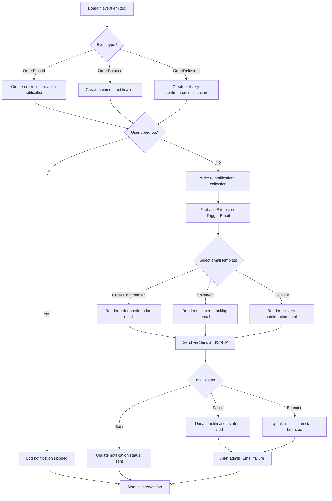

# Feature: Order Notifications

> **Purpose:**
> This document defines a single feature's intent, scope, user experience, and completion criteria.
> It is the **single source of truth** for planning, review, automation, and execution.

---

## 0. Metadata

All metadata is defined in the frontmatter above (between the `---` markers).

**Important:** The frontmatter is used by automation scripts to:

- Create GitHub issues
- Link features to parent epics
- Generate feature flags
- Track status and ownership

---

## 1. Overview

**The Order Notifications feature sends automated email notifications for order lifecycle events via Firebase Extension (Trigger Email from Firestore).**

- Sends order confirmation emails immediately after successful payment
- Sends shipment notifications when orders are dispatched with tracking links
- Sends delivery confirmation emails when packages are delivered
- Provides email templates designed for mobile-first viewing
- Supports user opt-out for all email notifications including transactional emails
- Tracks email delivery status (sent, failed, bounced) for monitoring and debugging

This feature introduces meaningful change by keeping users informed at every stage of their purchase journey without requiring them to actively check order status.

## Flow Diagram



Caption: "Email notification flow from domain event through template rendering to delivery status tracking."

---

## 2. User Problem

**Users need proactive updates about their order status without having to actively check the website or contact support.**

### Who experiences the problem

- **All customers** who want immediate confirmation that their order was received and payment succeeded
- **Busy professionals** who don't have time to repeatedly check order status pages
- **Mobile-first users** who prefer receiving updates via email on their phones
- **Anxious first-time buyers** who need reassurance at each step that their purchase is progressing normally

### When and in what situations it occurs

- Users complete checkout but don't receive confirmation, leading to uncertainty about whether the order went through
- Orders ship without notification, leaving users unaware their package is on the way (missed delivery risk)
- Packages are delivered but users don't know, leading to theft risk or delayed product usage
- Users have to manually check order status multiple times per day to track progress (high friction)
- Email confirmation is never received due to spam filters or incorrect email, but user isn't aware

### Current friction

Without order notifications:
- Users lack confidence immediately after purchase, wondering if payment succeeded
- No proactive shipment notification means users must remember to check order status (low engagement)
- Missed delivery notifications lead to packages sitting outside or returned to sender
- Support burden increases as users email asking "Did my order go through?" or "Where is my order?"
- Users with spam-filtered emails have no alternative way to receive updates

### Why existing behavior is insufficient

- Manual status checking requires users to remember order numbers and navigate to the website repeatedly
- Lack of email notifications feels impersonal and erodes trust in the brand
- Users expect email updates as standard behavior from all e-commerce platforms
- No notification means no opportunity for users to take action (e.g., be home for delivery)

---

## 3. Goals

### User Experience Goals

- **Immediate peace of mind**: Users receive order confirmation within 1 minute of payment completion
- **Proactive shipment awareness**: Users are notified when orders ship without needing to check status manually
- **Delivery confirmation**: Users know immediately when packages arrive, reducing theft risk and enabling quick product usage
- **Notification control**: Users can opt out of all emails if they prefer self-service status checking (respecting user agency)

### Business / System Goals

- **Reduce support burden**: Proactive notifications minimize "where is my order?" support tickets
- **Increase engagement**: Email notifications drive users back to the site to track shipments or reorder
- **Build trust**: Consistent, reliable notifications reinforce brand professionalism
- **Monitor deliverability**: Track email delivery failures to identify spam filter issues or bad email addresses

---

## 4. Non-Goals

**Explicitly state what this feature does not attempt to solve.**

- **SMS notifications**: Only email notifications supported; SMS deferred to future work
- **Push notifications**: No browser or mobile app push notifications; email only in MVP
- **Marketing emails**: This feature handles transactional notifications only; promotional emails out of scope
- **Multi-language support**: Email templates in English only; localization deferred
- **Custom email preferences**: Users can opt out entirely, but cannot selectively disable specific notification types (e.g., keep order confirmations, disable delivery emails)
- **Email content personalization**: Email templates are standardized; no dynamic personalization beyond order details (e.g., no product recommendations)
- **Email delivery retries on failure**: Failed emails are logged but not automatically retried; admin can manually resend

---

## 5. Functional Scope

**Describe what the feature enables at a conceptual level.**

### Core Capabilities

- **Event-Driven Notification Triggering**: Listen to domain events (OrderPlaced, OrderShipped, OrderDelivered) and create notification records
- **Firebase Extension Integration**: Use Firebase Extension "Trigger Email from Firestore" to automatically send emails when notification documents are written
- **Email Template Management**: Maintain HTML email templates for each notification type with mobile-responsive design
- **Opt-Out Support**: Check user notification preferences before sending; skip emails for opted-out users
- **Delivery Status Tracking**: Record email delivery status (sent, failed, bounced) in Notification aggregate for monitoring

### Expected Behaviors

- Notifications are sent asynchronously (do not block order processing)
- Email delivery is at-least-once (duplicate emails possible in rare cases, acceptable for transactional notifications)
- Opt-out applies to all notification types including transactional (user choice is respected)
- Failed emails are logged with error details for admin investigation
- Email templates include unsubscribe link at bottom for opt-out

### System Responsibilities

- Validate email address format before creating notification record
- Ensure notification records are idempotent (duplicate events don't create duplicate emails)
- Provide admin dashboard to view notification history and delivery failures
- Monitor email delivery rate and alert admin if failure rate exceeds threshold (>5%)

---

## 6. Dependencies & Assumptions

**List conditions required for this feature to function as intended.**

### Dependencies

- **F-011 (Shipment Tracking & Fulfillment)**: Shipment and delivery events are emitted by fulfillment system
- **F-010 (Order Management)**: Order data is available for inclusion in email templates
- **Firebase Extensions**: "Trigger Email from Firestore" extension must be installed and configured with SendGrid or SMTP provider
- **Domain Events**: OrderPlaced, OrderShipped, OrderDelivered events must be emitted reliably

### Assumptions

- **Email is primary contact method**: Users provided valid email addresses at checkout (validated in F-003 and F-008)
- **SMTP provider is reliable**: SendGrid or configured SMTP server has high deliverability rate (>95%)
- **Firebase Extension is active**: Extension processes Firestore writes within 1 minute
- **Users have email access**: Users check email regularly and can receive HTML emails
- **Spam filters are manageable**: Transactional emails are generally not spam-filtered (vs. marketing emails)

### External Constraints

- **Firebase Extension limits**: Free tier allows 200 emails/day; production must use paid tier or SendGrid API
- **Email deliverability**: Delivery rate depends on sender reputation and recipient spam filters (typically 95-98% for transactional emails)
- **Email size limits**: Templates must be <100KB to avoid delivery issues
- **Rate limiting**: SendGrid free tier limits to 100 emails/day; production requires paid plan

---

## 7. User Stories & Experience Scenarios

> This section defines **how users live with the feature**.
> Scenarios must focus on **quality of life and lifecycle experience**, not just technical failures.

---

### User Story 1 — Customer Receiving Order Confirmation

**As a** customer who just completed payment  
**I want** to receive an order confirmation email within minutes  
**So that** I have immediate confidence my purchase succeeded and a record for my inbox

---

#### Scenarios

##### Scenario 1.1 — First-Time Order Confirmation Email

**Given** a first-time user who successfully completed payment  
**When** the payment confirmation is processed and OrderPlaced event is emitted  
**Then** an order confirmation email is sent to the user's email address within 1 minute  
**And** the email subject line is clear: "Order Confirmation - [Order Number]"  
**And** the email body includes order number, product names with images, total amount paid, shipping address, and estimated delivery date  
**And** a "View Order Details" link directs the user to the order page  
**And** an unsubscribe link is present at the bottom

---

##### Scenario 1.2 — Returning to Check Email Confirmation

**Given** a user who received an order confirmation email earlier  
**When** they open their email inbox hours later  
**Then** the email is easily findable via search (order number or brand name)  
**And** the email displays correctly on mobile email clients (Gmail, Outlook mobile)  
**And** images load properly (or fallback text is shown if images are blocked)  
**And** the "View Order Details" link still works (order ID is embedded in URL)

---

##### Scenario 1.3 — Interrupted Email Delivery

**Given** a user completed payment but closed the browser immediately  
**When** the order confirmation email is sent by the system  
**Then** the email delivery occurs asynchronously (not dependent on user's browser session)  
**And** the email arrives in the user's inbox even if they're offline  
**And** the user can access order details anytime via the email link

---

##### Scenario 1.4 — Unexpected Email Not Received

**Given** a user who completed payment but doesn't see a confirmation email within 10 minutes  
**When** they check their spam/junk folder  
**Then** the email may be found there (spam filter false positive)  
**And** the email header clearly identifies the sender (e.g., "noreply@itsme.fashion")  
**And** the user can mark it "Not Spam" to whitelist future emails  
**And** if the email is truly missing, the order confirmation page displays: "Didn't receive confirmation email? Check your spam folder or contact support."

---

##### Scenario 1.5 — High-Volume Email Sending Performance

**Given** 500 orders are placed during a flash sale within 5 minutes  
**When** order confirmation emails are triggered  
**Then** Firebase Extension queues all 500 emails for sending  
**And** all emails are sent within 15 minutes (SMTP provider rate limits respected)  
**And** no emails fail due to rate limiting (queue buffers requests)  
**And** users receive emails in order of payment completion

---

##### Scenario 1.6 — Localization of Email Content (India-Specific)

**Given** a user in India who placed an order  
**When** they receive the order confirmation email  
**Then** the currency is displayed as ₹ (INR symbol)  
**And** the date format is DD/MM/YYYY (Indian standard)  
**And** the email language is clear, simple English  
**And** the sender email domain is recognizable as the brand (itsme.fashion)

---

### User Story 2 — Customer Receiving Shipment Notification

**As a** customer whose order has shipped  
**I want** to receive an email with tracking information  
**So that** I know my package is on the way and can monitor its progress

---

#### Scenarios

##### Scenario 2.1 — First Shipment Notification Email

**Given** a user whose order status changed to 'shipped'  
**When** the OrderShipped event is emitted by the fulfillment system  
**Then** a shipment notification email is sent within 1 minute  
**And** the email subject line is: "Your order has shipped - [Order Number]"  
**And** the email body includes order number, tracking number, carrier name, tracking link, and estimated delivery date  
**And** a prominent "Track Shipment" button links to the carrier's tracking page  
**And** the email is mobile-optimized for easy reading on phones

---

##### Scenario 2.2 — Returning to Access Tracking Link

**Given** a user who received a shipment notification email days ago  
**When** they search their inbox for the email to find the tracking link  
**Then** the email is searchable by order number or tracking number  
**And** the tracking link still works (carrier tracking pages persist for weeks)  
**And** clicking the link opens the carrier's site with current shipment status

---

##### Scenario 2.3 — Interrupted Email Check

**Given** a user opened the shipment notification email but closed it before clicking the tracking link  
**When** they re-open the email hours later  
**Then** the tracking link remains functional  
**And** the email content is unchanged (static snapshot of shipment details)  
**And** the user can click the link without any prior session or context

---

##### Scenario 2.4 — Unexpected Multiple Shipment Emails (Partial Shipment)

**Given** a user whose order is split into 2 shipments due to partial inventory  
**When** each shipment is created  
**Then** the user receives 2 separate shipment notification emails  
**And** each email clearly states "Shipment 1 of 2" and "Shipment 2 of 2"  
**And** each email includes the specific products in that shipment  
**And** each email has a unique tracking number and link  
**And** the user understands they will receive multiple deliveries

---

##### Scenario 2.5 — Email Delivery During High Load

**Given** 500 shipments are created simultaneously during peak fulfillment hours  
**When** shipment notification emails are triggered  
**Then** Firebase Extension queues all emails without data loss  
**And** emails are sent within 15 minutes  
**And** no emails are skipped or lost due to queue overflow

---

##### Scenario 2.6 — Localization of Shipment Email (India-Specific)

**Given** a user in India receiving a shipment notification  
**When** they open the email  
**Then** the carrier name is familiar (BlueDart, Delhivery, India Post)  
**And** estimated delivery date is in DD/MM/YYYY format  
**And** tracking link opens to carrier's India-specific tracking page  
**And** language is clear English with no complex terminology

---

### User Story 3 — Customer Receiving Delivery Confirmation

**As a** customer whose package has been delivered  
**I want** to receive confirmation that delivery is complete  
**So that** I know my package arrived and can retrieve it promptly

---

#### Scenarios

##### Scenario 3.1 — First Delivery Confirmation Email

**Given** a user whose shipment status changed to 'delivered'  
**When** the OrderDelivered event is emitted  
**Then** a delivery confirmation email is sent within 1 minute  
**And** the email subject line is: "Delivery confirmed - [Order Number]"  
**And** the email body includes order number, delivery timestamp, and carrier's delivery proof (if available)  
**And** a "View Order Details" link directs the user to the order page  
**And** a friendly message thanks the user for their purchase

---

##### Scenario 3.2 — Returning to Verify Delivery

**Given** a user who received a delivery confirmation email but wasn't home at delivery  
**When** they return home and check their email  
**Then** the email confirms delivery occurred (e.g., "Delivered on Feb 5 at 2:30 PM")  
**And** the user knows to look for the package outside their door or with a neighbor  
**And** the email provides a support link if the package wasn't received

---

##### Scenario 3.3 — Interrupted Email Check

**Given** a user opened the delivery confirmation email briefly but didn't read it fully  
**When** they re-open the email later  
**Then** the delivery details remain accessible  
**And** the "View Order Details" link still works  
**And** the user can confirm delivery timestamp without additional lookup

---

##### Scenario 3.4 — Unexpected Email for Undelivered Package

**Given** a user receives a delivery confirmation email but the package is not at their door  
**When** they check the order details page or tracking link  
**Then** the tracking status also shows "Delivered" (not a notification system error)  
**And** the email provides a clear support contact: "Package not received? Contact us immediately at support@itsme.fashion"  
**And** the user can report the discrepancy without navigating through complex help pages

---

##### Scenario 3.5 — Delivery Confirmation for Multiple Shipments

**Given** a user whose order was split into 2 shipments  
**When** both shipments are delivered (possibly on different days)  
**Then** the user receives 2 delivery confirmation emails (one per shipment)  
**And** each email clearly states which products were delivered  
**And** after both are delivered, the order details page shows "Order Complete - All items delivered"

---

##### Scenario 3.6 — Localization of Delivery Email (India-Specific)

**Given** a user in India receiving a delivery confirmation  
**When** they open the email  
**Then** the delivery timestamp is in 12-hour format with AM/PM (e.g., "2:30 PM")  
**And** the date is in DD/MM/YYYY format  
**And** any carrier-specific delivery notes (e.g., "Left with neighbor") are included if provided  
**And** language is simple and congratulatory (e.g., "Your order has arrived!")

---

### User Story 4 — User Opting Out of Notifications

**As a** user who prefers self-service order tracking  
**I want** to opt out of all email notifications  
**So that** I can manage my inbox and avoid unwanted emails while still using the platform

---

#### Scenarios

##### Scenario 4.1 — First-Time Opt-Out

**Given** a user who has been receiving order notification emails  
**When** they click the "Unsubscribe" link at the bottom of any notification email  
**Then** they are directed to a simple opt-out confirmation page  
**And** the page explains: "You will no longer receive order notifications via email. You can still view order status on the website."  
**And** a single "Confirm Opt-Out" button is displayed  
**And** clicking it updates their notification preferences to opted-out

---

##### Scenario 4.2 — Returning After Opt-Out

**Given** a user who opted out of notifications and places a new order  
**When** the order is confirmed  
**Then** no order confirmation email is sent (preference is respected)  
**And** the order confirmation page displays a notice: "Email notifications are disabled. Enable them in your account settings to receive updates."  
**And** the user can still access order details via the website

---

##### Scenario 4.3 — Interrupted Opt-Out Flow

**Given** a user clicked the unsubscribe link but navigated away before confirming  
**When** they return to the opt-out page later  
**Then** the opt-out confirmation page is still accessible  
**And** they can complete the opt-out process without penalty  
**And** their notification preference is only changed after explicit confirmation (not on link click alone)

---

##### Scenario 4.4 — Unexpected Opt-In Again

**Given** a user who previously opted out and now wants to re-enable notifications  
**When** they navigate to account settings (authenticated users) or contact support (guest users)  
**Then** they can toggle notification preferences back to opted-in  
**And** future orders will trigger email notifications again  
**And** the change takes effect immediately (next notification will be sent)

---

##### Scenario 4.5 — Opt-Out Performance Under High Volume

**Given** 100 users click unsubscribe links simultaneously during a campaign  
**When** the opt-out requests are processed  
**Then** each request updates the user's notification preference record in Firestore  
**And** all updates complete within 5 seconds  
**And** no race conditions occur (idempotent updates)

---

##### Scenario 4.6 — Localization of Opt-Out Page (India-Specific)

**Given** a user in India accessing the opt-out confirmation page  
**When** the page loads  
**Then** the language is clear, simple English  
**And** the explanation is concise (1-2 sentences)  
**And** the "Confirm Opt-Out" button is prominently displayed  
**And** the user can easily navigate back to the home page via a link

---

## 8. Edge Cases & Constraints (Experience-Relevant)

**Include only cases that materially affect user experience.**

### Hard Limits

- **Email size limit**: Email templates must be <100KB to ensure deliverability; images are externally hosted, not embedded
- **Email retention**: Sent notification records retained for 90 days in Firestore; older records archived to Cloud Storage
- **Notification retry limit**: Failed emails are not automatically retried; admin can manually trigger resend from dashboard

### Irreversible Actions

- **Email delivery**: Once sent, emails cannot be recalled or deleted from recipient inboxes
- **Opt-out**: Opt-out is immediate and cannot be undone automatically; user must manually re-enable in settings

### Compliance Constraints

- **CAN-SPAM compliance**: All emails must include unsubscribe link and physical sender address in footer
- **GDPR (future)**: If expanding to EU, must obtain explicit consent before sending transactional emails (currently India-only, implicit consent via checkout)
- **Email content regulations**: Cannot include promotional content in transactional emails; strictly order-related information only

---

## 9. Implementation Tasks (Execution Agent Checklist)

> This section provides the specific work items for the **Execution Agent**.
> Every task must map back to a specific scenario defined in Section 7.

```markdown
- [ ] T01 — Install and configure Firebase Extension: Trigger Email from Firestore (Scenario 1.1)
  - [ ] Unit Test: Extension configuration includes SMTP credentials and sender email
  - [ ] Integration Test: Write test notification to Firestore collection triggers email send
- [ ] T02 — Implement Notification aggregate with NotificationId, Channel, Status (Scenario 1.1)
  - [ ] Unit Test: Notification creation with valid email address and template type
  - [ ] Unit Test: Notification ID is unique per order + notification type
  - [ ] Unit Test: Status transitions (pending → sent → delivered OR failed)
- [ ] T03 — Create event listeners for OrderPlaced, OrderShipped, OrderDelivered (Scenario 1.1, 2.1, 3.1)
  - [ ] Unit Test: OrderPlaced event creates order confirmation notification
  - [ ] Unit Test: OrderShipped event creates shipment notification
  - [ ] Unit Test: OrderDelivered event creates delivery confirmation notification
  - [ ] Integration Test: Event listeners write notification records to Firestore
- [ ] T04 — Implement user opt-out check before creating notifications (Scenario 4.1, 4.2)
  - [ ] Unit Test: Notification is skipped if user has opted out
  - [ ] Unit Test: Notification is created if user has not opted out (default)
  - [ ] Integration Test: Opted-out user does not receive emails but order processing continues
- [ ] T05 — Design and implement order confirmation email template (HTML) (Scenario 1.1)
  - [ ] Unit Test: Template renders with order data (order number, products, total, address)
  - [ ] E2E Test: Sent email displays correctly in Gmail mobile app
  - [ ] E2E Test: Sent email displays correctly in Outlook desktop client
- [ ] T06 — Design and implement shipment notification email template (HTML) (Scenario 2.1)
  - [ ] Unit Test: Template renders with tracking number, carrier name, tracking link
  - [ ] E2E Test: "Track Shipment" button is prominently displayed and clickable
- [ ] T07 — Design and implement delivery confirmation email template (HTML) (Scenario 3.1)
  - [ ] Unit Test: Template renders with delivery timestamp and support link
  - [ ] E2E Test: Email thanks user and provides clear delivery confirmation
- [ ] T08 — Implement unsubscribe link in all email templates (Scenario 4.1)
  - [ ] Unit Test: Unsubscribe link generates unique token linked to user email
  - [ ] E2E Test: Clicking unsubscribe link navigates to opt-out confirmation page
- [ ] T09 — Build opt-out confirmation page (Scenario 4.1, 4.3)
  - [ ] Unit Test: Page validates unsubscribe token before allowing opt-out
  - [ ] E2E Test: Confirming opt-out updates user notification preference
- [ ] T10 — Implement GraphQL mutation: updateNotificationPreferences (Scenario 4.4)
  - [ ] Unit Test: Mutation updates user's notification preference (opted-in/opted-out)
  - [ ] Integration Test: Authenticated users can toggle preferences via account settings
- [ ] T11 — Track email delivery status via Firebase Extension callback (Scenario 1.4)
  - [ ] Unit Test: Extension updates notification status to 'sent' on successful delivery
  - [ ] Unit Test: Extension updates notification status to 'failed' on bounce or error
  - [ ] Integration Test: Failed notifications trigger admin alert
- [ ] T12 — Create admin dashboard to view notification history and failures (Scenario 1.4)
  - [ ] E2E Test: Dashboard lists notifications with status, recipient, timestamp
  - [ ] E2E Test: Dashboard filters by status (sent, failed, bounced)
  - [ ] E2E Test: Admin can manually resend failed notifications
- [ ] T13 — Implement notification idempotency to prevent duplicate emails (Scenario 1.5)
  - [ ] Unit Test: Duplicate OrderPlaced events do not create duplicate notifications
  - [ ] Integration Test: Notification record uses composite key (orderId + notificationType)
- [ ] T14 — Create Firestore schema and indexes for notifications collection (Scenario 1.2)
  - [ ] Unit Test: Index on (userId + createdAt) for user notification history
  - [ ] Unit Test: Index on (status) for admin filtering
- [ ] T15 — [Rollout] Implement feature flag `order_notifications_enabled` gating (Scenario 1.1)
  - [ ] Integration Test: Flag disabled prevents notification creation
  - [ ] Integration Test: Flag enabled allows full notification workflow
```

---

## 10. Acceptance Criteria (Verifiable Outcomes)

> These criteria are used by the **Execution Agent** and **Reviewers** to verify completion.
> Each criterion must be observable and testable.

```markdown
- [ ] AC1 — Order confirmation email sent within 1 minute of payment success
  - [ ] Integration test passed: OrderPlaced event triggers notification creation
  - [ ] E2E test passed: Email received in test inbox within 1 minute
- [ ] AC2 — Shipment notification email sent within 1 minute of shipment creation
  - [ ] Integration test passed: OrderShipped event triggers notification creation
  - [ ] E2E test passed: Email includes tracking link and carrier name
- [ ] AC3 — Delivery confirmation email sent within 1 minute of delivery status update
  - [ ] Integration test passed: OrderDelivered event triggers notification creation
  - [ ] E2E test passed: Email displays delivery timestamp
- [ ] AC4 — Email templates are mobile-responsive and display correctly
  - [ ] E2E test passed: Order confirmation email renders correctly on Gmail mobile
  - [ ] E2E test passed: Shipment email "Track Shipment" button is tappable on mobile
- [ ] AC5 — Users can opt out of all notifications via unsubscribe link
  - [ ] Unit test passed: Unsubscribe link generates valid token
  - [ ] E2E test passed: Clicking unsubscribe and confirming updates user preference
  - [ ] Integration test passed: Opted-out users do not receive future emails
- [ ] AC6 — Notification delivery status is tracked (sent, failed, bounced)
  - [ ] Integration test passed: Firebase Extension updates notification status
  - [ ] Unit test passed: Failed notifications trigger admin alert
- [ ] AC7 — Duplicate domain events do not create duplicate email notifications
  - [ ] Unit test passed: Notification record uses idempotency key
  - [ ] Integration test passed: Replay of OrderPlaced event does not send duplicate email
- [ ] AC8 — Admin dashboard displays notification history and failures
  - [ ] E2E test passed: Dashboard lists notifications with status filter
  - [ ] E2E test passed: Admin can resend failed notification
- [ ] AC9 — Email sending scales to 500+ notifications during peak periods
  - [ ] Integration test passed: Firebase Extension queues 500 emails without data loss
  - [ ] E2E test passed: All emails sent within 15 minutes
- [ ] AC10 — [Gating] Feature flag `order_notifications_enabled` controls notification creation
  - [ ] Integration test passed: Flag disabled prevents email sending
  - [ ] Integration test passed: Flag enabled allows full workflow
```

---

## 11. Rollout & Risk (If Applicable)

### Rollout Strategy

- **Phase 1 (0% rollout)**: Deploy to staging with flag `order_notifications_enabled = false` in production; test with real email delivery
- **Phase 2 (10% rollout)**: Enable for 10% of orders in production; monitor email delivery rate and user complaints
- **Phase 3 (50% rollout)**: Increase to 50% after 3 days of stable 10% rollout (delivery rate >95%)
- **Phase 4 (100% rollout)**: Full rollout after 5 days of stable 50% rollout
- **Rollback trigger**: Email delivery failure rate >5% or user complaints >10 per day trigger automatic rollback to 0%

### Risk Mitigation

- **Risk**: Email delivery fails due to SMTP provider downtime, leaving users without notifications
  - **Mitigation**: Use SendGrid with 99.9% uptime SLA; implement fallback SMTP provider (Mailgun); queue retries for transient failures
- **Risk**: Emails are flagged as spam, reducing deliverability and user trust
  - **Mitigation**: Configure SPF, DKIM, DMARC records for sender domain; use reputable SMTP provider; avoid spammy language in templates; monitor bounce rates
- **Risk**: Duplicate emails sent due to event replay or Firebase Extension retries
  - **Mitigation**: Implement idempotency key on notification records; Firebase Extension deduplicates based on document ID
- **Risk**: User opts out but still receives emails due to race condition
  - **Mitigation**: Check opt-out preference atomically before writing notification record; eventual consistency acceptable (1-2 minutes delay)

### Exit Criteria

- **Flag cleanup**: Remove `order_notifications_enabled` flag after 30 days of stable 100% rollout (delivery rate >95% sustained)
- **Monitoring**: Establish baseline metrics for email delivery rate, open rate, and opt-out rate before removal

### Remote Config Flags

<!-- REMOTE_CONFIG_FLAG_START -->
| Context | Type | Namespace | Default (Dev) | Default (Stg) | Default (Prod) | Key |
|---------|------|-----------|---------------|---------------|----------------|-----|
| order_notifications_enabled | BOOLEAN | client | true | true | false | _auto-generated_ |
| email_delivery_timeout_seconds | NUMBER | server | 60 | 60 | 60 | _auto-generated_ |
| notification_retry_max_attempts | NUMBER | server | 0 | 0 | 0 | _auto-generated_ |
| email_template_version | STRING | server | v1 | v1 | v1 | _auto-generated_ |
<!-- REMOTE_CONFIG_FLAG_END -->

**Flag Justification:**

- **order_notifications_enabled**: Temporary flag for gradual rollout and emergency kill-switch; removal planned after 30-day stable deployment
- **email_delivery_timeout_seconds**: Permanent configuration flag to tune SMTP timeout based on provider latency
- **notification_retry_max_attempts**: Permanent configuration flag to enable retry logic in future without code deployment (currently 0 = no retries)
- **email_template_version**: Permanent configuration flag to A/B test email template designs without redeployment

---

## 12. History & Status

- **Status:** Draft
- **Related Epics:** Order & Fulfillment (linked after automation)
- **Related Issues:** Created post-merge via GitHub automation
- **Dependencies:** F-011 (Shipment Tracking & Fulfillment), F-010 (Order Management)

---

## Final Note

> This document defines **intent and experience**.
> Execution details are derived from it — never the other way around.
