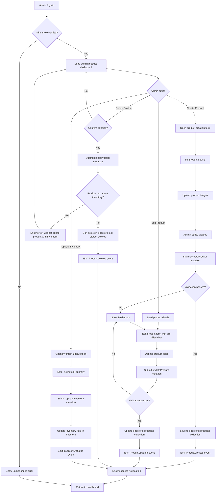

# Feature: Admin Product Management

> **Purpose:**
> This document defines a single feature's intent, scope, user experience, and completion criteria.
> It is the **single source of truth** for planning, review, automation, and execution.

---

## 0. Metadata

All metadata is defined in the frontmatter above (between the `---` markers).

**Important:** The frontmatter is used by automation scripts to:

- Create GitHub issues
- Link features to parent epics
- Generate feature flags
- Track status and ownership

---

## 1. Overview

**The Admin Product Management feature enables admin users to create, update, and delete products with inventory management and ethics badge assignment.**

- Provides CRUD operations for products (create, read, update, delete) via admin-only GraphQL mutations
- Enables inventory level updates (stock quantity adjustments)
- Supports ethics badge management (cruelty-free, paraben-free, vegan) based on supplier certifications
- Allows product image upload to Firebase Storage with automatic URL generation
- Provides category assignment and multi-category support
- Enforces admin-only access via Firestore security rules and GraphQL authentication middleware

This feature introduces meaningful change by empowering admin staff to manage the product catalog independently without developer intervention.

## Flow Diagram



Caption: "Admin product management flow from authentication through CRUD operations with validation and event emission."

---

## 2. User Problem

**Admin staff need a self-service interface to manage the product catalog without relying on developers for routine updates.**

### Who experiences the problem

- **Catalog managers** responsible for adding new products, updating prices, and managing inventory
- **Merchandising teams** who need to assign ethics badges based on supplier certifications
- **Operations staff** who handle inventory adjustments after stock counts or vendor shipments
- **Single admin user (MVP)** who manages all product operations in the early stages

### When and in what situations it occurs

- New products arrive from suppliers and need to be listed on the site quickly
- Product prices change due to vendor updates or promotions, requiring immediate updates
- Inventory counts reveal discrepancies that need manual correction
- Supplier certifications change (e.g., product becomes vegan), requiring ethics badge updates
- Products are discontinued and need to be removed from public catalog

### Current friction

Without admin product management:
- All product updates require developer intervention via database scripts (high friction, slow turnaround)
- Inventory adjustments cannot be made in real-time, leading to overselling or stockouts
- Ethics badge updates are delayed, reducing trust in product claims
- Product images must be uploaded by developers, creating bottlenecks
- No self-service interface means admin staff cannot independently manage the catalog

### Why existing behavior is insufficient

- Direct database edits are error-prone and lack validation
- Developer dependency creates delays (hours to days) for simple catalog updates
- No audit trail or event log for product changes makes debugging difficult
- Lack of UI means non-technical staff cannot contribute to catalog management

---

## 3. Goals

### User Experience Goals

- **Admin autonomy**: Admin users can manage products end-to-end without developer assistance
- **Real-time inventory control**: Inventory updates take effect immediately, preventing overselling
- **Accurate ethics badges**: Admin can assign badges based on supplier certifications, building customer trust
- **Streamlined product creation**: New products can be listed within minutes of receiving supplier data

### Business / System Goals

- **Operational efficiency**: Reduce developer bottleneck for routine catalog management tasks
- **Data integrity**: Enforce validation rules and access control via security rules and GraphQL middleware
- **Auditability**: Emit domain events for all product changes to enable audit logging and downstream integrations
- **Scalability**: Support future multi-admin workflows (role-based permissions deferred to future work)

---

## 4. Non-Goals

**Explicitly state what this feature does not attempt to solve.**

- **Multi-role admin permissions**: MVP supports single admin role with full access; granular permissions (editor vs. viewer) deferred to future work
- **Bulk product import**: No CSV or spreadsheet import functionality; products must be created individually
- **Product variant management**: No support for variants (e.g., different sizes or shades); each variant is a separate product in MVP
- **Automated inventory sync**: No integration with external inventory management systems; inventory updates are manual
- **Product history/versioning**: No historical tracking of product field changes; only current state is stored
- **Image editing or cropping**: Images must be pre-processed before upload; no in-app editing tools
- **Category hierarchy management**: Categories are predefined (Skin Care, Hair Care, Cosmetics); admin cannot create new categories in MVP

---

## 5. Functional Scope

**Describe what the feature enables at a conceptual level.**

### Core Capabilities

- **Product Creation**: Admin can create new products with name, description, price, SKU, category, ingredient list, and ethics badges
- **Product Updates**: Admin can edit existing product fields (except SKU, which is immutable)
- **Product Deletion**: Admin can soft-delete products (set status to 'deleted'; not physically removed from Firestore)
- **Inventory Management**: Admin can update stock quantity for any product
- **Image Upload**: Admin can upload product images to Firebase Storage and associate them with products
- **Ethics Badge Assignment**: Admin can toggle ethics badges (cruelty-free, paraben-free, vegan) based on supplier certifications
- **Category Assignment**: Admin can assign products to one or more categories (multi-category support)

### Expected Behaviors

- All admin actions require authentication and admin role verification
- Product SKU is unique and immutable after creation (validation enforced)
- Deleted products are soft-deleted (status = 'deleted') and hidden from public catalog
- Inventory updates are atomic (no partial updates)
- Image uploads generate secure, public URLs for product display
- Domain events (ProductCreated, ProductUpdated, ProductDeleted, InventoryUpdated) are emitted for all changes

### System Responsibilities

- Validate product data before saving (required fields, format validation, SKU uniqueness)
- Enforce admin-only access via Firestore security rules and GraphQL authentication middleware
- Generate and assign unique product IDs (ProductId value object)
- Store product images in Firebase Storage with organized folder structure (products/{productId}/{imageId}.jpg)
- Emit domain events for downstream systems (search indexing, cache invalidation)

---

## 6. Dependencies & Assumptions

**List conditions required for this feature to function as intended.**

### Dependencies

- **F-004 (Product Catalog Management)**: Product aggregate and Firestore schema must exist
- **F-003 (User Authentication)**: Admin authentication relies on Firebase Auth; admin role must be assigned manually
- **Firebase Storage**: Image upload requires Firebase Storage to be configured and accessible

### Assumptions

- **Single admin user**: MVP assumes one trusted admin user with full catalog access; multi-admin role management deferred
- **Admin role is manually assigned**: Admin role is set via Firebase Auth custom claims by developer (no self-service admin registration)
- **Supplier data is trusted**: Ethics badges and ingredient lists are entered based on supplier certifications; no automated verification
- **Images are pre-processed**: Admin uploads images already resized and formatted (JPEG/PNG); no in-app image optimization
- **Categories are predefined**: Category list (Skin Care, Hair Care, Cosmetics) is hardcoded; no dynamic category creation in MVP

### External Constraints

- **Firebase Storage limits**: Free tier allows 5GB storage; paid tier required as catalog grows
- **Firestore write limits**: Max 500 writes/second per database; admin actions unlikely to hit this limit in MVP
- **Image size limits**: Enforce max 5MB per image to prevent storage bloat and slow page loads

---

## 7. User Stories & Experience Scenarios

> This section defines **how users live with the feature**.
> Scenarios must focus on **quality of life and lifecycle experience**, not just technical failures.

---

### User Story 1 — Admin Creating a New Product

**As an** admin user managing the product catalog  
**I want** to create a new product with all relevant details and images  
**So that** the product appears on the site and customers can discover and purchase it

---

#### Scenarios

##### Scenario 1.1 — First-Time Product Creation

**Given** an admin user logged into the admin dashboard  
**When** they click "Add New Product" and open the product creation form  
**Then** the form displays fields: Name, Description, Price (INR), SKU, Category (dropdown), Ingredient List (textarea), Stock Quantity, and Ethics Badges (checkboxes: cruelty-free, paraben-free, vegan)  
**And** an image upload button allows selecting product images from local file system  
**And** form validation highlights required fields (Name, Price, SKU, Category)  
**And** a "Create Product" button submits the form

---

##### Scenario 1.2 — Returning to Add Another Product

**Given** an admin user who just created a product successfully  
**When** they return to the admin dashboard  
**Then** the new product appears in the product list immediately (no page refresh needed)  
**And** the admin can click "Add New Product" again to create another product  
**And** the form is reset (no residual data from previous product)

---

##### Scenario 1.3 — Interrupted Product Creation

**Given** an admin user filling out the product creation form  
**When** they navigate away from the page before submitting  
**Then** a browser confirmation dialog warns: "You have unsaved changes. Are you sure you want to leave?"  
**And** if they cancel, they remain on the form with all entered data preserved  
**And** if they confirm, the form data is discarded (no auto-save in MVP)

---

##### Scenario 1.4 — Unexpected Validation Error

**Given** an admin user submitting a product creation form with a duplicate SKU  
**When** the createProduct mutation executes  
**Then** the mutation returns a validation error: "SKU already exists. Please use a unique SKU."  
**And** the SKU field is highlighted in red with the error message displayed inline  
**And** all other form fields retain their entered values  
**And** the admin can correct the SKU and resubmit immediately

---

##### Scenario 1.5 — Image Upload Performance

**Given** an admin user uploading 5 product images (3MB each)  
**When** they select the images and click upload  
**Then** a progress bar displays upload status for each image (e.g., "Uploading 3 of 5...")  
**And** all images upload within 30 seconds (assuming stable internet)  
**And** thumbnail previews appear in the form once upload completes  
**And** the admin can remove and re-upload images before final submission

---

##### Scenario 1.6 — Localization of Admin UI (India-Specific)

**Given** an admin user in India accessing the admin dashboard  
**When** they view the product creation form  
**Then** the price field label specifies "Price (INR)" and accepts only numeric input  
**And** the category dropdown includes India-relevant categories (Skin Care, Hair Care, Cosmetics)  
**And** the ingredient list field supports English text input (no regional language support in MVP)  
**And** date/time fields (e.g., "Created At") display in DD/MM/YYYY format with IST timezone

---

### User Story 2 — Admin Updating Product Details

**As an** admin user managing the product catalog  
**I want** to edit existing product details and inventory levels  
**So that** product information remains accurate and up-to-date

---

#### Scenarios

##### Scenario 2.1 — First-Time Product Edit

**Given** an admin user viewing the product list in the admin dashboard  
**When** they click "Edit" on a product row  
**Then** the product edit form loads with all current product data pre-filled  
**And** fields are editable except SKU (disabled/read-only with tooltip: "SKU cannot be changed after creation")  
**And** the admin can update price, description, stock quantity, or ethics badges  
**And** a "Save Changes" button submits the updateProduct mutation

---

##### Scenario 2.2 — Returning to Edit Same Product

**Given** an admin user who just updated a product's price  
**When** they navigate back to the product list and click "Edit" on the same product again  
**Then** the edit form loads with the updated price (changes are persisted)  
**And** the admin can make additional edits without conflict  
**And** previous edits are not lost or reverted

---

##### Scenario 2.3 — Interrupted Product Edit

**Given** an admin user editing a product but navigating away before saving  
**When** they return to the product list  
**Then** the product displays its original data (unsaved changes are discarded)  
**And** a browser warning appeared before navigation (see Scenario 1.3)  
**And** the admin can re-edit the product without penalty

---

##### Scenario 2.4 — Unexpected Inventory Update Conflict

**Given** an admin user updating stock quantity to 50 for a product  
**And** the product is simultaneously purchased by a customer (reducing stock to 49)  
**When** the admin submits the inventory update  
**Then** Firestore transaction detects the conflict and retries the update  
**And** the final stock quantity is 50 (admin's update takes precedence)  
**And** the admin sees a success message: "Inventory updated to 50 units"

---

##### Scenario 2.5 — Bulk Inventory Adjustment Performance

**Given** an admin user updating inventory for 50 products during a stock count  
**When** they update each product individually via the edit form  
**Then** each update completes within 2 seconds  
**And** the product list refreshes to show updated stock quantities  
**And** no rate limiting or timeout errors occur (Firestore handles 50 writes easily)

---

##### Scenario 2.6 — Localization of Edit Form (India-Specific)

**Given** an admin user in India editing a product  
**When** they view the edit form  
**Then** the price field displays the current price in INR with ₹ symbol  
**And** timestamps (e.g., "Last Updated") are shown in DD/MM/YYYY HH:MM AM/PM IST format  
**And** stock quantity field accepts integer input only (no decimals)

---

### User Story 3 — Admin Deleting Discontinued Products

**As an** admin user managing the product catalog  
**I want** to remove discontinued products from the public catalog  
**So that** customers don't attempt to purchase unavailable items

---

#### Scenarios

##### Scenario 3.1 — First-Time Product Deletion

**Given** an admin user viewing the product list  
**When** they click "Delete" on a product row  
**Then** a confirmation dialog appears: "Are you sure you want to delete [Product Name]? This action will hide the product from the catalog but not remove order history."  
**And** cancel and confirm buttons are clearly labeled  
**And** clicking "Confirm" submits the deleteProduct mutation

---

##### Scenario 3.2 — Returning After Deletion

**Given** an admin user who just deleted a product  
**When** they return to the product list  
**Then** the deleted product is no longer visible in the list (soft-deleted products are filtered out)  
**And** a success notification confirms: "[Product Name] has been deleted"  
**And** the product ID is retained in Firestore with status = 'deleted' for audit purposes

---

##### Scenario 3.3 — Interrupted Deletion Flow

**Given** an admin user who opened the deletion confirmation dialog  
**When** they click "Cancel" or close the dialog  
**Then** the product is not deleted  
**And** the admin remains on the product list with no changes  
**And** they can retry deletion later without penalty

---

##### Scenario 3.4 — Unexpected Deletion Block (Active Inventory)

**Given** an admin user attempting to delete a product with stock quantity > 0  
**When** they confirm the deletion  
**Then** the mutation returns an error: "Cannot delete product with active inventory. Set stock to 0 first."  
**And** the deletion dialog closes with the error message displayed as a toast notification  
**And** the admin can edit the product to set stock to 0, then retry deletion

---

##### Scenario 3.5 — Deletion Under High Load

**Given** an admin user deleting 10 products consecutively  
**When** each deletion is confirmed  
**Then** each deletion completes within 2 seconds  
**And** the product list updates immediately after each deletion  
**And** no race conditions occur (each deletion is atomic)

---

##### Scenario 3.6 — Localization of Deletion Confirmation (India-Specific)

**Given** an admin user in India deleting a product  
**When** the confirmation dialog appears  
**Then** the dialog text is in clear, simple English  
**And** the product name is displayed prominently for verification  
**And** the "Confirm" button is labeled "Delete Product" (not generic "Yes")

---

### User Story 4 — Admin Assigning Ethics Badges

**As an** admin user managing product certifications  
**I want** to assign ethics badges based on supplier certifications  
**So that** customers can filter products by their ethical preferences

---

#### Scenarios

##### Scenario 4.1 — First-Time Badge Assignment

**Given** an admin user creating or editing a product  
**When** they view the ethics badges section  
**Then** checkboxes for "Cruelty-Free", "Paraben-Free", and "Vegan" are displayed  
**And** each checkbox has a tooltip explaining the certification (e.g., "Cruelty-Free: Product not tested on animals")  
**And** the admin can check any combination of badges  
**And** checking a badge includes it in the product's metadata for search and filtering

---

##### Scenario 4.2 — Returning to Update Badges

**Given** an admin user who previously assigned "Cruelty-Free" badge to a product  
**When** they receive updated certification that the product is now also vegan  
**Then** they edit the product and check the "Vegan" checkbox  
**And** the product now displays both "Cruelty-Free" and "Vegan" badges on the public catalog  
**And** the update takes effect immediately (no approval workflow)

---

##### Scenario 4.3 — Interrupted Badge Update

**Given** an admin user editing a product's ethics badges  
**When** they navigate away before saving  
**Then** the badge changes are discarded (same as Scenario 1.3)  
**And** the product retains its original badge assignments

---

##### Scenario 4.4 — Unexpected Badge Removal Impact

**Given** an admin user unchecking the "Vegan" badge from a popular product  
**When** they save the changes  
**Then** the product is immediately removed from "Vegan" filter results on the public catalog  
**And** no confirmation warning is shown (admin is trusted to make intentional changes)  
**And** customers actively filtering by "Vegan" no longer see the product

---

##### Scenario 4.5 — Badge Assignment Performance

**Given** an admin user assigning all 3 ethics badges to a product  
**When** they save the product  
**Then** the badges are stored as an array in Firestore (e.g., ["cruelty-free", "paraben-free", "vegan"])  
**And** the update completes within 2 seconds  
**And** the product is immediately queryable by badge filters

---

##### Scenario 4.6 — Localization of Badge Labels (India-Specific)

**Given** an admin user in India assigning ethics badges  
**When** they view the badges section  
**Then** badge labels are in English ("Cruelty-Free", not "शाकाहारी")  
**And** tooltips provide concise explanations in English  
**And** badge icons (if displayed) are universally recognizable symbols

---

## 8. Edge Cases & Constraints (Experience-Relevant)

**Include only cases that materially affect user experience.**

### Hard Limits

- **Image upload size limit**: Max 5MB per image; larger images are rejected with clear error message
- **Image count per product**: Max 10 images per product to prevent UI clutter and storage bloat
- **SKU length limit**: Max 50 characters; must be alphanumeric with hyphens only
- **Product description limit**: Max 5000 characters to ensure readability and prevent abuse

### Irreversible Actions

- **Product deletion**: Soft-deleted products cannot be undeleted via UI (requires developer intervention)
- **SKU assignment**: SKU is immutable after product creation; changing SKU requires creating a new product

### Compliance Constraints

- **Ethics badge integrity**: Admin must manually verify supplier certifications before assigning badges; no automated verification
- **Image content policy**: Admin is responsible for ensuring product images comply with content policies (no nudity, violence, etc.)
- **Price accuracy**: Admin must ensure prices reflect actual product costs; no automated price validation against vendor data

---

## 9. Implementation Tasks (Execution Agent Checklist)

> This section provides the specific work items for the **Execution Agent**.
> Every task must map back to a specific scenario defined in Section 7.

```markdown
- [ ] T01 — Implement GraphQL mutation: createProduct (Scenario 1.1, 1.4)
  - [ ] Unit Test: Mutation creates product with valid data
  - [ ] Unit Test: Mutation validates required fields (name, price, SKU, category)
  - [ ] Unit Test: Mutation rejects duplicate SKU with error
  - [ ] Integration Test: Admin role required to execute mutation
  - [ ] E2E Test: Product creation form submits successfully and displays in list
- [ ] T02 — Implement GraphQL mutation: updateProduct (Scenario 2.1, 2.4)
  - [ ] Unit Test: Mutation updates product fields (except SKU)
  - [ ] Unit Test: SKU field is immutable (update rejected with error)
  - [ ] Integration Test: Firestore transaction handles concurrent inventory updates
  - [ ] E2E Test: Product edit form saves changes and refreshes list
- [ ] T03 — Implement GraphQL mutation: deleteProduct (Scenario 3.1, 3.4)
  - [ ] Unit Test: Mutation soft-deletes product (sets status = 'deleted')
  - [ ] Unit Test: Mutation rejects deletion if stock quantity > 0
  - [ ] Integration Test: Deleted products are filtered from public catalog queries
  - [ ] E2E Test: Product deletion confirmation dialog works correctly
- [ ] T04 — Implement GraphQL mutation: updateInventory (Scenario 2.1)
  - [ ] Unit Test: Mutation updates stock quantity atomically
  - [ ] Unit Test: Mutation validates quantity is non-negative integer
  - [ ] Integration Test: InventoryUpdated event emitted on success
- [ ] T05 — Implement admin authentication middleware for GraphQL (Scenario 1.1)
  - [ ] Unit Test: Middleware verifies Firebase Auth token and admin custom claim
  - [ ] Unit Test: Middleware rejects requests without admin role (401 Unauthorized)
  - [ ] Integration Test: Non-admin users cannot execute admin mutations
- [ ] T06 — Implement image upload to Firebase Storage (Scenario 1.5)
  - [ ] Unit Test: Image upload generates secure public URL
  - [ ] Unit Test: Image upload validates file type (JPEG, PNG) and size (<5MB)
  - [ ] Integration Test: Uploaded images stored in products/{productId}/ folder
  - [ ] E2E Test: Image upload form displays progress and thumbnails
- [ ] T07 — Implement Firestore security rules for admin-only write access (Scenario 1.1)
  - [ ] Unit Test: Security rules allow authenticated admin to write to products collection
  - [ ] Unit Test: Security rules deny non-admin write access
  - [ ] Integration Test: Admin mutation succeeds, non-admin mutation fails
- [ ] T08 — Emit domain events: ProductCreated, ProductUpdated, ProductDeleted, InventoryUpdated (Scenario 1.1, 2.1, 3.1)
  - [ ] Unit Test: Events emitted with correct payload structure
  - [ ] Integration Test: Events published to Firestore collection for downstream consumption
- [ ] T09 — Build admin product dashboard UI (Lit components) (Scenario 1.1, 2.1, 3.1)
  - [ ] E2E Test: Dashboard lists all products with Edit and Delete buttons
  - [ ] E2E Test: Dashboard filters products by category and status
  - [ ] E2E Test: Dashboard supports search by product name or SKU
- [ ] T10 — Build product creation form UI (Scenario 1.1, 1.4, 1.5)
  - [ ] E2E Test: Form validates required fields before submission
  - [ ] E2E Test: Form displays inline error messages for validation failures
  - [ ] E2E Test: Image upload section displays thumbnails and progress
- [ ] T11 — Build product edit form UI (Scenario 2.1, 2.2)
  - [ ] E2E Test: Form pre-fills with current product data
  - [ ] E2E Test: SKU field is disabled with tooltip explaining immutability
  - [ ] E2E Test: Save button triggers updateProduct mutation
- [ ] T12 — Build ethics badge assignment UI (Scenario 4.1, 4.2)
  - [ ] E2E Test: Checkboxes for cruelty-free, paraben-free, vegan displayed
  - [ ] E2E Test: Tooltips explain each badge certification
  - [ ] E2E Test: Checked badges are saved to product metadata
- [ ] T13 — Implement browser confirmation for unsaved changes (Scenario 1.3, 2.3)
  - [ ] E2E Test: Navigation away from dirty form triggers confirmation dialog
  - [ ] E2E Test: Canceling confirmation keeps user on form with data preserved
- [ ] T14 — [Rollout] Implement feature flag `admin_product_management_enabled` gating (Scenario 1.1)
  - [ ] Integration Test: Flag disabled hides admin dashboard and mutations
  - [ ] Integration Test: Flag enabled allows full admin workflow
```

---

## 10. Acceptance Criteria (Verifiable Outcomes)

> These criteria are used by the **Execution Agent** and **Reviewers** to verify completion.
> Each criterion must be observable and testable.

```markdown
- [ ] AC1 — Admin can create products with all required fields and images
  - [ ] Unit test passed: createProduct mutation validates and saves product
  - [ ] E2E test passed: Product creation form submits successfully and product appears in list
- [ ] AC2 — Admin can update product details (except SKU) and inventory
  - [ ] Unit test passed: updateProduct mutation updates fields atomically
  - [ ] E2E test passed: Product edit form saves changes and refreshes data
- [ ] AC3 — Admin can soft-delete products with validation checks
  - [ ] Unit test passed: deleteProduct mutation sets status = 'deleted'
  - [ ] Unit test passed: Deletion blocked if stock quantity > 0
  - [ ] E2E test passed: Deleted products removed from admin list and public catalog
- [ ] AC4 — Admin authentication is enforced for all mutations
  - [ ] Integration test passed: Non-admin users receive 401 Unauthorized
  - [ ] Integration test passed: Admin users can execute all mutations
- [ ] AC5 — Image upload to Firebase Storage generates secure public URLs
  - [ ] Unit test passed: Image upload validates file type and size
  - [ ] E2E test passed: Uploaded images display as thumbnails in form
- [ ] AC6 — Ethics badges can be assigned and stored as product metadata
  - [ ] Unit test passed: Badges stored as array in Firestore
  - [ ] E2E test passed: Checked badges saved and displayed on public catalog
- [ ] AC7 — Domain events are emitted for all product operations
  - [ ] Integration test passed: ProductCreated, ProductUpdated, ProductDeleted, InventoryUpdated events published
- [ ] AC8 — Firestore security rules enforce admin-only write access
  - [ ] Unit test passed: Security rules deny non-admin writes
  - [ ] Integration test passed: Admin writes succeed, non-admin writes fail
- [ ] AC9 — Admin dashboard UI displays products with search and filters
  - [ ] E2E test passed: Dashboard lists products with Edit/Delete actions
  - [ ] E2E test passed: Search by product name or SKU filters results
- [ ] AC10 — [Gating] Feature flag `admin_product_management_enabled` controls admin access
  - [ ] Integration test passed: Flag disabled hides admin dashboard
  - [ ] Integration test passed: Flag enabled allows full admin workflow
```

---

## 11. Rollout & Risk (If Applicable)

### Rollout Strategy

- **Phase 1 (0% rollout)**: Deploy to staging with flag `admin_product_management_enabled = false` in production; test with internal admin user
- **Phase 2 (100% rollout - Admin Only)**: Enable for admin user only in production; no gradual rollout needed (single admin user in MVP)
- **Rollback trigger**: Critical bugs in product creation/update (data loss, incorrect pricing) trigger immediate rollback to 0%

### Risk Mitigation

- **Risk**: Admin accidentally deletes critical products, disrupting catalog
  - **Mitigation**: Soft-delete implementation allows recovery via developer intervention; implement undelete mutation in future work
- **Risk**: Incorrect pricing or inventory updates cause financial loss or overselling
  - **Mitigation**: Emit domain events for all changes to enable audit logging; implement admin action history dashboard in future work
- **Risk**: Image upload fails due to Firebase Storage quota limits
  - **Mitigation**: Monitor storage usage; implement image compression to reduce storage footprint; upgrade to paid tier before hitting limits
- **Risk**: Admin authentication bypass due to misconfigured security rules
  - **Mitigation**: Thorough testing of Firestore security rules; peer review of rule changes; automated security rule tests in CI/CD

### Exit Criteria

- **Flag cleanup**: Remove `admin_product_management_enabled` flag after 30 days of stable admin usage with no critical bugs
- **Monitoring**: Establish baseline metrics for product creation rate, update frequency, and error rates before removal

### Remote Config Flags

<!-- REMOTE_CONFIG_FLAG_START -->
| Context | Type | Namespace | Default (Dev) | Default (Stg) | Default (Prod) | Key |
|---------|------|-----------|---------------|---------------|----------------|-----|
| admin_product_management_enabled | BOOLEAN | client | true | true | false | _auto-generated_ |
| max_product_images | NUMBER | server | 10 | 10 | 10 | _auto-generated_ |
| max_image_size_mb | NUMBER | server | 5 | 5 | 5 | _auto-generated_ |
| max_product_description_length | NUMBER | server | 5000 | 5000 | 5000 | _auto-generated_ |
<!-- REMOTE_CONFIG_FLAG_END -->

**Flag Justification:**

- **admin_product_management_enabled**: Temporary flag for rollout control and emergency kill-switch; removal planned after 30-day stable deployment
- **max_product_images**: Permanent configuration flag to adjust image limits without code deployment; prevents storage abuse
- **max_image_size_mb**: Permanent configuration flag to tune image upload limits based on storage capacity and user experience
- **max_product_description_length**: Permanent configuration flag to enforce content policy and prevent UI bloat

---

## 12. History & Status

- **Status:** Draft
- **Related Epics:** Admin Operations (linked after automation)
- **Related Issues:** Created post-merge via GitHub automation
- **Dependencies:** F-004 (Product Catalog Management), F-003 (User Authentication)

---

## Final Note

> This document defines **intent and experience**.
> Execution details are derived from it — never the other way around.
