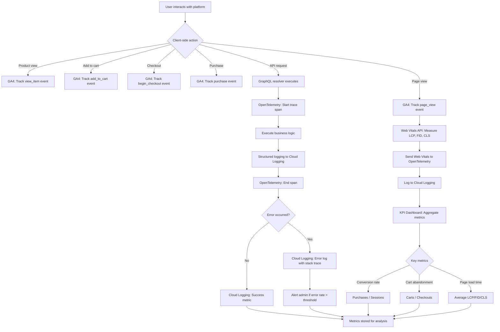

# Feature: Analytics & Monitoring

> **Purpose:**
> This document defines a single feature's intent, scope, user experience, and completion criteria.
> It is the **single source of truth** for planning, review, automation, and execution.

---

## 0. Metadata

All metadata is defined in the frontmatter above (between the `---` markers).

**Important:** The frontmatter is used by automation scripts to:

- Create GitHub issues
- Link features to parent epics
- Generate feature flags
- Track status and ownership

---

## 1. Overview

**The Analytics & Monitoring feature integrates Google Analytics 4, OpenTelemetry, and Web Vitals API to provide comprehensive user behavior tracking, distributed tracing, and performance monitoring.**

- Tracks user behavior via Google Analytics 4 (GA4) for product views, cart actions, checkout flow, and purchases
- Implements OpenTelemetry SDK for distributed tracing across Cloud Functions and GraphQL resolvers
- Monitors Core Web Vitals (LCP, FID, CLS) via Web Vitals API for real user performance data
- Integrates Lighthouse CI in GitHub Actions for automated performance regression detection
- Provides structured logging via Cloud Logging for error tracking and debugging
- Creates KPI dashboard for business metrics (conversion rate, cart abandonment, page load time)

This feature introduces meaningful change by enabling data-driven decision-making, proactive performance optimization, and rapid issue detection before they impact users at scale.

## Flow Diagram



Caption: "Analytics and monitoring flow from user interactions through event tracking, distributed tracing, and KPI aggregation."

---

## 2. User Problem

**Development and product teams need visibility into user behavior, performance bottlenecks, and errors to make informed decisions and maintain platform quality.**

### Who experiences the problem

- **Product managers** who need data on user behavior (product views, cart abandonment, conversion rates) to prioritize features
- **Developers** who need to debug production issues and understand performance bottlenecks
- **Operations teams** who need to detect and respond to errors before they impact large user populations
- **Business stakeholders** who need KPIs to measure platform success and ROI

### When and in what situations it occurs

- Product teams launch a new feature but have no data on adoption or user engagement
- Performance degrades over time but teams don't notice until users complain
- Production errors occur but are invisible until support tickets accumulate
- Cart abandonment is high but teams don't know which step in the checkout flow is problematic
- Page load times vary wildly across users but aggregate metrics hide the worst experiences

### Current friction

Without analytics and monitoring:
- Product decisions are based on intuition rather than data (high risk of building the wrong thing)
- Performance regressions go undetected until users report slow page loads
- Errors in production are invisible, leading to silent failures and data loss
- No way to measure business impact of platform changes (conversion rate, revenue)
- Debugging production issues requires manual log searching (high time cost)

### Why existing behavior is insufficient

- Server logs alone don't capture client-side user behavior (page views, clicks, navigation patterns)
- Aggregate metrics hide outliers (99th percentile performance issues)
- Reactive error detection (waiting for user complaints) allows issues to compound
- Lack of distributed tracing makes debugging complex multi-service flows impossible

---

## 3. Goals

### User Experience Goals

- **Proactive performance optimization**: Identify and fix slow page loads before users complain
- **Reliable error-free experience**: Detect and resolve errors rapidly to minimize user impact
- **Data-driven feature development**: Build features users actually need based on behavior data

### Business / System Goals

- **Measure conversion funnel**: Track users from product view → cart → checkout → purchase to identify drop-off points
- **Optimize cart abandonment**: Reduce cart abandonment rate by identifying friction points
- **Monitor Core Web Vitals**: Maintain Google SEO ranking by meeting Core Web Vitals thresholds (LCP <2.5s, FID <100ms, CLS <0.1)
- **Distributed tracing**: Debug production issues efficiently with end-to-end request tracing
- **KPI visibility**: Provide stakeholders with real-time dashboard of key business metrics

---

## 4. Non-Goals

**Explicitly state what this feature does not attempt to solve.**

- **User session recording**: No pixel-perfect session replay or heatmaps (privacy concerns and cost); event tracking only
- **Real-time alerting**: No real-time Slack/PagerDuty alerts; monitoring dashboards must be checked manually (automated alerting deferred to future work)
- **A/B testing framework**: No built-in experimentation platform; analytics data can inform manual A/B tests
- **Custom analytics dashboards**: Only predefined KPI dashboard provided; custom dashboards require direct Cloud Logging/GA4 access
- **User privacy compliance automation**: No automated cookie consent management or GDPR compliance features (manual implementation required)
- **Third-party tool integrations**: No Hotjar, Mixpanel, or Segment integrations; GA4 and OpenTelemetry only
- **Mobile app analytics**: Web platform only; native mobile app analytics out of scope

---

## 5. Functional Scope

**Describe what the feature enables at a conceptual level.**

### Core Capabilities

- **Google Analytics 4 Integration**: Track page views, e-commerce events (view_item, add_to_cart, begin_checkout, purchase), and custom events
- **OpenTelemetry Distributed Tracing**: Instrument Cloud Functions and GraphQL resolvers with trace spans and context propagation
- **Web Vitals Monitoring**: Measure and report Core Web Vitals (LCP, FID, CLS) from real user sessions
- **Lighthouse CI Integration**: Run Lighthouse performance audits on every pull request to detect regressions
- **Structured Logging**: Emit JSON-formatted logs to Cloud Logging with consistent schema (timestamp, severity, traceId, message, metadata)
- **Error Tracking**: Capture and log JavaScript errors and GraphQL errors with stack traces
- **KPI Dashboard**: Display conversion rate, cart abandonment rate, average page load time, error rate, and session count

### Expected Behaviors

- Analytics events are sent asynchronously (do not block user interactions)
- Web Vitals measurements are sent to Cloud Logging after page lifecycle completes
- Distributed traces include trace ID in all logs for correlation
- Lighthouse CI fails pull requests if performance scores drop below thresholds (e.g., Performance <90)
- Error logs include user context (user ID, session ID, page URL) for debugging

### System Responsibilities

- Initialize GA4 with measurement ID and send events via gtag.js
- Initialize OpenTelemetry SDK in Cloud Functions with trace exporter to Cloud Trace
- Instrument GraphQL resolvers to create spans for each query/mutation
- Report Web Vitals metrics on page unload or visibility change
- Aggregate KPI metrics from Cloud Logging and GA4 data for dashboard display

---

## 6. Dependencies & Assumptions

**List conditions required for this feature to function as intended.**

### Dependencies

- **F-002 (Mobile-First Responsive UI Foundation)**: Web Vitals API requires browser support; measured on client-side
- **Google Analytics 4 account**: GA4 property must be created with measurement ID
- **Google Cloud Platform**: OpenTelemetry traces exported to Cloud Trace; logs stored in Cloud Logging
- **GitHub Actions**: Lighthouse CI integrated into PR workflow

### Assumptions

- **Users have modern browsers**: Web Vitals API supported in Chrome 77+, Firefox 116+, Safari 15.4+
- **Users allow analytics cookies**: GA4 tracking requires cookie consent (implicit consent in MVP; GDPR compliance deferred)
- **Network connectivity is reliable**: Analytics events sent asynchronously; network failures result in data loss (no retry in MVP)
- **Developers review Lighthouse reports**: CI fails provide feedback, but developers must act on recommendations
- **Cloud Logging is monitored**: KPI dashboard must be accessed manually; no automated alerts

### External Constraints

- **GA4 data retention**: Free tier retains data for 14 months; extended retention requires Google Analytics 360
- **Cloud Logging retention**: Default 30-day retention; extended retention requires Cloud Storage export
- **Lighthouse CI performance**: Lighthouse audits add 1-2 minutes to PR build time
- **OpenTelemetry overhead**: Tracing adds <5ms latency per request (negligible but measurable)

---

## 7. User Stories & Experience Scenarios

> This section defines **how users live with the feature**.
> Scenarios must focus on **quality of life and lifecycle experience**, not just technical failures.

---

### User Story 1 — Product Manager Analyzing Conversion Funnel

**As a** product manager tracking user behavior  
**I want** to see conversion funnel metrics from product view to purchase  
**So that** I can identify where users drop off and prioritize improvements

---

#### Scenarios

##### Scenario 1.1 — First-Time KPI Dashboard Access

**Given** a product manager accessing the KPI dashboard for the first time  
**When** they log in to the dashboard (authenticated access)  
**Then** the dashboard displays key metrics: Total sessions, Product views, Add-to-cart actions, Checkouts initiated, Purchases completed, Conversion rate (%), Cart abandonment rate (%)  
**And** metrics are displayed for the last 7 days by default with date range selector  
**And** each metric includes a trend indicator (up/down arrow vs. previous period)

---

##### Scenario 1.2 — Returning to Track Conversion Trends

**Given** a product manager who reviewed the dashboard last week  
**When** they return to the dashboard and select a date range (last 30 days)  
**Then** the dashboard updates to show metrics for the selected period  
**And** conversion rate trend is visualized as a line chart over time  
**And** the product manager can identify specific dates with conversion drops

---

##### Scenario 1.3 — Interrupted Dashboard Session

**Given** a product manager viewing the dashboard but navigating away mid-session  
**When** they return to the dashboard later  
**Then** the dashboard loads with default date range (last 7 days)  
**And** previously selected filters are not persisted (no session state in MVP)  
**And** the product manager can re-select filters without penalty

---

##### Scenario 1.4 — Unexpected Data Delay

**Given** a product manager checking the dashboard for yesterday's data  
**When** they load the dashboard in the morning  
**Then** data for the previous day is available (GA4 processes data with <24h delay)  
**And** a timestamp displays when data was last updated (e.g., "Last updated: Today 3:00 AM")  
**And** the product manager understands data is not real-time

---

##### Scenario 1.5 — High-Volume Data Aggregation Performance

**Given** the platform processes 10,000 sessions per day  
**When** the product manager loads the KPI dashboard for a 30-day period  
**Then** the dashboard aggregates 300,000 sessions' worth of data  
**And** the page loads within 5 seconds  
**And** metrics are accurate (no sampling or approximation)

---

##### Scenario 1.6 — Localization of Dashboard (India-Specific)

**Given** a product manager in India accessing the KPI dashboard  
**When** they view the dashboard  
**Then** dates are displayed in DD/MM/YYYY format  
**And** currency is shown as INR (₹) for revenue metrics  
**And** timestamps are in IST timezone  
**And** language is English (no regional language support in MVP)

---

### User Story 2 — Developer Debugging Performance Issues

**As a** developer investigating slow page loads  
**I want** to see Web Vitals data and distributed traces for problematic requests  
**So that** I can identify bottlenecks and optimize performance

---

#### Scenarios

##### Scenario 2.1 — First-Time Web Vitals Analysis

**Given** a developer noticing user complaints about slow page loads  
**When** they access Cloud Logging and filter by "web_vitals" log type  
**Then** logs display LCP, FID, and CLS measurements for real user sessions  
**And** each log includes page URL, user agent, and timestamp  
**And** the developer can filter by LCP >2.5s to find slow pages

---

##### Scenario 2.2 — Returning to Track Performance Trends

**Given** a developer who optimized a page last week  
**When** they query Cloud Logging for Web Vitals over the past 14 days  
**Then** they can compare LCP metrics before and after the optimization  
**And** aggregate metrics (median, 95th percentile) show improvement  
**And** the developer can verify the optimization was effective

---

##### Scenario 2.3 — Interrupted Debugging Session

**Given** a developer investigating a slow GraphQL resolver  
**When** they view a distributed trace in Cloud Trace but navigate away  
**Then** the trace ID is logged and can be searched later  
**And** the trace remains accessible (Cloud Trace retention is 30 days)  
**And** the developer can resume debugging without losing context

---

##### Scenario 2.4 — Unexpected Trace Sampling

**Given** a developer looking for a specific slow request's trace  
**When** they search Cloud Trace by timestamp and endpoint  
**Then** the trace may not exist if sampling excluded it (OpenTelemetry samples 10% of requests by default)  
**And** the developer can increase sampling rate temporarily for debugging  
**And** a note in documentation explains sampling behavior

---

##### Scenario 2.5 — High-Volume Trace Analysis Performance

**Given** the platform handles 1,000 GraphQL requests per minute  
**When** a developer queries Cloud Trace for a specific endpoint  
**Then** Cloud Trace UI displays traces within 10 seconds  
**And** the developer can filter by latency (e.g., >1s) to find slow requests  
**And** trace spans show breakdown of time spent in each resolver

---

##### Scenario 2.6 — Localization of Logs (India-Specific)

**Given** a developer in India querying Cloud Logging  
**When** they view logs  
**Then** timestamps are displayed in IST timezone by default  
**And** log messages are in English (code-generated logs)  
**And** the developer can filter logs by severity, timestamp, or trace ID

---

### User Story 3 — DevOps Engineer Monitoring Error Rates

**As a** DevOps engineer monitoring platform health  
**I want** to track error rates and be alerted when thresholds are exceeded  
**So that** I can respond to issues before they impact large user populations

---

#### Scenarios

##### Scenario 3.1 — First-Time Error Rate Check

**Given** a DevOps engineer monitoring platform health  
**When** they access Cloud Logging and filter by severity: ERROR  
**Then** the logs display all errors with timestamps, stack traces, and user context  
**And** the engineer can group errors by error message to identify patterns  
**And** a count of errors per hour is displayed (aggregated metric)

---

##### Scenario 3.2 — Returning to Track Error Trends

**Given** a DevOps engineer who resolved an error spike last week  
**When** they query Cloud Logging for the past 7 days  
**Then** they can see error rate drop after the fix was deployed  
**And** the engineer can verify no new errors of the same type occurred  
**And** historical error data is retained for 30 days

---

##### Scenario 3.3 — Interrupted Error Investigation

**Given** a DevOps engineer investigating a GraphQL error  
**When** they find the trace ID in the error log but navigate away  
**Then** they can copy the trace ID and search for it later in Cloud Trace  
**And** the trace provides full request context (query, variables, user ID)  
**And** the engineer can resume debugging without re-searching logs

---

##### Scenario 3.4 — Unexpected Error Rate Spike

**Given** a new deployment introduces a bug causing 50 errors per minute  
**When** the DevOps engineer checks Cloud Logging  
**Then** the error rate is visible in the log volume chart (spike at deployment time)  
**And** no automated alert is triggered (manual monitoring in MVP)  
**And** the engineer must manually identify the spike and investigate

---

##### Scenario 3.5 — High-Volume Log Query Performance

**Given** the platform generates 1 million log entries per day  
**When** a DevOps engineer queries Cloud Logging for errors in the past 30 days  
**Then** the query completes within 10 seconds (Cloud Logging indexes logs)  
**And** results are paginated (1000 per page) for efficient browsing  
**And** the engineer can export logs to BigQuery for deeper analysis

---

##### Scenario 3.6 — Localization of Error Alerts (India-Specific)

**Given** a DevOps engineer in India monitoring errors  
**When** they view error logs  
**Then** timestamps are in IST timezone  
**And** error stack traces include file paths and line numbers  
**And** user context includes user ID and session ID (no PII in logs)

---

### User Story 4 — Developer Ensuring No Performance Regression

**As a** developer submitting a pull request  
**I want** Lighthouse CI to audit my changes and flag performance regressions  
**So that** I maintain high performance standards without manual testing

---

#### Scenarios

##### Scenario 4.1 — First Pull Request with Lighthouse CI

**Given** a developer submitting a pull request with frontend changes  
**When** the GitHub Actions CI workflow runs  
**Then** Lighthouse CI audits the built site and generates a performance report  
**And** the report includes Performance, Accessibility, Best Practices, and SEO scores  
**And** the PR status check passes if all scores meet thresholds (Performance ≥90)

---

##### Scenario 4.2 — Returning to Fix Performance Regression

**Given** a developer whose PR failed Lighthouse CI due to low Performance score (85)  
**When** they review the Lighthouse report in the CI logs  
**Then** the report highlights specific issues (e.g., "Largest Contentful Paint: 3.2s")  
**And** recommendations are provided (e.g., "Optimize images, defer non-critical JavaScript")  
**And** the developer can make fixes and re-run CI

---

##### Scenario 4.3 — Interrupted PR Review

**Given** a developer who started reviewing a Lighthouse report but navigated away  
**When** they return to the PR later  
**Then** the Lighthouse report is accessible in the CI artifacts  
**And** the developer can download the HTML report for offline review  
**And** no progress is lost

---

##### Scenario 4.4 — Unexpected Lighthouse Failure (Flaky Test)

**Given** a developer whose PR passed Lighthouse CI on first run but failed on re-run  
**When** they compare the two reports  
**Then** minor score variations (±5 points) are expected due to CI environment variability  
**And** the developer can re-run CI to confirm it's a flake, not a real regression  
**And** documentation explains score variability and mitigation strategies

---

##### Scenario 4.5 — Lighthouse CI Performance on Large PRs

**Given** a developer submitting a PR with 50+ file changes  
**When** Lighthouse CI runs  
**Then** the audit completes within 3 minutes (builds site + runs Lighthouse)  
**And** the CI workflow does not time out  
**And** the developer receives timely feedback without long wait times

---

##### Scenario 4.6 — Localization of Lighthouse Reports (India-Specific)

**Given** a developer in India reviewing a Lighthouse report  
**When** they open the HTML report  
**Then** metrics are displayed in standard units (seconds, milliseconds)  
**And** recommendations are in English  
**And** the report is timezone-agnostic (Lighthouse measures relative performance)

---

## 8. Edge Cases & Constraints (Experience-Relevant)

**Include only cases that materially affect user experience.**

### Hard Limits

- **Cloud Logging retention**: Default 30 days; older logs are deleted unless exported to Cloud Storage
- **GA4 data retention**: 14 months for free tier; extended retention requires Google Analytics 360
- **OpenTelemetry sampling rate**: Default 10% of requests are traced; adjust sampling rate to balance cost vs. observability
- **Lighthouse CI timeout**: Lighthouse audits must complete within 5 minutes or CI fails

### Irreversible Actions

- **Log deletion**: Logs older than retention period are permanently deleted; export to Cloud Storage if long-term retention required
- **GA4 event data**: Once events are sent to GA4, they cannot be deleted or edited (immutable data)

### Compliance Constraints

- **User privacy**: GA4 tracking requires cookie consent in GDPR regions; MVP assumes implicit consent (India-only)
- **PII in logs**: Do not log personally identifiable information (email, phone number, address) in Cloud Logging
- **Data export**: GA4 and Cloud Logging data can be exported to BigQuery for compliance audits

---

## 9. Implementation Tasks (Execution Agent Checklist)

> This section provides the specific work items for the **Execution Agent**.
> Every task must map back to a specific scenario defined in Section 7.

```markdown
- [ ] T01 — Integrate Google Analytics 4 (GA4) with measurement ID (Scenario 1.1)
  - [ ] Unit Test: GA4 gtag.js script loads on all pages
  - [ ] E2E Test: Page view event sent to GA4 on page load
- [ ] T02 — Implement GA4 e-commerce event tracking (Scenario 1.1)
  - [ ] Unit Test: view_item event sent on product view with product ID and price
  - [ ] Unit Test: add_to_cart event sent on cart addition with product ID and quantity
  - [ ] Unit Test: begin_checkout event sent on checkout initiation
  - [ ] Unit Test: purchase event sent on order completion with transaction ID and revenue
  - [ ] E2E Test: Full conversion funnel tracked from product view to purchase
- [ ] T03 — Integrate Web Vitals API for LCP, FID, CLS measurement (Scenario 2.1)
  - [ ] Unit Test: Web Vitals library imported and initialized
  - [ ] Unit Test: LCP, FID, CLS metrics captured on page lifecycle events
  - [ ] Integration Test: Web Vitals sent to Cloud Logging via beacon API
  - [ ] E2E Test: Metrics logged for real user session
- [ ] T04 — Integrate OpenTelemetry SDK for distributed tracing (Scenario 2.1, 3.3)
  - [ ] Unit Test: OpenTelemetry SDK initialized in Cloud Functions with Cloud Trace exporter
  - [ ] Unit Test: Trace span created for each GraphQL resolver
  - [ ] Integration Test: Trace ID propagated across function invocations
  - [ ] E2E Test: End-to-end trace visible in Cloud Trace for sample request
- [ ] T05 — Implement structured logging to Cloud Logging (Scenario 3.1)
  - [ ] Unit Test: Logs emitted with consistent schema (timestamp, severity, traceId, message, metadata)
  - [ ] Unit Test: Error logs include stack traces and user context
  - [ ] Integration Test: Logs queryable in Cloud Logging by severity, trace ID, timestamp
- [ ] T06 — Integrate Lighthouse CI in GitHub Actions (Scenario 4.1, 4.2)
  - [ ] Unit Test: Lighthouse CI config includes performance thresholds (Performance ≥90)
  - [ ] Integration Test: Lighthouse CI runs on every PR and uploads report as artifact
  - [ ] E2E Test: PR status check fails if performance score drops below threshold
- [ ] T07 — Build KPI dashboard UI (Scenario 1.1, 1.2)
  - [ ] Unit Test: Dashboard fetches metrics from GA4 Data API and Cloud Logging
  - [ ] Unit Test: Dashboard calculates conversion rate and cart abandonment rate
  - [ ] E2E Test: Dashboard displays metrics for selected date range
  - [ ] E2E Test: Trend chart visualizes conversion rate over time
- [ ] T08 — Implement error tracking with stack traces (Scenario 3.1)
  - [ ] Unit Test: JavaScript errors captured via window.onerror handler
  - [ ] Unit Test: GraphQL errors logged with query, variables, and error message
  - [ ] Integration Test: Error logs include trace ID for correlation with traces
- [ ] T09 — Configure OpenTelemetry sampling rate (Scenario 2.4)
  - [ ] Unit Test: Sampling rate configurable via environment variable (default 10%)
  - [ ] Integration Test: Sampling rate enforced (only 10% of requests traced)
- [ ] T10 — Export Cloud Logging logs to Cloud Storage for long-term retention (Scenario 3.2)
  - [ ] Integration Test: Logs older than 30 days exported to Cloud Storage bucket
  - [ ] Integration Test: Exported logs queryable via BigQuery
- [ ] T11 — Implement GA4 custom events for key user actions (Scenario 1.1)
  - [ ] Unit Test: Custom event "wishlist_add" sent when user adds to wishlist
  - [ ] Unit Test: Custom event "order_cancel" sent when user cancels order
  - [ ] E2E Test: Custom events visible in GA4 dashboard
- [ ] T12 — [Rollout] Implement feature flag `analytics_monitoring_enabled` gating (Scenario 1.1)
  - [ ] Integration Test: Flag disabled prevents GA4 and OpenTelemetry initialization
  - [ ] Integration Test: Flag enabled allows full analytics and monitoring workflow
```

---

## 10. Acceptance Criteria (Verifiable Outcomes)

> These criteria are used by the **Execution Agent** and **Reviewers** to verify completion.
> Each criterion must be observable and testable.

```markdown
- [ ] AC1 — GA4 tracks page views and e-commerce events (view_item, add_to_cart, begin_checkout, purchase)
  - [ ] E2E test passed: Full conversion funnel tracked from product view to purchase
  - [ ] Integration test passed: Events visible in GA4 dashboard within 24 hours
- [ ] AC2 — Web Vitals API measures and reports LCP, FID, CLS to Cloud Logging
  - [ ] Unit test passed: Web Vitals metrics captured on page lifecycle events
  - [ ] E2E test passed: Metrics logged for real user session with valid values
- [ ] AC3 — OpenTelemetry SDK traces GraphQL resolvers with distributed context
  - [ ] Integration test passed: Trace ID propagated across function invocations
  - [ ] E2E test passed: End-to-end trace visible in Cloud Trace with resolver spans
- [ ] AC4 — Structured logs emitted to Cloud Logging with consistent schema
  - [ ] Unit test passed: Logs include timestamp, severity, traceId, message, metadata
  - [ ] Integration test passed: Logs queryable by severity and trace ID
- [ ] AC5 — Lighthouse CI runs on every PR and fails on performance regression
  - [ ] Integration test passed: Lighthouse CI uploads report as artifact
  - [ ] E2E test passed: PR status check fails if Performance score <90
- [ ] AC6 — KPI dashboard displays conversion rate, cart abandonment, and page load time
  - [ ] Unit test passed: Dashboard calculates metrics from GA4 and Cloud Logging data
  - [ ] E2E test passed: Dashboard loads within 5 seconds with accurate metrics
- [ ] AC7 — Error tracking captures JavaScript and GraphQL errors with stack traces
  - [ ] Unit test passed: window.onerror handler logs client-side errors
  - [ ] Integration test passed: Error logs include trace ID for correlation
- [ ] AC8 — Cloud Logging logs exported to Cloud Storage for long-term retention
  - [ ] Integration test passed: Logs older than 30 days exported automatically
- [ ] AC9 — OpenTelemetry sampling rate is configurable and enforced
  - [ ] Unit test passed: Sampling rate set to 10% via environment variable
  - [ ] Integration test passed: Only 10% of requests traced
- [ ] AC10 — [Gating] Feature flag `analytics_monitoring_enabled` controls analytics initialization
  - [ ] Integration test passed: Flag disabled prevents GA4 and OpenTelemetry from loading
  - [ ] Integration test passed: Flag enabled allows full workflow
```

---

## 11. Rollout & Risk (If Applicable)

### Rollout Strategy

- **Phase 1 (0% rollout)**: Deploy to staging with flag `analytics_monitoring_enabled = false` in production; validate GA4 and OpenTelemetry integration
- **Phase 2 (100% rollout)**: Enable analytics and monitoring for all users in production; no gradual rollout needed (passive data collection)
- **Rollback trigger**: GA4 tracking breaks checkout flow (blocking user actions) or OpenTelemetry adds >50ms latency

### Risk Mitigation

- **Risk**: GA4 tracking script blocks page load, degrading user experience
  - **Mitigation**: Load gtag.js asynchronously with defer attribute; use minimal inline snippet to prevent render-blocking
- **Risk**: Web Vitals beacon API sends excessive data, impacting user bandwidth
  - **Mitigation**: Send Web Vitals data only on page unload or visibility change (not continuously); batch metrics
- **Risk**: OpenTelemetry tracing overhead degrades API performance
  - **Mitigation**: Sample 10% of requests by default; monitor trace export latency; disable tracing if overhead >5ms
- **Risk**: Cloud Logging costs exceed budget due to high log volume
  - **Mitigation**: Monitor Cloud Logging usage; implement log sampling (e.g., log 10% of successful requests, 100% of errors)

### Exit Criteria

- **Flag cleanup**: Remove `analytics_monitoring_enabled` flag after 30 days of stable production usage with no performance impact
- **Monitoring**: Establish baseline metrics for GA4 event volume, Cloud Logging ingestion rate, and OpenTelemetry trace count before removal

### Remote Config Flags

<!-- REMOTE_CONFIG_FLAG_START -->
| Context | Type | Namespace | Default (Dev) | Default (Stg) | Default (Prod) | Key |
|---------|------|-----------|---------------|---------------|----------------|-----|
| analytics_monitoring_enabled | BOOLEAN | client | true | true | false | _auto-generated_ |
| ga4_measurement_id | STRING | client | G-DEV-12345 | G-STG-67890 | G-PROD-11111 | _auto-generated_ |
| otel_sampling_rate | NUMBER | server | 1.0 | 0.5 | 0.1 | _auto-generated_ |
| web_vitals_sampling_rate | NUMBER | client | 1.0 | 0.5 | 0.1 | _auto-generated_ |
| lighthouse_performance_threshold | NUMBER | server | 80 | 90 | 90 | _auto-generated_ |
<!-- REMOTE_CONFIG_FLAG_END -->

**Flag Justification:**

- **analytics_monitoring_enabled**: Temporary flag for rollout control and emergency kill-switch; removal planned after 30-day stable deployment
- **ga4_measurement_id**: Permanent configuration flag to support different GA4 properties per environment without code changes
- **otel_sampling_rate**: Permanent configuration flag to tune OpenTelemetry overhead based on traffic volume and cost constraints
- **web_vitals_sampling_rate**: Permanent configuration flag to control Web Vitals beacon volume and bandwidth usage
- **lighthouse_performance_threshold**: Permanent configuration flag to adjust CI performance requirements based on business priorities

---

## 12. History & Status

- **Status:** Draft
- **Related Epics:** Quality & Observability (linked after automation)
- **Related Issues:** Created post-merge via GitHub automation
- **Dependencies:** F-002 (Mobile-First Responsive UI Foundation)

---

## Final Note

> This document defines **intent and experience**.
> Execution details are derived from it — never the other way around.
