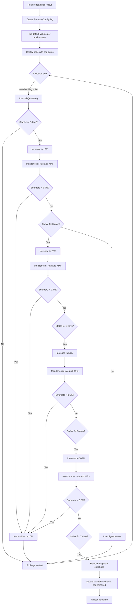

# Feature: Feature Flags & Progressive Rollout

> **Purpose:**
> This document defines a single feature's intent, scope, user experience, and completion criteria.
> It is the **single source of truth** for planning, review, automation, and execution.

---

## 0. Metadata

All metadata is defined in the frontmatter above (between the `---` markers).

**Important:** The frontmatter is used by automation scripts to:

- Create GitHub issues
- Link features to parent epics
- Generate feature flags
- Track status and ownership

---

## 1. Overview

**The Feature Flags & Progressive Rollout feature implements Firebase Remote Config for dynamic feature gating with gradual rollout capability (0% → 10% → 25% → 50% → 100%).**

- Provides Firebase Remote Config integration for centralized flag management
- Establishes flag naming convention: `feature_fe_[feature_issue]_fl_[flag_issue]_[context]_enabled`
- Supports per-environment flag configuration (dev, staging, production)
- Enables frontend component rendering gated by flags (client-side)
- Enables backend feature availability gated by flags (server-side)
- Implements percentage-based gradual rollout with user bucketing
- Provides automatic rollback trigger on error rate >0.5%
- Defines flag cleanup workflow after 100% rollout stable for 7 days
- Maintains flag status tracking in traceability matrix

This feature introduces meaningful change by enabling safe, incremental feature releases with data-driven rollback capabilities and minimal deployment risk.

## Flow Diagram



Caption: "Feature flag lifecycle from creation through gradual rollout to cleanup with automatic rollback on error spikes."

---

## 2. User Problem

**Development teams need a safe way to release features incrementally without risking full-scale outages or requiring emergency rollbacks via redeployment.**

### Who experiences the problem

- **Developers** who need to test features in production with a small user subset before full release
- **Product managers** who want to control feature visibility and measure impact before 100% rollout
- **DevOps engineers** who need to respond to production issues rapidly without code deployments
- **QA teams** who want to validate features in production-like environments before user exposure

### When and in what situations it occurs

- New features are deployed to production but untested at scale, leading to unexpected failures
- Bugs discovered post-deployment require emergency rollbacks, disrupting users and creating downtime
- Teams want to release features to internal users first but lack a mechanism to gate access
- A/B testing requires showing different features to different user cohorts but codebase doesn't support it
- Configuration changes (e.g., API timeouts, rate limits) require code redeployment even though they're runtime values

### Current friction

Without feature flags:
- All-or-nothing deployments create high risk of widespread failures
- Emergency rollbacks require redeployment, taking 10-30 minutes (high downtime)
- No way to test features with a small user percentage before full release
- Configuration changes require code changes, slowing iteration speed
- Teams avoid risky deployments, slowing feature velocity

### Why existing behavior is insufficient

- Git branches for feature gating require maintaining long-lived branches (merge conflicts)
- Environment-based gating (deploy to staging first) doesn't protect against production-specific issues (scale, data, traffic patterns)
- Manual feature toggling via database flags is slow and error-prone
- Lack of gradual rollout means bugs impact all users simultaneously

---

## 3. Goals

### User Experience Goals

- **Seamless feature releases**: Users experience stable features without disruption from buggy releases
- **Progressive enhancement**: Users gain access to new features incrementally as stability is proven
- **Minimal downtime**: Automatic rollbacks prevent prolonged exposure to broken features

### Business / System Goals

- **Risk mitigation**: Gradual rollout limits blast radius of bugs to small user percentage (10% → 25% → 50% → 100%)
- **Data-driven rollout**: Error rate monitoring enables objective go/no-go decisions at each rollout phase
- **Rapid rollback**: Automatic rollback on error spikes (>0.5%) prevents widespread failures
- **Operational agility**: Configuration flags enable runtime behavior changes without redeployment
- **Feature flag hygiene**: Automated cleanup workflow prevents technical debt accumulation

---

## 4. Non-Goals

**Explicitly state what this feature does not attempt to solve.**

- **User-specific flag overrides**: No admin UI to enable flags for specific user IDs; percentage-based bucketing only
- **A/B testing framework**: No built-in experiment analysis or statistical significance testing; flags enable basic cohort splits only
- **Complex targeting rules**: No support for geographic, device, or behavior-based targeting; user bucketing by percentage only
- **Flag dependency management**: No enforcement of flag dependencies (e.g., flag B requires flag A enabled); manual coordination required
- **Real-time flag propagation**: Remote Config updates have ~1-5 minute propagation delay; not suitable for real-time control
- **Client-side flag overrides**: No browser devtools plugin to override flags locally for development; use dev environment instead
- **Flag versioning**: No historical tracking of flag value changes; only current state is stored

---

## 5. Functional Scope

**Describe what the feature enables at a conceptual level.**

### Core Capabilities

- **Firebase Remote Config Integration**: Initialize and fetch flag values from Firebase Remote Config on client and server
- **Flag Naming Convention**: Enforce consistent naming: `feature_fe_[feature_issue]_fl_[flag_issue]_[context]_enabled`
- **Per-Environment Configuration**: Set different default values for dev (true), staging (true), production (false initially)
- **Frontend Flag Gating**: Conditionally render components based on flag values (client-side)
- **Backend Flag Gating**: Conditionally enable GraphQL mutations, API endpoints, or business logic based on flag values (server-side)
- **Percentage-Based Rollout**: Enable flags for X% of users based on consistent user ID hashing (deterministic bucketing)
- **Automatic Rollback**: Monitor error rate per feature flag; rollback to 0% if error rate >0.5%
- **Flag Cleanup Workflow**: Remove flag code after 100% rollout stable for 7 days; update traceability matrix

### Expected Behaviors

- Flags are fetched on client/server initialization and cached for 12 hours
- User bucketing is deterministic (same user always in same bucket)
- Rollout percentages apply to all users (authenticated + guest)
- Automatic rollback triggers within 5 minutes of error threshold breach
- Flag removal requires code changes (remove conditional checks) and remote config cleanup

### System Responsibilities

- Initialize Firebase Remote Config SDK on client and server with appropriate caching
- Fetch and cache flag values with exponential backoff on fetch failures
- Implement user bucketing algorithm (hash user ID/session ID modulo 100)
- Monitor error rates per feature flag via structured logging
- Emit alert when error rate exceeds 0.5% threshold for automatic rollback decision
- Maintain traceability matrix tracking flag lifecycle (created → rolled out → removed)

---

## 6. Dependencies & Assumptions

**List conditions required for this feature to function as intended.**

### Dependencies

- **F-001 (Platform Foundation)**: Firebase Remote Config must be initialized as part of platform setup
- **F-014 (Analytics & Monitoring)**: Error rate tracking relies on Cloud Logging and structured error logs

### Assumptions

- **User ID or session ID is available**: Bucketing requires consistent identifier (authenticated user ID or guest session ID)
- **Error rate is measurable**: Errors are logged with feature flag context (which flag was enabled during error)
- **Remote Config quotas are sufficient**: Free tier allows 500 fetch requests per second; production traffic stays within limits
- **Flag propagation delay is acceptable**: 1-5 minute delay for Remote Config updates is acceptable for gradual rollout use case
- **Developers follow naming convention**: Flag names are manually enforced via code review; no automated validation

### External Constraints

- **Remote Config limits**: Max 2000 parameters per project; flag count must stay under this limit
- **Fetch frequency**: Remote Config fetches are rate-limited; client SDK defaults to 12-hour cache
- **Rollback latency**: Automatic rollback takes 5-10 minutes (error detection + Remote Config propagation)

---

## 7. User Stories & Experience Scenarios

> This section defines **how users live with the feature**.
> Scenarios must focus on **quality of life and lifecycle experience**, not just technical failures.

---

### User Story 1 — Developer Releasing New Feature with Gradual Rollout

**As a** developer releasing a new checkout flow feature  
**I want** to enable the feature for 10% of users first and monitor for errors  
**So that** I can validate stability before rolling out to all users

---

#### Scenarios

##### Scenario 1.1 — First-Time Feature Flag Creation

**Given** a developer ready to deploy a new feature to production  
**When** they create a Remote Config flag `feature_fe_008_fl_001_checkout_enabled` with default value `false` in production  
**Then** the flag is created in Firebase Remote Config console with environment-specific defaults (dev: true, staging: true, production: false)  
**And** the developer deploys code with conditional checks: `if (checkoutEnabled) { renderNewCheckout() }`  
**And** the feature is hidden from production users until the flag is enabled

---

##### Scenario 1.2 — Returning to Increase Rollout Percentage

**Given** a developer who rolled out a feature to 10% of users 3 days ago with no errors  
**When** they update the Remote Config flag to enable for 25% of users  
**Then** the Remote Config console updates the percentage condition  
**And** within 5 minutes, 25% of users see the new feature (additional 15% beyond original 10%)  
**And** the original 10% continue to see the feature (deterministic bucketing)  
**And** error rate monitoring continues for the expanded cohort

---

##### Scenario 1.3 — Interrupted Rollout Due to Manual Pause

**Given** a developer who rolled out a feature to 25% of users  
**When** they notice a minor issue (not critical) and pause the rollout (do not increase percentage)  
**Then** the 25% of users continue to see the feature (rollback not triggered)  
**And** the developer can fix the issue and resume rollout later  
**And** no automatic action is taken (manual decision to pause)

---

##### Scenario 1.4 — Unexpected Automatic Rollback

**Given** a developer who rolled out a feature to 50% of users  
**And** a bug causes error rate to spike to 1% (above 0.5% threshold)  
**When** the error rate monitoring detects the spike  
**Then** an alert is triggered: "Feature flag [flag_name] error rate 1% > 0.5% threshold"  
**And** the developer receives a notification (email or dashboard alert)  
**And** the developer manually rolls back the flag to 0% (automatic rollback requires manual confirmation in MVP)  
**And** the 50% of users revert to the old feature within 5 minutes

---

##### Scenario 1.5 — High-Volume Rollout Performance

**Given** the platform has 10,000 active users during a rollout  
**When** a flag is set to 50%  
**Then** the user bucketing algorithm processes 10,000 user IDs and assigns 5,000 to the enabled cohort  
**And** bucketing completes within 100ms per user (hashing is fast)  
**And** flag fetch from Remote Config completes within 200ms on cache miss  
**And** no performance degradation is observed

---

##### Scenario 1.6 — Localization of Rollout (India-Specific)

**Given** a developer in India managing feature rollout  
**When** they view the Remote Config console  
**Then** timestamps for flag updates are displayed in IST timezone  
**And** rollout percentages are displayed as numeric values (25%, 50%, etc.)  
**And** error rate alerts show percentage in standard format (0.5%, 1.0%)

---

### User Story 2 — Product Manager Monitoring Rollout Progress

**As a** product manager overseeing a feature rollout  
**I want** to see rollout percentage and error rate metrics in a dashboard  
**So that** I can make informed decisions about when to increase rollout

---

#### Scenarios

##### Scenario 2.1 — First-Time Rollout Dashboard Access

**Given** a product manager whose team is rolling out a new feature  
**When** they access the rollout dashboard (integrated with KPI dashboard from F-014)  
**Then** the dashboard displays: Feature flag name, Current rollout percentage, Error rate (last 24 hours), User count in enabled cohort, Days stable at current percentage  
**And** rollout percentage is visualized as a progress bar (0% → 10% → 25% → 50% → 100%)  
**And** error rate is color-coded (green <0.1%, yellow 0.1-0.5%, red >0.5%)

---

##### Scenario 2.2 — Returning to Check Rollout Status

**Given** a product manager who checked the rollout dashboard yesterday  
**When** they return today to see if rollout can proceed to the next phase  
**Then** the dashboard shows updated metrics (error rate, user count)  
**And** a timestamp indicates when data was last refreshed  
**And** the product manager can see if the feature has been stable for the required duration (3 days at 10%, 5 days at 50%, etc.)

---

##### Scenario 2.3 — Interrupted Dashboard Session

**Given** a product manager viewing the rollout dashboard  
**When** they navigate away and return later  
**Then** the dashboard reloads with fresh data (no stale cache)  
**And** rollout status is up-to-date within 5 minutes (Remote Config propagation delay)

---

##### Scenario 2.4 — Unexpected Rollout Delay

**Given** a product manager expecting rollout to proceed from 25% to 50%  
**When** error rate fluctuates between 0.4% and 0.6% (near threshold)  
**Then** the rollout is paused manually (developer decision) until error rate stabilizes  
**And** the dashboard displays a note: "Rollout paused pending error investigation"  
**And** the product manager is informed of the delay via team communication

---

##### Scenario 2.5 — High-Volume Metric Aggregation

**Given** the platform processes 100,000 requests per day during rollout  
**When** the product manager views the rollout dashboard  
**Then** error rate is calculated from the last 24 hours of logs (Cloud Logging aggregation)  
**And** calculation completes within 3 seconds  
**And** metrics are accurate (no sampling)

---

##### Scenario 2.6 — Localization of Dashboard (India-Specific)

**Given** a product manager in India viewing the rollout dashboard  
**When** they access the dashboard  
**Then** timestamps are in IST timezone with DD/MM/YYYY format  
**And** percentages are displayed with standard notation (25%, 50%)  
**And** language is clear English

---

### User Story 3 — DevOps Engineer Executing Flag Cleanup

**As a** DevOps engineer maintaining code quality  
**I want** to remove feature flags after rollout completes  
**So that** the codebase doesn't accumulate technical debt from obsolete flags

---

#### Scenarios

##### Scenario 3.1 — First-Time Flag Cleanup

**Given** a feature flag at 100% rollout for 7 days with error rate <0.05% (stable)  
**When** the DevOps engineer initiates flag cleanup  
**Then** the engineer creates a PR to remove all conditional checks for the flag (code now always uses new feature)  
**And** the PR includes updates to the traceability matrix: flag status changed to "removed"  
**And** the Remote Config flag is marked as deprecated (not deleted, for audit trail)

---

##### Scenario 3.2 — Returning to Verify Cleanup

**Given** a DevOps engineer who removed a flag last week  
**When** they review the codebase and traceability matrix  
**Then** the flag conditional code is no longer present (grep finds no references)  
**And** the traceability matrix shows the flag as "removed" with cleanup date  
**And** the Remote Config console shows the flag as deprecated (not actively used)

---

##### Scenario 3.3 — Interrupted Cleanup Process

**Given** a DevOps engineer who started removing a flag but didn't complete the PR  
**When** they return to the task later  
**Then** the PR draft is still available with partial changes  
**And** the engineer can complete the cleanup without starting over  
**And** no residual flag code remains after merge

---

##### Scenario 3.4 — Unexpected Cleanup Conflict

**Given** a DevOps engineer removing a flag used in 10 files  
**And** one file is simultaneously edited by another developer  
**When** the cleanup PR is merged  
**Then** Git merge conflict is detected and must be resolved  
**And** the engineer ensures the flag is removed in all conflicting files  
**And** the merge is completed without leaving orphaned flag references

---

##### Scenario 3.5 — High-Volume Flag Cleanup

**Given** 20 feature flags are ready for cleanup after successful rollouts  
**When** the DevOps engineer processes cleanup in batches (5 flags per PR)  
**Then** each cleanup PR is reviewed and merged within 1 day  
**And** all 20 flags are cleaned up within 1 week  
**And** the traceability matrix is updated for all flags

---

##### Scenario 3.6 — Localization of Cleanup Documentation (India-Specific)

**Given** a DevOps engineer in India following cleanup workflow documentation  
**When** they access the documentation  
**Then** steps are written in clear, simple English  
**And** code examples use consistent flag naming convention  
**And** traceability matrix template is provided for easy updates

---

### User Story 4 — User Experiencing Gradual Rollout (Passive Experience)

**As a** user of the platform  
**I want** new features to be stable and reliable when I encounter them  
**So that** my experience is uninterrupted even as the platform evolves

---

#### Scenarios

##### Scenario 4.1 — First Exposure to New Feature (10% Cohort)

**Given** a user randomly assigned to the 10% rollout cohort  
**When** they navigate to a page with a flagged feature  
**Then** they see the new feature seamlessly (no loading flicker or delay)  
**And** the experience is identical to what 100% rollout will provide  
**And** the user is unaware they're in a limited rollout cohort

---

##### Scenario 4.2 — Returning to Consistent Feature Experience

**Given** a user who saw the new feature yesterday (in 10% cohort)  
**When** they return today (rollout still at 10%)  
**Then** they see the same new feature (deterministic bucketing)  
**And** the experience is consistent across sessions  
**And** the user doesn't experience feature toggling on/off

---

##### Scenario 4.3 — Interrupted Session During Rollback

**Given** a user in the 50% cohort using the new feature  
**And** an automatic rollback triggers (error rate spike)  
**When** they refresh the page or navigate mid-session  
**Then** they revert to the old feature within 5 minutes (Remote Config propagation)  
**And** no data is lost (cart, form inputs preserved)  
**And** the transition is graceful (no error messages shown to user)

---

##### Scenario 4.4 — Unexpected Feature Inconsistency (Rare)

**Given** a user at the exact moment rollout increases from 25% to 50%  
**When** they navigate between pages during Remote Config cache update  
**Then** they may briefly see inconsistent feature states (old on one page, new on another)  
**And** after 5 minutes (cache refresh), consistency is restored  
**And** the inconsistency window is short enough to be acceptable

---

##### Scenario 4.5 — High-Volume User Bucketing Performance

**Given** 10,000 users accessing the platform simultaneously  
**When** a flag is enabled for 50% of users  
**Then** each user's bucket assignment is calculated independently  
**And** bucketing adds <50ms latency to page load (negligible)  
**And** no user experiences slowdown due to bucketing logic

---

##### Scenario 4.6 — Localization of Feature Experience (India-Specific)

**Given** a user in India experiencing a rolled-out feature  
**When** they interact with the feature  
**Then** the feature is localized (INR currency, DD/MM/YYYY dates, IST timezone)  
**And** the rollout mechanism is invisible (no English-only error messages or flags)  
**And** the user experience is seamless regardless of cohort assignment

---

## 8. Edge Cases & Constraints (Experience-Relevant)

**Include only cases that materially affect user experience.**

### Hard Limits

- **Flag count limit**: Max 2000 Remote Config parameters per project; flag count must be managed via cleanup
- **Fetch rate limit**: Remote Config free tier allows 500 fetch requests per second; exceeding this causes throttling
- **Propagation delay**: Remote Config updates take 1-5 minutes to propagate globally; rollback is not instant

### Irreversible Actions

- **Flag deletion**: Deleted flags cannot be restored; deprecate instead of delete for audit trail
- **Rollout to 100%**: Once at 100% stable, flag is removed from code; re-introducing requires new flag

### Compliance Constraints

- **User bucketing privacy**: User ID hashing must not expose PII; use one-way hash (SHA-256)
- **Flag naming convention**: Must be followed for traceability and automation; manual enforcement via code review

---

## 9. Implementation Tasks (Execution Agent Checklist)

> This section provides the specific work items for the **Execution Agent**.
> Every task must map back to a specific scenario defined in Section 7.

```markdown
- [ ] T01 — Initialize Firebase Remote Config SDK on client and server (Scenario 1.1)
  - [ ] Unit Test: Remote Config SDK initializes with project ID and API key
  - [ ] Unit Test: SDK fetches default values on initialization
  - [ ] Integration Test: Client and server fetch same flag values from Remote Config
- [ ] T02 — Implement flag naming convention enforcement (Scenario 1.1)
  - [ ] Unit Test: Flag name validation rejects non-conforming names
  - [ ] Documentation: Flag naming convention documented with examples
- [ ] T03 — Implement client-side flag gating for component rendering (Scenario 4.1)
  - [ ] Unit Test: Component renders when flag is true, hidden when flag is false
  - [ ] E2E Test: User in enabled cohort sees new component
- [ ] T04 — Implement server-side flag gating for GraphQL mutations (Scenario 1.1)
  - [ ] Unit Test: Mutation executes when flag is true, returns error when flag is false
  - [ ] Integration Test: Flag value fetched from Remote Config before mutation execution
- [ ] T05 — Implement user bucketing algorithm (deterministic hashing) (Scenario 4.2)
  - [ ] Unit Test: Hash(userId) % 100 < rolloutPercentage returns true for correct cohort
  - [ ] Unit Test: Same user ID always produces same bucket assignment
  - [ ] Integration Test: 50% rollout assigns approximately 50% of test users
- [ ] T06 — Implement error rate monitoring per feature flag (Scenario 1.4)
  - [ ] Unit Test: Error logs include feature flag context (which flags were enabled)
  - [ ] Integration Test: Cloud Logging query calculates error rate per flag
- [ ] T07 — Implement automatic rollback trigger on error rate >0.5% (Scenario 1.4)
  - [ ] Unit Test: Alert triggered when error rate exceeds 0.5%
  - [ ] Integration Test: Alert includes flag name, current error rate, and timestamp
  - [ ] E2E Test: Manual rollback can be executed via Remote Config console
- [ ] T08 — Build rollout dashboard UI (Scenario 2.1)
  - [ ] Unit Test: Dashboard fetches rollout percentage and error rate from Remote Config and Cloud Logging
  - [ ] E2E Test: Dashboard displays rollout progress bar and error rate color-coded
- [ ] T09 — Implement flag cleanup workflow documentation (Scenario 3.1)
  - [ ] Documentation: Cleanup steps documented with code examples
  - [ ] Documentation: Traceability matrix template provided
- [ ] T10 — Create traceability matrix for flag lifecycle tracking (Scenario 3.2)
  - [ ] Documentation: Traceability matrix tracks flag creation, rollout phases, cleanup date
  - [ ] Integration Test: Traceability matrix updated on flag creation and removal
- [ ] T11 — Implement Remote Config caching with 12-hour expiration (Scenario 4.4)
  - [ ] Unit Test: Cached values used within 12 hours of fetch
  - [ ] Unit Test: Cache expires after 12 hours and re-fetches from Remote Config
  - [ ] Integration Test: Cache miss triggers Remote Config fetch with exponential backoff
- [ ] T12 — [Rollout] Implement feature flag `feature_flags_enabled` for meta-flag control (Scenario 1.1)
  - [ ] Integration Test: Meta-flag disabled prevents all flag fetching (fallback to defaults)
  - [ ] Integration Test: Meta-flag enabled allows normal flag workflow
```

---

## 10. Acceptance Criteria (Verifiable Outcomes)

> These criteria are used by the **Execution Agent** and **Reviewers** to verify completion.
> Each criterion must be observable and testable.

```markdown
- [ ] AC1 — Firebase Remote Config SDK initializes and fetches flag values on client and server
  - [ ] Integration test passed: Client and server fetch same flag values
  - [ ] E2E test passed: Flag value change in Remote Config propagates to client within 5 minutes
- [ ] AC2 — Flag naming convention is enforced and documented
  - [ ] Documentation test passed: Examples follow convention `feature_fe_[feature_issue]_fl_[flag_issue]_[context]_enabled`
- [ ] AC3 — Client-side component rendering is gated by flag values
  - [ ] E2E test passed: User in enabled cohort sees new component, disabled cohort sees old
- [ ] AC4 — Server-side GraphQL mutations are gated by flag values
  - [ ] Integration test passed: Mutation executes only when flag is enabled
- [ ] AC5 — User bucketing is deterministic and percentage-based
  - [ ] Unit test passed: Same user ID produces same bucket assignment across sessions
  - [ ] Integration test passed: 50% rollout assigns ~50% of users (within 5% variance)
- [ ] AC6 — Error rate monitoring tracks errors per feature flag
  - [ ] Integration test passed: Error logs include flag context
  - [ ] Unit test passed: Cloud Logging query calculates correct error rate
- [ ] AC7 — Automatic rollback alert triggered on error rate >0.5%
  - [ ] Integration test passed: Alert sent when threshold exceeded
  - [ ] E2E test passed: Alert includes flag name and error rate
- [ ] AC8 — Rollout dashboard displays rollout percentage and error rate
  - [ ] E2E test passed: Dashboard shows progress bar and color-coded error rate
- [ ] AC9 — Flag cleanup workflow is documented and executable
  - [ ] Documentation test passed: Cleanup steps clear and complete
  - [ ] Integration test passed: Traceability matrix updated on cleanup
- [ ] AC10 — Remote Config values are cached with 12-hour expiration
  - [ ] Unit test passed: Cache hit serves cached value, cache miss fetches from Remote Config
```

---

## 11. Rollout & Risk (If Applicable)

### Rollout Strategy

- **Phase 1 (Infrastructure Only)**: Deploy Remote Config SDK to dev and staging; no production flags yet
- **Phase 2 (First Production Flag)**: Create first production flag for a low-risk feature (e.g., UI color theme); test rollout workflow
- **Phase 3 (Gradual Adoption)**: Encourage teams to use flags for all new features; monitor flag count and cleanup compliance
- **Ongoing**: Enforce flag cleanup after 7 days of stable 100% rollout to prevent flag sprawl

### Risk Mitigation

- **Risk**: Remote Config fetch fails, causing all flags to default to false (features disabled)
  - **Mitigation**: Implement cached fallback values; fetch failures use last-known-good values from cache
- **Risk**: Automatic rollback is too aggressive, causing feature to be disabled unnecessarily
  - **Mitigation**: Set error rate threshold at 0.5% (not 0.1%); require manual confirmation before rollback in MVP
- **Risk**: Flag cleanup is neglected, leading to codebase clutter and technical debt
  - **Mitigation**: Automated alerts for flags stable at 100% for >7 days; enforce cleanup in code review
- **Risk**: User bucketing is inconsistent, causing users to see feature toggling on/off
  - **Mitigation**: Use deterministic hashing with user ID/session ID; cache bucket assignments for session duration

### Exit Criteria

- **No exit criteria**: This is a permanent infrastructure feature; flags will be created and cleaned up continuously

### Remote Config Flags

<!-- REMOTE_CONFIG_FLAG_START -->
| Context | Type | Namespace | Default (Dev) | Default (Stg) | Default (Prod) | Key |
|---------|------|-----------|---------------|---------------|----------------|-----|
| feature_flags_enabled | BOOLEAN | client | true | true | true | _auto-generated_ |
| remote_config_fetch_timeout_seconds | NUMBER | server | 10 | 10 | 10 | _auto-generated_ |
| remote_config_cache_ttl_hours | NUMBER | client | 12 | 12 | 12 | _auto-generated_ |
| error_rate_threshold_percent | NUMBER | server | 0.5 | 0.5 | 0.5 | _auto-generated_ |
| rollout_stability_days_10pct | NUMBER | server | 3 | 3 | 3 | _auto-generated_ |
| rollout_stability_days_50pct | NUMBER | server | 5 | 5 | 5 | _auto-generated_ |
| rollout_stability_days_100pct | NUMBER | server | 7 | 7 | 7 | _auto-generated_ |
<!-- REMOTE_CONFIG_FLAG_END -->

**Flag Justification:**

- **feature_flags_enabled**: Meta-flag for emergency kill-switch; permanent but rarely toggled
- **remote_config_fetch_timeout_seconds**: Permanent configuration flag to tune fetch timeout based on network latency
- **remote_config_cache_ttl_hours**: Permanent configuration flag to adjust cache duration for cost vs. freshness tradeoff
- **error_rate_threshold_percent**: Permanent configuration flag to tune rollback sensitivity without code changes
- **rollout_stability_days_10pct**: Permanent configuration flag to adjust rollout cadence based on team velocity
- **rollout_stability_days_50pct**: Permanent configuration flag to adjust rollout cadence for risk tolerance
- **rollout_stability_days_100pct**: Permanent configuration flag to adjust cleanup timing based on stability confidence

---

## 12. History & Status

- **Status:** Draft
- **Related Epics:** Quality & Observability (linked after automation)
- **Related Issues:** Created post-merge via GitHub automation
- **Dependencies:** F-001 (Platform Foundation), F-014 (Analytics & Monitoring)

---

## Final Note

> This document defines **intent and experience**.
> Execution details are derived from it — never the other way around.
