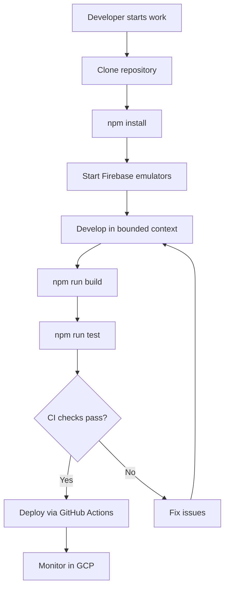

# Feature: Platform Foundation

> **Purpose:**
> This document defines the platform foundation feature's intent, scope, user experience, and completion criteria.
> It is the **single source of truth** for planning, review, automation, and execution.

---

## 0. Metadata

All metadata is defined in the frontmatter above (between the `---` markers).

**Important:** The frontmatter is used by automation scripts to:

- Create GitHub issues
- Link features to parent epics
- Generate feature flags
- Track status and ownership

---

## 1. Overview

The Platform Foundation establishes the core technical infrastructure for the itsme.fashion ecommerce platform. This feature enables the entire development team to build, test, and deploy domain-driven services within a unified monorepo architecture powered by Firebase and Google Cloud Platform.

This feature provides:
- npm workspace monorepo structure
- Firebase project configuration (Firestore, Auth, Functions, Storage, Remote Config)
- GraphQL Mesh gateway for service federation
- TypeScript build pipeline with esbuild
- DDD folder structure across all bounded contexts
- CI/CD automation with GitHub Actions
- Local development environment with Firebase emulators

Without this foundation, no other features can be developed or deployed.

## Flow Diagram



Caption: "Developer workflow enabled by platform foundation."

---

## 2. User Problem

**Engineering teams building modern serverless applications struggle with:**

- **Fragmented tooling**: Different build systems, deployment pipelines, and local testing environments across services create friction and inconsistency
- **Configuration sprawl**: Managing Firebase projects, service accounts, environment variables, and infrastructure as code across multiple repositories is error-prone
- **DDD implementation complexity**: Without clear folder structures and patterns, domain-driven design principles erode over time
- **Slow local development**: Testing serverless functions and Firebase integrations requires deploying to cloud environments, slowing feedback loops
- **Build inconsistency**: Lack of standardized TypeScript configuration and build tooling leads to runtime errors and deployment failures

**The cost of not solving this:**
- Developers waste time fighting tooling instead of delivering features
- Service integration is fragile and difficult to test
- Onboarding new engineers takes days instead of hours
- Production bugs emerge from environment configuration drift

---

## 3. Goals

### User Experience Goals (Developer Experience)

- **Instant onboarding**: New developers can clone, install, and run the entire platform locally in under 5 minutes
- **Unified workflow**: Single set of npm commands works consistently across all services and bounded contexts
- **Fast feedback loops**: Local emulators provide immediate testing without cloud deployment
- **Clear structure**: Folder organization makes it obvious where code belongs based on DDD principles
- **Confidence in deployment**: CI/CD pipeline catches issues before production

### Business / System Goals

- **Scalable architecture**: Serverless infrastructure scales automatically with user demand
- **Cost efficiency**: Pay-per-use model minimizes infrastructure costs during low traffic
- **Developer productivity**: Reduced tooling friction enables faster feature delivery
- **Code quality**: Automated linting, formatting, and testing enforces standards
- **Observable systems**: Structured logging and tracing support debugging and monitoring

---

## 4. Non-Goals

**This feature explicitly does NOT:**

- Implement any business logic or user-facing features
- Define UI component libraries or design systems (see F-002: Mobile-First Responsive UI Foundation)
- Configure production monitoring or alerting systems (see F-014: Analytics & Monitoring)
- Establish security policies or compliance frameworks (covered in PRD Section 20)
- Create deployment pipelines for mobile apps (web-only at this stage)
- Set up multi-region or high-availability infrastructure (single-region deployment)

---

## 5. Functional Scope

### Core Capabilities

**Monorepo Structure**
- npm workspaces configured for multiple packages
- Shared TypeScript configuration across services
- Centralized dependency management with workspace: protocol
- Wireit for task orchestration and caching

**Firebase Configuration**
- Firestore database in Native mode
- Firebase Authentication with email/password provider
- Cloud Functions (2nd generation) runtime
- Firebase Storage for file uploads
- Firebase Remote Config for feature flags
- Firebase Hosting for static web app

**GraphQL Gateway**
- GraphQL Mesh configured for schema federation
- Subgraph registration and discovery
- Unified GraphQL endpoint for frontend clients
- Schema stitching and transformation

**Domain-Driven Design Structure**
- Bounded contexts: Identity, Catalog, Shopping, Ordering, Fulfillment, Notifications, Admin
- Layered architecture per service: domain, application, infrastructure
- Aggregate roots, value objects, and domain events patterns
- Repository interfaces and Firestore implementations

**Build & Development Tooling**
- esbuild for fast TypeScript compilation
- ESLint for code quality
- Prettier for code formatting
- Node.js test runner for unit/integration tests
- Firebase emulator suite for local testing

**CI/CD Pipeline**
- GitHub Actions workflows for PR validation
- Automated testing on push
- Deployment to Firebase on merge to main
- Environment-specific configurations (dev, staging, production)

---

## 6. Dependencies & Assumptions

### Dependencies

- **External Services**: Google Cloud Platform account with billing enabled, Firebase project quota availability
- **Development Environment**: Node.js 22.x, npm 10.x, Git 2.x
- **GitHub**: Repository with Actions enabled, branch protection configured

### Assumptions

- Developers have familiarity with TypeScript, Node.js, and Firebase
- Internet connectivity is available for npm package installation and Firebase emulator downloads
- GCP project has necessary APIs enabled (Firestore, Cloud Functions, Identity Platform)
- Development machines meet minimum requirements (8GB RAM, 10GB free disk space)

---

## 7. User Stories & Experience Scenarios

### User Story 1 — New Developer Onboarding

**As a** new software engineer joining the team  
**I want** to set up the complete development environment quickly  
**So that** I can start contributing to features on my first day without tooling friction

---

#### Scenarios

##### Scenario 1.1 — First-Time Setup (Initial Experience)

**Given** a developer has cloned the repository for the first time  
**And** they have Node.js 22.x and npm installed  
**When** they run `npm install` in the repository root  
**Then** all workspace dependencies are installed successfully  
**And** Firebase CLI tools are installed locally  
**And** TypeScript compiles without errors  
**And** the setup completes in under 3 minutes  
**And** a success message displays next steps: "Run `npm run dev` to start emulators"

---

##### Scenario 1.2 — Daily Development Workflow (Returning Use)

**Given** a developer has completed initial setup  
**And** they are working on a feature in the Shopping bounded context  
**When** they run `npm run dev`  
**Then** Firebase emulators start automatically (Firestore, Auth, Functions)  
**And** the GraphQL gateway starts on http://localhost:4000  
**And** file watchers compile TypeScript on save  
**And** the terminal displays clear logs for each service  
**And** changes are reflected immediately without manual restart

---

##### Scenario 1.3 — Interrupted Session (Partial Completion)

**Given** a developer was running emulators and their system crashes  
**When** they restart their machine and run `npm run dev` again  
**Then** emulators start fresh with clean state  
**And** Firestore data persists from previous session (via emulator export)  
**And** no manual cleanup or configuration is required  
**And** the developer can resume work immediately

---

##### Scenario 1.4 — Build Failure (Unexpected Outcome)

**Given** a developer adds code with TypeScript compilation errors  
**When** they attempt to build with `npm run build`  
**Then** esbuild reports errors with file paths and line numbers  
**And** error messages are displayed in human-readable format  
**And** the terminal output highlights the specific lines causing errors  
**And** the build exits with status code 1 to fail CI pipelines  
**And** helpful guidance suggests running `npm run lint` to catch issues earlier

---

##### Scenario 1.5 — Large Monorepo Build Performance

**Given** the monorepo contains 10+ packages with hundreds of TypeScript files  
**When** a developer runs `npm run build`  
**Then** esbuild completes compilation in under 5 seconds  
**And** Wireit caches unchanged packages to skip redundant builds  
**And** progress indicators show which packages are building  
**And** the developer receives immediate feedback on build completion

---

##### Scenario 1.6 — Environment-Specific Configuration

**Given** a developer needs to test against staging Firebase project  
**When** they set environment variable `FIREBASE_ENV=staging`  
**And** run `npm run deploy`  
**Then** the correct Firebase project is selected automatically  
**And** staging-specific environment variables are loaded  
**And** confirmation prompt shows target project before deployment  
**And** deployment completes to staging environment only

---

### User Story 2 — CI/CD Automation

**As a** platform engineer  
**I want** automated validation and deployment pipelines  
**So that** code quality is enforced and deployments are reliable without manual intervention

---

#### Scenarios

##### Scenario 2.1 — Pull Request Validation

**Given** a developer opens a pull request with code changes  
**When** GitHub Actions CI workflow triggers  
**Then** linting runs across all changed files  
**And** unit tests execute for affected packages  
**And** build succeeds for all workspaces  
**And** status checks report pass/fail to the PR  
**And** results are visible within 3 minutes

---

##### Scenario 2.2 — Deployment to Production

**Given** a pull request has been approved and merged to main  
**When** the merge completes  
**Then** GitHub Actions deployment workflow triggers automatically  
**And** Firebase Functions deploy to production project  
**And** Firebase Hosting deploys static assets  
**And** deployment status is reported in GitHub commit status  
**And** rollback instructions are logged if deployment fails

---

##### Scenario 2.3 — Environment Isolation

**Given** multiple Firebase environments exist (dev, staging, production)  
**When** deployment workflows run  
**Then** each environment uses separate Firebase projects  
**And** environment-specific secrets are injected securely  
**And** cross-environment contamination is prevented  
**And** deployment logs clearly indicate target environment

---

##### Scenario 2.4 — Build Cache Optimization

**Given** CI runs on sequential commits with minimal changes  
**When** workflows execute  
**Then** npm dependencies are cached between runs  
**And** unchanged packages skip rebuild via Wireit  
**And** build time decreases by 50% or more on cache hits  
**And** cache keys are based on package-lock.json and source files

---

## 8. Edge Cases & Constraints

### Hard Limits

- **Firebase emulator ports**: Default ports (8080, 9099, 4000, etc.) must be available; conflicts require manual port configuration
- **Node.js version**: Requires Node.js 22.x; older or newer versions may cause compatibility issues
- **Firestore emulator data**: Limited to 1GB; exceeding this requires manual data cleanup
- **Concurrent builds**: Wireit caching assumes single developer per machine; shared build directories may conflict

### Compliance & Policy Constraints

- **GCP project quotas**: Cloud Functions deployment limited by project quotas (default: 1000 functions per project)
- **Firebase billing tier**: Free tier supports limited requests; production requires Blaze plan
- **GitHub Actions minutes**: Open-source projects have unlimited minutes; private repos may hit quota

### Irreversible Actions

- **Firebase project deletion**: Cannot be undone within 30 days
- **Firestore data schema changes**: Require manual migration scripts; no automatic rollback

---

## 9. Implementation Tasks (Execution Agent Checklist)

```markdown
- [ ] T01 — Initialize npm workspace monorepo with package.json at root
  - [ ] Unit Test: Verify workspace resolution resolves packages correctly
  - [ ] Integration Test: Install dependencies and confirm no peer dependency conflicts
- [ ] T02 — Configure Firebase project and initialize all services (Firestore, Auth, Functions, Storage, Remote Config, Hosting)
  - [ ] Integration Test: Deploy test function and verify invocation
  - [ ] E2E Test: Start emulators and verify all services are accessible
- [ ] T03 — Set up GraphQL Mesh gateway with subgraph federation
  - [ ] Unit Test: Validate mesh configuration file parses correctly
  - [ ] Integration Test: Query federated schema and verify response
- [ ] T04 — Create DDD folder structure for all bounded contexts
  - [ ] Unit Test: Verify folder structure matches DDD conventions
- [ ] T05 — Configure esbuild, TypeScript, ESLint, and Prettier tooling
  - [ ] Unit Test: Compile sample TypeScript file and verify output
  - [ ] Integration Test: Run linter and formatter across codebase
- [ ] T06 — Create GitHub Actions CI/CD workflows for PR validation and deployment
  - [ ] Integration Test: Trigger workflow on test PR and verify all jobs pass
  - [ ] E2E Test: Deploy to staging environment and verify function execution
- [ ] T07 — Document setup instructions in README.md
  - [ ] Unit Test: Follow setup steps on clean machine and verify success
```

---

## 10. Acceptance Criteria (Verifiable Outcomes)

```markdown
- [ ] AC1 — Developer can clone repo, run `npm install`, and have working environment in under 5 minutes
  - [ ] Integration test passed: Timed installation on fresh Ubuntu VM completes within timeout
- [ ] AC2 — `npm run dev` starts all Firebase emulators and GraphQL gateway successfully
  - [ ] E2E test passed: Emulators respond to health check requests on expected ports
- [ ] AC3 — TypeScript code compiles without errors across all workspaces
  - [ ] Unit test passed: `npm run build` exits with code 0
- [ ] AC4 — CI pipeline validates code quality on every PR
  - [ ] Integration test passed: Test PR triggers workflow and reports status
- [ ] AC5 — Deployment to Firebase succeeds from GitHub Actions
  - [ ] E2E test passed: Merge to main deploys functions and hosting to staging project
- [ ] AC6 — DDD folder structure exists for all 7 bounded contexts
  - [ ] Unit test passed: Script verifies presence of domain, application, infrastructure folders
```

---

## 11. Rollout & Risk

### Rollout Strategy

**No feature flag required** — This is foundational infrastructure that must be fully operational before any other features can be developed. There is no gradual rollout; the platform is either functional or not.

### Risk Mitigation

- **Risk**: Firebase emulator installation fails on some developer machines
  - **Mitigation**: Document alternative installation methods (Docker, manual download)
  - **Fallback**: Developers can temporarily use cloud Firebase project for testing

- **Risk**: GCP quota limits block deployments
  - **Mitigation**: Request quota increases proactively; monitor usage via GCP console

- **Risk**: Breaking changes in Firebase CLI or npm packages
  - **Mitigation**: Pin exact versions in package.json; test updates in isolated branch before merging

### Exit Criteria

N/A — Platform foundation is permanent infrastructure with no removal planned.

---

## 12. History & Status

- **Status:** Draft
- **Related Epics:** Foundation & Infrastructure
- **Related Issues:** TBD (created post-merge)
- **Dependencies:** None (this is the first feature)
- **Blocks:** All other features (F-002 through F-015)

---

## Final Note

> This document defines **intent and experience** for the development platform.
> Execution details are derived from it — never the other way around.
