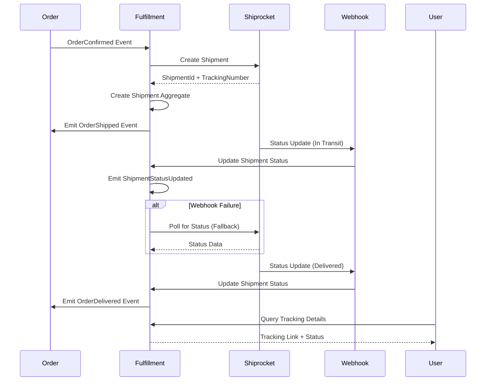

# Feature: Shipment Tracking & Fulfillment

> **Purpose:**
> This document defines a single feature's intent, scope, user experience, and completion criteria.
> It is the **single source of truth** for planning, review, automation, and execution.

---

## 0. Metadata

All metadata is defined in the frontmatter above (between the `---` markers).

**Important:** The frontmatter is used by automation scripts to:

- Create GitHub issues
- Link features to parent epics
- Generate feature flags
- Track status and ownership

---

## 1. Overview

**Shipment Tracking & Fulfillment** integrates Shiprocket for automated shipment creation, label generation, and real-time tracking updates, providing customers with transparent delivery status from order confirmation through delivery.

- **What this feature enables**: Automatic shipment creation when orders are confirmed, real-time tracking updates via webhooks with polling fallback, and customer access to tracking information
- **Why it exists**: To automate fulfillment logistics, reduce manual shipping workflows, and provide customers with delivery transparency
- **What meaningful change it introduces**: Establishes the Shipment aggregate as the authoritative record of fulfillment status, connects order lifecycle to physical delivery, and enables self-service tracking

This feature serves as the bridge between order management and physical product delivery, handling the entire fulfillment lifecycle.

## Flow Diagram



Caption: "Shipment lifecycle from order confirmation to delivery with webhook and polling mechanisms (See Scenarios 1.1, 2.1, 3.1)."

---

## 2. User Problem

**Describe the real problem experienced by users.**

Customers who purchase products online need visibility into when their order will ship, where it currently is, and when it will arrive, without needing to contact customer support.

- **Who experiences the problem**: All customers who place orders, especially those purchasing high-value beauty products where delivery confidence is critical
- **When and in what situations it occurs**: After order confirmation, during the wait period before delivery, when delivery is delayed, or when customers need to plan to receive packages
- **What friction, confusion, or inefficiency exists today**: Without tracking, customers have no visibility into shipment status, leading to anxiety, support inquiries, and delivery failures due to missed deliveries
- **Why existing behavior or solutions are insufficient**: Manual tracking number emails are delayed, tracking links may be incorrect, and customers must navigate multiple carrier websites for status updates

---

## 3. Goals

### User Experience Goals

- **Proactive transparency**: Customers receive tracking information automatically when orders ship
- **Real-time updates**: Shipment status reflects current delivery state without delays
- **Self-service tracking**: Customers can check tracking status anytime without contacting support
- **Delivery confidence**: Clear status updates reduce anxiety and set accurate expectations
- **Partial shipment clarity**: When items are backordered, customers understand what shipped and what's pending

### Business / System Goals

- Automate shipment creation to reduce manual fulfillment operations
- Integrate Shiprocket API for label generation and tracking
- Implement webhook-first tracking updates with polling fallback for resilience
- Support partial shipments when inventory is insufficient
- Emit domain events (OrderShipped, ShipmentStatusUpdated, OrderDelivered) for downstream processes
- Provide GraphQL API for tracking queries

---

## 4. Non-Goals

**Explicitly state what this feature does not attempt to solve.**

- **Multi-carrier selection**: Shiprocket handles carrier assignment; platform does not provide user-selected carriers
- **International shipping**: Initial release supports India domestic shipping only
- **Shipment modification**: Once created, shipments cannot be edited (e.g., address change requires new shipment)
- **Return label generation**: Return shipments are out of scope (deferred to returns feature)
- **Delivery scheduling**: Specific delivery time windows not supported (carrier-dependent)
- **Custom packaging**: Standard packaging per Shiprocket integration; no custom requests

---

## 5. Functional Scope

**Describe what the feature enables at a conceptual level.**

### Core Capabilities

- **Automatic Shipment Creation**: Listen for OrderConfirmed events and create shipments via Shiprocket API
- **Tracking Number Generation**: Receive tracking number and carrier info from Shiprocket
- **Webhook Status Updates**: Shiprocket sends real-time status updates to webhook endpoint
- **Polling Fallback**: Scheduled polling (every 6 hours) fetches tracking status if webhooks fail
- **Partial Shipment Support**: Ship available items immediately, create backorder for out-of-stock items
- **Customer Tracking Access**: Customers can view tracking link and current status via order details
- **Shipment Lifecycle**: Track shipment status (created, picked_up, in_transit, out_for_delivery, delivered, failed)

### System Responsibilities

- Create Shipment aggregate when OrderConfirmed event is received
- Call Shiprocket API to create shipment and generate label
- Store shipment data in Firestore `shipments` collection
- Expose webhook endpoint for Shiprocket status updates
- Implement polling job for webhook failure scenarios
- Emit OrderShipped, ShipmentStatusUpdated, and OrderDelivered domain events
- Provide GraphQL queries for shipment and tracking details
- Handle partial shipments by creating multiple shipments per order

---

## 6. Dependencies & Assumptions

**List conditions required for this feature to function as intended.**

### Dependencies

- **F-010: Order Management** (CRITICAL): Shipments are created from OrderConfirmed events
- **F-001: Platform Foundation**: Firebase Functions for webhook endpoint and polling jobs
- **Shiprocket API**: Third-party integration for shipment creation and tracking
- **Network Connectivity**: Webhook endpoint must be publicly accessible for Shiprocket callbacks

### Assumptions

- Shiprocket API is reliable and returns tracking numbers consistently
- Webhook delivery is best-effort; polling provides fallback for missed webhooks
- Orders are confirmed (status: confirmed) before shipment creation
- Inventory levels are accurate at shipment creation time
- Single shipping address per order (no split shipments to multiple addresses)
- Shiprocket handles carrier selection based on destination and package dimensions

### Constraints

- **API Rate Limits**: Shiprocket API rate limits apply (100 requests/minute typical)
- **Webhook Reliability**: Webhooks may be delayed or missed; polling ensures eventual consistency
- **Partial Shipment Complexity**: Backorders create separate shipments with different tracking numbers
- **Label Generation Time**: Shipment creation may take 5-10 seconds for API round-trip

---

## 7. User Stories & Experience Scenarios

> This section defines **how users live with the feature**.
> Scenarios must focus on **quality of life and lifecycle experience**, not just technical failures.

---

### User Story 1 — Shipment Notification After Order Confirmation

**As a** beauty product customer
**I want** to receive tracking information immediately when my order ships
**So that** I know my order is on its way and can track its delivery progress

---

#### Scenarios

##### Scenario 1.1 — First Shipment Notification

**Given** a user's order has been confirmed
**When** the fulfillment system creates a shipment via Shiprocket
**Then** the system should update the order status to "shipped"
**And** display tracking number and carrier information on the order detail page
**And** provide a direct link to track the shipment

---

##### Scenario 1.2 — Shipment Creation with Inventory

**Given** all items in an order are in stock
**When** the order transitions to "confirmed" status
**Then** the system automatically creates a single shipment for all items
**And** generates a shipping label via Shiprocket
**And** updates order status to "shipped" within 10 seconds

---

##### Scenario 1.3 — Delayed Shipment Creation

**Given** an order is confirmed but Shiprocket API is experiencing delays
**When** shipment creation is attempted
**Then** the system retries up to 3 times with exponential backoff
**And** displays "Preparing shipment..." status to the user
**And** successfully creates shipment when API recovers

---

##### Scenario 1.4 — Shipment Creation Failure

**Given** Shiprocket API is unavailable or returns an error
**When** shipment creation fails after all retries
**Then** the system logs the error and alerts admin
**And** displays "Shipment pending" status to user with message: "Your order will ship soon"
**And** retries shipment creation on next scheduled job (every 30 minutes)

---

##### Scenario 1.5 — High-Volume Shipment Creation

**Given** multiple orders are confirmed simultaneously during peak periods
**When** the system processes shipment creation requests
**Then** requests are queued and processed within API rate limits
**And** each shipment is created within 60 seconds
**And** users see individual shipment confirmations without delay

---

##### Scenario 1.6 — Mobile Shipment Notification Display

**Given** users on mobile devices
**When** they view order details after shipment creation
**Then** tracking information is prominently displayed with tappable tracking link
**And** carrier logo and estimated delivery date are visible

---

### User Story 2 — Real-Time Tracking Updates

**As a** customer with a shipped order
**I want** to see real-time updates on my shipment status without refreshing
**So that** I know exactly where my package is and when it will arrive

---

#### Scenarios

##### Scenario 2.1 — Webhook Status Update (Happy Path)

**Given** a shipment is in transit
**When** Shiprocket sends a webhook notification with status "in_transit"
**Then** the system immediately updates the shipment status in Firestore
**And** emits ShipmentStatusUpdated domain event
**And** displays updated status to user on next order detail view

---

##### Scenario 2.2 — Multiple Sequential Status Updates

**Given** a shipment progresses through multiple statuses (picked_up → in_transit → out_for_delivery)
**When** each webhook is received
**Then** the system updates status chronologically
**And** maintains status history timeline for user visibility
**And** displays most recent status with timestamp

---

##### Scenario 2.3 — Webhook Failure with Polling Fallback

**Given** Shiprocket webhook delivery fails (network issue, endpoint downtime)
**When** the scheduled polling job runs (every 6 hours)
**Then** the system queries Shiprocket API for shipment status
**And** updates local shipment status if changed
**And** emits appropriate domain events

---

##### Scenario 2.4 — Out-of-Order Webhook Delivery

**Given** webhooks are delivered out of order (e.g., "delivered" before "out_for_delivery")
**When** the system receives the out-of-order webhook
**Then** the system validates timestamp and only updates if newer
**And** prevents status regression (e.g., delivered → in_transit)
**And** logs anomaly for admin review

---

##### Scenario 2.5 — Delivery Confirmation

**Given** a shipment reaches "delivered" status
**When** the webhook or polling job confirms delivery
**Then** the system updates order status to "delivered"
**And** emits OrderDelivered domain event
**And** displays delivery confirmation with timestamp to user

---

##### Scenario 2.6 — Failed Delivery Attempt

**Given** carrier attempts delivery but customer is unavailable
**When** Shiprocket sends "delivery_failed" webhook
**Then** the system updates status to "delivery_failed"
**And** displays message to user: "Delivery attempted but failed. Carrier will retry"
**And** provides carrier contact information for rescheduling

---

### User Story 3 — Self-Service Tracking Access

**As a** customer with a shipped order
**I want** to view tracking details anytime without logging in
**So that** I can check delivery status conveniently from any device

---

#### Scenarios

##### Scenario 3.1 — Authenticated User Tracking Access

**Given** an authenticated user has a shipped order
**When** they view order details
**Then** the system displays current shipment status, tracking number, carrier name, and tracking link
**And** status timeline shows all historical updates with timestamps

---

##### Scenario 3.2 — Guest User Tracking Access

**Given** a guest user looks up their order via email + order number
**When** the order has been shipped
**Then** the system displays identical tracking information as authenticated users
**And** tracking link opens carrier website in new tab

---

##### Scenario 3.3 — Direct Tracking Link Access

**Given** a user receives tracking link via email notification
**When** they click the link (without logging in)
**Then** the system displays tracking details using tracking number parameter
**And** shows current status and estimated delivery date

---

##### Scenario 3.4 — Tracking for Multiple Shipments (Partial Shipment)

**Given** an order has multiple shipments (partial shipment scenario)
**When** the user views order details
**Then** the system displays separate tracking sections for each shipment
**And** clearly labels which items are in each shipment
**And** shows status for each shipment independently

---

##### Scenario 3.5 — Tracking Details Performance

**Given** a user requests tracking details
**When** the GraphQL query resolves
**Then** the system returns tracking data within 1 second
**And** caches Shiprocket API responses for 5 minutes to reduce external API calls

---

##### Scenario 3.6 — Mobile Tracking Display

**Given** users on mobile devices
**When** they view tracking details
**Then** status timeline is vertically scrollable with touch-friendly controls
**And** tracking link is tappable and opens in mobile browser or carrier app

---

### User Story 4 — Partial Shipment Handling

**As a** customer with an order containing out-of-stock items
**I want** to receive available items immediately and be informed about backordered items
**So that** I don't wait unnecessarily for my entire order

---

#### Scenarios

##### Scenario 4.1 — Partial Shipment Creation

**Given** an order contains 3 items: 2 in stock, 1 out of stock
**When** the order is confirmed
**Then** the system creates a shipment for the 2 available items
**And** creates a backorder for the out-of-stock item
**And** notifies the user: "2 of 3 items shipped. Remaining item will ship when available"

---

##### Scenario 4.2 — Backorder Fulfillment

**Given** a backordered item becomes available
**When** inventory is replenished
**Then** the system automatically creates a second shipment for the backordered item
**And** generates a new tracking number
**And** notifies the user: "Your backordered item has shipped"

---

##### Scenario 4.3 — Partial Shipment Tracking Clarity

**Given** an order has multiple shipments
**When** the user views tracking details
**Then** the system displays each shipment with labeled contents
**And** shows separate tracking numbers and statuses
**And** indicates which items are in each shipment

---

##### Scenario 4.4 — All Items Backordered

**Given** all items in an order are out of stock
**When** the order is confirmed
**Then** the system does not create a shipment
**And** displays order status as "confirmed (pending inventory)"
**And** notifies user: "Your order is confirmed. We'll ship items as they become available"

---

##### Scenario 4.5 — Partial Cancellation with Shipment

**Given** an order has partial shipment (some items shipped, some backordered)
**When** the user attempts to cancel the order
**Then** the system allows cancellation of backordered items only
**And** displays message: "Shipped items cannot be cancelled. Would you like to cancel remaining items?"

---

##### Scenario 4.6 — Partial Shipment Mobile View

**Given** users on mobile viewing orders with multiple shipments
**When** they view order details
**Then** each shipment is displayed in collapsible sections for easy navigation
**And** total items shipped vs backordered is summarized at top

---

## 8. Edge Cases & Constraints (Experience-Relevant)

**Include only cases that materially affect user experience.**

### Hard Limits

- **Shiprocket API Rate Limit**: 100 requests/minute; system queues requests to stay within limit
- **Webhook Retry**: Shiprocket retries webhooks up to 3 times; polling provides fallback
- **Tracking Data Retention**: Tracking status stored for 90 days post-delivery for customer support
- **Shipment Modification**: Once created, shipments cannot be edited; cancellation requires new workflow

### Irreversible Actions

- **Shipment Creation**: Once shipment is created in Shiprocket, label is generated and cannot be cancelled via API
- **Tracking Number Assignment**: Tracking numbers are permanent and cannot be changed

### Compliance & Policy Constraints

- **Domestic Shipping Only**: Initial release supports India domestic shipping (per PRD scope)
- **Carrier Selection**: Shiprocket determines carrier based on destination, weight, and pricing; users cannot choose carrier
- **Failed Delivery Handling**: After 3 failed delivery attempts, carrier returns package to origin; customer must contact support

---

## 9. Implementation Tasks (Execution Agent Checklist)

> This section provides the specific work items for the **Execution Agent**.
> Every task must map back to a specific scenario defined in Section 7.

```markdown
- [ ] T01 — Implement Shipment aggregate with ShipmentId, TrackingNumber, ShipmentStatus value object, orderId, carrier, createdAt, updatedAt, statusHistory fields (Scenario 1.1, 2.2)
  - [ ] Unit Test: Shipment creation with valid order data
  - [ ] Unit Test: Status transitions and history tracking
  
- [ ] T02 — Integrate Shiprocket API client with authentication and rate limiting (Scenario 1.2, 1.5)
  - [ ] Unit Test: API client authenticates and makes create shipment request
  - [ ] Unit Test: Rate limiter queues requests to stay within 100/min limit
  - [ ] Integration Test: Create shipment via Shiprocket sandbox API
  
- [ ] T03 — Create OrderShipped event handler that listens for OrderConfirmed events and creates shipment (Scenario 1.1, 1.2)
  - [ ] Unit Test: Shipment created from OrderConfirmed event
  - [ ] Integration Test: Event payload contains order details, shipping address
  
- [ ] T04 — Implement shipment creation with retry logic (3 retries, exponential backoff) (Scenario 1.3, 1.4)
  - [ ] Unit Test: Retry on API failure
  - [ ] Integration Test: Successful creation after transient failure
  
- [ ] T05 — Implement Firestore schema for shipments collection with indexes on orderId, trackingNumber, status, createdAt (Scenario 1.1, 3.1)
  - [ ] Unit Test: Firestore document structure validation
  - [ ] Integration Test: Query shipments by orderId
  
- [ ] T06 — Create webhook endpoint (Firebase Function) to receive Shiprocket status updates (Scenario 2.1)
  - [ ] Unit Test: Webhook signature validation
  - [ ] Unit Test: Status update parsed correctly
  - [ ] Integration Test: Webhook updates shipment status in Firestore
  
- [ ] T07 — Implement polling job (Cloud Scheduler + Firebase Function) to fetch status every 6 hours (Scenario 2.3)
  - [ ] Unit Test: Polling job fetches status for all in-transit shipments
  - [ ] Integration Test: Status updated from polling if webhook missed
  
- [ ] T08 — Implement out-of-order webhook handling with timestamp validation (Scenario 2.4)
  - [ ] Unit Test: Reject status updates older than current status timestamp
  - [ ] Unit Test: Prevent status regression (delivered → in_transit)
  
- [ ] T09 — Emit OrderShipped domain event on shipment creation (Scenario 1.1)
  - [ ] Unit Test: Event payload contains shipmentId, trackingNumber, carrier
  - [ ] Integration Test: Event published to event bus
  
- [ ] T10 — Emit ShipmentStatusUpdated domain event on status change (Scenario 2.1, 2.2)
  - [ ] Unit Test: Event payload contains shipmentId, oldStatus, newStatus, timestamp
  - [ ] Integration Test: Event triggers downstream processes (notifications)
  
- [ ] T11 — Emit OrderDelivered domain event when status reaches "delivered" (Scenario 2.5)
  - [ ] Unit Test: Event emitted only on delivered status
  - [ ] Integration Test: Order status updated to delivered
  
- [ ] T12 — Create GraphQL query: shipment(orderId) with authorization (Scenario 3.1, 3.2)
  - [ ] Unit Test: Return shipment details for authorized user/guest
  - [ ] E2E Test: Retrieve shipment, verify tracking number and status
  
- [ ] T13 — Create GraphQL query: trackingDetails(trackingNumber) for public tracking link (Scenario 3.3)
  - [ ] Unit Test: Return tracking details for any valid tracking number
  - [ ] E2E Test: Public tracking page displays status without authentication
  
- [ ] T14 — Implement partial shipment logic: split order items by inventory availability (Scenario 4.1, 4.2)
  - [ ] Unit Test: Create shipment for in-stock items, backorder out-of-stock items
  - [ ] Integration Test: Multiple shipments created for single order
  
- [ ] T15 — Implement backorder fulfillment: create shipment when inventory replenished (Scenario 4.2)
  - [ ] Unit Test: Listen for InventoryReplenished event, create backorder shipment
  - [ ] Integration Test: Second shipment created for backordered items
  
- [ ] T16 — Implement shipment tracking UI component (Lit web component) for order detail page (Scenario 3.1, 3.6)
  - [ ] E2E Test: Tracking section displays tracking number, status, carrier, and link
  - [ ] E2E Test: Mobile viewport renders tracking timeline vertically
  
- [ ] T17 — Implement multi-shipment UI for partial shipments (Scenario 4.3, 4.6)
  - [ ] E2E Test: Multiple shipments displayed with labeled contents
  - [ ] E2E Test: Collapsible sections for each shipment on mobile
  
- [ ] T18 — Implement public tracking page accessible via tracking link (Scenario 3.3)
  - [ ] E2E Test: Tracking page displays status for valid tracking number
  - [ ] E2E Test: Error message for invalid tracking number
  
- [ ] T19 — Implement loading and error states for shipment creation and tracking (Scenario 1.3, 1.4, 3.5)
  - [ ] E2E Test: Loading spinner during shipment creation
  - [ ] E2E Test: Error message if tracking fetch fails
  
- [ ] T20 — Implement Shiprocket webhook signature verification for security (Scenario 2.1)
  - [ ] Unit Test: Reject webhooks with invalid signatures
  - [ ] Integration Test: Only authenticated webhooks update shipment status
  
- [ ] T21 — Configure Firestore security rules for shipments collection (Scenario 3.1, 3.2)
  - [ ] Unit Test: Users can read shipments for their orders only
  - [ ] Integration Test: Firestore rules enforce authorization
  
- [ ] T22 — Implement status history tracking for timeline display (Scenario 2.2, 3.1)
  - [ ] Unit Test: Status history array updated on each status change
  - [ ] E2E Test: Timeline displays all historical statuses with timestamps
  
- [ ] T23 — Implement Shiprocket API response caching (5-minute TTL) for performance (Scenario 3.5)
  - [ ] Unit Test: Cache hit reduces external API calls
  - [ ] Integration Test: Cache expiry triggers fresh API call
  
- [ ] T24 — [Rollout] Implement feature flag: shipment_tracking_enabled for gradual rollout (Scenario All)
  - [ ] Integration Test: Feature flag controls shipment creation and tracking visibility
  
- [ ] T25 — [Rollout] Implement feature flag: partial_shipment_enabled for independent partial shipment rollout (Scenario 4.1)
  - [ ] Integration Test: Flag controls partial shipment logic and backorder creation
```

---

## 10. Acceptance Criteria (Verifiable Outcomes)

> These criteria are used by the **Execution Agent** and **Reviewers** to verify completion.
> Each criterion must be observable and testable.

```markdown
- [ ] AC1 — Shipments are created automatically when OrderConfirmed event is received (Scenario 1.1, 1.2)
  - [ ] Unit test passed: Shipment aggregate created with trackingNumber, carrier, status
  - [ ] Integration test passed: Shiprocket API called and returns tracking number
  - [ ] E2E test passed: Order status updates to "shipped", tracking displayed

- [ ] AC2 — Shipment creation retries on API failure (Scenario 1.3, 1.4)
  - [ ] Unit test passed: Retry logic executes up to 3 times on failure
  - [ ] Integration test passed: Shipment created after transient API error

- [ ] AC3 — Shiprocket webhook endpoint receives and processes status updates (Scenario 2.1)
  - [ ] Unit test passed: Webhook payload parsed and shipment status updated
  - [ ] Integration test passed: ShipmentStatusUpdated event emitted
  - [ ] E2E test passed: Shipment status reflects webhook update

- [ ] AC4 — Polling fallback fetches status when webhooks fail (Scenario 2.3)
  - [ ] Unit test passed: Polling job queries Shiprocket API for in-transit shipments
  - [ ] Integration test passed: Status updated from polling if webhook missed

- [ ] AC5 — Out-of-order webhooks are handled correctly (Scenario 2.4)
  - [ ] Unit test passed: Older status updates rejected based on timestamp
  - [ ] Unit test passed: Status regression prevented

- [ ] AC6 — OrderShipped event is emitted on shipment creation (Scenario 1.1)
  - [ ] Unit test passed: Event payload contains shipmentId, trackingNumber, carrier
  - [ ] Integration test passed: Event published to event bus

- [ ] AC7 — ShipmentStatusUpdated event is emitted on status change (Scenario 2.1, 2.2)
  - [ ] Unit test passed: Event payload contains status transition details
  - [ ] Integration test passed: Event triggers downstream processes

- [ ] AC8 — OrderDelivered event is emitted when shipment is delivered (Scenario 2.5)
  - [ ] Unit test passed: Event emitted only for "delivered" status
  - [ ] Integration test passed: Order status updated to "delivered"

- [ ] AC9 — Authenticated users can view shipment tracking details (Scenario 3.1)
  - [ ] Unit test passed: GraphQL query returns shipment for user's order
  - [ ] E2E test passed: Tracking section displays on order detail page

- [ ] AC10 — Guest users can view shipment tracking via order lookup (Scenario 3.2)
  - [ ] E2E test passed: Guest lookup displays tracking information

- [ ] AC11 — Public tracking link displays shipment status (Scenario 3.3)
  - [ ] Unit test passed: trackingDetails query returns status for valid tracking number
  - [ ] E2E test passed: Public tracking page accessible without login

- [ ] AC12 — Partial shipments are created for in-stock items (Scenario 4.1)
  - [ ] Unit test passed: Shipment created for available items, backorder for out-of-stock
  - [ ] Integration test passed: Multiple shipments created for single order
  - [ ] E2E test passed: User notified about partial shipment

- [ ] AC13 — Backorder shipments are created when inventory is replenished (Scenario 4.2)
  - [ ] Unit test passed: InventoryReplenished event triggers backorder shipment
  - [ ] Integration test passed: Second shipment created with new tracking number

- [ ] AC14 — Multi-shipment orders display separate tracking sections (Scenario 4.3, 4.6)
  - [ ] E2E test passed: Each shipment displayed with labeled contents
  - [ ] E2E test passed: Separate tracking numbers and statuses shown

- [ ] AC15 — Shipment creation respects Shiprocket API rate limits (Scenario 1.5)
  - [ ] Unit test passed: Rate limiter queues requests to stay within 100/min
  - [ ] Integration test passed: Requests processed without API errors

- [ ] AC16 — Tracking UI is mobile-optimized (320px-768px viewports) (Scenario 1.6, 3.6, 4.6)
  - [ ] E2E test passed: Tracking timeline renders vertically on mobile
  - [ ] E2E test passed: Tracking link is tappable with adequate touch target

- [ ] AC17 — Webhook signature verification prevents unauthorized updates (Scenario 2.1)
  - [ ] Unit test passed: Invalid signatures rejected
  - [ ] Integration test passed: Only authenticated webhooks update status

- [ ] AC18 — Firestore security rules enforce shipment authorization (Scenario 3.1, 3.2)
  - [ ] Integration test passed: Users can only read shipments for their orders

- [ ] AC19 — Status history is tracked and displayed in timeline (Scenario 2.2, 3.1)
  - [ ] Unit test passed: Status history array updated on each change
  - [ ] E2E test passed: Timeline displays all historical statuses

- [ ] AC20 — Shiprocket API responses are cached for performance (Scenario 3.5)
  - [ ] Unit test passed: Cache reduces external API calls
  - [ ] E2E test passed: Tracking details load within 1 second

- [ ] AC21 — [Gating] Feature flag shipment_tracking_enabled correctly controls visibility and access
  - [ ] Integration test passed: When false, shipment creation is disabled
  - [ ] Integration test passed: When true, all tracking features are accessible

- [ ] AC22 — [Gating] Feature flag partial_shipment_enabled correctly controls partial shipment logic
  - [ ] Integration test passed: When false, orders ship only when fully in stock
  - [ ] Integration test passed: When true, partial shipments and backorders are created
```

---

## 11. Rollout & Risk (If Applicable)

### Rollout Strategy

**Progressive Rollout**: Shipment Tracking & Fulfillment will be rolled out in phases to minimize risk:

1. **Phase 1 (0% → 10%)**: Internal testing with test orders and Shiprocket sandbox
2. **Phase 2 (10% → 25%)**: Early adopters with webhook monitoring
3. **Phase 3 (25% → 50%)**: Broader rollout with polling fallback active
4. **Phase 4 (50% → 100%)**: Full rollout once shipment creation success rate >99%

### Risk Mitigation

**Primary Risks**:
- **Shiprocket API downtime**: Retry logic and polling fallback ensure eventual shipment creation
- **Webhook delivery failures**: Polling every 6 hours provides fallback for missed webhooks
- **Rate limit exhaustion**: Queue and rate limiter prevent API errors during peak periods
- **Out-of-order status updates**: Timestamp validation prevents status regression
- **Partial shipment complexity**: Clear UI labeling reduces customer confusion

**Monitoring**:
- Shipment creation success rate (target: >99%)
- Webhook delivery success rate (target: >95%)
- Polling fallback activation rate (target: <5%)
- Tracking query performance (target: <1 second p95)
- Shiprocket API error rate (target: <1%)

### Exit/Cleanup Criteria

- Feature flags remain until 100% rollout is stable for 7 days
- After successful rollout, remove feature flag checks from code
- Monitor shipment-related support requests to identify UX improvements

### Remote Config Flags

<!-- REMOTE_CONFIG_FLAG_START -->
| Context | Type | Namespace | Default (Dev) | Default (Stg) | Default (Prod) | Key |
|---------|------|-----------|---------------|---------------|----------------|-----|
| shipment_tracking | BOOLEAN | client | true | false | false | feature_fe_f011_fl_001_shipment_tracking_enabled |
| partial_shipment | BOOLEAN | backend | true | false | false | feature_fe_f011_fl_002_partial_shipment_enabled |
| webhook_processing | BOOLEAN | backend | true | false | false | feature_fe_f011_fl_003_webhook_processing_enabled |
| polling_fallback | BOOLEAN | backend | true | true | true | feature_fe_f011_fl_004_polling_fallback_enabled |
<!-- REMOTE_CONFIG_FLAG_END -->

---

## 12. History & Status

- **Status:** Draft
- **Feature ID:** F-011
- **Dependencies:** F-010 (Order Management), F-001 (Platform Foundation)
- **Related Epics:** Order & Fulfillment
- **Related Issues:** TBD (created post-merge)

---

## Final Note

> This document defines **intent and experience**.
> Execution details are derived from it — never the other way around.
