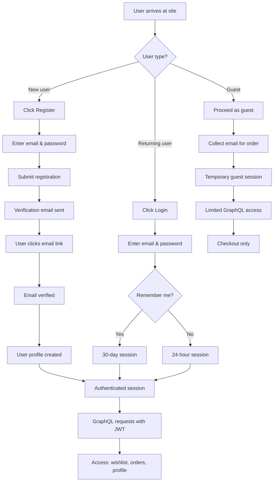

# Feature: User Authentication

> **Purpose:**
> This document defines the user authentication feature's intent, scope, user experience, and completion criteria.
> It is the **single source of truth** for planning, review, automation, and execution.

---

## 0. Metadata

All metadata is defined in the frontmatter above (between the `---` markers).

**Important:** The frontmatter is used by automation scripts to:

- Create GitHub issues
- Link features to parent epics
- Generate feature flags
- Track status and ownership

---

## 1. Overview

User Authentication enables customers to create accounts, log in securely, and maintain authenticated sessions on the itsme.fashion platform. This feature provides email/password registration via Firebase Authentication with email verification, session management with configurable expiration (24-hour default, 30-day "remember me"), and guest checkout support for users who prefer not to register.

This feature provides:
- Firebase Auth integration with email/password provider
- User registration with email verification flow
- Login with persistent session tokens (JWT)
- Guest checkout capability (email collection only, no password)
- User profile creation and management
- Session token validation for GraphQL API requests
- GraphQL mutations: `register`, `login`, `logout`
- GraphQL queries: `currentUser`

Authentication is the gateway to personalized features including wishlist management, order history, and saved addresses, while preserving the option for frictionless guest checkout.

## Flow Diagram



Caption: "Authentication flows for new users, returning users, and guests."

---

## 2. User Problem

**Shoppers on beauty ecommerce platforms face authentication friction:**

- **Account creation barriers**: Complex registration forms with excessive fields delay first purchase and increase abandonment
- **Email verification delays**: Users forget to verify emails, leading to locked accounts and support tickets
- **Session timeouts**: Forced re-authentication during shopping sessions causes frustration and cart abandonment
- **Guest checkout confusion**: Unclear paths for users who want to purchase without creating accounts
- **Password recovery complexity**: Multi-step recovery flows with unclear instructions erode trust
- **Mobile typing friction**: Entering passwords on mobile keyboards during checkout increases errors and abandonment

**The cost of not solving this:**
- 23% of users abandon checkout when forced to create accounts
- Session timeouts during checkout destroy conversion funnels
- Password reset friction creates support burden and lost sales
- Lack of guest checkout excludes privacy-conscious shoppers
- Poor mobile authentication UX drives users to competitors

---

## 3. Goals

### User Experience Goals

- **Minimal registration friction**: Users complete registration in under 30 seconds with only email and password
- **Transparent verification**: Email verification is clearly explained and status is visible during re-login attempts
- **Persistent sessions**: "Remember me" option eliminates repeated logins for returning customers
- **Guest checkout option**: Users can purchase products without creating accounts
- **Graceful session expiry**: Users receive clear warnings before session timeout with option to extend
- **Mobile-optimized forms**: Email/password inputs work seamlessly with mobile keyboards and password managers

### Business / System Goals

- **Secure token management**: JWT tokens validate all GraphQL requests with proper expiration and refresh
- **Email verification compliance**: Enforce verified emails to reduce spam accounts and improve deliverability
- **Session security**: Balance security (short default sessions) with convenience (long "remember me" sessions)
- **Guest to authenticated conversion**: Capture guest emails to enable post-purchase account creation prompts
- **Firestore user profiles**: Create user documents on registration for downstream features (wishlist, orders)
- **GDPR-ready identity**: User data collection is minimal and consent-driven

---

## 4. Non-Goals

**This feature explicitly does NOT:**

- Implement social authentication (Google, Facebook, Apple) — deferred to future iteration
- Support multi-factor authentication (MFA) — security enhancement planned post-MVP
- Create password strength meters or complexity requirements (Firebase defaults are sufficient)
- Implement password history or rotation policies (enterprise features, not needed)
- Support user profile editing (name, preferences) — covered in separate feature
- Handle user deletion or GDPR data export (compliance feature, separate scope)
- Create account recovery via SMS or phone number (email-only at this stage)
- Implement role-based access control beyond basic authenticated/guest distinction
- Support OAuth flows for third-party integrations

---

## 5. Functional Scope

### Core Capabilities

**User Registration**
- Email and password input with client-side validation (format, length)
- Firebase Authentication account creation
- Automatic email verification link sent via Firebase
- User document created in Firestore `users` collection with fields: `userId`, `email`, `emailVerified`, `createdAt`
- Registration fails gracefully if email already exists (clear error message)
- Account remains in unverified state until email link is clicked

**Email Verification**
- Firebase generates secure verification link sent to user's email
- User clicks link to verify email address
- Firestore user document updated: `emailVerified: true`, `verifiedAt: <timestamp>`
- Login attempts before verification show: "Please verify your email to continue"
- Re-send verification email option available on login screen

**User Login**
- Email and password input with client-side validation
- Firebase Authentication sign-in with credentials
- JWT token generated and stored in browser (localStorage for "remember me", sessionStorage for default)
- Session expiration: 24 hours default, 30 days if "remember me" checked
- User profile fetched from Firestore and cached in Preact Signal
- Failed login attempts display: "Invalid email or password" (no user enumeration)
- Rate limiting: 5 failed attempts trigger 15-minute lockout

**Session Management**
- JWT token included in Authorization header for all GraphQL requests
- Backend middleware validates token on every request
- Token refresh handled automatically before expiration (5-minute buffer)
- Session expiry triggers logout and redirect to login page with message: "Your session expired. Please log in again."
- "Remember me" checkbox controls session duration (24h vs 30d)

**Guest Checkout**
- Guest users can proceed to checkout without authentication
- Email collected at checkout for order confirmation
- No password required for guest users
- Guest sessions stored in browser sessionStorage (cleared on tab close)
- Post-purchase prompt: "Create account to track your order" with pre-filled email

**GraphQL Integration**
- **Mutations**:
  - `register(email: String!, password: String!): AuthPayload`
  - `login(email: String!, password: String!, rememberMe: Boolean): AuthPayload`
  - `logout: Boolean`
- **Queries**:
  - `currentUser: User` (returns null if not authenticated)
- **Types**:
  - `AuthPayload { token: String!, user: User!, expiresAt: DateTime! }`
  - `User { id: ID!, email: String!, emailVerified: Boolean!, createdAt: DateTime! }`

**User Profile Creation**
- On successful registration, Firestore document created: `/users/{userId}`
- Profile fields: `userId`, `email`, `emailVerified`, `createdAt`, `updatedAt`
- Profile fetched on login and stored in global state (Preact Signal)
- Profile updates propagate to all components via reactive signals

---

## 6. Dependencies & Assumptions

### Dependencies

- **F-001: Platform Foundation** — Requires Firebase Authentication configured, Firestore database, and GraphQL Mesh gateway
- **F-002: Mobile-First Responsive UI Foundation** — Requires Lit components and Preact Signals for authentication state management
- **External Services**: Firebase Authentication, Firebase Email Action Handler, Firestore
- **Browser APIs**: localStorage, sessionStorage, Fetch API

### Assumptions

- Users have access to the email inbox they provide during registration
- Email delivery is reliable (Firebase Email Action Handler has >95% deliverability)
- Users understand the difference between 24-hour and 30-day session expiration
- Guest users are comfortable providing email addresses at checkout
- Mobile users have password managers enabled (iOS Keychain, Android Autofill)
- HTTPS is enforced for all authentication flows (Firebase requirement)

---

## 7. User Stories & Experience Scenarios

### User Story 1 — New User Registration

**As a** first-time visitor to itsme.fashion  
**I want** to create an account quickly with minimal information  
**So that** I can access personalized features like wishlist and order tracking

---

#### Scenarios

##### Scenario 1.1 — First-Time Registration (Initial Experience)

**Given** a new user visits the homepage for the first time  
**And** they click the "Register" link in the navigation  
**When** they enter a valid email (e.g., "user@example.com") and password (minimum 6 characters)  
**And** they submit the registration form  
**Then** their Firebase Authentication account is created  
**And** a verification email is sent immediately  
**And** they see a success message: "Account created! Check your email to verify your address."  
**And** their user profile is created in Firestore with `emailVerified: false`  
**And** they are redirected to a "Verify Email" screen with option to resend verification

---

##### Scenario 1.2 — Email Verification Completion (Returning Use)

**Given** a user has registered but not yet verified their email  
**And** they receive the verification email in their inbox  
**When** they click the verification link  
**Then** they are redirected to the itsme.fashion site  
**And** their Firestore user document is updated to `emailVerified: true`  
**And** they are automatically logged in with a 24-hour session  
**And** they see a welcome message: "Email verified! Welcome to itsme.fashion."  
**And** they are redirected to the homepage with authenticated state

---

##### Scenario 1.3 — Interrupted Registration (Partial Completion)

**Given** a user has created an account but not verified their email  
**When** they attempt to log in with their credentials  
**Then** Firebase Authentication validates the credentials  
**But** the system blocks full access and shows: "Please verify your email to continue"  
**And** a "Resend verification email" button is prominently displayed  
**And** clicking the button sends a new verification link  
**And** they see confirmation: "Verification email sent. Check your inbox."

---

##### Scenario 1.4 — Registration with Existing Email (Unexpected Outcome)

**Given** a user attempts to register with an email already in the system  
**When** they submit the registration form  
**Then** Firebase Authentication rejects the request  
**And** they see a clear error message: "This email is already registered. Try logging in instead."  
**And** a "Go to Login" link is provided directly in the error message  
**And** no password hint or account details are revealed (security)

---

##### Scenario 1.5 — Registration on Slow Connection (Performance Perception)

**Given** a user on a 3G network submits registration  
**When** the request is processing  
**Then** the submit button shows a loading spinner and is disabled  
**And** a message displays: "Creating your account..."  
**And** the form prevents duplicate submissions  
**And** if the request exceeds 10 seconds, a message appears: "This is taking longer than expected. Please wait."  
**And** on timeout (30s), an error displays with retry button

---

##### Scenario 1.6 — Mobile Registration Experience (Context Sensitivity)

**Given** a user on a mobile device (360x640 viewport)  
**When** they access the registration form  
**Then** the email input displays mobile keyboard with "@" and ".com" shortcuts  
**And** the password input shows "eye" icon to toggle visibility  
**And** tap targets (buttons, links) are at least 44x44px  
**And** the form is single-column with clear spacing  
**And** password managers (iOS Keychain, Android Autofill) auto-suggest strong passwords

---

### User Story 2 — Returning User Login

**As a** returning customer who created an account  
**I want** to log in quickly and stay authenticated  
**So that** I can access my wishlist, order history, and saved addresses without repeated logins

---

#### Scenarios

##### Scenario 2.1 — Standard Login (Initial Experience)

**Given** a returning user visits the site  
**And** they click "Login" in the navigation  
**When** they enter their verified email and password  
**And** they submit the login form without checking "Remember me"  
**Then** Firebase Authentication validates their credentials  
**And** a JWT token is generated with 24-hour expiration  
**And** the token is stored in sessionStorage  
**And** their user profile is fetched from Firestore  
**And** the global auth state (Preact Signal) updates to authenticated  
**And** they are redirected to the page they came from (or homepage)

---

##### Scenario 2.2 — Login with "Remember Me" (Repeated Use)

**Given** a returning user wants to stay logged in  
**When** they check the "Remember me" checkbox during login  
**And** they submit the form  
**Then** a JWT token is generated with 30-day expiration  
**And** the token is stored in localStorage (persists across browser restarts)  
**And** they remain authenticated for 30 days unless they manually log out  
**And** on their next visit, they are automatically logged in without re-entering credentials

---

##### Scenario 2.3 — Session Expiration During Shopping (Interruption)

**Given** a user logged in 24 hours ago without "Remember me"  
**And** they are browsing products  
**When** their session token expires  
**Then** the next GraphQL request returns an authentication error  
**And** a modal appears: "Your session expired. Please log in again to continue."  
**And** their cart contents are preserved in browser storage  
**And** after re-login, they are returned to the same page  
**And** their cart is restored from storage

---

##### Scenario 2.4 — Failed Login Attempt (Unexpected Outcome)

**Given** a user attempts to log in with incorrect credentials  
**When** they submit the form  
**Then** Firebase Authentication rejects the request  
**And** they see an error message: "Invalid email or password. Please try again."  
**And** no indication is given whether the email exists (security)  
**And** a "Forgot password?" link is displayed prominently  
**And** after 5 failed attempts, the account is locked for 15 minutes  
**And** they see: "Too many failed attempts. Try again in 15 minutes."

---

##### Scenario 2.5 — Login on Slow Network (Performance Perception)

**Given** a user submits login credentials on a slow connection  
**When** the request is processing  
**Then** the submit button shows a loading spinner and is disabled  
**And** a message displays: "Logging you in..."  
**And** if the request exceeds 10 seconds, a message appears: "This is taking longer than expected."  
**And** on successful login, the transition to authenticated state is instant  
**And** the user profile loads in background without blocking navigation

---

##### Scenario 2.6 — Mobile Login with Password Manager (Context Sensitivity)

**Given** a user on mobile with password manager enabled  
**When** they tap the email field  
**Then** the password manager suggests saved credentials  
**And** tapping the suggestion auto-fills both email and password  
**And** the user can submit with a single tap  
**And** the entire login flow completes in under 5 seconds

---

### User Story 3 — Guest Checkout Flow

**As a** privacy-conscious shopper  
**I want** to purchase products without creating an account  
**So that** I can complete my order quickly without sharing unnecessary personal information

---

#### Scenarios

##### Scenario 3.1 — Guest Proceeds to Checkout (Initial Experience)

**Given** an unauthenticated user has items in their cart  
**When** they click "Checkout"  
**Then** they see two options: "Login" and "Continue as Guest"  
**And** "Continue as Guest" is visually prominent (primary button)  
**And** clicking "Continue as Guest" collects only their email (no password)  
**And** they see: "We'll use this email to send your order confirmation"  
**And** they proceed to address entry and payment without authentication

---

##### Scenario 3.2 — Post-Purchase Account Creation Prompt (Repeated Use)

**Given** a guest user has completed a purchase  
**And** they provided email "guest@example.com" at checkout  
**When** they reach the order confirmation page  
**Then** they see a prompt: "Create an account to track your order"  
**And** their email is pre-filled in the registration form  
**And** they only need to set a password to convert to authenticated user  
**And** if they create an account, the order is linked to their new user profile

---

##### Scenario 3.3 — Guest Session Persistence (Interruption)

**Given** a guest user is shopping without authentication  
**When** they close the browser tab  
**Then** their cart contents are cleared from sessionStorage  
**And** on returning to the site, they start a fresh guest session  
**And** no personal data persists across sessions (privacy)

---

##### Scenario 3.4 — Guest Attempts Authenticated Feature (Unexpected Outcome)

**Given** a guest user browsing products  
**When** they attempt to add an item to their wishlist  
**Then** the system blocks the action  
**And** a modal appears: "Sign in to use wishlist. It only takes 30 seconds to create an account."  
**And** buttons are provided: "Sign In" and "Register"  
**And** a "Maybe Later" link closes the modal without forcing registration

---

## 8. Edge Cases & Constraints (Experience-Relevant)

### Hard Limits

- **Email format validation**: Must match standard email regex; reject invalid formats immediately
- **Password minimum length**: 6 characters (Firebase minimum); no maximum enforced
- **Session token expiration**: 24 hours (default) or 30 days ("remember me"); no extension without re-authentication
- **Verification email expiry**: Links expire after 24 hours; user must request new verification
- **Rate limiting**: 5 failed login attempts trigger 15-minute account lockout

### Security Constraints

- **Unverified email restriction**: Users cannot access authenticated features until email is verified
- **Token storage**: JWT tokens never transmitted via query parameters (header only)
- **Password visibility**: Passwords never logged, stored in plain text, or transmitted except to Firebase Auth
- **HTTPS enforcement**: All authentication flows require HTTPS; HTTP redirects to HTTPS

### Compliance Requirements

- **GDPR email consent**: Registration form includes: "By creating an account, you agree to receive order confirmation emails."
- **User enumeration prevention**: Error messages never reveal whether an email exists in the system
- **Session security**: Tokens invalidated immediately on logout; no stale sessions

---

## 9. Implementation Tasks (Execution Agent Checklist)

```markdown
- [ ] T01 — Implement user registration flow with Firebase Auth and Firestore profile creation (Scenario 1.1, 1.4)
  - [ ] Unit Test: Verify user document created in Firestore with correct fields on successful registration
  - [ ] Integration Test: Test Firebase Auth account creation and email verification link generation
  - [ ] E2E Test: Complete registration flow from form submission to verification email sent confirmation
- [ ] T02 — Implement email verification handling and unverified account restrictions (Scenario 1.2, 1.3)
  - [ ] Unit Test: Verify Firestore document updates `emailVerified: true` on verification link click
  - [ ] Integration Test: Test login rejection for unverified accounts with correct error message
  - [ ] E2E Test: Click verification link and confirm automatic login with verified status
- [ ] T03 — Implement login flow with session management and "remember me" functionality (Scenario 2.1, 2.2)
  - [ ] Unit Test: Verify JWT token generation with correct expiration (24h vs 30d)
  - [ ] Integration Test: Test token storage in sessionStorage vs localStorage based on "remember me"
  - [ ] E2E Test: Login with "remember me" checked, close browser, reopen, and verify persistent session
- [ ] T04 — Implement session expiration handling and auto-refresh logic (Scenario 2.3)
  - [ ] Unit Test: Verify expired token triggers logout and clears auth state
  - [ ] Integration Test: Test token refresh 5 minutes before expiration
  - [ ] E2E Test: Wait for session expiration, trigger GraphQL request, and verify re-login prompt
- [ ] T05 — Implement guest checkout flow with email collection and post-purchase conversion prompt (Scenario 3.1, 3.2)
  - [ ] Unit Test: Verify guest session creation and email-only validation
  - [ ] Integration Test: Test guest cart persistence in sessionStorage
  - [ ] E2E Test: Complete guest checkout, verify order confirmation, and see account creation prompt
- [ ] T06 — Implement GraphQL mutations (register, login, logout) and queries (currentUser)
  - [ ] Unit Test: Test each mutation resolver with valid/invalid inputs
  - [ ] Integration Test: Verify JWT validation middleware blocks unauthenticated requests
  - [ ] E2E Test: Execute full authentication flow via GraphQL API and verify user profile returned
- [ ] T07 — Implement rate limiting and account lockout on failed login attempts (Scenario 2.4)
  - [ ] Unit Test: Verify 5 failed attempts trigger 15-minute lockout
  - [ ] Integration Test: Test lockout expiration and ability to retry after timeout
  - [ ] E2E Test: Attempt 5 failed logins, verify lockout message, wait 15 minutes, and login successfully
```

---

## 10. Acceptance Criteria (Verifiable Outcomes)

```markdown
- [ ] AC1 — User can register with email/password, receive verification email, and verify account
  - [ ] Unit test passed: Firestore user document created with `emailVerified: false` on registration
  - [ ] Integration test passed: Firebase sends verification email within 5 seconds
  - [ ] E2E test passed: Click verification link updates Firestore to `emailVerified: true` and logs user in
- [ ] AC2 — Unverified users cannot access authenticated features and see clear re-send verification option
  - [ ] Integration test passed: Login attempt with unverified email shows "Please verify your email" message
  - [ ] E2E test passed: "Resend verification email" button sends new email and shows confirmation
- [ ] AC3 — Authenticated users maintain session for 24 hours (default) or 30 days ("remember me")
  - [ ] Unit test passed: JWT token expiration matches expected duration (24h or 30d)
  - [ ] Integration test passed: Token stored in sessionStorage (default) or localStorage ("remember me")
  - [ ] E2E test passed: User with "remember me" persists across browser restarts
- [ ] AC4 — Session expiration triggers re-login prompt with cart preservation
  - [ ] Integration test passed: Expired token returns 401 error from GraphQL API
  - [ ] E2E test passed: Session expiry modal appears, user re-logs in, cart restored
- [ ] AC5 — Guest users can checkout with email only and receive post-purchase account creation prompt
  - [ ] Integration test passed: Guest session allows checkout without authentication
  - [ ] E2E test passed: Order confirmation page shows "Create account" prompt with pre-filled email
- [ ] AC6 — Failed login attempts trigger rate limiting after 5 attempts (15-minute lockout)
  - [ ] Integration test passed: 5 failed login attempts lock account for 15 minutes
  - [ ] E2E test passed: Lockout message displays, lockout expires after 15 minutes, login succeeds
```

---

## 11. Rollout & Risk

### Rollout Strategy

Authentication will be rolled out gradually using a server-side feature flag to minimize risk of locking out users or exposing security vulnerabilities.

**Phased Rollout:**
1. **Internal testing (0%)**: Dev/staging environments only; QA team validates all flows
2. **Limited beta (10%)**: Internal employees and beta testers; monitor error rates and session issues
3. **Early adopters (25%)**: Gradually expand to early users; watch for email deliverability and verification issues
4. **Half rollout (50%)**: Expand to half of users; monitor Firebase Auth quota and performance
5. **Full rollout (100%)**: Enable for all users once stable for 7 days at 50% with <0.1% error rate

**Automatic Rollback Trigger:**
- If login error rate exceeds 0.5% within 1 hour, automatically disable flag and fall back to maintenance mode
- If email verification deliverability drops below 90%, halt registration and investigate

### Risk Mitigation

- **Risk**: Email verification links marked as spam or not delivered
  - **Mitigation**: Use Firebase Email Action Handler with verified domain (SPF/DKIM); monitor deliverability
  - **Fallback**: Provide admin tool to manually verify accounts if verification emails fail

- **Risk**: Session token expiration causes mass logouts during rollout
  - **Mitigation**: Implement token refresh 5 minutes before expiration; monitor refresh failure rates
  - **Fallback**: Extend default session to 48 hours during rollout, then reduce to 24h post-stabilization

- **Risk**: Firebase Auth quota limits exceeded during high traffic
  - **Mitigation**: Request quota increase proactively; monitor usage in GCP console
  - **Fallback**: Queue registration requests with retry logic if quota exceeded

- **Risk**: Mobile password managers fail to auto-fill credentials
  - **Mitigation**: Test with iOS Keychain, Android Autofill, and 1Password during QA
  - **Fallback**: Provide clear "Show password" toggle for manual entry

### Exit Criteria

After 100% rollout is stable for 7 days with <0.1% error rate and >95% email deliverability, the feature flag can be removed and authentication becomes permanent infrastructure.

### Remote Config Flags

<!-- REMOTE_CONFIG_FLAG_START -->
| Context | Type | Namespace | Default (Dev) | Default (Stg) | Default (Prod) | Key |
|---------|------|-----------|---------------|---------------|----------------|-----|
| auth_enabled | BOOLEAN | server | true | true | false | _auto-generated_ |
<!-- REMOTE_CONFIG_FLAG_END -->

---

## 12. History & Status

- **Status:** Draft
- **Related Epics:** Identity & Discovery
- **Related Issues:** TBD (created post-merge)
- **Dependencies:** F-001 (Platform Foundation), F-002 (Mobile-First Responsive UI Foundation)
- **Blocks:** F-006 (Shopping Cart - authenticated cart sync), F-007 (Wishlist Management - requires authentication), F-008 (Checkout & Address Management - authenticated users can save addresses)

---

## Final Note

> This document defines **intent and experience** for user authentication.
> Execution details are derived from it — never the other way around.
