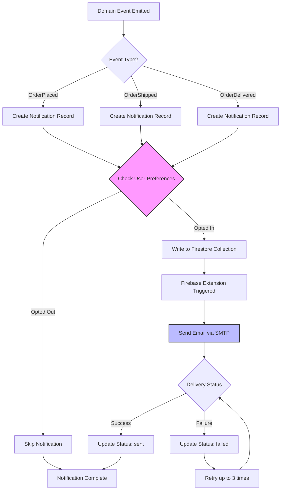

# Feature: Order Notifications

> **Purpose:**
> This document defines a single feature's intent, scope, user experience, and completion criteria.
> It is the **single source of truth** for planning, review, automation, and execution.

---

## 0. Metadata

All metadata is defined in the frontmatter above (between the `---` markers).

**Important:** The frontmatter is used by automation scripts to:

- Create GitHub issues
- Link features to parent epics
- Generate feature flags
- Track status and ownership

---

## 1. Overview

**Order Notifications** automates email notifications for order lifecycle events (confirmation, shipment, delivery) via Firebase Extensions, providing customers with timely updates and allowing preference management.

- **What this feature enables**: Automatic email notifications triggered by domain events (OrderPlaced, OrderShipped, OrderDelivered), user preference management, and delivery tracking
- **Why it exists**: To keep customers informed about their order status proactively, reducing support inquiries and building trust through transparent communication
- **What meaningful change it introduces**: Establishes the Notification aggregate for tracking communication history, implements user opt-out capabilities for all emails including transactional, and leverages Firebase Extensions for reliable email delivery

This feature serves as the primary communication channel between the platform and customers for order-related updates.

## Flow Diagram



Caption: "Notification lifecycle from domain event through delivery with preference checking and retry logic (See Scenarios 1.1, 2.1, 4.1)."

---

## 2. User Problem

**Describe the real problem experienced by users.**

Customers who purchase products online need to know when their order is confirmed, when it ships, and when it's delivered, without needing to manually check order status or contact support.

- **Who experiences the problem**: All customers (authenticated and guest) who place orders
- **When and in what situations it occurs**: After placing an order, during shipping, and upon delivery—critical moments when customers want confirmation and peace of mind
- **What friction, confusion, or inefficiency exists today**: Without proactive notifications, customers must manually check order status, leading to uncertainty, support requests, and potential missed deliveries
- **Why existing behavior or solutions are insufficient**: Manual status checking is inconvenient, customers may forget to check, and missed delivery windows cause frustration

---

## 3. Goals

### User Experience Goals

- **Proactive communication**: Customers receive timely email notifications for order milestones without needing to check manually
- **Peace of mind**: Order confirmation email provides immediate assurance that purchase was successful
- **Delivery preparedness**: Shipment notification allows customers to plan to receive packages
- **Control over communication**: Users can opt out of all emails, including transactional notifications, respecting privacy preferences
- **Transparency**: Notification history is accessible so users can review past communications

### Business / System Goals

- Automate order communication to reduce support inquiries
- Leverage Firebase Extension (Trigger Email from Firestore) for reliable email delivery without custom SMTP code
- Create Notification aggregate to track communication history for compliance and debugging
- Emit events that trigger notifications based on order lifecycle (OrderPlaced, OrderShipped, OrderDelivered)
- Support user opt-out for all notification types including transactional emails
- Provide GraphQL API for notification preferences management

---

## 4. Non-Goals

**Explicitly state what this feature does not attempt to solve.**

- **SMS notifications**: Email-only in initial release; SMS deferred to future feature
- **Push notifications**: Web/mobile push notifications out of scope
- **Marketing emails**: Promotional or newsletter emails are separate feature
- **Advanced notification preferences**: Granular preferences (e.g., shipment only, no delivery) not supported; opt-out is all-or-nothing
- **Notification scheduling**: Emails sent immediately upon event; no user-controlled timing
- **Multi-language support**: English-only email templates in initial release

---

## 5. Functional Scope

**Describe what the feature enables at a conceptual level.**

### Core Capabilities

- **Event-Driven Notifications**: Listen for OrderPlaced, OrderShipped, OrderDelivered domain events and create notification records
- **Email Template Management**: Maintain HTML email templates for order confirmation, shipment tracking, and delivery confirmation
- **Firebase Extension Integration**: Use "Trigger Email from Firestore" extension to send emails when notification records are written
- **User Preference Management**: Users can opt out of all notifications via preference settings
- **Notification History**: Track all sent/failed notifications in Notification aggregate
- **Delivery Tracking**: Monitor email delivery status (sent, failed) and retry on failure

### System Responsibilities

- Listen for domain events and create notification records
- Check user notification preferences before sending
- Write notification records to Firestore `notifications` collection
- Firebase Extension automatically sends emails when records are created
- Update notification status based on delivery confirmation
- Retry failed email delivery up to 3 times
- Provide GraphQL queries and mutations for notification preferences

---

## 6. Dependencies & Assumptions

**List conditions required for this feature to function as intended.**

### Dependencies

- **F-011: Shipment Tracking & Fulfillment** (CRITICAL): OrderShipped and OrderDelivered events required
- **F-010: Order Management**: OrderPlaced event required
- **F-001: Platform Foundation**: Firebase Functions for event listeners
- **Firebase Extension**: "Trigger Email from Firestore" extension must be installed and configured
- **SMTP Provider**: Email delivery requires configured SMTP (e.g., SendGrid, Mailgun, Gmail)

### Assumptions

- Firebase Extension handles email delivery reliably with built-in retry logic
- SMTP provider is configured with sufficient sending quota (>1000 emails/day initially)
- Users have valid email addresses (validated during registration or guest checkout)
- Email templates use responsive HTML for mobile compatibility
- Notification preferences default to "opted in" unless user explicitly opts out
- Transactional emails (order confirmation, shipment, delivery) can be opted out (per PRD user control requirement)

### Constraints

- **Email Delivery Time**: Firebase Extension processes emails asynchronously; delivery not instantaneous
- **SMTP Rate Limits**: Email sending throttled by SMTP provider limits
- **Template Customization**: Templates managed in code; no admin UI for editing
- **All-or-Nothing Opt-Out**: Users opt out of all notifications or none; no granular control

---

## 7. User Stories & Experience Scenarios

> This section defines **how users live with the feature**.
> Scenarios must focus on **quality of life and lifecycle experience**, not just technical failures.

---

### User Story 1 — Order Confirmation Email

**As a** beauty product customer
**I want** to receive an email confirmation immediately after placing my order
**So that** I have written proof of my purchase and can reference order details later

---

#### Scenarios

##### Scenario 1.1 — First Order Confirmation Email

**Given** a user completes payment and order is created
**When** the OrderPlaced event is emitted
**Then** the system creates a notification record with template "order_confirmation"
**And** sends an email containing order number, itemized product list, total amount, shipping address, and estimated delivery timeline
**And** the email arrives within 2 minutes of order creation

---

##### Scenario 1.2 — Order Confirmation Email Content

**Given** an order confirmation email is sent
**When** the user opens the email
**Then** the email displays order number prominently in subject line (e.g., "Order #ORD-ABC12345 Confirmed")
**And** includes clickable link to view order details
**And** shows all ordered products with thumbnails, names, and prices
**And** displays shipping address and payment method (last 4 digits only)
**And** provides customer support contact information

---

##### Scenario 1.3 — Guest User Order Confirmation

**Given** a guest user completes checkout without creating an account
**When** the order is placed
**Then** the confirmation email is sent to the email provided during checkout
**And** includes guest order lookup instructions (email + order number)
**And** encourages account creation with benefits

---

##### Scenario 1.4 — Order Confirmation Email Failure

**Given** the email sending fails (SMTP error, invalid email address)
**When** Firebase Extension detects delivery failure
**Then** the system updates notification status to "failed"
**And** retries email delivery up to 3 times with exponential backoff
**And** logs failure for admin review if all retries fail

---

##### Scenario 1.5 — Order Confirmation for Opted-Out User

**Given** a user has opted out of all notifications
**When** they place an order
**Then** the system checks notification preferences before creating notification record
**And** skips email sending entirely
**And** user can still view order confirmation on website

---

##### Scenario 1.6 — Mobile Email Rendering

**Given** users check email on mobile devices
**When** they open the order confirmation email
**Then** the email renders responsively with readable text (min 14px font)
**And** images scale to viewport width
**And** buttons/links are tappable (min 44x44px touch target)

---

### User Story 2 — Shipment Notification Email

**As a** customer with a confirmed order
**I want** to receive an email when my order ships with tracking information
**So that** I can track delivery progress and plan to receive my package

---

#### Scenarios

##### Scenario 2.1 — Shipment Notification Email

**Given** an order transitions to "shipped" status
**When** the OrderShipped event is emitted
**Then** the system creates a notification record with template "shipment_notification"
**And** sends an email containing tracking number, carrier name, tracking link, and estimated delivery date
**And** the email includes all shipped items (handles partial shipments by listing specific items)

---

##### Scenario 2.2 — Partial Shipment Notification

**Given** an order has partial shipment (2 of 3 items shipped)
**When** the first shipment is created
**Then** the notification email clearly states "2 of 3 items shipped"
**And** lists the specific items in this shipment
**And** explains remaining item will ship separately with its own tracking

---

##### Scenario 2.3 — Tracking Link in Email

**Given** a shipment notification email is sent
**When** the user clicks the tracking link
**Then** the link opens the platform's tracking page (not external carrier site)
**And** displays current shipment status and timeline
**And** provides secondary link to carrier's website

---

##### Scenario 2.4 — Multiple Shipment Notifications

**Given** an order has backorder that ships later
**When** the second shipment is created
**Then** a separate shipment notification email is sent
**And** the email clearly indicates this is the "remaining item from Order #ORD-ABC12345"
**And** includes new tracking number and carrier information

---

##### Scenario 2.5 — Shipment Notification Timing

**Given** a shipment is created
**When** the system processes the OrderShipped event
**Then** the notification email is sent within 5 minutes of shipment creation
**And** user receives email before end-of-day (assuming daytime shipment)

---

##### Scenario 2.6 — Shipment Email Mobile Optimization

**Given** users check email on mobile devices
**When** they open the shipment notification
**Then** the tracking link is prominently displayed as tappable button
**And** carrier logo and tracking number are easily readable

---

### User Story 3 — Delivery Confirmation Email

**As a** customer waiting for a package
**I want** to receive an email when my order is delivered
**So that** I know to retrieve my package and confirm the order is complete

---

#### Scenarios

##### Scenario 3.1 — Delivery Confirmation Email

**Given** a shipment reaches "delivered" status
**When** the OrderDelivered event is emitted
**Then** the system creates a notification record with template "delivery_confirmation"
**And** sends an email confirming delivery with date, time, and carrier information
**And** encourages user to review products or contact support if issues

---

##### Scenario 3.2 — Delivery Confirmation with Call-to-Action

**Given** a delivery confirmation email is sent
**When** the user opens the email
**Then** the email includes a call-to-action: "How was your experience?" linking to feedback form (future feature)
**And** provides easy access to customer support for delivery issues

---

##### Scenario 3.3 — Multiple Delivery Confirmations

**Given** an order had multiple shipments
**When** each shipment is delivered
**Then** separate delivery confirmation emails are sent for each
**And** final email indicates "All items from Order #ORD-ABC12345 have been delivered"

---

##### Scenario 3.4 — Delivery Confirmation After Long Delay

**Given** a delivery is significantly delayed (>7 days past estimate)
**When** the package is finally delivered
**Then** the confirmation email acknowledges the delay
**And** includes apology and customer support contact for compensation requests

---

##### Scenario 3.5 — Delivery Email for Guest Users

**Given** a guest user's order is delivered
**When** the delivery confirmation email is sent
**Then** the email includes guest order lookup link for accessing order details
**And** encourages account creation to track future orders easily

---

##### Scenario 3.6 — Delivery Email Mobile Optimization

**Given** users check email on mobile devices
**When** they open the delivery confirmation
**Then** the delivered status is clearly visible at top
**And** support contact link opens mobile-friendly contact method (email, phone)

---

### User Story 4 — Notification Preference Management

**As a** privacy-conscious customer
**I want** to opt out of all email notifications, including transactional emails
**So that** I can control my inbox and only check order status when I choose

---

#### Scenarios

##### Scenario 4.1 — Opt Out of All Notifications

**Given** an authenticated user navigates to notification preferences
**When** they toggle "Email notifications" to OFF
**Then** the system updates their preference immediately
**And** displays confirmation: "You will no longer receive email notifications"
**And** explains they can still view order status by logging in

---

##### Scenario 4.2 — Opt Out Applies to All Email Types

**Given** a user has opted out of notifications
**When** any order event occurs (OrderPlaced, OrderShipped, OrderDelivered)
**Then** the system checks preferences before creating notification record
**And** skips email sending entirely for all event types

---

##### Scenario 4.3 — Guest User Cannot Manage Preferences

**Given** a guest user without an account
**When** they receive order notification emails
**Then** the email includes an opt-out link at the bottom
**And** clicking the link unsubscribes their email address from future notifications
**And** displays confirmation page explaining they can re-enable by creating an account

---

##### Scenario 4.4 — Opt-In After Opting Out

**Given** a user previously opted out of notifications
**When** they toggle "Email notifications" to ON
**Then** the system updates their preference immediately
**And** confirms they will receive future order notifications
**And** the change applies to next order event (not retroactive)

---

##### Scenario 4.5 — Preference Persistence Across Sessions

**Given** a user updates notification preferences
**When** they log out and log back in
**Then** their preference setting is preserved
**And** remains in effect indefinitely until changed

---

##### Scenario 4.6 — Mobile Preference Management

**Given** users on mobile devices
**When** they access notification preferences
**Then** the toggle switch is easily tappable with clear on/off state
**And** confirmation message displays without requiring scroll

---

### User Story 5 — Notification History & Tracking

**As a** customer or support agent
**I want** to view history of all notifications sent for my orders
**So that** I can verify communication, debug delivery issues, or reference past emails

---

#### Scenarios

##### Scenario 5.1 — View Notification History

**Given** an authenticated user navigates to "Notifications" section
**When** they view notification history
**Then** the system displays all notifications sent (order confirmation, shipment, delivery) sorted by date
**And** each entry shows notification type, status (sent/failed), timestamp, and associated order

---

##### Scenario 5.2 — Notification Detail View

**Given** a user is viewing notification history
**When** they select a specific notification
**Then** the system displays full notification details including email subject, recipient email, sent timestamp, delivery status, and link to associated order
**And** for failed notifications, shows error reason

---

##### Scenario 5.3 — Resend Failed Notification

**Given** a notification has status "failed"
**When** a user or admin views the notification
**Then** the system provides a "Resend" button
**And** clicking resend creates new notification record and re-triggers email sending
**And** updates status based on new delivery attempt

---

##### Scenario 5.4 — Notification History for Guest Users

**Given** a guest user looks up their order
**When** they view order details
**Then** the system displays notification history for that specific order
**And** shows whether confirmation/shipment/delivery emails were sent

---

##### Scenario 5.5 — Notification History Performance

**Given** a user with many historical orders and notifications
**When** they view notification history
**Then** the system loads the first page (20 notifications) within 2 seconds
**And** implements pagination for older notifications

---

##### Scenario 5.6 — Mobile Notification History

**Given** users on mobile devices
**When** they view notification history
**Then** each notification entry is tappable with clear status indicator (icon or color)
**And** notification details are readable without horizontal scroll

---

## 8. Edge Cases & Constraints (Experience-Relevant)

**Include only cases that materially affect user experience.**

### Hard Limits

- **Email Retry Limit**: Maximum 3 retry attempts for failed email delivery before marking as permanently failed
- **Notification Retention**: Notification records retained for 90 days, then archived for compliance
- **SMTP Sending Quota**: Daily sending limit per SMTP provider (e.g., 1000/day for free tier, 10,000/day for paid)
- **Opt-Out Scope**: Opt-out applies to ALL email notifications including transactional; no granular control

### Irreversible Actions

- **Email Sent**: Once email is delivered, cannot be recalled or edited
- **Opt-Out Link Clicked**: Guest user opt-out is permanent for that email address unless account created

### Compliance & Policy Constraints

- **CAN-SPAM Compliance**: All emails include physical sender address, unsubscribe link, and accurate subject lines
- **Data Privacy**: Notification records contain email addresses; subject to GDPR/privacy policy data retention
- **Transactional Email Opt-Out**: User preference respected even for transactional emails (unique requirement per PRD)

---

## 9. Implementation Tasks (Execution Agent Checklist)

> This section provides the specific work items for the **Execution Agent**.
> Every task must map back to a specific scenario defined in Section 7.

```markdown
- [ ] T01 — Implement Notification aggregate with NotificationId, Channel (email), Status (sent, failed), orderId, userId/email, templateType, sentAt, deliveredAt fields (Scenario 5.1, 5.2)
  - [ ] Unit Test: Notification creation with valid event data
  - [ ] Unit Test: Status transitions (pending → sent → delivered / failed)
  
- [ ] T02 — Install and configure Firebase Extension: "Trigger Email from Firestore" with SMTP credentials (Scenario 1.1)
  - [ ] Integration Test: Extension triggers email when document written to notifications collection
  - [ ] Integration Test: Email delivered via SMTP provider
  
- [ ] T03 — Create HTML email template for order confirmation (Scenario 1.1, 1.2, 1.6)
  - [ ] Unit Test: Template renders with order data (order number, items, total)
  - [ ] E2E Test: Email displays correctly on mobile and desktop clients
  
- [ ] T04 — Create HTML email template for shipment notification (Scenario 2.1, 2.6)
  - [ ] Unit Test: Template renders with tracking data (tracking number, carrier, link)
  - [ ] E2E Test: Tracking link is clickable and opens tracking page
  
- [ ] T05 — Create HTML email template for delivery confirmation (Scenario 3.1, 3.6)
  - [ ] Unit Test: Template renders with delivery data (date, time, carrier)
  - [ ] E2E Test: Email displays delivered status prominently
  
- [ ] T06 — Implement OrderPlaced event handler that creates notification record (Scenario 1.1)
  - [ ] Unit Test: Notification created when OrderPlaced event received
  - [ ] Integration Test: Notification document written to Firestore notifications collection
  
- [ ] T07 — Implement OrderShipped event handler that creates notification record (Scenario 2.1)
  - [ ] Unit Test: Notification created when OrderShipped event received
  - [ ] Integration Test: Notification includes tracking data from event payload
  
- [ ] T08 — Implement OrderDelivered event handler that creates notification record (Scenario 3.1)
  - [ ] Unit Test: Notification created when OrderDelivered event received
  - [ ] Integration Test: Notification marks order as delivered
  
- [ ] T09 — Implement user notification preference storage in Firestore users collection (Scenario 4.1, 4.5)
  - [ ] Unit Test: Preference field (notificationsEnabled boolean) defaults to true
  - [ ] Integration Test: Preference persists across sessions
  
- [ ] T10 — Implement preference check before creating notification records (Scenario 1.5, 4.2)
  - [ ] Unit Test: Notification skipped if user opted out
  - [ ] Integration Test: Opted-out users receive no emails for any event type
  
- [ ] T11 — Implement email delivery retry logic (3 retries, exponential backoff) (Scenario 1.4)
  - [ ] Unit Test: Retry triggered on SMTP failure
  - [ ] Integration Test: Notification status updated after each retry
  
- [ ] T12 — Implement notification status tracking (sent, failed) via Firebase Extension status callbacks (Scenario 1.4, 5.1)
  - [ ] Unit Test: Status updated to "sent" on successful delivery
  - [ ] Unit Test: Status updated to "failed" after max retries
  
- [ ] T13 — Implement GraphQL query: notificationPreferences (authenticated users only) (Scenario 4.1)
  - [ ] Unit Test: Return user's notification preference setting
  - [ ] E2E Test: Preference displayed on user settings page
  
- [ ] T14 — Implement GraphQL mutation: updateNotificationPreferences(enabled: Boolean) (Scenario 4.1, 4.4)
  - [ ] Unit Test: Update user's preference in Firestore
  - [ ] E2E Test: Toggle preference on settings page, verify update persists
  
- [ ] T15 — Implement guest user opt-out link in email footer (Scenario 4.3)
  - [ ] Unit Test: Opt-out link contains email address hash for verification
  - [ ] E2E Test: Clicking opt-out link unsubscribes email, displays confirmation page
  
- [ ] T16 — Implement notification history UI component (Lit web component) (Scenario 5.1, 5.6)
  - [ ] E2E Test: Notification history displays all sent notifications sorted by date
  - [ ] E2E Test: Mobile viewport renders notification list vertically
  
- [ ] T17 — Implement notification detail view UI (Scenario 5.2)
  - [ ] E2E Test: Clicking notification displays full details (email subject, status, timestamp)
  
- [ ] T18 — Implement resend failed notification functionality (Scenario 5.3)
  - [ ] Unit Test: Resend creates new notification record
  - [ ] E2E Test: Admin/user can resend failed notification, new status tracked
  
- [ ] T19 — Implement partial shipment notification logic (Scenario 2.2, 2.4)
  - [ ] Unit Test: Notification template renders partial shipment details
  - [ ] E2E Test: Email clearly states "X of Y items shipped"
  
- [ ] T20 — Implement notification preference toggle UI component (Scenario 4.1, 4.6)
  - [ ] E2E Test: Toggle switch updates preference, displays confirmation message
  - [ ] E2E Test: Mobile viewport renders toggle with adequate touch target
  
- [ ] T21 — Configure Firestore schema for notifications collection with indexes on userId, orderId, status, createdAt (Scenario 5.1)
  - [ ] Unit Test: Firestore document structure validation
  - [ ] Integration Test: Query notifications by userId with pagination
  
- [ ] T22 — Implement notification timing constraint: send within 5 minutes of event (Scenario 2.5)
  - [ ] Integration Test: Notification created immediately on event receipt
  - [ ] E2E Test: Email delivered within 5 minutes (monitor with timestamp comparison)
  
- [ ] T23 — Implement responsive email templates for mobile rendering (Scenario 1.6, 2.6, 3.6)
  - [ ] E2E Test: Templates render correctly on Gmail/Outlook mobile apps
  - [ ] E2E Test: Touch targets (buttons, links) meet minimum size (44x44px)
  
- [ ] T24 — Implement guest user notification history in order lookup (Scenario 5.4)
  - [ ] E2E Test: Guest order lookup displays notification history for that order
  
- [ ] T25 — Configure Firestore security rules for notifications collection (Scenario 5.1)
  - [ ] Unit Test: Users can read own notifications only
  - [ ] Integration Test: Firestore rules enforce authorization
  
- [ ] T26 — [Rollout] Implement feature flag: order_notifications_enabled for gradual rollout (Scenario All)
  - [ ] Integration Test: Feature flag controls notification creation and email sending
  
- [ ] T27 — [Rollout] Implement feature flag: notification_preferences_ui_enabled for preference management rollout (Scenario 4.1)
  - [ ] Integration Test: Flag controls preference UI visibility
```

---

## 10. Acceptance Criteria (Verifiable Outcomes)

> These criteria are used by the **Execution Agent** and **Reviewers** to verify completion.
> Each criterion must be observable and testable.

```markdown
- [ ] AC1 — Order confirmation email sent when OrderPlaced event is emitted (Scenario 1.1)
  - [ ] Unit test passed: Notification record created with order_confirmation template
  - [ ] Integration test passed: Firebase Extension triggers email delivery
  - [ ] E2E test passed: Email arrives in inbox within 2 minutes

- [ ] AC2 — Order confirmation email contains all required details (Scenario 1.2)
  - [ ] E2E test passed: Email displays order number, items, total, shipping address, tracking link

- [ ] AC3 — Shipment notification email sent when OrderShipped event is emitted (Scenario 2.1)
  - [ ] Unit test passed: Notification record created with shipment_notification template
  - [ ] E2E test passed: Email contains tracking number, carrier, tracking link

- [ ] AC4 — Delivery confirmation email sent when OrderDelivered event is emitted (Scenario 3.1)
  - [ ] Unit test passed: Notification record created with delivery_confirmation template
  - [ ] E2E test passed: Email confirms delivery with date and time

- [ ] AC5 — Users can opt out of all notifications (Scenario 4.1, 4.2)
  - [ ] Unit test passed: updateNotificationPreferences mutation updates preference
  - [ ] Unit test passed: Notification skipped if user opted out
  - [ ] E2E test passed: Opted-out user receives no emails for any order event

- [ ] AC6 — Users can opt back in after opting out (Scenario 4.4)
  - [ ] Unit test passed: Preference toggle updates setting
  - [ ] E2E test passed: User receives notifications after re-enabling preference

- [ ] AC7 — Guest users can opt out via email link (Scenario 4.3)
  - [ ] Unit test passed: Opt-out link validates email address hash
  - [ ] E2E test passed: Guest clicks opt-out link, email unsubscribed, confirmation displayed

- [ ] AC8 — Email delivery failures are retried up to 3 times (Scenario 1.4)
  - [ ] Unit test passed: Retry logic executes on SMTP failure
  - [ ] Integration test passed: Notification status updated after retries

- [ ] AC9 — Notification status is tracked (sent/failed) (Scenario 5.1, 5.2)
  - [ ] Unit test passed: Status updated to "sent" on successful delivery
  - [ ] Unit test passed: Status updated to "failed" after max retries
  - [ ] E2E test passed: Notification history displays correct status

- [ ] AC10 — Users can view notification history (Scenario 5.1)
  - [ ] Unit test passed: notificationPreferences query returns user's notifications
  - [ ] E2E test passed: Notification history page displays all sent notifications

- [ ] AC11 — Notification details are accessible (Scenario 5.2)
  - [ ] E2E test passed: Clicking notification displays full details (subject, status, timestamp)

- [ ] AC12 — Failed notifications can be resent (Scenario 5.3)
  - [ ] Unit test passed: Resend creates new notification record
  - [ ] E2E test passed: Resend button triggers new email delivery attempt

- [ ] AC13 — Partial shipment notifications handled correctly (Scenario 2.2, 2.4)
  - [ ] Unit test passed: Template renders partial shipment details
  - [ ] E2E test passed: Email states "X of Y items shipped" with item list

- [ ] AC14 — Email templates are mobile-optimized (Scenario 1.6, 2.6, 3.6)
  - [ ] E2E test passed: Templates render responsively on mobile email clients
  - [ ] E2E test passed: Touch targets meet minimum size (44x44px)

- [ ] AC15 — Guest users see notification history in order lookup (Scenario 5.4)
  - [ ] E2E test passed: Guest order lookup displays notification history

- [ ] AC16 — Notifications sent within 5 minutes of event (Scenario 2.5)
  - [ ] Integration test passed: Notification created immediately on event
  - [ ] E2E test passed: Email delivery time <5 minutes (monitored)

- [ ] AC17 — Notification preferences persist across sessions (Scenario 4.5)
  - [ ] Integration test passed: Preference setting saved in Firestore
  - [ ] E2E test passed: User logs out and back in, preference unchanged

- [ ] AC18 — Firestore security rules enforce authorization (Scenario 5.1)
  - [ ] Integration test passed: Users can only read own notifications

- [ ] AC19 — Guest user notification preference UI not accessible (Scenario 4.3)
  - [ ] E2E test passed: Guest users see opt-out link in emails but no settings page

- [ ] AC20 — [Gating] Feature flag order_notifications_enabled correctly controls visibility and access
  - [ ] Integration test passed: When false, notifications are not created
  - [ ] Integration test passed: When true, all notification features are accessible

- [ ] AC21 — [Gating] Feature flag notification_preferences_ui_enabled correctly controls preference UI
  - [ ] Integration test passed: When false, preference UI is hidden
  - [ ] Integration test passed: When true, preference management is accessible
```

---

## 11. Rollout & Risk (If Applicable)

### Rollout Strategy

**Progressive Rollout**: Order Notifications will be rolled out in phases to minimize risk:

1. **Phase 1 (0% → 10%)**: Internal testing with test orders and email accounts
2. **Phase 2 (10% → 25%)**: Early adopters monitoring email delivery rate
3. **Phase 3 (25% → 50%)**: Broader rollout with SMTP quota monitoring
4. **Phase 4 (50% → 100%)**: Full rollout once delivery success rate >98%

### Risk Mitigation

**Primary Risks**:
- **SMTP quota exhaustion**: Monitor daily sending volume and upgrade SMTP plan proactively
- **Email deliverability**: Use reputable SMTP provider (SendGrid, Mailgun) with SPF/DKIM configured
- **Spam filtering**: Test email templates with spam checkers before rollout
- **Firebase Extension failure**: Monitor extension logs and implement alerting for processing errors
- **Opt-out compliance**: Ensure all emails have unsubscribe link to comply with CAN-SPAM

**Monitoring**:
- Email delivery success rate (target: >98%)
- Email open rate (baseline metric for template quality)
- Notification creation success rate (target: >99%)
- SMTP quota utilization (alert at >80%)
- Opt-out rate (baseline metric for user satisfaction)

### Exit/Cleanup Criteria

- Feature flags remain until 100% rollout is stable for 7 days
- After successful rollout, remove feature flag checks from code
- Monitor notification-related support requests to identify template improvements

### Remote Config Flags

<!-- REMOTE_CONFIG_FLAG_START -->
| Context | Type | Namespace | Default (Dev) | Default (Stg) | Default (Prod) | Key |
|---------|------|-----------|---------------|---------------|----------------|-----|
| order_notifications | BOOLEAN | backend | true | false | false | feature_fe_f012_fl_001_order_notifications_enabled |
| notification_preferences_ui | BOOLEAN | client | true | false | false | feature_fe_f012_fl_002_notification_preferences_ui_enabled |
| guest_opt_out | BOOLEAN | backend | true | false | false | feature_fe_f012_fl_003_guest_opt_out_enabled |
| notification_retry | BOOLEAN | backend | true | true | true | feature_fe_f012_fl_004_notification_retry_enabled |
<!-- REMOTE_CONFIG_FLAG_END -->

---

## 12. History & Status

- **Status:** Draft
- **Feature ID:** F-012
- **Dependencies:** F-011 (Shipment Tracking & Fulfillment), F-010 (Order Management), F-001 (Platform Foundation)
- **Related Epics:** Order & Fulfillment
- **Related Issues:** TBD (created post-merge)

---

## Final Note

> This document defines **intent and experience**.
> Execution details are derived from it — never the other way around.
