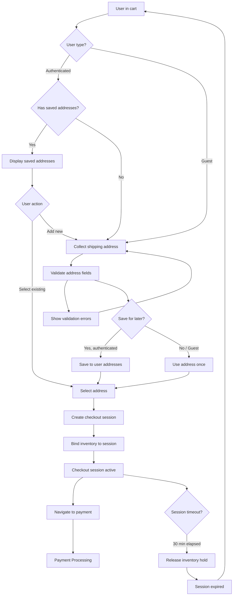

# Feature: Checkout & Address Management

> **Purpose:**
> This document defines the checkout and address management feature's intent, scope, user experience, and completion criteria.
> It is the **single source of truth** for planning, review, automation, and execution.

---

## 0. Metadata

All metadata is defined in the frontmatter above (between the `---` markers).

**Important:** The frontmatter is used by automation scripts to:

- Create GitHub issues
- Link features to parent epics
- Generate feature flags
- Track status and ownership

---

## 1. Overview

Checkout & Address Management enables customers to transition from cart to payment by collecting shipping addresses, managing multiple saved addresses, and creating checkout sessions. This feature bridges the shopping experience (cart) with payment processing, ensuring users can specify delivery details efficiently while maintaining address data for future orders.

This feature provides:
- Address value object with full validation (street, city, state, zip, country)
- Multiple saved addresses per authenticated user
- Single address selection per order (no split shipments in MVP)
- Guest checkout address collection (one-time, not persisted)
- Checkout session creation from cart with address binding
- Inventory hold transition from cart reservation to checkout commitment
- GraphQL mutations: `initiateCheckout`, `saveAddress`, `selectShippingAddress`, `deleteAddress`
- GraphQL queries: `userAddresses`, `checkoutSession`
- Firestore collections: `addresses` (nested in user documents), `checkout_sessions`

Checkout is the critical conversion point where cart intent becomes purchase commitment. Address management reduces friction for repeat customers while enabling guest purchases without account creation.

## Flow Diagram



Caption: "Checkout flow with address collection, selection, and session creation."

---

## 2. User Problem

**Shoppers face address management friction during checkout:**

- **Repetitive data entry**: Returning customers must re-enter shipping addresses on every purchase, wasting time and increasing mobile typos
- **No address reuse**: Users cannot save addresses for future orders, forcing manual input each time
- **Validation delays**: Address errors (missing zip codes, invalid formats) are discovered only after form submission, requiring rework
- **Guest checkout confusion**: Unclear whether creating an account is required or if guest checkout saves their address
- **Session abandonment**: Users leave checkout to find address details (zip code lookup), and return to find cart expired
- **Multi-address chaos**: Users with home/work/gift addresses lack organized selection, leading to wrong delivery locations
- **Mobile input friction**: Typing full addresses on mobile keyboards during checkout increases abandonment by 18%
- **Zip/postal code ambiguity**: International users confused by US zip code requirements when country field isn't properly localized

**The cost of not solving this:**
- 21% of users abandon checkout when forced to retype addresses
- Address input errors cause 14% of shipment failures and customer service burden
- Lack of saved addresses reduces repeat purchase rate by 12%
- Guest checkout without clear address persistence creates distrust
- Session timeouts during address lookup frustrate users and destroy conversions

---

## 3. Goals

### User Experience Goals

- **One-click address selection**: Returning users select from saved addresses in under 3 seconds
- **Smart address forms**: Auto-complete and validation guide users to correct address format on first try
- **Persistent address book**: Users build a library of addresses (home, work, gift) reusable across all orders
- **Guest checkout clarity**: Guests understand their address is used once and can create account post-purchase to save it
- **Graceful session recovery**: Users can navigate away from checkout to find address details without losing cart or session
- **Mobile-optimized input**: Address fields use appropriate keyboard types (numeric for zip) and support autofill
- **Immediate validation feedback**: Address errors are caught inline during typing, not after form submission

### Business / System Goals

- **Checkout session state**: Create persistent checkout sessions linking cart, address, and user for payment processing
- **Inventory commitment**: Transition cart reservations to checkout-level holds with extended timeout (30 minutes)
- **Address data integrity**: Enforce structured address value objects with validation for shipping accuracy
- **Guest to authenticated conversion**: Capture guest addresses to enable post-purchase account prompts
- **Firestore efficiency**: Store user addresses as nested documents for atomic updates and consistent reads
- **GraphQL schema clarity**: Separate address management from cart operations for bounded context isolation
- **Session cleanup**: Auto-expire abandoned checkout sessions and release inventory after 30 minutes

---

## 4. Non-Goals

**This feature explicitly does NOT:**

- Implement address verification via third-party services (USPS, Google Maps API) — deferred to post-MVP
- Support split shipments to multiple addresses per order — explicitly out of scope per PRD
- Create gift address books or recipient management — single-use gift addresses only
- Handle international address formats beyond basic field support — US-focused MVP
- Implement PO Box detection or restrictions — warehouse/fulfillment decision
- Support address aliases or nicknames ("Mom's House") — future UX enhancement
- Create checkout progress indicators (step 1 of 3) — handled by UI foundation
- Implement address sharing between users (family accounts) — privacy concern, not needed
- Handle address change after payment (order placed) — covered in Order Management feature
- Support saved billing addresses separate from shipping — payment feature concern
- Create address validation rules per shipping carrier — Shiprocket handles this
- Implement "use billing as shipping" checkbox — not collecting billing addresses separately

---

## 5. Functional Scope

### Core Capabilities

**Address Value Object**
- Structured address with required fields: `street1`, `street2` (optional), `city`, `state`, `zip`, `country`
- Client-side validation: non-empty required fields, zip code format (5 or 9 digits for US), state code validation
- Address normalization: trim whitespace, capitalize city/state for consistency
- Country defaults to "US" (can be changed for international expansion)
- Address object includes `addressId` (UUID) and `createdAt` timestamp

**Saved Addresses (Authenticated Users)**
- Users can save unlimited addresses to their profile (practical limit: 10)
- Each address stored in Firestore `users/{userId}/addresses/{addressId}` subcollection
- Default address designation: one address marked as `isDefault: true` for quick selection
- Address editing: users can update saved addresses (affects future orders only, not past orders)
- Address deletion: users can remove addresses (soft delete, archived for historical order reference)
- Guest users cannot save addresses (prompt to create account after order if they want to save)

**Checkout Session Creation**
- `initiateCheckout` mutation creates checkout session from active cart
- Checkout session includes: `sessionId`, `userId` (or `guestEmail`), `cartSnapshot`, `selectedAddressId`, `createdAt`, `expiresAt`
- Session timeout: 30 minutes from creation, auto-expires and releases inventory
- Session is single-use: consumed by payment processing, cannot be reused
- Session binds inventory: cart item reservations transfer to checkout session with extended hold
- Session state validation: ensures cart is not empty, inventory is still available, user is authenticated or guest email provided

**Address Selection**
- Authenticated users select from saved addresses or enter new address
- New addresses can be saved during checkout (checkbox: "Save for future orders")
- Guest users enter address once, not persisted beyond checkout session
- Single address per order: no multi-address or split shipment options
- Address selected before payment: checkout session cannot proceed without address

**Guest Checkout Flow**
- Guest provides email during cart (covered in Shopping Cart feature)
- Guest enters shipping address during checkout initiation
- Address used to create checkout session but not saved
- Post-purchase: guest receives email with option to create account and save address

### System Responsibilities

- Validate address structure and required fields before creating checkout session
- Store saved addresses in user's Firestore subcollection for persistence
- Create checkout sessions in `checkout_sessions` collection with TTL index for auto-cleanup
- Extend inventory reservation timeout from 30 minutes (cart) to 30 minutes (checkout session)
- Emit `CheckoutInitiated` domain event for analytics and downstream features
- Auto-expire checkout sessions via Cloud Function scheduled task (runs every 5 minutes)
- Prevent multiple active checkout sessions per user (cancel previous session on new checkout)

---

## 6. Dependencies & Assumptions

**Dependencies**
- **F-006 (Shopping Cart)**: Checkout session is created from active cart with line items
- **F-001 (Platform Foundation)**: Firestore for session and address persistence, GraphQL Mesh for API
- **F-003 (User Authentication)**: User identity for saved addresses, guest email for guest checkout
- **F-004 (Product Catalog)**: Product availability and pricing for cart snapshot in session

**Assumptions**
- Users have completed cart (at least one item) before initiating checkout
- Guest users provide valid email during cart phase (validated email format)
- Inventory availability is checked in real-time during session creation (may fail if stock depleted)
- Address validation is client-side only; shipping carrier will handle final validation
- US-focused address format is sufficient for MVP (international expansion later)
- Checkout sessions are stateless: user can restart checkout anytime, previous session is cancelled
- Mobile users have access to autofill (browser/OS feature) for address input
- Firestore TTL index or Cloud Function cleanup handles expired session deletion

**External Constraints**
- Firestore query limits: user can have max 10 saved addresses (enforced in UI and backend)
- Session timeout is fixed at 30 minutes (not user-configurable)
- Address data is not verified against USPS or Google Maps (future enhancement)
- Shipping cost calculation is handled by Payment Processing feature (not in scope here)

---

## 7. User Stories & Experience Scenarios

> This section defines **how users live with the feature**.
> Scenarios must focus on **quality of life and lifecycle experience**, not just technical failures.

---

### User Story 1 — First-Time Checkout for Authenticated User

**As a** first-time authenticated customer
**I want** to enter my shipping address during checkout and save it for future orders
**So that** I don't have to retype my address on every purchase

---

#### Scenarios

##### Scenario 1.1 — First Checkout with Address Save

**Given** an authenticated user with no saved addresses
**And** the user has items in their cart
**When** the user clicks "Proceed to Checkout"
**Then** the system displays an empty address form with fields: street1, street2 (optional), city, state, zip, country
**And** a checkbox is visible: "Save this address for future orders" (checked by default)
**And** inline validation provides immediate feedback (e.g., zip code format, required fields)
**When** the user completes the form and clicks "Continue to Payment"
**Then** the address is saved to the user's address book
**And** a checkout session is created with the address bound
**And** the user navigates to the payment page

---

##### Scenario 1.2 — First Checkout Address Validation Error

**Given** an authenticated user entering an address for the first time
**When** the user enters invalid data (e.g., missing city, invalid zip code format)
**And** attempts to continue to payment
**Then** the system highlights invalid fields with specific error messages ("Zip code must be 5 digits")
**And** the form does not submit until errors are corrected
**And** previously valid fields retain their values (no data loss)

---

##### Scenario 1.3 — First Checkout without Saving Address

**Given** an authenticated user entering an address
**When** the user unchecks "Save this address for future orders"
**And** completes checkout
**Then** the address is used for the current order only
**And** the address is not added to the user's saved addresses
**And** on the next checkout, the user must re-enter their address

---

##### Scenario 1.4 — Session Expiry During Address Entry

**Given** an authenticated user on the checkout address form
**And** the user spends 30 minutes looking up their zip code
**When** the checkout session expires
**Then** the system displays a warning: "Your session has expired. Restarting checkout."
**And** the cart is preserved (items remain)
**And** the user can immediately restart checkout with the same cart
**And** inventory availability is re-checked (may fail if stock depleted)

---

### User Story 2 — Returning User with Saved Addresses

**As a** returning authenticated customer with saved addresses
**I want** to quickly select a previously saved address
**So that** I can complete checkout in under 10 seconds

---

#### Scenarios

##### Scenario 2.1 — One-Click Address Selection

**Given** an authenticated user with 3 saved addresses (Home, Work, Mom's Address)
**And** one address is marked as default (Home)
**When** the user clicks "Proceed to Checkout"
**Then** the default address is pre-selected
**And** all saved addresses are displayed as selectable cards with labels (street, city)
**And** the user can select a different address with one click
**When** the user clicks "Continue to Payment" without changes
**Then** the checkout session is created with the default address
**And** the user navigates to payment immediately

---

##### Scenario 2.2 — Switching to Different Saved Address

**Given** an authenticated user with multiple saved addresses
**And** the default address is Home
**When** the user selects "Work" address instead
**And** clicks "Continue to Payment"
**Then** the checkout session is created with the Work address
**And** the default address remains Home for future checkouts (no change to default)

---

##### Scenario 2.3 — Adding New Address While Saved Addresses Exist

**Given** an authenticated user with 2 saved addresses
**When** the user clicks "Add New Address" during checkout
**Then** the system displays an empty address form
**And** the "Save this address for future orders" checkbox is checked by default
**When** the user completes the form and continues
**Then** the new address is saved to the user's address book
**And** the checkout session uses the new address
**And** the user now has 3 saved addresses for future use

---

##### Scenario 2.4 — Editing Saved Address During Checkout

**Given** an authenticated user selects a saved address
**When** the user clicks "Edit" on the selected address
**Then** the address form is populated with the saved address data
**When** the user modifies the address (e.g., updates street1) and continues
**Then** the system prompts: "Update saved address or use for this order only?"
**When** the user selects "Update saved address"
**Then** the saved address is updated in Firestore
**And** the checkout session uses the updated address
**And** future orders will use the updated address

---

##### Scenario 2.5 — Deleting Saved Address

**Given** an authenticated user viewing saved addresses
**When** the user clicks "Delete" on an address (not currently selected)
**Then** the system prompts: "Remove this address from your address book?"
**When** the user confirms
**Then** the address is soft-deleted (archived, not hard-deleted for order history)
**And** the address is no longer displayed in the address selection list
**And** past orders referencing this address still display the address correctly

---

### User Story 3 — Guest Checkout Address Flow

**As a** guest user without an account
**I want** to enter my shipping address for a one-time purchase
**So that** I can checkout quickly without creating an account

---

#### Scenarios

##### Scenario 3.1 — Guest Address Entry

**Given** a guest user (email provided, no account)
**And** the guest has items in their cart
**When** the guest clicks "Proceed to Checkout"
**Then** the system displays an address form (no saved addresses shown)
**And** no "Save this address" checkbox is displayed (guest cannot save)
**And** a message is shown: "Create an account after checkout to save addresses for faster future purchases"
**When** the guest completes the address form and continues
**Then** a checkout session is created with the guest email and address
**And** the address is not persisted to Firestore (one-time use only)
**And** the guest navigates to payment

---

##### Scenario 3.2 — Guest Address Validation Error

**Given** a guest user entering an address
**When** the guest enters invalid data (e.g., missing required city field)
**And** attempts to continue
**Then** the system displays inline validation errors
**And** the form does not submit until errors are corrected
**And** the error messages are identical to authenticated user validation (consistent UX)

---

##### Scenario 3.3 — Guest Session Expiry

**Given** a guest user on the checkout address form
**And** the session expires after 30 minutes of inactivity
**When** the guest attempts to continue to payment
**Then** the system displays: "Your session has expired. Please restart checkout."
**And** the cart is preserved (guest can restart checkout)
**And** the guest must re-enter their address (no persistence for guests)

---

##### Scenario 3.4 — Post-Checkout Account Creation Prompt

**Given** a guest user who successfully completed checkout and payment
**When** the order confirmation page is displayed
**Then** a prompt is shown: "Create an account to save your address and view order history"
**When** the guest creates an account (covered in User Authentication feature)
**Then** the shipping address from the order is saved to the new user's address book
**And** the user can access their order history and saved addresses

---

### User Story 4 — Checkout Session Recovery and Edge Cases

**As a** user (authenticated or guest)
**I want** the checkout process to handle interruptions gracefully
**So that** I don't lose progress or encounter confusing errors

---

#### Scenarios

##### Scenario 4.1 — Inventory Depletion During Checkout

**Given** a user has initiated checkout with a product in their cart
**And** the checkout session is active
**When** another user purchases the last unit of the product before payment completion
**Then** the system detects inventory unavailability during session validation
**And** displays a clear error: "Product [Name] is no longer available. It has been removed from your cart."
**And** the user is returned to the cart to review remaining items
**And** the checkout session is cancelled, and inventory holds are released

---

##### Scenario 4.2 — Browser Refresh During Checkout

**Given** a user is on the checkout address selection page
**When** the user refreshes the browser or navigates back
**Then** the checkout session is restored from Firestore (if not expired)
**And** the selected address (if any) is preserved
**And** the user can continue from where they left off

---

##### Scenario 4.3 — Multiple Active Checkout Sessions

**Given** an authenticated user has an active checkout session (15 minutes old)
**When** the user navigates back to cart and initiates a new checkout
**Then** the previous checkout session is cancelled and cleaned up
**And** inventory from the old session is released
**And** a new checkout session is created with the current cart
**And** the user can only have one active checkout session at a time

---

##### Scenario 4.4 — Network Failure During Address Save

**Given** an authenticated user submits a new address
**When** a network error occurs during the save operation
**Then** the system displays: "Unable to save address. Please check your connection and try again."
**And** the address form data is preserved (no data loss)
**When** the user retries after network recovery
**Then** the address is successfully saved
**And** the checkout proceeds normally

---

##### Scenario 4.5 — Address Limit Enforcement

**Given** an authenticated user with 10 saved addresses (system limit)
**When** the user attempts to save a new address during checkout
**Then** the system displays: "You have reached the maximum of 10 saved addresses. Please delete an unused address to add a new one."
**And** the user can choose to use the new address for this order only (without saving)
**Or** the user can navigate to address management to delete an old address first

---

## 8. Edge Cases & Constraints (Experience-Relevant)

**Hard Limits Users May Encounter**
- **Maximum saved addresses**: 10 per user (Firestore subcollection performance threshold)
- **Checkout session timeout**: 30 minutes fixed, not user-configurable (security and inventory management)
- **Session single-use**: Checkout session is consumed by payment, cannot reuse for multiple payments
- **Guest address persistence**: Zero persistence for guest addresses (must re-enter on next purchase unless account created)

**Irreversible Actions**
- **Address deletion**: Soft-deleted addresses cannot be undeleted by users (admin recovery only)
- **Checkout session expiry**: Expired sessions release inventory permanently, user must restart checkout
- **Default address change**: Changing default address affects all future checkouts immediately (no undo)

**Compliance & Policy Constraints**
- **GDPR data minimization**: Only shipping-required address fields collected, no unnecessary data
- **Guest data retention**: Guest addresses stored only in checkout sessions, auto-deleted after 30 days (session cleanup)
- **Address data access**: Users can only access their own addresses (enforced by Firestore security rules)
- **International addresses**: MVP supports only US addresses; international expansion requires address format validation redesign

**Performance Constraints**
- **Address query limit**: Firestore query for user addresses limited to 10 documents (UI displays all, no pagination)
- **Session creation latency**: Checkout session creation must complete in <2 seconds (includes inventory check)
- **Concurrent session prevention**: Only one active checkout session per user (enforced by backend logic)

---

## 9. Implementation Tasks (Execution Agent Checklist)

> This section provides the specific work items for the **Execution Agent**.
> Every task must map back to a specific scenario defined in Section 7.

```markdown
- [ ] T01 — Create Address value object with validation (Scenario 1.1, 1.2)
  - [ ] Unit Test: Address validation rules (required fields, zip format, state codes)
  - [ ] Unit Test: Address normalization (trim whitespace, capitalize city/state)
  - [ ] E2E Test: Address form displays validation errors inline for invalid inputs

- [ ] T02 — Implement saveAddress mutation for authenticated users (Scenario 1.1, 2.3)
  - [ ] Unit Test: Address saved to Firestore users/{userId}/addresses subcollection
  - [ ] Unit Test: Address marked as default if user has no addresses
  - [ ] Unit Test: Address limit enforcement (max 10 addresses)
  - [ ] E2E Test: User saves new address during checkout and it appears in saved addresses

- [ ] T03 — Implement userAddresses query (Scenario 2.1, 2.2)
  - [ ] Unit Test: Query retrieves all addresses for authenticated user
  - [ ] Unit Test: Query returns empty array for new users
  - [ ] Integration Test: Firestore security rules prevent cross-user address access
  - [ ] E2E Test: Saved addresses displayed as selectable cards with labels

- [ ] T04 — Implement initiateCheckout mutation (Scenario 1.1, 3.1, 4.1)
  - [ ] Unit Test: Checkout session created with cart snapshot, address, and expiry
  - [ ] Unit Test: Inventory availability validated before session creation
  - [ ] Unit Test: Previous active checkout session cancelled when new session created
  - [ ] Integration Test: CheckoutInitiated domain event emitted
  - [ ] E2E Test: User proceeds from cart to checkout and session is created

- [ ] T05 — Implement selectShippingAddress mutation (Scenario 2.2, 2.4)
  - [ ] Unit Test: Address selection updates checkout session
  - [ ] Unit Test: Address validation runs on selection
  - [ ] E2E Test: User switches selected address and checkout session updates

- [ ] T06 — Implement deleteAddress mutation (Scenario 2.5)
  - [ ] Unit Test: Address soft-deleted (archived, not hard-deleted)
  - [ ] Unit Test: Default address cannot be deleted if user has other addresses (must change default first)
  - [ ] E2E Test: User deletes address and it no longer appears in address list

- [ ] T07 — Implement checkoutSession query (Scenario 4.2)
  - [ ] Unit Test: Query retrieves active checkout session for user
  - [ ] Unit Test: Query returns null for expired sessions
  - [ ] E2E Test: User refreshes browser and checkout session is restored

- [ ] T08 — Implement checkout session expiry logic (Scenario 1.4, 3.3, 4.3)
  - [ ] Unit Test: Cloud Function expires sessions older than 30 minutes
  - [ ] Unit Test: Expired sessions release inventory holds
  - [ ] Integration Test: Firestore TTL index triggers session cleanup
  - [ ] E2E Test: User session expires after 30 minutes and receives expiry warning

- [ ] T09 — Implement guest checkout address flow (Scenario 3.1, 3.2, 3.4)
  - [ ] Unit Test: Guest address not persisted to Firestore
  - [ ] Unit Test: Checkout session created with guest email and address
  - [ ] E2E Test: Guest enters address, proceeds to payment, and order includes address

- [ ] T10 — Build address form UI component (Scenario 1.1, 1.2, 3.1)
  - [ ] Unit Test: Form component renders all required fields
  - [ ] Unit Test: Form validation triggers on blur and submit
  - [ ] E2E Test: Mobile users see appropriate keyboard types (numeric for zip)

- [ ] T11 — Build saved address selection UI (Scenario 2.1, 2.2)
  - [ ] Unit Test: Address cards render with street, city, and default badge
  - [ ] E2E Test: User selects address and it is highlighted as selected

- [ ] T12 — Implement address edit flow (Scenario 2.4)
  - [ ] Unit Test: Edit modal pre-populates with saved address data
  - [ ] Unit Test: Update saved address mutation modifies Firestore document
  - [ ] E2E Test: User edits address and changes persist for future checkouts

- [ ] T13 — Implement inventory transition from cart to checkout (Scenario 4.1)
  - [ ] Unit Test: Cart inventory reservations transfer to checkout session
  - [ ] Integration Test: Inventory depleted during checkout triggers error
  - [ ] E2E Test: User receives clear error when product becomes unavailable

- [ ] T14 — Implement Firestore security rules for addresses and sessions
  - [ ] Unit Test: Users can only read/write their own addresses
  - [ ] Unit Test: Checkout sessions accessible only by session owner
  - [ ] Integration Test: Unauthorized access returns Firestore permission denied

- [ ] T15 — [Rollout] Feature flag gating for checkout address management
  - [ ] Integration Test: Flag disabled hides checkout button in cart
  - [ ] Integration Test: Flag enabled allows checkout initiation
  - [ ] E2E Test: Gradual rollout (10% → 50% → 100%) monitors session creation rate
```

---

## 10. Acceptance Criteria (Verifiable Outcomes)

> These criteria are used by the **Execution Agent** and **Reviewers** to verify completion.
> Each criterion must be observable and testable.

```markdown
- [ ] AC1 — Authenticated users can save unlimited addresses (up to 10 limit)
  - [ ] Unit test passed: Address saved to Firestore users/{userId}/addresses subcollection
  - [ ] E2E test passed: New address appears in saved addresses after save during checkout
  - [ ] E2E test passed: User receives error when attempting to save 11th address

- [ ] AC2 — Authenticated users can select from saved addresses in one click
  - [ ] Unit test passed: userAddresses query retrieves all saved addresses
  - [ ] E2E test passed: Default address pre-selected on checkout page load
  - [ ] E2E test passed: User switches to different address and checkout session updates

- [ ] AC3 — Guest users can enter address for one-time checkout without saving
  - [ ] Unit test passed: Guest address not persisted to Firestore users collection
  - [ ] E2E test passed: Guest enters address, proceeds to payment, and order includes address
  - [ ] E2E test passed: Guest checkout displays account creation prompt post-purchase

- [ ] AC4 — Checkout session created with address, cart snapshot, and 30-minute expiry
  - [ ] Unit test passed: initiateCheckout mutation creates session in checkout_sessions collection
  - [ ] Unit test passed: Session includes sessionId, userId/guestEmail, cartSnapshot, selectedAddressId, expiresAt
  - [ ] Integration test passed: CheckoutInitiated domain event emitted on session creation
  - [ ] E2E test passed: User proceeds from cart to payment via checkout session

- [ ] AC5 — Address validation prevents invalid addresses from creating checkout sessions
  - [ ] Unit test passed: Validation rejects missing required fields (street1, city, state, zip)
  - [ ] Unit test passed: Validation rejects invalid zip code formats (non-5-digit)
  - [ ] E2E test passed: User sees inline validation errors for invalid address inputs
  - [ ] E2E test passed: Form submission blocked until all validation errors resolved

- [ ] AC6 — Checkout sessions auto-expire after 30 minutes and release inventory
  - [ ] Unit test passed: Cloud Function expires sessions with expiresAt < now
  - [ ] Unit test passed: Expired sessions release inventory holds
  - [ ] E2E test passed: User session expires and receives "Session expired, restart checkout" message

- [ ] AC7 — Users can edit saved addresses and changes persist for future orders
  - [ ] Unit test passed: Edit address mutation updates Firestore address document
  - [ ] E2E test passed: Edited address displays updated data on next checkout
  - [ ] E2E test passed: Past orders still display original address (no historical mutation)

- [ ] AC8 — Users can delete saved addresses (soft delete for order history)
  - [ ] Unit test passed: Delete address mutation sets archived: true flag
  - [ ] E2E test passed: Deleted address removed from address selection list
  - [ ] E2E test passed: Past orders referencing deleted address still display address correctly

- [ ] AC9 — Inventory availability validated before checkout session creation
  - [ ] Unit test passed: initiateCheckout fails if cart product inventory depleted
  - [ ] E2E test passed: User receives clear error when product unavailable during checkout
  - [ ] E2E test passed: Unavailable product removed from cart and user returned to cart view

- [ ] AC10 — Only one active checkout session per user (previous session cancelled)
  - [ ] Unit test passed: New checkout session cancels previous active session
  - [ ] Integration test passed: Old session inventory released when new session created
  - [ ] E2E test passed: User cannot have two simultaneous checkout sessions

- [ ] AC11 — Address form optimized for mobile with appropriate keyboard types
  - [ ] E2E test passed: Zip code field triggers numeric keyboard on mobile
  - [ ] E2E test passed: Autofill suggestions populate address fields
  - [ ] E2E test passed: Form fields are large enough for mobile tap targets (44x44px min)

- [ ] AC12 — Guest checkout sessions cleaned up after 30 days (GDPR compliance)
  - [ ] Unit test passed: Cloud Function deletes sessions older than 30 days
  - [ ] Integration test passed: Guest address data removed from Firestore after cleanup

- [ ] AC13 — [Gating] Feature flag correctly controls checkout button visibility
  - [ ] Integration test passed: Flag disabled hides "Proceed to Checkout" button in cart
  - [ ] Integration test passed: Flag enabled displays checkout button and allows initiation
  - [ ] E2E test passed: Gradual rollout percentages (10%, 50%, 100%) function correctly
```

---

## 11. Rollout & Risk (If Applicable)

### Rollout Strategy

**Progressive Rollout via Firebase Remote Config**
- **Phase 1 (0%)**: Feature flag `feature_fe_008_fl_001_checkout_enabled` deployed with flag OFF (dev/staging only)
- **Phase 2 (10%)**: Enable for 10% of authenticated users for 48 hours, monitor session creation rate and error rate
- **Phase 3 (25%)**: Increase to 25% for 48 hours, validate inventory hold logic and session expiry
- **Phase 4 (50%)**: Expand to 50% for 72 hours, monitor checkout abandonment rate vs baseline
- **Phase 5 (100%)**: Full rollout if error rate <0.5% and session creation success >95%

**Automatic Rollback Trigger**
- Error rate >0.5% during checkout session creation (Firestore errors, inventory failures)
- Session expiry failures causing inventory lock-up
- Address validation causing >10% form submission failures

**Rollout Metrics to Monitor**
- Checkout session creation success rate (target: >95%)
- Session expiry rate (baseline: expect ~20% abandonment)
- Address save success rate (target: >98%)
- Inventory hold transition failures (target: <1%)
- Mobile vs desktop checkout completion parity

### Risk Mitigation

**Risk 1: Checkout Session State Corruption**
- **Mitigation**: Atomic Firestore transactions for session creation, schema validation on read
- **Fallback**: Cancel corrupted session and force user to restart checkout

**Risk 2: Inventory Hold Lock-Up**
- **Mitigation**: Cloud Function scheduled task (every 5 minutes) to expire stale sessions
- **Fallback**: Admin tool to manually release inventory holds

**Risk 3: Address Validation False Negatives**
- **Mitigation**: Comprehensive unit tests for zip code and state validation, phased rollout to catch edge cases
- **Fallback**: Shipping carrier (Shiprocket) validates address before shipment, user receives notification if invalid

**Risk 4: Guest Checkout Data Retention**
- **Mitigation**: 30-day TTL on guest checkout sessions, automated cleanup Cloud Function
- **Fallback**: Manual GDPR data deletion tool for compliance requests

**Risk 5: Multiple Active Sessions Race Condition**
- **Mitigation**: Firestore transaction to cancel old session before creating new one
- **Fallback**: Cloud Function reconciliation job to detect and clean up orphaned sessions

### Exit Criteria

**Feature Flag Removal**
- Flag can be removed after 100% rollout stable for 7 days
- Checkout session creation success rate >95% for 7 consecutive days
- No critical bugs reported related to address management or session state
- Inventory hold logic verified stable under production load

**Cleanup Tasks Post-Rollout**
- Remove feature flag checks from UI components (checkout button, address form)
- Remove flag from GraphQL resolvers (initiateCheckout, saveAddress)
- Archive rollout metrics and document final error rate and success metrics
- Update Firestore security rules to production-hardened version

---

## 12. Remote Config Flags

<!-- REMOTE_CONFIG_FLAG_START -->
| Context | Type | Namespace | Default (Dev) | Default (Stg) | Default (Prod) | Key |
|---------|------|-----------|---------------|---------------|----------------|-----|
| checkout_enabled | BOOLEAN | client | true | false | false | feature_fe_008_fl_001_checkout_enabled |
| address_save_enabled | BOOLEAN | client | true | false | false | feature_fe_008_fl_002_address_save_enabled |
| guest_checkout_enabled | BOOLEAN | client | true | false | false | feature_fe_008_fl_003_guest_checkout_enabled |
| session_expiry_minutes | NUMBER | server | 30 | 30 | 30 | feature_fe_008_fl_004_session_expiry_minutes |
<!-- REMOTE_CONFIG_FLAG_END -->

---

## 13. History & Status

- **Status:** Draft
- **Related Epics:** Checkout & Payment
- **Related Issues:** _created post-merge_
- **Feature ID:** F-008
- **Depends On:** F-006 (Shopping Cart)
- **Blocks:** F-009 (Payment Processing)

---

## Final Note

> This document defines **intent and experience**.
> Execution details are derived from it — never the other way around.
