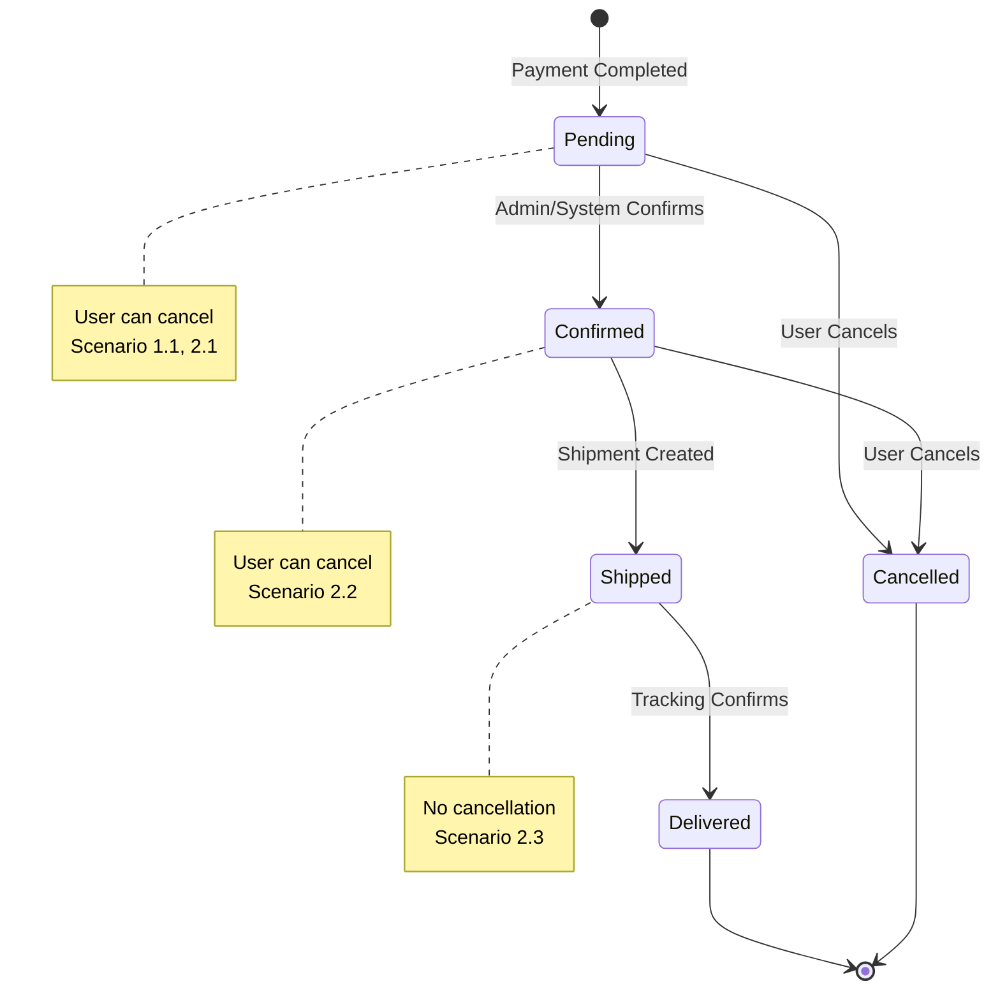

# Feature: Order Management

> **Purpose:**
> This document defines a single feature's intent, scope, user experience, and completion criteria.
> It is the **single source of truth** for planning, review, automation, and execution.

---

## 0. Metadata

All metadata is defined in the frontmatter above (between the `---` markers).

**Important:** The frontmatter is used by automation scripts to:

- Create GitHub issues
- Link features to parent epics
- Generate feature flags
- Track status and ownership

---

## 1. Overview

**Order Management** enables the system to create, track, and manage customer orders from payment completion through to delivery, providing full order history and user-initiated cancellation capabilities.

- **What this feature enables**: Creates orders from successful payments, maintains order history for authenticated and guest users, and allows cancellation before shipment
- **Why it exists**: To provide customers with a transparent record of their purchases and the ability to manage orders before they're fulfilled
- **What meaningful change it introduces**: Establishes the Order aggregate as the core entity for post-purchase interactions, enabling order tracking, history, and lifecycle management

This feature serves as the bridge between payment processing and fulfillment, creating the authoritative record of customer purchases.

## Flow Diagram



Caption: "Order lifecycle state transitions showing cancellation windows (See Scenarios 1.1, 2.1, 2.2, 2.3)."

---

## 2. User Problem

**Describe the real problem experienced by users.**

Customers who purchase beauty products online need assurance that their order was successfully placed, the ability to review past purchases, and control over orders before they ship.

- **Who experiences the problem**: Both authenticated users and guest checkout customers
- **When and in what situations it occurs**: Immediately after payment, when checking order status, when reviewing purchase history, or when needing to cancel an order due to changed plans or mistaken selections
- **What friction, confusion, or inefficiency exists today**: Without order management, customers have no way to confirm their purchase, track order status, or make changes before shipment, leading to support requests, uncertainty, and dissatisfaction
- **Why existing behavior or solutions are insufficient**: Manual email confirmations lack real-time status updates, and customers cannot self-service order changes, creating dependency on customer support

---

## 3. Goals

### User Experience Goals

- **Immediate confirmation**: Users see their order created immediately after successful payment with a unique order number
- **Self-service access**: Authenticated users can view complete order history; guest users can lookup orders via email + order number
- **Empowered control**: Users can cancel orders before shipment without contacting support
- **Transparency**: Order status is always current and displayed from live catalog data, not stale snapshots
- **Trust building**: Clear order lifecycle status (pending, confirmed, shipped, delivered, cancelled) reduces anxiety

### Business / System Goals

- Create authoritative Order aggregate as source of truth for purchases
- Emit domain events (OrderPlaced, OrderCancelled) for downstream processes (notifications, fulfillment)
- Enable order cancellation before inventory allocation and shipment
- Support both authenticated and guest order workflows
- Provide GraphQL API for order queries and mutations

---

## 4. Non-Goals

**Explicitly state what this feature does not attempt to solve.**

- **Post-shipment cancellation**: Orders cannot be cancelled after shipment status is reached (deferred to returns/refunds feature)
- **Order modification**: Users cannot edit order contents (address, products) after creation; only cancellation is supported
- **Split shipments to multiple addresses**: Single shipping address per order (per PRD exclusions)
- **Product data snapshotting**: Order displays current catalog data, not historical product details at purchase time
- **Return/refund processing**: Separate feature outside this scope
- **Advanced admin workflows**: Single admin role with full access; no granular permissions

---

## 5. Functional Scope

**Describe what the feature enables at a conceptual level.**

### Core Capabilities

- **Order Creation**: Automatically create Order aggregate when PaymentCompleted event is received
- **Order History**: Authenticated users can view all their orders sorted by date
- **Guest Order Lookup**: Guest users can retrieve order details using email + order number combination
- **Order Cancellation**: Users can cancel orders in "pending" or "confirmed" status before shipment
- **Status Tracking**: Order status reflects current lifecycle state (pending, confirmed, shipped, delivered, cancelled)
- **Product Data Display**: Order displays product information from current catalog (not snapshot)

### System Responsibilities

- Listen for PaymentCompleted domain events and create orders
- Validate order cancellation requests (status must be pending or confirmed)
- Emit OrderPlaced and OrderCancelled domain events
- Store orders in Firestore `orders` collection
- Enforce authorization (users can only view/cancel their own orders)
- Generate unique order numbers for guest lookup

---

## 6. Dependencies & Assumptions

**List conditions required for this feature to function as intended.**

### Dependencies

- **F-009: Payment Processing** (CRITICAL): Orders are created from PaymentCompleted events
- **F-004: Product Catalog Management**: Product data must be available for order display
- **F-003: User Authentication**: Required for authenticated user order history (guest flow is independent)
- **F-001: Platform Foundation**: Firebase, Firestore, GraphQL Mesh infrastructure

### Assumptions

- Payment gateway provides authoritative payment success signal before order creation
- Users understand that cancellation is only available before shipment
- Email + order number combination is sufficient authentication for guest order lookup
- Product data displayed from current catalog is acceptable (no snapshot required)
- Order confirmation workflow (pending → confirmed) is manual or automated but occurs before shipment creation

### Constraints

- Orders cannot be modified after creation (only cancelled)
- Inventory reservation from cart is released on successful payment or order cancellation
- Order numbers must be unique and easily communicable (for guest lookup)

---

## 7. User Stories & Experience Scenarios

> This section defines **how users live with the feature**.
> Scenarios must focus on **quality of life and lifecycle experience**, not just technical failures.

---

### User Story 1 — Order Confirmation After Purchase

**As a** beauty product customer (authenticated or guest)
**I want** to immediately see confirmation that my order was created after successful payment
**So that** I have peace of mind that my purchase was recorded and I know what to expect next

---

#### Scenarios

##### Scenario 1.1 — First-Time Purchase Confirmation

**Given** a user has completed payment successfully for the first time
**When** the payment completes and the order is created
**Then** the system should display an order confirmation screen with order number, order status (pending), itemized product list with current prices, shipping address, and payment amount
**And** the next steps (order confirmation timeline, expected shipment) should be clearly visible

---

##### Scenario 1.2 — Returning Customer Order Confirmation

**Given** an authenticated user has prior orders in their history
**And** they complete a new purchase
**When** the order confirmation screen is displayed
**Then** the interaction should show the new order at the top of their order history
**And** prior orders remain accessible for comparison or reference

---

##### Scenario 1.3 — Interrupted Checkout Return

**Given** a user initiated checkout but left before completing payment
**When** they return and successfully complete payment
**Then** the order is created immediately upon payment success
**And** they can access the order confirmation screen without needing to re-enter any information

---

##### Scenario 1.4 — Payment Success But Order Creation Delay

**Given** payment completed successfully but order creation is delayed (system latency)
**When** the user is on the confirmation screen
**Then** the system shows a loading state with "Creating your order..." message
**And** provides reassurance that payment was successful and order will appear shortly
**And** automatically refreshes when order is created

---

##### Scenario 1.5 — Large Order Volume Performance

**Given** high order volume during peak shopping periods
**When** a user completes payment
**Then** the system provides immediate feedback ("Order submitted") within 2 seconds
**And** remains responsive to navigation (e.g., continue shopping, view order history)
**And** background processes complete order creation without blocking user interaction

---

##### Scenario 1.6 — Mobile Order Confirmation Display

**Given** users on mobile devices (320px-768px viewports)
**When** they view the order confirmation screen
**Then** all order details (number, status, items, address) are readable without horizontal scrolling
**And** primary actions (view order, continue shopping) are thumb-reachable

---

### User Story 2 — Order Cancellation Before Shipment

**As a** beauty product customer
**I want** to cancel my order before it ships if I change my mind or made a mistake
**So that** I can avoid receiving unwanted products and receive a refund without contacting support

---

#### Scenarios

##### Scenario 2.1 — Cancel Order in Pending Status

**Given** an authenticated user has an order in "pending" status
**When** they navigate to order details and select "Cancel Order"
**Then** the system should display a confirmation dialog explaining that cancellation will process a refund
**And** upon confirmation, immediately update order status to "cancelled"
**And** display cancellation confirmation with refund timeline

---

##### Scenario 2.2 — Cancel Order in Confirmed Status

**Given** a user has an order in "confirmed" status (not yet shipped)
**When** they request cancellation
**Then** the system allows cancellation with the same confirmation flow as pending status
**And** the order status transitions to "cancelled"
**And** inventory is released back to available stock

---

##### Scenario 2.3 — Attempted Cancellation After Shipment

**Given** a user has an order in "shipped" or "delivered" status
**When** they attempt to cancel the order
**Then** the system displays a clear message: "This order has been shipped and cannot be cancelled"
**And** provides guidance on return/refund process (with link to support or future returns feature)
**And** the cancel button is disabled or hidden

---

##### Scenario 2.4 — Guest User Order Cancellation

**Given** a guest user looks up their order via email + order number
**And** the order status is "pending" or "confirmed"
**When** they select "Cancel Order"
**Then** the cancellation flow proceeds identically to authenticated users
**And** confirmation email is sent to the provided email address

---

##### Scenario 2.5 — Concurrent Cancellation and Shipment Creation

**Given** a user initiates order cancellation
**And** simultaneously, the fulfillment system begins shipment creation
**When** both processes attempt to modify order status
**Then** the system uses optimistic locking to prevent race condition
**And** if shipment creation wins, cancellation fails with clear message
**And** if cancellation wins, shipment creation is blocked

---

##### Scenario 2.6 — Cancellation on Slow Network

**Given** a user on a slow or unreliable mobile network
**When** they submit order cancellation
**Then** the system provides immediate visual feedback (loading spinner, "Processing cancellation...")
**And** retries the request if network fails
**And** displays success or failure message once operation completes

---

### User Story 3 — Order History and Tracking

**As an** authenticated beauty product customer
**I want** to view all my past orders and their current status
**So that** I can track shipments, reference past purchases, and reorder favorite products

---

#### Scenarios

##### Scenario 3.1 — First Order History View

**Given** an authenticated user navigates to "My Orders" for the first time
**When** they view the order history page
**Then** the system displays all their orders sorted by date (newest first)
**And** each order shows order number, date, status, total amount, and product thumbnails
**And** navigation to individual order details is clearly visible

---

##### Scenario 3.2 — Filtering Order History by Status

**Given** a user has multiple orders with different statuses
**When** they select a status filter (e.g., "Shipped", "Delivered", "Cancelled")
**Then** the order list updates to show only orders matching that status
**And** the active filter is visually indicated
**And** clearing the filter restores the full order list

---

##### Scenario 3.3 — Order Detail View from History

**Given** a user is viewing their order history
**When** they select a specific order
**Then** the system displays full order details including itemized products with current catalog data, shipping address, payment method, order status timeline, and tracking link (if shipped)
**And** status-appropriate actions are available (cancel if pending/confirmed)

---

##### Scenario 3.4 — Empty Order History

**Given** a newly registered user with no order history
**When** they navigate to "My Orders"
**Then** the system displays an empty state message: "You haven't placed any orders yet"
**And** provides a clear call-to-action to browse products

---

##### Scenario 3.5 — Large Order History Performance

**Given** a user with 50+ historical orders
**When** they view order history
**Then** the system loads the first page (e.g., 20 orders) within 2 seconds
**And** implements infinite scroll or pagination for remaining orders
**And** remains responsive during scrolling

---

##### Scenario 3.6 — Order History on Mobile

**Given** users accessing order history on mobile devices
**When** they view the order list
**Then** each order card is readable and tappable with adequate touch target size (min 44x44px)
**And** order details are accessible without excessive scrolling

---

### User Story 4 — Guest Order Lookup

**As a** guest customer who checked out without creating an account
**I want** to look up my order using my email and order number
**So that** I can track my order status without needing to register

---

#### Scenarios

##### Scenario 4.1 — Successful Guest Order Lookup

**Given** a guest user received an order confirmation email with order number
**When** they navigate to "Track Order" and enter their email + order number
**Then** the system displays full order details identical to authenticated user view
**And** they can cancel the order if status permits (pending/confirmed)

---

##### Scenario 4.2 — Invalid Email or Order Number

**Given** a guest user enters incorrect email or order number
**When** they submit the lookup form
**Then** the system displays a user-friendly error: "We couldn't find an order matching that email and order number"
**And** provides suggestions: "Please check your confirmation email or contact support"

---

##### Scenario 4.3 — Guest Order Lookup Rate Limiting

**Given** a user or bot attempts multiple failed lookups
**When** the failure threshold is exceeded (e.g., 5 attempts in 1 minute)
**Then** the system temporarily blocks further attempts with message: "Too many attempts. Please try again in 5 minutes"
**And** legitimate users can still succeed after cooldown period

---

##### Scenario 4.4 — Guest Order Lookup Privacy

**Given** guest order lookup is publicly accessible
**When** a user successfully looks up an order
**Then** the system displays order details but masks sensitive data (e.g., partial credit card number, full address hidden except city/state)
**And** ensures only email + order number combination grants access (no order number enumeration)

---

##### Scenario 4.5 — Guest Converts to Authenticated User

**Given** a guest user with historical orders creates an account using the same email
**When** they log in and view order history
**Then** the system displays both authenticated and guest orders associated with their email
**And** all orders are accessible from a unified order history view

---

##### Scenario 4.6 — Mobile Guest Lookup Experience

**Given** guest users on mobile devices
**When** they access the order lookup form
**Then** email and order number inputs use appropriate keyboard types (email, numeric)
**And** form validation provides inline feedback
**And** the lookup button is easily tappable

---

## 8. Edge Cases & Constraints (Experience-Relevant)

**Include only cases that materially affect user experience.**

### Hard Limits

- **Order Cancellation Window**: Orders cannot be cancelled once status transitions to "shipped" (irreversible)
- **Guest Order Lookup Rate Limit**: Maximum 5 lookup attempts per IP address per minute to prevent enumeration attacks
- **Order Number Format**: 12-character alphanumeric (e.g., ORD-ABC12345) for easy communication

### Irreversible Actions

- **Order Cancellation**: Once cancelled, order cannot be reinstated (user must create new order)
- **Status Transitions**: Order status can only progress forward (pending → confirmed → shipped → delivered) or to cancelled; no rollbacks

### Compliance & Policy Constraints

- **Data Retention**: Order records retained for 7 years for tax compliance (India GST requirements)
- **Guest Order Privacy**: Guest orders accessible only via email + order number (no user account linking without explicit consent)
- **Refund Processing**: Order cancellation triggers automatic refund via payment gateway (timeline per Cashfree policies)

---

## 9. Implementation Tasks (Execution Agent Checklist)

> This section provides the specific work items for the **Execution Agent**.
> Every task must map back to a specific scenario defined in Section 7.

```markdown
- [ ] T01 — Implement Order aggregate with OrderId, OrderStatus value object, userId, orderNumber, createdAt, updatedAt fields (Scenario 1.1)
  - [ ] Unit Test: Order creation with valid payment data
  - [ ] Unit Test: Order status transitions (pending → confirmed → shipped → delivered)
  
- [ ] T02 — Create OrderPlaced event handler that listens for PaymentCompleted events and creates Order (Scenario 1.1, 1.3)
  - [ ] Unit Test: Order creation from PaymentCompleted event
  - [ ] Integration Test: Event payload contains order details, user info, payment reference
  
- [ ] T03 — Implement Firestore schema for orders collection with indexes on userId, orderNumber, status, createdAt (Scenario 3.1, 3.2)
  - [ ] Unit Test: Firestore document structure validation
  - [ ] Integration Test: Query orders by userId with pagination
  
- [ ] T04 — Create GraphQL query: orders (authenticated users only) with filtering by status and pagination (Scenario 3.1, 3.2, 3.5)
  - [ ] Unit Test: Authorization check (user can only query own orders)
  - [ ] E2E Test: Retrieve order list for authenticated user, verify sorting and pagination
  
- [ ] T05 — Create GraphQL query: order(id) with authorization (Scenario 3.3)
  - [ ] Unit Test: Return full order details for authorized user
  - [ ] E2E Test: Retrieve single order, verify product data from current catalog
  
- [ ] T06 — Create GraphQL query: guestOrder(email, orderNumber) with rate limiting (Scenario 4.1, 4.3)
  - [ ] Unit Test: Match email + orderNumber combination
  - [ ] Unit Test: Rate limiting blocks after 5 failed attempts
  - [ ] E2E Test: Guest order lookup success and failure scenarios
  
- [ ] T07 — Implement cancelOrder GraphQL mutation with status validation (Scenario 2.1, 2.2, 2.3)
  - [ ] Unit Test: Allow cancellation for pending/confirmed status
  - [ ] Unit Test: Reject cancellation for shipped/delivered status
  - [ ] E2E Test: User cancels order, verify status update and OrderCancelled event emission
  
- [ ] T08 — Implement order cancellation with optimistic locking to prevent race conditions (Scenario 2.5)
  - [ ] Unit Test: Concurrent cancellation and shipment creation resolves correctly
  - [ ] Integration Test: Firestore transaction ensures atomic status update
  
- [ ] T09 — Emit OrderPlaced domain event on order creation (Scenario 1.1)
  - [ ] Unit Test: Event payload contains orderId, userId, orderNumber, items, total
  - [ ] Integration Test: Event published to event bus (Firestore or Pub/Sub)
  
- [ ] T10 — Emit OrderCancelled domain event on cancellation (Scenario 2.1, 2.2)
  - [ ] Unit Test: Event payload contains orderId, cancellationReason, timestamp
  - [ ] Integration Test: Event triggers downstream processes (inventory release, refund)
  
- [ ] T11 — Implement order confirmation UI component (Lit web component) for mobile-first display (Scenario 1.1, 1.6)
  - [ ] E2E Test: Order confirmation displays on successful payment
  - [ ] E2E Test: Mobile viewport (320px) renders all content without horizontal scroll
  
- [ ] T12 — Implement order history UI component with status filtering and pagination (Scenario 3.1, 3.2, 3.5)
  - [ ] E2E Test: Order history displays for authenticated user, sorted by date
  - [ ] E2E Test: Status filter updates order list
  
- [ ] T13 — Implement order detail UI component with status-based action visibility (Scenario 3.3, 2.3)
  - [ ] E2E Test: Order detail shows cancel button for pending/confirmed orders
  - [ ] E2E Test: Cancel button hidden for shipped/delivered orders
  
- [ ] T14 — Implement guest order lookup UI component with rate limiting feedback (Scenario 4.1, 4.2, 4.3)
  - [ ] E2E Test: Guest lookup succeeds with valid email + order number
  - [ ] E2E Test: Guest lookup displays error for invalid credentials
  - [ ] E2E Test: Rate limiting message displays after 5 failed attempts
  
- [ ] T15 — Implement loading and error states for order creation and cancellation (Scenario 1.4, 2.6)
  - [ ] E2E Test: Loading spinner displays during order creation
  - [ ] E2E Test: Error message displays if order creation fails
  
- [ ] T16 — Implement empty state UI for users with no orders (Scenario 3.4)
  - [ ] E2E Test: Empty state displays for new users with CTA to browse products
  
- [ ] T17 — Configure Firestore security rules for orders collection (Scenario 1.1, 3.1, 4.1)
  - [ ] Unit Test: Authenticated users can read own orders only
  - [ ] Unit Test: Guest users cannot read orders collection directly
  - [ ] Integration Test: Firestore rules enforce authorization
  
- [ ] T18 — [Rollout] Implement feature flag: order_management_enabled for gradual rollout (Scenario All)
  - [ ] Integration Test: Feature flag controls order creation, history, and cancellation visibility
  
- [ ] T19 — [Rollout] Implement feature flag: guest_order_lookup_enabled for independent guest feature rollout (Scenario 4.1)
  - [ ] Integration Test: Flag controls guest lookup form visibility and API access
```

---

## 10. Acceptance Criteria (Verifiable Outcomes)

> These criteria are used by the **Execution Agent** and **Reviewers** to verify completion.
> Each criterion must be observable and testable.

```markdown
- [ ] AC1 — Orders are created automatically when PaymentCompleted event is received (Scenario 1.1)
  - [ ] Unit test passed: Order aggregate created with correct userId, orderNumber, status
  - [ ] Integration test passed: OrderPlaced event emitted with full order details
  - [ ] E2E test passed: Order confirmation screen displays after successful payment

- [ ] AC2 — Authenticated users can view complete order history sorted by date (Scenario 3.1)
  - [ ] Unit test passed: GraphQL query returns orders for authenticated user only
  - [ ] E2E test passed: Order history page displays all user orders, newest first

- [ ] AC3 — Users can filter order history by status (Scenario 3.2)
  - [ ] E2E test passed: Status filter updates order list to show matching orders

- [ ] AC4 — Users can view full order details including current product catalog data (Scenario 3.3)
  - [ ] Unit test passed: Order detail query resolves product data from catalog
  - [ ] E2E test passed: Order detail page displays all order information

- [ ] AC5 — Users can cancel orders in pending or confirmed status (Scenario 2.1, 2.2)
  - [ ] Unit test passed: cancelOrder mutation succeeds for pending/confirmed orders
  - [ ] Unit test passed: OrderCancelled event emitted with orderId
  - [ ] E2E test passed: User cancels order, status updates to cancelled, confirmation displayed

- [ ] AC6 — Users cannot cancel orders in shipped or delivered status (Scenario 2.3)
  - [ ] Unit test passed: cancelOrder mutation rejects for shipped/delivered orders
  - [ ] E2E test passed: Cancel button disabled/hidden for shipped orders

- [ ] AC7 — Guest users can lookup orders via email + order number (Scenario 4.1)
  - [ ] Unit test passed: guestOrder query returns order for matching email + orderNumber
  - [ ] E2E test passed: Guest lookup form displays order details on successful lookup

- [ ] AC8 — Guest order lookup handles invalid credentials gracefully (Scenario 4.2)
  - [ ] Unit test passed: guestOrder query returns null for invalid credentials
  - [ ] E2E test passed: User-friendly error message displayed

- [ ] AC9 — Guest order lookup is rate limited to prevent enumeration (Scenario 4.3)
  - [ ] Unit test passed: Rate limiter blocks after 5 failed attempts per IP
  - [ ] E2E test passed: Rate limit message displayed after threshold

- [ ] AC10 — Order creation handles system latency gracefully (Scenario 1.4)
  - [ ] E2E test passed: Loading state displayed during order creation
  - [ ] E2E test passed: Order confirmation auto-refreshes when creation completes

- [ ] AC11 — Order management UI is mobile-optimized (320px-768px viewports) (Scenario 1.6, 3.6, 4.6)
  - [ ] E2E test passed: All order screens render without horizontal scroll on 320px viewport
  - [ ] E2E test passed: Touch targets meet minimum size (44x44px)

- [ ] AC12 — Concurrent cancellation and shipment creation is handled safely (Scenario 2.5)
  - [ ] Unit test passed: Optimistic locking prevents race condition
  - [ ] Integration test passed: Only one operation succeeds, other fails gracefully

- [ ] AC13 — Empty order history displays helpful empty state (Scenario 3.4)
  - [ ] E2E test passed: Empty state message and CTA displayed for users with no orders

- [ ] AC14 — Firestore security rules enforce authorization (Scenario 1.1, 3.1, 4.1)
  - [ ] Integration test passed: Users can only read own orders
  - [ ] Integration test passed: Guest users cannot bypass guestOrder query

- [ ] AC15 — [Gating] Feature flag order_management_enabled correctly controls visibility and access
  - [ ] Integration test passed: When false, order creation is disabled
  - [ ] Integration test passed: When true, all order features are accessible

- [ ] AC16 — [Gating] Feature flag guest_order_lookup_enabled correctly controls guest lookup
  - [ ] Integration test passed: When false, guest lookup form is hidden
  - [ ] Integration test passed: When true, guest lookup is accessible
```

---

## 11. Rollout & Risk (If Applicable)

### Rollout Strategy

**Progressive Rollout**: Order Management will be rolled out using a phased approach to minimize risk:

1. **Phase 1 (0% → 10%)**: Internal testing with test payment accounts
2. **Phase 2 (10% → 25%)**: Early adopters (selected user cohort)
3. **Phase 3 (25% → 50%)**: Broader rollout monitoring order creation success rate
4. **Phase 4 (50% → 100%)**: Full rollout once error rate <0.5%

### Risk Mitigation

**Primary Risks**:
- **Order creation failure after payment**: Implement retry logic and manual order creation workflow for edge cases
- **Concurrent cancellation and shipment**: Optimistic locking in Firestore transactions prevents race conditions
- **Guest order enumeration**: Rate limiting (5 attempts/minute) prevents brute force attacks
- **Performance degradation**: Order history pagination and lazy loading prevent slow queries

**Monitoring**:
- Order creation success rate (target: >99.5%)
- Order cancellation success rate (target: >99%)
- Guest lookup error rate (target: <1% excluding invalid credentials)
- Order history page load time (target: <2 seconds for p95)

### Exit/Cleanup Criteria

- Feature flags remain until 100% rollout is stable for 7 days
- After successful rollout, remove feature flag checks from code
- Monitor order-related support requests to identify UX improvements

### Remote Config Flags

<!-- REMOTE_CONFIG_FLAG_START -->
| Context | Type | Namespace | Default (Dev) | Default (Stg) | Default (Prod) | Key |
|---------|------|-----------|---------------|---------------|----------------|-----|
| order_management | BOOLEAN | client | true | false | false | feature_fe_f010_fl_001_order_management_enabled |
| guest_order_lookup | BOOLEAN | client | true | false | false | feature_fe_f010_fl_002_guest_order_lookup_enabled |
| order_cancellation | BOOLEAN | client | true | false | false | feature_fe_f010_fl_003_order_cancellation_enabled |
<!-- REMOTE_CONFIG_FLAG_END -->

---

## 12. History & Status

- **Status:** Draft
- **Feature ID:** F-010
- **Dependencies:** F-009 (Payment Processing), F-004 (Product Catalog Management), F-003 (User Authentication)
- **Related Epics:** Order & Fulfillment
- **Related Issues:** TBD (created post-merge)

---

## Final Note

> This document defines **intent and experience**.
> Execution details are derived from it — never the other way around.
