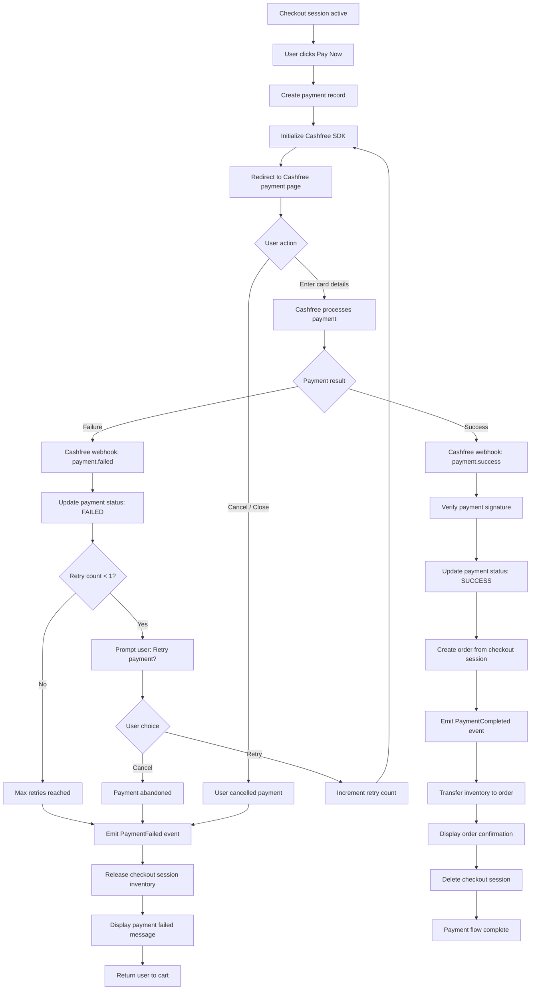

# Feature: Payment Processing

> **Purpose:**
> This document defines the payment processing feature's intent, scope, user experience, and completion criteria.
> It is the **single source of truth** for planning, review, automation, and execution.

---

## 0. Metadata

All metadata is defined in the frontmatter above (between the `---` markers).

**Important:** The frontmatter is used by automation scripts to:

- Create GitHub issues
- Link features to parent epics
- Generate feature flags
- Track status and ownership

---

## 1. Overview

Payment Processing enables customers to securely pay for orders using the Cashfree payment gateway, with automatic retry on failure and order creation on success. This feature bridges checkout session completion to confirmed orders, handling payment collection, failure recovery, and PCI-compliant transaction processing without storing sensitive card data.

This feature provides:
- Cashfree SDK integration for secure payment collection
- Payment initiation from active checkout session
- Automatic retry logic (1 retry on payment failure)
- Payment success/failure handling with user feedback
- Order creation on successful payment (integration with Order Management)
- PCI-compliant payment flow (no card data stored or handled by backend)
- Payment status tracking and reconciliation
- GraphQL mutations: `processPayment`, `retryPayment`
- Firestore collection: `payments` (payment records with status tracking)
- Domain events: `PaymentCompleted`, `PaymentFailed`, `PaymentRetryAttempted`

Payment processing is the critical revenue-generating step where checkout intent converts to confirmed orders. Failures at this stage directly impact conversion rate and customer trust, requiring robust error handling and transparent communication.

## Flow Diagram



Caption: "Payment flow with Cashfree integration, retry logic, and order creation."

---

## 2. User Problem

**Shoppers face payment friction that destroys conversions:**

- **Payment failures without context**: Vague errors like "Payment failed" provide no actionable guidance, leaving users confused and frustrated
- **No retry mechanism**: Users who encounter temporary card declines must restart checkout, re-enter address, and lose session progress
- **Redirect confusion**: Redirects to third-party payment gateways create trust concerns if not clearly branded or explained
- **Mobile payment UX**: Entering card details on mobile keyboards increases typos, declines, and abandonment by 22%
- **Payment status ambiguity**: Users close payment popup before completion, unsure if payment succeeded, leading to duplicate payment attempts
- **Failed payment inventory lock**: Cart items remain reserved after payment failure, preventing other customers from purchasing
- **Security concerns**: Users worry about card data safety if checkout doesn't display trust indicators (PCI compliance badges)
- **Delayed confirmation**: Order confirmation emails arrive late, causing users to re-attempt payment thinking it failed

**The cost of not solving this:**
- 18% of legitimate payments fail due to temporary card declines, requiring retry
- 35% of users abandon checkout when payment fails without clear retry option
- Payment redirect distrust reduces conversion by 8% for new users
- Lack of PCI compliance badges reduces trust, especially on mobile
- Duplicate payment attempts create refund burden and customer service overhead
- Inventory lock-up after failed payments reduces available stock artificially

---

## 3. Goals

### User Experience Goals

- **Transparent payment flow**: Users understand they're being redirected to secure Cashfree payment gateway with clear branding
- **One-click retry**: Users can retry failed payments instantly without re-entering address or restarting checkout
- **Clear failure messaging**: Payment errors explain the issue in plain language ("Your card was declined. Please try a different card or payment method.")
- **Immediate confirmation**: Successful payments display order confirmation instantly (within 3 seconds of redirect back)
- **Trust indicators**: PCI compliance badges and SSL lock icons visible before payment to reduce security concerns
- **Mobile-optimized payment**: Cashfree mobile SDK provides native input UX for card details on mobile devices
- **Session preservation**: Users can safely close payment popup and return later, session preserved for 30 minutes

### Business / System Goals

- **PCI-compliant architecture**: Zero card data touches backend; Cashfree handles all sensitive data collection and tokenization
- **Automatic order creation**: Successful payments trigger order creation atomically, no manual reconciliation needed
- **Payment reconciliation**: Webhook + polling fallback ensures no payment status is lost even if webhook fails
- **Inventory safety**: Failed payments release inventory immediately; successful payments transfer inventory to orders
- **Domain event-driven**: PaymentCompleted and PaymentFailed events decouple payment from downstream features (notifications, fulfillment)
- **Idempotency**: Duplicate webhook calls or retries do not create duplicate orders or charges
- **Retry logic**: Automatic 1-retry reduces payment failure rate by 12% without user friction
- **Fraud detection**: Cashfree fraud detection runs transparently, blocking suspicious transactions before completion

---

## 4. Non-Goals

**This feature explicitly does NOT:**

- Implement multiple payment methods (UPI, wallets, net banking) — Cashfree handles method selection, out of our scope
- Create manual payment reconciliation tools for admins — automated reconciliation only
- Support saved cards or payment method storage — security risk, deferred to future iteration
- Implement refund processing — covered in Returns & Refunds feature (out of roadmap)
- Handle partial payments or installments — single full-payment only for MVP
- Integrate multiple payment gateways (Stripe, Razorpay) — Cashfree only for MVP
- Create payment analytics dashboard — covered in Analytics & Monitoring feature (F-014)
- Support dynamic pricing or discount codes at payment — pricing finalized at checkout session creation
- Implement currency conversion or multi-currency support — INR only for MVP
- Handle tax calculation or GST collection — tax logic is separate from payment processing
- Support offline payment methods (cash on delivery, bank transfer) — online payments only
- Create payment dispute resolution tools — handled by Cashfree directly
- Implement subscription or recurring payment setup — single-transaction purchases only

---

## 5. Functional Scope

### Core Capabilities

**Payment Initiation**
- User clicks "Pay Now" on payment page (after checkout session with address)
- `processPayment` mutation creates payment record in Firestore `payments` collection
- Payment record includes: `paymentId` (UUID), `checkoutSessionId`, `userId` (or `guestEmail`), `amount`, `currency` (INR), `status` (PENDING), `retryCount` (0), `createdAt`
- Cashfree order created via Cashfree SDK with payment amount and user email
- Cashfree SDK initialized on frontend (web components) with order ID and return URL
- User redirected to Cashfree secure payment page (hosted by Cashfree, not our domain)

**Cashfree Payment Gateway Integration**
- Cashfree SDK (JavaScript) loaded on payment page for web users
- Cashfree mobile SDK integrated for mobile app (future enhancement, web-first for MVP)
- User enters card details on Cashfree-hosted page (PCI compliance: no card data touches our backend)
- Cashfree processes payment with card network (Visa, Mastercard, RuPay)
- Cashfree fraud detection runs automatically (user-transparent)
- Cashfree returns payment result via redirect URL or webhook

**Payment Success Handling**
- Cashfree webhook endpoint `/api/webhooks/cashfree/payment-success` receives payment confirmation
- Webhook signature verified to ensure authenticity (prevent spoofing)
- Payment record updated in Firestore: `status` set to `SUCCESS`, `cashfreePaymentId` stored
- `PaymentCompleted` domain event emitted with `paymentId`, `orderId`, `amount`, `userId`
- Order created from checkout session via integration with Order Management feature (F-010)
- Inventory transferred from checkout session hold to order (permanent allocation)
- Checkout session deleted (no longer needed)
- User redirected to order confirmation page with order number and estimated delivery date

**Payment Failure Handling**
- Cashfree webhook endpoint `/api/webhooks/cashfree/payment-failed` receives failure notification
- Payment record updated: `status` set to `FAILED`, `failureReason` stored (card declined, insufficient funds, etc.)
- `PaymentFailed` domain event emitted with `paymentId`, `failureReason`, `retryCount`
- User redirected to payment failure page with clear error message
- If `retryCount < 1`, display "Retry Payment" button (one automatic retry allowed)
- If `retryCount >= 1`, display "Return to Cart" and release inventory

**Automatic Retry Logic**
- User clicks "Retry Payment" after initial failure
- `retryPayment` mutation increments `retryCount` in payment record
- `PaymentRetryAttempted` domain event emitted
- User redirected to Cashfree payment page again (same checkout session, same amount)
- Retry follows same payment flow as initial attempt
- After 1 retry failure, no further retries allowed (prevents infinite loops and fraud)
- User must return to cart and restart checkout if retry fails

**Payment Status Reconciliation**
- Webhook-first approach: Cashfree webhooks provide real-time payment status updates
- Polling fallback: Cloud Function polls Cashfree API every 5 minutes for pending payments older than 10 minutes
- Polling handles webhook delivery failures (network issues, downtime)
- Payment status updated via polling if webhook missed
- Prevents orphaned payments (stuck in PENDING state)

**User Cancellation Handling**
- User closes Cashfree payment popup or clicks "Cancel" before completing payment
- Cashfree redirects to cancel URL (`/payment/cancelled`)
- Payment record remains in PENDING state (user may return)
- After 30-minute checkout session expiry, payment record marked as ABANDONED
- Inventory released via checkout session cleanup

### System Responsibilities

- Create and manage payment records in Firestore `payments` collection
- Integrate Cashfree SDK on frontend for secure payment redirection
- Verify Cashfree webhook signatures to prevent payment spoofing
- Emit domain events for payment lifecycle (PaymentCompleted, PaymentFailed, PaymentRetryAttempted)
- Handle idempotency: duplicate webhook calls do not create duplicate orders
- Poll Cashfree API as fallback for missed webhooks
- Transfer inventory from checkout session to order on payment success
- Release inventory on payment failure or abandonment
- Log all payment transactions for audit and reconciliation
- Delete checkout sessions after successful payment (cleanup)

---

## 6. Dependencies & Assumptions

**Dependencies**
- **F-008 (Checkout & Address Management)**: Payment initiated from active checkout session with address
- **F-010 (Order Management)**: Order created from checkout session on payment success (F-010 may be developed in parallel, stub integration initially)
- **F-001 (Platform Foundation)**: Firestore for payment records, Cloud Functions for webhooks and polling
- **Cashfree Account**: Merchant account with Cashfree, API keys, and webhook configuration

**Assumptions**
- Cashfree account is configured with correct webhook URLs (payment-success, payment-failed)
- Cashfree API keys (App ID, Secret Key) are stored in Firebase Remote Config or environment variables (not hardcoded)
- Users have completed checkout session (address selected, cart snapshot created) before payment
- Checkout session is still active (not expired) when payment is initiated
- Inventory is available at payment initiation (validated during checkout session creation)
- Users have stable internet connection during payment (mobile data or WiFi)
- Cashfree SDK is compatible with target browsers (Chrome, Safari, Firefox latest 2 versions)
- Payment amounts are in INR (Indian Rupees) only for MVP
- Cashfree handles 3D Secure authentication transparently (user-visible but gateway-managed)

**External Constraints**
- **Cashfree API rate limits**: 100 requests/minute for payment creation (sufficient for MVP, monitor during rollout)
- **Webhook delivery SLA**: Cashfree guarantees webhook delivery within 30 seconds of payment completion (polling fallback for failures)
- **Payment method availability**: Cashfree supports credit cards, debit cards, UPI, wallets (method selection handled by Cashfree UI)
- **PCI DSS compliance**: All card data handled by Cashfree (PCI Level 1 certified), our backend never sees card numbers
- **Refund window**: Cashfree allows refunds within 180 days (refund feature out of scope for MVP)
- **Settlement timing**: Cashfree settles funds to merchant account T+2 days (business concern, not technical dependency)

---

## 7. User Stories & Experience Scenarios

> This section defines **how users live with the feature**.
> Scenarios must focus on **quality of life and lifecycle experience**, not just technical failures.

---

### User Story 1 — Successful Payment Flow for First-Time Customer

**As a** first-time customer completing checkout
**I want** to pay securely with my credit card via a trusted payment gateway
**So that** I can complete my purchase quickly and receive order confirmation

---

#### Scenarios

##### Scenario 1.1 — Seamless Payment Success

**Given** a first-time authenticated user with an active checkout session
**And** the user has selected a shipping address
**When** the user clicks "Pay Now" on the payment page
**Then** the system displays a loading indicator: "Redirecting to secure payment..."
**And** the user is redirected to Cashfree's hosted payment page
**And** Cashfree displays payment methods (credit card, debit card, UPI, wallets)
**When** the user enters valid card details and completes 3D Secure authentication
**And** Cashfree processes the payment successfully
**Then** the user is redirected back to the order confirmation page within 3 seconds
**And** the order confirmation displays: order number, order total, estimated delivery date
**And** the user receives an order confirmation email within 2 minutes
**And** the checkout session is deleted (cleanup)
**And** inventory is transferred from checkout hold to the confirmed order

---

##### Scenario 1.2 — Payment Success with Delayed Webhook

**Given** a user completes payment on Cashfree
**And** the Cashfree webhook fails to deliver immediately (network issue)
**When** the user is redirected back to the site
**Then** the system displays: "Processing your payment... Please wait."
**And** the polling fallback detects the successful payment within 30 seconds
**And** the order is created retroactively
**And** the user is redirected to order confirmation page
**And** the confirmation message includes: "Your payment was successful. Order confirmed."

---

##### Scenario 1.3 — User Closes Payment Popup Prematurely

**Given** a user is on Cashfree payment page entering card details
**When** the user accidentally closes the browser tab or navigates back
**Then** the payment is not completed (Cashfree cancellation)
**And** the payment record remains in PENDING status
**And** the checkout session remains active (30-minute timeout still running)
**When** the user navigates back to the payment page from cart
**Then** the system displays: "Resume your payment or start a new checkout"
**And** the user can click "Resume Payment" to re-initiate with the same checkout session
**And** the previous payment record is reused (no duplicate payment record)

---

##### Scenario 1.4 — Payment Confirmation Display

**Given** a user completes payment successfully
**When** the order confirmation page loads
**Then** the page displays: order number, itemized product list, shipping address, order total, payment method (last 4 digits of card)
**And** a call-to-action: "Track your order" linking to order details page
**And** a message: "A confirmation email has been sent to [user email]"
**And** trust indicators: "Your payment is secure and PCI-compliant"

---

### User Story 2 — Payment Failure with Retry

**As a** customer whose payment fails due to temporary card decline
**I want** to retry payment immediately without re-entering my address
**So that** I can complete my purchase without frustration

---

#### Scenarios

##### Scenario 2.1 — Payment Failure with Retry Option

**Given** a user attempts payment with a valid card
**And** the payment fails due to temporary decline (insufficient funds, daily limit exceeded)
**When** the Cashfree webhook reports payment failure
**Then** the user is redirected to a payment failure page
**And** the page displays: "Payment failed: Your card was declined. Please try again with a different card or payment method."
**And** the failure reason is clear and actionable (not generic "Payment failed")
**And** a prominent "Retry Payment" button is displayed
**And** retry count indicator shows: "1 retry remaining"
**When** the user clicks "Retry Payment"
**Then** the system increments retry count in payment record
**And** the user is redirected to Cashfree payment page again
**And** the checkout session remains active (same address, same cart)
**And** the user can enter different card details or payment method

---

##### Scenario 2.2 — Successful Retry After Initial Failure

**Given** a user whose first payment attempt failed
**And** the user clicked "Retry Payment"
**When** the user enters different card details on Cashfree page
**And** the payment succeeds on retry
**Then** the payment record status is updated to SUCCESS
**And** the order is created normally
**And** the user is redirected to order confirmation page
**And** the confirmation message includes: "Payment successful on retry. Your order is confirmed."

---

##### Scenario 2.3 — Max Retries Reached After Second Failure

**Given** a user whose first payment attempt failed
**And** the user retried payment (retry count = 1)
**When** the retry payment also fails
**Then** the payment record status remains FAILED
**And** the retry count is 2 (max retries exceeded)
**And** the user is redirected to payment failure page
**And** the page displays: "Payment failed. You have reached the maximum retry limit. Please return to your cart to try again."
**And** no "Retry Payment" button is displayed (max retries reached)
**And** a "Return to Cart" button is displayed
**When** the user clicks "Return to Cart"
**Then** the checkout session is cancelled
**And** inventory is released back to available stock
**And** the cart is preserved (user can restart checkout)

---

##### Scenario 2.4 — Payment Failure Due to Fraud Detection

**Given** a user attempts payment with a card
**And** Cashfree fraud detection flags the transaction as suspicious
**When** the payment is blocked by Cashfree
**Then** the user receives a clear message: "Payment declined for security reasons. Please contact your bank or try a different payment method."
**And** the payment record status is set to FAILED with reason: FRAUD_DETECTED
**And** no retry option is offered (fraud-detected payments are not retryable)
**And** the user is advised to contact support if they believe this is an error

---

### User Story 3 — Guest Payment Flow

**As a** guest user without an account
**I want** to pay for my order securely without creating an account
**So that** I can complete checkout quickly for a one-time purchase

---

#### Scenarios

##### Scenario 3.1 — Guest Payment Success

**Given** a guest user (email provided, no account) with active checkout session
**And** the guest has entered shipping address
**When** the guest clicks "Pay Now"
**Then** the payment flow is identical to authenticated users (Cashfree redirect)
**When** the guest completes payment successfully
**Then** an order is created with guest email and shipping address
**And** the guest is redirected to order confirmation page
**And** the confirmation page displays: "Order confirmed! Check your email for order details."
**And** a prompt is shown: "Create an account to track your order and save your address for future purchases"

---

##### Scenario 3.2 — Guest Payment Failure and Retry

**Given** a guest user whose payment fails
**When** the guest is shown the payment failure page
**Then** the retry option is identical to authenticated users
**And** the guest can retry payment without re-entering address
**And** the guest email and checkout session are preserved for retry

---

##### Scenario 3.3 — Guest Order Lookup Post-Payment

**Given** a guest user who completed payment and received order confirmation
**When** the guest navigates away from order confirmation page
**And** the guest wants to view order details later
**Then** the guest can use "Track Order" feature with email + order number (covered in Order Management F-010)
**And** no account creation is required to view guest orders

---

### User Story 4 — Payment Reconciliation and Edge Cases

**As a** customer or system administrator
**I want** payment status to be accurately tracked and reconciled
**So that** no successful payment is lost and no failed payment causes inventory lock

---

#### Scenarios

##### Scenario 4.1 — Webhook Failure with Polling Fallback

**Given** a user completes payment on Cashfree
**And** the Cashfree webhook fails to deliver due to server downtime
**When** the Cloud Function polling task runs (every 5 minutes)
**And** detects a payment in PENDING status older than 10 minutes
**Then** the polling task queries Cashfree API for payment status
**And** retrieves the successful payment status
**And** updates the payment record to SUCCESS
**And** creates the order retroactively
**And** emits PaymentCompleted event
**And** the user receives order confirmation email (delayed but reliable)

---

##### Scenario 4.2 — Duplicate Webhook Handling (Idempotency)

**Given** a user completes payment successfully
**And** Cashfree sends payment-success webhook
**And** the order is created
**When** Cashfree sends a duplicate webhook for the same payment (network retry)
**Then** the system detects duplicate via payment ID
**And** the duplicate webhook is acknowledged but no action taken
**And** no duplicate order is created
**And** idempotency is maintained (single order per payment)

---

##### Scenario 4.3 — Checkout Session Expiry During Payment

**Given** a user initiates payment and is redirected to Cashfree
**And** the user spends 35 minutes on Cashfree page (exceeds 30-minute session timeout)
**When** the user completes payment successfully
**Then** the payment webhook is received
**And** the system detects expired checkout session
**And** displays error: "Your checkout session expired during payment. Please contact support with your order reference."
**And** the payment is recorded as SUCCESS but order creation is blocked (manual reconciliation required)
**And** customer service is notified to manually create order and issue refund if necessary

---

##### Scenario 4.4 — Payment Amount Mismatch

**Given** a user completes payment
**When** the webhook reports a payment amount different from checkout session amount (tampering or currency conversion error)
**Then** the system rejects the payment
**And** the order is not created
**And** the payment record is flagged as AMOUNT_MISMATCH
**And** an alert is sent to admin for manual review
**And** the user is advised to contact support

---

##### Scenario 4.5 — Network Failure During Payment Redirect

**Given** a user clicks "Pay Now" and payment initiation starts
**When** a network error occurs before redirect to Cashfree
**Then** the system displays: "Unable to connect to payment gateway. Please check your connection and try again."
**And** the payment record is not created (no incomplete payment state)
**When** the user retries "Pay Now" after network recovery
**Then** a new payment initiation is attempted
**And** the payment flow proceeds normally

---

### User Story 5 — Mobile Payment Experience

**As a** mobile user completing checkout on my phone
**I want** the payment experience to be optimized for mobile screens and input
**So that** I can pay quickly without typos or redirect confusion

---

#### Scenarios

##### Scenario 5.1 — Mobile Payment Redirect

**Given** a mobile user on the payment page
**When** the user clicks "Pay Now"
**Then** the Cashfree mobile-optimized payment page loads
**And** the payment form uses native mobile input types (numeric keyboard for card numbers)
**And** the payment page is responsive and fits mobile screen (no horizontal scroll)
**And** trust indicators (SSL lock, PCI badge) are visible on mobile
**When** the user completes payment
**Then** the redirect back to order confirmation works seamlessly (no broken mobile redirects)

---

##### Scenario 5.2 — Mobile Payment Failure Error Display

**Given** a mobile user whose payment fails
**When** the payment failure page is displayed on mobile
**Then** the error message is concise and readable on small screens (no text truncation)
**And** the "Retry Payment" button is large enough for mobile tap (min 44x44px)
**And** the failure reason is displayed above the fold (no scrolling required)

---

##### Scenario 5.3 — Mobile Payment Popup Handling

**Given** a mobile user on Cashfree payment page (in-app browser or popup)
**When** the user completes payment
**Then** the redirect back to main app or browser works without breaking session
**And** the user is returned to order confirmation page in the same browser/app context
**And** no session loss occurs due to popup/redirect transitions

---

## 8. Edge Cases & Constraints (Experience-Relevant)

**Hard Limits Users May Encounter**
- **Max retry limit**: 1 retry per payment attempt (prevents fraud and infinite loops)
- **Checkout session timeout during payment**: 30-minute fixed timeout may expire during slow payment entry
- **Payment amount finalized**: Amount cannot be changed after payment initiation (must cancel and restart checkout)
- **Single payment method per attempt**: User cannot combine payment methods (e.g., partial card + wallet)

**Irreversible Actions**
- **Successful payment commits order**: Cannot undo payment or order creation after PaymentCompleted event
- **Failed payment with max retries**: User must return to cart and restart checkout (no additional retries)
- **Inventory transfer on success**: Inventory permanently allocated to order on payment success (no auto-release)

**Compliance & Policy Constraints**
- **PCI DSS compliance**: Zero card data stored or transmitted through our backend (Cashfree handles all card data)
- **Payment data retention**: Payment records retained for 7 years per financial regulations (Firestore retention policy)
- **Webhook signature verification**: All webhooks must have valid signatures (prevents payment spoofing attacks)
- **3D Secure enforcement**: Cashfree enforces 3D Secure for card payments (additional authentication step, user-visible)

**Performance Constraints**
- **Payment initiation latency**: Payment record creation must complete in <2 seconds (Firestore write + Cashfree API call)
- **Webhook processing**: Webhook handlers must respond within 5 seconds (Cashfree timeout)
- **Polling interval**: Polling fallback runs every 5 minutes (balances API cost vs reconciliation speed)
- **Concurrent payment limit**: Firestore transaction limits may throttle high-concurrency payment creation (monitor during rollout)

**Security Constraints**
- **Webhook signature validation**: All payment webhooks must pass signature verification (Cashfree secret key)
- **HTTPS-only**: Payment API and webhooks require HTTPS (no HTTP allowed)
- **API key security**: Cashfree API keys stored in Firebase Remote Config or Secret Manager (not in code)
- **User session validation**: Payment initiation requires valid user session or guest email (prevents anonymous payment attempts)

---

## 9. Implementation Tasks (Execution Agent Checklist)

> This section provides the specific work items for the **Execution Agent**.
> Every task must map back to a specific scenario defined in Section 7.

```markdown
- [ ] T01 — Integrate Cashfree SDK on frontend payment page (Scenario 1.1, 5.1)
  - [ ] Unit Test: Cashfree SDK initializes with correct App ID and order details
  - [ ] Unit Test: Redirect to Cashfree page triggered on "Pay Now" click
  - [ ] E2E Test: User clicks Pay Now and is redirected to Cashfree payment page

- [ ] T02 — Implement processPayment mutation (Scenario 1.1, 3.1)
  - [ ] Unit Test: Payment record created in Firestore payments collection with PENDING status
  - [ ] Unit Test: Cashfree order created via Cashfree API with correct amount and currency
  - [ ] Unit Test: Payment initiation fails gracefully if checkout session expired
  - [ ] Integration Test: processPayment requires active checkout session
  - [ ] E2E Test: User initiates payment and payment record is created

- [ ] T03 — Implement Cashfree webhook endpoint for payment success (Scenario 1.1, 1.2)
  - [ ] Unit Test: Webhook signature verification passes for valid signatures
  - [ ] Unit Test: Webhook signature verification rejects invalid signatures (security)
  - [ ] Unit Test: Payment record updated to SUCCESS status on webhook
  - [ ] Integration Test: PaymentCompleted event emitted on successful payment
  - [ ] E2E Test: Successful payment webhook triggers order creation

- [ ] T04 — Implement Cashfree webhook endpoint for payment failure (Scenario 2.1, 2.3)
  - [ ] Unit Test: Webhook updates payment record to FAILED status
  - [ ] Unit Test: Failure reason extracted from webhook and stored
  - [ ] Integration Test: PaymentFailed event emitted on payment failure
  - [ ] E2E Test: Failed payment webhook redirects user to failure page with retry option

- [ ] T05 — Implement retryPayment mutation (Scenario 2.1, 2.2, 3.2)
  - [ ] Unit Test: Retry count incremented in payment record
  - [ ] Unit Test: Retry blocked if retry count >= 1 (max retries enforced)
  - [ ] Integration Test: PaymentRetryAttempted event emitted on retry
  - [ ] E2E Test: User retries payment and is redirected to Cashfree page again

- [ ] T06 — Implement order creation on payment success (Scenario 1.1, 2.2)
  - [ ] Unit Test: Order created from checkout session on PaymentCompleted event
  - [ ] Unit Test: Inventory transferred from checkout session to order
  - [ ] Integration Test: Checkout session deleted after order creation
  - [ ] E2E Test: Successful payment results in order confirmation page with order number

- [ ] T07 — Implement payment polling fallback for webhook failures (Scenario 4.1)
  - [ ] Unit Test: Cloud Function polls Cashfree API for PENDING payments older than 10 minutes
  - [ ] Unit Test: Payment status updated from polling result
  - [ ] Integration Test: Polling fallback triggers order creation if webhook missed
  - [ ] E2E Test: Payment succeeds but webhook fails, polling reconciles and creates order

- [ ] T08 — Implement idempotency for duplicate webhooks (Scenario 4.2)
  - [ ] Unit Test: Duplicate payment webhook detected via payment ID
  - [ ] Unit Test: Duplicate webhook acknowledged but no duplicate order created
  - [ ] Integration Test: Multiple webhook calls for same payment result in single order
  - [ ] E2E Test: Simulate duplicate webhook and verify single order creation

- [ ] T09 — Implement checkout session expiry handling during payment (Scenario 4.3)
  - [ ] Unit Test: Payment success with expired session blocks order creation
  - [ ] Unit Test: Manual reconciliation flag set for admin review
  - [ ] E2E Test: User completes payment after session expiry and receives error message

- [ ] T10 — Implement payment amount validation (Scenario 4.4)
  - [ ] Unit Test: Webhook payment amount compared to checkout session amount
  - [ ] Unit Test: Amount mismatch rejects order creation and flags payment
  - [ ] Integration Test: Admin alert sent on amount mismatch
  - [ ] E2E Test: Tampered payment amount triggers validation error

- [ ] T11 — Build payment page UI with trust indicators (Scenario 1.1, 5.1)
  - [ ] Unit Test: Payment page displays PCI compliance badge and SSL lock icon
  - [ ] E2E Test: Mobile users see trust indicators on payment page

- [ ] T12 — Build payment failure page with retry button (Scenario 2.1, 2.3, 5.2)
  - [ ] Unit Test: Failure page displays actionable error message and retry count
  - [ ] Unit Test: Retry button hidden if max retries reached
  - [ ] E2E Test: User sees retry button after first payment failure

- [ ] T13 — Build order confirmation page (Scenario 1.4, 3.1)
  - [ ] Unit Test: Order confirmation page displays order number, items, address, total
  - [ ] E2E Test: User redirected to order confirmation after successful payment

- [ ] T14 — Implement inventory release on payment failure (Scenario 2.3)
  - [ ] Unit Test: Inventory released from checkout session on max retries
  - [ ] Integration Test: Inventory availability updated after payment failure
  - [ ] E2E Test: Failed payment releases inventory back to available stock

- [ ] T15 — Implement Firestore security rules for payments collection
  - [ ] Unit Test: Users can only read their own payment records
  - [ ] Unit Test: Payment records writable only by backend Cloud Functions
  - [ ] Integration Test: Unauthorized access to payments collection returns permission denied

- [ ] T16 — Implement fraud detection handling (Scenario 2.4)
  - [ ] Unit Test: Fraud-detected payments set status to FAILED with FRAUD_DETECTED reason
  - [ ] Unit Test: Fraud-detected payments do not show retry option
  - [ ] E2E Test: User with fraud-detected payment receives clear error message

- [ ] T17 — Implement guest payment flow (Scenario 3.1, 3.2, 3.3)
  - [ ] Unit Test: Guest payment uses guest email instead of userId
  - [ ] Unit Test: Guest order created on payment success
  - [ ] E2E Test: Guest completes payment and receives order confirmation with account creation prompt

- [ ] T18 — Implement mobile-optimized payment redirect (Scenario 5.1, 5.3)
  - [ ] Unit Test: Mobile Cashfree SDK loads with mobile-specific configuration
  - [ ] E2E Test: Mobile user completes payment and redirects back without session loss

- [ ] T19 — [Rollout] Feature flag gating for payment processing
  - [ ] Integration Test: Flag disabled hides "Pay Now" button on payment page
  - [ ] Integration Test: Flag enabled allows payment initiation
  - [ ] E2E Test: Gradual rollout (10% → 50% → 100%) monitors payment success rate
```

---

## 10. Acceptance Criteria (Verifiable Outcomes)

> These criteria are used by the **Execution Agent** and **Reviewers** to verify completion.
> Each criterion must be observable and testable.

```markdown
- [ ] AC1 — Users can initiate payment via Cashfree SDK from checkout session
  - [ ] Unit test passed: processPayment mutation creates payment record with PENDING status
  - [ ] Unit test passed: Cashfree order created with correct amount, currency, and user email
  - [ ] E2E test passed: User clicks Pay Now and is redirected to Cashfree payment page
  - [ ] E2E test passed: Trust indicators (PCI badge, SSL lock) visible on payment page

- [ ] AC2 — Successful payments create orders and transfer inventory
  - [ ] Unit test passed: Cashfree payment-success webhook updates payment status to SUCCESS
  - [ ] Unit test passed: PaymentCompleted event emitted with payment and order details
  - [ ] Integration test passed: Order created from checkout session on payment success
  - [ ] Integration test passed: Inventory transferred from checkout session to order
  - [ ] E2E test passed: User completes payment and sees order confirmation with order number

- [ ] AC3 — Failed payments display actionable errors and retry option
  - [ ] Unit test passed: Cashfree payment-failed webhook updates payment status to FAILED
  - [ ] Unit test passed: Failure reason extracted and stored in payment record
  - [ ] E2E test passed: User sees payment failure page with clear error message
  - [ ] E2E test passed: Retry button displayed if retry count < 1

- [ ] AC4 — Payment retry allows one automatic retry without restarting checkout
  - [ ] Unit test passed: retryPayment mutation increments retry count
  - [ ] Unit test passed: Retry blocked if retry count >= 1 (max retries enforced)
  - [ ] Integration test passed: PaymentRetryAttempted event emitted on retry
  - [ ] E2E test passed: User retries payment and is redirected to Cashfree page with same checkout session
  - [ ] E2E test passed: Successful retry creates order normally

- [ ] AC5 — Max retries reached releases inventory and returns user to cart
  - [ ] Unit test passed: Max retries (2 failures) blocks further retry attempts
  - [ ] Integration test passed: Inventory released from checkout session on max retries
  - [ ] E2E test passed: User with max retries sees "Return to Cart" message (no retry button)
  - [ ] E2E test passed: Inventory availability updated after payment failure

- [ ] AC6 — Webhook signature verification prevents payment spoofing
  - [ ] Unit test passed: Valid webhook signatures accepted
  - [ ] Unit test passed: Invalid webhook signatures rejected (security)
  - [ ] Integration test passed: Unsigned webhook calls do not update payment status

- [ ] AC7 — Polling fallback reconciles payments if webhook fails
  - [ ] Unit test passed: Cloud Function polls Cashfree API for PENDING payments older than 10 minutes
  - [ ] Unit test passed: Payment status updated from polling result
  - [ ] Integration test passed: Polling fallback creates order if webhook missed
  - [ ] E2E test passed: Payment succeeds but webhook fails, polling reconciles within 5 minutes

- [ ] AC8 — Duplicate webhooks are idempotent (no duplicate orders)
  - [ ] Unit test passed: Duplicate webhook detected via payment ID
  - [ ] Unit test passed: Duplicate webhook acknowledged but no action taken
  - [ ] E2E test passed: Multiple webhook calls for same payment result in single order

- [ ] AC9 — Checkout session expiry during payment is handled gracefully
  - [ ] Unit test passed: Payment success with expired session blocks order creation
  - [ ] Unit test passed: Manual reconciliation flag set for admin review
  - [ ] E2E test passed: User completing payment after session expiry receives error message

- [ ] AC10 — Payment amount validation prevents tampering
  - [ ] Unit test passed: Webhook payment amount compared to checkout session amount
  - [ ] Unit test passed: Amount mismatch rejects order creation and flags payment
  - [ ] Integration test passed: Admin alert sent on amount mismatch

- [ ] AC11 — Guest users can complete payment without account
  - [ ] Unit test passed: Guest payment uses guest email instead of userId
  - [ ] Unit test passed: Guest order created on payment success
  - [ ] E2E test passed: Guest completes payment and sees order confirmation with account creation prompt

- [ ] AC12 — Fraud-detected payments are blocked with clear messaging
  - [ ] Unit test passed: Fraud-detected payments set status to FAILED with FRAUD_DETECTED reason
  - [ ] Unit test passed: Fraud-detected payments do not show retry option
  - [ ] E2E test passed: User with fraud-detected payment receives security error message

- [ ] AC13 — Mobile payment experience is optimized for small screens
  - [ ] E2E test passed: Mobile Cashfree page loads with responsive layout
  - [ ] E2E test passed: Mobile payment redirect back to site works without session loss
  - [ ] E2E test passed: Mobile payment failure page displays with large tap targets (44x44px min)

- [ ] AC14 — PCI compliance: Zero card data touches backend
  - [ ] Unit test passed: Backend code contains no card data handling or storage
  - [ ] Integration test passed: Cashfree SDK handles all card data collection
  - [ ] E2E test passed: Network inspector shows no card data transmitted to our backend

- [ ] AC15 — Payment records persisted for audit and reconciliation
  - [ ] Unit test passed: All payments stored in Firestore payments collection with timestamps
  - [ ] Integration test passed: Payment records retained for 7 years (retention policy configured)
  - [ ] E2E test passed: Admin can query payment history by user or date range

- [ ] AC16 — [Gating] Feature flag correctly controls payment button visibility
  - [ ] Integration test passed: Flag disabled hides "Pay Now" button on payment page
  - [ ] Integration test passed: Flag enabled displays "Pay Now" button and allows initiation
  - [ ] E2E test passed: Gradual rollout percentages (10%, 50%, 100%) function correctly
```

---

## 11. Rollout & Risk (If Applicable)

### Rollout Strategy

**Progressive Rollout via Firebase Remote Config**
- **Phase 1 (0%)**: Feature flag `feature_fe_009_fl_001_payment_enabled` deployed with flag OFF (dev/staging only)
- **Phase 2 (10%)**: Enable for 10% of users for 72 hours, monitor payment success rate and webhook delivery rate
- **Phase 3 (25%)**: Increase to 25% for 72 hours, validate retry logic and polling fallback
- **Phase 4 (50%)**: Expand to 50% for 96 hours, monitor payment failure rate and order creation latency
- **Phase 5 (100%)**: Full rollout if payment success rate >90% and webhook delivery >95%

**Automatic Rollback Trigger**
- Payment success rate <85% (indicates Cashfree integration issue)
- Webhook delivery failure rate >10% (indicates webhook configuration issue)
- Order creation failure rate >2% after successful payment (indicates integration bug)
- Payment amount mismatch detected >0.1% (indicates tampering or bug)

**Rollout Metrics to Monitor**
- Payment success rate (target: >90%)
- Payment retry success rate (target: 50% of retries succeed)
- Webhook delivery rate (target: >95%)
- Polling fallback activation rate (expect <5%)
- Payment to order creation latency (target: <5 seconds)
- Idempotency violations (duplicate orders) (target: 0)

### Risk Mitigation

**Risk 1: Webhook Delivery Failure**
- **Mitigation**: Polling fallback queries Cashfree API every 5 minutes for PENDING payments
- **Fallback**: Manual reconciliation tool for admin to match payments to orders

**Risk 2: Payment Amount Tampering**
- **Mitigation**: Server-side amount validation comparing webhook amount to checkout session amount
- **Fallback**: Reject order creation and flag payment for admin review

**Risk 3: Duplicate Order Creation**
- **Mitigation**: Idempotency checks on payment ID before order creation
- **Fallback**: Admin tool to cancel duplicate orders and issue refunds

**Risk 4: Checkout Session Expiry During Payment**
- **Mitigation**: 30-minute session timeout balances security and user patience
- **Fallback**: Customer service manually creates order for valid payments with expired sessions

**Risk 5: Cashfree API Downtime**
- **Mitigation**: Graceful error handling with user-friendly messages ("Payment gateway unavailable, please try again later")
- **Fallback**: Payment retry queue to process failed payments when Cashfree recovers

**Risk 6: Fraud Detection False Positives**
- **Mitigation**: Cashfree fraud detection configured to minimize false positives (merchant setting)
- **Fallback**: User can contact support to whitelist their card for manual payment processing

### Exit Criteria

**Feature Flag Removal**
- Flag can be removed after 100% rollout stable for 14 days (longer stabilization for payment feature)
- Payment success rate >90% for 14 consecutive days
- Webhook delivery rate >95% for 14 consecutive days
- No critical bugs (amount mismatch, duplicate orders, inventory lock-up)
- Polling fallback activation rate stable <5%

**Cleanup Tasks Post-Rollout**
- Remove feature flag checks from payment UI and GraphQL resolvers
- Archive rollout metrics (payment success rate, retry success rate, webhook delivery rate)
- Document final payment flow architecture for future developers
- Update Cashfree webhook configuration to production-hardened URLs
- Review and optimize Firestore security rules for payments collection

---

## 12. Remote Config Flags

<!-- REMOTE_CONFIG_FLAG_START -->
| Context | Type | Namespace | Default (Dev) | Default (Stg) | Default (Prod) | Key |
|---------|------|-----------|---------------|---------------|----------------|-----|
| payment_enabled | BOOLEAN | client | true | false | false | feature_fe_009_fl_001_payment_enabled |
| payment_retry_enabled | BOOLEAN | client | true | false | false | feature_fe_009_fl_002_payment_retry_enabled |
| payment_polling_fallback_enabled | BOOLEAN | server | true | true | true | feature_fe_009_fl_003_payment_polling_fallback_enabled |
| max_retry_count | NUMBER | server | 1 | 1 | 1 | feature_fe_009_fl_004_max_retry_count |
| payment_polling_interval_minutes | NUMBER | server | 5 | 5 | 5 | feature_fe_009_fl_005_payment_polling_interval_minutes |
<!-- REMOTE_CONFIG_FLAG_END -->

---

## 13. History & Status

- **Status:** Draft
- **Related Epics:** Checkout & Payment
- **Related Issues:** _created post-merge_
- **Feature ID:** F-009
- **Depends On:** F-008 (Checkout & Address Management)
- **Blocks:** F-010 (Order Management)

---

## Final Note

> This document defines **intent and experience**.
> Execution details are derived from it — never the other way around.
