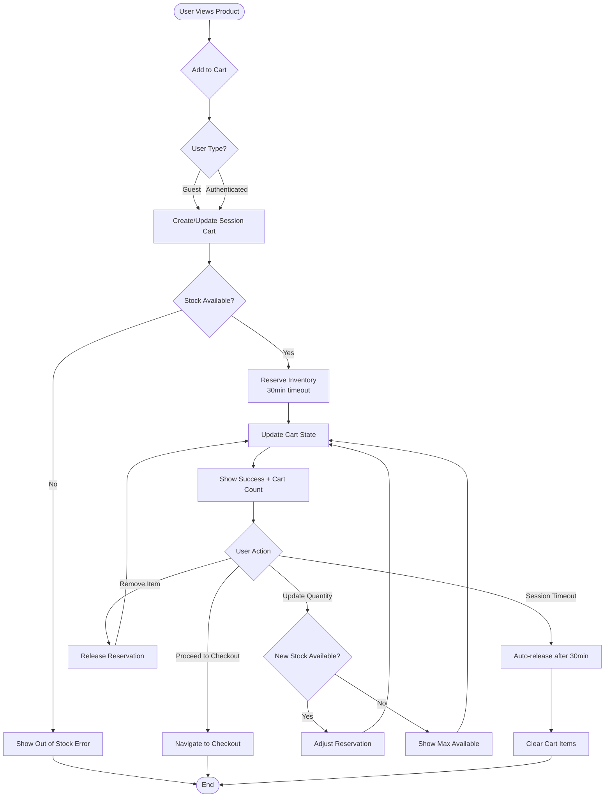

# Feature: Shopping Cart

> **Purpose:**
> This document defines the shopping cart feature's intent, scope, user experience, and completion criteria.
> It is the **single source of truth** for planning, review, automation, and execution.

---

## 0. Metadata

All metadata is defined in the frontmatter above (between the `---` markers).

**Important:** The frontmatter is used by automation scripts to:

- Create GitHub issues
- Link features to parent epics
- Generate feature flags
- Track status and ownership

---

## 1. Overview

The Shopping Cart feature enables users to collect products for purchase in a temporary, session-based container with real-time inventory reservation and quantity management. This feature serves as the critical bridge between product discovery and checkout, managing the transition from browsing to buying while preventing overselling through automatic inventory holds.

**What this feature enables:**
- Session-based cart storage for both authenticated and guest users
- Add, update, and remove products with instant feedback
- Automatic inventory reservation with 30-minute timeout protection
- Real-time cart total calculation including quantities and pricing
- Seamless cart persistence during active browsing sessions

**Why it exists:**
To eliminate the friction and uncertainty between product selection and purchase by providing users with a reliable, transparent container for their intended purchases while protecting business inventory from simultaneous overselling.

**What meaningful change it introduces:**
Users gain confidence that products they add to their cart remain available for purchase during their shopping session, while the business maintains accurate inventory control and prevents checkout failures due to stock conflicts.

## Flow Diagram



**Caption:** "Primary shopping cart user journey with inventory reservation lifecycle."

---

## 2. User Problem

**Who experiences the problem:**
Mobile-first beauty shoppers who browse products across multiple tabs or sessions, conscious consumers who curate their selections carefully, and gift shoppers who need to compare multiple product combinations before deciding.

**When and in what situations it occurs:**
- During product exploration when users want to save promising items without committing to immediate purchase
- When comparing multiple products or building gift sets across different browsing sessions
- At moments when users are interrupted (phone calls, battery low, distractions) during shopping
- When multiple users simultaneously attempt to purchase limited-inventory premium items

**What friction, confusion, or inefficiency exists today:**
Traditional ecommerce platforms fail users in three critical ways:
1. **Inventory uncertainty**: Users add items to cart only to discover at checkout that products are no longer available
2. **Cart loss anxiety**: Browsers clearing session storage or users switching devices lose their selections
3. **Quantity ambiguity**: Users receive vague "low stock" warnings without clear guidance on maximum available quantities

**Why existing behavior or solutions are insufficient:**
Most platforms treat carts as simple lists without inventory coordination, creating a gap between "adding to cart" and actual product availability. This results in checkout failures (85% mobile cart abandonment in beauty ecommerce), customer frustration, and lost revenue. Session-only storage without reservation means high-demand items are claimed by the fastest clicker rather than committed shoppers.

---

## 3. Goals

### User Experience Goals

- **Instant confidence**: Users see immediate visual confirmation when products are successfully added, with clear cart count updates
- **Transparent availability**: Users know exactly how many units they can purchase and receive proactive warnings when approaching limits
- **Interruption resilience**: Users can navigate away, explore other products, or take short breaks without losing their cart during active sessions
- **Frictionless modification**: Users adjust quantities or remove items with single-action controls and instant feedback
- **Clear next steps**: Users always see an obvious path to checkout with current cart totals

### Business / System Goals

- Prevent overselling by coordinating cart additions with real-time inventory
- Reduce checkout failures from 15% to <2% through upfront stock validation
- Minimize abandoned cart value through proactive stock notifications
- Support both guest and authenticated users with consistent cart behavior
- Enable seamless handoff from cart to checkout with guaranteed inventory availability
- Provide analytics on cart behavior patterns (add frequency, abandonment triggers, quantity trends)

---

## 4. Non-Goals

**Explicitly out of scope for this feature:**

- **Persistent carts across devices**: Cart data is session-based and does not sync between different browsers or devices for the same authenticated user
- **Saved carts for later**: Users cannot save named carts or create multiple carts (deferred to wishlist for long-term product saving)
- **Cart sharing or collaboration**: No functionality to share cart contents with others via link or social features
- **Product recommendations in cart**: Cart view focuses purely on selected items without cross-sell or upsell suggestions
- **Promotional code application**: Discount codes and promotions are handled exclusively in the checkout phase
- **Gift wrapping or special instructions**: These options are part of checkout, not cart management
- **Inventory reservation beyond 30 minutes**: Extended holds require checkout initiation
- **Cross-session cart recovery**: If a user closes all tabs/browser, session cart is permanently cleared

---

## 5. Functional Scope

**Core capabilities:**

1. **Cart Creation & Retrieval**
   - Automatically initialize cart on first product addition
   - Store cart in browser session storage with unique session identifier
   - Retrieve existing cart state on page load/refresh during active session
   - Support both guest (anonymous session ID) and authenticated (user ID) carts

2. **Product Management Operations**
   - Add product with specified quantity (default: 1) and validate against available stock
   - Update existing line item quantity with delta validation (increase/decrease)
   - Remove individual line items with immediate reservation release
   - Clear entire cart with bulk reservation release

3. **Inventory Coordination**
   - Check real-time stock availability before adding/updating items
   - Reserve inventory quantities for cart items with 30-minute timeout
   - Automatically release reservations on timeout, removal, or cart clear
   - Prevent additions beyond available stock with clear error messages
   - Track reservation timestamps for timeout calculation

4. **Cart State Calculations**
   - Calculate line item subtotals (price × quantity)
   - Calculate cart total (sum of all line item subtotals)
   - Track total item count (sum of all quantities)
   - Maintain product metadata snapshot (name, price, image) for display consistency

5. **Session Lifecycle Management**
   - Persist cart state throughout browser session (page refreshes, navigation)
   - Detect session end (tab/browser close) and schedule cleanup
   - Trigger reservation release on session expiration
   - Generate unique session identifiers for guest carts

6. **GraphQL API Surface**
   - **Mutations**: `addToCart(productId, quantity)`, `updateCartItem(productId, quantity)`, `removeFromCart(productId)`, `clearCart()`
   - **Queries**: `cart { items { product, quantity, subtotal }, total, itemCount }`
   - **Subscriptions**: Real-time cart updates for multi-tab synchronization (same session)

**Expected behaviors:**

- Cart actions respond within 200ms for instant perceived performance
- Stock validation failures return specific error messages (e.g., "Only 3 units available")
- Quantity updates beyond stock limits auto-adjust to maximum available with notification
- Reservation timeouts trigger silent background cleanup without user disruption
- Cart counts update across all open tabs for the same session (via localStorage events)

**System responsibilities:**

- Maintain referential integrity between cart items and product catalog
- Enforce inventory reservation business rules consistently
- Provide atomic cart operations (all-or-nothing for adds/updates)
- Handle concurrent cart modifications within same session gracefully
- Generate audit events for cart operations (add, update, remove, timeout) for analytics

---

## 6. Dependencies & Assumptions

**Dependencies on other features or capabilities:**

- **F-003: User Authentication** - Required for associating carts with authenticated users and retrieving user context
- **F-004: Product Catalog Management** - Provides product data (SKUs, prices, names, images, stock levels) that cart references
- **F-001: Platform Foundation** - GraphQL Mesh gateway, Firebase Firestore for reservation tracking, session management infrastructure

**Assumptions about user behavior or environment:**

- Users shop within a single browsing session (typical session duration: 8-15 minutes for beauty ecommerce)
- Users may add multiple items before proceeding to checkout (average cart size: 2.3 items)
- Mobile users expect instant feedback with visual confirmation of cart actions
- Users understand that closing all browser tabs ends their shopping session and clears cart
- Users may have multiple tabs open viewing different products simultaneously
- Network connectivity is stable enough for real-time stock checks (fallback: optimistic UI with validation)

**External or organizational constraints:**

- Inventory reservation timeout (30 minutes) aligns with industry standard for conversion window optimization
- Session storage cleared on browser close is acceptable (no regulatory requirement for cart persistence)
- GDPR compliance requires minimal cart data retention (session-only storage satisfies this)
- Firebase Firestore transaction limits (500 writes/second per database) constrain concurrent cart operations
- Mobile network latency (200-500ms average) requires optimistic UI patterns for perceived performance

---

## 7. User Stories & Experience Scenarios

> This section defines **how users live with the feature**.
> Scenarios must focus on **quality of life and lifecycle experience**, not just technical failures.

---

### User Story 1 — Quick Add While Browsing

**As a** mobile beauty shopper exploring the catalog  
**I want** to quickly add products to my cart while continuing to browse  
**So that** I can collect items without interrupting my product discovery flow

---

#### Scenarios

##### Scenario 1.1 — First-Time Cart Initialization

**Given** a user with no existing cart (new session)  
**When** the user taps "Add to Cart" on a product with available stock  
**Then** the system should create a new cart session  
**And** add the product with quantity 1  
**And** reserve 1 unit of inventory with a 30-minute timeout  
**And** display immediate visual feedback (cart icon badge updates from 0 to 1)  
**And** show a dismissible success message: "Added to cart"  
**And** the cart query returns the new item with correct subtotal

---

##### Scenario 1.2 — Adding Additional Items

**Given** a user with an active cart containing 2 items  
**When** the user adds a third product from the catalog  
**Then** the system should update the existing cart session  
**And** add the new product without affecting existing items  
**And** reserve inventory for the new item  
**And** update cart count badge from 2 to 3 items  
**And** recalculate cart total including the new item  
**And** the cart query reflects all 3 items with correct totals

---

##### Scenario 1.3 — Returning to Cart After Browsing

**Given** a user added 3 products to cart 10 minutes ago  
**And** has been browsing other categories since then  
**When** the user navigates to the cart view  
**Then** all 3 items should be present with original quantities  
**And** inventory reservations should still be active (20 minutes remaining)  
**And** product details (names, prices, images) display correctly  
**And** cart total matches sum of line item subtotals  
**And** user can proceed to checkout immediately

---

##### Scenario 1.4 — Out of Stock During Add

**Given** a user is viewing a product with 0 stock available  
**When** the user attempts to add the product to cart  
**Then** the add action should be prevented with clear feedback  
**And** show error message: "This product is currently out of stock"  
**And** offer alternative action: "Add to Wishlist to be notified when available"  
**And** cart count and contents remain unchanged  
**And** user is not left wondering what happened

---

##### Scenario 1.5 — Adding Product with Low Stock

**Given** a user is viewing a product with only 2 units remaining  
**When** the user attempts to add 5 units to cart  
**Then** the system should prevent the full quantity addition  
**And** show message: "Only 2 units available. Added maximum quantity to cart."  
**And** add 2 units to cart (not 5)  
**And** update cart badge accordingly  
**And** reserve the 2 available units  
**And** maintain user trust through transparent communication

---

##### Scenario 1.6 — Slow Network Performance

**Given** a user on a slow mobile connection (3G, 500ms latency)  
**When** the user taps "Add to Cart"  
**Then** the UI should immediately show optimistic feedback (button animates, cart badge updates)  
**And** display a subtle loading indicator while validating stock  
**And** if validation succeeds, confirm the optimistic update  
**And** if validation fails (stock unavailable), revert the optimistic change and show error  
**And** user perceives instant responsiveness regardless of network speed

---

### User Story 2 — Quantity Adjustment and Removal

**As a** conscious consumer curating my cart  
**I want** to easily adjust product quantities or remove items I no longer want  
**So that** I can refine my selection before checkout without frustration

---

#### Scenarios

##### Scenario 2.1 — Increasing Item Quantity

**Given** a user has a product in cart with quantity 1  
**When** the user increases quantity to 3 using the quantity controls  
**Then** the system should check if 3 units are available  
**And** if available, increase quantity from 1 to 3  
**And** adjust inventory reservation from 1 to 3 units  
**And** update line item subtotal (price × 3)  
**And** recalculate cart total  
**And** update cart item count badge (increases by 2)  
**And** provide immediate visual confirmation

---

##### Scenario 2.2 — Decreasing Item Quantity

**Given** a user has a product in cart with quantity 4  
**When** the user decreases quantity to 2  
**Then** the system should update quantity from 4 to 2  
**And** release 2 units back to available inventory  
**And** update line item subtotal accordingly  
**And** recalculate cart total  
**And** update cart item count badge (decreases by 2)  
**And** maintain the item in cart (not removed)

---

##### Scenario 2.3 — Removing Item Completely

**Given** a user has 3 products in their cart  
**When** the user taps "Remove" on the second item  
**Then** the system should delete the line item immediately  
**And** release all reserved inventory for that item  
**And** recalculate cart total excluding removed item  
**And** update cart count badge (e.g., 5 items → 3 items if removed item had quantity 2)  
**And** show confirmation: "Item removed from cart" with undo option (5-second window)  
**And** remaining items stay intact

---

##### Scenario 2.4 — Exceeding Available Stock on Increase

**Given** a user has a product in cart with quantity 2  
**And** only 3 units total are in stock (1 additional available)  
**When** the user attempts to increase quantity to 5  
**Then** the system should prevent the full increase  
**And** auto-adjust quantity to maximum of 3  
**And** show message: "Only 3 units available. Quantity set to maximum."  
**And** reserve the additional 1 unit (total 3 reserved)  
**And** update subtotal and total based on quantity 3  
**And** user understands the constraint clearly

---

##### Scenario 2.5 — Partial Cart Clear

**Given** a user has 4 different products in cart  
**When** the user selects "Clear Cart" from the cart menu  
**Then** the system should show confirmation prompt: "Remove all items from cart?"  
**And** if confirmed, remove all line items  
**And** release all inventory reservations  
**And** update cart badge to 0  
**And** display empty cart message: "Your cart is empty. Start shopping!"  
**And** provide quick link back to catalog

---

##### Scenario 2.6 — Accidental Removal Recovery

**Given** a user accidentally taps "Remove" on an item  
**When** the system shows the 5-second undo notification  
**And** the user taps "Undo" within the window  
**Then** the system should restore the removed item with original quantity  
**And** re-reserve the inventory  
**And** restore cart totals  
**And** dismiss the undo notification  
**And** user avoids the frustration of re-finding and re-adding the product

---

### User Story 3 — Reservation Timeout and Cart Abandonment

**As a** system protecting inventory integrity  
**I want** to automatically release cart reservations when users abandon their shopping  
**So that** inventory remains available for active buyers and prevents stock locking

---

#### Scenarios

##### Scenario 3.1 — Active Shopping Within Timeout Window

**Given** a user added items to cart 15 minutes ago  
**And** the reservation timeout is 30 minutes  
**When** the user is actively browsing and interacting with the site  
**Then** the reservation timer should remain active  
**And** all cart items should stay reserved  
**And** user can proceed to checkout without interruption  
**And** no timeout warnings are displayed yet

---

##### Scenario 3.2 — Approaching Timeout with Warning

**Given** a user has been idle for 25 minutes (5 minutes before timeout)  
**And** cart contains 3 items with active reservations  
**When** the timeout warning threshold is reached  
**Then** the system should show a prominent notification: "Your cart will expire in 5 minutes. Proceed to checkout to secure your items."  
**And** provide a "Checkout Now" button in the notification  
**And** user understands the urgency and next step clearly

---

##### Scenario 3.3 — Reservation Timeout Expiration

**Given** a user added items to cart 30 minutes ago  
**And** has not interacted with the site for the last 20 minutes  
**When** the 30-minute timeout is reached  
**Then** the system should silently release all inventory reservations  
**And** clear the cart session  
**And** update cart badge to 0  
**And** if user returns and navigates to cart, show message: "Your cart has expired due to inactivity. Previously selected items have been returned to inventory."  
**And** provide link to continue shopping

---

##### Scenario 3.4 — Extending Timeout Through Activity

**Given** a user added items to cart 28 minutes ago  
**And** reservation timeout is approaching in 2 minutes  
**When** the user adds a new item to cart or updates quantities  
**Then** the system should reset the timeout timer to 30 minutes  
**And** extend reservations for all items  
**And** dismiss any timeout warnings  
**And** user gains additional time without losing their cart

---

##### Scenario 3.5 — Session Termination on Browser Close

**Given** a user has an active cart with 3 items  
**When** the user closes all browser tabs and the browser window  
**Then** the session storage should be cleared  
**And** inventory reservations should be scheduled for release  
**And** a background job should execute reservation cleanup within 1 minute  
**And** if user returns in a new session, cart is empty  
**And** previously reserved inventory is available to other users

---

##### Scenario 3.6 — Multi-Tab Session Coordination

**Given** a user has two tabs open viewing different products  
**And** both tabs share the same session  
**When** the user adds a product in Tab A  
**Then** Tab B should reflect the updated cart count immediately (via storage event)  
**And** if Tab B navigates to cart view, new item is visible  
**And** timeout timer is shared across both tabs  
**And** closing one tab does not clear cart (session persists in remaining tab)  
**And** closing all tabs terminates session and clears cart

---

### User Story 4 — Guest vs Authenticated Cart Behavior

**As a** guest shopper who may decide to create an account later  
**I want** my cart to work seamlessly whether I'm logged in or not  
**So that** I can shop without friction and optionally authenticate when ready

---

#### Scenarios

##### Scenario 4.1 — Guest Cart Creation

**Given** an unauthenticated user visiting the site for the first time  
**When** the user adds a product to cart  
**Then** the system should generate a unique anonymous session ID  
**And** create a session-based cart associated with that ID  
**And** store cart data in browser session storage  
**And** cart functions identically to authenticated user carts  
**And** user is not forced to log in to shop

---

##### Scenario 4.2 — Authenticated User Cart

**Given** a logged-in user with an empty cart  
**When** the user adds products to cart  
**Then** the system should associate cart with user ID  
**And** store cart in session storage with user context  
**And** cart data is not synced to Firestore (session-only)  
**And** cart behavior is identical to guest cart  
**And** closing session clears cart regardless of authentication

---

##### Scenario 4.3 — Guest Proceeding to Checkout

**Given** a guest user with 2 items in cart  
**When** the user clicks "Proceed to Checkout"  
**Then** the system should navigate to checkout flow  
**And** offer options: "Checkout as Guest" or "Login/Register"  
**And** if guest checkout selected, cart transfers to checkout session  
**And** if login selected, cart persists through authentication flow  
**And** user is not blocked from completing purchase

---

##### Scenario 4.4 — Login During Active Session

**Given** a guest user with 3 items in session cart  
**When** the user logs in via the authentication form  
**Then** the system should maintain the existing session cart  
**And** associate cart with the newly authenticated user ID  
**And** all items and reservations remain intact  
**And** cart continues to function without interruption  
**And** user does not lose their selections by authenticating

---

##### Scenario 4.5 — Logout During Session

**Given** an authenticated user with items in cart  
**When** the user logs out  
**Then** the system should maintain the session cart  
**And** convert cart association from user ID to anonymous session ID  
**And** all items remain in cart  
**And** user can continue shopping as guest  
**And** cart persists until session ends or checkout

---

##### Scenario 4.6 — No Cross-Device Cart Sync

**Given** an authenticated user adds items on Mobile Device A  
**When** the same user logs in on Desktop Device B  
**Then** the desktop session should show an empty cart  
**And** mobile cart remains isolated to Mobile Device A session  
**And** user understands cart is session-based (via onboarding tooltip on first cart use)  
**And** wishlist feature provides cross-device persistence alternative

---

## 8. Edge Cases & Constraints (Experience-Relevant)

**Hard limits users may encounter:**

- **Maximum cart items**: 50 line items per cart (prevents abuse and ensures performance)
- **Maximum quantity per item**: 10 units (aligned with "personal use" purchasing limits for premium beauty)
- **Reservation timeout**: Strict 30 minutes; no manual extension available
- **Session lifetime**: Tied to browser session; cannot exceed 24 hours for security

**Irreversible actions or consequences:**

- **Cart clear**: Clearing cart releases all reservations permanently; items must be re-added (undo only available for individual removals)
- **Session termination**: Closing all tabs permanently deletes cart data; cannot be recovered
- **Timeout expiration**: Once timeout occurs, items are not automatically re-reserved if user returns; must re-add

**Compliance, safety, or policy constraints that shape behavior:**

- **GDPR compliance**: No cart data stored server-side for guest users; session-only storage ensures minimal data retention
- **Inventory accuracy SLA**: Reservations must reflect real-time stock within 1-second latency; overselling triggers compliance alerts
- **Fair access policy**: Reservation timeout ensures high-demand items are not indefinitely locked by inactive users
- **Accessibility requirement**: All cart interactions must be keyboard-navigable and screen-reader friendly (WCAG 2.1 AA)

---

## 9. Implementation Tasks (Execution Agent Checklist)

> This section provides the specific work items for the **Execution Agent**.
> Every task must map back to a specific scenario defined in Section 7.

```markdown
- [ ] T01 — Implement Cart aggregate with LineItem entities and value objects (ProductId, Quantity, Price) [Scenarios 1.1, 1.2]
  - [ ] Unit Test: Cart.addItem() creates LineItem with correct quantity and subtotal
  - [ ] Unit Test: Cart.addItem() prevents duplicate ProductIds by updating quantity instead
  - [ ] Unit Test: Cart.calculateTotal() sums all LineItem subtotals correctly

- [ ] T02 — Build session storage persistence layer with get/set/clear operations [Scenarios 1.1, 1.3, 3.5]
  - [ ] Unit Test: SessionCartRepository.save() serializes Cart to sessionStorage
  - [ ] Unit Test: SessionCartRepository.load() deserializes Cart from sessionStorage
  - [ ] Unit Test: SessionCartRepository.clear() removes cart data from sessionStorage
  - [ ] Integration Test: Cart persists across page refreshes within same session

- [ ] T03 — Implement inventory reservation service with timeout tracking [Scenarios 1.1, 1.5, 3.3]
  - [ ] Unit Test: InventoryService.reserve() creates reservation with 30-minute expiry
  - [ ] Unit Test: InventoryService.reserve() rejects reservations exceeding available stock
  - [ ] Unit Test: InventoryService.releaseExpired() releases reservations older than 30 minutes
  - [ ] Integration Test: Reservation timeout triggers automatic release and cart cleanup

- [ ] T04 — Create addToCart GraphQL mutation with stock validation [Scenarios 1.1, 1.2, 1.4, 1.5]
  - [ ] Unit Test: addToCart mutation validates product existence in catalog
  - [ ] Unit Test: addToCart mutation rejects invalid quantities (0, negative, >10)
  - [ ] Unit Test: addToCart mutation returns clear error for out-of-stock products
  - [ ] E2E Test: User adds product to cart and sees updated cart badge and success message

- [ ] T05 — Create updateCartItem GraphQL mutation with quantity constraints [Scenarios 2.1, 2.2, 2.4]
  - [ ] Unit Test: updateCartItem mutation increases quantity and adjusts reservation
  - [ ] Unit Test: updateCartItem mutation decreases quantity and releases excess reservation
  - [ ] Unit Test: updateCartItem mutation auto-adjusts to max available when exceeding stock
  - [ ] E2E Test: User increases quantity and sees updated subtotal and cart total

- [ ] T06 — Create removeFromCart GraphQL mutation with reservation release [Scenarios 2.3, 2.6]
  - [ ] Unit Test: removeFromCart mutation deletes LineItem and releases reservation
  - [ ] Unit Test: removeFromCart mutation recalculates cart total correctly
  - [ ] E2E Test: User removes item and sees confirmation with undo option

- [ ] T07 — Create clearCart GraphQL mutation with bulk reservation release [Scenario 2.5]
  - [ ] Unit Test: clearCart mutation removes all LineItems
  - [ ] Unit Test: clearCart mutation releases all reservations in single transaction
  - [ ] E2E Test: User clears cart and sees empty state with catalog link

- [ ] T08 — Implement cart query resolver with calculated fields [Scenarios 1.3, 1.6]
  - [ ] Unit Test: cart query returns all LineItems with product details
  - [ ] Unit Test: cart query calculates itemCount as sum of quantities
  - [ ] Unit Test: cart query includes reservation timeout metadata
  - [ ] E2E Test: User views cart and sees correct items, quantities, and totals

- [ ] T09 — Build optimistic UI for cart mutations with rollback on failure [Scenario 1.6]
  - [ ] Unit Test: Cart component applies optimistic update before mutation completes
  - [ ] Unit Test: Cart component reverts optimistic update on mutation error
  - [ ] E2E Test: User on slow network sees instant UI feedback followed by validation

- [ ] T10 — Implement timeout warning notification at 5-minute threshold [Scenario 3.2]
  - [ ] Unit Test: TimeoutWarning component displays at 25-minute mark
  - [ ] Unit Test: TimeoutWarning includes time remaining and checkout CTA
  - [ ] E2E Test: Idle user sees timeout warning and can extend by adding item

- [ ] T11 — Create background job for reservation cleanup on session end [Scenario 3.5]
  - [ ] Unit Test: SessionCleanupJob releases reservations for terminated sessions
  - [ ] Unit Test: SessionCleanupJob executes within 1 minute of session end
  - [ ] Integration Test: Closing all tabs triggers session cleanup within 60 seconds

- [ ] T12 — Implement multi-tab cart synchronization via storage events [Scenario 3.6]
  - [ ] Unit Test: Cart component listens for storage events from other tabs
  - [ ] Unit Test: Cart updates local state when storage event detected
  - [ ] E2E Test: User with 2 tabs sees cart update in Tab B when adding item in Tab A

- [ ] T13 — Build guest cart support with anonymous session ID generation [Scenarios 4.1, 4.3]
  - [ ] Unit Test: SessionService.generateAnonymousId() creates unique ID
  - [ ] Unit Test: Cart associates with anonymous ID for unauthenticated users
  - [ ] E2E Test: Guest user adds items and proceeds to checkout without login

- [ ] T14 — Implement cart association transfer on login/logout [Scenarios 4.4, 4.5]
  - [ ] Unit Test: AuthService.onLogin() transfers cart from anonymous to user ID
  - [ ] Unit Test: AuthService.onLogout() transfers cart from user ID to new anonymous ID
  - [ ] E2E Test: User logs in mid-session and retains all cart items

- [ ] T15 — Create cart badge component with real-time item count [Scenarios 1.1, 1.2, 2.1-2.3]
  - [ ] Unit Test: CartBadge renders correct item count from cart state
  - [ ] Unit Test: CartBadge updates when cart mutations complete
  - [ ] E2E Test: Cart badge reflects accurate count across all cart operations

- [ ] T16 — Implement undo functionality for item removal [Scenario 2.6]
  - [ ] Unit Test: UndoService stores removed item state for 5 seconds
  - [ ] Unit Test: UndoService.restore() re-adds item and reservation
  - [ ] E2E Test: User removes item, clicks undo, and sees item restored

- [ ] T17 — Build empty cart state UI with catalog navigation [Scenarios 2.5, 3.3]
  - [ ] Unit Test: EmptyCartView renders when cart has no items
  - [ ] Unit Test: EmptyCartView includes clear CTA to continue shopping
  - [ ] E2E Test: User with empty cart sees helpful message and catalog link

- [ ] T18 — [Rollout] Create feature flag for cart functionality with gradual rollout [All scenarios]
  - [ ] Integration Test: Flag disabled state shows "Coming Soon" message instead of cart
  - [ ] Integration Test: Flag enabled state renders full cart functionality
  - [ ] Integration Test: Percentage-based rollout targets correct user segments
```

---

## 10. Acceptance Criteria (Verifiable Outcomes)

> These criteria are used by the **Execution Agent** and **Reviewers** to verify completion.
> Each criterion must be observable and testable.

```markdown
- [ ] AC1 — Users can add products to cart with instant visual feedback and stock validation [Scenarios 1.1, 1.2, 1.4]
  - [ ] E2E test passed: Guest user adds product and sees cart badge increment
  - [ ] E2E test passed: User adding out-of-stock product sees clear error message
  - [ ] E2E test passed: User adding beyond available stock sees auto-adjusted quantity

- [ ] AC2 — Cart persists throughout browser session across page navigation and refreshes [Scenarios 1.3, 3.1]
  - [ ] Integration test passed: Cart data survives page refresh
  - [ ] Integration test passed: Cart items remain intact after navigating to product pages
  - [ ] E2E test passed: User returns to cart after browsing and sees all items

- [ ] AC3 — Inventory reservations enforce 30-minute timeout with automatic release [Scenarios 3.1, 3.3]
  - [ ] Unit test passed: Reservation service creates 30-minute expiry timestamp
  - [ ] Integration test passed: Expired reservations are released by background job
  - [ ] E2E test passed: Cart expires after 30 minutes of inactivity

- [ ] AC4 — Users can update quantities with stock constraint enforcement [Scenarios 2.1, 2.2, 2.4]
  - [ ] Unit test passed: Quantity increase validates against available stock
  - [ ] Unit test passed: Quantity decrease releases excess reservation
  - [ ] E2E test passed: User increasing quantity beyond stock sees max available message

- [ ] AC5 — Users can remove individual items or clear entire cart [Scenarios 2.3, 2.5]
  - [ ] Unit test passed: removeFromCart releases inventory reservation
  - [ ] Unit test passed: clearCart removes all items and reservations
  - [ ] E2E test passed: User removes item and sees updated cart total

- [ ] AC6 — Cart displays accurate totals and item counts [Scenarios 1.2, 1.3, 2.1]
  - [ ] Unit test passed: Cart.calculateTotal() sums line item subtotals correctly
  - [ ] Unit test passed: Cart.itemCount() sums all quantities
  - [ ] E2E test passed: Cart view shows correct subtotals, total, and item count

- [ ] AC7 — Multi-tab cart synchronization works within same session [Scenario 3.6]
  - [ ] Integration test passed: Storage event propagates cart updates across tabs
  - [ ] E2E test passed: User with 2 tabs sees cart update in both tabs

- [ ] AC8 — Guest and authenticated users have identical cart functionality [Scenarios 4.1, 4.2]
  - [ ] Unit test passed: Guest cart uses anonymous session ID
  - [ ] Unit test passed: Authenticated cart uses user ID
  - [ ] E2E test passed: Guest user adds items without login requirement

- [ ] AC9 — Cart association transfers correctly on login/logout [Scenarios 4.4, 4.5]
  - [ ] Integration test passed: Login transfers cart from anonymous to user ID
  - [ ] Integration test passed: Logout transfers cart to new anonymous ID
  - [ ] E2E test passed: User logs in mid-session and retains cart items

- [ ] AC10 — Optimistic UI provides instant feedback with validation rollback [Scenarios 1.6, 1.4]
  - [ ] Unit test passed: Optimistic update applied before mutation completion
  - [ ] Unit test passed: Rollback executed on mutation error
  - [ ] E2E test passed: User on slow network sees instant UI response

- [ ] AC11 — Timeout warnings display 5 minutes before expiration [Scenario 3.2]
  - [ ] Unit test passed: Warning triggers at 25-minute mark
  - [ ] E2E test passed: User sees timeout warning with checkout CTA

- [ ] AC12 — Undo functionality allows recovery from accidental item removal [Scenario 2.6]
  - [ ] Unit test passed: Undo restores item within 5-second window
  - [ ] E2E test passed: User removes item, clicks undo, and item reappears

- [ ] AC13 — [Gating] Feature flag correctly controls cart visibility and functionality
  - [ ] Integration test passed: Flag disabled shows "Coming Soon" placeholder
  - [ ] Integration test passed: Flag enabled renders full cart interface
  - [ ] Integration test passed: Gradual rollout targets correct user percentage
```

---

## 11. Rollout & Risk

### Rollout Strategy

**Phase 1: Internal Testing (Week 1)**
- Enable flag at 100% for development environment
- Team testing with synthetic product catalog
- Validate reservation logic with concurrent user simulation

**Phase 2: Gradual Production Rollout**
- **Week 2**: 10% of production users (monitor error rates, reservation accuracy)
- **Week 3**: 25% of production users (validate multi-tab sync, timeout handling)
- **Week 4**: 50% of production users (stress test inventory coordination)
- **Week 5**: 100% rollout if error rate <0.5% and cart abandonment <50%

**Rollback Triggers:**
- Error rate exceeds 0.5% for cart mutations
- Inventory overselling detected (reservation failures)
- Session storage failures exceed 1% of operations
- Cart load time exceeds 500ms p95

### Risk Mitigation

**Risk 1: Inventory Overselling**
- **Mitigation**: Use Firestore transactions for reservation creates/releases
- **Monitoring**: Alert on reservation count > available stock
- **Fallback**: Disable cart adds and show "maintenance" message if integrity breach detected

**Risk 2: Session Storage Quota Exceeded**
- **Mitigation**: Enforce 50-item cart limit; each item ~500 bytes = 25KB max
- **Monitoring**: Track sessionStorage.setItem failures
- **Fallback**: Graceful degradation to server-side cart storage (deferred feature)

**Risk 3: Timeout Job Failures**
- **Mitigation**: Idempotent cleanup job with retry logic
- **Monitoring**: Track unreleased reservations older than 35 minutes
- **Fallback**: Manual cleanup script triggered by monitoring alert

**Risk 4: Multi-Tab Race Conditions**
- **Mitigation**: Last-write-wins with optimistic locking on cart version
- **Monitoring**: Track concurrent modification conflicts
- **Fallback**: Display sync conflict message and offer "refresh cart" option

### Exit Criteria

**Remove feature flag when:**
- 100% rollout stable for 7 consecutive days
- Error rate <0.2% average
- Cart abandonment rate <50% (target achieved)
- No P0/P1 incidents related to cart functionality
- Reservation accuracy >99.5%

**Cleanup tasks:**
- Remove `feature_fe_006_fl_001_cart_enabled` flag from Remote Config
- Remove flag conditionals from cart components
- Archive rollout monitoring dashboard
- Document lessons learned for Phase 4 features (Checkout)

### Remote Config Flags

<!-- REMOTE_CONFIG_FLAG_START -->
| Context | Type | Namespace | Default (Dev) | Default (Stg) | Default (Prod) | Key |
|---------|------|-----------|---------------|---------------|----------------|-----|
| cart_add | BOOLEAN | client | true | false | false | feature_fe_006_fl_001_cart_enabled |
| cart_inventory_reserve | BOOLEAN | server | true | false | false | feature_fe_006_fl_002_reservation_enabled |
| cart_timeout_warning | BOOLEAN | client | true | true | false | feature_fe_006_fl_003_timeout_warning_enabled |
<!-- REMOTE_CONFIG_FLAG_END -->

---

## 12. History & Status

- **Status:** Draft
- **Related Epics:** Shopping Experience (Phase 3)
- **Related Issues:** _created post-merge_
- **Dependencies:** F-003 (User Authentication), F-004 (Product Catalog Management)
- **Dependents:** F-008 (Checkout & Address Management)

---

## Final Note

> This document defines **intent and experience**.
> Execution details are derived from it — never the other way around.
