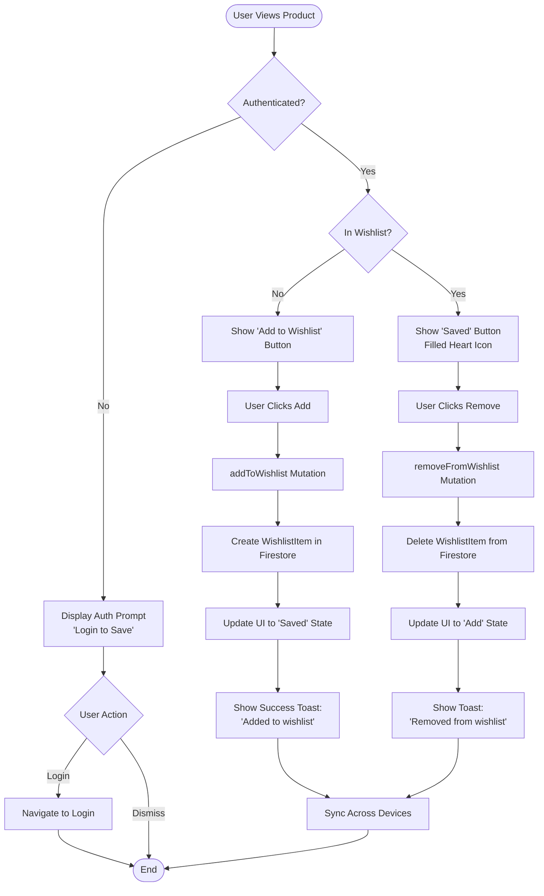

# Feature: Wishlist Management

> **Purpose:**
> This document defines the wishlist feature's intent, scope, user experience, and completion criteria.
> It is the **single source of truth** for planning, review, automation, and execution.

---

## 0. Metadata

All metadata is defined in the frontmatter above (between the `---` markers).

**Important:** The frontmatter is used by automation scripts to:

- Create GitHub issues
- Link features to parent epics
- Generate feature flags
- Track status and ownership

---

## 1. Overview

The Wishlist Management feature enables authenticated users to save products to a persistent, cross-device collection for future consideration and purchase. Unlike the session-based shopping cart, the wishlist serves as a long-term storage mechanism for product discovery, aspiration tracking, and gift planning, with seamless synchronization across all user devices.

**What this feature enables:**
- Persistent product collection tied to user accounts across devices
- One-click save/remove operations from product pages and catalog views
- Visual wishlist indicator on product cards showing saved status
- Firestore-backed storage ensuring data durability and cross-device sync
- Authentication gating with clear prompts for guest users

**Why it exists:**
To bridge the gap between product discovery and purchase decision-making by providing users a reliable, permanent space to curate products they're interested in but not ready to buy, reducing pressure to make immediate purchase decisions and supporting exploratory shopping behaviors.

**What meaningful change it introduces:**
Users gain freedom to explore products without purchase commitment, build aspirational collections over time, revisit saved items across devices when ready, and receive notifications when wishlist items go on sale or back in stock (future integration).

## Flow Diagram



**Caption:** "Wishlist interaction flow with authentication gating and cross-device synchronization."

---

## 2. User Problem

**Who experiences the problem:**
Beauty enthusiasts who research products extensively before purchasing, conscious consumers who curate ethical product collections, gift shoppers who plan purchases across multiple occasions, and budget-conscious users who wait for sales on desired items.

**When and in what situations it occurs:**
- During exploratory browsing when users discover interesting products but aren't ready to commit to purchase
- When researching gift options across different categories and price points over weeks or months
- When building aspirational collections of premium products to purchase over time
- When product is out of stock or above current budget but user wants to track for future availability
- When switching between mobile and desktop devices and losing track of previously viewed products

**What friction, confusion, or inefficiency exists today:**
Users resort to fragile workarounds that fail their needs:
1. **Browser bookmark chaos**: Saving product page URLs in browser bookmarks creates unorganized, unsearchable lists that don't reflect current product availability or pricing
2. **Screenshot collections**: Users screenshot products to photo galleries, losing direct links and product metadata
3. **Cart misuse**: Adding items to cart as a "save for later" mechanism conflicts with cart's purchase intent and ties up inventory unnecessarily
4. **Memory burden**: Attempting to remember product names or manually search for previously viewed items wastes time and leads to lost sales
5. **Cross-device failure**: Bookmarks and cart don't sync across devices, fragmenting the discovery-to-purchase journey

**Why existing behavior or solutions are insufficient:**
These workarounds fail because they lack **persistence** (bookmarks break when URLs change), **context** (screenshots lose pricing and availability), **intent separation** (cart conflates saving with buying), **cross-device sync** (browser-local solutions don't follow users), and **actionability** (no direct path from saved item to purchase).

---

## 3. Goals

### User Experience Goals

- **Effortless saving**: Users save products with a single tap/click without interrupting browsing flow
- **Visual confidence**: Users instantly know which products are already saved through persistent visual indicators
- **Cross-device continuity**: Users access their wishlist seamlessly whether on mobile, tablet, or desktop
- **Easy retrieval**: Users view, search, and filter their saved products in a dedicated wishlist view
- **Smooth purchase transition**: Users move products from wishlist to cart with one action when ready to buy
- **Transparent authentication**: Guest users understand why login is required and can authenticate without losing context

### Business / System Goals

- Increase user engagement and session duration through aspirational product curation
- Capture long-term purchase intent data for inventory planning and marketing
- Reduce cart abandonment by separating discovery (wishlist) from purchase intent (cart)
- Enable future personalization and notification features (sale alerts, back-in-stock)
- Support authenticated user growth by gating wishlist behind login
- Provide analytics on product interest patterns independent of purchase behavior

---

## 4. Non-Goals

**Explicitly out of scope for this feature:**

- **Multiple wishlists**: Users cannot create named wishlists or categorize items into different lists (single unified wishlist per user)
- **Wishlist sharing**: No functionality to share wishlist via link, social media, or email (deferred to future social features)
- **Wishlist collaboration**: Users cannot invite others to view or contribute to their wishlist
- **Price drop notifications**: No automated alerts when wishlist items go on sale (deferred to F-012 Notifications enhancements)
- **Stock notifications**: No alerts when out-of-stock wishlist items become available (deferred)
- **Wishlist privacy settings**: Wishlist is private by default with no visibility controls (no public/private toggle)
- **Wishlist item notes**: Users cannot add personal notes or tags to wishlist items
- **Move to cart in bulk**: No batch operation to add all wishlist items to cart simultaneously
- **Wishlist purchase history**: No tracking of which wishlist items were eventually purchased
- **Guest wishlist with email**: No option for guest users to save wishlist via email without account creation

---

## 5. Functional Scope

**Core capabilities:**

1. **Wishlist Creation & Retrieval**
   - Automatically initialize wishlist on user's first product save
   - Store wishlist in Firestore `wishlists` collection indexed by user ID
   - Retrieve wishlist on authenticated user login across any device
   - Support lazy loading for wishlists with many items (pagination)

2. **Product Save Operations**
   - Add product to wishlist with user ID and product ID association
   - Prevent duplicate additions (idempotent operation)
   - Store minimal product metadata (ID only; fetch current data on retrieval)
   - Record save timestamp for chronological sorting

3. **Product Removal Operations**
   - Remove individual product from wishlist by product ID
   - Provide immediate UI feedback with undo option (5-second window)
   - Support removal from both product pages and wishlist view

4. **Authentication Gating**
   - Detect user authentication state before wishlist operations
   - Display authentication prompt for unauthenticated users attempting to save
   - Preserve user's intended action (product to save) through authentication flow
   - Complete save operation automatically after successful login/registration

5. **Wishlist View & Management**
   - Dedicated wishlist page showing all saved products in grid layout
   - Display current product details (name, price, image, stock status) from catalog
   - Sort options: Date added (newest/oldest), Product name (A-Z), Price (high/low)
   - Quick actions: Remove from wishlist, Add to cart
   - Empty state guidance when wishlist has no items

6. **Cross-Device Synchronization**
   - Real-time sync via Firestore listeners across all authenticated sessions
   - Optimistic UI updates with conflict resolution (last-write-wins)
   - Offline support: Queue operations when offline, sync on reconnection

7. **Visual Indicators**
   - Wishlist count badge in navigation header
   - Product card overlay showing "saved" status (filled heart icon)
   - Hover/tap state transitions for wishlist buttons

8. **GraphQL API Surface**
   - **Mutations**: `addToWishlist(productId)`, `removeFromWishlist(productId)`
   - **Queries**: `wishlist { items { product, addedAt }, itemCount }`
   - **Subscriptions**: Real-time wishlist updates for same user across devices

**Expected behaviors:**

- Wishlist operations respond within 300ms for perceived instant feedback
- Authentication prompt appears as modal overlay without navigating away from current page
- Saved state indicators update immediately across all open tabs for same user
- Wishlist view refreshes product data (price, stock) on each load to show current state
- Removing a product from wishlist while viewing that product updates icon state instantly
- Wishlist item count badge updates in real-time as items are added/removed

**System responsibilities:**

- Maintain referential integrity between wishlist items and product catalog
- Handle race conditions when user adds/removes same product rapidly or across devices
- Enforce authentication requirement consistently across all wishlist operations
- Provide atomic operations (add/remove complete fully or not at all)
- Clean up orphaned wishlist items if products are deleted from catalog (soft reference)
- Generate analytics events for wishlist operations (add, remove, view, move to cart)

---

## 6. Dependencies & Assumptions

**Dependencies on other features or capabilities:**

- **F-003: User Authentication** - Critical dependency; wishlist requires authenticated user context for data association and cross-device sync
- **F-004: Product Catalog Management** - Provides product data (IDs, names, prices, images, stock) that wishlist references
- **F-001: Platform Foundation** - GraphQL Mesh, Firebase Firestore for persistent storage, Firebase Authentication for user identity
- **F-006: Shopping Cart** (soft) - Optional integration for "Add to Cart from Wishlist" convenience action

**Assumptions about user behavior or environment:**

- Users understand that wishlist requires account creation (authentication prompt explains this clearly)
- Users accept that wishlist is private and cannot be shared (standard ecommerce pattern)
- Users expect wishlist to persist indefinitely unless explicitly cleared (no automatic expiration)
- Users may have 10-50 items in wishlist on average; power users may exceed 100 items
- Users access wishlist primarily to review saved items before shopping sessions, not daily
- Mobile users expect wishlist button to be accessible via prominent header/navigation
- Users understand that wishlist shows current product state (price may change since saving)

**External or organizational constraints:**

- Firestore pricing model charges per document read; excessive wishlist polling could increase costs (mitigate via caching)
- GDPR compliance requires wishlist data deletion on user account deletion
- Wishlist data contributes to user profile payload; must remain under 1MB per user for performance
- Firebase Authentication rate limits (10 requests/second per user) constrain rapid authentication attempts
- Cross-device sync latency depends on Firestore replication (typically <1 second but can spike to 5 seconds under load)

---

## 7. User Stories & Experience Scenarios

> This section defines **how users live with the feature**.
> Scenarios must focus on **quality of life and lifecycle experience**, not just technical failures.

---

### User Story 1 — Discovering and Saving Products

**As a** beauty enthusiast exploring the catalog  
**I want** to save interesting products without buying them immediately  
**So that** I can curate a collection of items I'm interested in and revisit them when ready to purchase

---

#### Scenarios

##### Scenario 1.1 — First-Time Save as Authenticated User

**Given** an authenticated user viewing a product they want to save  
**And** the product is not currently in their wishlist  
**When** the user taps the "Add to Wishlist" heart icon button  
**Then** the system should create a wishlist item in Firestore with user ID, product ID, and timestamp  
**And** update the button to "Saved" state with filled heart icon  
**And** increment wishlist badge count in navigation header  
**And** show success toast: "Added to wishlist"  
**And** the wishlist query reflects the new item immediately

---

##### Scenario 1.2 — Save Attempt as Guest User

**Given** an unauthenticated guest user viewing a product  
**And** the product has an "Add to Wishlist" button  
**When** the guest user taps the button  
**Then** the system should display an authentication modal prompt  
**And** show message: "Create an account to save your favorite products"  
**And** provide options: "Login" and "Sign Up" buttons  
**And** preserve the product ID to auto-save after authentication  
**And** the product is not added to any wishlist yet (operation pending)

---

##### Scenario 1.3 — Completing Save After Authentication

**Given** a guest user triggered wishlist save and is now viewing the auth modal  
**When** the user successfully logs in or creates an account  
**Then** the system should automatically execute the pending save operation  
**And** add the product to the user's wishlist  
**And** update the product page to show "Saved" state  
**And** show success toast: "Welcome back! Product added to wishlist."  
**And** close the authentication modal  
**And** user returns to the product page without losing context

---

##### Scenario 1.4 — Duplicate Save Prevention

**Given** an authenticated user viewing a product already in their wishlist  
**And** the button shows "Saved" state with filled heart  
**When** the user taps the "Saved" button  
**Then** the system should interpret this as a removal intent (toggle behavior)  
**And** the wishlist add mutation should not execute  
**And** instead, trigger the remove flow (see Scenario 2.1)  
**And** prevent duplicate entries in Firestore

---

##### Scenario 1.5 — Saving Out-of-Stock Product

**Given** an authenticated user viewing a product that is out of stock  
**When** the user adds the product to wishlist  
**Then** the system should successfully save the product  
**And** show success toast: "Added to wishlist. We'll notify you when it's back in stock!" (future notification integration)  
**And** wishlist allows saving regardless of stock status  
**And** user can track desired items for future availability

---

##### Scenario 1.6 — Cross-Device Sync on Save

**Given** an authenticated user logged in on Mobile Device A and Desktop Device B  
**And** both devices have the same product page open  
**When** the user saves the product on Mobile Device A  
**Then** Desktop Device B should receive a real-time update via Firestore listener  
**And** the product page on Desktop Device B updates to "Saved" state  
**And** the wishlist badge count increments on both devices  
**And** sync occurs within 2 seconds under normal network conditions

---

### User Story 2 — Managing Saved Products

**As a** user with a curated wishlist  
**I want** to remove items I'm no longer interested in or have already purchased  
**So that** my wishlist stays relevant and doesn't become cluttered

---

#### Scenarios

##### Scenario 2.1 — Removing Product from Product Page

**Given** an authenticated user viewing a product currently in their wishlist  
**And** the button shows "Saved" state  
**When** the user taps the "Saved" button (toggle to remove)  
**Then** the system should delete the wishlist item from Firestore  
**And** update button to "Add to Wishlist" state with outline heart icon  
**And** decrement wishlist badge count  
**And** show toast with undo option: "Removed from wishlist [Undo]"  
**And** undo option remains available for 5 seconds

---

##### Scenario 2.2 — Removing Product from Wishlist View

**Given** an authenticated user viewing their wishlist page with 5 saved products  
**When** the user taps the "Remove" icon on the third product card  
**Then** the system should delete the wishlist item  
**And** remove the product card from the grid with fade-out animation  
**And** update wishlist count from 5 to 4  
**And** show toast: "Removed from wishlist [Undo]"  
**And** remaining products reflow to fill the grid

---

##### Scenario 2.3 — Undo Accidental Removal

**Given** a user just removed a product from wishlist  
**And** the undo toast notification is still visible (within 5 seconds)  
**When** the user taps "Undo"  
**Then** the system should re-add the product to wishlist  
**And** restore the wishlist item in Firestore with original timestamp  
**And** update UI back to "Saved" state  
**And** increment wishlist badge count  
**And** dismiss the toast notification  
**And** if in wishlist view, restore the product card to its original position

---

##### Scenario 2.4 — Viewing Full Wishlist

**Given** an authenticated user with 12 products in their wishlist  
**When** the user navigates to the wishlist page  
**Then** the system should fetch current product data (names, prices, images, stock) from catalog  
**And** display products in grid layout (2 columns on mobile, 4 on desktop)  
**And** show product images, names, current prices, and stock status  
**And** provide quick action buttons: "Remove" and "Add to Cart" on each card  
**And** display sort dropdown with options: "Date Added", "Price", "Name"  
**And** default sort is "Date Added (Newest First)"

---

##### Scenario 2.5 — Empty Wishlist State

**Given** an authenticated user with no items in their wishlist  
**When** the user navigates to the wishlist page  
**Then** the system should display an empty state illustration  
**And** show message: "Your wishlist is empty. Start saving products you love!"  
**And** provide a clear CTA button: "Explore Products"  
**And** clicking CTA navigates to product catalog  
**And** user understands how to populate their wishlist

---

##### Scenario 2.6 — Wishlist Sorting

**Given** an authenticated user viewing their wishlist with 10 products  
**When** the user selects "Price (High to Low)" from the sort dropdown  
**Then** the system should re-order products by current price descending  
**And** update the grid layout with smooth animation  
**And** persist the sort preference for the session (localStorage)  
**And** next wishlist visit uses the same sort order

---

### User Story 3 — Moving from Wishlist to Purchase

**As a** user ready to buy a saved product  
**I want** to quickly add wishlist items to my cart  
**So that** I can transition from browsing to purchasing without searching for products again

---

#### Scenarios

##### Scenario 3.1 — Adding Wishlist Item to Cart

**Given** an authenticated user viewing their wishlist  
**And** a product in the wishlist is in stock  
**When** the user taps "Add to Cart" on the product card  
**Then** the system should execute the `addToCart` mutation (F-006)  
**And** reserve inventory for the product  
**And** show success toast: "Added to cart"  
**And** increment cart badge count  
**And** the product remains in the wishlist (not auto-removed)  
**And** user can proceed to checkout or continue browsing

---

##### Scenario 3.2 — Adding Out-of-Stock Wishlist Item to Cart

**Given** an authenticated user viewing their wishlist  
**And** a product in the wishlist is out of stock  
**When** the user taps "Add to Cart" on that product card  
**Then** the system should prevent the action  
**And** show error toast: "This item is currently out of stock"  
**And** the product card displays "Out of Stock" badge  
**And** user understands why the action failed

---

##### Scenario 3.3 — Removing After Adding to Cart

**Given** a user added a wishlist item to their cart  
**And** the item is now in both wishlist and cart  
**When** the user decides to remove it from wishlist  
**Then** the system should remove from wishlist only  
**And** the item remains in cart (independent state)  
**And** user can manage wishlist and cart separately

---

##### Scenario 3.4 — Viewing Product Details from Wishlist

**Given** a user viewing their wishlist  
**When** the user taps on a product card (not the quick action buttons)  
**Then** the system should navigate to the full product detail page  
**And** the product page shows "Saved" state for the wishlist button  
**And** user can view full product information, reviews, ingredient list  
**And** user can add to cart from product page if desired

---

##### Scenario 3.5 — Price Change Notification

**Given** a user saved a product to wishlist 2 weeks ago at $45  
**And** the product price has changed to $35  
**When** the user views their wishlist  
**Then** the system should display the current price ($35)  
**And** optionally show a "Price dropped!" badge (visual indicator only, no notification)  
**And** user sees accurate current pricing without needing to visit product page

---

##### Scenario 3.6 — Product Deletion from Catalog

**Given** a user has a product in their wishlist  
**And** an admin deletes that product from the catalog (product discontinued)  
**When** the user views their wishlist  
**Then** the system should detect the missing product reference  
**And** display placeholder card with message: "This product is no longer available"  
**And** provide "Remove from Wishlist" button  
**And** user understands the product is gone and can clean up their wishlist

---

### User Story 4 — Multi-Device Wishlist Access

**As a** user who shops on multiple devices  
**I want** my wishlist to sync seamlessly across my phone, tablet, and desktop  
**So that** I can access my saved products anywhere without re-creating my collection

---

#### Scenarios

##### Scenario 4.1 — Initial Wishlist Load on New Device

**Given** an authenticated user with 8 items in their wishlist on Mobile Device A  
**When** the user logs in on Desktop Device B for the first time  
**And** navigates to the wishlist page  
**Then** the system should fetch the user's wishlist from Firestore  
**And** display all 8 items with current product data  
**And** wishlist badge shows count of 8  
**And** user sees identical wishlist across both devices

---

##### Scenario 4.2 — Real-Time Sync When Adding on Another Device

**Given** a user is viewing their wishlist on Desktop Device B  
**And** the wishlist currently has 8 items  
**When** the user adds a new product on Mobile Device A  
**Then** Desktop Device B should receive the update via Firestore listener  
**And** the new product appears in the wishlist grid within 2 seconds  
**And** wishlist badge updates from 8 to 9  
**And** user doesn't need to refresh the page

---

##### Scenario 4.3 — Real-Time Sync When Removing on Another Device

**Given** a user is viewing a product page on Mobile Device A  
**And** the product is currently saved (button shows "Saved" state)  
**And** the user also has the same product page open on Desktop Device B  
**When** the user removes the product from wishlist on Desktop Device B  
**Then** Mobile Device A should receive the update  
**And** the button on Mobile Device A changes to "Add to Wishlist" state  
**And** sync occurs within 2 seconds

---

##### Scenario 4.4 — Offline Save with Sync on Reconnection

**Given** a user is browsing on mobile with intermittent connectivity  
**And** the user loses network connection  
**When** the user attempts to add a product to wishlist  
**Then** the system should queue the operation locally  
**And** show optimistic UI update (button shows "Saved" state)  
**And** display subtle indicator: "Syncing..."  
**And** when connectivity is restored, execute the queued mutation  
**And** update indicator to "Synced" confirmation  
**And** Firestore reflects the change

---

##### Scenario 4.5 — Conflict Resolution on Simultaneous Edits

**Given** a user has the same product page open on two devices  
**When** the user adds the product to wishlist on Device A  
**And** simultaneously removes it on Device B (race condition)  
**Then** the system should apply last-write-wins conflict resolution  
**And** the final state (add or remove) depends on which operation completed last  
**And** both devices converge to the same state within 3 seconds  
**And** user sees consistent state across devices after sync

---

##### Scenario 4.6 — Session Independence

**Given** a user is logged in on three devices simultaneously  
**When** the user logs out on Device C  
**Then** wishlist data remains accessible on Devices A and B  
**And** Device C loses access to wishlist (authentication required)  
**And** logging back in on Device C restores wishlist access  
**And** wishlist data persists in Firestore regardless of active sessions

---

## 8. Edge Cases & Constraints (Experience-Relevant)

**Hard limits users may encounter:**

- **Maximum wishlist items**: 200 products per user (prevents abuse and ensures performance)
- **Product ID validity**: Wishlist only accepts valid product IDs from catalog (prevents broken references)
- **Authentication requirement**: Zero wishlist functionality available to guest users (strict gating)
- **Firestore document size**: Wishlist document limited to 1MB (approximately 5000 items at 200 bytes each; well above 200-item limit)

**Irreversible actions or consequences:**

- **Account deletion**: Deleting user account permanently deletes wishlist data (GDPR compliance)
- **Wishlist item removal**: Removing an item deletes it permanently after 5-second undo window expires
- **Product deletion**: If admin deletes product from catalog, wishlist reference becomes orphaned (soft failure; product shows as unavailable)

**Compliance, safety, or policy constraints that shape behavior:**

- **GDPR right to erasure**: Users can request complete wishlist data deletion via account settings
- **Data portability**: Users can export wishlist as JSON file via account settings (future enhancement)
- **Authentication mandate**: Wishlist data is sensitive personal information requiring authenticated access only
- **Accessibility requirement**: All wishlist interactions must be keyboard-navigable and screen-reader compatible (WCAG 2.1 AA)
- **Privacy policy**: Wishlist data is not shared with third parties or used for advertising without explicit consent

---

## 9. Implementation Tasks (Execution Agent Checklist)

> This section provides the specific work items for the **Execution Agent**.
> Every task must map back to a specific scenario defined in Section 7.

```markdown
- [ ] T01 — Implement Wishlist aggregate with WishlistItem entities (userId, productId, addedAt) [Scenarios 1.1, 1.4]
  - [ ] Unit Test: Wishlist.addItem() creates WishlistItem with user and product IDs
  - [ ] Unit Test: Wishlist.addItem() prevents duplicate productIds (idempotent operation)
  - [ ] Unit Test: Wishlist.removeItem() deletes WishlistItem by productId

- [ ] T02 — Create Firestore repository for wishlist persistence [Scenarios 1.1, 4.1]
  - [ ] Unit Test: WishlistRepository.save() creates document in wishlists collection
  - [ ] Unit Test: WishlistRepository.findByUserId() retrieves wishlist for user
  - [ ] Integration Test: Wishlist persists across user sessions

- [ ] T03 — Implement addToWishlist GraphQL mutation with auth check [Scenarios 1.1, 1.2, 1.4]
  - [ ] Unit Test: addToWishlist mutation rejects unauthenticated requests with clear error
  - [ ] Unit Test: addToWishlist mutation validates product existence in catalog
  - [ ] Unit Test: addToWishlist mutation is idempotent (duplicate adds don't create multiple entries)
  - [ ] E2E Test: Authenticated user adds product and sees "Saved" state

- [ ] T04 — Implement removeFromWishlist GraphQL mutation [Scenarios 2.1, 2.2]
  - [ ] Unit Test: removeFromWishlist mutation deletes WishlistItem from Firestore
  - [ ] Unit Test: removeFromWishlist mutation returns success even if item not found (idempotent)
  - [ ] E2E Test: User removes product and sees updated wishlist count

- [ ] T05 — Create wishlist query resolver with product data enrichment [Scenarios 2.4, 3.5]
  - [ ] Unit Test: wishlist query fetches WishlistItems for authenticated user
  - [ ] Unit Test: wishlist query joins product data from catalog (name, price, image, stock)
  - [ ] Unit Test: wishlist query returns itemCount and items array
  - [ ] E2E Test: User views wishlist and sees current product details

- [ ] T06 — Build authentication gate UI component [Scenarios 1.2, 1.3]
  - [ ] Unit Test: AuthGate renders modal when unauthenticated user attempts wishlist action
  - [ ] Unit Test: AuthGate preserves pending action (productId) through auth flow
  - [ ] Unit Test: AuthGate auto-executes pending action after successful login
  - [ ] E2E Test: Guest user adds to wishlist, logs in, and product is auto-saved

- [ ] T07 — Create wishlist button component with saved state toggle [Scenarios 1.1, 2.1, 1.4]
  - [ ] Unit Test: WishlistButton renders "Add to Wishlist" when product not saved
  - [ ] Unit Test: WishlistButton renders "Saved" with filled heart when product saved
  - [ ] Unit Test: WishlistButton toggles between add and remove on click
  - [ ] E2E Test: User clicks button and sees state change with animation

- [ ] T08 — Implement real-time Firestore listener for cross-device sync [Scenarios 4.2, 4.3]
  - [ ] Unit Test: Firestore listener subscribes to wishlist document on component mount
  - [ ] Unit Test: Firestore listener updates local state when remote changes detected
  - [ ] Integration Test: Change on Device A reflected on Device B within 2 seconds

- [ ] T09 — Build wishlist page view with product grid [Scenarios 2.4, 2.5]
  - [ ] Unit Test: WishlistView fetches and displays wishlist items in grid layout
  - [ ] Unit Test: WishlistView renders empty state when wishlist has no items
  - [ ] Unit Test: WishlistView shows product cards with quick actions (Remove, Add to Cart)
  - [ ] E2E Test: User navigates to wishlist and sees all saved products

- [ ] T10 — Implement wishlist sorting functionality [Scenario 2.6]
  - [ ] Unit Test: WishlistView sorts by date added (newest/oldest)
  - [ ] Unit Test: WishlistView sorts by price (high/low)
  - [ ] Unit Test: WishlistView sorts by product name (A-Z)
  - [ ] E2E Test: User selects sort option and grid re-orders correctly

- [ ] T11 — Create undo functionality for wishlist removal [Scenarios 2.1, 2.3]
  - [ ] Unit Test: UndoService stores removed item state for 5 seconds
  - [ ] Unit Test: UndoService.restore() re-adds item with original timestamp
  - [ ] E2E Test: User removes item, clicks undo, and item reappears

- [ ] T12 — Implement wishlist badge component with real-time count [Scenarios 1.1, 2.1, 4.2]
  - [ ] Unit Test: WishlistBadge renders correct item count from wishlist state
  - [ ] Unit Test: WishlistBadge updates when wishlist mutations complete
  - [ ] E2E Test: Wishlist badge reflects accurate count across add/remove operations

- [ ] T13 — Build Add to Cart integration from wishlist view [Scenarios 3.1, 3.2]
  - [ ] Unit Test: AddToCart button triggers addToCart mutation with productId
  - [ ] Unit Test: AddToCart button disabled when product out of stock
  - [ ] E2E Test: User adds wishlist item to cart and sees success message

- [ ] T14 — Implement orphaned product detection for deleted catalog items [Scenario 3.6]
  - [ ] Unit Test: WishlistView detects when product query returns null (deleted product)
  - [ ] Unit Test: WishlistView renders placeholder card for orphaned items
  - [ ] E2E Test: Wishlist shows "Product no longer available" for deleted products

- [ ] T15 — Create offline queue for wishlist mutations with sync on reconnection [Scenario 4.4]
  - [ ] Unit Test: OfflineQueue stores pending mutations in IndexedDB
  - [ ] Unit Test: OfflineQueue executes queued mutations when connectivity restored
  - [ ] E2E Test: User saves product while offline, reconnects, and item syncs to Firestore

- [ ] T16 — Implement conflict resolution for simultaneous edits [Scenario 4.5]
  - [ ] Unit Test: ConflictResolver applies last-write-wins strategy
  - [ ] Unit Test: ConflictResolver converges state across devices after conflicts
  - [ ] Integration Test: Simultaneous add/remove converges to consistent state

- [ ] T17 — Build wishlist visual indicators on product cards [Scenarios 1.1, 1.6]
  - [ ] Unit Test: ProductCard shows filled heart icon when product in wishlist
  - [ ] Unit Test: ProductCard shows outline heart icon when product not in wishlist
  - [ ] E2E Test: Product cards update icons in real-time as wishlist changes

- [ ] T18 — Implement price change detection (visual indicator only) [Scenario 3.5]
  - [ ] Unit Test: PriceChangeDetector compares current price to saved timestamp price
  - [ ] Unit Test: PriceChangeDetector shows "Price dropped" badge when applicable
  - [ ] E2E Test: Wishlist item shows price drop badge when price decreases

- [ ] T19 — Create empty wishlist state UI [Scenario 2.5]
  - [ ] Unit Test: EmptyWishlistView renders illustration and CTA
  - [ ] Unit Test: EmptyWishlistView links to product catalog
  - [ ] E2E Test: User with empty wishlist sees helpful guidance

- [ ] T20 — [Rollout] Create feature flag for wishlist functionality [All scenarios]
  - [ ] Integration Test: Flag disabled shows "Coming Soon" placeholder for wishlist button
  - [ ] Integration Test: Flag enabled renders full wishlist functionality
  - [ ] Integration Test: Percentage-based rollout targets correct user segments
```

---

## 10. Acceptance Criteria (Verifiable Outcomes)

> These criteria are used by the **Execution Agent** and **Reviewers** to verify completion.
> Each criterion must be observable and testable.

```markdown
- [ ] AC1 — Authenticated users can add products to wishlist with instant visual feedback [Scenarios 1.1, 1.4]
  - [ ] E2E test passed: User adds product and sees "Saved" button state
  - [ ] E2E test passed: Wishlist badge increments correctly
  - [ ] E2E test passed: Duplicate adds are prevented (idempotent)

- [ ] AC2 — Guest users see authentication prompt when attempting to save [Scenarios 1.2, 1.3]
  - [ ] E2E test passed: Guest clicks "Add to Wishlist" and sees login modal
  - [ ] E2E test passed: After login, product is automatically saved
  - [ ] Unit test passed: Pending action preserved through auth flow

- [ ] AC3 — Users can remove items from wishlist with undo option [Scenarios 2.1, 2.2, 2.3]
  - [ ] E2E test passed: User removes item and sees undo toast
  - [ ] E2E test passed: Undo within 5 seconds restores item
  - [ ] Unit test passed: Removal deletes Firestore document

- [ ] AC4 — Wishlist view displays all saved products with current catalog data [Scenarios 2.4, 3.5]
  - [ ] E2E test passed: Wishlist page shows product grid with names, images, prices
  - [ ] Unit test passed: Product data fetched from catalog on each load
  - [ ] E2E test passed: Current prices displayed (not stale saved prices)

- [ ] AC5 — Empty wishlist state provides clear guidance [Scenario 2.5]
  - [ ] E2E test passed: Empty wishlist shows illustration and "Explore Products" CTA
  - [ ] Unit test passed: EmptyWishlistView renders when itemCount is 0

- [ ] AC6 — Wishlist sorting works correctly [Scenario 2.6]
  - [ ] Unit test passed: Products sort by date added, price, and name
  - [ ] E2E test passed: User selects sort option and grid updates

- [ ] AC7 — Users can add wishlist items to cart [Scenarios 3.1, 3.2]
  - [ ] E2E test passed: "Add to Cart" button adds in-stock item to cart
  - [ ] E2E test passed: Out-of-stock items show disabled "Add to Cart" button
  - [ ] Integration test passed: addToCart mutation executed correctly

- [ ] AC8 — Cross-device sync works in real-time [Scenarios 4.1, 4.2, 4.3]
  - [ ] Integration test passed: Add on Device A syncs to Device B within 2 seconds
  - [ ] Integration test passed: Remove on Device A updates Device B
  - [ ] E2E test passed: Firestore listener updates UI on remote changes

- [ ] AC9 — Offline operations queue and sync on reconnection [Scenario 4.4]
  - [ ] Unit test passed: Offline mutations stored in IndexedDB queue
  - [ ] Integration test passed: Queued operations execute when online
  - [ ] E2E test passed: User saves offline, reconnects, and item syncs

- [ ] AC10 — Conflict resolution handles simultaneous edits [Scenario 4.5]
  - [ ] Unit test passed: Last-write-wins strategy applied
  - [ ] Integration test passed: Devices converge to consistent state after conflict

- [ ] AC11 — Wishlist badge shows accurate item count [Scenarios 1.1, 2.1, 4.2]
  - [ ] Unit test passed: Badge count matches wishlist itemCount
  - [ ] E2E test passed: Badge updates in real-time on add/remove

- [ ] AC12 — Deleted products handled gracefully [Scenario 3.6]
  - [ ] Unit test passed: Orphaned product reference detected
  - [ ] E2E test passed: Placeholder card shown for unavailable products

- [ ] AC13 — Authentication requirement enforced consistently [Scenarios 1.2, T03]
  - [ ] Unit test passed: All wishlist mutations reject unauthenticated requests
  - [ ] E2E test passed: Guest users cannot access wishlist functionality

- [ ] AC14 — [Gating] Feature flag correctly controls wishlist visibility and functionality
  - [ ] Integration test passed: Flag disabled hides wishlist buttons
  - [ ] Integration test passed: Flag enabled renders full wishlist UI
  - [ ] Integration test passed: Gradual rollout targets correct user percentage
```

---

## 11. Rollout & Risk

### Rollout Strategy

**Phase 1: Internal Testing (Week 1)**
- Enable flag at 100% for development environment
- Team testing with authenticated user accounts
- Validate cross-device sync with multiple browser sessions
- Stress test with 200-item wishlists

**Phase 2: Gradual Production Rollout**
- **Week 2**: 10% of authenticated production users (monitor auth gate effectiveness, sync latency)
- **Week 3**: 25% of authenticated users (validate Firestore read/write costs, real-time listener performance)
- **Week 4**: 50% of authenticated users (stress test concurrent mutations, conflict resolution)
- **Week 5**: 100% rollout if error rate <0.3% and average wishlist size 15-30 items

**Rollback Triggers:**
- Error rate exceeds 0.3% for wishlist mutations
- Firestore sync latency exceeds 5 seconds p95
- Authentication gate failures exceed 2% of save attempts
- Cross-device sync failures exceed 1% of operations
- Firestore costs exceed budget (>$50/day for wishlist operations)

### Risk Mitigation

**Risk 1: Firestore Cost Overrun**
- **Mitigation**: Implement client-side caching with 5-minute TTL; reduce redundant reads
- **Monitoring**: Track daily Firestore document reads/writes for wishlist collection
- **Fallback**: Disable real-time sync (polling fallback at 30-second intervals) if costs exceed threshold

**Risk 2: Authentication Flow Interruption**
- **Mitigation**: Persist pending action in localStorage before redirect; restore on auth completion
- **Monitoring**: Track auth completion rate for wishlist-initiated flows
- **Fallback**: If completion rate <80%, simplify auth modal to inline form (no redirect)

**Risk 3: Cross-Device Sync Conflicts**
- **Mitigation**: Last-write-wins with timestamp-based conflict resolution; log conflicts for analysis
- **Monitoring**: Alert on conflict rate >5% of operations
- **Fallback**: If conflicts cause data loss, implement conflict UI allowing user choice

**Risk 4: Orphaned Product References**
- **Mitigation**: Weekly background job to clean up wishlist items referencing deleted products
- **Monitoring**: Track percentage of wishlist items with null product references
- **Fallback**: Display placeholder cards for orphaned items with clear removal option

**Risk 5: Real-Time Listener Memory Leaks**
- **Mitigation**: Ensure Firestore listeners unsubscribe on component unmount; implement listener lifecycle logging
- **Monitoring**: Track browser memory usage on wishlist-heavy sessions
- **Fallback**: Replace real-time listeners with manual refresh button if memory issues detected

### Exit Criteria

**Remove feature flag when:**
- 100% rollout stable for 7 consecutive days
- Error rate <0.2% average
- Average wishlist size 15-25 items (healthy engagement)
- No P0/P1 incidents related to wishlist functionality
- Cross-device sync success rate >98%
- Firestore costs stable within budget
- Authentication gate prompts convert >60% of guest users

**Cleanup tasks:**
- Remove `feature_fe_007_fl_001_wishlist_enabled` flag from Remote Config
- Remove flag conditionals from wishlist components
- Archive rollout monitoring dashboard
- Document lessons learned for future persistent features

### Remote Config Flags

<!-- REMOTE_CONFIG_FLAG_START -->
| Context | Type | Namespace | Default (Dev) | Default (Stg) | Default (Prod) | Key |
|---------|------|-----------|---------------|---------------|----------------|-----|
| wishlist_save | BOOLEAN | client | true | false | false | feature_fe_007_fl_001_wishlist_enabled |
| wishlist_realtime_sync | BOOLEAN | client | true | true | false | feature_fe_007_fl_002_realtime_sync_enabled |
| wishlist_auth_gate | BOOLEAN | client | true | true | true | feature_fe_007_fl_003_auth_gate_enabled |
<!-- REMOTE_CONFIG_FLAG_END -->

---

## 12. History & Status

- **Status:** Draft
- **Related Epics:** Shopping Experience (Phase 3)
- **Related Issues:** _created post-merge_
- **Dependencies:** F-003 (User Authentication), F-004 (Product Catalog Management)
- **Dependents:** None (optional integration with F-006 Shopping Cart, F-012 Notifications)

---

## Final Note

> This document defines **intent and experience**.
> Execution details are derived from it — never the other way around.
