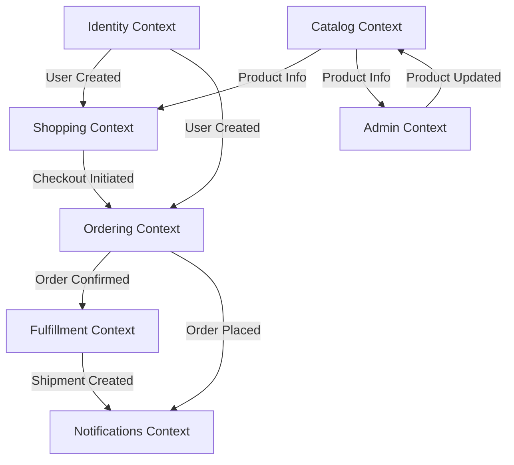
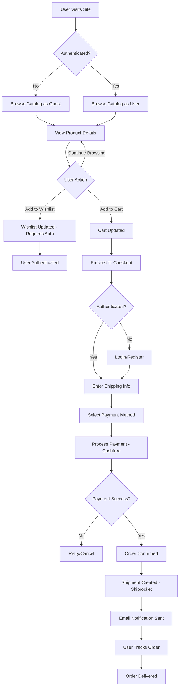

# 📘 Product Requirements Document (PRD)

**Version:** `1.0.0` | **Status:** `Draft`

## Table of Contents

1. Document Information
2. Governance & Workflow Gates
3. Feature Index (Living Blueprints)
4. Product Vision
5. Core Business Problem
6. Target Personas & Primary Use Cases
7. Business Value & Expected Outcomes
8. Success Metrics / KPIs
9. Ubiquitous Language (Glossary)
10. Architectural Overview (DDD – Mandatory)
11. Event Taxonomy Summary
12. Design System Strategy (MCP)
13. Feature Execution Flow
14. Repository Structure & File Standards
15. Feature Blueprint Standard (Stories & Gherkin Scenarios)
16. Traceability & Compliance Matrix
17. Non-Functional Requirements (NFRs)
18. Observability & Analytics Integration
19. Feature Flags Policy (Mandatory)
20. Security & Compliance
21. Risks / Assumptions / Constraints
22. Out of Scope
23. Rollout & Progressive Delivery
24. Appendix

---

## 1. Document Information

| Field              | Details                                        |
| ------------------ | ---------------------------------------------- |
| **Document Title** | `itsme.fashion - Premium Beauty Ecommerce PRD` |
| **File Location**  | `docs/product/PRD.md`                          |
| **Version**        | `1.0.0`                                        |
| **Date**           | `2026-01-24`                                   |
| **Author(s)**      | Product Team                                   |
| **Stakeholders**   | Product Owner, Engineering Lead, UX Lead       |

---

## 2. Governance & Workflow Gates

Delivery is enforced through **explicit workflow gates**.
Execution may be human-driven, agent-driven, or hybrid.

| Gate | Name                    | Owner                | Preconditions                             | Exit Criteria            |
| ---- | ----------------------- | -------------------- | ----------------------------------------- | ------------------------ |
| 1    | Strategic Alignment     | Product Architecture | Vision, context map defined               | Approval recorded        |
| 2    | Blueprint Bootstrapping | Planning Function    | Feature issues created, blueprints linked | Blueprint complete       |
| 3    | Technical Planning      | Engineering          | DDD mapping, flags defined                | Ready for implementation |
| 4    | Implementation          | Engineering          | Code + tests                              | CI green                 |
| 5    | Review                  | Engineering          | Preview deployed                          | Acceptance approved      |
| 6    | Release                 | Product / Ops        | All checks passed                         | Production approved      |

---

## 3. Feature Index (Living Blueprints)

| Feature ID  | Title                           | GitHub Issue | Blueprint Path                               | Status |
| ----------- | ------------------------------- | ------------ | -------------------------------------------- | ------ |
| `TBD-AUTH`  | User Authentication             | TBD          | `docs/features/feat-auth-user-system.md`     | Draft  |
| `TBD-CART`  | Shopping Cart Management        | TBD          | `docs/features/feat-cart-management.md`      | Draft  |
| `TBD-WISH`  | Wishlist Management             | TBD          | `docs/features/feat-wishlist.md`             | Draft  |
| `TBD-CAT`   | Product Catalog & Discovery     | TBD          | `docs/features/feat-catalog-discovery.md`    | Draft  |
| `TBD-CHECK` | Checkout & Payment Processing   | TBD          | `docs/features/feat-checkout-payments.md`    | Draft  |
| `TBD-ORD`   | Order Management & Tracking     | TBD          | `docs/features/feat-order-management.md`     | Draft  |
| `TBD-SHIP`  | Shipping & Fulfillment          | TBD          | `docs/features/feat-shipping-fulfillment.md` | Draft  |
| `TBD-NOTIF` | Notifications & Communications  | TBD          | `docs/features/feat-notifications.md`        | Draft  |
| `TBD-ADMIN` | Admin Product Management        | TBD          | `docs/features/feat-admin-products.md`       | Draft  |
| `TBD-MOBILE` | Mobile-First Responsive Design | TBD          | `docs/features/feat-mobile-responsive.md`    | Draft  |

---

## 4. Product Vision

> Empower people to express their uniqueness with premium, clean, and cruelty-free beauty products delivered through a fast, trustworthy, and elegant shopping experience.

**itsme.fashion** is a premium beauty ecommerce platform that connects conscious consumers with ethical beauty products. We believe beauty should be empowering, transparent, and accessible—not misleading or harmful. Our platform emphasizes natural ingredients, ethical manufacturing practices, and a bold brand tone that celebrates individuality.

### Strategic Direction

We are building a **mobile-first, serverless ecommerce platform** that scales with demand while maintaining performance and user trust. By leveraging Firebase and Google Cloud Platform, we reduce operational overhead and focus on delivering exceptional user experiences.

---

## 5. Core Business Problem

### Primary Problem

**Beauty product consumers struggle to find trustworthy, ethical beauty products through a shopping experience that respects their time, values, and device preferences.**

Existing beauty ecommerce platforms fail in three critical dimensions:

1. **Transparency Gap**: Ingredient lists are buried, certifications are unclear, and ethical claims are unverifiable
2. **Mobile Experience Deficit**: Desktop-first designs force mobile users through sluggish, non-responsive interfaces
3. **Trust Barrier**: Opaque checkout processes, unclear shipping timelines, and poor post-purchase communication erode consumer confidence

### Business Impact

- **Market Opportunity**: The clean beauty market is growing at 8.5% CAGR, yet 72% of consumers report difficulty finding products that match their ethical criteria
- **Revenue Leakage**: Mobile cart abandonment averages 85% in beauty ecommerce due to poor UX
- **Customer Lifetime Value**: Transparent, trustworthy platforms see 3x higher repeat purchase rates

### Why Now?

- Progressive Web App (PWA) technologies enable near-native mobile experiences without app store friction
- Serverless infrastructure reduces time-to-market from months to weeks
- Firebase Authentication and Firestore provide production-ready, scalable identity and data solutions
- Consumers increasingly demand transparency and ethical sourcing

---

## 6. Target Personas & Primary Use Cases

| Persona                 | Description                                                           | Goals                                                              | Key Use Cases                                       |
| ----------------------- | --------------------------------------------------------------------- | ------------------------------------------------------------------ | --------------------------------------------------- |
| **Conscious Consumer**  | Age 25-45, values ethical products, shops primarily via mobile        | Find cruelty-free products quickly, verify ingredient safety       | Browse catalog, filter by ethics badges, checkout   |
| **Beauty Enthusiast**   | Age 18-35, explores new products, influenced by social recommendations | Discover trending products, save favorites, share with friends     | Search, wishlist management, social sharing         |
| **Repeat Buyer**        | Established customer, seeks convenience and trust                     | Reorder favorites quickly, track shipments reliably                | One-click reorder, order history, shipment tracking |
| **Gift Shopper**        | Occasional buyer, needs guidance and reassurance                      | Find appropriate gifts, ensure timely delivery, avoid returns      | Curated collections, multiple addresses, gift notes |
| **Admin/Merchandiser**  | Internal user, manages product catalog and inventory                  | Add products efficiently, update inventory, monitor sales          | Product CRUD, inventory management, analytics       |

---

## 7. Business Value & Expected Outcomes

| Outcome                                | Description                                                      | KPI Alignment        | Priority |
| -------------------------------------- | ---------------------------------------------------------------- | -------------------- | -------- |
| **Increase Mobile Conversion**         | Reduce mobile cart abandonment from 85% to <50%                  | `KPI-01`, `KPI-02`   | High     |
| **Build Trust Through Transparency**   | Display ingredient lists, certifications, and ethics badges      | `KPI-03`, `KPI-04`   | High     |
| **Enable Rapid Scaling**               | Handle 10x traffic spikes without performance degradation        | `KPI-05`             | High     |
| **Reduce Operational Overhead**        | Serverless architecture eliminates infrastructure management     | `KPI-06`             | Medium   |
| **Improve Customer Retention**         | Increase repeat purchase rate from industry avg 27% to 40%       | `KPI-07`             | High     |
| **Streamline Order Fulfillment**       | Integrate Shiprocket for automated label generation and tracking | `KPI-08`             | Medium   |
| **Establish Brand Differentiation**    | Bold, empowering tone differentiates from clinical competitors   | `KPI-03`, `KPI-09`   | Medium   |

---

## 8. Success Metrics / KPIs

| KPI ID    | Name                               | Definition                                         | Baseline | Target  | Source              |
| --------- | ---------------------------------- | -------------------------------------------------- | -------- | ------- | ------------------- |
| `KPI-01`  | Mobile Conversion Rate             | (Mobile Orders / Mobile Sessions) × 100            | 15%      | 50%     | GA4                 |
| `KPI-02`  | Cart Abandonment Rate              | (Abandoned Carts / Initiated Checkouts) × 100      | 85%      | <50%    | GA4                 |
| `KPI-03`  | Product Page Engagement            | Avg time on product pages (seconds)                | 45s      | 90s     | GA4                 |
| `KPI-04`  | Ethics Badge Visibility            | % of users viewing ingredient/certification info   | 0%       | 60%     | GA4 Custom Event    |
| `KPI-05`  | Page Load Time (P95)               | 95th percentile page load time (ms)                | 3000ms   | <1500ms | OTEL / Firestore    |
| `KPI-06`  | Infrastructure Cost per Order      | Monthly GCP costs / Total orders                   | $0       | <$0.50  | GCP Billing API     |
| `KPI-07`  | Repeat Purchase Rate               | (Repeat Customers / Total Customers) × 100         | 0%       | 40%     | Firestore Analytics |
| `KPI-08`  | Order Fulfillment Time             | Hours from order placement to shipment             | N/A      | <24h    | Shiprocket Webhook  |
| `KPI-09`  | Net Promoter Score (NPS)           | Survey-based loyalty metric                        | N/A      | 50+     | Email Survey        |

---

## 9. Ubiquitous Language (Glossary)

All domain terms **must be defined once and reused consistently**.

* **Aggregate** — DDD pattern representing a consistency boundary around a cluster of domain objects
* **Bounded Context** — An explicit boundary within which a domain model is defined and consistent
* **Cart** — A temporary collection of products selected by a user before checkout
* **Checkout** — The multi-step process of converting cart items into a confirmed order
* **Command** — An intent to change system state (CQRS pattern)
* **Cruelty-Free** — Products not tested on animals, certified by recognized authorities
* **CQRS** — Command Query Responsibility Segregation; separating write and read models
* **Customer** — An authenticated user who has completed at least one order
* **Domain Event** — A fact that occurred in the domain, triggering downstream actions
* **Event Sourcing** — Storing state changes as an immutable sequence of events
* **Fulfillment** — The process of preparing and shipping an order to the customer
* **Guest User** — An unauthenticated visitor browsing the platform
* **Line Item** — A single product entry within a cart or order
* **Order** — A confirmed purchase with payment, ready for fulfillment
* **Product** — A sellable item with SKU, description, price, and inventory
* **Query** — A read operation that does not modify state (CQRS pattern)
* **Registered User** — An authenticated user with a Firebase Auth account
* **Shipment** — A physical package tracked through Shiprocket
* **Wishlist** — A persistent collection of products saved by a registered user
* **SKU** — Stock Keeping Unit; unique product identifier
* **Value Object** — An immutable object defined by its attributes, not identity

---

## 10. Architectural Overview (DDD — Mandatory)

### Bounded Contexts

| Context         | Purpose                                           | Core Aggregate    | Entities                      | Value Objects                  |
| --------------- | ------------------------------------------------- | ----------------- | ----------------------------- | ------------------------------ |
| **Identity**    | User authentication and profile management        | `User`            | `User`, `UserProfile`         | `Email`, `UserId`              |
| **Catalog**     | Product discovery, search, and categorization     | `Product`         | `Product`, `Category`         | `ProductId`, `SKU`, `Price`    |
| **Shopping**    | Cart management and wishlist functionality        | `Cart`            | `Cart`, `Wishlist`, `LineItem`| `CartId`, `Quantity`           |
| **Ordering**    | Order creation, payment processing, order history | `Order`           | `Order`, `Payment`            | `OrderId`, `OrderStatus`       |
| **Fulfillment** | Shipping, tracking, and delivery management       | `Shipment`        | `Shipment`, `Address`         | `ShipmentId`, `TrackingNumber` |
| **Notifications**| Email and push notification delivery             | `Notification`    | `Notification`                | `NotificationId`, `Channel`    |
| **Admin**       | Product management and inventory control          | `ProductCatalog`  | `InventoryItem`               | `StockLevel`                   |

### Context Map



### DDD Layering (Service Structure)

```text
src/services/<service>/
├── domain/           # Pure business logic (no external dependencies)
│   ├── aggregates/   # Core domain entities
│   ├── events/       # Domain events
│   └── value-objects/# Immutable value types
├── application/      # Use cases and queries
│   ├── commands/     # Command handlers (mutations)
│   └── queries/      # Query handlers (reads)
└── infrastructure/   # External integrations
    ├── persistence/  # Firestore repositories
    ├── graphql/      # Schema and resolvers
    └── functions/    # Cloud Functions endpoints
```

---

## 11. Event Taxonomy Summary

| Event Name                  | Producer Context   | Consumers                    | Trigger Aggregate |
| --------------------------- | ------------------ | ---------------------------- | ----------------- |
| `UserRegistered`            | Identity           | Shopping, Ordering           | `User`            |
| `UserProfileUpdated`        | Identity           | Ordering                     | `User`            |
| `ProductAdded`              | Catalog            | Shopping, Admin              | `Product`         |
| `ProductUpdated`            | Catalog            | Shopping                     | `Product`         |
| `ProductInventoryChanged`   | Admin              | Catalog                      | `InventoryItem`   |
| `CartItemAdded`             | Shopping           | -                            | `Cart`            |
| `CartItemRemoved`           | Shopping           | -                            | `Cart`            |
| `WishlistItemAdded`         | Shopping           | -                            | `Wishlist`        |
| `CheckoutInitiated`         | Shopping           | Ordering                     | `Cart`            |
| `OrderPlaced`               | Ordering           | Fulfillment, Notifications   | `Order`           |
| `PaymentCompleted`          | Ordering           | Fulfillment                  | `Payment`         |
| `PaymentFailed`             | Ordering           | Notifications                | `Payment`         |
| `OrderShipped`              | Fulfillment        | Ordering, Notifications      | `Shipment`        |
| `ShipmentStatusUpdated`     | Fulfillment        | Notifications                | `Shipment`        |
| `OrderDelivered`            | Fulfillment        | Ordering, Notifications      | `Shipment`        |
| `NotificationSent`          | Notifications      | -                            | `Notification`    |

---

## 12. Design System Strategy (MCP)

All UI must use a **design system delivered via MCP** (Model Context Protocol).

| Parameter          | Value                                          |
| ------------------ | ---------------------------------------------- |
| **MCP Server**     | `TBD - Internal Design System MCP`             |
| **Design System**  | `itsme.fashion Design System`                  |
| **Component Lib**  | Lit Web Components (Declarative Shadow DOM)    |
| **State Model**    | Preact Signals for reactive state management   |
| **Styling**        | CSS-first with native CSS modules              |
| **Accessibility**  | WCAG 2.1 AA compliance mandatory               |

Raw HTML/CSS is prohibited unless explicitly approved in a Feature Blueprint. All components must follow the design system specifications and accessibility standards.

---

## 13. Feature Execution Flow

**Diagram: User Journey through Core Features**



---

## 14. Repository Structure & File Standards

Source of truth is **GitHub**.

```text
/
├── .github/
│   ├── workflows/       # CI/CD pipelines
│   └── skills/          # Agent skills
├── docs/
│   ├── product/         # PRD and planning docs
│   ├── features/        # Feature blueprints
│   └── diagrams/        # Mermaid diagrams
├── src/
│   ├── services/        # Backend services (DDD structure)
│   │   ├── identity/
│   │   ├── catalog/
│   │   ├── shopping/
│   │   ├── ordering/
│   │   ├── fulfillment/
│   │   ├── notifications/
│   │   └── admin/
│   ├── web/             # Frontend Lit components
│   │   ├── components/  # Reusable web components
│   │   ├── pages/       # Page-level components
│   │   └── state/       # Preact signals state
│   ├── shared/          # Cross-cutting concerns
│   │   ├── types/       # TypeScript type definitions
│   │   └── utils/       # Shared utilities
│   └── gateway/         # GraphQL Mesh gateway
├── firebase.json        # Firebase configuration
├── package.json         # Root package config
└── tsconfig.json        # TypeScript configuration
```

---

## 15. Feature Blueprint Standard

Each feature blueprint **must include**:

1. **Metadata** (issue URL, status, feature ID)
2. **Deployment Plan** (Feature Flag defined)
3. **User Stories (Vertical Slices)** — Independently deployable increments
4. **Scenarios — Gherkin (Mandatory)** — Executable acceptance criteria

### Gherkin Format

All scenarios must follow standard Gherkin syntax:

```gherkin
Feature: <Feature Name>

  Scenario: <Scenario Title>
    Given <initial context>
    When <action performed>
    Then <expected outcome>
    
  Scenario: <Edge Case Title>
    Given <edge context>
    When <action performed>
    Then <expected handling>
```

### Example Feature Blueprint Structure

```markdown
# Feature Blueprint: User Authentication

**Feature ID:** `TBD-AUTH`  
**GitHub Issue:** `#TBD`  
**Status:** `Draft`

## Deployment Plan

**Feature Flag:** `feature_fe_auth_fl_001_identity_enabled`

## User Stories

### Story 1: Email/Password Registration
As a new visitor, I want to register with email and password so that I can save my preferences and order history.

### Story 2: Email/Password Login
As a registered user, I want to log in with my credentials so that I can access my wishlist and checkout.

## Scenarios (Gherkin)

[Detailed Gherkin scenarios...]
```

---

## 16. Traceability & Compliance Matrix

| Feature ID   | Flag ID     | Flag Key                                     | Bounded Context   | Status |
| ------------ | ----------- | -------------------------------------------- | ----------------- | ------ |
| `TBD-AUTH`   | `FL-001`    | `feature_fe_auth_fl_001_identity_enabled`    | Identity          | Draft  |
| `TBD-CART`   | `FL-002`    | `feature_fe_cart_fl_002_shopping_enabled`    | Shopping          | Draft  |
| `TBD-WISH`   | `FL-003`    | `feature_fe_wish_fl_003_shopping_enabled`    | Shopping          | Draft  |
| `TBD-CAT`    | `FL-004`    | `feature_fe_cat_fl_004_catalog_enabled`      | Catalog           | Draft  |
| `TBD-CHECK`  | `FL-005`    | `feature_fe_check_fl_005_ordering_enabled`   | Ordering          | Draft  |
| `TBD-ORD`    | `FL-006`    | `feature_fe_ord_fl_006_ordering_enabled`     | Ordering          | Draft  |
| `TBD-SHIP`   | `FL-007`    | `feature_fe_ship_fl_007_fulfillment_enabled` | Fulfillment       | Draft  |
| `TBD-NOTIF`  | `FL-008`    | `feature_fe_notif_fl_008_notif_enabled`      | Notifications     | Draft  |
| `TBD-ADMIN`  | `FL-009`    | `feature_fe_admin_fl_009_admin_enabled`      | Admin             | Draft  |
| `TBD-MOBILE` | `FL-010`    | `feature_fe_mobile_fl_010_responsive_enabled`| Cross-cutting     | Draft  |

---

## 17. Non-Functional Requirements (NFRs)

| Metric                     | ID       | Target          | Tool                  |
| -------------------------- | -------- | --------------- | --------------------- |
| Page Load Time (P95)       | `NFR-01` | <1500ms         | OTEL, Lighthouse      |
| Time to Interactive (TTI)  | `NFR-02` | <2000ms         | Lighthouse            |
| API Response Time (P95)    | `NFR-03` | <500ms          | OTEL                  |
| Lighthouse Performance     | `NFR-04` | >90             | Lighthouse CI         |
| Lighthouse Accessibility   | `NFR-05` | 100             | Lighthouse CI         |
| Lighthouse SEO             | `NFR-06` | 100             | Lighthouse CI         |
| Mobile Viewport Coverage   | `NFR-07` | 320px-768px     | Responsive Testing    |
| Concurrent Users (Peak)    | `NFR-08` | 10,000          | Load Testing          |
| Database Writes/Second     | `NFR-09` | 1,000           | Firestore Monitoring  |
| Error Rate                 | `NFR-10` | <0.1%           | OTEL Error Tracking   |
| Uptime                     | `NFR-11` | 99.9%           | GCP Monitoring        |
| WCAG Compliance Level      | `NFR-12` | AA              | Axe DevTools          |

---

## 18. Observability & Analytics Integration

Mandatory tooling:

| Category                | Tool/Service           | Purpose                                |
| ----------------------- | ---------------------- | -------------------------------------- |
| **Analytics**           | Google Analytics 4     | User behavior, conversion tracking     |
| **Telemetry**           | OpenTelemetry (OTEL)   | Distributed tracing, metrics           |
| **Logging**             | Cloud Logging          | Structured logs from Cloud Functions   |
| **Error Tracking**      | OTEL + Cloud Logging   | Exception monitoring and alerting      |
| **Real User Monitoring**| Web Vitals API         | Core Web Vitals measurement            |
| **Performance**         | Lighthouse CI          | Automated performance audits           |
| **Uptime Monitoring**   | GCP Monitoring         | Service health checks                  |

### Instrumentation Requirements

- All Cloud Functions must emit structured logs with trace IDs
- All GraphQL resolvers must be traced with OTEL spans
- All user interactions must emit GA4 events
- All errors must include stack traces and context

---

## 19. Feature Flags Policy (Mandatory)

### Naming Convention (Enforced)

All feature flags must follow this exact format:

```
feature_fe_[feature_issue]_fl_[flag_issue]_[context]_enabled
```

Example: `feature_fe_auth_fl_001_identity_enabled`

### Implementation

- **Provider**: Firebase Remote Config
- **Scope**: Per-environment (dev, staging, production)
- **Defaults**: All flags default to `false`
- **Access**: Feature flags control both frontend component rendering and backend feature availability

### Lifecycle

1. **Creation**: Flag created during feature blueprint phase
2. **Development**: Flag enables feature in dev/staging only
3. **Beta**: Flag enables feature for % of production users
4. **GA**: Flag set to 100% after validation period (minimum 7 days)
5. **Cleanup**: Flag removed in subsequent release after 100% rollout confirmed stable

### Rollout Strategy

- 0% → 10% → 25% → 50% → 100%
- Minimum 24 hours between increments
- Automatic rollback trigger if error rate exceeds 0.5%

---

## 20. Security & Compliance

### Authentication & Authorization

- Firebase Authentication handles identity management
- JWT tokens validate API requests
- Role-based access control (RBAC) for admin functions: **Single admin role with full access at launch**
- Session timeout: 30 days with "remember me", 24 hours without
- **Guest checkout enabled**: Users can complete orders without account creation (email collected for confirmation)
- **Wishlist access**: Requires authentication; unauthenticated users blocked with auth prompt

### Data Protection

- **PII Storage**: Firestore with encryption at rest (GCP default)
- **Payment Data**: Never stored; processed via Cashfree PCI-compliant gateway with auto-retry on failure (1 attempt)
- **Passwords**: Hashed by Firebase Auth (bcrypt + salt)
- **HTTPS Only**: All traffic TLS 1.3 minimum
- **Cart Data**: Browser session storage only (cleared on tab/browser close)
- **Product Data**: Display current catalog data in order history (not snapshotted)

### Input Validation

- Server-side validation on all mutations
- GraphQL schema enforces type safety
- Firestore security rules enforce access control
- Rate limiting: 100 requests/minute per user

### Compliance

- **GDPR**: User data deletion on request (PII deleted, order records anonymized for analytics)
- **CCPA**: Data access and portability support
- **PCI DSS**: Cashfree handles payment processing
- **Accessibility**: WCAG 2.1 AA compliance
- **Email Opt-Out**: Users can opt out of all email notifications including order confirmations

### Security Monitoring

- Cloud Armor for DDoS protection
- Firestore security rules audit logs
- Authentication anomaly detection via Firebase Auth
- Dependency vulnerability scanning (npm audit, Dependabot)

---

## 21. Risks / Assumptions / Constraints

| Type        | Description                                                                 | Mitigation                                                    |
| ----------- | --------------------------------------------------------------------------- | ------------------------------------------------------------- |
| **Risk**    | Firebase vendor lock-in limits future platform flexibility                  | Abstract persistence behind repository pattern                |
| **Risk**    | Cashfree payment gateway downtime blocks checkout                           | Implement auto-retry logic (1 retry), fallback to manual order processing |
| **Risk**    | Shiprocket API changes break fulfillment integration                        | Version pinning, webhook validation with polling fallback, integration tests |
| **Risk**    | Mobile performance degrades with large product catalogs                     | Implement infinite scroll, image lazy loading, CDN caching. Performance is non-negotiable—reduce features if needed |
| **Risk**    | Event sourcing complexity increases debugging difficulty                    | Structured logging, event replay tooling, staging environment |
| **Risk**    | Cart inventory reserved at add-time creates long-held reservations          | Implement reservation timeout (30 minutes), release on expiry |
| **Risk**    | Guest checkout without accounts reduces customer retention                  | Prompt account creation post-purchase, incentivize registration |
| **Assumption** | Users have modern browsers (ES2022+, baseline 2023+)                     | Display browser compatibility notice for older browsers       |
| **Assumption** | Average order value: $50-$100 justifies transaction fees                 | Monitor economics, adjust pricing if needed                   |
| **Assumption** | Firebase free tier sufficient for first 6 months                         | Monitor usage, budget for scale                               |
| **Assumption** | English (US) language sufficient for initial market                      | i18n infrastructure ready for future expansion                |
| **Assumption** | Admin manually verifying ethics badges is sustainable at scale           | Monitor admin workload, plan automation for growth            |
| **Constraint** | Team has limited backend experience, serverless reduces ops overhead     | Invest in Firebase/GCP training, leverage managed services    |
| **Constraint** | No native mobile apps initially, PWA provides sufficient UX              | Validate PWA engagement before app investment                 |
| **Constraint** | Single currency (USD) at launch, no localization                         | Clearly communicate USD-only in product materials             |
| **Constraint** | Cart persistence is browser session-only (cleared on close)              | Communicate clearly to users, consider local storage in v2    |
| **Constraint** | Single admin role (no granular permissions) at launch                    | Limit admin access to trusted users, plan RBAC for v2         |

---

## 22. Out of Scope

The following are **explicitly excluded** from the initial release:

### Deferred to Future Releases

- **User-Generated Content**: Product reviews, ratings, Q&A
- **Social Features**: Wishlists sharing, product recommendations, referral programs
- **Subscription Model**: Auto-replenish, subscription boxes
- **Multi-Currency Support**: International pricing and payments (USD only, no localization)
- **Native Mobile Apps**: iOS and Android applications
- **Marketplace Model**: Third-party sellers and multi-vendor support
- **Advanced Personalization**: AI-driven product recommendations (search uses relevance scoring only)
- **Loyalty Program**: Points, rewards, VIP tiers
- **Gift Cards**: Digital and physical gift card sales
- **Live Chat Support**: Real-time customer service chat
- **Video Content**: Product tutorials, ingredient deep-dives
- **Blog/Content Hub**: Educational content beyond product pages
- **Multi-Language Support**: English (US) only at launch
- **Split Orders**: Cannot ship single order to multiple addresses
- **Post-Shipment Cancellation**: User cannot cancel after shipment
- **Advanced Admin Roles**: Granular permissions deferred to v2
- **Return/Refund Flow**: Not included in initial release

### Clarified Scope Boundaries

- **Order Cancellation**: User can cancel before shipment only; admin manual cancellation not system-supported
- **Partial Shipments**: Available items ship immediately, remainder backordered
- **Inventory Management**: Reservation occurs at cart addition (30-minute timeout)
- **Shipping Integration**: Shiprocket webhook with polling fallback (fixed schedule)
- **GraphQL Resilience**: Partial data with error extensions (no circuit breaker)
- **Testing Scope**: Firestore emulator only (Auth, Functions, Storage not emulated locally)
- **Ethics Badge Verification**: Manual admin process based on supplier certifications

### Permanently Out of Scope

- **Physical Retail Integration**: In-store pickup, POS integration
- **Prescription Products**: Medical or pharmaceutical beauty products
- **Marketplace Listings**: User-to-user resale or trading
- **Cryptocurrency Payments**: Bitcoin, Ethereum, stablecoins

---

## 23. Rollout & Progressive Delivery

### Phase 1: Internal Alpha (Weeks 1-2)

- **Audience**: Development team (5 users)
- **Scope**: Core features functional, manual testing
- **Success Criteria**: Zero blocking bugs, end-to-end checkout works
- **Feature Flags**: All features at 0% public, 100% internal

### Phase 2: Limited Beta (Weeks 3-4)

- **Audience**: 50 invited users (friends, family, early supporters)
- **Scope**: Full feature set, Firebase Analytics enabled
- **Success Criteria**: <2% error rate, positive feedback from 80% of users
- **Feature Flags**: Gradual rollout to beta cohort (0% → 100%)

### Phase 3: Controlled Rollout (Weeks 5-6)

- **Audience**: 500 users via targeted marketing
- **Scope**: Production environment, full monitoring
- **Success Criteria**: Conversion rate >30%, mobile performance meets NFRs
- **Feature Flags**: Gradual rollout (10% → 25% → 50%)

### Phase 4: General Availability (Week 7+)

- **Audience**: Public launch, unrestricted access
- **Scope**: All features enabled, full marketing push
- **Success Criteria**: Scale to 10,000 concurrent users, maintain <0.1% error rate
- **Feature Flags**: 100% rollout, begin flag cleanup after 7 days of stability

### Rollback Plan

- **Trigger**: Error rate >0.5%, conversion rate drop >20%, payment processing failure
- **Action**: Revert feature flags to 0%, investigate root cause, hotfix if needed
- **Communication**: Status page update, email to affected users

---

## 24. Appendix

### References

- [Firebase Documentation](https://firebase.google.com/docs)
- [GraphQL Mesh Documentation](https://the-guild.dev/graphql/mesh)
- [Lit Framework Documentation](https://lit.dev)
- [Domain-Driven Design (Eric Evans)](https://www.domainlanguage.com/ddd/)
- [CQRS Pattern (Martin Fowler)](https://martinfowler.com/bliki/CQRS.html)
- [Cashfree Payment Gateway API](https://docs.cashfree.com/docs)
- [Shiprocket API Documentation](https://apidocs.shiprocket.in/)

### Supporting Documents

- `docs/product/implementation-roadmap.md` — Feature roadmap and dependencies (TBD)
- `docs/features/` — Individual feature blueprints (TBD)
- `docs/diagrams/` — Architecture and flow diagrams (TBD)

### Glossary Expansion

Additional domain-specific terms will be added to Section 9 as features are specified.

### Change Log

| Version | Date       | Author       | Changes             |
| ------- | ---------- | ------------ | ------------------- |
| 1.0.0   | 2026-01-24 | Product Team | Initial PRD created |

---

**End of Document**
