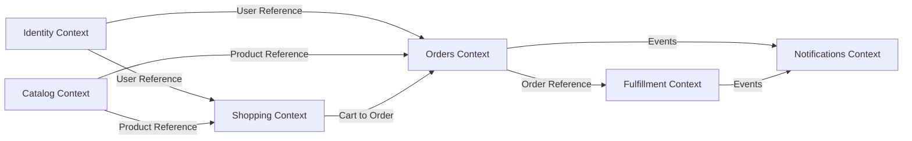
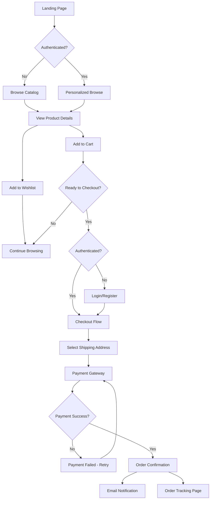
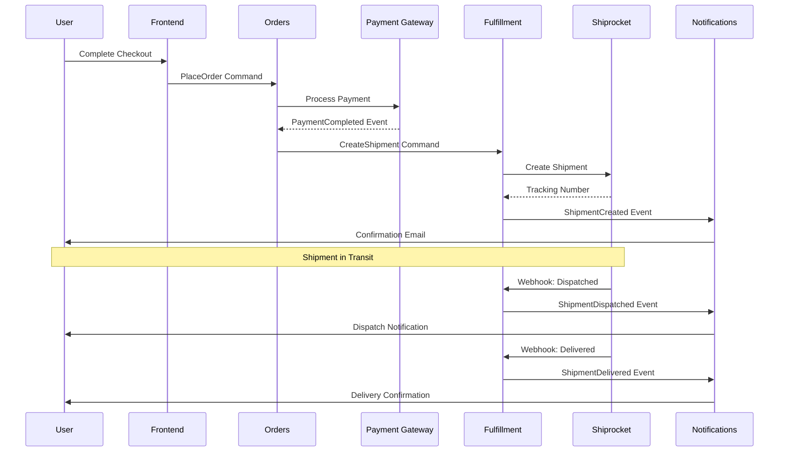

# 📘 Product Requirements Document (PRD)

**Version:** `1.0.0` | **Status:** `Draft`

## Table of Contents

1. Document Information
2. Governance & Workflow Gates
3. Feature Index (Living Blueprints)
4. Product Vision
5. Core Business Problem
6. Target Personas & Primary Use Cases
7. Business Value & Expected Outcomes
8. Success Metrics / KPIs
9. Ubiquitous Language (Glossary)
10. Architectural Overview (DDD – Mandatory)
11. Event Taxonomy Summary
12. Design System Strategy (MCP)
13. Feature Execution Flow
14. Repository Structure & File Standards
15. Feature Blueprint Standard (Stories & Gherkin Scenarios)
16. Traceability & Compliance Matrix
17. Non-Functional Requirements (NFRs)
18. Observability & Analytics Integration
19. Feature Flags Policy (Mandatory)
20. Security & Compliance
21. Risks / Assumptions / Constraints
22. Out of Scope
23. Rollout & Progressive Delivery
24. Appendix

---

## 1. Document Information

| Field              | Details                           |
| ------------------ | --------------------------------- |
| **Document Title** | `itsme.fashion Strategic PRD`     |
| **File Location**  | `docs/product/PRD.md`             |
| **Version**        | `1.0.0`                           |
| **Date**           | `2026-01-24`                      |
| **Author(s)**      | Product Team                      |
| **Stakeholders**   | Product, Engineering, Operations  |

---

## 2. Governance & Workflow Gates

Delivery is enforced through **explicit workflow gates**.
Execution may be human-driven, agent-driven, or hybrid.

| Gate | Name                    | Owner                | Preconditions                             | Exit Criteria            |
| ---- | ----------------------- | -------------------- | ----------------------------------------- | ------------------------ |
| 1    | Strategic Alignment     | Product Architecture | Vision, context map defined               | Approval recorded        |
| 2    | Blueprint Bootstrapping | Planning Function    | Feature issues created, blueprints linked | Blueprint complete       |
| 3    | Technical Planning      | Engineering          | DDD mapping, flags defined                | Ready for implementation |
| 4    | Implementation          | Engineering          | Code + tests                              | CI green                 |
| 5    | Review                  | Engineering          | Preview deployed                          | Acceptance approved      |
| 6    | Release                 | Product / Ops        | All checks passed                         | Production approved      |

---

## 3. Feature Index (Living Blueprints)

| Feature ID | Title                      | GitHub Issue | Blueprint Path                                | Status  |
| ---------- | -------------------------- | ------------ | --------------------------------------------- | ------- |
| TBD        | User Authentication        | TBD          | `docs/features/feat-001-user-auth.md`         | Pending |
| TBD        | Product Catalog            | TBD          | `docs/features/feat-002-product-catalog.md`   | Pending |
| TBD        | Shopping Cart              | TBD          | `docs/features/feat-003-shopping-cart.md`     | Pending |
| TBD        | Wishlist                   | TBD          | `docs/features/feat-004-wishlist.md`          | Pending |
| TBD        | Checkout & Payment         | TBD          | `docs/features/feat-005-checkout-payment.md`  | Pending |
| TBD        | Order Management           | TBD          | `docs/features/feat-006-order-management.md`  | Pending |
| TBD        | Shipment Tracking          | TBD          | `docs/features/feat-007-shipment-tracking.md` | Pending |

---

## 4. Product Vision

Empower people to express their uniqueness with premium, clean, and cruelty-free beauty products delivered through a fast, trustworthy, and elegant shopping experience.

**itsme.fashion** aims to become the trusted destination for conscious consumers seeking premium beauty products that emphasize natural ingredients, ethical manufacturing, and sustainable practices, all delivered through a modern, mobile-first ecommerce platform.

---

## 5. Core Business Problem

Conscious consumers seeking premium beauty products with natural ingredients and ethical manufacturing face significant barriers in online shopping:

1. **Trust & Transparency Gap**: Users cannot easily verify product ingredients, ethical certifications, or manufacturing practices, leading to purchase hesitation and abandoned carts.

2. **Fragmented Shopping Experience**: Existing beauty ecommerce platforms fail to provide seamless mobile-first experiences, forcing users through clunky desktop-oriented flows that increase friction and decrease conversion.

3. **Post-Purchase Anxiety**: After purchase, customers experience uncertainty due to poor order visibility and shipment tracking, resulting in increased support requests and reduced repeat purchase rates.

4. **Discovery Friction**: Users struggle to find products matching their specific needs (skin type, hair concerns, ethical preferences) due to poor categorization and search capabilities.

These problems result in:
- High cart abandonment rates (industry avg: 70-85%)
- Low customer lifetime value due to poor retention
- Increased customer service overhead
- Missed revenue from users who can't find what they need

---

## 6. Target Personas & Primary Use Cases

| Persona                    | Description                                                                 | Goals                                                             | Key Use Cases                                       |
| -------------------------- | --------------------------------------------------------------------------- | ----------------------------------------------------------------- | --------------------------------------------------- |
| **Conscious Millennial**   | Age 25-40, values sustainability, researches products before purchase       | Find cruelty-free, natural products; verify ethical claims       | Browse by ethical markers, read ingredient lists    |
| **Mobile-First Shopper**   | Age 18-35, shops primarily on mobile, expects instant gratification         | Complete purchase quickly on mobile; track orders in real-time   | Add to cart, checkout, track shipment—all on phone |
| **Beauty Enthusiast**      | Age 22-45, follows trends, explores new products, builds collections        | Discover new products; save favorites; manage wishlists          | Search, filter, save to wishlist, repeat purchase  |
| **Gift Buyer**             | Age 25-50, purchasing for others, needs reliability and presentation        | Quick purchase flow; reliable delivery; order tracking           | Browse, checkout, track, ensure timely delivery    |
| **Returning Customer**     | Existing user, seeks convenience and loyalty rewards                        | Fast re-order; access order history; manage multiple addresses   | View order history, saved addresses, quick checkout |

---

## 7. Business Value & Expected Outcomes

| Outcome                           | Description                                                         | KPI Alignment | Priority |
| --------------------------------- | ------------------------------------------------------------------- | ------------- | -------- |
| **Increased Conversion Rate**     | Reduce cart abandonment through seamless mobile-first checkout      | KPI-001       | High     |
| **Higher Customer Lifetime Value**| Drive repeat purchases via wishlist and order history features      | KPI-002       | High     |
| **Reduced Support Overhead**      | Decrease support tickets through self-service order tracking        | KPI-003       | Medium   |
| **Improved Product Discovery**    | Increase product views and cart additions via enhanced search       | KPI-004       | High     |
| **Trust & Brand Loyalty**         | Build trust through transparent ethical markers and ingredient info | KPI-005       | High     |
| **Operational Efficiency**        | Automate order fulfillment and tracking via Shiprocket integration  | KPI-006       | Medium   |

---

## 8. Success Metrics / KPIs

| KPI ID  | Name                        | Definition                                            | Baseline | Target   | Source               |
| ------- | --------------------------- | ----------------------------------------------------- | -------- | -------- | -------------------- |
| KPI-001 | Cart Abandonment Rate       | % of carts not converted to orders                    | 75%      | <50%     | GA4 + Firestore     |
| KPI-002 | Customer Lifetime Value     | Average revenue per customer over 12 months           | $0       | $150     | Firestore Analytics  |
| KPI-003 | Support Ticket Volume       | Number of order-related support tickets per month     | Unknown  | <100     | Support System       |
| KPI-004 | Product Discovery Rate      | % of sessions with product view after search          | Unknown  | >60%     | GA4                  |
| KPI-005 | Repeat Purchase Rate        | % of customers making 2+ purchases within 6 months    | 0%       | >35%     | Firestore Analytics  |
| KPI-006 | Order Processing Time       | Time from order placement to shipment handoff         | Unknown  | <24hrs   | Firestore Events     |
| KPI-007 | Mobile Conversion Rate      | % of mobile sessions converting to orders             | Unknown  | >3%      | GA4                  |
| KPI-008 | Average Order Value         | Average transaction value                             | $0       | $75      | Firestore Analytics  |

---

## 9. Ubiquitous Language (Glossary)

All domain terms **must be defined once and reused consistently**.

* **Product** — A beauty item available for purchase (cosmetic, skin care, or hair care product)
* **Cart** — Temporary collection of products a user intends to purchase
* **Wishlist** — Saved collection of products for future consideration (requires authentication)
* **Order** — Confirmed purchase transaction with payment and shipping details
* **Shipment** — Physical delivery of an order tracked via carrier integration
* **Ethical Marker** — Badge indicating product attributes (cruelty-free, vegan, paraben-free, natural)
* **Aggregate** — DDD term for a cluster of domain objects treated as a single unit
* **Bounded Context** — DDD term for a logical boundary within which a domain model is defined
* **Command** — Write operation that changes system state
* **Query** — Read operation that retrieves data without side effects
* **Domain Event** — Fact about something that happened in the domain (e.g., OrderPlaced, PaymentCompleted)
* **Session** — User's interaction period, persisted for cart continuity across visits

---

## 10. Architectural Overview (DDD — Mandatory)

### Bounded Contexts

| Context             | Purpose                                      | Core Aggregate  | Entities                        | Value Objects                      |
| ------------------- | -------------------------------------------- | --------------- | ------------------------------- | ---------------------------------- |
| **Identity**        | User authentication and profile management   | User            | User, AuthToken                 | Email, Password, UserRole          |
| **Catalog**         | Product information and discovery            | Product         | Product, Category               | ProductId, Price, Ingredients, EthicalMarker |
| **Shopping**        | Cart and wishlist management                 | Cart, Wishlist  | CartItem, WishlistItem          | Quantity, ProductReference         |
| **Orders**          | Order lifecycle and payment processing       | Order           | Order, OrderLine, Payment       | OrderId, OrderStatus, PaymentStatus, Address |
| **Fulfillment**     | Shipment and delivery tracking               | Shipment        | Shipment, TrackingEvent         | ShipmentId, CarrierInfo, TrackingNumber |
| **Notifications**   | Event-driven communication                   | Notification    | EmailNotification               | NotificationStatus, TemplateId     |

### Context Map



### DDD Layer Structure (per service)

```
src/services/<service>/
├── domain/           # Pure business logic (no external dependencies)
│   ├── aggregates/   # Core domain entities
│   ├── events/       # Domain events
│   └── value-objects/# Immutable value types
├── application/      # Use cases and queries
│   ├── commands/     # Command handlers (mutations)
│   └── queries/      # Query handlers (reads)
└── infrastructure/   # External integrations
    ├── persistence/  # Firestore repositories
    ├── graphql/      # Schema and resolvers
    └── functions/    # Cloud Functions endpoints
```

---

## 11. Event Taxonomy Summary

| Event Name             | Producer Context | Consumers                      | Trigger Aggregate |
| ---------------------- | ---------------- | ------------------------------ | ----------------- |
| UserRegistered         | Identity         | Notifications                  | User              |
| UserLoggedIn           | Identity         | Analytics (via OTEL)           | User              |
| ProductViewed          | Catalog          | Analytics                      | Product           |
| ProductAddedToCart     | Shopping         | Analytics                      | Cart              |
| ProductAddedToWishlist | Shopping         | Notifications                  | Wishlist          |
| CartAbandoned          | Shopping         | Notifications (recovery email) | Cart              |
| OrderPlaced            | Orders           | Fulfillment, Notifications     | Order             |
| PaymentCompleted       | Orders           | Fulfillment, Notifications     | Order             |
| PaymentFailed          | Orders           | Notifications                  | Order             |
| ShipmentCreated        | Fulfillment      | Notifications                  | Shipment          |
| ShipmentDispatched     | Fulfillment      | Notifications                  | Shipment          |
| ShipmentDelivered      | Fulfillment      | Notifications, Orders          | Shipment          |

---

## 12. Design System Strategy (MCP)

All UI must use a **design system delivered via MCP**.

| Parameter         | Value                                  |
| ----------------- | -------------------------------------- |
| **MCP Server**    | `staystack-design-system`              |
| **Design System** | `itsme-fashion-ds`                     |
| **Component Library** | Lit Web Components with Preact Signals |
| **CSS Strategy**  | Declarative Shadow DOM, CSS-first      |
| **i18n Support**  | lit-localize                           |

Raw HTML/CSS is prohibited unless explicitly approved in a Feature Blueprint.

---

## 13. Feature Execution Flow

### User Journey: Browse to Purchase



### Order Fulfillment Flow



---

## 14. Repository Structure & File Standards

Source of truth is **GitHub**.

```
/
├── .github/
│   ├── workflows/        # CI/CD automation
│   └── skills/           # Agent Skills
├── docs/
│   ├── product/          # PRD and planning docs
│   ├── features/         # Feature blueprints
│   └── diagrams/         # Architecture diagrams
├── src/
│   ├── frontend/         # Lit web components
│   │   ├── components/   # Reusable components
│   │   ├── pages/        # Page-level components
│   │   └── state/        # Preact signals stores
│   ├── services/         # Backend microservices
│   │   ├── identity/     # User authentication
│   │   ├── catalog/      # Product catalog
│   │   ├── shopping/     # Cart & wishlist
│   │   ├── orders/       # Order management
│   │   ├── fulfillment/  # Shipment tracking
│   │   └── notifications/# Email notifications
│   ├── shared/           # Shared types & utilities
│   └── gateway/          # GraphQL Mesh gateway
├── firebase.json         # Firebase config
├── package.json          # Root workspace config
└── README.md
```

---

## 15. Feature Blueprint Standard

Each feature blueprint **must include**:

1. **Metadata** (issue URL, status, epic reference)
2. **Deployment Plan** (Feature Flag defined)
3. **Stories (Vertical Slices)** - User stories delivering end-to-end value
4. **Scenarios — Gherkin (Mandatory)** - Executable acceptance criteria

### Gherkin Format

```gherkin
Feature: User Authentication

Scenario: Successful user registration
  Given I am on the registration page
  When I enter valid email "user@example.com"
  And I enter valid password "SecurePass123!"
  And I submit the registration form
  Then I should see a confirmation message
  And I should receive a verification email
  And my account should be created in Firebase Auth

Scenario: Registration with existing email
  Given an account exists with email "existing@example.com"
  When I attempt to register with email "existing@example.com"
  Then I should see an error "Email already in use"
  And the registration should not proceed
```

---

## 16. Traceability & Compliance Matrix

| Feature ID | Flag ID | Flag Key                       | Bounded Context | Status  |
| ---------- | ------- | ------------------------------ | --------------- | ------- |
| TBD        | TBD     | `feature_user_auth`            | Identity        | Pending |
| TBD        | TBD     | `feature_product_catalog`      | Catalog         | Pending |
| TBD        | TBD     | `feature_shopping_cart`        | Shopping        | Pending |
| TBD        | TBD     | `feature_wishlist`             | Shopping        | Pending |
| TBD        | TBD     | `feature_checkout_payment`     | Orders          | Pending |
| TBD        | TBD     | `feature_order_management`     | Orders          | Pending |
| TBD        | TBD     | `feature_shipment_tracking`    | Fulfillment     | Pending |
| TBD        | TBD     | `feature_email_notifications`  | Notifications   | Pending |

---

## 17. Non-Functional Requirements (NFRs)

| Metric                   | ID      | Target                  | Tool / Validation              |
| ------------------------ | ------- | ----------------------- | ------------------------------ |
| **Page Load Time**       | NFR-001 | <2s (mobile 3G)         | Lighthouse, Core Web Vitals    |
| **Time to Interactive**  | NFR-002 | <3s (mobile 3G)         | Lighthouse, Core Web Vitals    |
| **API Response Time**    | NFR-003 | <500ms (p95)            | OpenTelemetry, Cloud Monitoring|
| **Availability**         | NFR-004 | 99.9% uptime            | Firebase Status, Cloud Monitoring|
| **Mobile Responsiveness**| NFR-005 | 100% features on mobile | Manual testing, Playwright     |
| **Accessibility**        | NFR-006 | WCAG 2.1 Level AA       | axe-core, Lighthouse           |
| **Security**             | NFR-007 | HTTPS, Auth tokens      | Firebase Auth, Security Rules  |
| **SEO**                  | NFR-008 | Lighthouse Score >90    | Lighthouse SEO audit           |
| **Scalability**          | NFR-009 | 10K concurrent users    | Load testing, Cloud Functions  |
| **Data Privacy**         | NFR-010 | GDPR compliant          | Privacy policy, data handling  |

---

## 18. Observability & Analytics Integration

| Component             | Tool                 | Purpose                                    |
| --------------------- | -------------------- | ------------------------------------------ |
| **Frontend Analytics**| Google Analytics 4   | User behavior, conversion tracking         |
| **Error Tracking**    | OpenTelemetry        | Frontend and backend error monitoring      |
| **Performance**       | Firebase Performance | Real-time app performance metrics          |
| **Trace Propagation** | OpenTelemetry        | Distributed tracing across microservices   |
| **Custom Events**     | Firestore Events     | Domain event publishing and subscription   |
| **User Journey**      | GA4 + BigQuery       | Funnel analysis, user flow visualization   |

### Key Events to Track

- `page_view` (all pages)
- `product_view`
- `add_to_cart`
- `add_to_wishlist`
- `begin_checkout`
- `purchase`
- `search` (with query term)
- `user_engagement`

---

## 19. Feature Flags Policy (Mandatory)

All features **must** be deployed behind feature flags using Firebase Remote Config.

### Flag Naming Convention

```
feature_<context>_<feature_name>
```

Examples:
- `feature_identity_user_auth`
- `feature_catalog_product_search`
- `feature_orders_checkout_payment`

### Flag Lifecycle

1. **Development**: Flag = `false` (off by default)
2. **Internal Testing**: Flag = `true` for dev environment
3. **Beta Rollout**: Flag = `true` for 10% of users
4. **General Availability**: Flag = `true` for 100% of users
5. **Deprecation**: Flag removed after 2 release cycles

### Flag Configuration

All flags must define:
- Default value (boolean)
- Targeting rules (user segments, percentage rollouts)
- Expiration date (for temporary flags)

---

## 20. Security & Compliance

### Authentication & Authorization

- **Firebase Authentication** for user identity
- **JWT tokens** for API authorization
- **Security Rules** for Firestore and Storage
- **HTTPS only** for all communications

### Data Protection

- **PII Handling**: Minimal data collection, encrypted at rest
- **GDPR Compliance**: Right to access, right to be forgotten
- **Payment Security**: PCI-DSS compliant via Cashfree
- **Session Management**: Secure cookies, token expiration

### Security Testing

- **Dependency Scanning**: Automated via GitHub Actions
- **Secret Management**: Environment variables via Firebase config
- **OWASP Top 10**: Regular security audits
- **Rate Limiting**: API throttling via Cloud Functions

---

## 21. Risks / Assumptions / Constraints

### Risks

| Risk                              | Impact | Likelihood | Mitigation                                    |
| --------------------------------- | ------ | ---------- | --------------------------------------------- |
| Payment gateway downtime          | High   | Low        | Implement retry logic, user notifications     |
| Firebase cost overruns            | Medium | Medium     | Set budget alerts, optimize queries           |
| Poor mobile performance           | High   | Medium     | Implement lazy loading, optimize assets       |
| Inventory sync issues             | Medium | Low        | Build reconciliation process, monitoring      |
| Cart abandonment email spam       | Low    | Medium     | Implement cool-down period, unsubscribe       |

### Assumptions

1. **User Base**: Targeting English-speaking markets initially (US, UK, CA, AU)
2. **Device Distribution**: 70% mobile, 30% desktop traffic expected
3. **Payment Methods**: Cashfree supports required payment types (cards, UPI, wallets)
4. **Shipping**: Shiprocket covers target geographies and delivery times
5. **Compliance**: No special regulatory requirements beyond GDPR and PCI-DSS
6. **Infrastructure**: Firebase services (Firestore, Functions, Auth, Storage) meet scale requirements
7. **Team Skills**: Engineering team familiar with TypeScript, Lit, GraphQL, DDD patterns

### Constraints

1. **Budget**: Firebase free tier limitations require cost optimization
2. **Timeline**: MVP launch target within 6 months
3. **Team Size**: Small team requires leveraging managed services
4. **Technical Debt**: No existing codebase to migrate from (greenfield)
5. **Third-Party Dependencies**: Limited to Firebase, Cashfree, Shiprocket integrations
6. **Browser Support**: Latest 2 versions of Chrome, Safari, Firefox, Edge only
7. **Mobile OS**: iOS 14+, Android 10+

---

## 22. Out of Scope

The following features are **explicitly excluded** from the initial release:

1. **Loyalty Programs**: Points, rewards, referral programs
2. **Social Features**: User reviews, ratings, community forums
3. **Subscription Model**: Auto-replenishment, subscription boxes
4. **Multi-language Support**: Only English in v1
5. **Multi-currency**: Only USD initially
6. **B2B Features**: Wholesale pricing, bulk orders
7. **Advanced Personalization**: ML-based recommendations
8. **Live Chat Support**: Customer service chat widget
9. **Gift Cards**: Digital gift card purchases and redemption
10. **Product Bundles**: Multi-product promotional bundles
11. **Affiliate Program**: Partner/influencer tracking
12. **Mobile Apps**: Native iOS/Android apps (PWA only)
13. **Video Content**: Product videos, tutorials
14. **Virtual Try-On**: AR/VR beauty try-on features
15. **Inventory Management**: Admin inventory control panel

These may be considered for future releases based on user feedback and business metrics.

---

## 23. Rollout & Progressive Delivery

### Phase 1: MVP Launch (Months 1-3)

**Goal**: Establish core purchase flow

- User authentication (email/password)
- Product catalog (browse, filter, search)
- Shopping cart (add, update, remove)
- Checkout & payment (Cashfree integration)
- Order confirmation emails
- Basic order history

**Success Criteria**: 100 completed orders, <60% cart abandonment

### Phase 2: Retention Features (Months 4-5)

**Goal**: Drive repeat purchases

- Wishlist functionality
- Enhanced order tracking (Shiprocket integration)
- Shipment status notifications
- Multiple shipping addresses

**Success Criteria**: 25% repeat purchase rate, <100 support tickets/month

### Phase 3: Discovery Enhancement (Month 6)

**Goal**: Improve product discovery

- Enhanced search (autocomplete, filters)
- Category navigation improvements
- Product recommendations (basic algorithm)
- Mobile performance optimization

**Success Criteria**: >60% product discovery rate, <2s page load time

### Feature Flag Strategy

Each phase will use progressive rollout:
1. Internal testing (dev environment)
2. Beta group (5% of users)
3. Limited release (25% of users)
4. General availability (100% of users)

Rollback triggers:
- Error rate >5%
- Performance degradation >20%
- Payment failure rate >10%

---

## 24. Appendix

### Related Documents

- `docs/product/implementation-roadmap.md` — Feature sequencing and dependencies
- `docs/features/` — Individual feature blueprints (to be generated)
- `docs/diagrams/` — Technical architecture diagrams

### Change Log

| Version | Date       | Author       | Changes                          |
| ------- | ---------- | ------------ | -------------------------------- |
| 1.0.0   | 2026-01-24 | Product Team | Initial PRD creation             |

### Approvals

| Role                | Name | Date | Signature |
| ------------------- | ---- | ---- | --------- |
| Product Owner       | TBD  | TBD  | TBD       |
| Engineering Lead    | TBD  | TBD  | TBD       |
| Architecture Review | TBD  | TBD  | TBD       |

---

**End of Document**
