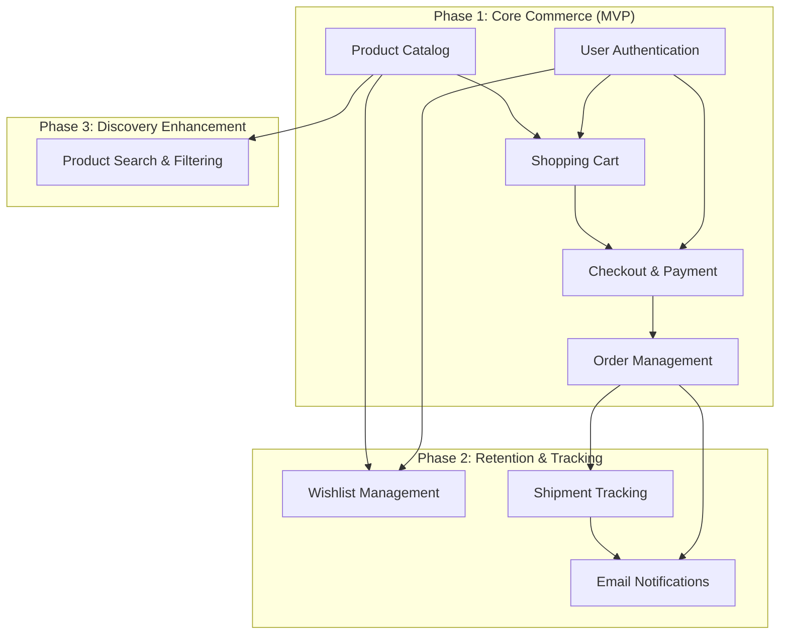

# Implementation Roadmap

> Generated from PRD v1.0.0 | Status: Draft

## Feature Dependency Diagram

---

## Phase 1: Core Commerce (MVP)

### Feature 1.1: User Authentication

**Description**: Enable users to register, login, and manage their accounts using email/password via Firebase Authentication.

**User Outcome**: Users can create accounts and securely access their personalized data (cart, orders, wishlist).

**Bounded Context**: Identity

**Depends on**: None (foundational capability)

**Acceptance Criteria**:
- User can register with email and password
- User can login with valid credentials
- User receives email verification after registration
- User can reset forgotten password
- Session persists across browser sessions
- Invalid credentials show appropriate error messages

---

### Feature 1.2: Product Catalog

**Description**: Display browsable product listings with details, images, ingredient information, and ethical markers.

**User Outcome**: Users can discover and learn about available beauty products with full transparency about ingredients and ethical attributes.

**Bounded Context**: Catalog

**Depends on**: None (foundational capability)

**Acceptance Criteria**:
- Products display with name, price, image, and description
- Product detail page shows full ingredient list
- Ethical markers (cruelty-free, vegan, paraben-free) are visible
- Products are organized by categories (Skin Care, Hair Care, Cosmetics)
- Product images load from Firebase Storage
- Mobile-responsive product grid layout

---

### Feature 1.3: Shopping Cart

**Description**: Allow users to add, update, remove, and persist products in a shopping cart across sessions.

**User Outcome**: Users can collect products they intend to purchase and return to their cart later without losing items.

**Bounded Context**: Shopping

**Depends on**: User Authentication, Product Catalog

**Acceptance Criteria**:
- User can add product to cart from product page
- User can adjust quantity of cart items
- User can remove items from cart
- Cart persists across sessions (authenticated users)
- Cart displays subtotal and item count
- Guest carts persist via session storage
- Cart is accessible from all pages (header icon)

---

### Feature 1.4: Checkout & Payment

**Description**: Enable users to complete purchases by selecting shipping address and paying via Cashfree payment gateway.

**User Outcome**: Users can securely complete purchases and receive order confirmation.

**Bounded Context**: Orders

**Depends on**: User Authentication, Shopping Cart

**Acceptance Criteria**:
- User can enter or select shipping address
- User can review order summary before payment
- Payment processed via Cashfree gateway
- Payment success creates confirmed order
- Payment failure allows retry without data loss
- User redirected to order confirmation page after success
- Order confirmation includes order number and details

---

### Feature 1.5: Order Management

**Description**: Provide users with access to their order history and detailed order information.

**User Outcome**: Users can view past orders, track their status, and access order details for reference.

**Bounded Context**: Orders

**Depends on**: Checkout & Payment

**Acceptance Criteria**:
- User can view list of all past orders
- Order list shows order number, date, total, and status
- User can click to view detailed order information
- Order details show products, quantities, pricing, shipping address
- Order status updates as fulfillment progresses
- Orders sorted by date (most recent first)

---

## Phase 2: Retention & Tracking

### Feature 2.1: Wishlist Management

**Description**: Allow authenticated users to save products for later consideration and future purchase.

**User Outcome**: Users can bookmark products they're interested in and easily return to them without searching again.

**Bounded Context**: Shopping

**Depends on**: User Authentication, Product Catalog

**Acceptance Criteria**:
- User can add product to wishlist from product page
- User can view all wishlist items
- User can remove items from wishlist
- User can add wishlist item directly to cart
- Wishlist accessible from user account menu
- Wishlist icon shows saved item count
- Only available to authenticated users

---

### Feature 2.2: Shipment Tracking

**Description**: Integrate with Shiprocket to provide real-time shipment tracking and delivery status updates.

**User Outcome**: Users can track their orders from warehouse to doorstep with current location and estimated delivery date.

**Bounded Context**: Fulfillment

**Depends on**: Order Management

**Acceptance Criteria**:
- Order detail page shows tracking number once shipped
- Tracking number links to carrier tracking page
- Shipment status updates via Shiprocket webhooks
- User sees current shipment status (Dispatched, In Transit, Delivered)
- Estimated delivery date displayed when available
- Delivery confirmation updates order status
- Tracking events stored for order history

---

### Feature 2.3: Email Notifications

**Description**: Send automated email notifications for order lifecycle events via Firebase extensions.

**User Outcome**: Users receive timely updates about their orders without needing to check the website.

**Bounded Context**: Notifications

**Depends on**: Order Management, Shipment Tracking

**Acceptance Criteria**:
- Order confirmation email sent after successful payment
- Shipment dispatch email sent with tracking link
- Delivery confirmation email sent when package delivered
- Emails use branded templates
- Emails include relevant order details and links
- Users can unsubscribe from marketing emails (not transactional)
- Email delivery failures logged for monitoring

---

## Phase 3: Discovery Enhancement

### Feature 3.1: Product Search & Filtering

**Description**: Enable users to search for products by keyword and filter by category, price, and ethical attributes.

**User Outcome**: Users can quickly find specific products or narrow down options based on their preferences and needs.

**Bounded Context**: Catalog

**Depends on**: Product Catalog

**Acceptance Criteria**:
- Search box with keyword input on all pages
- Search results display matching products
- Filter by category (Skin Care, Hair Care, Cosmetics)
- Filter by price range (slider or input)
- Filter by ethical markers (cruelty-free, vegan, paraben-free)
- Multiple filters can be applied simultaneously
- Search and filters work together (AND logic)
- Results update without full page reload
- No results state shows helpful message
- Search query persists in URL for sharing

---

## Feature Summary Table

| ID  | Feature Name                | Phase   | Bounded Context | Dependencies                  | Status  |
| --- | --------------------------- | ------- | --------------- | ----------------------------- | ------- |
| 1.1 | User Authentication         | Phase 1 | Identity        | None                          | Pending |
| 1.2 | Product Catalog             | Phase 1 | Catalog         | None                          | Pending |
| 1.3 | Shopping Cart               | Phase 1 | Shopping        | 1.1, 1.2                      | Pending |
| 1.4 | Checkout & Payment          | Phase 1 | Orders          | 1.1, 1.3                      | Pending |
| 1.5 | Order Management            | Phase 1 | Orders          | 1.4                           | Pending |
| 2.1 | Wishlist Management         | Phase 2 | Shopping        | 1.1, 1.2                      | Pending |
| 2.2 | Shipment Tracking           | Phase 2 | Fulfillment     | 1.5                           | Pending |
| 2.3 | Email Notifications         | Phase 2 | Notifications   | 1.5, 2.2                      | Pending |
| 3.1 | Product Search & Filtering  | Phase 3 | Catalog         | 1.2                           | Pending |

---

## Rollout Strategy

### Phase 1 Target: 3 months from start

**Goal**: Enable end-to-end purchase flow

**Success Metrics**:
- 100 completed orders
- <60% cart abandonment rate
- <3s page load time on mobile

### Phase 2 Target: 2 months after Phase 1

**Goal**: Drive repeat purchases and reduce support overhead

**Success Metrics**:
- 25% repeat purchase rate
- <100 support tickets/month
- >90% email delivery rate

### Phase 3 Target: 1 month after Phase 2

**Goal**: Improve product discovery and conversion

**Success Metrics**:
- >60% product discovery rate (search → view)
- >3% mobile conversion rate
- <2s page load time

---

## Technical Considerations

### Infrastructure

All features leverage:
- **Firebase Cloud Functions (2nd gen)** for serverless compute
- **Cloud Firestore** for data persistence
- **Firebase Authentication** for identity
- **Firebase Storage** for product images
- **GraphQL Mesh** for API gateway with graphql-yoga subgraphs

### DDD Architecture

Each feature maps to one or more bounded contexts with strict DDD layering:
- **Domain Layer**: Pure business logic, aggregates, events, value objects
- **Application Layer**: Command/query handlers
- **Infrastructure Layer**: Firestore repositories, GraphQL resolvers, Cloud Functions

### Feature Flags

All features deployed behind Firebase Remote Config flags:
- `feature_identity_user_auth`
- `feature_catalog_product_catalog`
- `feature_shopping_cart`
- `feature_orders_checkout_payment`
- `feature_orders_order_management`
- `feature_shopping_wishlist`
- `feature_fulfillment_shipment_tracking`
- `feature_notifications_email`
- `feature_catalog_search_filtering`

### Testing Strategy

Each feature requires:
- Unit tests for domain logic (Node.js test runner)
- Integration tests for application layer
- E2E tests for user flows (Playwright)
- Local testing via Firebase Emulators

---

## Out of Scope (Reaffirmed)

The following remain explicitly excluded from this roadmap:

- Loyalty programs and rewards
- User reviews and ratings
- Subscription models
- Multi-language support (English only)
- Multi-currency support (USD only)
- B2B features
- ML-based personalization
- Live chat support
- Gift cards
- Product bundles
- Affiliate program
- Native mobile apps
- Video content
- AR/VR try-on features
- Admin inventory management UI

These may be considered for future roadmap planning based on MVP learnings.

---

**End of Roadmap**
