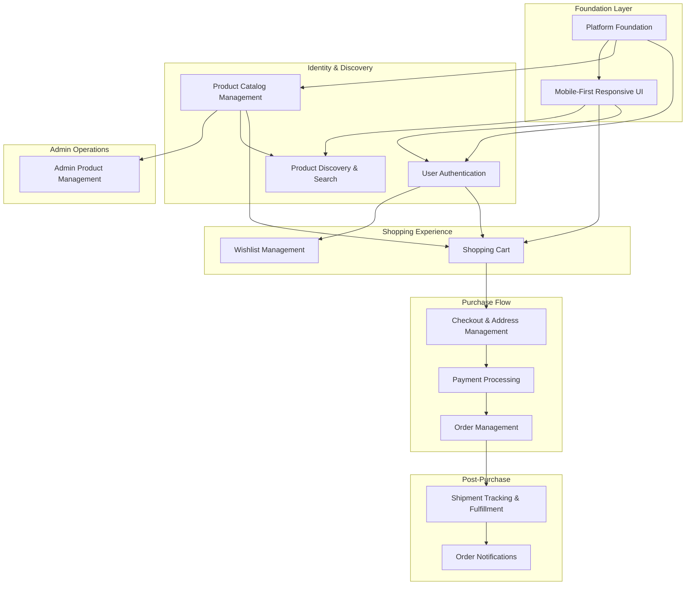

# Implementation Roadmap

**Product**: itsme.fashion Premium Beauty Ecommerce Platform  
**Status**: Draft  
**Date**: 2026-01-24

---

## Feature Dependency Diagram

---

## Phase 1: Foundation & Infrastructure

### F-001: Platform Foundation

- **Description**: Establish monorepo structure, Firebase configuration, GraphQL Mesh gateway, DDD service scaffolding, and build tooling for the entire platform.
- **Depends on**: None
- **Bounded Contexts**: Cross-cutting
- **Key Outcomes**:
  - npm workspace monorepo configured
  - Firebase project initialized with Firestore, Auth, Functions, Storage, Remote Config
  - GraphQL Mesh gateway configured for subgraph federation
  - TypeScript build pipeline with esbuild
  - DDD folder structure for all bounded contexts (Identity, Catalog, Shopping, Ordering, Fulfillment, Notifications, Admin)
  - CI/CD pipeline with GitHub Actions
  - Firestore emulator setup for local development

### F-002: Mobile-First Responsive UI Foundation

- **Description**: Establish design system using Lit web components, Preact Signals state management, and responsive CSS framework optimized for 320px-768px viewports.
- **Depends on**: F-001 (Platform Foundation)
- **Bounded Contexts**: Cross-cutting (Frontend)
- **Key Outcomes**:
  - Lit web component library initialized
  - Declarative Shadow DOM templates
  - Preact Signals global state setup
  - Responsive CSS utilities (mobile-first)
  - WCAG 2.1 AA accessibility baseline
  - PWA configuration (service worker, manifest)
  - Core Web Vitals monitoring (OTEL + Lighthouse CI)

---

## Phase 2: Identity & Discovery

### F-003: User Authentication

- **Description**: Enable email/password registration and login via Firebase Authentication with guest checkout support and session management.
- **Depends on**: F-001 (Platform Foundation)
- **Bounded Contexts**: Identity
- **Key Outcomes**:
  - Firebase Auth integration (email/password)
  - User registration with email verification
  - Login with session management (24h default, 30d remember-me)
  - Guest checkout flow (email collection only)
  - JWT token validation for GraphQL requests
  - User profile creation on registration
  - GraphQL mutations: `register`, `login`, `logout`
  - GraphQL queries: `currentUser`

### F-004: Product Catalog Management

- **Description**: Define and store product data with categories, descriptions, ingredient lists, ethics badges, SKUs, pricing, and inventory levels.
- **Depends on**: F-001 (Platform Foundation)
- **Bounded Contexts**: Catalog
- **Key Outcomes**:
  - Product aggregate with value objects (ProductId, SKU, Price)
  - Category hierarchy (Skin Care, Hair Care, Cosmetics)
  - Ethics badges (cruelty-free, paraben-free, vegan) as product attributes
  - Ingredient list support
  - Product image storage (Firebase Storage)
  - Inventory tracking (stock levels)
  - GraphQL queries: `products`, `product(id)`, `productsByCategory`
  - Firestore schema: `products` collection

### F-005: Product Discovery & Search

- **Description**: Enable users to browse products by category, search by keyword with relevance scoring, and filter by ethics badges.
- **Depends on**: F-004 (Product Catalog Management)
- **Bounded Contexts**: Catalog
- **Key Outcomes**:
  - Category filtering UI and GraphQL resolvers
  - Full-text search with Firestore (relevance scoring)
  - Ethics badge filters (cruelty-free, paraben-free, vegan)
  - Sorting options (relevance, price ascending/descending)
  - Infinite scroll pagination
  - Mobile-optimized product grid layout
  - GraphQL queries: `searchProducts(query, filters)`, `productsByCategory(category, filters)`

---

## Phase 3: Shopping Experience

### F-006: Shopping Cart

- **Description**: Allow users to add, update, and remove products from a session-based cart with inventory reservation and quantity management.
- **Depends on**: F-003 (User Authentication), F-004 (Product Catalog Management)
- **Bounded Contexts**: Shopping
- **Key Outcomes**:
  - Cart aggregate with LineItem entities
  - Browser session storage (cleared on tab/browser close)
  - Add to cart, update quantity, remove item operations
  - Inventory reservation at cart addition (30-minute timeout)
  - Automatic reservation release on timeout or cart abandonment
  - Cart total calculation
  - GraphQL mutations: `addToCart`, `updateCartItem`, `removeFromCart`, `clearCart`
  - GraphQL queries: `cart`
  - Guest cart support (session-based)

### F-007: Wishlist Management

- **Description**: Enable authenticated users to save products to a persistent wishlist for later consideration.
- **Depends on**: F-003 (User Authentication)
- **Bounded Contexts**: Shopping
- **Key Outcomes**:
  - Wishlist aggregate linked to User
  - Firestore persistence (`wishlists` collection)
  - Add to wishlist, remove from wishlist operations
  - Authentication gate: block unauthenticated users with prompt
  - GraphQL mutations: `addToWishlist`, `removeFromWishlist`
  - GraphQL queries: `wishlist`
  - Wishlist item count badge in UI

---

## Phase 4: Checkout & Payment

### F-008: Checkout & Address Management

- **Description**: Collect shipping address, enable multiple saved addresses, and manage checkout session state leading to payment.
- **Depends on**: F-006 (Shopping Cart)
- **Bounded Contexts**: Ordering
- **Key Outcomes**:
  - Address value object (street, city, state, zip, country)
  - User can save multiple addresses
  - Single address selection per order (no split shipments)
  - Guest checkout address collection
  - Checkout session creation from cart
  - GraphQL mutations: `initiateCheckout`, `saveAddress`, `selectShippingAddress`
  - GraphQL queries: `userAddresses`, `checkoutSession`

### F-009: Payment Processing

- **Description**: Integrate Cashfree payment gateway for secure payment collection with auto-retry on failure and order confirmation.
- **Depends on**: F-008 (Checkout & Address Management)
- **Bounded Contexts**: Ordering
- **Key Outcomes**:
  - Cashfree SDK integration
  - Payment initiation from checkout session
  - Auto-retry logic (1 retry on failure)
  - Payment success/failure handling
  - Order creation on successful payment
  - PCI-compliant payment flow (no card data stored)
  - GraphQL mutations: `processPayment`, `retryPayment`
  - Firestore: `payments` collection
  - Domain events: `PaymentCompleted`, `PaymentFailed`

---

## Phase 5: Order & Fulfillment

### F-010: Order Management

- **Description**: Create orders from successful payments, display order history, and enable user-initiated cancellation before shipment.
- **Depends on**: F-009 (Payment Processing)
- **Bounded Contexts**: Ordering
- **Key Outcomes**:
  - Order aggregate with OrderId, OrderStatus (pending, confirmed, shipped, delivered, cancelled)
  - Order creation on payment completion
  - Order history for authenticated users
  - Guest order lookup via email + order number
  - User can cancel order before shipment (status: pending or confirmed)
  - Product data displayed from current catalog (not snapshotted)
  - GraphQL mutations: `cancelOrder`
  - GraphQL queries: `orders`, `order(id)`, `guestOrder(email, orderNumber)`
  - Firestore: `orders` collection
  - Domain events: `OrderPlaced`, `OrderCancelled`

### F-011: Shipment Tracking & Fulfillment

- **Description**: Integrate Shiprocket for label generation, shipment creation, and tracking updates with webhook and polling fallback.
- **Depends on**: F-010 (Order Management)
- **Bounded Contexts**: Fulfillment
- **Key Outcomes**:
  - Shiprocket API integration
  - Automatic shipment creation on order confirmation
  - Shipment aggregate with ShipmentId, TrackingNumber, ShipmentStatus
  - Webhook endpoint for Shiprocket status updates
  - Polling fallback (fixed schedule) for webhook failures
  - Partial shipment support (ship available items, backorder remainder)
  - Tracking link displayed to user
  - GraphQL queries: `shipment(orderId)`, `trackingDetails(trackingNumber)`
  - Firestore: `shipments` collection
  - Domain events: `OrderShipped`, `ShipmentStatusUpdated`, `OrderDelivered`

### F-012: Order Notifications

- **Description**: Send email notifications for order confirmation, shipment updates, and delivery confirmation via Firebase Extensions.
- **Depends on**: F-011 (Shipment Tracking & Fulfillment)
- **Bounded Contexts**: Notifications
- **Key Outcomes**:
  - Firebase Extension: Trigger Email from Firestore
  - Email templates (order confirmation, shipment tracking, delivery)
  - Notification triggered by domain events: `OrderPlaced`, `OrderShipped`, `OrderDelivered`
  - User opt-out support (all emails including transactional)
  - Email delivery tracking
  - Notification aggregate with NotificationId, Channel (email), Status (sent, failed)
  - Firestore: `notifications` collection
  - GraphQL queries: `notificationPreferences`
  - GraphQL mutations: `updateNotificationPreferences`

---

## Phase 6: Admin Operations

### F-013: Admin Product Management

- **Description**: Enable admin users to create, update, and delete products with inventory management and ethics badge assignment.
- **Depends on**: F-004 (Product Catalog Management)
- **Bounded Contexts**: Admin, Catalog
- **Key Outcomes**:
  - Admin authentication check (single admin role, full access)
  - CRUD operations for products (create, read, update, delete)
  - Inventory level updates (stock quantity)
  - Ethics badge management (cruelty-free, paraben-free, vegan) based on supplier certifications
  - Product image upload (Firebase Storage)
  - Category assignment
  - GraphQL mutations: `createProduct`, `updateProduct`, `deleteProduct`, `updateInventory`
  - Admin UI (Lit components) for product management
  - Firestore security rules: admin-only write access

---

## Phase 7: Quality & Observability

### F-014: Analytics & Monitoring

- **Description**: Integrate Google Analytics 4 for user behavior tracking, OpenTelemetry for distributed tracing, and Real User Monitoring for Core Web Vitals.
- **Depends on**: F-002 (Mobile-First Responsive UI Foundation)
- **Bounded Contexts**: Cross-cutting
- **Key Outcomes**:
  - Google Analytics 4 integration
  - Custom event tracking (product views, add to cart, checkout initiated, purchase)
  - OpenTelemetry SDK for Cloud Functions and GraphQL resolvers
  - Distributed tracing with trace IDs
  - Web Vitals API for LCP, FID, CLS measurement
  - Lighthouse CI in GitHub Actions
  - Cloud Logging structured logs
  - Error tracking with stack traces
  - KPI dashboard for monitoring (conversion rate, cart abandonment, page load time)

### F-015: Feature Flags & Progressive Rollout

- **Description**: Implement Firebase Remote Config for feature flag management with gradual rollout capability (0% → 10% → 25% → 50% → 100%).
- **Depends on**: F-001 (Platform Foundation)
- **Bounded Contexts**: Cross-cutting
- **Key Outcomes**:
  - Firebase Remote Config integration
  - Feature flag naming convention: `feature_fe_[feature_issue]_fl_[flag_issue]_[context]_enabled`
  - Per-environment flag configuration (dev, staging, production)
  - Frontend component rendering gated by flags
  - Backend feature availability gated by flags
  - Gradual rollout support (percentage-based targeting)
  - Automatic rollback trigger on error rate >0.5%
  - Flag cleanup workflow after 100% rollout stable for 7 days
  - Flag status tracking in traceability matrix

---

## Feature Summary Table

| Feature ID | Feature Name                        | Phase | Bounded Context(s)        | Dependencies     |
| ---------- | ----------------------------------- | ----- | ------------------------- | ---------------- |
| F-001      | Platform Foundation                 | 1     | Cross-cutting             | None             |
| F-002      | Mobile-First Responsive UI Foundation | 1     | Cross-cutting (Frontend)  | F-001            |
| F-003      | User Authentication                 | 2     | Identity                  | F-001            |
| F-004      | Product Catalog Management          | 2     | Catalog                   | F-001            |
| F-005      | Product Discovery & Search          | 2     | Catalog                   | F-004            |
| F-006      | Shopping Cart                       | 3     | Shopping                  | F-003, F-004     |
| F-007      | Wishlist Management                 | 3     | Shopping                  | F-003            |
| F-008      | Checkout & Address Management       | 4     | Ordering                  | F-006            |
| F-009      | Payment Processing                  | 4     | Ordering                  | F-008            |
| F-010      | Order Management                    | 5     | Ordering                  | F-009            |
| F-011      | Shipment Tracking & Fulfillment     | 5     | Fulfillment               | F-010            |
| F-012      | Order Notifications                 | 5     | Notifications             | F-011            |
| F-013      | Admin Product Management            | 6     | Admin, Catalog            | F-004            |
| F-014      | Analytics & Monitoring              | 7     | Cross-cutting             | F-002            |
| F-015      | Feature Flags & Progressive Rollout | 7     | Cross-cutting             | F-001            |

---

## Implementation Notes

- **Phases are logical groupings, not strict waterfall stages**: Features within a phase can be developed in parallel where dependencies allow
- **Critical Path**: F-001 → F-003 → F-004 → F-006 → F-008 → F-009 → F-010 → F-011 → F-012
- **Early Wins**: F-002 (UI Foundation) and F-015 (Feature Flags) should be prioritized to enable parallel development and safe rollouts
- **Guest vs Authenticated Flows**: F-003 (Authentication) is a dependency for wishlist but not for cart or checkout (guest checkout enabled)
- **Admin Independence**: F-013 (Admin Product Management) can be developed in parallel with shopping features once F-004 (Catalog) is complete

---

## Excluded from Roadmap

The following are explicitly **NOT** included in this roadmap (deferred or out of scope per PRD Section 22):

- User-generated content (reviews, ratings)
- Social features (wishlist sharing, recommendations)
- Subscription models
- Multi-currency or multi-language support
- Native mobile apps
- Advanced personalization (AI recommendations)
- Loyalty programs
- Gift cards
- Live chat support
- Blog/content hub
- Split orders to multiple addresses
- Post-shipment user-initiated cancellation
- Advanced admin role permissions
- Return/refund flow

---

**End of Roadmap**
